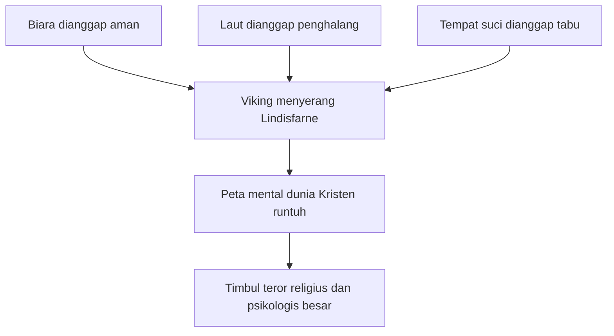
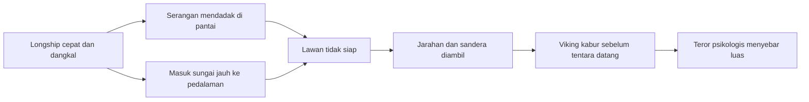
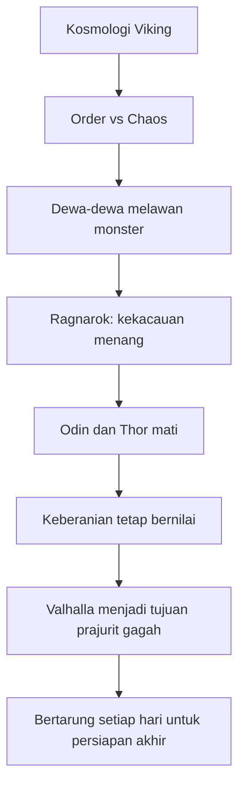

## ⚔️ Pendahuluan: Viking Bukan Sekadar Perampok, tetapi Kekuatan Sejarah yang Mengubah Dunia

Dalam imajinasi modern, **Viking** sering muncul sebagai sosok yang sangat mudah dikenali: pria besar berambut panjang, membawa kapak, turun dari kapal panjang, berteriak, membakar desa, lalu menghilang ke cakrawala 🌊🔥. Gambaran itu tidak sepenuhnya salah, tetapi terlalu sempit. Viking memang identik dengan kekerasan, penjarahan, dan teror. Namun kalau kita berhenti di situ, kita gagal memahami hal yang jauh lebih penting: **mereka bukan hanya penghancur, melainkan juga penghubung dunia, pembangun negara, pembuka jalur perdagangan, penjelajah samudra, dan akselerator sejarah Eropa.**

Percakapan Lex Fridman dengan Lars Brownworth yang Mas Hendra kirim sangat menarik karena tidak memperlakukan Viking sekadar sebagai “orang barbar yang menyerang biara.” Ia memandang mereka sebagai fenomena sejarah yang jauh lebih besar. Viking bukan hanya kelompok penjahat laut. Mereka adalah bangsa maritim Nordik yang, dalam waktu kurang dari tiga abad, memaksa Eropa untuk berubah.

Mereka menghancurkan rasa aman dunia Kristen abad pertengahan. Mereka menguji batas teknologi pelayaran. Mereka membuka rute dari Skandinavia ke Inggris, Prancis, Rusia, Konstantinopel, dunia Islam, Islandia, Greenland, bahkan Amerika Utara lima abad sebelum Columbus. Mereka juga menunjukkan pola yang sangat khas: **datang sebagai penyerbu, bertahan sebagai pedagang, lalu berubah menjadi pembangun institusi.**

Inilah paradoks Viking. Mereka tampak seperti lambang kekacauan, tetapi justru melalui kekacauan itu mereka mempercepat pembentukan tatanan baru. Mereka meruntuhkan struktur yang lemah, lalu—kadang dengan sangat pragmatis—mengambil alih apa yang berguna dan membangun sesuatu yang lebih kuat. Dari sinilah lahir Normandia, dari sinilah Inggris dibentuk ulang, dari sinilah jaringan perdagangan utara-timur tumbuh, dan dari sinilah sebagian wajah Eropa modern ikut dibentuk.

Artikel ini akan membedah dunia Viking secara mendalam dan lengkap: mulai dari serangan Lindisfarne tahun 793, psikologi teror yang mereka tebarkan, teknologi **longship** (*kapal panjang Viking*), tokoh semi-legendaris seperti **Ragnar Lothbrok**, mitologi **Valhalla**, prajurit **berserker**, ekspansi ke Inggris dan Prancis, sampai penjelajahan ke Vinland dan keterlibatan mereka dengan Kekaisaran Bizantium. Kalau ada istilah asing penting, saya sertakan padanan Indonesianya agar tetap nyaman diikuti 📚.

<Callout type="important" title="Tesis utama artikel ini">
Viking penting dalam sejarah bukan hanya karena mereka brutal, tetapi karena mereka memadukan keberanian ekstrem, teknologi pelayaran yang revolusioner, pragmatisme sosial-politik, dan semangat eksplorasi yang membuat mereka menjadi agen perubahan besar dalam dunia abad pertengahan.
</Callout>

---

## 🗓️ 1. Mengapa Tahun 793 Menjadi Titik Awal Zaman Viking?

Secara konvensional, **Viking Age** (*Zaman Viking*) sering diberi rentang dari **793 M hingga 1066 M**. Mengapa dimulai pada 793? Karena pada tahun itulah terjadi salah satu serangan paling mengguncang dalam sejarah Eropa awal abad pertengahan: penjarahan **Lindisfarne**, pulau suci dan komunitas monastik di pesisir timur laut Inggris.

Pada Juni 793, sekelompok Viking—kemungkinan besar berasal dari Norwegia—datang ke Lindisfarne, membunuh banyak penghuni biara, membakar sebagian bangunan, merampas benda berharga, lalu pergi. Jika dilihat dari sudut pandang militer murni, ini mungkin “hanya” satu raid atau serangan mendadak. Tetapi dari sudut pandang psikologis dan simbolik, efeknya sangat besar 😨.

Mengapa demikian? Karena Lindisfarne bukan sekadar lokasi kaya. Ia adalah **ruang suci**. Dalam imajinasi Kristen saat itu, biara adalah tempat yang dipisahkan dari kekacauan dunia. Para biarawan hidup untuk doa, studi kitab suci, dan penyalinan naskah. Mereka memilih tempat terpencil justru untuk mendekat kepada Tuhan dan menjauh dari dosa dunia. Pulau-pulau di utara dianggap aman justru karena laut dipandang sebagai penghalang, bukan jalur invasi.

Maka ketika ancaman datang justru dari laut, dan yang dihancurkan adalah tempat yang dianggap paling sakral dan paling aman, bukan hanya bangunan yang runtuh—**seluruh peta mental dunia mereka ikut retak.**

Bagi para biarawan dan penulis Kristen, serangan ini terasa seperti kiamat kecil. Dunia yang mereka kenal mendadak berubah. Laut bukan lagi batas aman. Gereja bukan lagi tempat yang tidak tersentuh. “Bangsa pagan” dari utara bukan hanya musuh, tetapi tampak seperti makhluk yang tidak tunduk pada kontrak moral mana pun yang dikenal dunia Kristen.

---

## 😱 2. Mengapa Viking Begitu Menghancurkan Secara Psikologis?

Kengerian yang ditimbulkan Viking tidak bisa dijelaskan hanya lewat jumlah korban atau harta yang dijarah. Yang lebih menentukan adalah **cara mereka memecahkan asumsi dasar masyarakat abad pertengahan**.

Ada setidaknya tiga asumsi yang dihancurkan Viking:

### A. Tempat suci seharusnya aman
Dalam masyarakat Kristen awal abad pertengahan, gereja dan biara punya status perlindungan moral. Bahkan hukum kadang memberi hak suaka bagi orang yang masuk ke gereja. Menyerang tempat suci berarti melanggar salah satu tabu tertinggi.

### B. Laut seharusnya menjadi pelindung
Banyak komunitas religius memilih pulau terpencil justru karena aksesnya sulit. Mereka tidak mengira laut akan menjadi jalan tol bagi predator.

### C. Semua orang beradab tahu garis yang tidak boleh dilanggar
Viking datang sebagai pihak yang tampak sama sekali tidak mengakui batas moral itu. Mereka bukan hanya menyerang; mereka menyerang **yang paling tak terbayangkan untuk diserang**.

Inilah sebabnya Alcuin dan penulis sezamannya menggambarkan Viking hampir sebagai monster. Bukan karena mereka benar-benar monster biologis, tetapi karena mereka bertindak di luar kerangka moral yang dipahami lawan-lawannya. Dalam kondisi seperti itu, musuh terasa bukan hanya kuat, tetapi **tidak manusiawi**.

---

## 🧭 3. Siapa Sebenarnya Viking?

Ini pertanyaan yang tampak sederhana, tetapi sebenarnya cukup rumit. Dalam banyak sumber Latin, Franka, atau Anglo-Saxon, para penyerang dari utara sering disebut secara serampangan sebagai:

- **Danes** (*orang Denmark*),
- **Northmen** (*orang-orang utara*),
- **pagans** (*kaum pagan/non-Kristen*),
- atau **heathens** (*kaum kafir dalam istilah sumber Kristen saat itu*).

Masalahnya, penyebutan ini tidak selalu akurat. Tidak semua Viking berasal dari Denmark. Ada yang dari Norwegia, ada yang dari Swedia, dan dunia Nordik saat itu berbagi banyak unsur bahasa dan budaya. Jadi kata “Viking” lebih baik dipahami bukan sebagai satu bangsa tunggal modern, melainkan sebagai **fenomena sosial-budaya dan aktivitas maritim-raiding dari masyarakat Nordik Skandinavia.**

Yang juga penting: menurut penjelasan Brownworth, **Viking bukan pekerjaan utama mereka**. Mereka kebanyakan adalah petani, pedagang, pelaut, dan pemukim. “Pergi Viking” dalam banyak hal lebih dekat pada aktivitas ekspedisi, penyerangan, atau usaha mencari harta dan status, bukan identitas profesi tunggal sehari-hari.

Dengan kata lain, orang yang hari ini menyerang pantai Inggris besok bisa berdagang di pelabuhan, musim depan membuka lahan, lalu beberapa tahun kemudian menjadi pemukim di negeri baru. Fleksibilitas inilah yang membuat mereka sangat berbahaya sekaligus sangat adaptif.

---

## 🧊 4. Mengapa Orang Nordik Menjadi Sangat Keras?

Brownworth menekankan konteks lingkungan hidup Skandinavia utara. Hidup dekat Lingkar Arktik berarti hidup di batas kemampuan teknologi zaman itu untuk mempertahankan kehidupan. Musim dingin panjang, tanah terbatas, pertanian tidak mudah, dan risiko kelaparan nyata. Kondisi seperti ini cenderung membentuk masyarakat yang:

- menghargai kekuatan,
- menuntut ketahanan,
- memuliakan keberanian,
- dan tidak terlalu memberi ruang pada kelembutan sentimental.

Kisah tentang seorang Viking yang meletakkan pedang di ranjang bayi anaknya sambil berkata bahwa kelak anak itu hanya akan memiliki apa yang bisa ia dapatkan dengan pedang itu mungkin terdengar ekstrem ⚔️👶. Tapi kisah seperti itu—entah sepenuhnya historis atau tidak—menunjukkan ethos yang ingin diwariskan: dunia ini keras, jadi engkau pun harus keras.

Tentu kita tidak boleh terlalu romantis. Lingkungan keras tidak otomatis membuat semua orang menjadi perampok. Namun kondisi ekologis seperti itu memang bisa menghasilkan budaya yang menilai keberanian, kekuatan, dan inisiatif agresif sebagai kualitas inti untuk bertahan hidup.

---

## 🚢 5. Rahasia Besar Viking: Longship yang Mengubah Peta Kekuatan Militer

Kalau kita mencari satu faktor teknologi yang paling menentukan keberhasilan Viking, jawabannya adalah **longship** (*kapal panjang Viking*). Ini bukan sekadar kapal cepat. Ini adalah salah satu inovasi maritim paling revolusioner di abad pertengahan awal.

Ciri penting longship antara lain:

- konstruksi **clinker-built** (*papan kayu ditumpuk tumpang tindih*),
- ringan tapi kuat,
- bisa menyeberangi laut terbuka,
- draft sangat dangkal, kurang dari dua kaki pada beberapa jenis,
- bisa masuk ke sungai dangkal,
- mudah didorong atau dipanggul saat perlu *portage* (*membawa kapal lewat daratan untuk menghindari hambatan air*).

Ini kombinasi yang nyaris mustahil pada zamannya. Kapal Viking cukup kokoh untuk menyeberangi Atlantik Utara, tetapi juga cukup ringan untuk menyusuri sungai-sungai dangkal jauh ke pedalaman. Itu memberi mereka keuntungan strategis yang luar biasa.

Mereka bisa:

- menyerang garis pantai,
- masuk ke sungai,
- menghantam kota jauh di pedalaman,
- lalu kabur sebelum tentara darat sempat terkumpul.

Inilah sebabnya Viking begitu menakutkan. Mereka bukan hanya kuat; mereka **lebih cepat** daripada respons militer lawan.

---

## ⚡ 6. Kecepatan sebagai Senjata Utama Viking

Brownworth memberi angka yang sangat membantu. Tentara Inggris di darat, jika beruntung dan berjalan di jalan Romawi yang bagus, mungkin bisa menempuh sekitar **10–15 mil per hari**. Pasukan berkuda ringan mungkin bisa **20 mil per hari**. Sementara **kapal Viking bisa bergerak 70–120 mil per hari**.

Perbedaan ini sangat besar. Secara militer, ini berarti Viking hampir selalu memegang inisiatif. Mereka bisa:

1. memilih target,
2. datang tiba-tiba,
3. menyerang dengan cepat,
4. membawa lari harta dan tawanan,
5. lalu menghilang sebelum pertahanan lawan terbentuk.

Inilah bentuk perang yang sangat mematahkan moral. Bukan perang garis depan yang teratur, tetapi perang kecepatan dan kejutan. Lawan selalu terlambat. Dan rasa “selalu terlambat” itulah yang mengubah Viking menjadi mesin teror psikologis.

---

## 🧠 7. Apakah Viking Hanya Brutal, atau Juga Cerdas Secara Strategis?

Salah satu koreksi penting dalam percakapan ini adalah bahwa Viking tidak boleh direduksi menjadi gerombolan bodoh yang asal hantam. Mereka brutal, ya. Tetapi mereka juga sering **sangat canggih secara operasional**.

Contoh yang diberikan menarik: banyak Viking berdagang lebih dulu di pelabuhan Inggris atau Franka. Mereka datang sebagai pedagang, mengamati ritme setempat, mempelajari kalender Kristen, mengetahui hari raya besar, memahami kapan gereja penuh persembahan, kapan target paling kaya, dan kapan pertahanan paling lemah. Setelah itu, mereka pergi—dan kembali sebagai penyerang.

Artinya, raid Viking sering merupakan kombinasi dari:

- intelijen lapangan,
- pengamatan ekonomi,
- pemilihan waktu yang tepat,
- pemanfaatan simbolisme teror,
- dan eksekusi cepat.

Mereka bahkan sengaja menyerang saat **hari raya besar seperti Paskah atau Natal**, karena tahu akan ada lebih banyak orang, pakaian kaya, dan persembahan bernilai tinggi. Jadi teror mereka bukan hanya lahir dari kekuatan fisik, tetapi juga dari kecerdasan oportunistik 🧠.

---

## 💰 8. Mengapa Biara Menjadi Target Ideal?

Bagi Viking, biara adalah target seperti memenangkan lotre. Mengapa?

Karena biara menggabungkan empat hal sekaligus:

1. **kaya** — penuh emas, perak, manuskrip berhias, relik, dan persembahan,
2. **kurang pertahanan** — dijaga para rohaniwan, bukan garnisun perang,
3. **terpencil** — sering terisolasi, sehingga bantuan lambat datang,
4. **terikat tabu Kristen** — masyarakat lokal enggan melanggar kesakralannya, tetapi Viking tidak peduli.

Ironisnya, justru karena dunia Kristen menganggap gereja tidak boleh dilanggar, mereka menyimpan banyak harta di sana. Ini membuat biara menjadi semacam brankas moral. Dan Viking adalah pihak luar yang datang untuk menguji sistem itu.

Dari sudut pandang mereka, ini rasional sekali: target bernilai tinggi, pertahanan rendah. Dari sudut pandang dunia Kristen, ini terasa seperti penistaan kosmik.

---

## 🌍 9. Mengapa Zaman Viking Dimulai? Overpopulasi, Teknologi, dan Tekanan Geopolitik

Ada beberapa teori yang sering diajukan untuk menjelaskan mengapa Zaman Viking meledak pada akhir abad ke-8.

### A. Tekanan populasi
Salah satu teori mengatakan bahwa pertumbuhan populasi Skandinavia melebihi daya dukung lahannya. Dengan kata lain, ada lebih banyak manusia daripada sumber daya lokal yang bisa menopang mereka.

### B. Terobosan teknologi maritim
Perkembangan seperti **keel** (*lunas kapal*) dan desain longship memberi Viking kemampuan yang sebelumnya tidak mereka miliki pada skala yang sama.

### C. Tekanan politik dari selatan
Konsolidasi kekuasaan Charlemagne dan Franka di Eropa tengah mungkin ikut mendorong dinamika ke utara, menekan wilayah-wilayah yang menjadi penyangga sebelumnya.

### D. Adanya target kaya tetapi lemah
Eropa Kristen Barat, terutama setelah restorasi gaya imperial ala Charlemagne, tampak makmur tetapi tidak selalu tangguh secara militer. Kombinasi antara kekayaan dan kerentanan selalu mengundang predator.

Kemungkinan besar, semua faktor ini bekerja bersama. Sejarah besar jarang punya satu sebab tunggal.

---

## 🐗 10. Ragnar Lothbrok: Manusia Nyata, Tokoh Legendaris, atau Gabungan Keduanya?

Sulit membahas Viking tanpa membahas **Ragnar Lothbrok**. Ia mungkin tokoh Viking paling terkenal dalam budaya populer, apalagi setelah serial *Vikings*. Tetapi secara historis, Ragnar adalah figur yang kabur.

Sebagian sejarawan menduga bahwa Ragnar mungkin adalah:

- tokoh nyata yang kemudian dilegendakan,
- atau gabungan dari beberapa pemimpin Viking abad ke-9,
- atau sosok mitologis yang dibangun di atas inti sejarah tertentu.

Nama “Lothbrok” sendiri sering dihubungkan dengan **hairy breeches** (*celana berbulu*), dan ada kisah tentang celana ajaib yang melindunginya dari racun ular atau naga. Ini tentu menandakan bahwa kita sedang memasuki wilayah antara sejarah dan mitos 🐍.

Namun meskipun detailnya kabur, fungsi Ragnar dalam imajinasi Viking sangat jelas: **ia adalah template keberhasilan Viking.**

Ia lahir miskin atau tidak berkuasa besar, lalu menjadi pemimpin penyerang, menjarah Paris, memeras tebusan dari raja Franka, mengumpulkan kekayaan, mengumpulkan pengikut, dan menjadi teladan bagi generasi sesudahnya. Dalam arti ini, entah ia satu orang atau komposit, Ragnar adalah “mimpi Viking” yang dipersonifikasikan.

---

## 🩸 11. Kematian Ragnar, Balas Dendam, dan Mitos tentang Great Heathen Army

Kisah kematian Ragnar sangat terkenal. Menurut tradisi, ia ditangkap oleh Raja Aella dari Northumbria dan dibunuh dengan dilempar ke lubang penuh ular. Sebelum mati, ia dikatakan menyampaikan ancaman simbolik bahwa **“ketika babi hutan meraung, anak-anak babi akan datang”**, maksudnya anak-anaknya akan membalas dendam.

Anak-anak yang dikaitkan dengan Ragnar—seperti **Ivar the Boneless** dan **Bjorn Ironside**—lalu muncul sebagai pemimpin pasukan besar Viking yang menyerbu Inggris, yang dikenal sebagai **Great Heathen Army** (*Pasukan Besar Kaum Pagan*).

Apakah semua detail ini akurat? Sulit dipastikan. Tetapi yang jelas, Great Heathen Army memang memiliki dasar historis yang kuat. Ini bukan lagi sekadar raid kecil, melainkan koalisi besar warband Viking yang datang bukan hanya untuk menjarah, tetapi untuk **menaklukkan dan menetap**.

Ini titik penting dalam evolusi Viking:

- dari serangan kilat,
- menjadi invasi besar,
- dari pencurian mobil,
- menjadi pengambilalihan wilayah.

---

## 🦴 12. Berserker: Prajurit Gila, Simbol Odin, atau Mitos yang Dibesarkan?

Salah satu citra paling ikonik dari dunia Viking adalah **berserker**, prajurit yang bertarung seperti dirasuki kegilaan: tidak takut sakit, menyerang dengan keganasan ekstrem, bahkan digambarkan bisa terus bertempur meski tubuhnya terluka parah.

Dalam tradisi Nordik, berserker sering dikaitkan dengan **Odin**, dewa perang, puisi, kebijaksanaan, dan juga kegilaan. Ini menarik. Odin bukan dewa yang “tertib” atau menenangkan. Ia adalah figur yang berhubungan dengan ekstase, wahyu, pengorbanan, dan sisi gelap kekuasaan. Berserker menjadi semacam prajurit yang mengekspresikan aspek Odin yang paling liar 🐺.

Secara historis, ada perdebatan apakah berserker benar-benar unit militer formal, atau lebih merupakan gambaran sastra yang dibesar-besarkan. Ada juga teori tentang kemungkinan penggunaan zat tertentu, kondisi trans psikologis, atau ritual perang. Tetapi bahkan jika unsur mitologisnya besar, berserker tetap penting sebagai simbol budaya: **mereka mewakili ideal intensitas tempur tanpa kompromi.**

---

## 🌌 13. Valhalla, Ragnarok, dan Mengapa Dunia Viking Sangat Fatalistis tetapi Tetap Heroik

Salah satu bagian paling menarik dalam pembahasan Viking adalah agama mereka. Berbeda dari banyak gambaran populer yang terlalu dipengaruhi Marvel, agama Nordik asli jauh lebih gelap, lebih cair, dan lebih mengganggu.

Pandangan kosmis dasarnya dapat dilihat sebagai **perjuangan abadi antara keteraturan dan kekacauan**. Dewa-dewa mewakili tatanan, para raksasa dan monster mewakili chaos atau kekacauan. Tetapi yang menarik, dalam kosmologi ini, **kekacauan pada akhirnya akan menang**.

Itulah inti **Ragnarok** (*pertempuran akhir dunia*):

- Odin mati,
- Thor mati,
- matahari dan bulan ditelan,
- dunia tenggelam dalam kegelapan,
- para dewa besar pun tumbang.

Jadi ini bukan agama optimisme sederhana. Ini agama yang berkata: **kita mungkin akan kalah, tetapi kita tetap harus bertarung dengan gagah.**

Di sinilah **Valhalla** menjadi sangat penting. Valhalla bukan surga dalam arti damai penuh kontemplasi. Valhalla adalah aula bagi para pejuang yang mati dengan berani. Di sana mereka:

- bertarung setiap hari,
- luka mereka sembuh setiap malam,
- makan dan minum tanpa habis,
- lalu bangun lagi untuk berlatih menghadapi Ragnarok.

Ini sangat khas Viking. Bahkan kehidupan setelah mati pun bukan pelarian dari perang, melainkan **penyempurnaan keberanian di dalam perang itu sendiri** ⚔️🍖🍷.

---

## 🪢 14. Norns, Takdir, dan Mengapa Keberanian Menjadi Rasional dalam Dunia yang Gelap

Dalam tradisi Nordik juga ada **Norns**, sosok yang mengatur nasib di sekitar akar **Yggdrasil** (*pohon kosmik dunia*). Ini menunjukkan bahwa kehidupan manusia dipahami dalam horizon **takdir** yang kuat. Kalau takdir pada akhirnya tidak bisa dihindari, maka pertanyaan utama bukan lagi “bagaimana menghindari maut?” melainkan “bagaimana menghadapi maut dengan terhormat?”

Inilah yang membuat keberanian Viking punya logika internal. Kalau kematian tidak bisa dielakkan, lebih baik mati dengan nama dikenang daripada hidup panjang tanpa kehormatan. Maka keberanian bukan sekadar emosi, tetapi strategi eksistensial.

Kita bisa setuju atau tidak dengan nilainya, tetapi kita harus mengakui bahwa ini adalah etika yang koheren di dalam kosmologi mereka.

---

## 🛶 15. Viking sebagai Penjelajah: Mengapa Mereka Terus Bergerak ke Barat, Timur, dan Selatan?

Viking bukan hanya penyerang. Mereka adalah salah satu **penjelajah terbesar dalam sejarah manusia**. Mereka mencapai:

- Inggris,
- Irlandia,
- Prancis,
- Spanyol Islam,
- Italia,
- Rusia,
- Konstantinopel,
- Greenland,
- dan Amerika Utara.

Yang membuat pencapaian ini makin luar biasa adalah: **mereka tidak punya kompas modern**. Mereka bernavigasi dengan matahari, bintang, arah angin, warna air, burung, daun terapung, dan pengalaman. Mereka mendorong diri ke wilayah yang tidak dipetakan secara memadai.

Ini menuntut kombinasi langka antara:

- keberanian,
- intuisi maritim,
- toleransi terhadap risiko,
- dan keinginan untuk menghadapi yang tak diketahui.

Brownworth mengutip semangat yang sangat cocok untuk Viking melalui Tennyson: *“to strive, to seek, to find, and not to yield.”* Dalam arti tertentu, inilah esensi Viking: **terus mencari, terus bergerak, dan tidak menyerah.**

---

## 🧊 16. Erik the Red, Greenland, dan Propaganda Real Estate Terbesar dalam Sejarah

Kisah **Erik the Red** menunjukkan bagaimana keberanian Viking bercampur dengan oportunisme dan propaganda 😄. Setelah diasingkan, ia berlayar ke barat dan mendirikan koloni di Greenland. Menariknya, menurut tradisi, ia menamai wilayah itu **Greenland** agar terdengar menarik dan memancing pemukim baru.

Ini pada dasarnya pemasaran properti avant-garde: memberi nama hijau pada tempat yang sebagian besar sangat tidak ramah.

Namun di balik humornya, kisah ini menunjukkan sesuatu yang penting. Viking bukan hanya bisa menyerang; mereka juga mampu membayangkan proyek kolonisasi jangka panjang. Mereka membawa hewan, mencoba membangun ekonomi, menjalin perdagangan, dan bertahan dalam lingkungan ekstrem.

Meski pada akhirnya koloni Greenland gagal bertahan selamanya, upaya itu tetap menunjukkan kapasitas Viking sebagai pemukim yang gigih.

---

## 🌎 17. Leif Erikson dan Vinland: Eropa Menyentuh Amerika 500 Tahun Sebelum Columbus

Salah satu fakta paling menakjubkan tentang Viking adalah bahwa **Leif Erikson** mencapai Amerika Utara sekitar tahun 1000 M, kira-kira lima abad sebelum Columbus. Ini bukan lagi sekadar legenda; situs seperti **L’Anse aux Meadows** memberi dasar arkeologis kuat bahwa orang Nordik memang hadir di Amerika Utara.

Leif, anak Erik the Red, berlayar lebih jauh ke barat dari Greenland setelah mendengar laporan tentang daratan lain. Ia sampai ke wilayah yang mereka sebut **Vinland**, tempat yang tampak kaya sumber daya dibanding Greenland.

Secara potensial, ini adalah penemuan yang luar biasa besar. Mereka menemukan:

- kayu,
- makanan,
- tanah lebih bersahabat,
- dan peluang pemukiman.

Namun mereka tidak bertahan lama. Mengapa?

### Beberapa kemungkinan utama:
- jarak ke Norwegia dan Greenland terlalu jauh untuk pasokan stabil,
- mereka tetap keras kepala mempertahankan pola hidup tertentu seperti husbandry (peternakan tradisional) di tempat yang mungkin tidak cocok,
- ada perlawanan terus-menerus dari penduduk asli,
- mereka tidak menyadari skala sebenarnya dari benua yang mereka sentuh.

Bayangkan ironi sejarahnya: mereka menemukan dunia baru, tetapi tidak memahami seberapa besar arti temuannya.

---

## 🐎 18. Dari Perampok Menjadi Pembangun Negara: Transisi Paling Menarik dalam Dunia Viking

Inilah hal yang paling sering dilupakan orang: Viking tidak terus menjadi Viking dalam arti sempit. Justru salah satu tanda kecerdasan historis mereka adalah **mereka cepat berhenti menjadi “Viking klasik” ketika menemukan bentuk yang lebih menguntungkan.**

Pola berulang yang terlihat adalah:

1. datang sebagai penjelajah atau perampok,
2. menilai peluang,
3. menaklukkan atau menekan lawan,
4. menetap,
5. membangun institusi,
6. berasimilasi,
7. lalu menjadi elite penguasa baru.

Ini terjadi di banyak tempat:

- di Inggris,
- di Irlandia,
- di wilayah Rus,
- dan paling terkenal, di **Normandia**.

Artinya, Viking bukan hanya ahli merusak. Mereka juga punya bakat **state-building** (*pembangunan negara dan institusi*). Dan bakat ini jauh lebih langka secara sejarah daripada sekadar kemampuan merusak.

---

## 🏰 19. Rollo dan Lahirnya Normandia: Dari Perampok Menjadi Adipati

Salah satu contoh terbaik transisi Viking adalah **Rollo**. Ia berasal dari dunia Viking, kemungkinan dari Norwegia, dan memulai hidup sebagai penyerbu. Tetapi pada 911 ia membuat **Treaty of Saint-Clair-sur-Epte** dengan raja Franka, Charles the Simple.

Inti kesepakatannya sangat menarik:

- Rollo diberi wilayah di pantai utara Prancis,
- ia harus menetap,
- berintegrasi dengan aristokrasi lokal,
- dan justru melindungi wilayah itu dari Viking lain.

Ini seperti menunjuk pencuri rumah menjadi kepala keamanan 😄. Namun anehnya, strategi itu berhasil.

Dari sinilah lahir **Normandy** — singkatan dari *Northmen’s Duchy* atau wilayah orang-orang utara. Dalam satu generasi, keluarga Rollo mulai menggunakan nama-nama Prancis, memeluk Kristen, menikah dengan elite lokal, dan membangun gereja. Tetapi mereka tetap mempertahankan satu hal penting dari warisan Viking: **energi, ambisi, dan vitalitas politik-militer.**

Dari Normandia inilah kemudian muncul kekuatan besar yang akan menaklukkan Inggris dan Sisilia.

---

## 👑 20. Great Heathen Army, Alfred, dan Pembentukan Inggris

Serangan Viking terhadap Inggris bukan hanya menghasilkan trauma. Ia juga memaksa Inggris untuk berubah secara politik. Sebelum serangan besar itu, Inggris terdiri dari beberapa kerajaan dalam struktur yang sering disebut **Heptarchy** — tujuh kerajaan utama.

Serangan Viking menghancurkan banyak struktur lama itu. Pada akhirnya hanya **Wessex** yang bertahan sebagai inti perlawanan besar. Dari sini muncul tokoh seperti **Alfred the Great**, dan kemudian **Athelstan**, yang mulai membangun gagasan tentang Inggris sebagai satu kerajaan yang lebih utuh.

Dengan kata lain, Viking turut menjadi katalis pembentukan Inggris. Mereka datang untuk menjarah dan menaklukkan, tetapi efek jangka panjangnya justru membantu mendorong integrasi politik yang lebih besar di pulau itu.

Ini contoh sempurna dari apa yang disebut dalam percakapan sebagai **creative destruction** (*penghancuran kreatif*): dengan menghancurkan struktur lama yang rapuh, mereka membuka ruang bagi tatanan yang lebih kuat.

---

## 🪙 21. Danegeld: Mengapa Membayar Viking agar Pergi Justru Membuat Mereka Kembali

Salah satu kisah paling mencolok adalah ketika Raja Inggris **Æthelred the Unready** membayar tebusan besar pada Viking agar mereka pergi. Jumlahnya sangat besar, jutaan koin perak, setara puluhan ton emas dan perak jika diakumulasi dalam masa pemerintahannya.

Secara jangka pendek, strategi ini mungkin terasa pragmatis. Tapi secara strategis, itu seperti membayar pemalak dan berharap tidak ada pemalak lain yang datang. Yang terjadi justru sebaliknya: kabar tentang kekayaan dan kelemahan menyebar lebih luas.

Jadi, **Danegeld** pada dasarnya adalah insentif bagi gelombang penyerang berikutnya. Ini menunjukkan bahwa Viking sangat cepat membaca logika lawannya. Kalau lawan memilih emas ketimbang pedang, maka emas itu sendiri menjadi undangan untuk serangan lanjutan.

---

## ⚓ 22. Swedia, Rus, dan Penjaga Varangian di Konstantinopel

Arah ekspansi Viking tidak hanya ke barat. Viking Swedia bergerak ke timur melalui sistem sungai besar Rusia, seperti Volga dan Dnieper. Dari jalur ini lahir jaringan yang berhubungan dengan **Kievan Rus**, kalifat Islam, dan akhirnya **Kekaisaran Bizantium**.

Di Konstantinopel, Viking awalnya datang sebagai ancaman. Mereka bahkan sempat mencoba menyerang kota itu. Tetapi ketika serangan gagal—termasuk karena penggunaan **Greek Fire** (*api Yunani*, senjata pembakar legendaris Bizantium)—hubungan itu berubah. Banyak Viking kemudian masuk menjadi **Varangian Guard**, pengawal elit kaisar Bizantium.

Ini lagi-lagi pola Viking yang khas:

- kalau bisa ditaklukkan, serang,
- kalau terlalu kuat untuk ditaklukkan, masuklah ke dalam sistemnya,
- lalu ambil kehormatan, harta, dan posisi dari sana.

Bahkan sampai hari ini, jejak orang Varangia/Viking masih bisa dilihat dalam coretan rune di Hagia Sophia, yang diduga dibuat para penjaga Viking yang bosan saat liturgi panjang berlangsung ✍️.

---

## 🧼 23. Mitos Viking yang Perlu Dikoreksi: Mereka Ternyata Rajin Merawat Diri

Salah satu detail yang lucu sekaligus penting: Viking ternyata sering lebih terawat daripada bayangan kita. Mereka:

- mandi lebih rutin daripada banyak orang sezamannya,
- merawat rambut,
- menjaga penampilan,
- bahkan dalam beberapa sumber dianggap terlalu rapi oleh masyarakat Inggris.

Ada cerita bahwa para pria Inggris jengkel karena Viking terlalu menarik bagi perempuan setempat 😄. Ini mungkin terdengar remeh, tetapi sebenarnya penting. Ia menunjukkan lagi bahwa Viking bukan sekadar karikatur barbar kotor. Mereka punya budaya tubuh, penampilan, dan disiplin tertentu yang cukup maju untuk zamannya.

Jadi pelajaran praktis ala Viking mungkin memang: **mandi rutin juga bagian dari dominasi sejarah**.

---

## 🏛️ 24. Canute the Great: Puncak Transformasi Viking menjadi Penguasa Kristen Eropa Utara

Tokoh yang sangat menarik dalam dunia pasca-Viking adalah **Canute the Great** atau **Cnut**. Ia adalah contoh sempurna bagaimana seorang pemimpin berlatar Viking bisa menjadi penguasa Kristen yang sangat efektif.

Canute menguasai:

- Inggris,
- Denmark,
- Norwegia,
- dan punya pengaruh besar di wilayah sekitarnya.

Ia bukan sekadar penakluk. Ia berhasil menstabilkan Inggris setelah dekade-dekade perang Viking. Ia mendukung gereja, melakukan ziarah ke Roma, dan dipandang oleh banyak sezamannya sebagai penguasa penting tingkat Eropa.

Canute menunjukkan bahwa warisan Viking tidak berhenti pada raid. Dalam dirinya, energi Viking telah berubah menjadi **kekuasaan negara yang matang**.

---

## 🧠 25. Apa Pelajaran Besar dari Viking?

Kalau kita tarik ke level yang lebih filosofis, ada beberapa pelajaran besar dari sejarah Viking.

### A. Keberanian menjelajah itu nyata dan berharga
Viking mewakili salah satu bentuk paling murni dari keberanian menghadapi yang tidak diketahui. Mereka mendorong diri ke laut yang belum dipahami, ke daratan yang belum dipetakan, ke dunia yang mungkin berakhir dengan kematian.

### B. Teknologi bisa mengubah seluruh geografi kekuasaan
Longship mengubah sungai menjadi jalan serang. Ia mengubah laut dari penghalang menjadi jalur mobilitas. Siapa yang menguasai teknologi mobilitas, menguasai tempo sejarah.

### C. Budaya yang sangat keras belum tentu bodoh
Viking brutal, tetapi mereka tidak bodoh. Mereka oportunistik, pragmatis, cepat belajar, dan cepat berasimilasi kalau itu menguntungkan.

### D. Penghancur terbesar kadang juga pembangun terbesar
Normandia, Dublin, Kievan Rus, bahkan pembentukan Inggris modern tidak bisa dipahami tanpa peran destruktif sekaligus konstruktif Viking.

### E. Mitos keberanian mereka terus hidup karena menyentuh sesuatu yang sangat manusiawi
Ada bagian dari diri manusia yang selalu terpikat pada keberanian untuk pergi ke cakrawala, menghadapi risiko, dan tidak menyerah. Dalam hal ini, Viking menjadi simbol dari api petualangan itu 🔥.

---

## 🧾 Kesimpulan: Viking sebagai Teror, Teknologi, dan Tenaga Penggerak Sejarah

Mari kita simpulkan secara utuh.

Viking muncul dalam sejarah Eropa sebagai badai yang datang dari laut. Serangan mereka ke Lindisfarne menghancurkan rasa aman dunia Kristen abad pertengahan. Longship mereka menjadikan kecepatan dan kejutan sebagai senjata mematikan. Mereka menyerang biara bukan hanya karena mudah, tetapi karena kaya, lemah, dan simbolis. Mereka menggunakan teror secara sadar. Mereka membaca lawan mereka dengan cermat.

Tetapi di balik citra penjarah itu, Viking juga adalah petani, pedagang, penjelajah, dan pemukim. Mereka mendirikan koloni di Greenland, mencapai Vinland di Amerika Utara, membangun jaringan ke Rus dan Bizantium, menjadi Varangian Guard, dan melahirkan Normandia. Mereka menghancurkan kerajaan lama, tetapi juga membantu membangun kerajaan baru. Mereka datang sebagai pagan utara, lalu dalam beberapa generasi bisa menjadi pangeran Kristen, adipati Prancis, raja Inggris, dan pendiri kota.

Inilah mengapa Viking sangat penting. Mereka bukan sekadar episode kekerasan, tetapi **gaya sejarah**: cepat, adaptif, brutal, oportunistik, dan penuh daya hidup. Mereka menunjukkan bagaimana sekelompok manusia dengan teknologi tepat, keberanian ekstrem, dan pragmatisme tanpa sentimentalitas bisa menggeser keseimbangan dunia.

Kalau ditanya apa esensi Viking, mungkin jawabannya begini:

**Viking adalah manusia yang hidup di dunia keras, lalu menjawab kekerasan dunia itu dengan keberanian, kapal, pedang, dan tekad untuk terus bergerak ke cakrawala—meski mereka tahu di ujung cakrawala itu mungkin hanya ada badai, monster, atau kematian.** 🌊⚔️🌌

---

## 🔖 Glosarium Singkat

- **Viking** = pelaut/penyerang/penjelajah dari dunia Nordik Skandinavia pada era abad pertengahan awal.
- **Longship** = kapal panjang Viking yang cepat, ringan, dan berdraft dangkal.
- **Lindisfarne** = pulau suci di Inggris yang diserang Viking pada 793 M.
- **Berserker** = prajurit Viking yang digambarkan bertarung dalam kegilaan tempur.
- **Valhalla** = aula para pejuang gugur dalam mitologi Nordik.
- **Ragnarok** = kiamat atau pertempuran akhir dalam kosmologi Nordik.
- **Great Heathen Army** = koalisi besar pasukan Viking yang menyerbu Inggris.
- **Normandy** = wilayah di Prancis utara yang dibentuk dari pemukiman Viking/Norsemen.
- **Varangian Guard** = pasukan pengawal elit kaisar Bizantium yang banyak berisi Viking.
- **Vinland** = nama wilayah di Amerika Utara yang dijelajahi orang Nordik.

---

## 📚 Referensi

- Transkrip podcast: **Vikings, Ragnar, Berserkers, Valhalla & the Warriors of the Viking Age | Lex Fridman Podcast #495**  
  Source: https://www.youtube.com/watch?v=iKx3gAODybU
- Lars Brownworth, *The Sea Wolves: A History of the Vikings*
- Kajian umum tentang Viking Age, Norman expansion, Varangian Guard, dan eksplorasi Nordik ke Atlantik Utara
