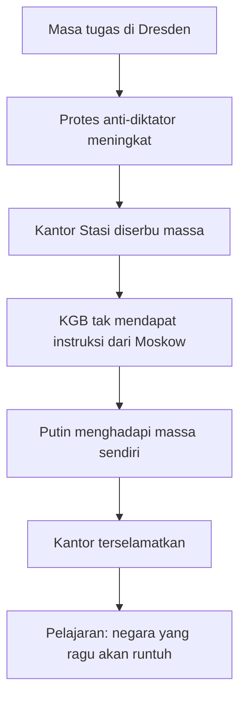
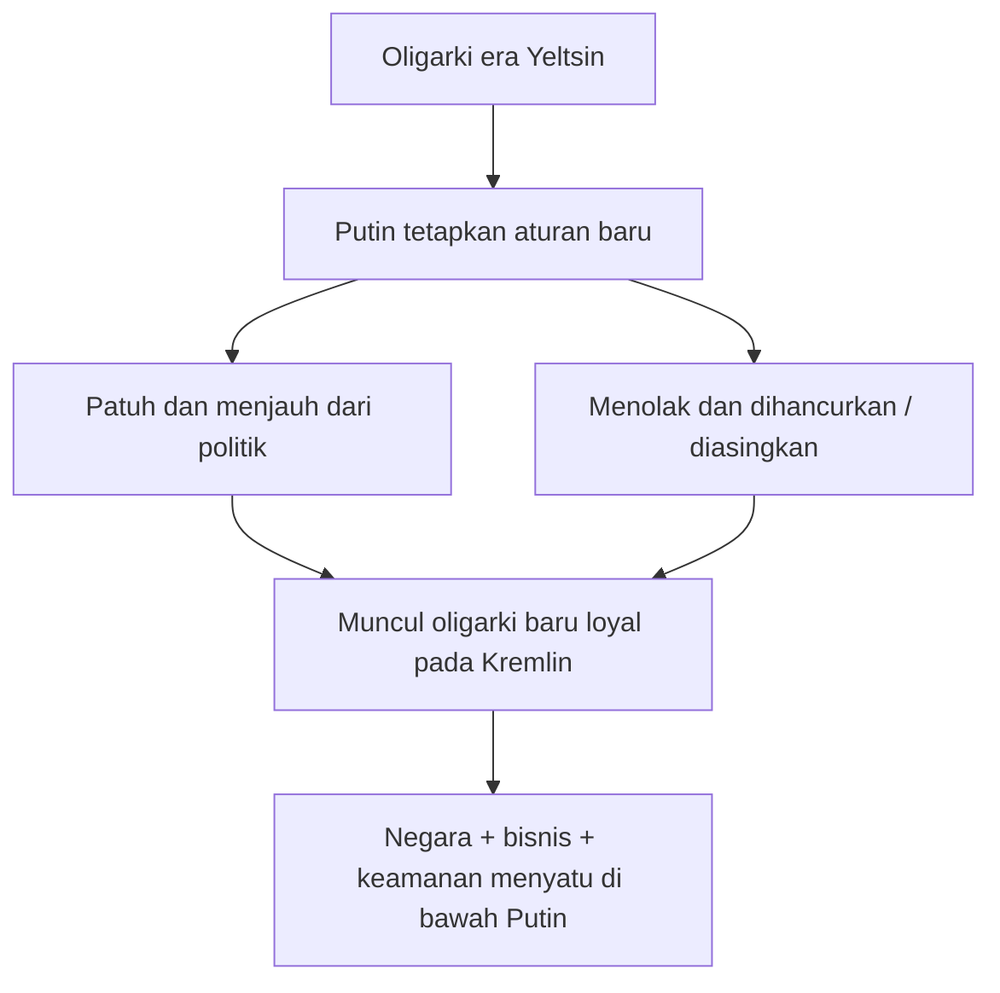
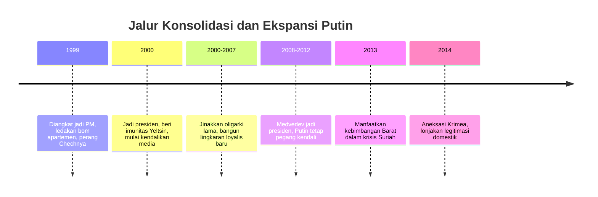

## 🎯 Pendahuluan: Putin Bukan Sekadar Presiden, Melainkan Sistem Kekuasaan yang Menelan Rusia

Ada banyak pemimpin kuat dalam sejarah modern, tetapi hanya sedikit yang benar-benar berhasil mengubah dirinya dari pejabat biasa menjadi **simbol negara**. Vladimir Putin adalah salah satunya. Di Rusia modern, nama Putin tidak lagi sekadar merujuk pada seorang presiden, melainkan pada keseluruhan cara negara itu diatur, dibayangkan, dan diproyeksikan ke dunia. Dalam imajinasi para pendukungnya, ia adalah penyelamat kehormatan Rusia, pemulih stabilitas, dan sosok yang mengembalikan negara itu ke panggung sejarah dunia. Dalam imajinasi para pengkritiknya, ia adalah mantan aparat rahasia yang berhasil mengubah demokrasi rapuh pasca-Soviet menjadi sistem personal yang dibangun di atas ketakutan, loyalitas, propaganda, dan kontrol. 🧠

Dokumenter *Vladimir Poutine, les secrets d'une ascension* menarik justru karena tidak berhenti pada pertanyaan dangkal seperti “apakah Putin diktator?” atau “apakah Putin kuat?” Pertanyaan yang lebih penting adalah: **bagaimana orang seperti dia bisa naik?** Bagaimana mantan pejabat KGB level kedua, yang pada satu titik tampak tidak luar biasa, bisa menjadi tokoh yang mengendalikan Rusia selama puluhan tahun? Kesalahan terbesar orang-orang di sekelilingnya, kata dokumenter ini, adalah mereka mengira Putin hanyalah alat. Mereka menganggap ia bisa dipasang, dipakai, lalu dikendalikan. Mereka mengira sedang memilih boneka. Ternyata yang mereka pilih adalah orang yang sabar, pendiam, membaca situasi, dan pelan-pelan mengubah semua orang di sekitarnya menjadi alat bagi dirinya sendiri.

Kenaikan Putin juga tidak bisa dipahami hanya sebagai cerita individu berbakat. Ia lahir dari pertemuan antara **krisis negara**, **kerusakan institusi**, **ketakutan elit**, dan **kerinduan masyarakat pada ketertiban**. Rusia tahun 1990-an adalah negeri yang hancur secara moral, ekonomi, dan politik. Oligarki merampok kekayaan negara, presiden melemah, perang berkecamuk, mafia tumbuh, dan publik muak pada kekacauan. Dalam situasi seperti itu, figur seperti Putin menjadi mungkin. Ia tidak naik dengan melawan sistem dari luar. Ia naik karena memahami sistem dari dalam, mengabdi padanya dengan tenang, lalu mengambil alih pusatnya. ⚙️

Yang membuat Putin lebih menarik lagi adalah ia bukan karikatur diktator klasik. Ia tidak meledak-ledak setiap saat, tidak selalu tampil teatrikal, dan tidak sejak awal tampak sebagai orator ideologis besar. Justru kekuatannya ada pada kombinasi yang jauh lebih berbahaya: **ketenangan aparat**, **insting pemburu**, **rasa dendam historis**, dan **kemampuan membaca kelemahan lawan**. Dokumenter ini menunjukkan bahwa di balik tatapan yang datar dan bahasa tubuh yang terkendali, ada memori panjang tentang penghinaan, keruntuhan, loyalitas, dan kesempatan. Putin tidak sekadar ingin memerintah. Ia ingin mengoreksi sejarah yang menurutnya telah merendahkan Rusia.

Artikel ini akan membedah perjalanan itu secara panjang dan runtut: dari masa kecilnya di Leningrad yang dibentuk oleh memori perang, mimpi romantik menjadi agen KGB, karier intelijen yang sebenarnya biasa-biasa saja, loncatan ke politik Saint Petersburg, kedekatan dengan Anatoly Sobchak, koneksi dengan lingkaran Yeltsin dan oligarki, sampai transformasinya menjadi penguasa yang menghancurkan media bebas, menundukkan oligarki lama, membangun oligarki baru, dan mengembalikan Rusia sebagai kekuatan revisionis di Suriah dan Ukraina. Jika ada istilah asing, saya jelaskan padanannya. Jika ada pola kekuasaan, saya uraikan logikanya. Dan jika ada mitos tentang Putin, kita akan bedah apakah ia fakta, propaganda, atau campuran keduanya. 🔍

<Callout type="important" title="Tesis utama artikel ini">
Naiknya Vladimir Putin bukanlah kecelakaan sejarah, melainkan hasil dari pertemuan antara trauma Soviet, kerusakan Rusia pasca-1991, kecemasan elit terhadap kehilangan kekuasaan, dan kemampuan pribadi Putin untuk menjadikan loyalitas sebagai tangga, kekerasan sebagai bahasa, serta negara sebagai kendaraan restorasi nasional dan perlindungan diri.
</Callout>

---

## 🏚️ 1. Anak Leningrad: Masa Kecil di Kota Luka dan Memori Pengepungan

Untuk memahami Putin dewasa, dokumenter ini menyuruh kita kembali jauh ke belakang: ke **Leningrad** pada 1950-an dan 1960-an, kota yang dibangun bukan hanya oleh batu dan pabrik, tetapi juga oleh trauma. Putin lahir setelah perang, tetapi ia tumbuh di lingkungan yang masih dipenuhi bekas luka **Siege of Leningrad** — *pengepungan Leningrad*, salah satu episode paling mematikan dalam Perang Dunia II. Jutaan orang mati, kelaparan, membeku, hancur secara fisik dan psikologis. Dalam kota seperti itu, memori perang bukan pelajaran sejarah; ia adalah atmosfer hidup sehari-hari.

Putin kecil tinggal bersama orang tuanya dalam **apartemen komunal** — *communal apartment*, yaitu hunian sempit yang dibagi beberapa keluarga. Mereka hanya memiliki satu ruangan. Ayahnya seorang veteran perang dan pekerja pabrik, keras, otoriter, disiplin, serta sangat dihormati. Ibunya bekerja di gudang dan kesehatannya rapuh karena warisan penderitaan masa perang. Dokumenter menekankan bahwa keluarga Putin bukan keluarga elite. Mereka adalah produk Rusia pekerja yang hidup dengan kesederhanaan keras, sempit, dan tanpa kenyamanan.

Dari sini ada dua pengaruh besar yang tampaknya membentuk jiwa Putin.

### a. Memori penderitaan kolektif
Ia tumbuh di kota yang dipenuhi veteran cacat, orang-orang yang kehilangan anggota tubuh, ibu-ibu yang selamat dari kelaparan, dan cerita tentang mayat yang menumpuk saat pengepungan. Ini menanamkan satu jenis patriotisme yang khas: bukan patriotisme ideologis Soviet semata, tetapi patriotisme Rusia yang melihat penderitaan sebagai bukti kelayakan untuk menjadi kuat.

### b. Pola keluarga yang keras dan penuh harapan
Orang tua Putin kehilangan dua anak sebelumnya. Maka Vladimir menjadi satu-satunya anak yang tersisa, “hadiah dari langit”, pusat harapan keluarga. Ia dibesarkan dengan perhatian besar, tetapi juga di bawah figur ayah yang kuat, keras, dan menjadi role model maskulin yang sangat jelas.

Lingkungan seperti ini sering melahirkan tipe kepribadian yang mengagungkan **ketahanan**. Dalam dunia di mana kelemahan identik dengan kehancuran, kekuatan menjadi nilai moral. Dan kelak, justru nilai inilah yang akan menjadi dasar citra politik Putin: Rusia yang harus berhenti malu, berhenti goyah, dan berhenti terlihat lemah. 💢

---

## 🥊 2. Dari Bocah Jalanan ke Murid yang Diselamatkan: Kekerasan, Guru, dan Metamorfosis Awal

Dokumenter menggambarkan Putin muda bukan sebagai anak emas yang tenang, melainkan anak yang hampir terseret ke dunia **delinkuensi** — *delinquency*, kenakalan dan kriminalitas remaja. Orang tuanya sering pulang larut. Ia banyak menghabiskan waktu di halaman belakang gedung bersama anak-anak yang lebih liar, merokok, berkelahi, dan hidup dalam budaya jalanan yang kasar. Putin kecil, meskipun bertubuh kecil, punya satu sifat yang segera menonjol: ia tidak takut berkelahi dan akan pergi sampai ujung.

Ini detail penting. Banyak orang melihat Putin dewasa sebagai sosok dingin dan terkendali. Tetapi dokumenter ini menunjukkan bahwa pada dasarnya ada naluri lama dalam dirinya: naluri untuk **menyerang lebih dulu, melekat, dan tidak melepas lawan**. Temannya menggambarkannya sebagai anak yang jika disentuh akan menempel dan bertarung habis-habisan. Ada energi jalanan yang sangat kasar di sini, dan ini nantinya akan menemukan bentuk baru dalam politik.

Tetapi hidup Putin tidak lurus menuju kehancuran jalanan. Di sinilah masuk sosok penting: **Vera Gurevich**, guru yang secara harfiah dan simbolik menariknya keluar dari halaman belakang yang liar. Dokumenter sangat menekankan peran perempuan ini. Ia bukan hanya guru, melainkan mentor sosial dan kultural. Ia melihat bahwa Putin kecil bukan sekadar anak bermasalah, tetapi anak yang bisa menjadi lebih besar dari lingkungan kasarnya.

Vera membawanya ke teater, museum, dunia seni, sastra Rusia klasik, musik klasik seperti Bach dan Beethoven. Ini sangat penting karena memberi Putin dua dunia sekaligus:

1. dunia keras halaman belakang,
2. dunia budaya tinggi Rusia.

Kombinasi ini menjelaskan banyak hal pada Putin dewasa. Ia bisa tampil seperti aparat kasar, tetapi juga menyukai simbol-simbol peradaban tinggi, sejarah, martabat negara, dan estetika kekuasaan. Ia bukan sekadar tukang pukul. Ia adalah tukang pukul yang ingin dipandang sebagai pewaris peradaban besar. 🎭

---

## 🎬 3. Mimpi Romantik Menjadi Agen: KGB sebagai Fantasi Penyelamat Tunggal

Salah satu titik penentu hidup Putin, menurut dokumenter ini, datang dari budaya populer Soviet: film **The Shield and the Sword**. Film ini menampilkan agen Soviet sebagai pahlawan besar yang, seorang diri, mampu mempengaruhi jalannya sejarah. Bagi Putin remaja, film itu bukan hiburan biasa. Itu adalah **wahyu identitas**.

Ia tidak sekadar ingin menjadi pegawai negara. Ia ingin menjadi semacam **James Bond versi Soviet**: sosok tunggal yang cerdas, kuat, tersembunyi, dan menang melawan dunia. Fantasi ini penting karena menunjukkan bahwa sejak dini Putin tertarik pada bentuk kekuasaan yang bersifat:

- rahasia,
- personal,
- disipliner,
- dan heroik.

Ia bahkan pergi sendiri ke kantor KGB untuk mendaftarkan diri. Petugas tidak menganggapnya serius, tetapi memberi syarat-syarat klasik: nilai bagus, olahraga, cinta pada orang tua, masuk universitas. Yang menarik, Putin mengambil semua itu secara literal. Ia memperkuat dirinya lewat **judo**, belajar dengan tekun, masuk fakultas hukum Leningrad, dan terus menjadikan KGB sebagai tujuan hidup.

Di sini kita melihat sesuatu yang sangat khas tentang dirinya: ketika ia memiliki tujuan, ia dapat bersikap sangat sabar, sangat tekun, dan sangat instrumentalis. Judo bukan hobi murni, melainkan alat untuk karier. Studi hukum bukan cinta intelektual abstrak semata, melainkan bagian dari jalan menuju dinas rahasia. Ini pola yang akan terus terlihat sepanjang hidupnya: berbagai institusi, hubungan, dan posisi diperlakukan sebagai **alat menuju kontrol yang lebih besar**.

---

## 🕵️ 4. KGB: Mimpi Besar, Karier Biasa, dan Luka dari Mediokritas

Ketika akhirnya direkrut oleh KGB, Putin tentu merasa mimpinya tercapai. Namun dokumenter ini justru menghancurkan mitos bahwa Putin sejak awal adalah bintang intelijen. Yang digambarkan justru sebaliknya: karier awalnya **tidak istimewa**.

Ia bekerja di kontra-spionase, melakukan pengawasan terhadap lawan politik, pekerjaan jalanan yang membosankan dan subordinat. Ia ingin ke Barat, ingin posisi keren, ingin menjadi agen lapangan sungguhan di dunia yang lebih besar. Tetapi permintaannya berkali-kali tidak dipenuhi.

Bahkan ketika ia akhirnya masuk sekolah pelatihan KGB untuk dinas luar negeri, satu catatan penting muncul dalam file pribadinya: **underestimated risk level** — *tingkat risiko yang diremehkan*. Artinya, ia dinilai terlalu berani, kurang merasa bahaya, atau cenderung mengambil risiko melebihi yang diharapkan. Dalam dunia intelijen, ini justru dianggap kelemahan, bukan kekuatan.

Setelah pelatihan, ia dikirim ke **Dresden, Jerman Timur**, bukan ke jantung dunia Barat yang ia impikan. Di sana pun tugasnya lebih banyak administratif dan birokratis. Ia memperbarui berkas, memonitor oposisi, dan menjalani hidup yang jauh dari glamor. Dokumenter secara eksplisit menyebut bahwa karier intelijennya tidak sukses. Ia tidak pernah benar-benar menonjol. Ia stagnan, frustrasi, dan mungkin merasa ada luka batin karena gagal menjadi sosok besar yang pernah ia bayangkan.

Ini poin yang sangat penting secara psikologis. Banyak pemimpin berbahaya bukan lahir dari keberhasilan sempurna, tetapi dari **percampuran ambisi besar dan pengalaman direndahkan / disepelekan**. Putin tampaknya adalah tipe itu. Ia bukan jenius intelijen yang sejak awal diakui semua orang. Ia adalah orang yang merasa dirinya pantas lebih, tetapi berkali-kali ditempatkan dalam posisi kecil. Luka inilah yang mungkin kelak berubah menjadi obsesi untuk tidak pernah lagi disepelekan. 😐

---

## 🧱 5. Dresden 1989: Saat Dunia Lamanya Runtuh dan Negara Besar Tak Lagi Menjawab Telepon

Momen penting lain dalam pembentukan Putin terjadi di **Dresden** pada 1989, ketika blok Soviet sedang runtuh. Demonstrasi demokrasi merebak di Jerman Timur. Kantor-kantor Stasi dikepung massa. Perintah dari Moskow tidak datang. Dan di salah satu adegan yang nyaris mitologis, Putin keluar sendiri menghadapi kelompok demonstran yang mendekati kantor KGB, berbicara dalam bahasa Jerman, dan memperingatkan bahwa orang-orang di dalam bersenjata dan siap menembak.

Massa mundur. Kantor terselamatkan. Tetapi yang lebih penting dari peristiwa itu adalah **pelajaran eksistensial** yang diambil Putin: pusat kekuasaan bisa lumpuh. Negara besar bisa kehilangan kemauan. Atasan bisa meninggalkan anak buahnya. Sistem yang tampak raksasa bisa tiba-tiba tidak sanggup mengeluarkan perintah.

Dokumenter sangat menekankan bahwa pengalaman ini membekas dalam dirinya. Baginya, bukan sekadar Tembok Berlin yang runtuh. Yang runtuh adalah keyakinan bahwa negara akan selalu hadir, tegas, dan mampu memerintah. Dari sini lahir salah satu inti dunia politik Putin: **negara tidak boleh terlihat lemah atau ragu**. Karena ketika pusat ragu, seluruh dunia bawahan runtuh.

Inilah salah satu kunci untuk memahami kebenciannya pada indeciveness — *keragu-raguan / ketidaktegasan*. Baginya, keragu-raguan bukan kelemahan kecil. Itu adalah awal kehancuran sejarah. 🧱

---

## 🏛️ 6. Kembali ke Rusia: Sobchak, Saint Petersburg, dan Kelahiran Politikus Administratif

Setelah sistem Soviet runtuh, Putin kembali ke Leningrad / Saint Petersburg. Di sinilah hidupnya mengambil belokan paling menentukan. Ia muncul di sekitar **Anatoly Sobchak**, figur demokratis penting yang menjadi wali kota Saint Petersburg. Bagi banyak orang, kemunculan mantan aparat KGB di lingkaran tokoh reformis ini terasa aneh. Tetapi justru di sinilah Putin menemukan panggung yang lebih cocok dibanding dunia spionase.

Mengapa Sobchak menyukainya? Dokumenter memberi jawaban yang sangat penting: **loyalitas**. Putin tidak membantah, tidak memprotes, tidak mencoba menjadi bintang sendiri. Ia selalu berkata bahwa perintah akan dilaksanakan. Bagi pemimpin yang dikelilingi para intelektual dan tokoh yang suka berdebat, bawahan seperti ini sangat berharga.

Tetapi kesetiaan Putin bukan kesetiaan polos. Ia tampaknya memahami bahwa menjadi bawahan sempurna bisa menjadi strategi jangka panjang. Sobchak melihatnya sebagai orang lemah yang bisa dikendalikan. Ini pola yang terus berulang dalam hidup Putin: orang lain menilai diamnya sebagai keterbatasan, padahal diam itu sering adalah bentuk **absorpsi kekuasaan**.

Sebagai deputi dan kemudian pejabat penting urusan investasi asing, Putin masuk ke dunia bisnis, izin usaha, tanah, hotel, pertemuan dengan investor, dan seluruh jaringan kekuasaan ekonomi kota. Semua permintaan asing harus melewatinya. Ini memberinya dua hal besar:

1. **akses ke uang dan kepentingan**,
2. **pemahaman praktis tentang bagaimana kekuasaan riil bekerja di era kapitalisme liar Rusia**.

Pada saat yang sama, Saint Petersburg sedang tenggelam dalam kemiskinan, kelangkaan, kriminalitas, dan korupsi. Mafia, pejabat, dan pengusaha menjadi kabur batasnya. Dokumenter menyebut kota itu sebagai ibu kota kriminal Rusia. Maka Putin belajar politik bukan di lingkungan institusional bersih, melainkan di lingkungan di mana negara, bisnis, dan kriminalitas saling bersentuhan.

---

## 💰 7. Korupsi, Tuduhan, dan Pelajaran Penting tentang Perlindungan Patron

Pada 1992, dewan kota meninjau laporan yang sangat memalukan: dugaan penipuan besar-besaran dan hilangnya jutaan dolar uang publik. Tanda tangan Putin muncul di sejumlah dokumen. Ia dipanggil, dimintai penjelasan, dan dituduh setidaknya lalai, kalau bukan terlibat lebih dalam.

Respon Putin adalah klasik: ia mengaku **naif**, mengatakan dirinya tertipu para penipu finansial. Tetapi dewan kota tidak yakin. Mereka bahkan menyarankan agar Sobchak menyingkirkannya. Namun Sobchak menolak. Putin dilindungi. Ia tidak dituntut.

Bagian ini sangat penting, karena mungkin di sinilah Putin belajar pelajaran politik yang tak ternilai: **dalam sistem yang rapuh, yang menentukan bukan kebenaran, tetapi siapa yang melindungi siapa**. Dari Sobchak, ia belajar bukan hanya loyalitas kepada patron, tetapi juga nilai proteksi patronase. Kelak ketika ia berkuasa, pola yang sama akan muncul dalam skala nasional: kawan dilindungi, lawan dibuka kasusnya, hukum dijadikan instrumen diferensial, bukan aturan netral.

Jadi jika ada yang bertanya kapan Putin mulai memahami negara sebagai alat perlindungan jaringan, salah satu jawabannya mungkin: **Saint Petersburg tahun 1990-an**.

---

## 🚀 8. Dari Kota ke Kremlin: Lingkaran Yeltsin, Berezovsky, dan Kenaikan yang Sangat Cepat

Setelah Sobchak kalah dalam pemilu lokal 1996, Putin dipanggil ke Moskow. Di sinilah kariernya melesat sangat cepat. Ia masuk administrasi kepresidenan, lalu pada 1998 menjadi kepala **FSB** — penerus KGB di Rusia pasca-Soviet.

Penting dicatat, dokumenter menekankan bahwa ia tidak selalu tampak sebagai orang yang sangat berambisi menjadi politikus besar. Bahkan ada kesan bahwa ia lebih membayangkan masa depan nyaman di perusahaan negara seperti Gazprom. Tetapi justru karena ia terlihat tidak terlalu mengancam, ia menjadi kandidat ideal bagi orang-orang yang sedang membutuhkan figur loyal.

Pada akhir era Yeltsin, Kremlin berada dalam kekacauan:

- Yeltsin sakit dan tidak efektif,
- oligarki merajalela,
- korupsi menggerogoti negara,
- dan jaksa agung **Yuriy Skuratov** mulai menyelidiki kasus-kasus yang bisa menyeret keluarga Yeltsin serta tokoh-tokoh seperti **Boris Berezovsky**.

Di sinilah Putin menunjukkan nilai terbesarnya bagi lingkaran kekuasaan: **kesediaan melakukan serangan balik demi melindungi patron**.

Kasus video kompromat Skuratov menjadi contoh penting. Sebuah kaset yang sangat memalukan bocor ke televisi. Penyidikan terhadap keaslian video itu diserahkan kepada FSB. Lalu Putin sendiri muncul dan mengonfirmasi identifikasi target. Skuratov jatuh, penyelidikannya runtuh, dan lingkaran Yeltsin terselamatkan. Dari sudut pandang keluarga Yeltsin, ini adalah bukti tak terbantahkan bahwa Putin **loyal sampai ke level operasional**.

Dalam politik patronase, tindakan seperti ini jauh lebih berharga daripada pidato besar. Karena pada titik itu, Putin membuktikan bahwa ia bisa dipakai untuk **menutup bahaya hukum**.

---

## 👑 9. 1999: Dari Orang Tak Dikenal Menjadi Pewaris Kremlin

Titik ledak kenaikan Putin datang pada 1999. Rusia sedang membusuk. Oligarki takut kehilangan kepentingan jika oposisi naik. Mereka butuh pengganti Yeltsin yang:

- cukup muda,
- tak terlalu terkait skandal publik,
- tampak loyal,
- bisa diterima birokrasi keamanan,
- dan mudah diarahkan.

Di mata Berezovsky dan lingkaran Yeltsin, Putin tampak sempurna. Ia seorang birokrat, mantan intelijen, tidak terlalu karismatik secara independen, dan terbukti loyal. Berezovsky bahkan mendatanginya di Prancis selatan untuk mengajukan “tawaran hidupnya”: menjadi presiden Rusia berikutnya.

Yang luar biasa adalah betapa cepat skenarionya berjalan. Putin diangkat menjadi perdana menteri. Lalu hanya dalam beberapa bulan ia bergerak dari figur publik yang hampir tak dikenal menjadi kandidat pewaris kekuasaan. Dokumenter sangat jelas: banyak orang mengira mereka sedang menulis naskah untuk Putin. Faktanya, justru sejak awal Putin sedang belajar membaca siapa saja yang merasa menulis naskah untuknya.

---

## 💣 10. Bom Apartemen, Chechnya, dan Lahirnya Figur Penyelamat melalui Rasa Takut

Salah satu bagian paling kontroversial dalam dokumenter ini adalah pembahasan **serangkaian ledakan bom apartemen pada 1999** yang menewaskan hampir 300 orang. Putin segera menuduh separatis Chechnya dan menjanjikan pembalasan brutal. Kalimat terkenalnya — bahwa teroris akan diburu bahkan sampai toilet — mengejutkan Barat, tetapi justru memikat banyak warga Rusia yang muak pada kelemahan negara.

Di sini dokumenter menunjukkan sesuatu yang sangat penting tentang hubungan Putin dengan publik: ia tampil sebagai jawaban atas **rasa takut**. Ketika masyarakat merasa negara tak mampu melindungi mereka, orang yang berbicara paling keras dan paling tegas bisa sangat cepat memperoleh legitimasi.

Namun dokumenter tidak berhenti pada versi resmi. Ia juga menyinggung **kecurigaan bahwa sebagian ledakan itu mungkin dimanipulasi atau bahkan diprovokasi oleh FSB**, terutama karena ada insiden di Ryazan di mana karung yang diduga berisi bahan peledak ditemukan, dan kendaraan mencurigakan yang dikaitkan dengan kasus itu ternyata terkait FSB. Banyak pertanyaan tetap menggantung, dan perkara itu cepat dikubur saat perang di Chechnya dimulai.

Kita harus berhati-hati secara analitis di sini. Dokumenter tidak menawarkan bukti final mutlak, tetapi ia jelas menunjukkan bahwa ada keraguan serius dan bahwa ledakan-ledakan itu secara politik **datang pada saat yang sangat menguntungkan** bagi Putin. Yang tak bisa dibantah adalah efeknya: Putin melonjak di jajak pendapat, perang Chechnya memberi panggung militer, dan citra “pelindung bangsa” dibangun secara intensif oleh tim komunikasi Kremlin.

---

## 📺 11. Penciptaan Citra: Putin sebagai Anti-Yeltsin, Anti-Lemah, Anti-Kacau

Salah satu kekuatan besar Putin sejak awal adalah bahwa ia dipasarkan secara sangat efektif sebagai kebalikan sempurna dari Boris Yeltsin. Jika Yeltsin diasosiasikan dengan usia tua, kelemahan, mabuk, kekacauan, dan negara yang limbung, maka Putin ditampilkan sebagai:

- muda,
- energik,
- atletis,
- pekerja,
- patriotik,
- dan tegas.

Dokumenter menunjukkan bagaimana tubuhnya sendiri dijadikan medium propaganda. Judo, perjalanan ke daerah, banyak pernyataan, banyak penampilan, semuanya dirancang untuk menegaskan satu pesan: **Rusia kembali punya laki-laki kuat di pucuk negara**.

Ini bukan strategi rumit secara intelektual. Justru ia sangat sederhana dan karena itu sangat efektif. Dalam masyarakat yang lelah oleh transisi kacau, simbol stabilitas dan kekuatan lebih laku daripada pidato ideologis canggih. Putin menjadi “defender in chief” — **kepala pelindung bangsa** — sebelum ia benar-benar mengendalikan negara sepenuhnya.

---

## 🛡️ 12. Imunitas untuk Yeltsin: Harga Tiket Masuk ke Kepresidenan

Saat Yeltsin mundur pada malam pergantian tahun 2000, Putin menjadi presiden sementara. Salah satu tindakan resminya yang paling penting adalah memberi **imunitas penuh** kepada Boris Yeltsin dan keluarganya. Ini sangat penting. Ia menunjukkan bahwa kenaikannya bukan peristiwa spontan, tetapi bagian dari perjanjian politik yang jelas.

Imunitas itu adalah harga tiket. Putin diberi jalan ke puncak, dan sebagai balasannya ia harus memastikan keluarga lama tidak diseret hukum. Ini konsisten dengan seluruh pola sebelumnya: ia adalah orang yang menyelamatkan patronnya ketika dibutuhkan.

Tetapi di sini pula ironi mulai terbentuk. Orang-orang yang membawanya naik mengira bahwa utang semacam itu akan membuat Putin terus tunduk. Mereka salah membaca satu hal: **loyalitas Putin sangat nyata, tetapi bukan tanpa batas dan bukan tanpa agenda pribadi**. Ia bisa sangat setia selama struktur lama masih diperlukan. Setelah ia cukup kuat, struktur itu akan ditata ulang di bawah dirinya sendiri.

---

## 📰 13. Menghancurkan Media Bebas: Dari NTV ke Rezim Propaganda

Begitu resmi berkuasa, salah satu sasaran pertama Putin adalah **media independen**. Ini bukan kebetulan. Bagi orang yang dibentuk oleh KGB, media bukan lembaga publik otonom yang harus mengawasi negara. Media adalah **alat**. Jika alat itu tidak berada di tangan yang benar, maka alat itu harus diambil, dipatahkan, atau dihancurkan.

Serangan terhadap **NTV**, televisi independen utama saat itu, menjadi contoh paling jelas. Pemiliknya, oligark Vladimir Gusinsky, dikejar kasus finansial. Tekanannya begitu kuat sehingga ia terpaksa menyerahkan kanal tersebut kepada Gazprom. Para jurnalis mencoba melawan, tetapi investigasi dan intimidasi digelar terhadap mereka satu per satu. Tokoh seperti Svetlana Sorokina bahkan dipanggil ke Kremlin dan ditekan secara personal.

Hasilnya cepat dan brutal: dalam beberapa bulan, hampir seluruh media besar berada di bawah kontrol Kremlin. Ini sangat menentukan karena setelah itu Putin tidak hanya menguasai alat negara, tetapi juga **mesin pembentuk persepsi publik**. Tanpa media bebas yang kuat, ia bisa mendefinisikan realitas politik dengan jauh lebih leluasa.

Dokumenter juga menyebut **Anna Politkovskaya**, jurnalis sangat vokal yang kemudian dibunuh. Para pelaksana lapangan bisa dihukum, tetapi dalang di belakangnya tak pernah benar-benar disentuh. Pesan yang tercipta sangat jelas: kritik tajam terhadap negara bukan sekadar berisiko profesional, tetapi bisa berisiko biologis.

---

## 💼 14. Menjinakkan Oligark Lama, Menciptakan Oligark Baru

Salah satu mitos tentang Putin adalah bahwa ia datang untuk mengakhiri era oligarki. Dokumenter ini menolak pembacaan sesederhana itu. Yang dilakukan Putin bukan menghapus oligarki, melainkan **mengganti oligarki lama dengan oligarki yang patuh padanya**.

Pada 2000, ia memanggil para miliarder utama dan memberi pesan sederhana: kalian boleh tetap kaya, tetapi jangan ikut campur dalam politik. Mulai sekarang, bosnya adalah negara — lebih tepatnya, dirinya. Sebagian besar menerima aturan baru ini. Tetapi orang-orang seperti Berezovsky menolak dan akhirnya dipaksa keluar negeri, kehilangan pengaruh, dan hidup dalam pengasingan.

Secara politik, ini langkah jenius. Di mata publik, Putin tampak sedang menaklukkan para perampok negara. Padahal pada saat yang sama ia membangun **jaringan patronase baru** yang diisi teman-teman dari dinas keamanan dan lingkaran loyalis. Negara, bisnis, dan keamanan makin menyatu di bawah kelompok baru.

Jadi bukan berarti kekuasaan ekonomi dipisahkan dari negara. Justru negara dan kekayaan disatukan lebih rapat lagi, tetapi di bawah hierarki yang lebih terpusat.

---

## 🧮 15. Kekuasaan sebagai Jaringan Loyalis: FSB, Teman Lama, dan Aset yang Tak Pernah Atas Nama Sendiri

Dokumenter juga menyinggung investigasi yang menyebut Putin memperkaya diri lewat kepemilikan tidak langsung atas perusahaan strategis seperti Gazprom atau Gunvor. Narasinya sederhana tetapi masuk akal dalam konteks Rusia: pemimpin sebesar Putin tidak perlu memiliki apa pun atas nama pribadinya. Uangnya, sahamnya, dan pengaruhnya bisa dipegang oleh **teman-temannya**.

Di sini muncul model kekuasaan khas Putin:

- kekayaan tidak harus transparan,
- loyalitas dibayar dengan akses,
- pejabat keamanan menjadi pengelola ekonomi,
- dan jaringan personal lebih penting daripada institusi formal.

Jadi ketika orang bertanya apakah Putin korup, pertanyaan yang lebih tepat mungkin: **bagaimana memisahkan korupsi pribadi dari bentuk negara yang sudah dibangun sebagai jaringan loyalitas ekonomi-politik?** Dalam sistem seperti itu, pemisahan antara milik negara, milik teman, dan milik penguasa menjadi sengaja kabur.

---

## 🌍 16. Di Luar Negeri: Dari Pemalu di Barat Menjadi Pemain yang Suka Menguji, Menghina, dan Menekan

Dokumenter menghadirkan kisah menarik tentang pertemuan Putin dengan Nicolas Sarkozy pada G8 2007. Di sana, Putin dikisahkan mendengarkan kritik Sarkozy, lalu membalas dengan nada mengintimidasi, bahkan menghina. Apakah semua detail percakapan itu dapat diverifikasi sepenuhnya atau tidak, yang penting adalah pola yang ditampilkan: Putin sangat nyaman menggunakan **tekanan psikologis personal** dalam diplomasi.

Ia tidak berdebat seperti liberal prosedural yang setia pada forum formal. Ia lebih mirip operator kekuasaan yang ingin mengetahui: seberapa jauh lawan bisa ditekan? Seberapa cepat ia bisa dibuat goyah? Seberapa besar efek keheningan, penghinaan, atau ancaman personal?

Dokumenter bahkan menyebutnya tetap bertindak seperti orang KGB yang memperlakukan lawan seperti sumber atau target, bukan mitra setara. Ini sangat penting. Banyak analis Barat terlalu lama membaca Putin hanya sebagai presiden negara biasa, padahal ia membawa ke panggung internasional kebiasaan **master spy** — *pengendali operasi*, yang melihat interaksi politik sebagai kombinasi penilaian karakter, tekanan, dan eksploitasi kelemahan.

---

## 🔁 17. Medvedev: Putaran Jabatan, Ketakutan Kehilangan Kendali, dan Kekuasaan yang Tak Mau Pergi

Ketika konstitusi Rusia mencegahnya menjabat tiga kali berturut-turut, Putin tidak mundur dari kekuasaan. Ia hanya mengubah posisi formal. **Dmitry Medvedev** dijadikan presiden, sementara Putin menjadi perdana menteri. Dokumenter menilai ini sebagai pola yang sangat mirip dengan cara oligarki dulu memandang Putin: seorang figur depan yang memungkinkan kendali riil tetap berada di belakang layar.

Yang penting di sini bukan sekadar trik konstitusional. Yang lebih penting adalah motivasinya. Dokumenter menyebut dua dorongan utama:

1. Putin merasa negara tidak bisa dikelola tanpa dirinya.
2. Ia takut pada keselamatannya sendiri jika benar-benar keluar dari kekuasaan.

Ini sangat penting secara psikologi politik. Banyak penguasa otoriter akhirnya tetap bertahan bukan hanya karena ambisi, tetapi karena kekuasaan menjadi satu-satunya **jaminan hidup**. Begitu mereka turun, terlalu banyak lawan, terlalu banyak dosa politik, dan terlalu banyak kemungkinan pembalasan.

Jadi keputusan untuk bertahan lama bukan sekadar cinta kuasa, tetapi juga **strategi self-preservation** — *mempertahankan diri*.

---

## 🏭 18. Pementasan Populis: Menghina Oligark di Depan Kamera, Menjadi Pahlawan Rakyat di Tengah Krisis

Salah satu adegan paling khas dari era Putin adalah kunjungannya ke kota industri yang terpukul krisis finansial 2009. Di sana ia mempermalukan oligark **Oleg Deripaska** di depan kamera, memaksanya menandatangani kesepakatan, dan praktis memperlihatkan kepada publik bahwa miliarder terbesar sekalipun bisa ditekan seperti anak sekolah.

Secara substantif, ini penting. Tetapi secara simbolik, ini jauh lebih besar. Putin tampil sebagai **white knight** — *ksatria penyelamat* — yang menundukkan kapitalis rakus demi rakyat kecil. Padahal pada level sistem, ia sendiri adalah arsitek struktur oligarki baru. Inilah kejeniusan teatrikal Putin: ia bisa menjadi sekaligus penguasa jaringan elite dan penyerang elite dalam panggung publik, selama kamera diatur dengan benar.

---

## 🧨 19. Restorasi Rusia: Suriah, Ukraina, dan Politik Menunggu Kesempatan

Dokumenter sangat kuat ketika membahas dimensi geopolitik Putin. Ia menolak gambaran bahwa Putin adalah penjudi gila yang selalu menyerbu tanpa kalkulasi. Sebaliknya, ia digambarkan sebagai orang yang **menunggu momen**, membaca perpecahan lawan, lalu bergerak saat celah terbuka.

### Suriah
Dalam krisis Suriah, Putin menjadi satu-satunya pemain besar yang tetap mendukung Bashar al-Assad ketika Barat mulai terpecah dan ragu-ragu. Ketika Inggris mundur, Obama bimbang, dan Prancis tertinggal sendirian, Putin masuk dengan proposal soal senjata kimia dan berhasil memaksakan solusi diplomatik yang mengangkat dirinya ke garis depan. Ini disebut dokumenter sebagai **masterstroke** — *langkah jitu / pukulan strategis cemerlang*.

Yang penting di sini bukan hanya dukungan pada Assad. Pesan globalnya adalah: **Rusia tidak meninggalkan sekutunya**, tidak seperti Barat yang dianggap meninggalkan Mubarak, Gaddafi, atau Saddam. Ini memberi Putin citra sebagai pelindung rezim-rezim yang merasa terancam oleh perubahan dan intervensi Barat.

### Ukraina dan Krimea
Lalu datang Ukraina. Saat negeri itu terbelah antara orientasi pro-Eropa dan pro-Rusia, Putin melihat kesempatan besar. Ia tidak menciptakan semua konflik dari nol, tetapi ia memanfaatkan perpecahan yang sudah ada. Krimea, dengan penduduk mayoritas berbahasa Rusia dan nilai strategis besar, menjadi sasaran pertama. Referendum digelar, hasilnya sudah bisa ditebak, dan aneksasi diumumkan.

Di mata dunia internasional, tindakan itu ilegal. Di mata banyak warga Rusia, itu adalah pemulihan kehormatan nasional. Dokumenter menegaskan bahwa setelah Krimea, posisi Putin di dalam negeri melonjak drastis. Sebelum Krimea, ia besar. Setelah Krimea, ia menjadi figur sejarah nasional.

---

## 🧠 20. Jadi, Siapa Putin Sebenarnya? Bukan Boneka, Bukan Sekadar Tsar, tapi Produk Sangat Murni dari Negara Keamanan

Dari seluruh dokumenter ini, kita bisa menyimpulkan bahwa Putin bukan figur tunggal yang mudah diberi label sederhana. Ia bukan sekadar boneka oligarki, karena ia menelan para pembuatnya. Ia juga bukan tsar tradisional murni, karena ia lahir dari birokrasi keamanan modern, bukan dinasti darah. Ia paling tepat dilihat sebagai **produk paling matang dari mentalitas negara keamanan Soviet yang berhasil beradaptasi ke kapitalisme pasca-Soviet**.

Ia membawa beberapa unsur sekaligus:

- **naluri aparat**: percaya pada kontrol, kerahasiaan, hierarki, loyalitas,
- **naluri jalanan**: menyerang lebih dulu, jangan terlihat lemah,
- **naluri birokrat**: sabar, disiplin, naik melalui struktur,
- **naluri revisionis historis**: ingin membalas penghinaan runtuhnya Soviet,
- **naluri survivalist**: merasa hanya aman selama tetap berkuasa.

Itulah sebabnya ia sulit dibaca dengan kategori demokrasi liberal biasa. Ia tidak berpikir dalam kerangka pergiliran kekuasaan yang sehat. Ia berpikir dalam kerangka **kontinuitas kontrol**. Dalam pandangan semacam itu, meninggalkan kekuasaan bukan transisi normal, melainkan membuka pintu bencana.

---

## 🧩 Kesimpulan: Rahasia Kenaikan Putin adalah Kemampuannya Menjadi Orang yang Diremehkan Sampai Terlambat untuk Menghentikannya

Apa rahasia kenaikan Vladimir Putin? Dokumenter ini memberi jawaban yang sangat kuat: rahasianya bukan karisma besar sejak awal, bukan kecemerlangan publik yang langsung terlihat, dan bukan legitimasi moral yang luhur. Rahasianya adalah kemampuannya untuk **diremehkan**. Oligarki mengira ia lemah. Sobchak mengira ia bisa dikendalikan. Lingkaran Yeltsin mengira ia hanya akan melindungi mereka. Barat terlalu sering mengira ia bisa dibujuk atau dibaca dengan standar politik biasa. Hampir semua orang terlambat menyadari bahwa justru di balik kesan biasa-biasa itulah tersimpan keunggulan utamanya. 😶

Putin adalah orang yang belajar dari dunia KGB bahwa informasi adalah kekuasaan, dari dunia jalanan bahwa kelemahan mengundang serangan, dari era Yeltsin bahwa kekacauan membuat masyarakat merindukan ketertiban, dan dari runtuhnya Dresden bahwa negara yang ragu akan hancur. Semua pelajaran itu kemudian ia gabungkan menjadi sistem pemerintahan yang sangat personal: media harus jinak, oligarki harus patuh, negara harus keras, oposisi harus dipersempit, dan dunia luar harus dipaksa menghormati Rusia lagi.

Tetapi keberhasilan itu datang dengan harga yang sangat besar. Rusia di bawah Putin memang kembali ditakuti dan diperhitungkan. Namun ia juga menjadi negara yang makin tergantung pada propaganda, patronase, represi, dan kebijakan luar negeri yang agresif. Ia memulihkan rasa bangga sebagian rakyat Rusia, tetapi dengan cara yang membuat negara itu makin sulit dibayangkan hidup tanpa satu orang di puncak. Dan justru di situlah bahaya terbesarnya. Ketika seorang pemimpin berubah menjadi sistem, maka kejatuhan orang itu tidak pernah hanya menjadi masalah pribadi. Ia menjadi masalah seluruh negara. 🕯️

Pada akhirnya, Putin mungkin memang melihat dirinya sebagai penyelamat Rusia. Mungkin ia sungguh percaya pada perannya. Tetapi sejarah jarang berbaik hati kepada penyelamat yang tidak tahu kapan harus pergi. Dan mungkin, sebagaimana diisyaratkan dokumenter ini, kesalahan terbesar Putin bukan saat ia pertama kali mengambil kekuasaan — melainkan ketika ia memutuskan bahwa kekuasaan itu tidak boleh pernah benar-benar lepas dari tangannya.

<Callout type="cite" title="Sumber utama artikel">
Artikel ini disusun berdasarkan dokumenter: *Vladimir Poutine, les secrets d'une ascension* dengan fokus pada biografi politik Putin, formasi psikologisnya, jaringan patronase, konsolidasi kekuasaan domestik, dan strategi restorasi pengaruh Rusia di panggung internasional.
</Callout>
