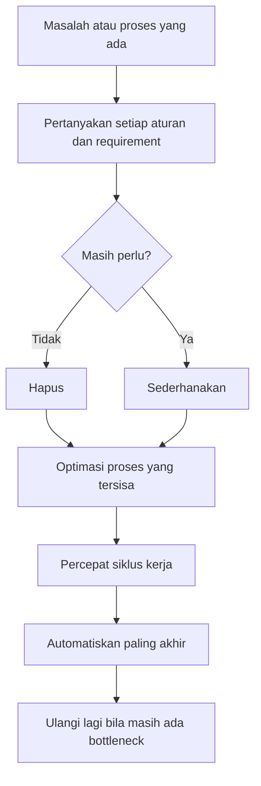
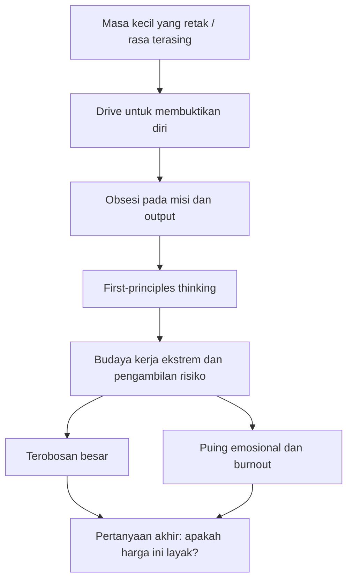
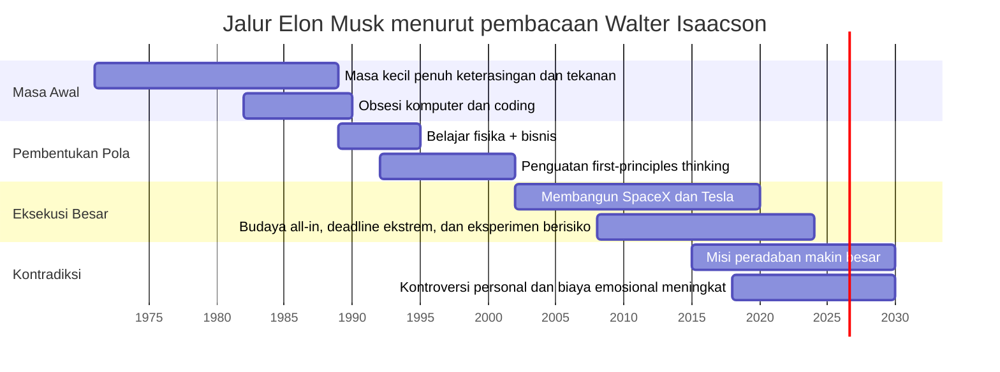

## 🚀 Pendahuluan: Artikel Ini Bukan Tentang “Tips Sukses ala Elon”, tetapi Tentang Mesin Psikologis, Budaya, dan Kekacauan yang Sering Bersembunyi di Balik Inovasi Besar

Ada jenis wawancara yang memberi kita informasi. Ada juga jenis wawancara yang memberi kita **akses**. Percakapan dengan **Walter Isaacson** tentang Elon Musk termasuk kategori kedua. Kenapa? Karena Isaacson bukan komentator yang melihat dari jauh. Ia adalah penulis biografi yang hidup dekat dengan subjeknya—mengamati bukan hanya hasil akhir, tetapi ritme hariannya, suasana emosionalnya, konflik timnya, impulsnya, obsesinya, bahkan sisi-sisi yang mungkin tidak akan muncul dalam wawancara publik biasa. 🚀

Dan ketika orang seperti Isaacson—yang juga pernah begitu dekat dengan **Steve Jobs**—mulai membandingkan dua sosok ini, yang muncul bukan sekadar daftar “pelajaran kepemimpinan”. Yang muncul justru sebuah pertanyaan yang jauh lebih tidak nyaman:

> **Apakah orang yang mengubah dunia memang sering digerakkan oleh sesuatu yang retak, ekstrem, dan sulit ditiru?**

Dalam percakapan ini, Elon Musk tampil bukan sebagai poster motivasi. Ia tampil sebagai gabungan yang rumit:

- seorang insinyur berfokus laser,
- pengambil risiko ekstrem,
- pemikir *first principles* *(prinsip pertama / pemikiran dari akar paling dasar)*,
- pemimpin yang bisa menggerakkan tim ke titik yang mereka kira mustahil,
- tetapi juga manusia yang membawa luka masa kecil, hubungan batin yang kacau, dorongan terhadap drama, dan pola intensitas yang sering membuat lingkungan di sekitarnya terbakar. 🔥

Walter Isaacson tidak sedang mempromosikan Musk sebagai teladan utuh. Justru kekuatan besar dari wawancara ini adalah ia menolak penyederhanaan. Ia tidak bilang Elon adalah pahlawan murni. Ia juga tidak bilang Elon sekadar villain *(tokoh jahat)* modern. Ia menunjukkan bahwa banyak hal yang membuat Elon luar biasa adalah hal yang juga membuatnya sulit, berat, dan kadang destruktif.

Itu sebabnya artikel ini penting. Karena kita hidup di zaman yang terlalu mudah memotong tokoh besar menjadi dua kubu:

- dipuja habis-habisan,
- atau dibenci habis-habisan.

Padahal kenyataannya jauh lebih kompleks. Tokoh seperti Elon Musk dan Steve Jobs memaksa kita bertanya:

- apa hubungan antara trauma dan dorongan pencapaian?
- apa hubungan antara visi besar dan ketidakmampuan menikmati hidup?
- apa hubungan antara budaya kerja ekstrem dan terobosan besar?
- kapan kepemimpinan keras menjadi efektif?
- dan kapan ia berubah jadi harga yang terlalu mahal? ⚖️

Kalau dirumuskan sebagai tesis utama, maka artikel ini berdiri di atas tesis berikut:

> **Percakapan Walter Isaacson tentang Elon Musk menunjukkan bahwa dunia sering digerakkan oleh orang-orang yang tidak tenang di dalam dirinya sendiri; dan justru karena itu, pertanyaan yang paling penting bukan cuma bagaimana mereka menang, tetapi juga apa yang mereka korbankan, siapa yang terluka di sekitar mereka, dan bagian mana dari diri mereka yang sesungguhnya bisa—atau tidak bisa—ditiru.**

Dalam artikel ini kita akan membedah secara mendalam:

- mengapa biografi penting untuk memahami pemimpin besar,
- hubungan antara masa kecil dan gaya kepemimpinan Elon,
- *first-principles thinking* sebagai metode dan senjata,
- budaya kerja yang digerakkan oleh urgensi ekstrem,
- perbedaan Elon dan Steve Jobs,
- bagaimana tim dibangun di bawah pemimpin disruptif,
- mengapa Musk tampak tidak terlalu tertarik pada kebahagiaan,
- bagaimana trauma, misi, dan hubungan personal saling bertaut,
- dan pelajaran apa yang benar-benar berguna untuk kita—tanpa harus ikut meniru sisi yang merusak.

Ini akan panjang. Dan memang harus panjang. Karena kalau tokoh sebesar Elon Musk dibahas dengan rumus “7 rahasia sukses”, yang tersisa hanya klise. Sementara yang sebenarnya menarik justru **ketegangannya**: antara kecerdasan dan kekacauan, antara misi dan ego, antara keberanian dan brutalitas, antara perubahan dunia dan biaya manusianya. 🌌

---

<Callout type="important" title="Tesis utama artikel ini">
Elon Musk, sebagaimana dibaca Walter Isaacson, bukan sekadar seorang genius teknologi, tetapi contoh ekstrem tentang bagaimana trauma, intensitas, first-principles thinking, dan budaya kerja tanpa kompromi bisa menghasilkan terobosan besar—sekaligus meninggalkan puing, kelelahan, dan biaya personal yang sangat mahal.
</Callout>

---

## 📚 1. Mengapa Akses Isaacson Sangat Berharga: Biografi yang Baik Tidak Dibangun dari 5 Wawancara, tetapi dari Kehadiran yang Panjang

Salah satu bagian yang paling penting dari percakapan ini justru muncul sangat awal, ketika Walter Isaacson menjelaskan **bagaimana** ia menulis biografi. Ia tidak ingin menulis berdasarkan 5 atau 10 wawancara resmi. Ia ingin hidup di dekat subjeknya cukup lama untuk melihat:

- bagaimana keputusan dibuat,
- bagaimana konflik muncul,
- kapan wajah seseorang berubah,
- apa yang dikatakannya saat santai,
- apa yang dilakukannya saat marah,
- dan bagaimana seseorang membawa dirinya ketika tidak sedang “perform” untuk publik. 📚

Ini sangat penting. Karena tokoh seperti Steve Jobs atau Elon Musk sangat mudah membangun persona publik. Mereka tahu bagaimana berbicara di atas panggung. Mereka tahu narasi apa yang kuat. Mereka tahu bagaimana membungkus misi mereka dalam bahasa yang besar. Tetapi biografi yang benar-benar bernilai bukan hanya menangkap *what they say* *(apa yang mereka katakan)*, melainkan *how they live* *(bagaimana mereka hidup)*.

Isaacson pernah sangat dekat dengan Steve Jobs. Lalu ia juga mengikuti Elon Musk secara intens selama bertahun-tahun. Ini menempatkannya pada posisi unik untuk melihat bukan hanya ide-ide mereka, tetapi **struktur kepribadian** yang menopang ide-ide itu.

### Mengapa ini penting bagi pembaca biasa?
Karena banyak orang belajar kepemimpinan dan inovasi hanya dari kutipan-kutipan. Masalahnya, kutipan sering memotong konteks. Sementara konteks justru menentukan apakah sebuah perilaku adalah kebijaksanaan atau kegilaan.

Contoh sederhana:
- “Jangan takut mengambil risiko” terdengar hebat.
- Tetapi jika kita melihat Elon memotong kabel server di malam Natal dengan *wire cutters* *(tang pemotong kawat)*, kita mulai sadar bahwa “risiko” yang dibicarakan ini bukan metafora lembut. Ini risiko yang bisa menciptakan kerusakan nyata, stres besar, dan hasil yang tidak selalu nyaman.

Jadi sejak awal, artikel ini perlu berdiri di atas pengertian bahwa **akses panjang Isaacson adalah inti dari nilai wawancaranya**. Ia tidak hanya menafsirkan. Ia menyaksikan. 👁️

---

## 🧒 2. Pola yang Berulang pada Para Disruptor: Masa Kecil yang Tidak Nyaman, Rasa Terasing, dan Dorongan untuk Membuktikan Sesuatu

Isaacson mengatakan sesuatu yang sangat menarik: banyak tokoh disruptif yang ia tulis memiliki satu pola yang berulang. Mereka sering datang dari masa kecil yang membuat mereka merasa:

- tidak pas,
- terasing,
- misfit *(tidak cocok dengan lingkungan)*,
- atau membawa luka tertentu yang kemudian menjadi bahan bakar. 🧒

Ia menyebut:
- Leonardo da Vinci,
- Albert Einstein,
- Steve Jobs,
- dan Elon Musk.

### Apa pola yang terlihat?
Bukan berarti setiap orang dengan masa kecil sulit akan jadi disruptor besar. Tentu tidak. Isaacson sendiri hati-hati soal ini. Ia tidak mengklaim hubungan satu-banding-satu. Tetapi ia mengatakan ada **non-zero correlation** *(korelasi yang tidak nol / ada hubungannya meski tidak mutlak)* antara:

- luka masa kecil,
- rasa asing,
- kebutuhan untuk membuktikan diri,
- dan dorongan luar biasa untuk melampaui keadaan awal.

### Mengapa ini bisa terjadi?
Secara psikologis, masa kecil yang tidak tenang sering menanamkan dua hal sekaligus:

1. rasa tidak cukup,
2. energi besar untuk keluar dari rasa itu.

Bagi sebagian orang, ini berakhir sebagai kehancuran. Tetapi bagi sebagian orang lain, ini berubah menjadi mesin performa. Dan sering kali, seperti yang Isaacson tekankan, mesin itu tidak pernah benar-benar tenang. Ia tidak bekerja lalu selesai. Ia terus bekerja, seolah-olah hidup selalu harus dibuktikan ulang.

Ini sangat penting untuk dipahami. Karena kalau kita hanya melihat kesuksesan puncaknya, kita cenderung memandang para tokoh ini sebagai model kesadaran tinggi yang stabil. Padahal sering kali, yang kita lihat justru hasil dari **mesin internal yang tidak pernah damai**.

---

## 🕳️ 3. Elon Musk dan Ayahnya: Trauma, Penghinaan, dan Pola Hubungan yang Retak Sejak Dini

Salah satu bagian paling penting dan paling gelap dari wawancara ini adalah pembahasan tentang ayah Elon Musk, **Errol Musk**. Isaacson menegaskan bahwa perlu waktu sangat lama sampai Elon mau benar-benar membuka bagian ini. Itu sendiri sudah memberi sinyal bahwa kita sedang menyentuh pusat luka yang dalam. 🕳️

### Gambaran yang muncul
Menurut cerita yang dikumpulkan Isaacson:

- Elon kecil adalah anak kurus, kesepian, berada di spektrum autisme, dan sering dipukuli.
- Tetapi luka terbesarnya tidak berhenti di luar rumah.
- Ketika pulang, ada ayah yang secara psikologis sangat keras, merendahkan, dan menanamkan bentuk penghinaan yang meresap.

Isaacson bahkan menggambarkan Errol seperti figur **Dr. Jekyll and Mr. Hyde**: bisa tampak cerdas dan terampil, tetapi juga berubah menjadi gelap dan kasar secara psikologis. Ada ketidakstabilan, ketajaman, dan sisi menghancurkan yang sangat kuat.

### Kenapa ini penting?
Karena banyak pola Elon dewasa—menurut Isaacson—tidak bisa dilepaskan dari sini:

- keterikatan pada drama,
- asosiasi antara cinta dan rasa sakit,
- dorongan untuk hidup di bawah intensitas tinggi,
- kecenderungan pada hubungan yang bergejolak,
- dan pola kepemimpinan yang sering sangat menekan.

Di titik ini, Isaacson tidak sedang membela Elon. Ia sedang menunjukkan bahwa untuk memahami seseorang seperti Elon, kita tidak cukup bertanya “apa yang ia capai?” Kita juga harus bertanya:

> **“Dari ruang batin seperti apa semua itu muncul?”**

---

## ⚡ 4. “He Associates Pain with Love”: Mengapa Isaacson Menilai Elon Terkait Secara Aneh dengan Drama dan Kekacauan

Salah satu kalimat yang paling menusuk dari wawancara ini adalah ketika Isaacson mengatakan bahwa, menurut orang-orang dekat Elon, ia seperti **mengasosiasikan rasa sakit dengan cinta**. Ini sangat penting. Karena ini mengubah cara kita memahami banyak tindakannya. ⚡

### Apa artinya secara psikologis?
Kalau sejak kecil:
- cinta datang bersama penghinaan,
- kedekatan datang bersama ancaman,
- rumah datang bersama ketidakstabilan,

maka saat dewasa, ketenangan justru bisa terasa asing. Sebaliknya, drama bisa terasa seperti rumah. Kekacauan terasa akrab. Intensitas terasa seperti bukti bahwa sesuatu itu nyata.

### Ini menjelaskan banyak hal
- budaya kerja yang selalu seolah darurat,
- kebutuhan akan *surge mode* *(mode pengerahan tenaga ekstrem)*,
- keputusan ekstrem yang sering dibuat mendadak,
- relasi romantis yang intens dan bergelora,
- bahkan ketertarikan pada konteks yang tidak tenang seperti Twitter/X.

Isaacson memberi kesan kuat bahwa Elon tidak hanya mentoleransi kekacauan. Dalam beberapa hal, ia tampak **membutuhkannya**. Kekacauan memberi tegangan. Tegangan memberi rasa hidup. Dan dari situlah energi besar itu datang.

Tetapi di sisi lain, ini juga berarti bahwa ia mungkin sulit tinggal lama di tempat yang terlalu damai, terlalu stabil, atau terlalu nyaman.

---

## 🧠 5. First-Principles Thinking: Senjata Paling Terkenal Elon, tetapi Juga Salah Satu Sumber Friksinya

Kalau ada satu istilah yang hampir selalu melekat pada Elon Musk, itu adalah **first-principles thinking** *(pemikiran berdasarkan prinsip pertama / akar paling dasar dari masalah)*. Isaacson menjelaskannya dengan cukup konkret. 🧠

### Apa maksudnya?
Daripada menerima aturan, prosedur, atau “kita selalu melakukannya begini”, Musk akan mundur ke pertanyaan paling dasar:

- sebenarnya benda ini terbuat dari apa?
- hukum fisika apa yang benar-benar memaksa kita melakukan ini?
- berapa biaya material murninya?
- apakah aturan ini sungguh perlu atau hanya warisan kebiasaan?

### Contoh roket
Ketika Musk gagal membeli roket bekas dari Rusia, ia tidak berhenti pada kesimpulan “ternyata roket mahal.” Ia memecah masalah menjadi:

- materialnya apa saja,
- biaya bahan mentahnya berapa,
- dan seberapa besar markup yang berasal dari cara produksi lama.

Dari situ lahirlah keyakinannya bahwa roket bisa dibuat jauh lebih murah jika proses manufakturnya diubah.

### Mengapa ini kuat?
Karena dunia organisasi penuh dengan *inherited assumptions* *(asumsi warisan)*. Banyak aturan bertahan bukan karena paling benar, tetapi karena sudah lama ada. Musk secara konsisten memaksa timnya untuk menguji ulang semua itu.

### Tetapi mengapa ini juga menimbulkan friksi?
Karena bagi orang yang sudah lama bekerja dalam sistem, aturan bukan cuma aturan. Ia adalah:
- pelindung risiko,
- hasil pengalaman masa lalu,
- bentuk koordinasi,
- dan penenang psikologis.

Ketika seseorang datang dan berkata “siapa yang bikin aturan ini? bawa orangnya ke saya,” itu bisa sangat menyegarkan sekaligus sangat mengganggu. 💥

---

## 🧪 6. The Algorithm: Pertama Pertanyakan Aturannya, Lalu Sederhanakan, Percepat, dan Otomatiskan

Isaacson menjelaskan apa yang disebut sebagai *the algorithm* Elon Musk—semacam urutan berpikir dan bertindak yang ia pakai dalam pengembangan produk dan proses. Ini penting karena membantu kita melihat bahwa Musk bukan hanya orang yang “nekat”, tetapi juga punya pola tertentu. 🧪

### Ringkasan algoritmanya
Secara garis besar:

1. **Question every requirement** — pertanyakan setiap persyaratan / aturan.
2. **Delete or simplify** — hapus atau sederhanakan.
3. **Optimize after deleting** — optimasi hanya setelah bagian tak perlu dipangkas.
4. **Speed up cycle time** — percepat siklus kerja.
5. **Automate last** — otomatisasi diletakkan belakangan, bukan di awal.

### Mengapa urutan ini penting?
Karena banyak organisasi langsung ingin mengotomatisasi sesuatu yang sebenarnya tidak perlu ada. Hasilnya, mereka hanya membuat kebodohan lama berjalan lebih cepat.

Musk ingin mencegah itu. Maka ia memaksa tim untuk bertanya:
- kita ini sedang mempercepat hal yang benar, atau sekadar mempercepat kebiasaan buruk?

### Ini sangat berguna untuk banyak bidang
Bukan cuma pabrik mobil atau roket. Dalam konteks kerja modern:
- startup,
- tim konten,
- organisasi media,
- agensi,
- bahkan pekerjaan pribadi,

sering kali kita terlalu cepat mencari tools, AI, software, dashboard, automasi, dan integrasi—padahal proses dasarnya sendiri belum bersih.

> **Kalau proses dasarnya bodoh, otomatisasi hanya membuat kebodohan menjadi lebih efisien.**

Itu salah satu pelajaran paling transferable *(paling mudah dialihkan ke banyak konteks)* dari Elon. 🔧

---

---

## 🏭 7. Perbedaan Inti Steve Jobs dan Elon Musk: Jobs Mengagungkan Desain Produk, Musk Mengagungkan Mesin yang Membuat Produk

Isaacson memberi salah satu perbandingan paling menarik antara Steve Jobs dan Elon Musk. Menurutnya:

- **Steve Jobs** sangat terobsesi pada desain produk, keindahan, pengalaman, dan kesempurnaan bahkan pada bagian yang tak terlihat.
- **Elon Musk** memang juga peduli desain, tetapi banyak energi mentalnya diarahkan ke proses **manufacturing** *(manufaktur)*—bagaimana mesin membuat mesin, bagaimana lini perakitan bekerja, bagaimana bottleneck terjadi. 🏭

### Jobs
Jobs bisa menghabiskan waktu lama pada:
- bentuk plug charger,
- lengkung komponen,
- keindahan interior produk,
- atau detail yang bahkan tak pernah dilihat pelanggan.

### Musk
Musk akan berdiri di lini produksi dan bertanya:
- kenapa valve ini bocor,
- kenapa server ini masih dipakai,
- kenapa bagian ini perlu felt pad,
- siapa yang bertanggung jawab atas biaya komponen ini,
- dan kenapa seluruh proses tidak bisa dipercepat dua kali lipat.

### Implikasi kepemimpinan
Perbedaan ini penting karena menunjukkan bahwa *visionary* *(visioner)* bukan satu tipe. Ada visioner yang melihat dunia lewat estetika dan pengalaman. Ada visioner yang melihat dunia lewat throughput, bottleneck, dan physics. Musk lebih banyak berada di kategori kedua.

---

## ⏱️ 8. Deadline Delusional atau Forcing Function? Mengapa Musk Sering Salah Waktu, tetapi Tetap Menghasilkan Kemajuan Besar

Isaacson juga membahas kebiasaan Musk soal deadline yang tampak “ngawur”. Ia berkali-kali memberi target yang terlalu cepat, sering meleset, dan membuat tim frustrasi. Ini mudah dilihat sebagai sekadar kebiasaan buruk. Tetapi Isaacson menunjukkan sisi lainnya: deadline seperti itu sering berfungsi sebagai **forcing function** *(pemaksa sistem untuk bergerak lebih cepat dari zona nyaman)*. ⏱️

### Rumus Musk
- target sangat agresif,
- tim panik,
- banyak orang bilang tidak mungkin,
- pekerjaan dipercepat secara brutal,
- hasil tidak persis tepat waktu,
- tetapi kemajuan tetap lebih cepat daripada jika targetnya realistis dari awal.

Musk sendiri mengakui sesuatu yang lucu dan jujur: ia ahli dalam mengubah “yang mustahil” menjadi “yang sangat terlambat.”

### Mengapa ini efektif?
Karena banyak organisasi berjalan pada kecepatan kompromi. Deadline realistis sering kali diam-diam berarti deadline nyaman. Musk menolak kenyamanan itu.

### Apa bahayanya?
- kelelahan kronis,
- hubungan tim rusak,
- pengambilan keputusan terburu-buru,
- dan lingkungan yang selalu terasa seperti keadaan darurat.

Jadi lagi-lagi, yang kita lihat bukan trik sederhana, tetapi trade-off *(pertukaran konsekuensi)* yang berat. ⛓️

---

## 💥 9. Budaya Kerja ala Musk: Grenade in the Building atau Satu-Satunya Cara Menggeser Organisasi yang Sudah Terlalu Nyaman?

Pembahasan tentang Twitter/X adalah bagian yang sangat penting. Isaacson menggambarkan Twitter lama sebagai budaya yang cenderung:

- sangat memperhatikan psychological safety *(keamanan psikologis)*,
- nurturing *(merawat / lembut)*,
- nyaman,
- dan terstruktur secara sosial.

Lalu Musk masuk dengan filosofi nyaris kebalikan:

- urgency *(urgensi)*,
- all-in intensity *(intensitas total)*,
- challenge *(tekanan / tantangan)*,
- anti-complacency *(anti nyaman / anti kemapanan pasif)*.

Ini bukan sekadar beda gaya. Ini benturan dua antropologi kerja. 💥

### Pertanyaan pentingnya
Apakah organisasi besar yang terlalu nyaman kadang memang butuh “granat budaya” untuk berubah?

Isaacson tampaknya menjawab: **kadang ya**, tetapi ada biaya yang sangat nyata. Beberapa organisasi memang terlalu lambat, terlalu birokratis, terlalu banyak lapisan, terlalu takut risiko. Dalam kondisi seperti itu, pemimpin disruptif bisa menjadi kejutan yang membangunkan.

Tetapi masalahnya, granat tidak memilih mana yang perlu dibongkar dan mana yang layak dipertahankan. Ia meledak ke semua arah.

### Artinya apa?
Budaya kerja ekstrem bisa:
- mempercepat inovasi,
- memotong birokrasi,
- memaksa fokus,
- dan menyingkirkan mediokritas.

Tetapi juga bisa:
- membakar orang baik,
- menciptakan trauma kerja,
- menurunkan stabilitas jangka panjang,
- dan membuat sistem hanya cocok bagi orang-orang yang tahan api.

---

## 👥 10. Tim yang Hebat: Jobs Mengaku Produk Terbaiknya adalah Tim Apple; Musk Lebih Sulit Mendelegasikan Otoritas

Salah satu bagian terbaik dari wawancara ini adalah ketika Isaacson mengingat Steve Jobs menjawab pertanyaan: “Apa produk terbaik yang pernah kamu buat?” dan Jobs menjawab bukan iPhone atau Mac, tetapi **tim di Apple**. 👥

Itu jawaban yang sangat penting. Karena menandakan bahwa pada tingkat tertentu, pemimpin besar sadar bahwa hasil jangka panjang bergantung pada sistem manusia, bukan hanya ide.

### Jobs
Jobs bisa sangat keras, tetapi pada akhirnya ia sangat menghargai pentingnya membangun tim A-players *(pemain kelas A)* yang mampu terus menghasilkan produk hebat bahkan ketika satu peluncuran selesai.

### Musk
Menurut Isaacson, Musk juga membangun tim hebat—jelas sekali itu terbukti dari SpaceX dan Tesla. Tetapi ada perbedaan besar:

- Musk kurang mudah mendelegasikan otoritas penuh.
- Ia tetap menjadi pusat energi, fokus, dan keputusan untuk banyak hal.
- Ia bisa membentuk tim loyal, tetapi juga membakar dan mengganti banyak orang di sepanjang jalan.

### Konsekuensinya
Ini membuat organisasi Musk sangat kuat saat ia hadir penuh, tetapi menimbulkan pertanyaan tentang:
- suksesi,
- stabilitas jangka panjang,
- dan seberapa banyak sistem benar-benar bisa berdiri tanpa dirinya.

Ini poin penting bagi siapa pun yang membangun perusahaan: **apakah kita sedang membangun perusahaan, atau sedang memperluas bayangan diri sendiri?**

---

## ❤️ 11. Apakah Pemimpin Hebat Harus Rela Tidak Disukai?

Ini salah satu tema paling tajam dari percakapan. Isaacson mengatakan bahwa baik Steve Jobs maupun Elon Musk pada dasarnya melihat keinginan untuk terlalu disukai sebagai potensi kelemahan. ❤️

### Logikanya sederhana
Kalau kamu terlalu ingin disukai:
- kamu akan menghindari keputusan sulit,
- kamu akan terlalu lunak pada orang yang tidak perform,
- kamu akan menoleransi mediokritas,
- kamu akan memilih kenyamanan relasional daripada lompatan besar.

### Tetapi di sini Isaacson juga menarik garis
Ia mengakui bahwa dirinya sendiri cenderung lebih “velvet gloves” *(sarung tangan beludru / halus dan menjaga perasaan)*. Jobs bahkan mengkritiknya soal itu. Tetapi Isaacson sampai pada kesadaran penting:

> tidak semua pemimpin harus memakai gaya yang sama.

Ada pemimpin seperti Jobs atau Musk yang menggerakkan dunia melalui tekanan ekstrem. Ada juga pemimpin seperti Jennifer Doudna yang membangun budaya kolaboratif, cerdas, dan tetap sangat produktif.

### Pelajaran pentingnya
Bukan soal memilih satu model universal. Tetapi soal **know thyself** *(kenali dirimu sendiri)*.

Kalau kita mencoba memerankan gaya Musk padahal temperamen kita tidak cocok, kita bisa berubah jadi tirani kecil yang menyedihkan. Sebaliknya, kalau kita terlalu ingin hangat padahal konteks menuntut keberanian keras, kita bisa gagal menuntun organisasi ke perubahan yang dibutuhkan.

---

## 🌌 12. Mars, Kesadaran, dan Misi: Kenapa Musk Terobsesi pada Hal yang Bagi Banyak Orang Terasa Terlalu Besar atau Terlalu Jauh

Salah satu bagian terpenting dari wawancara ini adalah penjelasan Isaacson tentang kenapa Mars penting bagi Musk. Dan ini sangat berguna, karena membantu kita melihat bahwa obsesi Musk pada Mars bukan sekadar eksentrisitas miliarder. 🌌

### Menurut Isaacson, ada beberapa lapis alasan

#### 1. **Human consciousness is rare** *(kesadaran manusia itu langka)*
Musk tampaknya sungguh percaya bahwa kesadaran adalah sesuatu yang sangat berharga dan rapuh. Kalau manusia tetap hanya tinggal di satu planet, maka satu bencana besar bisa mengakhiri semuanya.

#### 2. **Spacefaring civilization** *(peradaban penjelajah antariksa)*
Bagi Musk, manusia yang tidak memperluas dirinya ke luar bumi sedang membatasi potensi petualangannya sendiri.

#### 3. **Inspirasi peradaban**
Musk percaya manusia butuh sesuatu yang lebih tinggi dari sekadar rutinitas, masalah politik harian, atau konsumsi. Kita butuh proyek besar yang membuat kita bangun pagi dengan rasa kagum.

### Ini menunjukkan sesuatu yang penting
Musk tidak digerakkan terutama oleh uang. Orang yang mau kaya tidak memulai dengan membangun perusahaan roket. Misinya—entah setuju atau tidak—bersifat peradaban, bukan hanya finansial.

Dan ini pelajaran yang sangat kuat untuk pembaca biasa: orang yang bisa menahan intensitas sangat tinggi biasanya tidak digerakkan hanya oleh reward dangkal. Mereka digerakkan oleh sesuatu yang terasa lebih besar daripada diri mereka. 🌠

---

## 🧘 13. Apakah Elon Bahagia? Isaacson Menjawab dengan Sangat Jelas: Hampir Tidak dengan Cara yang Kita Bayangkan

Mungkin salah satu bagian paling mengganggu dari seluruh wawancara adalah ketika Isaacson menjelaskan bahwa Elon tampaknya **tidak terlalu menghargai kebahagiaan** seperti kebanyakan orang. 🧘

### Apa maksudnya?
Hal-hal seperti:
- tenang,
- puas,
- santai,
- beach life *(hidup santai seperti di pantai)*,
- savoring success *(menikmati pencapaian)*,

bukanlah pusat nilai Musk.

Isaacson bahkan menyebut analogi video game yang dipakai Musk: ketika ia sampai di satu level, yang ia pikirkan adalah level berikutnya. Jadi capaian bukan tempat tinggal. Capaian hanya jembatan menuju tantangan berikutnya.

### Ini penting sekali
Karena banyak orang melihat Elon dan bertanya:
- bagaimana jadi seperti dia?

Padahal pertanyaan yang mungkin lebih sehat adalah:
- apakah saya mau hidup seperti itu?

Isaacson sendiri sangat jujur. Ia mengagumi intensitas Musk, tetapi mengatakan bahwa harga personalnya terlalu mahal untuk dirinya sendiri. Ini pengakuan yang sangat penting. Karena membantu kita memisahkan:

- kekaguman terhadap hasil,
- dari kesediaan memikul pola hidup yang menghasilkan hasil itu.

> Tidak semua yang layak dikagumi layak ditiru secara utuh. 🌿

---

## 💔 14. Kehidupan Cinta dan Kesepian: Mengapa Orang yang Takut Sendirian Tidak Selalu Mencari Ketenangan

Isaacson juga menyentuh sisi personal Elon: ia tampak takut sendirian, sangat suka kehadiran anak-anaknya, dan hampir selalu ingin ada companion *(pendamping)* di dekatnya. Tetapi ini tidak otomatis berarti ia mendambakan hubungan yang tenang. 💔

### Inilah paradoksnya
Seseorang bisa:
- takut kesepian,
- mendambakan kedekatan,
- sangat ingin ditemani,

namun sekaligus:
- tertarik pada hubungan yang intens dan meledak-ledak,
- merasa tenang itu membosankan,
- dan membawa pola lama “pain equals love” ke relasi dewasanya.

Isaacson menyinggung hubungan Elon dengan beberapa pasangan sebagai hubungan yang sarat intensitas. Tulula Riley bahkan digambarkan sebagai salah satu figur yang relatif menenangkan. Tetapi justru karena ia lebih tenang, hubungan seperti itu tidak selalu menjadi “rumah” bagi pola batin Elon.

Ini sangat manusiawi sekaligus tragis. Kadang yang paling kita butuhkan bukanlah yang paling terasa akrab. Dan yang terasa paling akrab justru berasal dari pola luka yang belum selesai.

---

## 🧭 15. Pelajaran Terbesar dari Walter Isaacson: Know Thyself, Lalu Pilih Harga yang Sanggup Kamu Bayar

Di ujung percakapan, Isaacson memberi satu prinsip yang menurut saya paling penting untuk pembaca biasa, pengusaha muda, pemimpin, dan siapa pun yang sedang membangun sesuatu:

> **know thyself** *(kenali dirimu sendiri).* 🧭

Ini terdengar klasik, tetapi sangat relevan. Setelah mengikuti Steve Jobs dan Elon Musk, Isaacson tidak keluar dengan kesimpulan bahwa semua orang harus menjadi lebih keras, lebih kasar, lebih intens, lebih haus risiko, dan lebih tergila-gila pada misi.

Sebaliknya, ia justru lebih sadar akan dua hal:

1. ada kualitas-kualitas besar yang layak dipelajari,
2. tetapi ada harga yang tidak harus dibayar semua orang.

### Pelajaran yang bisa diambil tanpa meniru semuanya
Kita bisa belajar dari Elon:
- berpikir dari akar masalah,
- mempertanyakan asumsi lama,
- memotong proses tak perlu,
- mengambil risiko yang dihitung,
- dan menghubungkan kerja dengan misi yang lebih besar.

Tetapi kita tidak harus meniru:
- ketergantungan pada drama,
- ketidakmampuan menikmati jeda,
- budaya burn-and-rebuild terus-menerus,
- atau relasi yang hidup di bawah tegangan permanen.

Ini sangat penting. Karena salah satu jebakan terbesar saat belajar dari tokoh besar adalah meniru *style* *(gaya)* mereka, padahal yang kita butuhkan justru meniru *principle* *(prinsip)* mereka lalu menyaringnya lewat temperamen dan nilai kita sendiri.

---

## 🪵 16. Tujuh Rahasia Besar dari Percakapan Ini

Agar artikel ini lebih mudah diingat, saya rangkum menjadi **7 rahasia** atau lebih tepatnya **7 struktur inti** yang muncul dari percakapan Walter Isaacson tentang Elon Musk:

### 1. **Disruptor besar sering lahir dari ketidaknyamanan batin**
Bukan aturan mutlak, tetapi pola yang berulang.

### 2. **Trauma bisa menjadi bahan bakar, tetapi juga bisa menjadi api yang terus membakar**
Ia tidak hanya mendorong. Ia juga merusak.

### 3. **First-principles thinking adalah senjata melawan kemalasan berpikir**
Jangan otomatis percaya pada warisan proses.

### 4. **Deadline agresif dan risiko tinggi bisa mempercepat kemajuan**
Tetapi biaya manusiawinya nyata.

### 5. **Budaya disruptif efektif pada konteks tertentu, tetapi tidak universal**
Tidak semua organisasi perlu granat. Tidak semua pemimpin cocok membawa granat.

### 6. **Pemimpin hebat tidak selalu ingin disukai**
Tetapi pemimpin hebat juga harus sadar harga dari pilihan itu.

### 7. **Misi besar sering lebih kuat daripada motivasi uang**
Kalau seseorang benar-benar tahan hidup di intensitas tinggi, biasanya ada sesuatu yang lebih besar dari sekadar profit yang sedang ia kejar.

---

---

## 🔚 Kesimpulan: Dunia Memang Kadang Diubah oleh Orang-Orang yang Sulit Hidup Tenang—Tetapi Kita Tetap Punya Hak untuk Memilih Versi Kehebatan yang Lebih Manusiawi

Percakapan Walter Isaacson tentang Elon Musk sangat berharga justru karena ia tidak menawarkan fantasi yang rapi. Ia tidak memberi kita dongeng bahwa semua kejayaan lahir dari disiplin pagi, kutipan motivasi, dan kopi hitam. Ia menunjukkan sesuatu yang lebih jujur:

- kejeniusan bisa datang bersama luka,
- inovasi bisa datang bersama kekacauan,
- misi besar bisa berjalan bersama kehidupan pribadi yang berat,
- dan intensitas yang mengubah dunia bisa terasa terlalu mahal bagi orang yang menyaksikannya dari dekat.

Isaacson sendiri tampak sampai pada kebijaksanaan yang matang. Ia mengagumi Musk. Ia menghormati Jobs. Ia belajar dari mereka. Tetapi ia tidak menelan semuanya mentah-mentah. Ia tahu bahwa mengetahui diri sendiri sama pentingnya dengan mempelajari orang-orang besar.

Mungkin itu pelajaran yang paling dewasa dari semua ini.

Kita boleh mengagumi:
- keberanian Musk,
- kedetailan Jobs,
- keteguhan mereka pada produk,
- kemampuan mereka memaksa masa depan datang lebih cepat.

Tetapi kita juga boleh berkata:

> **Saya akan mengambil prinsipnya, tanpa harus mewarisi seluruh badai batinnya.**

Karena pada akhirnya, bukan semua orang harus menjadi Elon Musk. Tetapi semua orang bisa belajar untuk:

- berpikir lebih dalam,
- mempertanyakan aturan yang malas,
- menghubungkan kerja dengan misi yang lebih tinggi,
- dan jujur pada diri sendiri tentang harga seperti apa yang sanggup—atau tidak sanggup—mereka bayar. 🌌

---

## Glosarium istilah asing + padanan Indonesia

| Istilah Asing | Padanan / Penjelasan Indonesia |
|---|---|
| disruptor | pengganggu status quo / pembaru radikal |
| misfit | orang yang tidak cocok dengan lingkungannya |
| first-principles thinking | pemikiran berdasarkan prinsip paling dasar |
| forcing function | pemaksa sistem agar bergerak lebih cepat |
| manufacturing | manufaktur / proses produksi |
| iterate / iteration | mengulang sambil memperbaiki |
| reality distortion field | medan distorsi realitas / kemampuan mendorong orang menembus “batas realistis” |
| hardcore intensity | intensitas kerja yang sangat tinggi |
| all-in | total masuk / tanpa setengah hati |
| burnout | kelelahan psikologis dan fisik akibat tekanan kerja terus-menerus |
| urgency | urgensi |
| mission | misi |
| visionary | visioner |
| trade-off | pertukaran konsekuensi / harga yang harus dibayar |
| cannibalize ourselves | mengorbankan produk lama kita sendiri demi masa depan |
| know thyself | kenali dirimu sendiri |
| mellow / calmness / savoring | ketenangan / kelembutan / menikmati hasil |

---

---

<Callout type="quote" title="Inti artikel ini dalam satu kalimat">
Walter Isaacson menunjukkan bahwa Elon Musk adalah contoh ekstrem dari kebenaran yang tidak nyaman: hal-hal yang membuat seseorang mampu mengubah dunia sering kali adalah hal-hal yang juga membuatnya sulit hidup damai, sulit mencintai dengan tenang, dan sulit menciptakan lingkungan yang tidak terbakar oleh intensitasnya sendiri.
</Callout>

---

**Sumber:** `https://www.youtube.com/watch?v=9BDmC5u_MLE`
