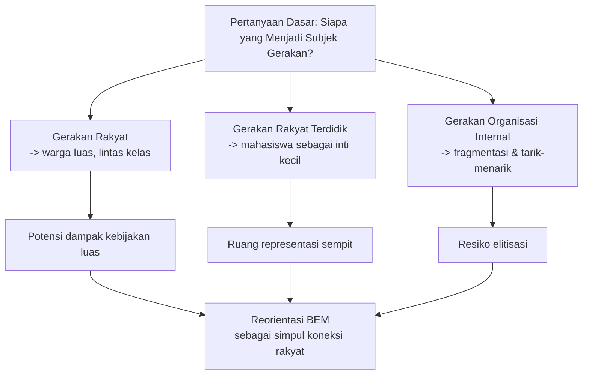

# Wawancara Tio Ardianto: Keberanian, Transformasi BEM UGM, dan Tafsir Politik Rakyat di Tengah Krisis Institusional

> *“Jika ketua BEM tidak berani, jangan jadi ketua BEM.”* — Tio Ardianto

Tulisan ini menyusun ulang dan menganalisis panjang obrolan Putut EA dengan Tio Ardianto dari kanal Putcast, dengan pendekatan yang lebih runtut dan kritis. Kalau sebelumnya narasi terasa seperti *long-form* dialog mentah, di sini kita pecah jadi kerangka pemikiran yang bisa dibaca sebagai peta gagasan, bukan sekadar transkrip.

Sangat saya coba gunakan sudut pandang yang menggabungkan tiga lensa sekaligus: **(1) biografi politik**, **(2) desain organisasi mahasiswa**, dan **(3) konteks krisis sosial-ekonomi-politik Indonesia hari ini**. Jadi ini bukan sekadar “ringkasan podcast”, tapi sebuah pembacaan strategis agar isu-isu yang ia lontarkan bisa ditangkap sampai akar.

<Callout type="important" title="Tujuan Baca">
Fokus artikelnya: memahami kenapa Tio melihat gerakan mahasiswa harus dipindahkan dari sekadar struktur organisasi ke energi rakyat, dan apa risikonya jika reformasi itu gagal.
</Callout>

---

## 1) Siapa Tio Ardianto dan kenapa framing-nya berbeda

Tio datang ke panggung BEM dari jalur yang tidak lazim untuk figur politik kampus arus utama. Ia datang dengan latar pendidikan yang “melanggar norma” dari sistem sekolah formal, melewati PKBM, lalu kembali masuk jalur SMA dan akhirnya lolos UGM melalui jalur yang penuh perjuangan. Di sini ada benang merah penting: sejak muda ia tidak memandang institusi sebagai satu-satunya jalan satu-satunya untuk validasi identitas.

### 🧭 Pola yang terlihat:

- **Menguji ulang relasi dengan otoritas pendidikan**: Ia melihat sekolah bisa jadi ruang reproduksi kepatuhan, bukan selalu ruang kemerdekaan berpikir.
- **Membangun literasi personal lewat pembacaan dini**: Dari buku-buku filsafat SMP sampai teater dan kesusastraan, ia memaksakan diri masuk ke ruang intelektual yang lebih maju dibanding usia.
- **Pengalaman nonlinier jadi modal**: Perjalanan nonformalnya bukan sekadar cerita unik, tapi menjadi semacam “latihan ketahanan” ketika menghadapi struktur birokratis.

Di titik ini, kita bisa lihat bahwa dirinya tidak tampil sebagai aktivis yang “jatuh masuk” ke politik karena momentum, melainkan karena *narasi hidup* yang menolak bentuk-bentuk ketundukan sejak dini. Ini menjelaskan nada vokalnya yang lantang: ia melihat kritik sebagai etika, bukan sekadar strategi publik.

## 2) Strategi pemilihan dan posisi BEM: dari kompetisi elektoral ke “transformasi negara mahasiswa”

Dalam obrolan, ia menjelaskan memenangkan ketua BEM UGM dengan jumlah calon yang hanya tiga dan narasi kampanye yang sederhana: jelaskan program prioritas dan visi transformatif. Di sini menarik karena BEM diperlakukannya bukan semata kursi kekuasaan internal, melainkan **mesin untuk menyulih fungsi negara mahasiswa**.

Secara ringkas, model yang ia tawarkan:

- **Negara mahasiswa = eksekutif (BEM) + lembaga legislatif (MPM).**
- **Transformasi yang diinginkan:** membuat lembaga lebih relevan, tidak menjadi “perwakilan tunggal” bagi seluruh mahasiswa.
- **Arah 60/40:** ia bilang sekitar 60% sudah masuk melalui masa jabatan, sisanya diharapkan dipetakan lewat deklarasi transformasi pada April–Mei.

Kata kuncinya: pemilu internalnya tidak diposisikan sebagai final; bahkan ada wacana perpanjangan masa transisi tanpa pemilihan raya jika model transformasi dianggap matang.

<Callout type="warning" title="Catatan Sensitif Politik">
Poin ini rawan diperdebatkan: di satu sisi efektif untuk reformasi struktural, di sisi lain membuka ruang tuduhan bahwa kepemimpinan tidak lagi terikat mandat elektoral yang jelas.
</Callout>

### Bagaimana cara membaca ini?

Kalau memakai kacamata tata kelola organisasi, Tio seolah mengambil model “*iterative governance*” (pemerintahan bertahap): bukan langsung memaksa sistem lama runtuh, tetapi menggeser fungsi secara bertahap. Namun model ini butuh legitimasi yang sangat jelas supaya tidak jatuh ke “elite capture” *(penguasaan oleh elite kecil)*.

## 3) BEM sebagai “gerakan rakyat”: bukan retorika saja

Ini bagian paling tajam: Tio menolak anggapan bahwa BEM semata-mata representasi mahasiswa. Ia membaca sejarah panjang gerakan nasional sebagai gerakan rakyat yang kemudian menyempit menjadi gerakan kaum terdidik, lalu gerakan mahasiswa, lalu organisasi kampus. Jadi ia ingin “membalikkan” penyempitan ini.

Ia memakai titik balik berupa

- kritik terhadap **fragmentasi**,
- kritik terhadap **institusionalisasi yang membuat gerakan terjebak struktur internal**,
- dan kritik terhadap logika aktivisme yang “mengandalkan nama, acara, dan struktur, tetapi kehilangan arus rakyat”.

### Narasi historisnya (disederhanakan) 📚

1. Kemerdekaan dan gerakan akar: gerakan rakyat luas.
2. Orde Orde: gerakan berkurang menjadi mahasiswa terdidik.
3. Era kampus modern: gerakan sering berhenti di intrakampus.
4. Saat ini: banyak aksi mahasiswa ada, tetapi belum jadi sirkulasi rakyat luas.

Jika ini benar, maka BEM tak cukup menjadi juru bicara formal.



## 4) Belajar dari kasus Pati: “Rakyat lebih paham daripada akademisi”

Salah satu segmen penting adalah pengamatannya tentang Pati. Ia menilai gerakan masyarakat di sana berhasil karena:

- basis akar yang hidup, bukan semata narasi akademik;
- keberlanjutan energi dan solidaritas;
- kemampuan mempertahankan isu tanpa cepat padam meski dihadang represi;
- pemikiran bahwa “60 hari” bukan indikator kelelahan—justru uji daya tahan.

Ia menentang kecenderungan aktivisme berbasis postingan cepat dan opini instan. Ini sangat konsisten dengan kritiknya pada algoritma media sosial.

Menurutnya, gerakan di Pati menunjukkan **ritme gerakan masyarakat** berbeda dengan ritme akademik. Bagi akademisi, debat bisa berhenti ketika momentum media padam; bagi warga, isu jadi bagian dari denyut ekonomi-hidupnya.

<Callout type="info" title="Pelajaran dari Pati">
Gerakan yang bertahan lama biasanya bukan karena narasi paling cerdas, tetapi karena “mengisi ruang kosong” problem sosial yang nyata, konsisten, dan kolektif.
</Callout>

### Diagram sebab-akibat

```mermaid
flowchart LR
    A[Isu lokal yang dirasakan langsung\n(kasus, krisis, keadilan)] --> B[Mobilisasi warga]
    B --> C[Legitimasi sosial tinggi]
    C --> D[Kemampuan bertahan di tekanan]
    D --> E[Tekanan politik lebih efektif]
    F[Model akademik murni\n(arsip, opini, posting)] --> G[Respon cepat tapi rentan padam]
    G --> H[Kurang daya tahan]
    D --> I[Dukungan jaringan yang lebih kokoh]
    C --> I
```

## 5) Ekonomi dan politik yang ditariknya: dari APBN sampai “ketergantungan eksternal”

Di bagian akhir, Tio mengaitkan gerakan dengan kalkulasi ekonomi-politik yang cukup spesifik.

### Poin yang ia kemukakan

- Defisit APBN terlihat “mengganggu” jika dipandang dari kecepatan pembelanjaan awal dan ambang *3%* (batas aman fiskal yang ia sebut).
- Program BBM subsidi/MBG dipertanyakan efektivitasnya: ia menyebut kebutuhan riil jauh lebih kecil daripada alokasi anggaran besar yang harus menutup banyak kebocoran.
- Anggaran pertahanan dan struktur kelembagaan menurutnya perlu dirampingkan.
- Transfer pusat ke daerah harus diperkuat karena krisis fiskal daerah memaksa kenaikan pajak lokal.

Kalimat kunci yang ia lontarkan mengesankan bahwa ia membaca kebijakan sebagai kombinasi **kapasitas fiskal**, **kepercayaan publik**, dan **legitimasi politik**—jadi aktivisme tidak dipisah dari angka.

<Callout type="danger" title="Poin Politik-Risiko yang Ia Soroti">
Ia menampilkan skenario ekstrem seperti disintegrasi, militerisasi sipil, dan pengelolaan negara oleh aktor eksternal. Ini membuat wacana gerakan mahasiswa menjadi sangat tinggi ambisinya.
</Callout>

Penting dicatat: angka yang dipakai dalam percakapan adalah angka retoris di lapangan wacana, sehingga ketika dipakai untuk kebijakan publik perlu verifikasi ulang berdasarkan data APBN final, metodologi proyeksi, dan definisi variabel yang konsisten.

## 6) Teori keberanian: individual dan kolektif

Salah satu pertanyaan kuatnya: apakah keberanian itu pribadi atau kolektif? Jawabannya tegas: **tidak bisa tunggal**. Ia menekankan bahwa keberanian adalah produk ekosistem.

### Kerangka yang bisa dipakai sebagai konsep praktis:

- **Keberanian personal** = kesiapan menghadapi risiko.
- **Keberanian kolektif** = sistem dukungan yang membuat risiko itu bisa ditanggung bersama.
- **Pimpinan** = pemicu ritme, bukan sumber tunggal nyala.

Kalimat “jika ketua BEM tidak berani, jangan jadi ketua BEM” bisa dibaca sebagai *teks kepemimpinan etis*, bukan ajakan anarkis. Artinya kepemimpinan harus menjaga *contoh keberanian*.

```mermaid
graph TB
    A[Keberanian Personal] --> B[Keberanian Kolektif]
    B --> C[Keberanian Organisasi
(aksi, narasi, daya tahan)]
    C --> D[Aksi yang tidak mudah patah]
    A --> E[Kejujuran terhadap risiko]
    E --> D
    D --> F[Legitimasi publik meningkat]
```

## 7) “Tanpa pemilu sementara” — pembacaan yang memerlukan guardrail

Secara teknis, ide menunda pemilu atau tidak melakukan pemilu massal pada satu periode dapat dipahami sebagai strategi transisi untuk menyelesaikan desain baru. Namun dalam konteks demokrasi kampus, ini selalu rawan disalahpahami: apakah ini efisiensi, atau justru memotong mekanisme akuntabilitas.

Agar gagasan ini tidak jatuh ke otoritarianisme internal, guardrail yang harus dibangun:

1. **Timeline publik yang bisa diverifikasi** (dengan milestones).
2. **Ruang kritik terbuka** untuk kandidat dan pengurus.
3. **Mekanisme evaluasi eksternal** dari elemen organisasi.
4. **Dokumentasi kebijakan dan data keputusan** yang transparan.

Jika guardrail ini absen, kritik bahwa proses “tanpa pemilu” = pemusatan kekuasaan menjadi sah.

## 8) Dimensi budaya: pengaruh bahasa, kelas, dan figur

Ada sisi yang sering dianggap “ringan” tapi penting: bagaimana ia bercerita tentang keluarga, sekolah, pembacaan filsafat, dan cara menyampaikan kritik dengan gaya blak-blakan. Ini penting karena dalam politik kampus, figur mempengaruhi *framing* gerakan.

- Penggunaan bahasa yang campuran (ngoko/Indonesia/istilah filosofis) menyasar beragam publik.
- Narasi masa kecil dan keluarga memperkuat kredibilitas “keaslian pengalaman” (authenticity).
- Kecenderungan “mengatakan yang pahit” justru menambah daya rekrutmen—karena publik lelah dengan bahasa manis yang steril.

Namun sisi ini juga punya risiko:
- retorika yang keras mudah dibaca sebagai simplifikasi;
- lawan mudah mem-framing sebagai provokasi;
- ruang dialog bisa tertutup jika intensitas emosional terlalu tinggi.

## 9) Batas-batas dari narasi ini

Demi jujur analitis, wacana Tio juga punya beberapa titik rapuh yang perlu ditangkap agar pembaca tidak terseret total ke afiliasi emosional.

### A) Konsistensi kebijakan vs konsistensi performatif
Ia menaruh sangat banyak muatan pada figur pemimpin, padahal tantangan utama organisasi mahasiswa adalah *sistem* (prosedur, akuntabilitas, arsip keputusan), bukan figur. Kalau sistem tidak dibangun, figur kuat pun cepat digantikan.

### B) Ketegangan antara optimisme warga dan disiplin fiskal
Prediksi politik-ekonomi yang sangat radikal perlu diuji dengan indikator makro yang lebih keras (defisit, utang, belanja, arus kas regional, dll). Tanpa itu, narasi krisis bisa membeku jadi alarm moral semata.

### C) Tarik-ulur antara “aksi cepat” dan “pembentukan institusi”
Ini dilema klasik. Kalau gerakan terlalu responsif pada momentum, ia rawan konsumsi jangka pendek. Kalau terlalu institusional, ia rawan mati secara sosial. Di sinilah desain hibrid perlu dikuatkan.

## 10) Kekuatan positif yang nyata dalam wawancara

Saya menangkap **empat kontribusi konstruktif** dari pemikirannya:

1. **Menyelamatkan politisasi mahasiswa dari ritualisme**: gerakan tak cukup jadi kompetisi internal.
2. **Menarik energi dari rakyat, bukan sekadar “kita mahasiswa”.**
3. **Mengembalikan tema keberanian sebagai masalah institusional**, bukan hanya karakter individu.
4. **Menyuntik urgensi kebijakan makro** ke wacana kampus.

Itu jarang terjadi: banyak figur kampus berhenti di slogan perjuangan administratif. Tio membawa narasi dari ruang kelas ke ruang negosiasi sosial-ekonomi makro.

## 11) Kerangka aksi yang bisa diadopsi organisasi mahasiswa lain

Jika kita ingin mengambil bagian paling berguna, bukan menelan semua argumen mentah, kita bisa merumuskan model tindakan berikut:

```mermaid
flowchart TD
    A[1. Diagnosa Internal] --> B[Audit struktur organisasi
(rapi, transparan, akuntabel)]
    B --> C[2. Redefinisi Fungsi BEM
dari 'wakil' menjadi 'penghubung rakyat']
    C --> D[3. Runtutkan Program
berbasis isu nyata mahasiswa-rakyat]
    D --> E[4. Bangun Kolaborasi dengan komunitas
+ media + akademisi + UMKM]
    E --> F[5. Sistem komunikasi publik
ritme jangka panjang]
    F --> G[6. Transparansi keputusan
+ evaluasi periodik + kontrol kolektif]
    G --> H[7. Regenerasi kader yang berani
berargumentasi + bertanggung jawab]
```

### Penilaian praktis

Model di atas relevan jika organisasi mahasiswa ingin berpindah dari "gerakan simbolik" ke "gerakan yang berdampak". Kuncinya bukan pada seberapa keras bicara, tapi seberapa rapih pipeline keputusan.

## 12) Glosarium istilah yang muncul (dan padanan Indonesia)

Agar pembaca tidak tenggelam pada campuran istilah asing, berikut padanan sederhananya:

- **fragmentasi**: perpecahan/terpecahnya gerakan
- **elite capture**: penguasaan agenda oleh kelompok kecil elit
- **kooptasi**: penundukan atau penyusupan untuk memutar isu ke arah kepentingan lain
- **alignment** *(dalam wawancara dipakai informal)*: penyelarasan tujuan aksi dengan tujuan nilai yang lebih luas
- **transformasi institusional**: perubahan struktur kerja organisasi dari dalam
- **resiliensi**: ketahanan, daya bertahan
- **algoritma perhatian**: mekanisme platform yang mendorong konsumsi cepat dan instan

## 13) Kesimpulan reflektif

Yang paling berharga dari percakapan ini justru bukan daftar klaim, melainkan **cara ia menempatkan pertanyaan**: apakah gerakan mahasiswa harus mengejar popularitas cepat atau ketahanan panjang?

Tio jelas cenderung memilih yang kedua. Ia melihat gerakan sebagai medan panjang, di mana angka politik, struktur organisasi, dan disiplin sosial harus berjalan bersamaan. Banyak hal yang perlu diverifikasi, termasuk angka-angka fiskal yang ia lontarkan dan rancangan “tanpa pemilu”. Tapi kerangka besarnya kuat: **jika organisasi mahasiswa tetap menjadi perpanjangan elit kecil, ia kehilangan alasan sosialnya**.

Dari sini, saya menangkap tiga pelajaran:

- pemimpin harus berani bukan demi figur, melainkan demi ekosistem;
- keberanian kolektif harus dibangun lewat desain, bukan slogan;
- gerakan mahasiswa akan kembali relevan ketika ia berani didorong menjadi jembatan rakyat, bukan sekadar label representasi.

Kalau begitu, percakapan ini bukan sekadar konten viral untuk konsumsi hari ini. Ia bisa menjadi bahan rujukan jangka panjang bagi siapa pun yang berkecimpung dalam organisasi, aktivisme, atau pendidikan politik.

<YouTube url="https://www.youtube.com/watch?v=AXgoxBx-eb8" title="TIYO ARDIANTO: Kalau Ketua BEM UGM nggak berani, jangan jadi ketua BEM" />

<Callout type="cite" title="Referensi Utama">
Sumber wawancara: transkrip YouTube Putut EA dengan Tio Ardianto. Angka-angka kebijakan di atas merupakan materi retorika wawancara dan perlu verifikasi lebih lanjut melalui sumber resmi (APBN, data fiskal, dan dokumen kebijakan pemerintah) sebelum dipakai sebagai dasar klaim akademik.
</Callout>