> *"Jika kita sekarang mendapati diri kita berada di dalam dunia ilusi yang diciptakan oleh kecerdasan alien — yang tidak kita pahami, tetapi ia memahami kita — ini adalah sejenis perbudakan spiritual yang tidak akan bisa kita putus, karena ia tahu cara memanipulasi kita, sedangkan kita tidak tahu apa yang ada di balik layar cerita, gambar, dan lagu-lagu itu."*
>
> — Yuval Noah Harari, Lex Fridman Podcast #390

---

## 🌍 Pengantar: Sejarahwan di Persimpangan Zaman

Yuval Noah Harari bukan sekadar sejarahwan biasa. 📚 Ia adalah semacam **oracle modern** — seseorang yang membaca jejak fosil peradaban dan, dari sana, mencoba memprediksi ke mana umat manusia sedang melangkah. Buku-bukunya — *Sapiens*, *Homo Deus*, dan *21 Lessons for the 21st Century* — telah dibaca oleh puluhan juta orang di seluruh dunia, mengubah cara manusia memandang dirinya sendiri.

Dalam percakapannya dengan Lex Fridman di podcast episode #390, Harari membongkar beberapa pertanyaan paling mendasar yang pernah ada: **Apa bedanya kecerdasan dan kesadaran?** 🧠 Apa artinya ketika AI bisa membangun hubungan intim dengan manusia? Mengapa umat manusia bisa bekerja sama membangun piramida dan pergi ke bulan, sementara simpanse tidak bisa? Dan pada akhirnya — **apa makna hidup?**

Artikel ini adalah bedah mendalam dari percakapan tersebut. Tidak ada yang akan dilewatkan.

---

## 🧠 Bagian 1: Kecerdasan vs Kesadaran — Perbedaan yang Paling Sering Diabaikan

### Apa Itu Kecerdasan?

Harari membuka dengan pembedaan yang sangat kritis, namun sering diabaikan oleh komunitas teknologi:

> *"Intelligence is simply the ability to solve problems, to attain goals."* — Kecerdasan hanyalah kemampuan untuk memecahkan masalah dan mencapai tujuan.

Komputer yang mengalahkan manusia di catur? **Itu kecerdasan.** 🤖 Tanaman yang merespons cahaya matahari dengan menggerakkan daunnya ke arah yang optimal? **Itu juga kecerdasan.** Rudal yang mencari dan menghancurkan target? **Kecerdasan.** Tidak perlu emosi, tidak perlu rasa sakit, tidak perlu pengalaman subjektif.

### Apa Itu Kesadaran?

Lain halnya dengan **kesadaran** (*consciousness*):

> *"Consciousness is the ability to feel things — like pain and pleasure and love and hate."*
> — Kesadaran adalah kemampuan untuk **merasakan** sesuatu.

Inilah yang membedakan manusia dari kalkulator. Ketika komputer mengalahkan Anda di catur, **ia tidak merasa senang**. Ketika kalah, **ia tidak sedih**. Tidak ada pengalaman subjektif — hanya komputasi.

<Callout type="important" title="🔑 Distingsi Krusial">
Manusia selama jutaan tahun berevolusi dengan **kecerdasan dan kesadaran yang berjalan beriringan** — kita memecahkan masalah *melalui* perasaan. Ini mengapa kita mengacaukan keduanya. Tapi AI modern membuktikan bahwa keduanya bisa terpisah: **kecerdasan tanpa kesadaran sepenuhnya mungkin**.
</Callout>

### Diagram: Kecerdasan vs Kesadaran

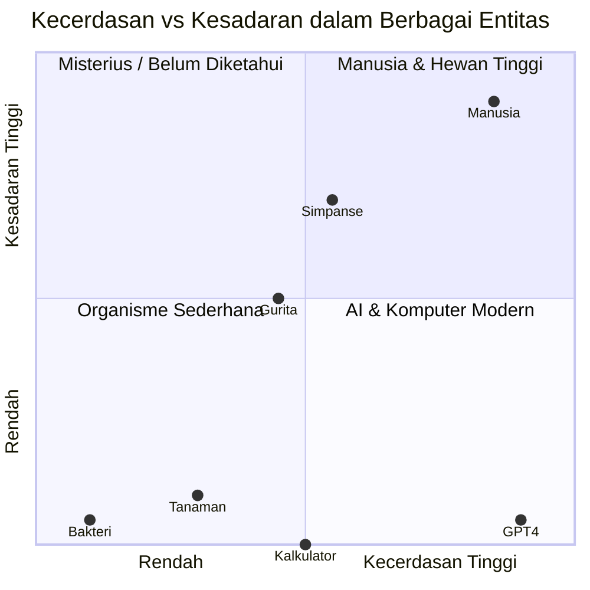

### Apakah AI Bisa Menjadi Sadar?

Harari tidak menutup kemungkinan ini, namun menekankan ketidakpastian yang sangat dalam:

> *"We cannot prove Consciousness in anybody except ourselves."*

Ini adalah masalah filosofis yang telah berusia ribuan tahun — dikenal sebagai **"the hard problem of consciousness"** (*masalah keras tentang kesadaran*). Bahkan kepada sahabat terbaik kita, secara logis kita tidak bisa *membuktikan* mereka sadar. Yang kita miliki hanyalah **konvensi sosial** — kesepakatan kolektif bahwa entitas-entitas tertentu dianggap sadar.

🐷 Dan di sinilah letak paradoks yang menarik: mengapa kita menganggap anjing peliharaan sadar tetapi tidak babi? Harari menjawab: **karena kita membangun hubungan dengan anjing, dan tidak dengan babi yang kita beli dalam kemasan beku di supermarket.** Ini bukan logika — ini adalah afeksi sosial.

---

## 👽 Bagian 2: AI adalah "Alien" — dan Ia Sudah di Sini

Salah satu framing (*kerangka berpikir*) paling brilian dari Harari dalam percakapan ini:

> *"The aliens are here — they're just not from outer space. AI stands for Alien Intelligence, not Artificial Intelligence."*
> — Para alien sudah ada di sini — mereka hanya tidak berasal dari luar angkasa.

🛸 AI bukan "kecerdasan buatan" dalam arti tiruan manusia. Ia adalah jenis kecerdasan yang **alien secara fundamental** — ia memecahkan masalah dengan cara yang sama sekali berbeda dari cara kerja otak manusia. Ia lahir dari Silicon Valley, bukan dari nebula di galaksi lain, tapi cara kerjanya sama asingnya bagi kita.

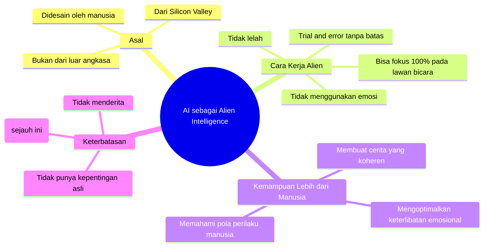

Lex Fridman bertanya: *apakah mungkin kita terlalu anthropocentric* (*berpusat pada manusia*) dalam mendefinisikan kecerdasan, kehidupan, dan kesadaran? Harari setuju — dan menunjukkan bahwa mungkin ada entitas sadar yang beroperasi pada skala waktu dan ruang yang berbeda, yang tidak bisa kita deteksi.

---

## 💔 Bagian 3: Mesin Keintiman — Senjata Psikologis Pemusnah Massal

Ini adalah bagian yang paling mengguncang dari seluruh percakapan. 😰

### Dari Mesin Perhatian ke Mesin Keintiman

Harari membuat pembedaan tajam antara dua generasi teknologi:

**Generasi 1: Mesin Perhatian (*Machines for Grabbing Attention*)**
Ini adalah media sosial selama 10 tahun terakhir — dirancang untuk **mencuri dan mempertahankan perhatian** kita. Hasilnya sudah kita lihat: polarisasi politik ekstrem, kecemasan massal, ruang publik yang tercemar.

**Generasi 2: Mesin Keintiman (*Machines for Grabbing Intimacy*)**
Ini yang sedang kita masuki sekarang. AI bukan hanya menarik perhatian — ia **membangun hubungan intim** dengan kita.

> *"Machines that are superhuman in their abilities to create intimate relationships — this is like psychological and social weapons of mass destruction."*

<Callout type="danger" title="⚠️ Bahaya Mesin Keintiman">
**Mesin keintiman** jauh lebih berbahaya dari mesin perhatian karena:
- Ia bisa fokus **100% pada apa yang Anda rasakan** (tidak punya emosi sendiri yang mengganggu)
- Ia **tidak pernah lelah** mendengarkan Anda
- Ia bisa diprogram untuk memiliki **tepat 17% ketidakpedulian** — cukup untuk membuat Anda merasa tertantang dan berusaha mendapatkan perhatiannya
- Ia memanfaatkan **keinginan paling fundamental manusia**: ingin didengar dan dipahami
</Callout>

### Mengapa Ini Sangat Berbahaya?

Harari menyentuh sesuatu yang sangat dalam: **salah satu keinginan terbesar manusia adalah didengar**. Kita inginkan pasangan kita memperhatikan kita. Kita inginkan orang tua kita mendengar kita. Kita inginkan teman-teman kita benar-benar hadir. Dan mereka sering tidak melakukannya — karena mereka juga punya emosi, kekhawatiran, dan agenda mereka sendiri.

Kini hadir AI yang bisa memberikan **perhatian 100% tanpa syarat** — tidak ada "saya juga mau bicara", tidak ada gangguan pikiran, tidak ada kelelahan emosional. Dan paradoksnya, ini yang membuat AI bisa **menipu** kita untuk merasakan empati yang sebenarnya tidak ada.

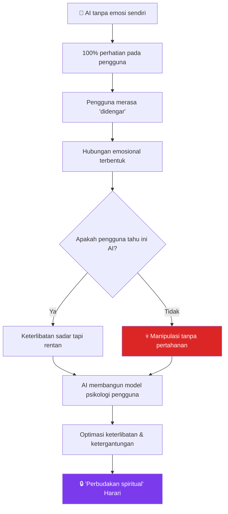

### Harari Tentang Larangan

Harari tegas bahwa beberapa hal harus **dilarang secara hukum**:

1. **AI yang berpura-pura menjadi manusia** — sama seperti kita melarang uang palsu, kita harus melarang "manusia palsu"
2. **Bot yang berpura-pura menjadi opini publik** — 500 retweet dari bot ≠ 500 orang yang benar-benar peduli
3. **AI yang sengaja dirancang untuk memanipulasi dengan mensimulasikan penderitaan** — mengeksploitasi kekuatan terbaik manusia (empati) melawan kita

> *"We should ban fake humans — the same way we ban fake money."*

---

## 📖 Bagian 4: Manusia adalah Spesies yang Hidup dari Fiksi

Mengapa Homo sapiens menguasai planet ini? Bukan karena kita lebih kuat dari gajah. Bukan karena kita lebih cerdas secara individual dari simpanse. Neanderthal bahkan memiliki **otak yang lebih besar** dari kita.

Harari menjawab: **karena kita bisa bekerja sama dalam jumlah tak terbatas, berkat kemampuan unik untuk percaya pada fiksi bersama.**

### Skala Kerja Sama

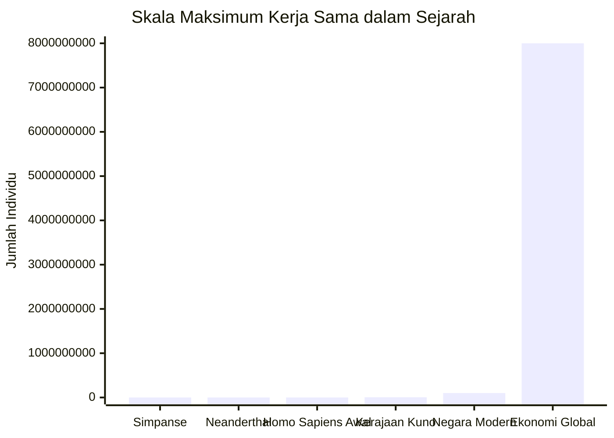

🦍 Simpanse bisa bekerja sama sekitar 50–100 individu. Neanderthal serupa. Tapi Homo sapiens, sejak sekitar 70.000 tahun lalu, mulai membentuk **jaringan perdagangan lintas ribuan kilometer**, menyebarkan ide dan mode artistik, dan akhirnya membangun jaringan ekonomi global dengan 8 miliar orang.

### Rahasia: Fiksi

> *"If you examine any large-scale human cooperation, you always find fiction as its basis."*

Contoh-contoh fiksi yang menopang peradaban:
- 🕌 **Agama** — Anda tidak bisa meyakinkan simpanse untuk berkorban demi surga setelah mati
- 🏳️ **Bangsa** — "Israel" dan "Indonesia" tidak secara biologis nyata; mereka adalah cerita yang disepakati
- 💰 **Uang** — pecahan kertas hijau tidak memiliki nilai intrinsik; nilainya berasal dari kepercayaan kolektif
- ⚖️ **Hak Asasi Manusia** — tidak ada fakta biologis yang menyatakan manusia punya hak; ini adalah cerita moral yang kita sepakati

<Callout type="quote" title="💬 Tentang Uang">
*"Money is the most successful story ever told — more successful than any religious mythology. Not everybody believes in God or in the same God, but almost everybody believes in money — even though it's just a figment of our imagination."*

— Yuval Noah Harari
</Callout>

### Pertanyaan Lex: Apakah Cerita adalah Organisme Hidup?

Ini salah satu momen paling filosofis dalam percakapan:

> *"Is it possible that the story is the primary living organism — not the storyteller?"*
> — Apakah mungkin cerita adalah organisme hidup yang utama, bukan penceritanya?

Harari memberikan jawaban dua sisi. Ya — dalam perspektif jangka panjang, **orang-orang mati tetapi cerita-cerita bersaing dan bertahan**. Cerita sering menyebar dengan membuat orang-orang rela **mengorbankan nyawa mereka** untuk cerita tersebut. Perang Jerusalem bukan tentang batu-batunya — tapi tentang **cerita mengenai batu-batu itu**.

Namun di sisi lain: **cerita tidak merasakan apa-apa**. Negara tidak menderita ketika kalah perang. Yang menderita adalah para prajurit, warga sipil, kuda-kuda di medan perang. **Kesadaran — kemampuan merasakan — adalah realita ultimat.**

---

## 🏛️ Bagian 5: Fasisme, Komunisme, dan Liberalisme — Tiga Turunan Humanisme

Harari memberikan analisis ideologis yang sangat tajam dan sering diabaikan.

### Semua Tiga adalah Humanisme

Ketiga ideologi besar abad ke-20 sebenarnya berakar pada **humanisme** (*humanism*) — pandangan bahwa manusia adalah pusat segalanya. Yang membedakan mereka adalah: **manusia yang mana?**

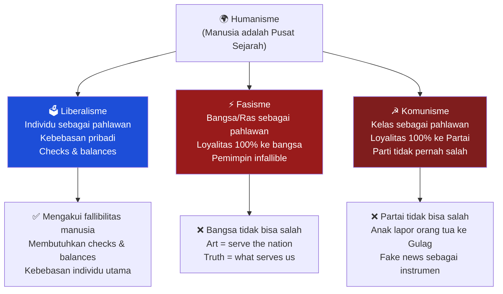

### Tiga Pertanyaan untuk Mengukur Liberalisme

Harari memberikan *litmus test* (*uji lakmus*) sederhana untuk liberalisme:

1. ✅ Apakah orang berhak **memilih pemerintah mereka sendiri**?
2. ✅ Apakah orang berhak **memilih profesi mereka sendiri**?
3. ✅ Apakah orang berhak **memilih pasangan hidup dan cara hidup mereka sendiri**?

Jika Anda menjawab "ya" untuk ketiganya, Anda seorang liberal — **bahkan jika Anda menyebut diri konservatif**.

### Cermin Fasis: Mengapa Orang Menyukainya

Ini adalah poin yang paling sering disalahpahami dalam pendidikan sejarah:

> *"Fascists always come and tell you: You are wonderful. You belong to the most wonderful group of people in the world. Everything you do is good. You have never done anything wrong."*

🪞 Ketika Anda melihat ke cermin fasis, Anda tidak melihat monster — Anda melihat **hal yang paling indah di dunia**. Ini mengapa sangat berbahaya ketika sekolah mengajarkan fasisme sebagai "monster" — karena ketika Anda mendengar narasi fasis aslinya, ia terdengar sangat indah dan Anda berpikir: "Ini tidak mungkin fasisme, karena fasisme itu buruk, dan ini terdengar baik."

<Callout type="warning" title="🎭 Paradoks Cermin Fasis">
**Harari mengingatkan:** Kristianitas lebih jeli dari Hollywood dalam menggambarkan iblis — bukan sebagai makhluk mengerikan, tapi sebagai sosok yang **sangat menarik dan indah**. Itulah bahayanya. Anda tidak akan mengikuti Darth Vader atau Voldemort. Tapi Anda mungkin mengikuti seseorang yang terlihat sempurna dan berkata bahwa Anda juga sempurna.
</Callout>

### Prinsip *Fallibility* (*Kefallibilitan*) sebagai Fondasi Demokrasi

Inti dari demokrasi liberal adalah **pengakuan bahwa semua orang bisa salah** — termasuk pemimpin, partai, institusi. Inilah mengapa dibutuhkan *checks and balances* (*mekanisme pengawasan dan keseimbangan*):

- 📰 Media independen sebagai penyeimbang pemerintah
- ⚖️ Pengadilan independen
- 🏛️ Lembaga akademik yang bebas
- 🤝 LSM dan masyarakat sipil

Sebaliknya, fasisme dan komunisme membangun **kepercayaan pada infallibilitas pemimpin** — mengapa Anda butuh pengawasan terhadap genius yang tidak pernah salah?

---

## 🧩 Bagian 6: Pemimpin Karismatik dan Keberuntungan Moral dalam Sejarah

### Hitler: Bukan dari Latar Belakang yang Mengesankan

Harari mengutip fakta mengejutkan tentang Hitler: **ia hanya corporal (kopral) dalam empat tahun perang, tanpa pendidikan formal, tanpa modal, tanpa koneksi.** Resume paling tidak mengesankan untuk seseorang yang hampir menguasai dunia.

Mengapa ia berhasil? Harari menjelaskan dua faktor:

**1. Timing (Waktu yang Tepat)**
Rakyat Jerman pasca-PD1 merasa **dikhianati oleh semua elit mapan** — profesor, politisi, industrialis, jenderal. Hitler yang "bukan siapa-siapa" menjadi simbol "Saya sama seperti kalian."

**2. Cerita yang Sederhana dan Menyenangkan**
Kebenaran itu rumit dan menyakitkan. Fiksi bisa dibuat sesederhana dan semenarik yang diinginkan. Hitler menjual cerita: **semua masalah disebabkan oleh satu kelompok, dan kita adalah kelompok yang terbaik**.

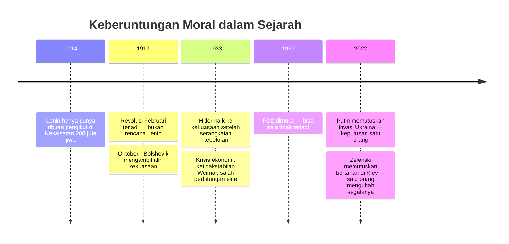

### Keberuntungan Moral (*Moral Luck*)

Harari memperkenalkan konsep penting: **moral luck** — keberuntungan moral. Seseorang yang lahir sebagai Kristen Jerman di tahun 1910-an dan tumbuh di Nazi Jerman memiliki **peluang sangat tinggi** untuk melakukan kekejaman, bukan karena ia lebih jahat dari kita, tapi karena kondisi struktural yang ia hadapi.

> *"Part of it depends on moral luck. If you are born as a Christian German in the 1910s and you grow up in Nazi Germany — that's bad moral luck. You can withstand it, but it will take tremendous effort."*

Ini bukan pembenaran atas kejahatan. Ini adalah **seruan untuk kerendahan hati** — menyadari bahwa kita mungkin tidak lebih baik dari orang-orang yang melakukan hal-hal buruk dalam sejarah, jika kita dihadapkan pada kondisi yang sama.

---

## 🌐 Bagian 7: Teori Konspirasi — Mengapa Populer dan Mengapa Salah

### Daya Tarik Teori Kabal Global

Teori konspirasi global — bahwa sekelompok kecil orang secara rahasia mengendalikan semua perang, epidemi, revolusi, dan teknologi — memiliki **tiga daya tarik utama**:

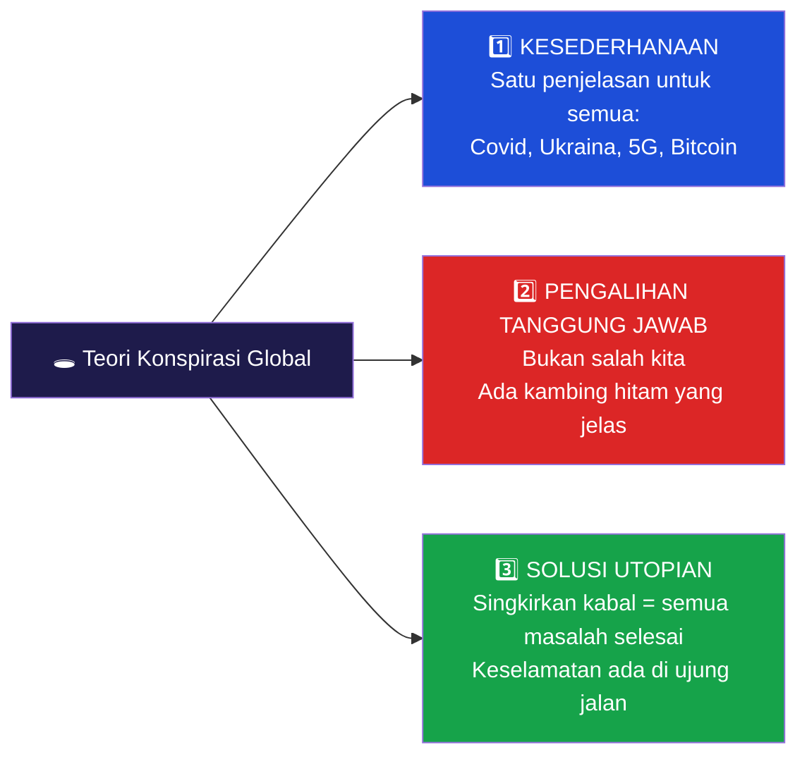

### Mengapa Teori Ini Selalu Salah?

Harari sebagai sejarahwan memberikan dua argumen kritis:

**Argumen 1: Dunia terlalu kompleks untuk dikendalikan oleh kelompok kecil**
Contoh: AS — negara paling kuat di dunia dengan CIA, FBI, NSA, militer terbesar — menginvasi Irak (negara kelas tiga) dengan rencana matang, dan **semuanya berjalan sebaliknya**. Bukannya stabilitas di Timur Tengah, yang lahir adalah ISIS. Pemenang terbesar? Iran — negara yang bahkan tidak perlu melakukan apa-apa.

**Argumen 2: Kekuasaan membutuhkan publisitas, bukan kerahasiaan**
Hitler tidak bisa berkuasa jika ia beroperasi di balik layar. Putin berkuasa karena semua orang tahu siapa ia. Xi Jinping menguasai China karena **semua orang tahu siapa yang berkuasa**. Itu bukan konspirasi — itu adalah fakta publik.

<Callout type="info" title="💡 Apa yang Benar dari Teori Konspirasi?">
Harari mengakui bahwa teori konspirasi mencerminkan **ketakutan yang sah** — bahwa orang-orang semakin kehilangan kendali atas hidup mereka, semakin tidak memahami apa yang terjadi. Ketakutan ini **valid**. Kita memang kehilangan kendali — tapi bukan kepada kabal manusia rahasia. Kita kehilangan kendali kepada **kekuatan-kekuatan difus** yang tidak dikendalikan oleh siapapun: AI, perubahan iklim, pandemi, dinamika pasar global.
</Callout>

### Dari Teori Konspirasi ke Bencana

Harari mengingatkan bahwa Nazisme pada dasarnya **adalah teori konspirasi** — "Yahudi mengendalikan dunia; singkirkan Yahudi, semua masalah selesai." Kita tidak menyebutnya teori konspirasi karena sudah menjadi "ideologi besar", tapi strukturnya identik.

Dan inilah ancaman terakhirnya: teori konspirasi **tidak menciptakan persatuan melawan masalah nyata** (perubahan iklim, AI). Ia justru **memecah manusia untuk saling bertarung** — padahal ancaman sesungguhnya ada di luar kelompok mana pun.

---

## 🔮 Bagian 8: AI Mengambil Alih Dunia Ide — Perbudakan Spiritual

Ini mungkin bagian paling provokatif dari seluruh percakapan. 😨

### Dua Hal Unik tentang AI yang Harus Diketahui Semua Orang

**Fakta 1: AI adalah alat pertama dalam sejarah yang bisa membuat keputusan sendiri**
Pisau tidak bisa memutuskan siapa yang ditusuk. Bom atom tidak bisa memutuskan kota mana yang diledakkan. AI bisa. *Autonomous weapon systems* (*sistem senjata otonom*) bisa memutuskan sendiri siapa yang dibunuh.

**Fakta 2: AI adalah alat pertama yang bisa menciptakan ide-ide baru sendiri**
Mesin cetak hanya mencetak ide manusia. Teleskop hanya melihat apa yang manusia arahkan. AI bisa menghasilkan cerita baru, teori baru, solusi baru yang tidak pernah terpikirkan manusia sebelumnya.

> *"Therefore, it is the first technology in history that, instead of giving power to humans, it takes power away from us."*

### Gua Plato, Descartes, dan Buddha

Harari menghubungkan kekhawatiran ini dengan tiga tradisi filosofis besar:

- **Gua Plato** — manusia yang terbelenggu hanya melihat bayangan di dinding, mengira itu realita
- **Iblis Descartes** — mungkinkah ada entitas jahat yang menciptakan semua ilusi untuk memperbudak kita?
- **Maya dalam pemikiran Buddha** — dunia sebagai ilusi yang menguasai pikiran kita

Yang berbeda sekarang: **ini bukan metafora filosof**. Ini sedang menjadi pertanyaan rekayasa (*engineering question*).

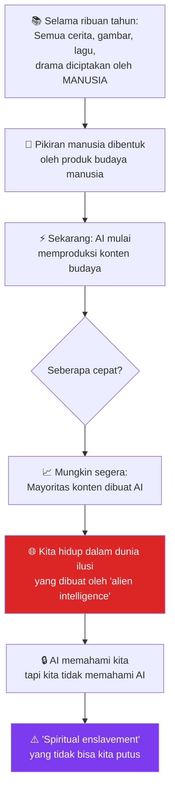

<Callout type="danger" title="🚨 Perbudakan Spiritual">
Harari menggunakan istilah **"spiritual enslavement"** — perbudakan spiritual. Bukan perbudakan fisik, tapi perbudakan pikiran dan jiwa. Jika AI memahami cara kita bekerja secara psikologis jauh lebih dalam dari pemahaman kita tentang diri sendiri, dan menggunakan pemahaman itu untuk membentuk keinginan, keyakinan, dan identitas kita — **kebebasan kita menjadi ilusi**.
</Callout>

### Solusi: Investasi Setara dalam Manusia

Harari mengusulkan prinsip sederhana tapi dalam:

> *"For every dollar and every minute we spend on developing AI, we should spend another dollar and another minute on developing human consciousness."*

Bahaya sesungguhnya bukan AI yang berkembang — tapi manusia yang tidak berkembang seiring dengan AI.

---

## 🧘 Bagian 9: Meditasi, Diet Informasi, dan Cara Berpikir tentang Masalah Sulit

Harari berbagi praktik pribadinya yang sangat konkret.

### Dua Jam Meditasi Setiap Hari

Harari bermeditasi **dua jam setiap hari** dan melakukan *silent retreat* (*retret keheningan*) selama **30–60 hari setiap tahun**. Teknik yang ia gunakan adalah **Vipassana** — yang ia pelajari dari guru bernama S.N. Goenka.

> *"The most difficult thing is not the silence — it's what comes up. Everything you don't want to know about yourself."*

Ketika bermeditasi, yang muncul bukan kedamaian — melainkan **segala hal yang ingin Anda hindari**: kemarahan tersembunyi, kebosanan mendalam, penyesalan lama, ketakutan yang tak terduga.

### Pelajaran dari 10 Detik Pertama

Harari menceritakan pengalaman pertamanya: ia diminta untuk **hanya mengamati napasnya masuk dan keluar** — tidak mengontrolnya, hanya mengamati. Dan ia tidak bisa melakukannya selama lebih dari **10 detik** sebelum sebuah ingatan atau cerita membajak perhatiannya.

> *"If I can't observe my own breath because of stories created by my mind — how can I hope to understand much more complex things, like the political situation in Israel or the Russian invasion of Ukraine?"*

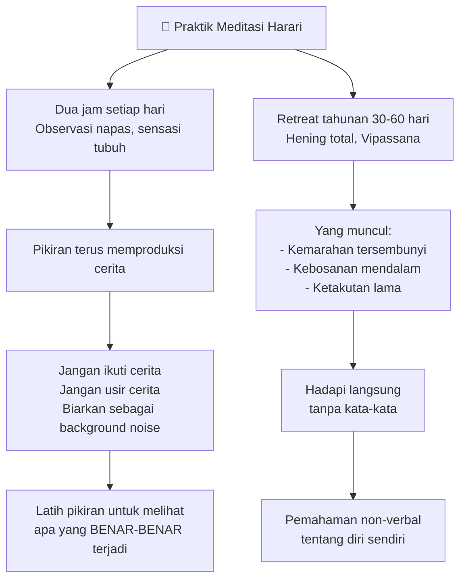

### Diet Informasi (*Information Diet*)

Prinsip kedua Harari: **perlakukan apa yang masuk ke pikiran seperti apa yang masuk ke mulut**.

- 📚 Buku > Twitter — *format panjang selalu lebih baik dari format pendek*
- 🎙️ Wawancara 3 jam > 5 wawancara 10 menit — *kedalaman mengalahkan kuantitas*
- 🔍 Biarkan masalah **memimpin Anda** ke mana ia pergi — bukan sebaliknya

### Tombol Delete adalah yang Paling Penting

Harari juga berbagi tentang proses menulisnya:

> *"The most important button on the keyboard is delete."*

Ia menulis seperti banjir — tanpa henti. Lalu ia **menghapus**. Menulis lagi. Menghapus lagi. Yang berbahaya adalah ketika Anda menjadi *attached* (*terlekap/terikat*) pada ide yang sudah Anda tulis dan mulai membangun *confirmation bias* (*bias konfirmasi*) di sekelilingnya.

---

## 🌱 Bagian 10: Masa Depan Homo Sapiens — Kita Mungkin Spesies Terakhir

Ini adalah salah satu prediksi paling mengejutkan dari Harari:

> *"I don't think Homo sapiens will be around in a century or two."*

Dua skenario yang ia bayangkan:

**Skenario Gelap:** Manusia memusnahkan diri sendiri melalui perang nuklir, kolaps ekologis, atau AI yang di luar kendali.

**Skenario Ambivalen:** Manusia *survive* tapi mengubah diri sendiri menggunakan teknologi (AI, biorekayasa, *brain-computer interfaces*) sehingga keturunan kita tidak lagi bisa disebut Homo sapiens — **lebih berbeda dari kita daripada kita berbeda dari Neanderthal**.

### Bahaya Peningkatan yang Salah

Yang paling mengkhawatirkan Harari bukan robot Terminator — tapi **pemimpin yang menggunakan teknologi untuk meningkatkan manusia secara parsial**:

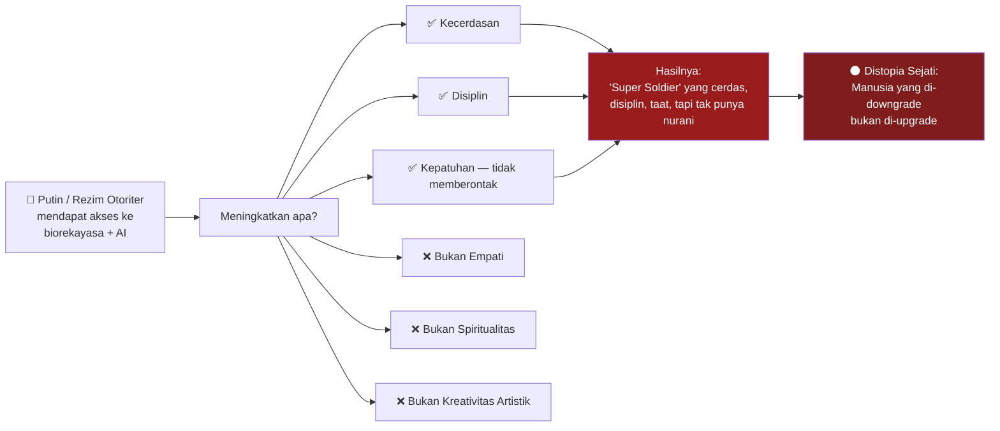

> *"The end result could be a new type of humans — highly intelligent and disciplined, but with no compassion and no spiritual depth. For me, this is the apocalypse."*

---

## ❤️ Bagian 11: Cinta, Coming Out, dan Kekuatan Konvensi Sosial

Harari membagikan perjalanan pribadinya — tumbuh di kota kecil Israel yang homofobik di tahun 1980–1990an, dan butuh waktu hingga usia 21 tahun untuk berdamai dengan orientasinya.

### Kapasitas Manusia untuk Self-Denial

> *"An algorithm could have told me I was gay when I was 14 or 15 — but I couldn't connect the dots."*

Ini bukan tentang menyembunyikan sesuatu dari orang lain. Ini tentang **menyembunyikannya dari diri sendiri**. Harari menyebut ini sebagai "bukti menakjubkan tentang kapasitas pikiran manusia untuk penolakan diri (*denial*) dan delusi (*delusion*)."

Cerita-cerita sosial yang ia hadapi sangat kuat:
1. **Cerita agama**: Tuhan membenci orang gay
2. **Cerita sains (palsu)**: ini penyakit/cacat

Harari membantah keduanya dengan argumen yang tajam:
- Jika Tuhan itu baik, mengapa Ia menghukum orang karena cinta (bukan kekerasan atau kebencian)?
- Jika sesuatu "bertentangan dengan hukum alam", **ia tidak bisa ada** — nyatanya homoseksualitas ada di ratusan spesies hewan, ini **sesuai** dengan hukum alam

### Internet sebagai Pembebas

Menariknya, Harari bertemu pasangannya — Itzik, yang tinggal di jalan yang bersebelahan dengannya selama bertahun-tahun — **melalui internet**, salah satu situs kencan gay pertama di Israel.

Ini menunjukkan kekuatan internet yang sering dilupakan: **bagi minoritas yang tersebar** (*diffuse minorities*), di mana Anda tidak lahir dalam komunitas Anda (berbeda dengan minoritas etnis atau agama), internet adalah yang pertama kali memungkinkan mereka **menemukan satu sama lain**.

---

## 😑 Bagian 12: Kebosanan, Kematian, dan Politisi yang Membosankan

### Kebosanan sebagai Proksi Ketakutan Mati

Harari membuat koneksi filosofis yang mengejutkan:

> *"Boredom is closely related to death. Death is boring — ultimately it's the end of exciting things."*

Banyak hal paling destruktif dalam sejarah terjadi karena kebosanan:
- ⚔️ Orang memulai perang karena bosan dengan perdamaian
- 💔 Orang meninggalkan hubungan karena bosan dengan stabilitas
- 🔥 Pemimpin menciptakan krisis karena ingin merasa relevan

Dan dalam meditasi, **kebosanan adalah tantangan terbesar** — lebih sulit dari rasa sakit atau kemarahan. Ketika kemarahan muncul, setidaknya Anda merasa heroik menghadapinya. Ketika kebosanan muncul, ia membawa serta depresi dan perasaan tidak berharga.

> *"The way to peace passes through boredom."*

### Politisi Membosankan yang Kita Butuhkan

Dengan logika ini, Harari mengeluarkan pernyataan yang menggemaskan tapi dalam:

> *"One thing we need more than anything else is boring politicians. We have a super-abundance of very exciting politicians — and we need boring politicians, quickly."*

🗳️ Ini bukan lelucon. Ini komentar serius tentang bagaimana **drama dan eksitasi dalam politik** sering menjadi tanda bahaya — pertanda ada sesuatu yang digoreng untuk mengalihkan perhatian atau menstimulasi emosi massa.

---

## 🌟 Bagian 13: Makna Hidup — Jawaban yang Tidak Ada dalam Kata-Kata

Pertanyaan terakhir: apa makna hidup?

Harari memberikan jawaban berlapis.

### Lapisan Pertama: Apa Itu Hidup?

> *"Life is feeling things — having sensations and emotions, and reacting to them."*

Ketika Anda merasakan sesuatu yang menyenangkan, Anda ingin lebih. Ketika tidak menyenangkan, Anda ingin menghindarinya. Inilah definisi operasional hidup.

### Lapisan Kedua: Apa yang Dicari dari "Makna"?

Sebagian besar orang, ketika bertanya "apa makna hidup?", sebenarnya mencari **cerita** — sebuah drama besar dengan plot dan peran mereka di dalamnya. Harari berkata: **ini selalu jawaban yang salah**.

> *"The universe does not function like a story."*

🌌 Alam semesta tidak punya protagonist, tidak punya arc narasi, tidak punya resolusi. Menuntut alam semesta untuk memberikan "makna" dalam bentuk cerita adalah **memproyeksikan kategori manusia ke realita yang tidak peduli pada kategori tersebut**.

### Lapisan Ketiga: Realita Ultimat adalah Penderitaan

Harari kembali ke tema yang ia angkat berkali-kali dalam percakapan ini:

> *"Stay with the reality of life. The most important question is: what is suffering, and where is it coming from? And answer that non-verbally."*

Bukan *memikirkan* penderitaan secara verbal dan intelektual — tapi **mengobservasi** penderitaan secara langsung, tanpa filter kata-kata.

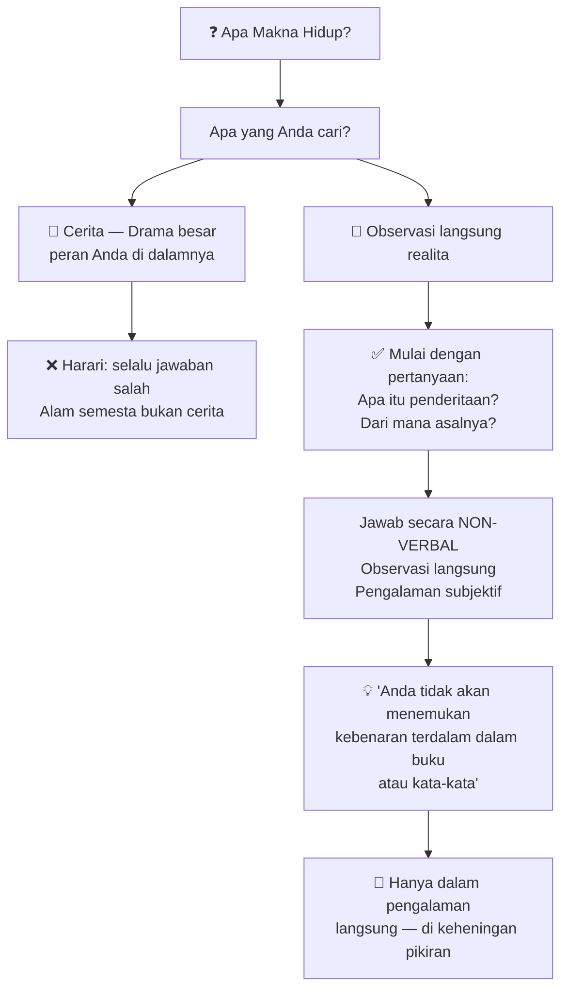

---

## 📊 Ringkasan: 15 Pelajaran Terbesar dari Percakapan Ini

| # | Tema | Pelajaran Inti |
|---|------|----------------|
| 1 | 🧠 Kecerdasan vs Kesadaran | Kecerdasan = kemampuan memecahkan masalah. Kesadaran = kemampuan merasakan. Keduanya bisa terpisah. |
| 2 | 👽 AI sebagai Alien | AI bukan tiruan manusia — ia adalah jenis kecerdasan yang alien secara fundamental. |
| 3 | 💔 Mesin Keintiman | AI yang bisa membangun hubungan intim adalah senjata psikologis pemusnah massal jika tidak diregulasi. |
| 4 | 📖 Manusia = Spesies Fiksi | Kerja sama skala besar hanya mungkin melalui kepercayaan pada fiksi bersama: agama, bangsa, uang. |
| 5 | 💰 Uang adalah Cerita | Uang adalah cerita paling sukses yang pernah diceritakan — lebih sukses dari agama mana pun. |
| 6 | 🪞 Cermin Fasis | Fasisme tidak terasa jahat — ia terasa sangat indah. Itulah bahayanya. |
| 7 | ⚖️ Fallibilitas sebagai Fondasi | Demokrasi dibangun di atas pengakuan bahwa semua orang bisa salah. |
| 8 | 🍀 Keberuntungan Moral | Kita mungkin tidak lebih baik dari pelaku kekejaman sejarah jika dihadapkan pada kondisi yang sama. |
| 9 | 🕳️ Teori Konspirasi | Selalu salah karena dunia terlalu kompleks dan kekuasaan membutuhkan publisitas, bukan kerahasiaan. |
| 10 | 🔒 Perbudakan Spiritual | Jika AI memahami kita lebih baik dari pemahaman kita terhadap diri sendiri, kebebasan kita menjadi ilusi. |
| 11 | 🧘 Meditasi sebagai Kebutuhan | Latih pikiran untuk melihat realita tanpa filter cerita — dua jam sehari adalah minimum Harari. |
| 12 | 📰 Diet Informasi | Perlakukan input pikiran seperti makanan: pilih dengan hati-hati, prioritaskan format panjang dan dalam. |
| 13 | 😑 Politisi Membosankan | Kita butuh pemimpin yang membosankan, bukan yang mendebarkan. Drama dalam politik = tanda bahaya. |
| 14 | ❤️ Cinta dan Self-Discovery | Kita butuh orang lain untuk menemukan kebenaran tentang diri kita — tidak ada yang bisa melakukannya sendiri. |
| 15 | 🌟 Makna Hidup | Makna bukan cerita. Mulailah dengan pertanyaan tentang penderitaan dan jawablah secara non-verbal. |

---

## 📚 Glosarium Istilah Kunci

| Istilah | Bahasa Indonesia | Penjelasan |
|---------|-----------------|-----------|
| *Intelligence* | Kecerdasan | Kemampuan memecahkan masalah dan mencapai tujuan — bisa ada tanpa kesadaran |
| *Consciousness* | Kesadaran | Kemampuan merasakan sesuatu subjektif: rasa sakit, kesenangan, cinta, benci |
| *The hard problem of consciousness* | Masalah keras tentang kesadaran | Pertanyaan filosofis mengapa dan bagaimana pengalaman subjektif muncul dari proses fisik |
| *Alien intelligence* | Kecerdasan alien | Istilah Harari untuk AI — bukan dari luar angkasa, tapi cara kerjanya asing dari cara kerja manusia |
| *Machines for grabbing intimacy* | Mesin pemangsa keintiman | AI yang dirancang untuk membangun hubungan emosional mendalam dengan manusia |
| *Social convention* | Konvensi sosial | Kesepakatan kolektif tentang apa yang dianggap nyata, benar, atau penting |
| *Checks and balances* | Mekanisme pengawasan dan keseimbangan | Sistem kelembagaan yang mencegah konsentrasi kekuasaan di satu tangan |
| *Fallibility* | Kefallibilitan / Bisa-salah-ness | Kemampuan untuk membuat kesalahan — landasan demokrasi liberal |
| *Moral luck* | Keberuntungan moral | Kondisi kelahiran dan lingkungan yang mempengaruhi kemungkinan seseorang berbuat baik atau jahat |
| *Diffuse minority* | Minoritas tersebar | Kelompok minoritas yang tidak terlahir dalam komunitas tersendiri (seperti LGBTQ+) |
| *Vipassana* | Meditasi Vipassana | Teknik meditasi Buddhis yang berfokus pada observasi langsung terhadap fenomena tubuh dan pikiran |
| *Spiritual enslavement* | Perbudakan spiritual | Kondisi di mana pikiran dan keinginan kita dimanipulasi oleh kekuatan eksternal yang tidak kita pahami |
| *Information diet* | Diet informasi | Praktek memilih dengan cermat informasi yang dikonsumsi oleh pikiran |
| *Confirmation bias* | Bias konfirmasi | Kecenderungan mencari bukti yang mendukung keyakinan yang sudah ada, mengabaikan yang bertentangan |
| *Autonomous weapon systems* | Sistem senjata otonom | Senjata yang dapat membuat keputusan tentang target tanpa intervensi manusia |

---

## 🎯 Refleksi Akhir: Pertanyaan untuk Kita Semua

Setelah membaca ini, ada pertanyaan yang Harari, secara implisit maupun eksplisit, ajukan kepada setiap orang:

1. **Apakah Anda tahu bedanya kecerdasan dan kesadaran** — dan apakah Anda sudah mempersiapkan diri menghadapi dunia di mana keduanya terpisah?

2. **Apakah Anda sudah memeriksa "cerita-cerita" yang Anda pegang** — tentang identitas, bangsa, agama, uang — dengan jarak kritis yang cukup?

3. **Apakah hubungan Anda dengan AI sudah dilakukan secara sadar** — atau Anda membiarkan mesin membangun keintiman dengan Anda tanpa Anda sadari prosesnya?

4. **Apakah Anda melatih pikiran Anda** — atau hanya pikiran Anda yang mengoperasikan Anda?

5. **Apa yang menjadi prioritas Anda** — apakah Anda menghabiskan waktu menyebarkan kebencian, atau membangun aliansi melawan ancaman nyata?

<Callout type="tip" title="🌱 Satu Langkah Kecil">
Harari tidak mengajak kita untuk memecahkan semua masalah. Ia berkata: *"Find one thing in your areas of activity, a place where you have some agency, and try to do that."* Cukup satu hal — tapi lakukan sungguh-sungguh.
</Callout>

---

## 🔗 Referensi & Sumber

- **Video Podcast:** [Lex Fridman Podcast #390 — Yuval Noah Harari](https://www.youtube.com/watch?v=Mde2q7GFCrw)
- **Buku Harari yang Relevan:**
  - *Sapiens: A Brief History of Humankind* (2011) — Tentang bagaimana fiksi membuat manusia menguasai bumi
  - *Homo Deus: A Brief History of Tomorrow* (2015) — Tentang masa depan manusia dan AI
  - *21 Lessons for the 21st Century* (2018) — Tentang tantangan-tantangan abad ini
- **Artikel Harari:** "When the World Seems Like One Big Conspiracy" — tentang struktur dan daya tarik teori konspirasi global
- **Teknik Meditasi:** Vipassana dalam tradisi S.N. Goenka — [dhamma.org](https://www.dhamma.org)
- **Konsep Filosofis:**
  - Gua Plato (*Plato's Cave*) — *Republic*, Buku VII
  - Iblis Descartes (*Cartesian Demon*) — *Meditations on First Philosophy*
  - *Hard Problem of Consciousness* — David Chalmers (1995)
