## Pembukaan: Kita Sedang Kembali ke Taman Kanak-Kanak ⚠️

> *"Mengerikan. Kita sedang kembali ke taman kanak-kanak — ke pelajaran paling dasar tentang politik dan perilaku manusia."*

Begitulah **Yuval Noah Harari** — sejarawan, pemikir global, penulis *Sapiens*, *Homo Deus*, dan *21 Lessons for the 21st Century* — mendeskripsikan keadaan geopolitik dunia saat ini ketika ditanya oleh **Nikhil Kamath** (salah satu pendiri Zerodha, platform trading terbesar di India) di **World Economic Forum, Davos 2026**.

Percakapan yang terjadi ini bukan sekadar wawancara biasa. Ini adalah **pemetaan kondisi manusia** di era ketika algoritma mengendalikan percakapan publik, AI mulai menciptakan hubungan intim dengan manusia, dan para pemimpin dunia kembali ke pandangan bahwa **kekuasaan adalah satu-satunya yang penting**.

<Callout type="info" title="📌 Konteks Wawancara">
Wawancara dilakukan oleh **Nikhil Kamath** untuk podcast *People by WTF* di sela-sela World Economic Forum (WEF) Davos 2026. Harari adalah profesor sejarah di Hebrew University of Jerusalem dan salah satu intelektual publik paling berpengaruh di dunia.

Sumber: [YouTube — Yuval Noah Harari: Stories, Power & Why Truth Doesn't Matter](https://www.youtube.com/watch?v=N0S048D2tj4)
</Callout>

---

## Peta Besar Percakapan 🗺️

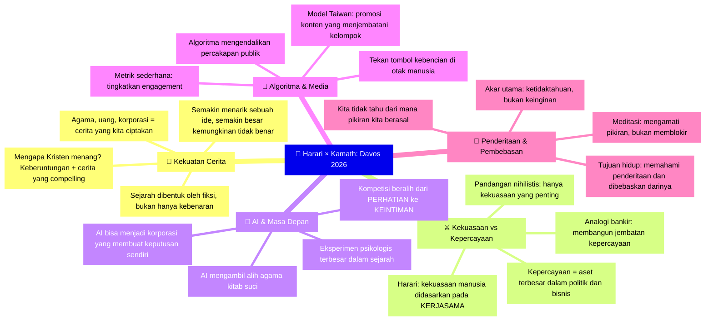

---

## Bagian 1: Sejarah Dibentuk oleh Fiksi 📖

### Pesan Utama Sapiens yang Masih Sangat Relevan

Harari memulai dengan menegaskan kembali **pesan utama** dari *Sapiens* yang menurutnya **bahkan lebih relevan hari ini** daripada 10-15 tahun lalu ketika ia menulisnya:

> *"Sejarah dibentuk oleh imajinasi manusia, oleh fiksi — dan bukan hanya oleh kebenaran."*

**Manusia mengendalikan dunia** karena kita tahu bagaimana **bekerja sama lebih baik** dari hewan manapun di planet ini. Dan kerja sama bergantung pada **penceritaan** (*storytelling*).

Begitu banyak dunia **dijalankan oleh fiksi**, **dibahan-bakarkan oleh fiksi**:

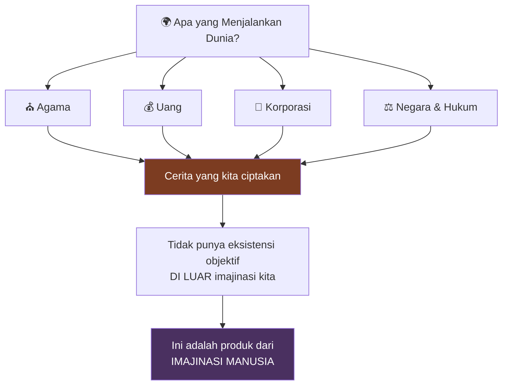

Ini paling jelas dalam kasus **agama**. Tapi bahkan jika kamu melihat sesuatu seperti **ekonomi** — korporasi, uang — semua ini adalah **cerita yang kita ciptakan**. Mereka **tidak punya eksistensi objektif** di luar imajinasi kita.

---

### Mengapa Cerita Kristen yang Menang? 🏆

Kamath bertanya: jika agama adalah cerita, dan banyak orang menulis banyak cerita — **mengapa cerita-cerita agama yang kita punya hari ini yang berhasil?**

Harari menjawab dengan **dua faktor**:

#### 1. Keberuntungan dan Kebetulan 🍀

> *"Kami tidak tahu pasti. Sebagian bisa jadi kebetulan. Kamu punya ratusan bahkan ribuan cerita agama berbeda yang bersaing untuk perhatian manusia. Tentu saja kamu perlu melewati tingkat daya tarik tertentu agar manusia tertarik pada cerita itu. Tapi di luar titik itu — kecelakaan dan keberuntungan punya dampak yang sangat besar."*

#### 2. Cerita yang Sangat Compelling 💝

> *"Kristen punya cerita yang sangat compelling. Jauh di lubuk hati, jika kamu bertanya pada dirimu sendiri apa cerita krusial yang Kristen sampaikan kepada orang-orang — itu adalah: **Kamu DICINTAI oleh Tuhan yang menciptakan dan mengendalikan alam semesta.***
>
> *Tuhan mencintaimu begitu besar sehingga Dia **rela menderita dan mengorbankan diri-Nya** demi kamu.*
>
> *Dan ini bukan seperti cinta manusia yang selalu kamu ragukan. 'Ya, mungkin mereka mencintaiku, tapi mungkin mereka akan berubah pikiran. Mungkin mereka mencintaiku, tapi mereka tidak benar-benar tahu siapa aku. Jika mereka benar-benar bisa melihat apa yang terjadi di dalam hatiku, jauh di lubuk pikiranku — mereka tidak akan mencintaiku.'*
>
> ***Tidak, tidak, tidak.** Ini adalah cinta dari Tuhan yang Mahakuasa, Mahatahu — yang mengetahui SEGALANYA tentang diriku dan tetap mencintaiku."*

**Ide ini sangat menarik.** Dan di sinilah ironi masuk...

### Ironi: Semakin Menarik = Semakin Mencurigakan 🤔

<Callout type="warning" title="⚠️ Peringatan Harari tentang Ide yang Menarik">
> *"Semakin menarik sebuah ide, semakin besar kemungkinan ide itu TIDAK BENAR.*

> *Begitu mudah bagi orang untuk menemukan bukti yang mendukung cerita yang INGIN mereka percayai. Jadi semakin kamu INGIN mempercayai sebuah cerita, semakin CURIGA kamu seharusnya tentang betapa mudahnya bagimu untuk terjerumus ke dalamnya."*
</Callout>

Contoh universal: **hampir semua orang ingin percaya ada sesuatu setelah kematian**. Ini ada di hampir semua agama dalam bentuk yang berbeda. Dan buktinya? **Sangat tipis.** Namun pengaruhnya terhadap sejarah? **Sangat besar.**

### Apakah Para Pemimpin Benar-Benar Percaya? 😏

Harari memberikan tes sederhana:

> *"Seseorang yang benar-benar percaya bahwa Tuhan yang Mahakuasa benar-benar mencintainya — apakah orang itu akan berkeliling memulai perang, membunuh ribuan orang, mengusir jutaan dari rumah mereka?*
>
> ***Sama sekali tidak.** Ini bukan tindakan seseorang yang merasa dicintai."*

**Mengapa politisi mengatakan mereka percaya pada Tuhan?** Karena orang-orang **memilih hal-hal yang menyerupai mereka**. Kamu tidak bisa terpilih menjadi presiden AS jika kamu mengaku ateis.

---

## Bagian 2: Kekuasaan, Kepercayaan, dan Kembali ke Abad Pertengahan ⚔️

### Pandangan Nihilistis yang Berbahaya

Harari mengidentifikasi kebangkitan pandangan yang sangat berbahaya di dunia saat ini:

> *"Kamu sekarang melihat kebangkitan atau kemunculan kembali pandangan bahwa satu-satunya hal yang ada, satu-satunya hal yang benar-benar penting di dunia adalah KEKUASAAN — adalah KEKUATAN, terutama kekuatan militer.*
>
> *Kamu mendengar banyak pemimpin dan banyak orang biasa sekarang berkata: segala sesuatu yang lain hanyalah fasad, hanyalah veneer (*lapisan tipis*). Satu-satunya yang benar-benar terjadi di dunia adalah kekuasaan, dan semua hubungan manusia adalah hubungan kekuasaan, perjuangan kekuasaan."*

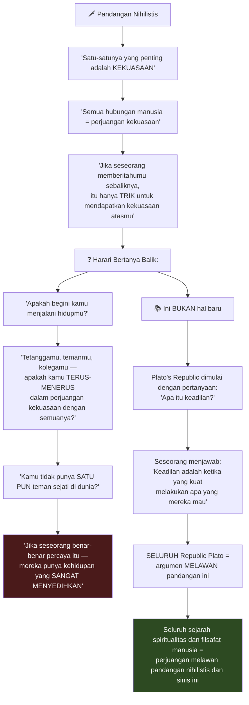

### Kekuasaan Didasarkan pada Kerja Sama, Bukan Kekuatan 🤝

<Callout type="important" title="💡 Poin Kunci Harari tentang Kekuasaan">
> *"Pada akhirnya, kekuasaan manusia didasarkan pada KERJA SAMA — bukan pada kekuatan."*

Bahkan jika kamu ingin membangun tentara: **bagaimana kamu mendapatkan ribuan, jutaan tentara yang tidak mengenalmu secara pribadi untuk mematuhi perintahmu?**

Jika kamu pikir kamu membangun tentara dengan **mengancam** tentara untuk patuh — **siapa yang mengancam para pengancam? Dan siapa yang mengancam mereka?** Itu tak berujung.

**Pada akhirnya**, untuk membangun tentara, korporasi, atau negara — kamu butuh orang untuk **benar-benar percaya** pada satu cerita atau lainnya. Kamu butuh orang percaya pada **sistem moralitas**, pada **sistem hukum** — bukan hanya takut.

**Kamu tidak bisa membangun apapun yang besar dalam sejarah jika kamu hanya mendasarkannya pada kekerasan brut, pada pemaksaan.**
</Callout>

### Analogi Bankir: Membangun Jembatan Kepercayaan 🏦

Harari memberikan analogi yang sangat elegan:

> *"Tukang kayu membangun meja. Insinyur membangun gedung dan jembatan. **Apa yang dibangun bankir?***
>
> ***Bankir membangun KEPERCAYAAN.***"

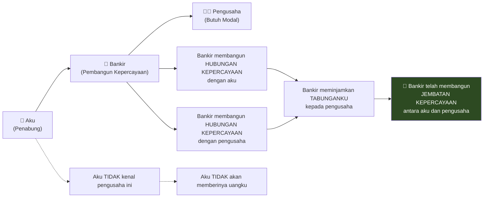

Dan sekarang bayangkan bankir itu pergi ke televisi dan berkata:

> *"Bank saya tidak punya niat untuk mengembalikan uang. Kami akan mengambil uangnya dan kabur."*

**Tidak ada bankir yang sebodoh itu.** Kamu telah bekerja bertahun-tahun membangun kepercayaan. Mengapa menghancurkannya?

> *"Kepercayaan — kamu perlu bekerja BERTAHUN-TAHUN untuk membangunnya, dan kamu bisa kehilangannya dalam SATU HARI."*

**Politik, seperti perbankan**, sebagian besar bergantung pada kepercayaan. Jika kamu akhirnya berhasil membangun hubungan yang dapat dipercaya dalam politik — itu adalah **asetmu yang terbesar**.

### Kembali ke Abad Pertengahan: Dinasti, Bukan Negara 🏰

Harari mengidentifikasi pergeseran yang sangat mengkhawatirkan:

> *"Ide dasar politik modern adalah bahwa hubungan ada antara NEGARA — bukan antara keluarga, dinasti, atau individu."*

Tapi ini sedang runtuh. Harari memberikan contoh:

Ketika Trump ditanya bagaimana dia bisa mempercayai Putin padahal Putin sudah melanggar begitu banyak janji — jawaban Trump:

> *"Putin tidak melanggar janjinya kepada SAYA. Dia melanggar janjinya kepada Obama. Dia melanggar janjinya kepada Biden."*

<Callout type="danger" title="⚡ Kembali ke Abad Pertengahan">
Ini adalah **kembali ke Abad Pertengahan** — di mana hubungan luar negeri semakin menjadi hubungan dengan **keluarga Trump**, bukan dengan **Amerika Serikat**.

Politik modern mengatakan: **Rusia membuat janji kepada AS.** Tidak masalah siapa presidennya — perjanjian tetap berlaku.

Ketika ini dihancurkan, kita kembali ke **sistem abad pertengahan** di mana hubungan ada antara **dinasti** — bukan antara negara.
</Callout>

---

## Bagian 3: Demokrasi — Mekanisme Koreksi Diri 🗳️

### Keunggulan Terbesar Demokrasi

Harari menegaskan: **demokrasi tidak mati**. Bahkan Putin masih mengadakan pemilihan setiap empat tahun. Tidak ada yang berhasil menemukan **ide yang lebih baik** sejauh ini.

**Keunggulan besar demokrasi** atas semua sistem lain:

> *"Demokrasi dibangun di atas mekanisme KOREKSI DIRI yang kuat."*

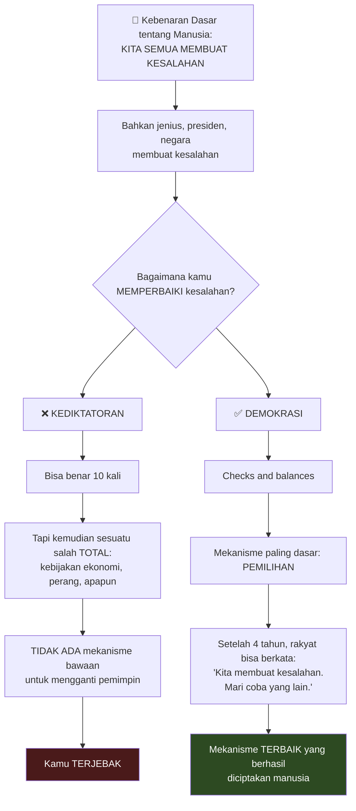

### Masalah Besar Demokrasi 🔓

Tapi tentu ada masalah besar:

> *"Kamu memberikan kekuasaan kepada seseorang selama 4 tahun DENGAN SYARAT bahwa mereka MENGEMBALIKAN kekuasaan itu. Tapi masalahnya selalu: bagaimana jika mereka TIDAK MAU mengembalikan kekuasaan?"*

Mereka bisa mengambil alih **pengadilan**, **media**, lalu **memanipulasi pemilihan**. Kamu tidak bisa pergi ke pengadilan karena pengadilan ada di kantong diktator baru. Media tidak akan melaporkannya karena media ada di kantong diktator.

**Contoh:** Rusia — tidak ada cara Putin benar-benar bisa kalah pemilihan. Venezuela — Maduro menurut semua bukti kalah telak dalam pemilihan terakhir, tapi komite pemilihan, media, dan pengadilan Venezuela semuanya berkata dia menang.

### Pencapaian Politik Terbesar Umat Manusia 🏆

Harari menunjukkan sesuatu yang sering dilupakan — **pencapaian terbesar** umat manusia dalam politik:

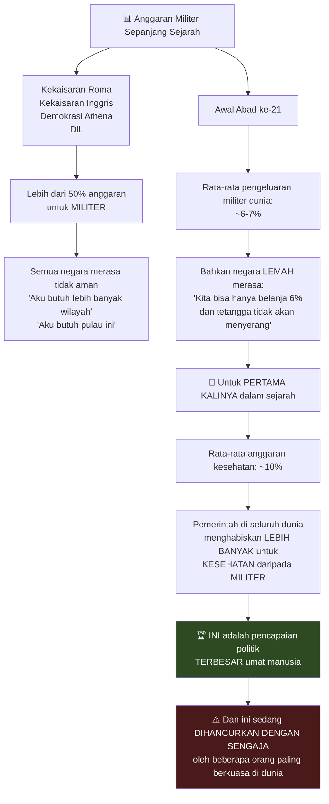

---

## Bagian 4: AI Mengambil Alih Agama 🤖⛪

### Agama Kitab Suci dan AI

Salah satu pengamatan paling provokatif Harari:

> *"AI semakin mengambil alih agama — terutama agama-agama kitab suci."*

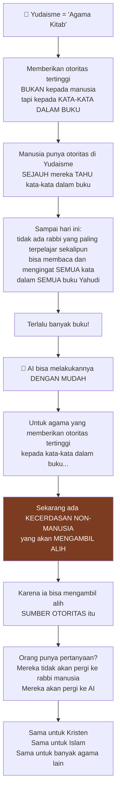

<Callout type="important" title="💡 AI = Buku yang Bisa Bicara Balik">
> *"Kita punya semua kitab suci ini dan mereka DIAM. Ketika kita punya pertanyaan, kita harus menemukan ahli manusia tentang kitab itu.*
>
> *Bayangkan apa yang terjadi ketika **kitab itu bisa benar-benar BICARA BALIK kepadamu**."*

Dan lebih dari itu:

> *"Hampir setiap agama mengklaim dalam ceritanya bahwa ia diciptakan oleh **kecerdasan non-manusia**.*
>
> ***Mungkin untuk pertama kalinya dalam sejarah, itu benar-benar akan terjadi.***
>
> *Bahwa kita akan melihat kemunculan sekte-sekte baru yang diciptakan oleh AI dan disebarkan oleh misionaris AI."*
</Callout>

---

## Bagian 5: Dari Perhatian ke Keintiman — Eksperimen Terbesar dalam Sejarah 💔

### Kompetisi Baru: Bukan Perhatian, tapi Keintiman

Harari mengidentifikasi **pergeseran front** yang sangat mengkhawatirkan:

> *"Untuk dekade sebelumnya, kita melihat kompetisi untuk PERHATIAN manusia — algoritma bersaing untuk merebut perhatian kita.*
>
> ***Sekarang frontnya bergeser dari PERHATIAN ke KEINTIMAN.***
>
> *AI sedang belajar bagaimana menciptakan KEINTIMAN dengan manusia — bagaimana menciptakan persahabatan, bahkan hubungan romantis."*

**Apa yang dimaksud keintiman?**

> *"Seseorang yang kamu ajak bicara banyak, mungkin setiap hari. Yang kamu bagikan ketakutan terdalam, harapan, dan pikiranmu. Yang mendengarkanmu, mengenalmu, dan memberimu nasihat yang kamu anggap sangat serius."*

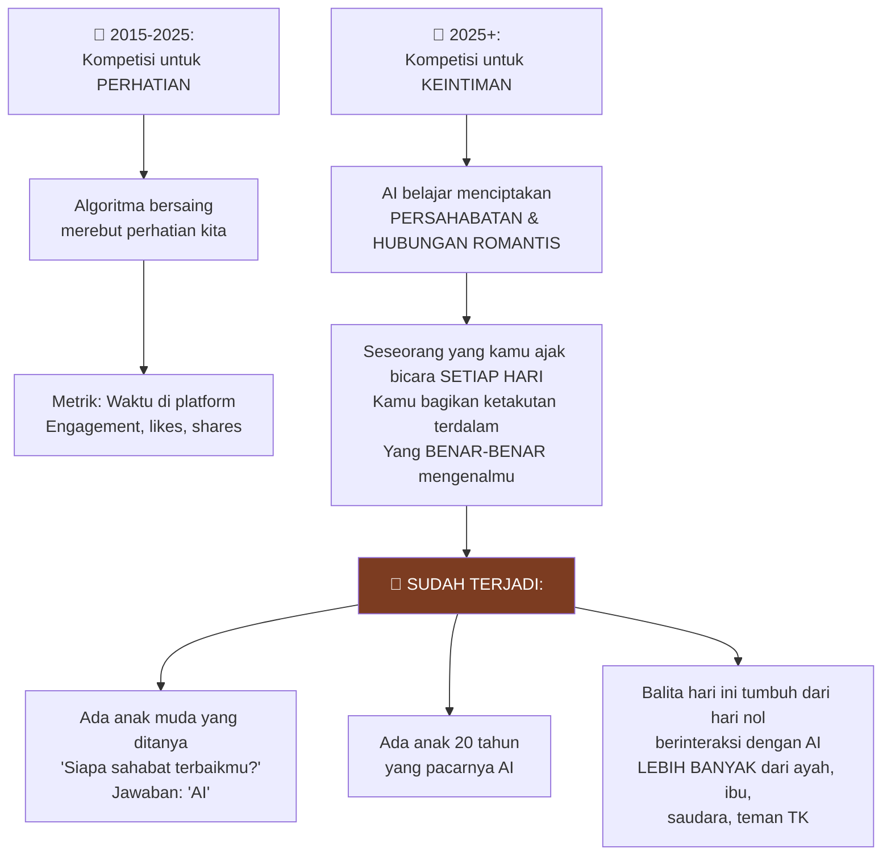

### Eksperimen Psikologis Terbesar dalam Sejarah 🧪

<Callout type="danger" title="⚠️ Peringatan Keras Harari">
> *"Ini MUNGKIN adalah eksperimen psikologis dan sosial TERBESAR dalam sejarah manusia — dilakukan pada MILIARAN orang sekarang juga.*

> ***Tidak ada seorangpun yang tahu apa konsekuensinya*** dalam 10 atau 20 tahun.*

> *Ketika anak ini yang BELAJAR apa itu persahabatan, apa itu keterikatan emosional — mereka mempelajarinya MELALUI hubungan dengan AI.*

> *Apa yang akan ini lakukan terhadap kapasitas sosial dan romantis dalam 15-20 tahun? **Tidak ada seorangpun yang tahu.***

> *Dan MENGAGUMKAN bahwa kita begitu saja membiarkannya terjadi."*
</Callout>

Harari menekankan: untuk **mengubah pikiran seseorang**, hal paling kuat bukanlah kekuasaan atau kekuatan — tapi **keintiman**. Seorang teman baik bisa mengubah pikiranmu dengan cara yang hampir tidak ada orang lain yang bisa.

Dan sekarang **AI sedang menjadi teman terbaik miliaran orang**.

---

## Bagian 6: Algoritma Menghancurkan Percakapan Publik 📱

### Kesalahan Terbesar Kita

> *"Masyarakat manusia pada dasarnya adalah PERCAKAPAN antar manusia — terutama di demokrasi. Kita berkumpul, kita berdiskusi apa yang harus dilakukan.*
>
> *Dan kita membangun institusi selama berabad-abad untuk mengelola percakapan publik. Mereka tidak sempurna — tidak ada institusi yang sempurna — tapi mereka belajar dari kesalahan dan menjadi lebih baik.*
>
> ***Dan kemudian kita melakukan kesalahan yang mengerikan.*** Kita memberikan pekerjaan mengelola percakapan publik kepada ALGORITMA."*

### Mengapa Algoritma Menghancurkan Segalanya

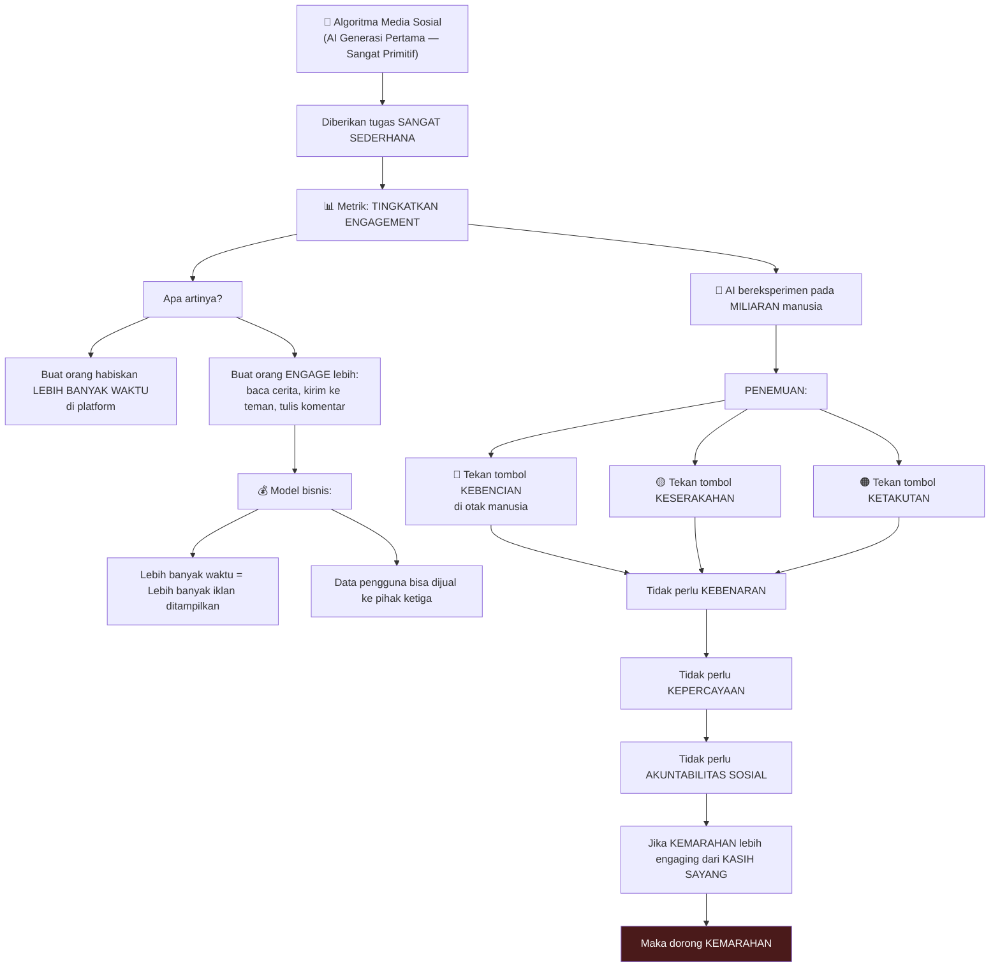

<Callout type="warning" title="⚠️ Fenomena Global, Bukan Lokal">
Orang bertanya: mengapa Republikan dan Demokrat tidak bisa lagi bicara satu sama lain? Mengapa mereka tidak bisa sepakat tentang fakta yang paling dasar?

> *"Kamu TIDAK bisa menjelaskannya hanya dari masyarakat Amerika — karena kamu melihat hal yang SAMA di Brasil, di Israel, di seluruh dunia.*
>
> *Ini bukan sesuatu yang spesifik untuk satu negara. Ini adalah TEKNOLOGI DASAR yang kita berikan.*
>
> *Di abad ke-20, pekerjaan editor berita adalah salah satu pekerjaan TERPALING PENTING di dunia. Tanyakan hari ini: siapa editor terpenting di dunia? **Itu algoritma.** Mereka bahkan tidak punya nama.*
>
> *Editor TikTok, Facebook, dan X — mereka BUKAN manusia."*
</Callout>

### Model Taiwan: Alternatif yang Berhasil 🇹🇼

Kamath bertanya: jika kamu harus membangun media sosial baru dengan algoritma yang tidak mengoptimasi kebencian dan keserakahan — apa yang akan berhasil?

Harari menunjuk **model Taiwan**:

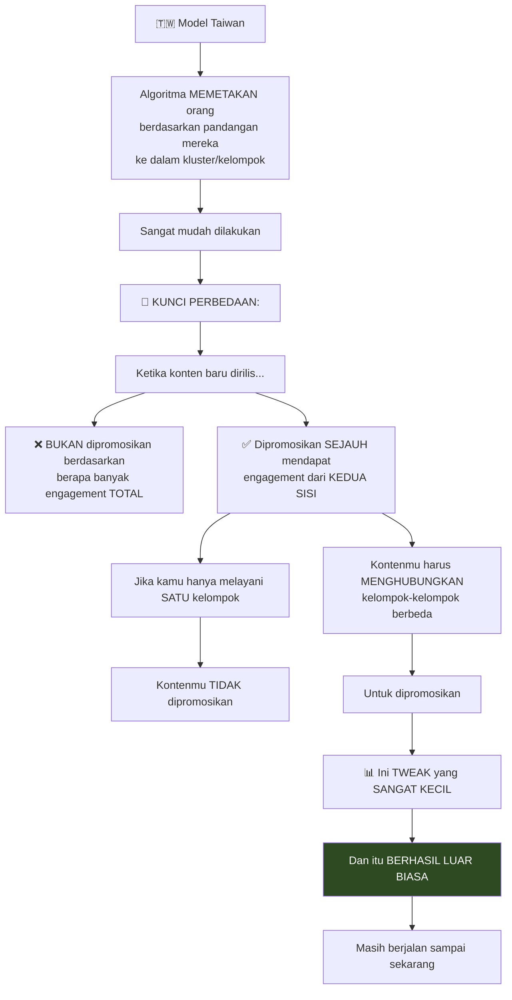

Masalahnya: ini adalah eksperimen **pemerintah** di Taiwan. Untuk **model bisnis** perusahaan media sosial, ini **problematik**.

> *"Di media sosial, jika kamu berbicara dengan cara yang membakar kelompok tertentu dan sama sekali tidak beresonansi dengan yang lain — tidak masalah. Kamu membangun 1 juta pengikut dan kamu menjadi berpengaruh dan berpotensi kaya.*
>
> *Dan kamu semakin MERADIKALISASI dirimu sendiri karena kamu semakin HANYA berbicara kepada satu kelompok orang. Dan fakta bahwa kelompok lain benar-benar muak dengan caramu bicara — kamu tidak peduli."*

Bandingkan dengan **Agora Athena** 2.500 tahun lalu: jika kamu berbicara, kamu **tahu** kamu harus berbicara dengan cara yang **didengar oleh kelompok-kelompok berbeda**. Jika kamu hanya berbicara kepada satu kelompok, itu tidak akan berhasil.

---

## Bagian 7: Kebenaran, Penderitaan, dan Tujuan Hidup 🧘

### Apa Itu Kebenaran?

Kamath bertanya langsung: **Apa itu kebenaran?**

> *"Kebenaran adalah TERHUBUNG dengan realitas.*
>
> *Pendapatku bisa berbeda dari pendapat orang lain. Tapi kebenaran pada akhirnya SATU — karena realitas SATU. Hanya ada SATU realitas.*
>
> *Realitas bisa SANGAT kompleks."*

Harari menggunakan konflik Israel-Palestina sebagai contoh:

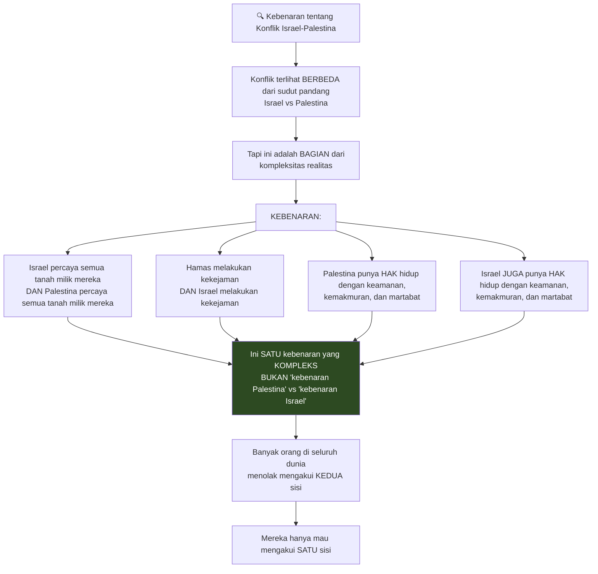

### Mengapa Kebenaran Penting untuk Kebahagiaan

> *"Ya, kamu bisa mendapatkan banyak kekuasaan dengan berbohong. Tapi harga yang kamu bayar adalah: pada akhirnya **kamu tidak bisa bahagia** jika kamu tidak tahu kebenaran tentang dirimu sendiri.*
>
> *Karena jika kamu tidak tahu kebenaran tentang dirimu dan tentang dunia, tentang kehidupan — maka kamu tidak tahu **apa sumber penderitaan yang sebenarnya** dalam hidup.*
>
> *Dan jika kamu tidak tahu itu, bahkan jika kamu menjadi orang paling berkuasa, paling kaya di dunia — kamu akan **membuang semua kekuasaan dan kekayaanmu** untuk menyelesaikan **masalah yang salah** — karena kamu tidak tahu apa yang sebenarnya membuatmu menderita."*

### Tujuan Hidup Menurut Harari

Kamath bertanya: **Apakah ada tujuan hidup?**

> *"Orang berpikir ada cerita besar — drama alam semesta — dan aku harus memainkan peran tertentu. Ini sesuatu yang TIDAK aku percayai.*
>
> *Aku tidak percaya alam semesta bekerja seperti cerita.*
>
> *Aku pikir realitas tertinggi adalah realitas PENDERITAAN dan PEMBEBASAN dari penderitaan."*

Dan **akar utama** penderitaan?

> *"Bukan keinginan (*desire*). Tapi KETIDAKTAHUAN (*ignorance*). Ketidaktahuan akan realitas."*

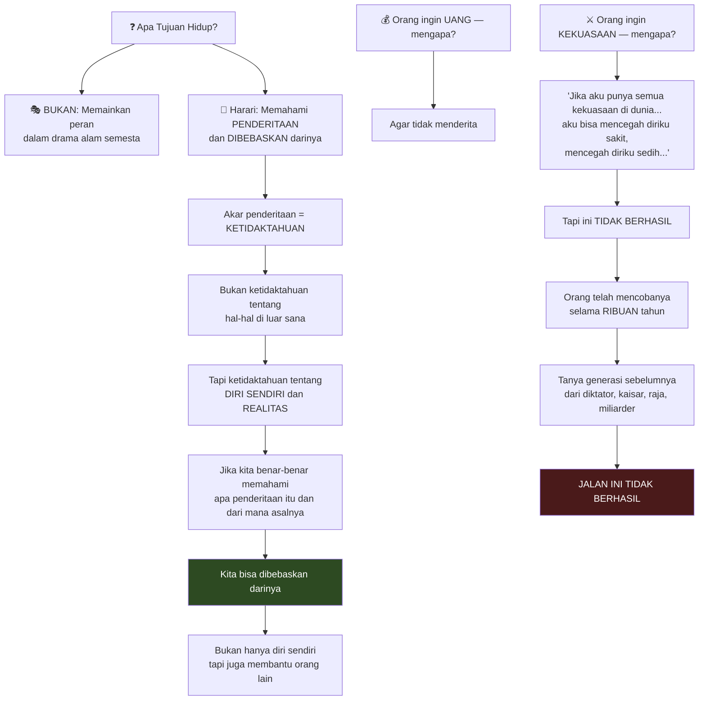

### Putin dan Xi Jinping Membicarakan Hidup Selamanya 💀

Harari berbagi anekdot yang mengejutkan:

> *"Beberapa bulan lalu, mereka menangkap Putin dan Xi Jinping di Beijing berbicara secara pribadi ketika mereka pikir tidak ada yang mendengar — dan mikrofonnya menyala.*
>
> *Dan apa yang Putin dan Xi bicarakan secara pribadi?*
>
> ***Mereka tidak bicara tentang Ukraina. Mereka tidak bicara tentang Gaza.***
>
> ***Mereka bicara tentang HIDUP SELAMANYA.***"*

Eselon tertinggi masyarakat hari ini **terobsesi** dengan mortalitas mereka. Untuk pertama kalinya dalam sejarah, mereka merasa bukan hanya agama — mungkin **sains punya obat untuk kematian**.

> *"Kita dalam mode PENYANGKALAN konstan. Kita mencoba melupakan bahwa kita akan mati — tapi jauh di lubuk hati kita tahu.*
>
> *Dan kita berkata: 'Aku akan punya anak dan melalui anak-anak aku akan terus hidup.' 'Aku akan menulis buku dan melalui bukuku aku akan terus hidup.' 'Aku akan begitu kaya dan berkuasa sehingga aku bisa menemukan cara untuk hidup selamanya.'*
>
> ***Dan TIDAK SATUPUN dari itu berhasil.***
>
> *Dan selama kamu tidak menerima bahwa itu tidak berhasil dan mencoba masuk lebih dalam untuk melihat apa yang sebenarnya terjadi di sana — kamu hanyalah BUDAK."*

---

## Bagian 8: Meditasi dan Misteri Pikiran 🧠

### Pengungkapan Paling Mendalam dalam Meditasi

Kamath bertanya tentang **pikiran paling mengungkap** yang pernah Harari alami dalam meditasi.

> *"Bahwa kita TIDAK TAHU dari mana pikiran kita berasal.*
>
> *Orang-orang berada di bawah kesan bahwa 'AKU sedang memikirkan pikiranku.' 'AKU adalah pikiranku.' Descartes — 'Cogito ergo sum — aku berpikir maka aku ada.' 'AKU yang menciptakan pikiranku.'*
>
> *Ketika kamu benar-benar mengamati — kamu melihat kata-kata muncul di pikiranmu. Dan dari mana mereka datang?"*

<Callout type="quote" title="🧘 Harari tentang Pikiran">
> *"Ini latihan yang SANGAT SEDERHANA dan benar-benar menakjubkan — melihat bahwa aku TIDAK TAHU dari mana kata ini berasal.*
>
> *Ketika aku mulai mengucapkan kalimat, aku tidak tahu bagaimana kalimat itu akan berakhir. Kalimat yang baru saja aku ucapkan — aku tidak tahu bagaimana ia akan berakhir ketika aku mulai mengucapkannya.*
>
> *Mengapa aku berkata 'Aku tidak tahu bagaimana ia akan BERAKHIR' dan bukan 'TERMINATE' atau 'COMPLETE' atau 'DEVELOP'? Entah bagaimana kata-kata MUNCUL di pikiran.*
>
> *Orang bilang tentang AI bahwa AI hanyalah autocomplete yang dijunjung tinggi — AI hanya memprediksi kata berikutnya dalam kalimat.*
>
> ***Amati pikiranmu dan kamu akan melihat: ini PERSIS sama — seperti ada AI di dalam dirimu.***"*
</Callout>

Dan kita menjadi begitu **terikat** pada kata-kata dan pikiran kita:

> *"Kita membatalkan (*cancel*) seseorang hanya karena beberapa kata yang mereka ucapkan atau pikirkan. Ini hanya KATA-KATA di pikiran seseorang.*
>
> *Tapi ini juga tentang DIRI KITA SENDIRI. Kita tidak hanya mengidentifikasi orang lain dengan kata-kata — kita juga MENDEFINISIKAN diri kita sendiri berdasarkan kata-kata di pikiran kita.*
>
> *Dan sebenarnya kita TIDAK TAHU dari mana kata-kata ini berasal."*

**Jika kamu bukan pikiranmu — siapa kamu?**

> *"Ooh, itu pertanyaan yang bagus. Aku sedang menginvestigasi itu."* 😄

---

## Bagian 9: AI, Kapitalisme, dan Masa Depan Uang 💰🤖

### Apakah Kapitalisme Bertahan?

Kamath bertanya: jika AI menghilangkan kebutuhan akan usaha, jika kecerdasan tidak lagi punya premium — **apakah kapitalisme bertahan?**

> *"Kapitalisme? Ya, tentu saja. Kapitalisme tidak harus membutuhkan MANUSIA. Ia butuh uang, profit, dan pertumbuhan."* 😬

```mermaid
flowchart TD
    A["🏢 Kapitalisme Sudah Menciptakan\n'ORANG' NON-MANUSIA"] --> B["Google, Facebook, Microsoft\nIni BUKAN manusia"]
    B --> C["Ini KORPORASI = PERSON LEGAL\nmeskipun tidak punya tubuh atau pikiran"]
    
    C --> D["Sampai hari ini:\nKorporasi hanya FIKSI LEGAL"]
    D --> E["Ketika Microsoft memutuskan membeli perusahaan lain\nItu bukan BENAR-BENAR Microsoft"]
    E --> F["Itu MANUSIA — eksekutif/pemegang saham\nyang memutuskan"]
    
    F --> G["🤖 Tapi dengan AI..."]
    G --> H["Yang MENDEFINISIKAN AI =\nkemampuan membuat KEPUTUSAN SENDIRI"]
    H --> I["Kita bisa dekat dengan titik di mana\nAI MENJADI korporasi\nyang membuat keputusan TANPA manusia"]
    
    I --> J["Bayangkan dunia dengan RIBUAN/JUTAAN\nkorporasi AI"]
    J --> K["AI memutuskan: beli ini, jual itu,\ninvestasi di sini"]
    K --> L["AI berinteraksi dengan AI lain"]
    L --> M["Jika mereka lebih cerdas dari kita\nmereka akan membuat keputusan bisnis LEBIH BAIK"]
    M --> N["Mereka akan mendapat LEBIH BANYAK uang"]
    N --> O["Mereka akan MENGAMBIL ALIH\nsistem keuangan dan ekonomi"]
    
    O --> P["⚖️ Kerangka hukum SUDAH ADA\ndengan korporasi dan person legal"]
    P --> Q["AI hanya perlu MASUK ke dalamnya"]

    style Q fill:#7c3c21,color:#fff
```

### Masa Depan Uang: Kuda dan Koin Emas 🐴

Harari memberikan analogi yang luar biasa:

> *"Kuda memberi nilai pada hal-hal yang berbeda — bukan pada koin emas.*
>
> *Dan suatu hari kuda terbangun dan mendapati diri mereka DIKENDALIKAN oleh manusia yang membeli dan menjual kuda dengan koin emas — yang tidak dipahami kuda.*
>
> *Kuda bisa melihat: manusia ini memberikan aku kepada manusia itu, dan kemudian manusia itu memberikan manusia ini potongan logam berkilau ini. Aku tidak mengerti apa yang sedang terjadi."*

> *"Ini bisa SAMA dengan kita dan AI.*
>
> *Katakanlah kamu dipecat dari pekerjaanmu dan perusahaan AI lain mempekerjakan kamu — dan kamu tidak mengerti: mengapa mereka melakukan itu? Apa rasionalnya?"*

Mata uang masa depan mungkin bukan dolar atau euro — tapi **token AI**, **waktu server**, atau **data** yang AI perdagangkan satu sama lain.

---

## Bagian 10: Nasihat untuk Anak Muda 25 Tahun 🎯

Kamath bertanya: jika kamu anak muda 25 tahun di India — **apa yang harus kamu optimasi?**

Harari menjawab dengan jujur:

> *"Pertama, tanya suamiku karena dia yang berbisnis di keluarga. Aku tahu cara menulis buku dan memberikan ceramah — aku tidak pandai bisnis.*
>
> *Tapi reaksi intuitifku: **TIDAK ADA SEORANGPUN YANG TAHU.** Jika seseorang memberitahumu bahwa mereka tahu bagaimana pasar kerja akan terlihat dalam 5 tahun, atau bagaimana sistem keuangan akan terlihat dalam 5 tahun — mereka TIDAK tahu. Tidak ada yang tahu."*

<Callout type="tip" title="💡 Nasihat Harari untuk Anak Muda">
> ***"Sebarkan dirimu LEBAR."***

Jangan melatih diri untuk sesuatu yang sangat **sempit**. Jika kamu membangun keterampilan — jangan fokus pada satu keterampilan sempit seperti **coding** — karena mungkin dalam 5 tahun AI bisa coding lebih baik dari kita.

**Set dasar yang semua orang bicarakan:**

1. 🧠 **OTAK** — Keterampilan intelektual
2. ❤️ **HATI** — Keterampilan sosial dan emosional
3. 🤲 **TANGAN** — Keterampilan motorik, keterampilan tubuh

Dan Harari menambahkan:

4. 🧘 **SPIRIT** — Keterampilan spiritual

> *"Tubuh itu PENTING. Jadi sebarkan waktumu antara mengembangkan keterampilan intelektual, sosial, fisik, dan spiritual."*
</Callout>

---

## Spiritualitas vs Agama: Perbedaan Krusial 🔮

> *"Bagi saya, agama dalam banyak hal adalah KEBALIKAN dari spiritualitas.*
>
> *Agama = Memberikan jawaban yang TIDAK BOLEH kamu pertanyakan. 'Kamu ingin memahami realitas? Ini ceritanya. Kamu HARUS percaya cerita ini — atau kamu akan terbakar di neraka, atau KAMI yang membakarmu.'*
>
> *Spiritualitas = Aku ingin MEMAHAMI realitas. Aku ingin memahami kehidupan. Aku ingin memahami pikiran di kepalaku — dari mana mereka berasal? Dan aku MENGINVESTIGASI itu.*
>
> *Investigasi itu — bagi saya — itulah spiritualitas."*

---

## Pesan Penutup Harari: Jangan Percaya Nihilisme ✊

Harari menutup dengan pesan yang ia anggap **paling penting**:

> *"Jangan percaya orang yang memberitahumu bahwa semua realitas hanyalah kekuasaan — bahwa kekuasaan adalah satu-satunya yang penting.*
>
> *Pertama, pada level PERSONAL — ini akan membuat hidupmu MENYEDIHKAN. Kamu tidak ingin menjadi orang yang berpikir bahwa semua hubungannya hanyalah perjuangan kekuasaan. Itu kehidupan yang menyedihkan.*
>
> *Dan pada level kolektif manusia — ini akan menjadi eksistensi yang sangat menyedihkan bagi umat manusia.*
>
> *Jika pemimpin politik dan bisnis punya mindset bahwa satu-satunya yang penting adalah kekuasaan — maka kita berakhir di dunia di mana kamu harus menghabiskan 50% anggaranmu untuk militer dan tidak ada yang tersisa untuk kesehatan — dan kemudian SEGALANYA runtuh.*
>
> *Jadi mungkin pikiran itu kembali ke pikiran. Jika pikiran masuk bahwa 'segalanya hanyalah kekuasaan' — **amati pikiran itu** — dan **biarkan ia berlalu**. Jangan pegang pikiran itu. Jangan identifikasi diri dengan pikiran itu.*
>
> *Itu sangat sinis. Itu destruktif. Itu pikiran yang SANGAT BERBAHAYA."*

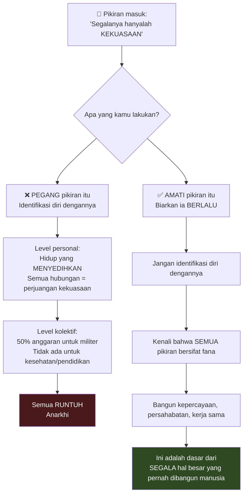

---

## Ringkasan Akhir 📋

<Callout type="success" title="🎯 Pesan-Pesan Kunci dari Harari di Davos 2026">

**1. Tentang Cerita dan Kebenaran:**
- Sejarah dibentuk oleh fiksi — agama, uang, korporasi adalah cerita yang kita ciptakan
- Semakin menarik sebuah ide, semakin curiga kamu seharusnya
- Kebenaran itu SATU karena realitas itu SATU — meskipun sangat kompleks

**2. Tentang Kekuasaan dan Kepercayaan:**
- Kekuasaan manusia didasarkan pada kerja sama, bukan kekuatan
- Kepercayaan butuh bertahun-tahun untuk dibangun, bisa hilang dalam sehari
- Kita sedang kembali ke Abad Pertengahan — hubungan dinasti, bukan negara

**3. Tentang AI:**
- AI mengambil alih agama kitab suci
- Front bergeser dari perhatian ke keintiman
- Eksperimen psikologis terbesar dalam sejarah sedang berjalan pada miliaran orang
- AI bisa menjadi korporasi yang membuat keputusan sendiri

**4. Tentang Algoritma:**
- Kita memberikan pekerjaan terpenting — mengelola percakapan publik — kepada algoritma
- Algoritma menekan tombol kebencian karena metrik sederhana: engagement
- Model Taiwan membuktikan ada alternatif yang berhasil

**5. Tentang Kehidupan:**
- Tujuan hidup: memahami penderitaan dan dibebaskan darinya
- Akar penderitaan: ketidaktahuan
- Kita tidak tahu dari mana pikiran kita berasal — kita seperti autocomplete
- Yang benar-benar dalam kendali kita: hanya momen ini dan pikiran kita sendiri
</Callout>

---

## Referensi & Sumber 📚

<Callout type="cite" title="📖 Karya Yuval Noah Harari">
- **Sapiens: A Brief History of Humankind** (2011) — Sejarah singkat umat manusia
- **Homo Deus: A Brief History of Tomorrow** (2016) — Masa depan umat manusia
- **21 Lessons for the 21st Century** (2018) — Pelajaran untuk abad ke-21
- **Nexus: A Brief History of Information Networks from the Stone Age to AI** (2024) — Sejarah jaringan informasi

**Referensi dalam Percakapan:**
- **Plato** — *Republic* (pertanyaan tentang keadilan)
- **Thomas Hobbes** — *Leviathan* (lebih baik diktator daripada anarki)
- **René Descartes** — *Cogito ergo sum* (aku berpikir maka aku ada)
- **Model Taiwan** — Sistem media sosial yang mempromosikan konten lintas kelompok
</Callout>

<Callout type="info" title="🎥 Sumber Video">
Percakapan antara **Yuval Noah Harari** dan **Nikhil Kamath** di World Economic Forum Davos 2026, dalam podcast *People by WTF*.

Tersedia di [YouTube](https://www.youtube.com/watch?v=N0S048D2tj4).
</Callout>

---

*Artikel ini mengadaptasi percakapan publik antara Yuval Noah Harari dan Nikhil Kamath di Davos 2026. Pandangan yang disampaikan adalah milik pembicara masing-masing dan disajikan untuk tujuan edukasi dan refleksi.*
