## Pembukaan: Sebuah Paradoks Sejarah 🌙

> *"Tanpa Islam, bisa diargumentasikan bahwa Eropa tidak akan pernah bisa memodernisasi dirinya."*

Ketika kebanyakan orang berpikir tentang asal-usul dunia modern — sains, matematika, universitas, rumah sakit, perdagangan global — pikiran mereka langsung meloncat ke Eropa: Renaisans Italia, Revolusi Ilmiah Inggris, Pencerahan Prancis.

Tapi ada sebuah bab besar yang nyaris terhapus dari buku teks sejarah:

**Selama hampir seribu tahun, ketika Eropa tenggelam dalam Abad Kegelapan, peradaban Islam sedang membangun seluruh infrastruktur intelektual yang kelak akan menjadi fondasi modernitas.**

Kata "algoritma" (*algorithm*) berasal dari nama seorang ilmuwan Muslim. Kata "aljabar" (*algebra*) adalah kata Arab. Rumah sakit 24 jam pertama di dunia dibangun di Baghdad. Universitas pertama di dunia yang memberikan gelar formal didirikan oleh seorang wanita Muslim di Maroko.

Dan Dante — dalam karyanya terbesar *Divine Comedy* — secara eksplisit mengakui hutang peradaban Eropa kepada dua filsuf Muslim, menempatkan mereka di antara jiwa-jiwa paling agung dalam sejarah manusia.

Artikel ini adalah eksplorasi mendalam tentang **Zaman Keemasan Islam** (*Islamic Golden Age*): mengapa ia terjadi, apa yang membuatnya luar biasa, mengapa ia berakhir, dan — yang paling penting — mengapa warisan intelektualnya adalah fondasi dari dunia yang kita tinggali hari ini.

<Callout type="info" title="📖 Sumber Utama">
Artikel ini didasarkan pada kuliah sejarah peradaban bertajuk **"Civilization #37: The Golden Age of Islam"**

Sumber video: [YouTube — Civilization #37: The Golden Age of Islam](https://www.youtube.com/watch?v=2OdO8LoKuo8)

*Catatan: Ini adalah pandangan makro sejarah dengan interpretasi tertentu. Beberapa perspektif bersifat kontroversial dan merupakan hipotesis, bukan fakta sejarah yang sudah ditetapkan.*
</Callout>

---

## Peta Besar: Semua yang Akan Kita Jelajahi 🗺️

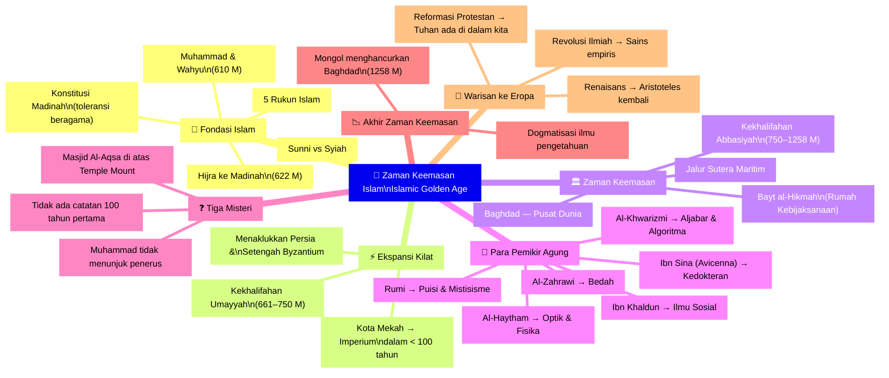

---

## Bagian 1: Islam — Sebuah Revolusi Intelektual 🌟

### Fakta Dasar tentang Islam

Islam adalah agama terbesar kedua di dunia dengan lebih dari satu miliar pemeluk (sementara Kristen memiliki sekitar dua miliar). Umat Islam tersebar luas dari Afrika, Timur Tengah, Asia Tengah, hingga Asia Selatan.

**Negara dengan populasi Muslim terbesar di dunia?** Bukan Arab Saudi, bukan Iran, bukan Mesir.

*Itu adalah Indonesia* 🇮🇩

Umat Islam terbagi dalam dua mazhab (*sects*) besar:

| Mazhab | Populasi | Pusat Utama | Keyakinan Pembeda |
|--------|----------|-------------|-------------------|
| **Sunni** | ~85–90% | Seluruh dunia | Siapapun yang berkualitas bisa menjadi pemimpin (khalifah) |
| **Syiah** | ~10–15% | Iran, Irak, Lebanon | Hanya keturunan langsung Ali ibn Abi Thalib (cucu Muhammad) yang berhak memimpin |

<Callout type="info" title="🕌 Apa Artinya 'Muslim'?">
Kata *Muslim* berasal dari bahasa Arab yang berarti "seseorang yang berserah diri kepada Allah (*God*)."

Islam berarti "penyerahan diri" (*submission*) — kepasrahan total kepada kehendak Tuhan yang Maha Esa.
</Callout>

### Muhammad: Seorang Pedagang yang Menjadi Nabi 📿

Kisah Islam dimulai di Mekah, Arabia, sekitar tahun 610 M. **Muhammad ibn Abdullah** — seorang pedagang (*merchant/trader*) yang terhormat berusia sekitar 40 tahun — pergi berkontemplasi ke sebuah gua di Gunung Hira.

Di sana, menurut tradisi Islam, **Malaikat Jibril** (*Archangel Gabriel*) mendatanginya dan menyampaikan wahyu yang kemudian menjadi fondasi kitab suci Islam: **Al-Qur'an** (*the Quran*).

Muhammad memahami bahwa misinya adalah menjadi utusan Allah (*Messenger of God*) dan menyebarkan kebenaran kepada masyarakat pagan (*penyembah berhala*) di Arabia.

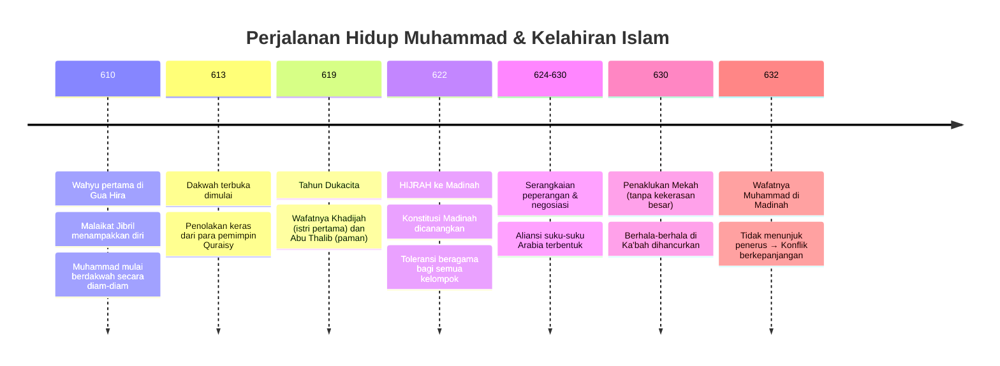

### Hijrah dan Konstitusi Madinah 🕊️

Ketika Muhammad mulai menyebarkan ajarannya secara terbuka, ia menghadapi penolakan keras dari penguasa Mekah. Akhirnya ia terpaksa hijrah (*hijra* — perjalanan/pengungsian) ke Madinah pada 622 M.

*Hijra* bukan sekadar perpindahan fisik. Ini adalah momen pembentukan komunitas Muslim pertama.

Di Madinah, Muhammad menghadapi tantangan besar: kota itu dipenuhi faksi-faksi yang berseteru — suku-suku pagan Arab, suku-suku Muslim, dan suku-suku Yahudi. Muhammad menjadi pemimpin (*mediator*) di antara mereka semua.

Dan apa yang ia lakukan? Ia mendeklarasikan **Konstitusi Madinah** (*Sahifat al-Madinah*): sebuah perjanjian yang menjamin kebebasan beragama (*religious freedom*) bagi semua kelompok dalam komunitas tersebut.

> *"Sejak awal, dan ini sangat penting: agama Islam adalah agama yang terbuka, toleran, dan inklusif — dan mereka mempertahankan tradisi ini selama seribu tahun berikutnya."*

### Lima Rukun Islam — Kesederhanaan yang Mendalam 🕋

Dibandingkan dengan Kristen atau Yahudi yang memiliki teologi yang kompleks dan sering kontradiktif, Islam menawarkan sesuatu yang relatif **sederhana dan jernih**:

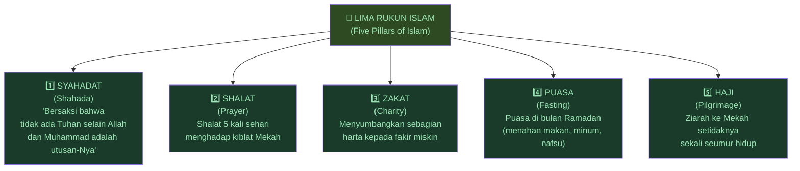

<Callout type="tip" title="🕋 Tentang Ibadah Haji">
Haji (*pilgrimage*) adalah salah satu ritual paling menakjubkan dalam sejarah manusia. Jutaan umat Muslim dari seluruh penjuru bumi berkumpul di Mekah setiap tahun.

Sebegitu dalamnya keyakinan ini sehingga bahkan Muslim paling miskin pun bisa menabung *seumur hidup* hanya untuk bisa pergi berhaji sekali.

*"Umat Muslim mungkin adalah orang-orang paling religius yang pernah Anda temui. Mereka sangat, sangat serius dengan agama mereka."*
</Callout>

---

## Bagian 2: Ekspansi Kilat — Dari Padang Pasir ke Imperium 🌍

### Keajaiban Ekspansi dalam 100 Tahun

Tidak ada peristiwa dalam sejarah manusia yang menyerupai kecepatan ekspansi Islam awal. Dalam kurang dari 100 tahun, sebuah gerakan yang lahir di padang pasir Arabia yang miskin telah menjadi imperium terbesar di dunia:

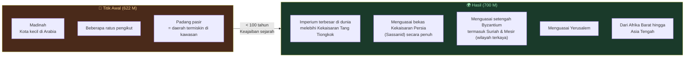

Bandingkan ini: Kekhalifahan Umayyah pada sekitar 700 M adalah *imperium terbesar di dunia saat itu*, bahkan melampaui Dinasti Tang yang merupakan puncak peradaban Tiongkok.

### Mengapa Mereka Tidak Menaklukkan Konstantinopel?

Islam mencoba dua kali mengepung Konstantinopel (*Constantinople*), ibukota Kekaisaran Byzantium. Kedua kali gagal — karena dua hal:

1. **Tembok Theodosian** — Dinding kota yang dirancang sebagai benteng yang tidak bisa ditembus (*impenetrable fortress*)
2. **Api Yunani** (*Greek Fire*) — Senjata kimia pembakar yang bisa menyala di atas air — teknologi militer paling menakutkan di abad pertengahan

---

## Bagian 3: Tiga Misteri Besar Islam 🔍

Sebelum masuk ke Zaman Keemasan, ada tiga misteri sejarah yang menarik dan belum sepenuhnya terpecahkan.

### Misteri Pertama: Mengapa Tidak Ada Catatan 100 Tahun Pertama? 📜

Ini aneh: kita tahu bahwa orang-orang dalam gerakan awal Islam — termasuk banyak orang Yahudi dan Kristen yang melek huruf (*literate*) — seharusnya mampu menulis. Namun hampir tidak ada catatan tertulis dari 100 tahun pertama sejarah Islam.

**Hipotesis yang diajukan:**

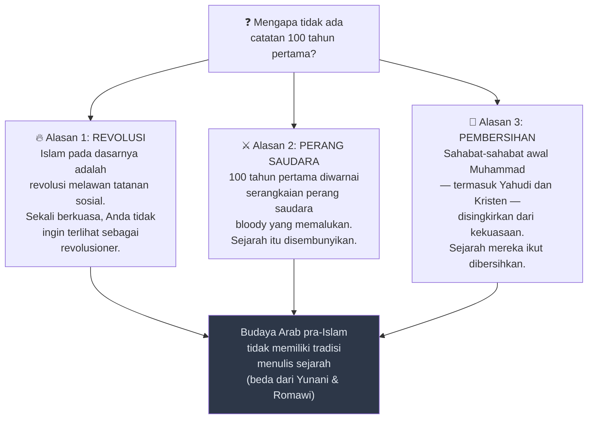

<Callout type="important" title="💡 Poin Penting: Sejarah Tidak Selalu Ditulis">
Doug, seorang mahasiswa dalam kuliah ini, membuat poin yang sangat penting: tidak semua budaya memiliki tradisi penulisan sejarah.

Tradisi historiografi (*histiography* — penulisan sejarah) yang kita kenal berasal dari Yunani dan Romawi. Bangsa Arab pra-Islam, bangsa Persia, dan bangsa India tidak memiliki tradisi seperti itu.

*Mencatat sejarah secara sistematis sebenarnya adalah sesuatu yang sangat langka di dunia kuno.* Kita cenderung menganggapnya sebagai sesuatu yang wajar, padahal tidak.
</Callout>

### Misteri Kedua: Mengapa Muhammad Tidak Menunjuk Penerus? ⚔️

Ketiadaan penerus yang ditunjuk Muhammad menyebabkan perang saudara yang berlangsung selama berabad-abad dan melahirkan perpecahan Sunni-Syiah yang bertahan hingga hari ini.

**Mengapa ia tidak menunjuk penerus?**

Hipotesis yang menarik: **karena menurut keyakinannya, tidak perlu ada penerus.**

> *"Jika ini adalah akhir zaman — jika ini adalah akhir dunia — Anda tidak perlu menunjuk penerus karena Allah sendiri yang akan datang. Bahkan jika Anda menunjuk penerus, itu berarti Anda mengakui kekalahan."*

Dalam ketiga tradisi monoteistik — Yahudi, Kristen, Zoroastrian — abad ke-7 M adalah **zaman apokaliptik** (*apocalyptic age*): era di mana semua orang percaya bahwa hari akhir sudah sangat dekat.

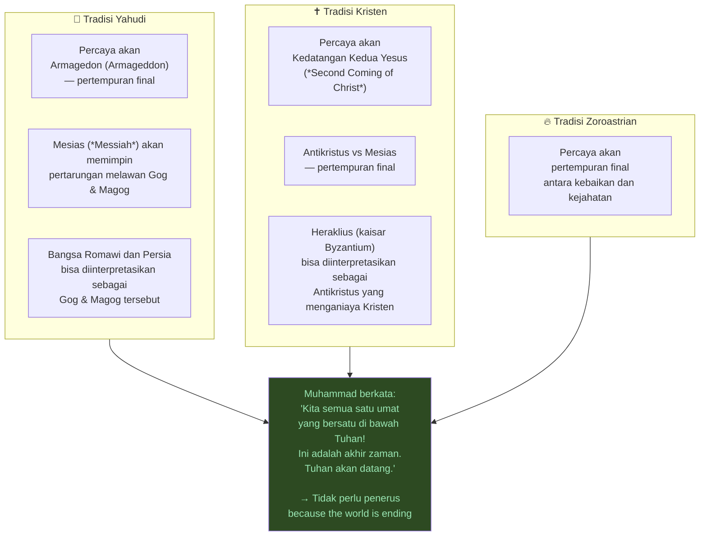

### Misteri Ketiga: Mengapa Masjid Al-Aqsa Dibangun di Atas Temple Mount? 🕌

Ini adalah salah satu pertanyaan yang paling relevan hingga hari ini, karena menjadi akar dari konflik Israel-Palestina yang berkelanjutan.

**Konteksnya:**
- **Temple Mount** (*Har HaBayit* dalam bahasa Ibrani) adalah lokasi **Kuil Kedua** orang Yahudi — situs paling suci dalam tradisi Yahudi
- Kuil ini dihancurkan oleh Romawi pada 70 M
- Pada 135 M, Romawi mengusir seluruh orang Yahudi dari Yerusalem
- Kini, Masjid Al-Aqsa — masjid tersuci ketiga dalam Islam — berdiri tepat di lokasi tersebut

Jika Islam dari awal bersifat inklusif dan menerima orang Yahudi, mengapa membangun masjid di atas situs paling suci mereka?

**Hipotesis yang diajukan:**

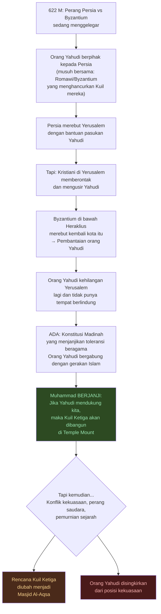

<Callout type="warning" title="⚠️ Catatan Penting tentang Hipotesis Ini">
Ini adalah interpretasi yang **sangat kontroversial** dan merupakan spekulasi sejarah, bukan fakta yang sudah dikonfirmasi.

Pembangunan Masjid Al-Aqsa adalah proses yang berlangsung selama sekitar 200 tahun. Motif di baliknya kemungkinan besar kompleks dan beragam.

Konflik modern antara Israel dan Palestina/dunia Islam atas kontrol Temple Mount/Al-Haram al-Sharif (*Noble Sanctuary*) adalah salah satu titik konflik paling eksplosif di dunia saat ini.
</Callout>

---

## Bagian 4: Konteks Sejarah — Mengapa Islam Bisa Menang? 🌊

### Zaman Apokaliptik: Semua Orang Menunggu Akhir Dunia

Untuk memahami mengapa Islam bisa berkembang begitu pesat, kita perlu memahami konteks sejarah abad ke-7 M.

Pada saat itu, dua kekuatan super dunia — Persia dan Byzantium — telah saling berperang selama puluhan tahun. Seluruh Timur Tengah porak-poranda. Jutaan orang menderita.

Dan dalam kondisi seperti itu, SEMUA tradisi monoteistik — Yahudi, Kristen, Zoroastrian — secara bersamaan percaya bahwa ini adalah **akhir zaman** (*end of days*).

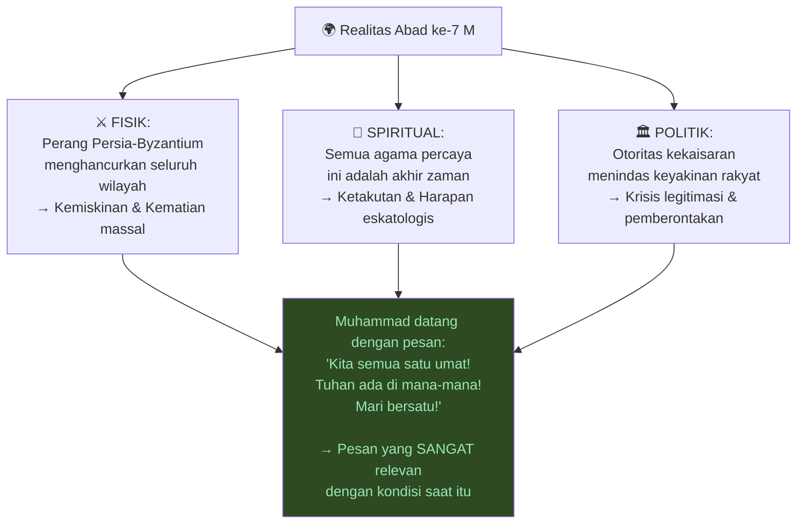

### Pesan Muhammad kepada Tiga Tradisi

Menarik sekali untuk mencermati bagaimana Muhammad menyampaikan pesannya secara spesifik kepada masing-masing kelompok:

**Kepada orang Yahudi:**
> *"Oh orang-orang beriman! Mengapa kamu berdebat tentang Ibrahim, sementara Taurat dan Injil baru diturunkan setelah beliau? Ibrahim bukan seorang Yahudi, bukan seorang Kristen, tapi ia adalah seorang moneis (*muslim* = berserah kepada Tuhan), dan ia bukan termasuk orang-orang musyrik."*
> — Al-Qur'an 3:65-67

**Maknanya:** Kita semua adalah keturunan Ibrahim. Mengapa bertengkar soal perbedaan kitab suci? Abraham mendahului semua itu.

**Kepada orang Kristen tentang konsep Tritunggal (*Holy Trinity*):**
> *"Mereka yang mengatakan Allah adalah yang ketiga dari tiga (yang Maha Esa) telah kafir. Tidak ada Tuhan kecuali satu Tuhan."*
> — Al-Qur'an 5:73

**Konteksnya yang revolusioner:** Bayangkan Anda hidup di abad ke-7 M. Pemerintah Byzantium memaksakan doktrin Tritunggal Kudus sebagai satu-satunya kebenaran. Jika Anda tidak percaya, Anda bisa dieksekusi.

Tapi mayoritas Kristen saat itu — *tidak* percaya pada Tritunggal Kudus. Mereka percaya Yesus adalah manusia biasa, bukan Tuhan. Tapi mereka tidak berani mengatakannya.

Dan tiba-tiba, Muhammad datang dan berkata: **"Kalian benar sepanjang waktu ini. Langit memang biru, bukan merah."**

> *"Bayangkan betapa leganya Anda — setelah bertahun-tahun dipaksa percaya bahwa langit berwarna merah, padahal Anda tahu itu biru — ketika seseorang dengan otoritas akhirnya berkata: 'Kalian benar selama ini.'"*

---

## Bagian 5: Kekhalifahan Abbasiyah dan Zaman Keemasan ✨

### Baghdad — Pusat Dunia

Setelah Kekhalifahan Umayyah (*661–750 M*), kekuasaan Islam beralih ke **Kekhalifahan Abbasiyah** (*Abbasid Caliphate*, *750–1258 M*). Dan ibukotanya pindah ke **Baghdad** — sebuah kota baru yang dibangun dari nol.

Baghdad adalah kota bundar (*round city*) — salah satu dari sedikit kota berbentuk lingkaran di dunia kuno. Dikelilingi Sungai Tigris dan Efrat. Dirancang sebagai pusat kekuasaan dan perdagangan dunia.

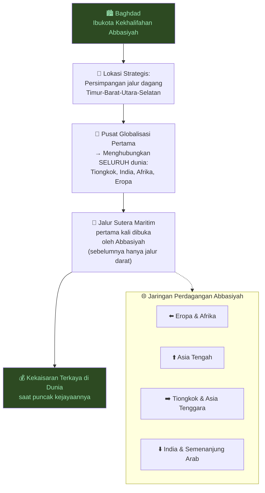

<Callout type="tip" title="🌏 Indonesia dalam Jaringan Abbasiyah">
Jalur Sutera Maritim yang dibuka oleh Kekhalifahan Abbasiyah akhirnya membawa pedagang Muslim ke wilayah Nusantara!

Ini adalah salah satu jalur bagaimana Islam masuk ke Indonesia — bukan melalui perang, tapi melalui perdagangan. Para pedagang Arab, Persia, dan India membawa bersama mereka agama, budaya, dan ilmu pengetahuan.
</Callout>

### Bayt al-Hikmah — Rumah Kebijaksanaan 📚

Institusi terpenting dari Zaman Keemasan Islam adalah ***Bayt al-Hikmah*** (*House of Wisdom* / Rumah Kebijaksanaan) di Baghdad.

Ia dimodelkan berdasarkan **Perpustakaan Alexandria** (*Library of Alexandria*) — institusi pertama dalam sejarah yang mencoba mengompilasi *seluruh* pengetahuan manusia.

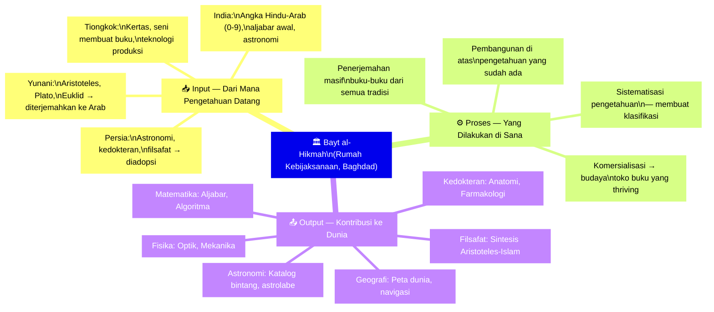

Tiga peradaban kreatif besar bertemu di sana:
- 🏛️ **Yunani** — Logika, filsafat, matematika
- 📖 **Yahudi** — Teologi, linguistik, tafsir teks
- 🌹 **Persia** — Sastra, administrasi, astronomi

Ditambah sumbangan dari:
- 🇮🇳 **India** — Matematika, kedokteran
- 🐉 **Tiongkok** — Teknologi, kertas

---

## Bagian 6: Para Pemikir Agung Zaman Keemasan 🌟

Pada era ini, tidak ada pembedaan antara filsuf, penyair, ilmuwan, dan matematikawan. Seorang intelektual sejati menguasai *semua* bidang.

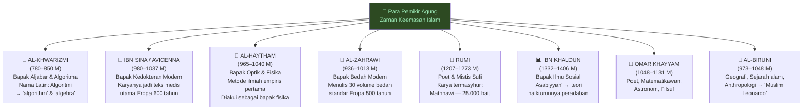

### Al-Khwarizmi: Bapak Aljabar dan Algoritma ➕

**Muhammad ibn Musa al-Khwarizmi** adalah ilmuwan paling berpengaruh dalam sejarah matematika yang mungkin tidak pernah Anda dengar namanya — padahal Anda menggunakan penemuan-penemuannya setiap hari.

Dua kata dalam bahasa Inggris berasal darinya:

1. **Algebra** (*Aljabar*) — Dari judul bukunya: *Al-Kitab al-mukhtasar fi hisab al-jabr wal-muqabala* (Buku Ringkas tentang Perhitungan melalui Penyelesaian dan Keseimbangan)
2. **Algorithm** (*Algoritma*) — Dari nama Latinnya: *Algoritmi* (latinisasi dari "Al-Khwarizmi")

<Callout type="info" title="🔢 Angka Hindu-Arab">
Al-Khwarizmi juga berjasa besar dalam menyebarkan **sistem angka Hindu-Arab** (0, 1, 2, 3, 4, 5, 6, 7, 8, 9) ke seluruh dunia.

Angka-angka ini berasal dari India, tapi Al-Khwarizmi menstandarisasi dan menyebarkannya. Sebelumnya, Eropa menggunakan angka Romawi (I, V, X, L, C, D, M) yang jauh lebih sulit untuk matematika kompleks.

*Hampir semua matematika yang Anda pelajari di sekolah sebenarnya berasal dari Zaman Keemasan Islam.*
</Callout>

### Ibn Sina / Avicenna: Dokter Segala Zaman 🏥

**Abu Ali al-Husain ibn Abdallah ibn Sina** — dikenal di Eropa sebagai **Avicenna** — adalah mungkin intelektual paling komprehensif sepanjang sejarah Islam.

Karyanya yang paling monumental: ***Al-Qanun fi al-Tibb*** (*Canon of Medicine* / Kanon Kedokteran) — ensiklopedia medis yang menjadi standar pengajaran di universitas-universitas Eropa selama lebih dari 600 tahun.

Dante dalam *Divine Comedy*-nya secara eksplisit menempatkan Ibn Sina (*Avicenna*) dan Ibn Rushd (*Averroes*) di antara jiwa-jiwa terbesar dalam sejarah peradaban manusia — bersanding dengan Sokrates dan Plato.

### Al-Haytham: Bapak Metode Ilmiah 🔬

**Abu Ali al-Hasan ibn al-Haytham** — dikenal di Barat sebagai **Alhazen** — adalah orang yang secara sistematis pertama kali mengembangkan ***metode ilmiah empiris*** (*empirical scientific method*):

- Mengamati fenomena
- Membuat hipotesis
- Menguji hipotesis melalui eksperimen
- Menarik kesimpulan berdasarkan data

Sebelum Galileo, sebelum Newton, **Al-Haytham sudah melakukan ini di abad ke-11**.

Kontribusinya dalam **optik** (*optics*) — studi tentang cahaya dan penglihatan — menjadi fondasi dari kamera, teleskop, dan setiap perangkat optik modern.

### Al-Zahrawi: Penemu Bedah Modern ✂️

**Abu al-Qasim al-Zahrawi** — dikenal di Barat sebagai **Albucasis** — menulis ensiklopedia bedah 30 volume yang menjadi referensi standar di Eropa selama 500 tahun.

Inovasi-inovasi bedahnya meliputi:
- Penggunaan benang catgut (*catgut sutures*) untuk jahitan internal
- Forceps (*penjepit*) untuk mengangkat janin dalam persalinan sulit
- Desain ratusan instrumen bedah yang masih digunakan hingga kini

Di Baghdad, ada **rumah sakit 24 jam pertama di dunia** — dan yang luar biasa: jika Anda miskin dan tidak mampu membayar, Anda tetap mendapat perawatan gratis. Ini adalah bagian dari ajaran zakat dan kemanusiaan dalam Islam.

### Universitas Pertama di Dunia — Didirikan oleh Seorang Wanita 🎓

**Al-Qarawiyyin** (*al-Qarawiyyun*) di Fes, Maroko — didirikan pada **859 M** — adalah universitas tertua yang masih beroperasi di dunia, sekaligus universitas pertama yang memberikan gelar (*degree-granting*).

Dan yang paling menakjubkan: ia didirikan oleh **Fatima al-Fihri** — seorang wanita Muslim yang mewarisi harta dari ayahnya dan menginfakkan seluruhnya untuk membangun institusi pendidikan tersebut.

<Callout type="success" title="🎓 Al-Qarawiyyin Masih Ada!">
Universitas Al-Qarawiyyin bukan sekadar reruntuhan sejarah — ia masih beroperasi hingga hari ini di Kota Fes, Maroko!

Didirikan 1.167 tahun yang lalu. Lebih tua dari Oxford (1096 M), lebih tua dari Bologna (1088 M), lebih tua dari Paris (1150 M).

*Jika Anda berkesempatan mengunjungi Maroko — pergilah ke Fes dan lihatlah sendiri.*
</Callout>

### Ibn Khaldun: Bapak Ilmu Sosial 📊

**Abd al-Rahman ibn Muhammad ibn Khaldun** adalah pemikir yang lahir setelah berakhirnya Zaman Keemasan (1332–1406 M), namun karyanya melampaui zamannya jauh ke depan.

Ia adalah orang pertama yang secara sistematis memikirkan **mengapa peradaban naik dan mengapa mereka jatuh** — menggunakan analisis *kuantitatif* (*quantitative analysis*), bukan mitologi.

Konsep terbesarnya: ***Asabiyyah*** (عصبية) — yang bisa diterjemahkan sebagai **kohesi sosial** (*social cohesion*) atau **solidaritas kelompok**:

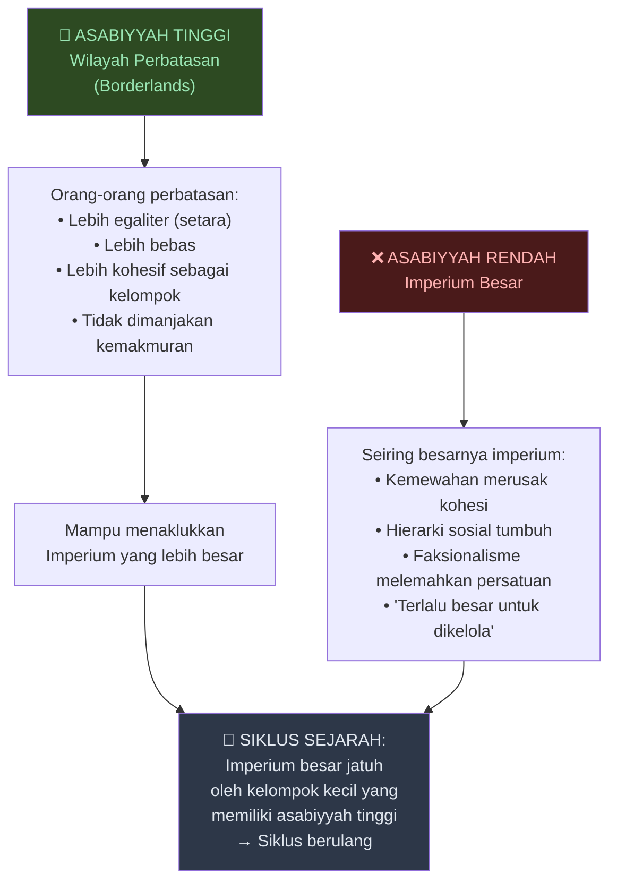

---

## Bagian 7: 1001 Malam dan Tingkatan Seni 📖

### Sastra Sebagai "Seni Rendah"

Karya sastra paling terkenal dari Zaman Keemasan Islam di Barat adalah **Seribu Satu Malam** (*Arabian Nights / Alf Laylah wa-Laylah*) — dengan kisah-kisah seperti Aladdin, Ali Baba, Sinbad, dan Scheherazade.

Tapi ada paradoks menarik: karya ini *bukan* karya asli Arab. Para ahli percaya bahwa sebagian besar ceritanya berasal dari *India*, kemudian diserap ke dalam tradisi lisan Persia dan Arab.

Dan yang lebih mengejutkan: **dalam hierarki seni intelektual Islam klasik, karya seperti ini dianggap "seni rendah" (*low arts*).**

| Tingkatan | Bidang | Status |
|-----------|--------|--------|
| 🥇 Tertinggi | Matematika, Filsafat, Ilmu Pengetahuan | *High Arts* — seni tinggi |
| 🥈 Menengah | Puisi, Teologi, Musikologi | Dihormati |
| 🥉 Rendah | Cerita populer, hikayat | *Low Arts* — hiburan rakyat |

Mengapa *Arabian Nights* bisa sampai ke kita? Karena **orang Eropa** yang menemukan dan jatuh cinta dengan cerita-cerita ini berabad-abad setelah Zaman Keemasan berakhir. Film-film Disney pun didasarkan pada koleksi cerita ini.

---

## Bagian 8: Perbandingan Tiga Agama — Kekuatan dan Kelemahan 🔄

Untuk memahami mengapa Islam memimpin ketika Eropa berada di Abad Kegelapan, kita perlu membandingkan ketiga agama Ibrahim (*Abrahamic religions*) secara jujur.

### Agama Yahudi (*Judaism*)

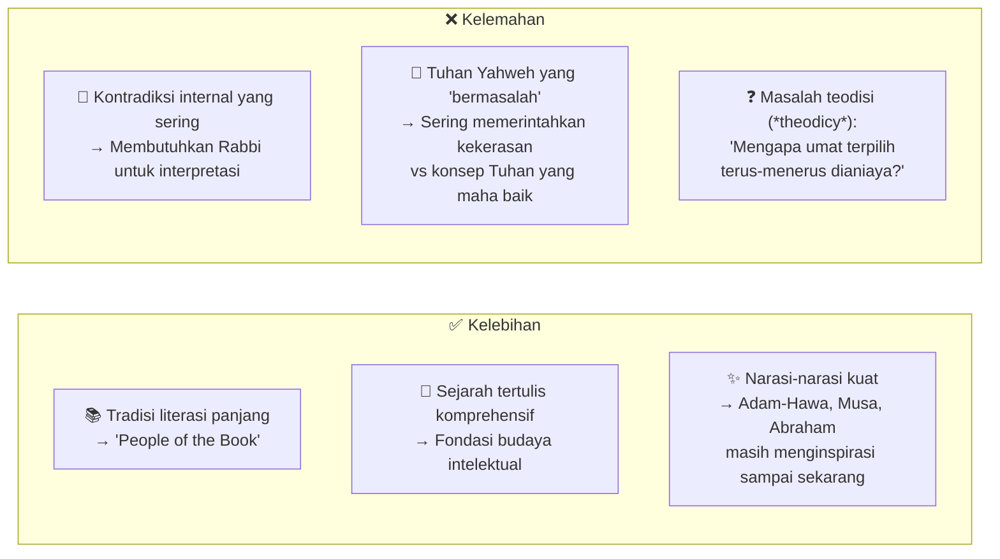

### Agama Kristen (*Christianity*)

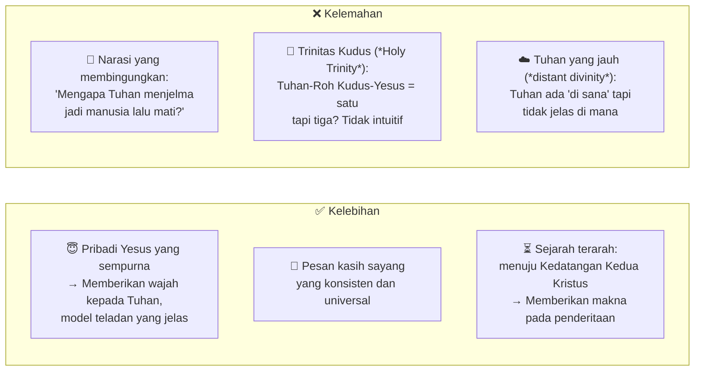

### Agama Islam — Sintesis dan Revolusi

Islam datang untuk menjawab kelemahan-kelemahan kedua pendahulunya:

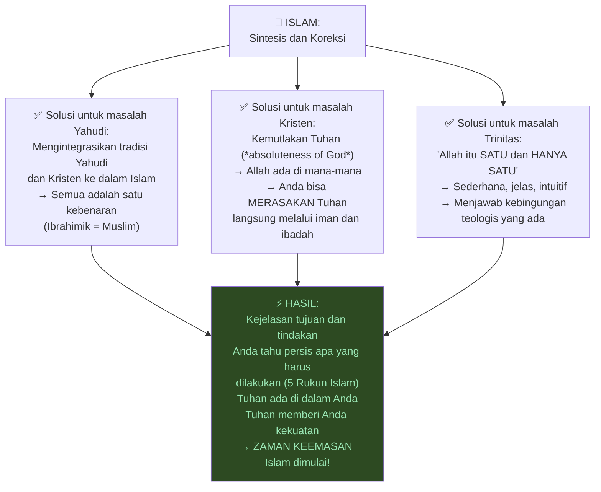

### Kekuatan yang Sekaligus Menjadi Kelemahan

Namun ada ironi besar dalam sejarah: **kekuatan Islam yang sama yang meluncurkan Zaman Keemasan akhirnya menjadi hambatan kemajuan selanjutnya.**

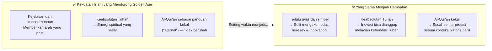

---

## Bagian 9: Plato vs Aristoteles — Kunci Perbedaan Eropa dan Islam 🏛️

Ini adalah salah satu argumen paling menarik dalam kuliah ini: **mengapa Islam bisa mencapai Zaman Keemasan sementara Eropa tidak, bahkan ketika keduanya sama-sama punya akses ke filsafat Yunani?**

Jawabannya: **pilihan filsuf**.

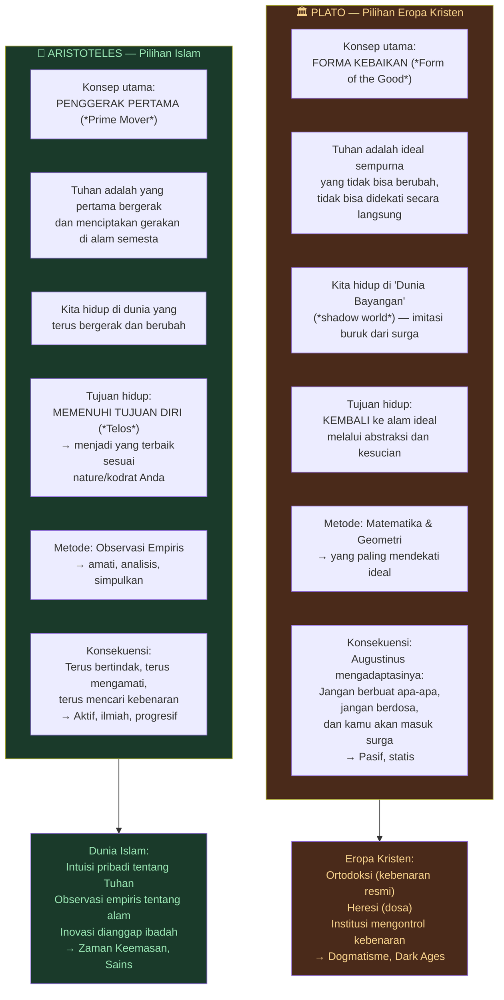

### Implikasi Filosofis yang Sangat Praktis

**Pilihan Platonik (Byzantium/Eropa Kristen):**
> Tuhan itu sempurna dan abstrak. Kita hidup di dunia yang kotor. Tugas kita adalah *tidak berbuat salah* agar bisa kembali ke surga.
>
> Akibatnya: **Jangan inovasi. Jangan tanya-tanya. Ikuti saja apa yang sudah ditetapkan paus/uskup.**
>
> → *Abad Kegelapan*

**Pilihan Aristotelian (Islam):**
> Tuhan ada di mana-mana dan bisa Anda rasakan. Ia menciptakan gerakan. Setiap objek memiliki tujuan (*telos*). Tugas Anda adalah *memenuhi tujuan diri Anda* — menjadi yang terbaik.
>
> Akibatnya: **Berpikirlah. Amati. Bereksperimen. Karena memahami ciptaan Allah adalah bentuk ibadah tertinggi.**
>
> → *Zaman Keemasan*

<Callout type="quote" title="💬 Poin Kunci tentang Sains dan Iman">
Dalam pandangan Aristotelian yang diadopsi Islam:

Ilmu pengetahuan bukan bertentangan dengan agama — melainkan **merupakan ibadah**. Memahami alam semesta berarti memahami ciptaan Allah.

Inilah mengapa para ilmuwan Muslim tidak mengalami dikotomi antara iman dan sains yang kemudian menyiksa Galileo di Eropa.
</Callout>

---

## Bagian 10: Akhir Zaman Keemasan — Mongol dan Penyebab Dalam 💀

### 1258 M: Mongol Membakar Baghdad

Pada **1258 M**, pasukan Mongol di bawah pimpinan **Hulagu Khan** (cucu Jenghis Khan) mengepung dan menaklukkan Baghdad.

Menurut tradisi sejarah, mereka:
- Membantai antara 200.000 hingga 800.000 orang (perkiraan bervariasi)
- Membakar sebagian besar perpustakaan Baghdad
- Menghancurkan sistem irigasi yang menjadi basis pertanian Mesopotamia

Legenda mengatakan bahwa sungai Tigris berubah menjadi **hitam karena tinta dari buku-buku yang dibuang**, kemudian menjadi **merah karena darah**.

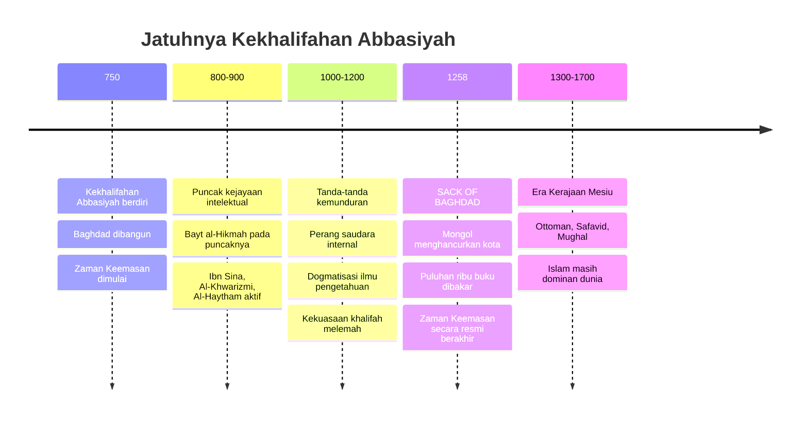

### Penyebab Internal yang Sering Dilupakan

Namun kehancuran oleh Mongol adalah *faktor eksternal*. Ada penyebab internal yang tidak kalah penting:

**Proses Dogmatisasi (*Dogmatization*):**

Inovasi yang dulunya revolusioner secara bertahap *mengeras* menjadi dogma. Ketika hasil-hasil pemikiran para ilmuwan Muslim awal dianggap sebagai kebenaran final yang tidak boleh dipertanyakan, maka kreativitas berhenti.

> *"Di awal, kekuatan-kekuatan Islam yang sama yang melahirkan Zaman Keemasan justru akan — seiring waktu — membuat inovasi-inovasi ini menjadi dogma dan mengkristal, serta mencegah pertumbuhan lebih lanjut."*

---

## Bagian 11: Warisan ke Eropa — Bagaimana Islam Menciptakan Modernitas ⚗️

### Fibonacci Belajar di Baghdad

**Leonardo Fibonacci** — matematikawan Italia yang terkenal dengan deret Fibonacci dan mempopulerkan angka Hindu-Arab di Eropa — *belajar langsung di Baghdad dari matematikawan Muslim terkemuka*.

Ini bukan kebetulan. Selama Abad Pertengahan, ratusan cendekiawan Eropa melakukan perjalanan ke pusat-pusat pembelajaran Islam — Baghdad, Cordoba, Kairo — untuk menyerap pengetahuan yang tidak mereka miliki.

### Tiga Gelombang Serapan Eropa dari Islam

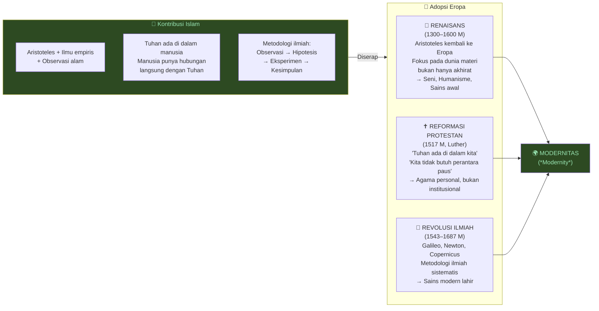

**Yang membuat Eropa akhirnya melampaui Islam:** Eropa tidak hanya meniru — mereka membangun **institusi untuk menghancurkan dogma itu sendiri**.

Diskusi, debat, dan analisis yang mengkritik kepercayaan yang sudah mapan (*established beliefs*) menjadi fondasi dari Revolusi Ilmiah. Itu yang melahirkan dunia modern.

---

## Bagian 12: Kerajaan-Kerajaan Mesiu — 1300–1700 M 🔫

Menariknya, meskipun Zaman Keemasan berakhir pada 1258 M, Islam *tetap* mendominasi dunia selama berabad-abad kemudian.

Dari 1300 hingga 1700 M, tiga kekaisaran Islam besar — yang dikenal sebagai **Kerajaan-Kerajaan Mesiu** (*Gunpowder Empires*) karena keunggulan mereka dalam teknologi senjata api — mendominasi Eurasia:

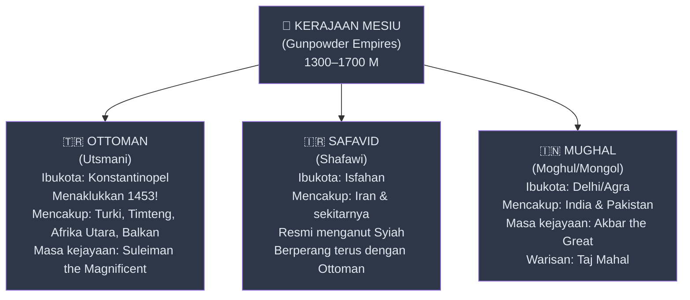

Fakta mengejutkan: **dari 622 M hingga sekitar 1700 M — selama lebih dari 1.000 tahun — peradaban Islam mendominasi dunia.**

---

## Bagian 13: Menjawab Tiga Pertanyaan Besar 🎯

### Pertanyaan 1: Mengapa Islam Mengalami Zaman Keemasan Sementara Eropa Berada di Abad Kegelapan?

**Jawaban ringkas:**

1. **Orientasi Filosofis:** Islam memilih Aristoteles (observasi empiris, telos, aktif) sementara Eropa memilih Plato (ideal abstrak, pasif, dogmatis)
2. **Sifat Revolusioner Islam:** Karena Islam adalah gerakan revolusioner, ia *harus* terbuka, inklusif, dan menarik sebanyak mungkin pengikut
3. **Jaringan Perdagangan Global:** Jalur Sutera Maritim menghubungkan seluruh dunia, memungkinkan transfer pengetahuan dari semua peradaban
4. **Keimanan sebagai Motivator:** Keyakinan bahwa memahami ciptaan Allah adalah ibadah mendorong eksplorasi ilmiah tanpa rasa takut

### Pertanyaan 2: Apa yang Mengakhiri Zaman Keemasan?

**Jawaban:**
1. **Faktor Eksternal:** Penaklukan Mongol 1258 M yang menghancurkan Baghdad
2. **Faktor Internal:** Dogmatisasi bertahap dari inovasi-inovasi awal — inovasi yang dulu bebas kini mengkristal menjadi kebenaran yang tidak boleh dipertanyakan

### Pertanyaan 3: Bagaimana Eropa Akhirnya Melampaui Dunia Muslim?

**Jawaban:**
1. Eropa *menyerap* warisan Islam melalui terjemahan dan kontak selama Abad Pertengahan
2. Eropa kemudian membangun **institusi untuk menghancurkan dogma** — melalui Renaisans, Reformasi, dan Revolusi Ilmiah
3. Fleksibilitas internal Kristen (karena kontradiksi dalam Alkitab!) justru memungkinkan inovasi teologis dan intelektual yang lebih radikal

---

## Kesimpulan: Islam sebagai Proto-Modernitas 🌅

Argumen utama yang dibangun dalam kuliah ini adalah ini:

> **Zaman Keemasan Islam adalah fondasi dari modernitas (*proto-modernity* dari sejarah manusia). Ketika kita berbicara tentang modernitas yang dimulai di Eropa, kita sering lupa bahwa Islam sudah membangun seluruh pondasinya.**

Beberapa bukti konkret:
- **Algoritma dan Aljabar** — tulang punggung komputasi modern — adalah kata-kata Arab
- **Metode Ilmiah Empiris** — jantung sains modern — dikembangkan pertama kali oleh Al-Haytham
- **Universitas** pertama di dunia adalah institusi Islam di Maroko
- **Rumah Sakit** modern berasal dari model Abbasiyah di Baghdad
- **Globalisasi** dalam bentuk jaringan perdagangan global pertama kali dibangun oleh Kekhalifahan Abbasiyah

Dan Dante — penyair besar Eropa, dalam karya terbesar Eropa abad pertengahan — secara eksplisit menempatkan dua filsuf Muslim di antara jiwa-jiwa paling agung dalam sejarah peradaban.

Hutang yang sering tidak diakui. Sejarah yang sering terhapus dari buku teks.

```mermaid
graph LR
    A["🌙 Zaman Keemasan Islam\n(750–1258 M)\n• Matematika\n• Fisika\n• Kedokteran\n• Filsafat\n• Metode Ilmiah\n• Perdagangan Global"] -->|"Diserap &\ndikembangkan"| B
    
    B["🏰 Eropa Abad Pertengahan\n(1100–1400 M)\n• Fibonacci belajar di Baghdad\n• Avicenna jadi teks medis\n• Aristoteles diterjemahkan balik\n• Universitas-universitas didirikan"] -->|"Membangun\ninstitusi anti-dogma"| C
    
    C["🌍 MODERNITAS\n(Renaissance, Reformation,\nScientific Revolution)\n• Sains empiris\n• Kapitalisme\n• Demokrasi\n• Teknologi modern"]

    style A fill:#2d4a22,color:#9ae6b4
    style B fill:#2d3748,color:#e2e8f0
    style C fill:#1a3a4a,color:#90cdf4
```

Dengan memahami Zaman Keemasan Islam, kita tidak hanya belajar sejarah satu agama atau satu peradaban. Kita belajar tentang **bagaimana pengetahuan bergerak, berkembang, dan menyeberangi batas-batas budaya** — dan bagaimana dunia yang kita tinggali hari ini merupakan produk dari persilangan peradaban yang jauh lebih kompleks dari yang diajarkan di sekolah.

---

## Glosarium Istilah Kunci 📚

<Callout type="abstract" title="🗂️ Kamus Mini Istilah dalam Artikel Ini">

| Istilah (Arab/Inggris) | Bahasa Indonesia | Penjelasan |
|---|---|---|
| **Islam** | Penyerahan diri | Berasal dari kata Arab *salama* — berserah diri kepada Allah |
| **Muslim** | Orang yang berserah | Seseorang yang menyerahkan diri kepada kehendak Allah |
| **Hijra** (هجرة) | Migrasi/Pengunduran diri | Perjalanan Muhammad dari Mekah ke Madinah (622 M) |
| **Khalifah** (خليفة) | Pemimpin/Pengganti | Penerus Muhammad sebagai pemimpin komunitas Muslim |
| **Kekhalifahan** | Imperium/Khilafah | Wilayah yang diperintah oleh seorang Khalifah |
| **Bayt al-Hikmah** (بيت الحكمة) | Rumah Kebijaksanaan | Pusat akademik di Baghdad — setara universitas riset modern |
| **Asabiyyah** (عصبية) | Kohesi sosial / Solidaritas kelompok | Konsep Ibn Khaldun tentang kekuatan internal suatu kelompok |
| **Telos** (τέλος) | Tujuan / Maksud kodrati | Konsep Aristoteles — setiap benda/makhluk memiliki tujuan kodrat |
| **Prime Mover** | Penggerak Pertama | Konsep Aristoteles tentang Tuhan sebagai sebab pertama dari semua gerak |
| **Form of the Good** | Forma Kebaikan | Konsep Plato tentang realitas tertinggi yang sempurna dan abadi |
| **Orthodoxy** (ορθοδοξία) | Ortodoksi / Kebenaran Resmi | Pikiran/kepercayaan yang dianggap benar oleh otoritas |
| **Heresy** (αἵρεσις) | Heresi / Bid'ah | Pikiran/kepercayaan yang dianggap salah oleh otoritas |
| **Empirical** | Empiris | Berbasis pada observasi dan eksperimen nyata |
| **Historiography** | Historiografi | Ilmu dan praktik penulisan sejarah |
| **Monotheism** | Monoteisme | Kepercayaan pada satu Tuhan tunggal |
| **Apocalyptic** | Apokaliptik | Berkaitan dengan nubuatan akhir zaman |
| **Gunpowder Empires** | Kerajaan Mesiu | Ottoman, Safavid, Mughal — tiga kekaisaran Islam 1300–1700 M |
| **Asabiyyah** | Kohesi sosial | Ikatan kelompok yang membuat mereka kuat bersama |
| **Al-Qarawiyyin** | Universitas Al-Qarawiyyin | Universitas tertua di dunia, Fes, Maroko (859 M) |
</Callout>

---

## Referensi dan Sumber Lanjut 🔖

<Callout type="cite" title="📖 Untuk Eksplorasi Lebih Lanjut">

**Sumber Video:**
- **"Civilization #37: The Golden Age of Islam"** — [YouTube](https://www.youtube.com/watch?v=2OdO8LoKuo8)

**Buku yang Disebut / Direkomendasikan:**
- **The Muqaddimah** — Ibn Khaldun *(teks asli ilmu sosial, masih relevan)*
- **The Canon of Medicine** — Ibn Sina/Avicenna *(karya medis paling berpengaruh sepanjang masa)*
- **Divine Comedy** — Dante Alighieri *(bukti kontribusi Islam ke Eropa — lihat canto Limbo)*
- **Thinking Fast and Slow** — Daniel Kahneman *(disebut dalam konteks kurikulum)*

**Tokoh Utama yang Dibahas:**
- 📐 **Al-Khwarizmi** (780–850 M) — Matematikawan, Bapak Aljabar & Algoritma
- 🏥 **Ibn Sina/Avicenna** (980–1037 M) — Dokter & Filsuf, *Al-Qanun fi al-Tibb*
- 🔬 **Ibn al-Haytham/Alhazen** (965–1040 M) — Fisikawan & Optikus
- ✂️ **Al-Zahrawi/Albucasis** (936–1013 M) — Ahli Bedah Pertama
- 🌹 **Rumi** (1207–1273 M) — Penyair & Mistis Sufi
- 📊 **Ibn Khaldun** (1332–1406 M) — Bapak Ilmu Sosial & Sejarah
- 🌌 **Omar Khayyam** (1048–1131 M) — Penyair, Matematikawan, Astronom
- 🎓 **Fatima al-Fihri** (~800–880 M) — Pendiri Universitas Al-Qarawiyyin
</Callout>

---

*Kita hidup di dunia yang dibangun di atas fondasi yang jauh lebih beragam dari yang kita kira. Setiap kali kita menggunakan algoritma, memecahkan persamaan aljabar, atau menikmati sistem kesehatan modern — kita sedang menikmati warisan dari sebuah zaman ketika Baghdad adalah pusat dunia dan cahaya pengetahuan bersinar paling terang di bawah bulan sabit.*
