## 🔥 Pengantar: Seorang Tokoh yang Lebih Hidup Setelah Mati

Tidak banyak tokoh sejarah yang justru semakin relevan setelah meninggal lebih dari tujuh dekade yang lalu. **Tan Malaka** adalah pengecualian yang langka.

Di toko buku besar di Papua, **Madilog** — karya magnum opus (*karya terbesar/utama*) Tan Malaka — terjual lebih dari 40.000 eksemplar dalam enam bulan. Dan ia menjadi *bestseller* berdampingan dengan... barbel. Di rak buku, di rak olahraga, keduanya sama-sama laris.

Kebayang tidak?

Di kalangan anak muda perkotaan yang aktif di X (Twitter), nama Tan Malaka hadir di mana-mana: dalam debat-debat teori, dalam meme-meme politik, dalam kutipan-kutipan bio profil. **Malaka Project** — sebuah kanal YouTube besar yang mempopulerkan pemikiran Tan Malaka — memantik kontroversi tersendiri karena dianggap merepresentasikan (*mewakili*) tokoh ini secara elitis.

Fenomena ini — kebangkitan Tan Malaka sebagai semacam *"agama baru"* bagi generasi muda — dibahas secara mendalam oleh **Zen RS**, seorang intelektual dan penulis asal Jakarta, dalam sebuah podcast bersama **Putut TA Kepala Suku Mojo** di Putcast.

Artikel ini adalah ulasan mendalam dari diskusi tersebut. 📚

---

## 👤 Siapa Zen RS?

Zen RS adalah penulis yang bekerja di persimpangan antara sejarah, sastra, dan pemikiran politik. Dalam diskusi ini, ia mempresentasikan dua hal sekaligus:

1. **Buku rekonstruksi** — edisi peringatan 100 tahun naskah *"Naard de Republiek Indonesia"* (Menuju Republik Indonesia) karya Tan Malaka, yang terbit Desember 1925 dan diterbitkan ulang oleh Zen dengan catatan pendamping (*companion notes*) yang komprehensif.

2. **Tiga buku baru** yang sedang ia kerjakan, semuanya berkutat di sekitar tema besar: sejarah politik Indonesia dari sudut pandang material dan dekolonial.

<Callout type="info" title="📖 Apa itu Naard de Republiek Indonesia?">
Ditulis Tan Malaka di awal 1925 di Singapura, *Naard de Republiek Indonesia* (secara harfiah berarti "Menuju Republik Indonesia") adalah pamflet (*brosur politik*) tipis yang mengajukan konsep republik Indonesia — 20 tahun sebelum proklamasi benar-benar terjadi.

Pada sidang BPUPKI (*Badan Penyelidik Usaha-Usaha Persiapan Kemerdekaan Indonesia*) tahun 1930, jaksa bahkan mengutip kalimat-kalimat dalam pamflet ini ketika mengadili Soekarno — bukti betapa tersebarnya teks ini di kalangan gerakan anti-kolonial.
</Callout>

---

## 📚 Tiga Buku Baru Zen RS: Memetakan Sejarah Politik Indonesia

Sebelum masuk ke diskusi utama soal Tan Malaka, Zen memaparkan tiga proyek buku yang sedang ia garap. Ketiganya saling terhubung dan membentuk suatu bangunan argumen yang kohesif (*padu/utuh*).

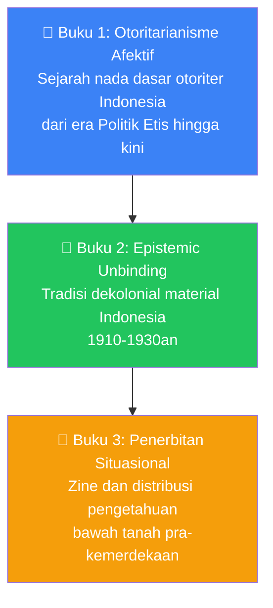

### 📘 Buku 1: "Neraka Sedang Sepi, Semua Iblis Ada di Sini"

Buku pertama berangkat dari hipotesis (*dugaan ilmiah*) yang provokatif: **sejarah politik Indonesia pada dasarnya adalah sejarah otoritarian** (*otoritarisme*). Periode demokratis yang sejati sangat singkat — paling optimis sekitar 10 tahun dari total 80 tahun lebih kemerdekaan.

Zen tidak mau menggunakan istilah-istilah impor seperti "populisme iliberal" atau "demokrasi terkonsolidasi" karena menurutnya istilah-istilah itu tidak cukup memadai untuk menggambarkan nada dasar kekuasaan di Indonesia.

Alih-alih, ia mengajukan konsep: **otoritarianisme afektif** (*affective authoritarianism*).

<Callout type="example" title="🔍 Apa itu Otoritarianisme Afektif?">
Otoritarianisme afektif bukan bekerja dengan bedil setiap hari. Ia bekerja dengan **memodulasi afeksi** (*modulasi perasaan/emosi*): rasa hormat, spiritualitas, sentimen kebangsaan.

Caranya: menciptakan **logika kedaruratan** (*emergency logic*) yang dipermanenkan.

**Kedaruratan mestinya sementara.** Tapi rezim otoriter mengubahnya menjadi nada dasar berkuasa sehari-hari — sehingga menangguhkan hak warga negara tampak *normal* dan *rasional*.
</Callout>

Zen melacak pola ini dari era Politik Etis hingga hari ini:

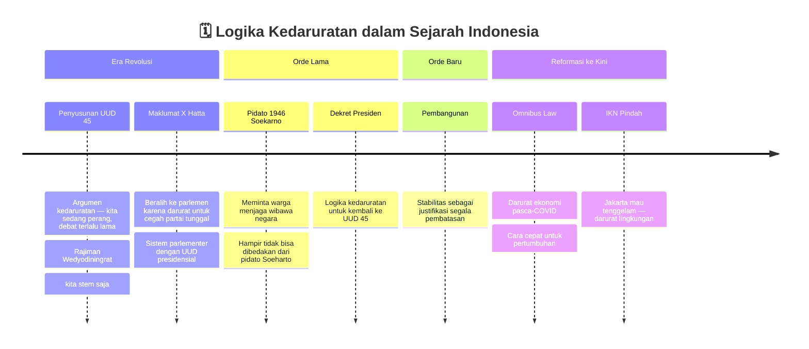

Pandangan Zen sangat menarik karena ia tidak melihat otoritarianisme hanya sebagai fenomena Soeharto. Soekarno pun, Hatta pun, bahkan pemimpin reformasi pun — semua punya momen di mana mereka menggunakan logika kedaruratan untuk menangguhkan proses demokratis yang normal.

### 📗 Buku 2: Tradisi Dekolonial Material — "Epistemic Unbinding"

Buku kedua membahas tradisi *dekolonial* (*anti-kolonial, menentang warisan kolonialisme*) di Indonesia dari sudut pandang yang berbeda dari diskursus (*wacana*) dominan.

Zen mengkritik bahwa studi dekolonial hari ini terlalu sibuk membicarakan:
- Representasi (*keterwakilan dalam wacana/pengetahuan*)
- Epistemologi Barat (*cara pandang Barat tentang pengetahuan*)
- Kesadaran kolektif

...sambil **melupakan** bahwa inti dari kolonialisme adalah **ekstraksi** (*pengambilan sumber daya secara paksa*).

<Callout type="warning" title="⚠️ Kritik Zen terhadap Studi Dekolonial Kontemporer">
Diskursus dekolonial hari ini sering gagal merespons apa yang terjadi di banyak tempat — seperti proses ekstraksi di Indonesia Timur — karena terlalu sibuk dengan paradigma (*kerangka pikir*) pengetahuan Barat tentang representasi dan kesadaran.

Zen percaya ekologi sosial-politik Indonesia berbeda sehingga tidak bisa begitu saja memakai istilah seperti *coloniality* (Quijano), *epistemic border* (Mignolo), atau konsep-konsep dekolonial dari India dan Amerika Latin.
</Callout>

Dari perbandingan teks Cipto Mangunkusumo, Suwardi Suryaningrat (Ki Hajar Dewantara), Mas Marco Kartodikromo, Tan Malaka, Soekarno, dan lainnya, Zen mengajukan neologisme (*kata baru*) sendiri: **epistemic unbinding** — secara harfiah "melepas ikatan epistemik."

Idenya: para intelektual anti-kolonial kita tidak langsung sadar bahwa kolonialisme adalah ekstraksi. Mereka **mengelupas satu demi satu lapisan terluar** dari kolonialisme:

1. ❓ Mengapa pendidikan kita seperti ini?
2. ❓ Mengapa hukum bekerja seperti ini?
3. ❓ Mengapa budaya kita seperti ini?
4. 💡 Oh... kolonialisme pada dasarnya adalah **sulap** — tampak normal, tampak sah, padahal intinya adalah ekstraksi.

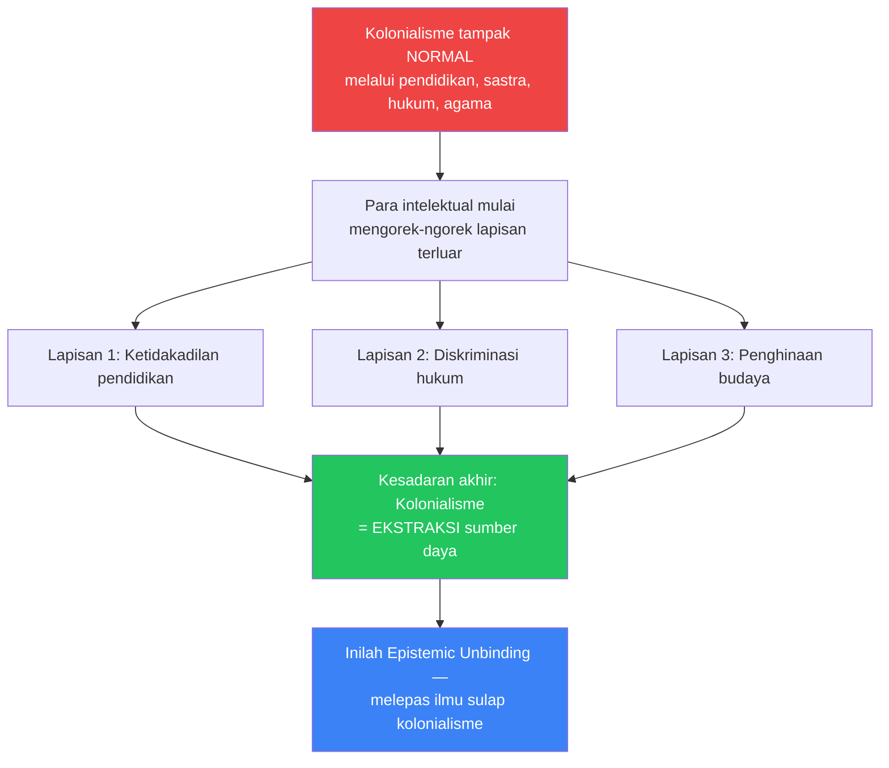

Istilah ini terinspirasi dari cara Mas Marco Kartodikromo menyebut metode investigasinya sendiri: *"mengorek-ngorek sulap"* — karena kolonialisme bekerja seperti ilmu sulap, dan tugas intelektual anti-kolonial adalah mengorek-ngorek sampai sulapnya ketahuan.

### 📙 Buku 3: Penerbitan Situasional — "Zine Paling Hebat: Teks Proklamasi"

Buku ketiga mungkin yang paling orisinal. Zen membahas tradisi *penerbitan situasional* (*situational publishing*) — konsep yang ia kembangkan untuk memahami bagaimana distribusi pengetahuan bawah tanah bekerja di era pra-kemerdekaan.

**Klaim sentral Zen:** Zine (*majalah mandiri, dari kata fanzine, literatur bawah tanah*) paling hebat dalam sejarah Indonesia adalah... **teks proklamasi kemerdekaan**.

Mengapa? Karena teks proklamasi lahir dalam 12 jam, berpindah melalui empat medium berturut-turut:

Kemampuan berpindah medium secepat itu tidak terjadi dalam semalam. Itu adalah produk dari **30 tahun disiplin** mendistribusikan informasi secara *klandestin* (*bawah tanah, rahasia*).

<Callout type="tip" title="💡 Syahrir dan Organized Listening">
Salah satu contoh paling menarik: Sutan Syahrir membuat yang disebut Zen sebagai **organized listening** (*mendengarkan terorganisasi*) — kelompok-kelompok yang secara sistematis mendengarkan siaran Radio BBC pada masa pendudukan Jepang.

Karena mesin cetak dikontrol sepenuhnya oleh Jepang, distribusi informasi dialihkan ke **tuturan lisan** — penerbitan yang tidak bisa disita. Akibatnya, Syahrir dan beberapa orang mengetahui Sekutu sudah kalah sebelum informasi itu tersebar resmi, sehingga proklamasi bisa berada di luar skema Jepang.
</Callout>

---

## 🧲 Kenapa Tan Malaka Jadi "Agama Baru"? Anatomi Sebuah Mitos

Kini masuk ke inti diskusi: mengapa Tan Malaka begitu dicintai oleh generasi muda hari ini?

Zen memberikan analisis yang tajam dan paradoks (*bertentangan dengan dugaan awal*): **kegemilangan Tan Malaka hari ini justru berdiri tegak di atas kegagalan-kegagalannya sebagai subjek politik.**

### 🧩 Peta Posisi Tan Malaka dalam Sejarah

Tan Malaka adalah figur yang **dikucilkan dari semua sisi**:

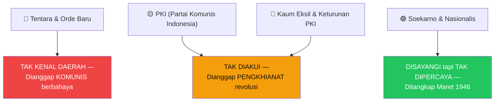

Tan Malaka mendirikan PARI (Partai Republik Indonesia), ia adalah seorang Leninis (*pengikut metode revolusioner Lenin*), ia adalah penganjur *vanguardism* (*vangardisme — teori bahwa revolusi dipimpin oleh partai pelopor yang terlatih*). Tapi partainya tidak pernah besar. Ia tidak pernah punya kesempatan berkuasa.

Dari 17 Agustus 1945 hingga Maret 1946 — hanya enam bulan — ia bebas menikmati kemerdekaan sebelum ditangkap oleh Soekarno-Hatta sendiri.

### 🔮 Formula Kesempurnaan: Cacat Politik Nol Persen

Di sini letak paradoksnya. Soekarno, Hatta, Syahrir, Amir Sjarifuddin — semua pernah berkuasa, dan karena itu **semua punya cacat**:

| Tokoh | Cacat sebagai Penguasa |
|-------|----------------------|
| 🔴 Soekarno | Kebijakan nasakom yang memicu konflik, Guided Democracy, mandor Musa |
| 🔵 Hatta | Maklumat X yang mengubah sistem di luar prosedur, bekerja sama dengan Jepang, menandatangani eksekusi Amir dan Tan Malaka (meski diperdebatkan) |
| 🟡 Syahrir | Perjanjian Linggarjati yang dianggap terlalu lunak |
| 🟢 Amir Sjarifuddin | Perjanjian Renville yang mengalihkan wilayah besar |

Tan Malaka? **Tidak sempat berkuasa.** Ditawari jabatan Menteri Penerangan, menolak. Hidupnya seperti fiksi: pelarian dari satu negara ke negara lain, nama palsu berganti-ganti, dipenjara di banyak negara, menulis di bawah tekanan terus-menerus.

> *"Kalau dia pernah berhasil sebagai subjek politik yang merebut kekuasaan... kalau sempat berkuasa, tidak mungkin dia tidak punya cacat politik."*
> — Zen RS

### 🌅 Tan Malaka sebagai "Horizon" — Utopia yang Tidak Pernah Bisa Dicapai

Zen menggunakan metafora (*kiasan*) yang sangat tepat: Tan Malaka adalah seperti **horizon** (*ufuk*) — setiap kali didekati, ia bergerak menjauh.

Mengapa? Karena ia memenuhi tiga kondisi yang hampir mustahil terpenuhi bersamaan:

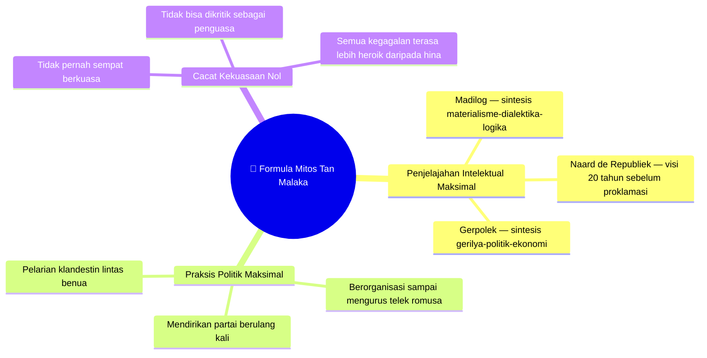

Bagi generasi muda yang **apatik** (*tidak peduli/kecewa*) terhadap infrastruktur politik resmi — partai politik, lembaga legislatif, birokrasi — Tan Malaka menawarkan figur yang sempurna: idealis, radikal, tidak terkontaminasi kekuasaan.

<Callout type="quote" title="📜 Nubuat Tan Malaka — Suaranya Lebih Nyaring dari Kubur">
Tan Malaka pernah menulis bahwa suaranya dari dalam kubur akan lebih nyaring daripada suaranya di atas bumi.

Dan tampaknya ia benar. Tidak ada tokoh pendiri bangsa yang lebih banyak dibaca hari ini oleh generasi muda yang tidak percaya pada partai manapun.
</Callout>

---

## 🏛️ Tan Malaka sebagai Teologi Politik

Ini adalah analisis paling orisinal dari Zen, yang terinspirasi dari pemikir Jerman Walter Benjamin:

> *"Setiap ideologi harus punya teologinya masing-masing. Teologinya adalah utopia. Mungkin generasi hari ini teologinya adalah Tan Malaka sebagai sebuah konsep, Tan Malaka sebagai sebuah abstraksi — bukan Tan Malaka sebagai subjek politik. Karena Tan Malaka sebagai subjek politik gagal."*
> — Zen RS

**Teologi** (*sistem keyakinan yang memberi makna pada penderitaan dan harapan*) dalam gerakan politik berfungsi sebagai:
- Janji bahwa perjuangan tidak sia-sia
- Kompas ketika realitas membingungkan
- Sumber energi untuk menanggung penderitaan

Kaum komunis di era pra-kemerdekaan bisa menanggung penjara dan pelarian karena mereka percaya — dengan keyakinan hampir religius — bahwa "kapitalisme pasti runtuh, republik pasti berdiri." Itu iman, bukan sekadar analisis.

Tan Malaka hari ini berfungsi sebagai **utopia kolektif** (*cita-cita bersama yang belum pernah terealisasi*) bagi generasi muda yang kehabisan harapan terhadap institusi-institusi demokrasi yang ada.

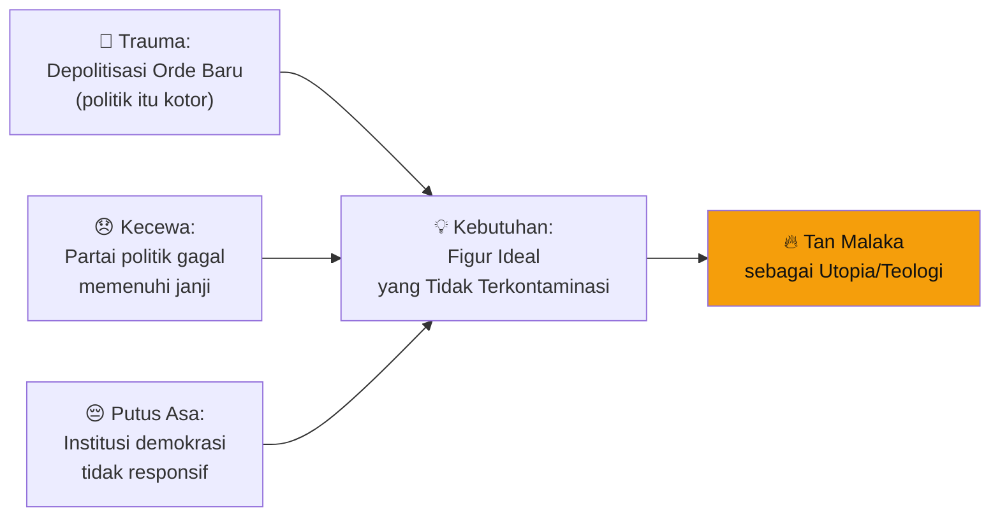

---

## 🤔 Paradoks Utama: Tan Malaka Leninis yang Dikagumi Anak Anti-Struktur

Zen menyinggung sebuah ironi (*keanehan*) yang mendasar:

> "Tan Malaka disukai dan digelai (*dipuja-puja*) oleh generasi hari ini karena dia dianggap pemikir bebas, pejuang bebas, tidak terikat dengan struktur. Padahal... dia penganjur partai, penganjur vanguardism, penganjur partai pelopor."

Kenyataan historis (*berdasarkan sejarah*) Tan Malaka:
- ✅ Mendirikan **PARI** (Partai Republik Indonesia) — sebuah partai politik dengan disiplin ketat
- ✅ Seorang **Leninis** yang percaya revolusi harus dipimpin oleh *vanguard party* (*partai pelopor* — elite revolusioner yang terlatih)
- ✅ Pernah hampir menjadi kandidat pemimpin **Komintern** (*Komunis Internasional*)
- ✅ Menulis **Gerpolek** — yang secara eksplisit membahas perlunya integrasi gerilya, politik, **dan ekonomi** dalam satu gerakan

Jadi ada gap besar antara **Tan Malaka yang historis** dengan **Tan Malaka yang dikonsumsi** hari ini.

<Callout type="warning" title="⚠️ Buku 'Naard de Republiek' sebagai Koreksi">
Inilah salah satu alasan Zen memilih untuk merekonstruksi dan memberi catatan pendamping pada *Naard de Republiek Indonesia* — karena buku ini secara eksplisit berbicara tentang vanguardism dan program politik konkret.

Membaca teks ini secara serius memaksa pembaca berhadapan dengan Tan Malaka yang historis, bukan Tan Malaka yang sudah menjadi abstraksi.
</Callout>

---

## 📖 Kenapa Pramoedya (Pram) Hampir Tidak Pernah Menyebut Tan Malaka?

Putut mengajukan pertanyaan yang tajam: mengapa Pramoedya Ananta Toer — penulis besar yang karya-karyanya banyak bicara soal perlawanan dan kolonialisme — hampir tidak pernah menyebut Tan Malaka?

Zen memberikan beberapa penjelasan:

**1. Pram adalah Soekarnois yang Setia**
Pram secara terbuka mengidentifikasi diri sebagai pengikut Soekarno. Sementara Tan Malaka dan Soekarno, meski saling menghormati, adalah dua kubu yang berbeda.

**2. Tan Malaka Dianggap Pengkhianat oleh Komunis**
Keturunan-keturunan eksil PKI pun masih menganggap Tan Malaka sebagai pengkhianat. Ini karena Tan Malaka menentang pemberontakan PKI 1926 yang ia anggap prematur dan tidak matang. Bagi mereka yang kehilangan segalanya dalam tragedi 1965, Tan Malaka adalah bagian dari sisi lain garis yang membelah.

**3. Insignifikansi Strategis dalam Real Politik**
Kata Ben Anderson (*Benedict Anderson — ilmuwan politik terkenal yang meneliti Indonesia*): **revolusi Indonesia berhenti ketika Tan Malaka ditangkap pada Maret 1946.** Mengapa? Karena ia adalah satu-satunya orang yang punya otoritas moral, intelektual, dan praksis sekaligus untuk berbicara tentang revolusi.

Namun justru karena ditangkap begitu cepat, Tan Malaka **insignifikan** (*tidak signifikan/tidak berpengaruh besar*) dalam panggung real politik proklamasi 1945 yang kemudian berkembang menjadi Republik.

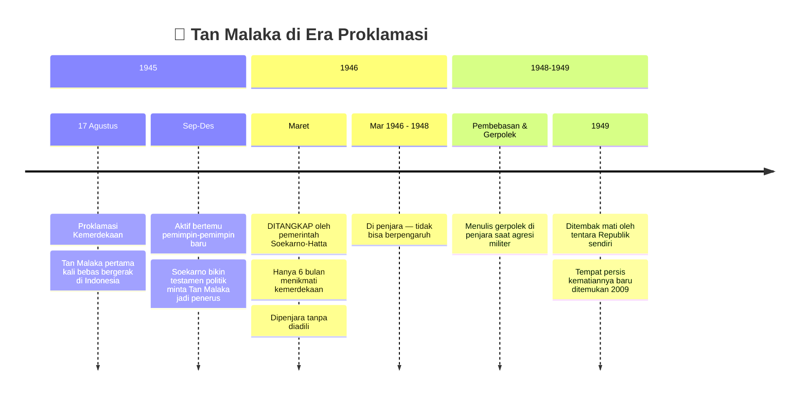

---

## 💡 Relevansi *Naard de Republiek* untuk Situasi Hari Ini

Zen memilih merekonstruksi justru teks ini — bukan Indonesia Menggugat, bukan Madilog — karena ia melihat kesamaan situasi:

**Konteks penulisan *Naard de Republiek* (1925):**
- Gerakan anti-kolonial sedang dipukul habis-habisan
- Ada pasal-pasal baru dalam WvS (*Wetboek van Strafrecht*, kitab hukum pidana kolonial) yang melarang demonstrasi dan mempersempit ruang gerak
- Ada kemarahan dari bawah karena represi konkret, tapi elit partai tidak bersikap
- Tan Malaka mengingatkan: sebelum bertindak, **hitung dulu apakah basis sosial sudah benar-benar mengakar**

**Situasi gerakan masyarakat sipil hari ini (menurut Zen):**
- Gerakan dipukul habis-habisan oleh regulasi-regulasi baru
- Ada kemarahan moral dari bawah, tapi artikulasi cara bergerak masih lemah
- Cara memahami kekuasaan masih menggunakan asumsi pasca-1998 (*reformasi*)

<Callout type="important" title="🎯 Pertanyaan Kritis Tan Malaka yang Relevan Hari Ini">
Dalam *Naard de Republiek*, Tan Malaka bertanya kepada PKI yang hampir memberontak:

*"Benarkah partai sudah sungguh-sungguh mengakar? Emang kita sudah kenal rakyat Toli-Toli? Emang kita sudah kenal rakyat Aceh? Emang kita sudah kenal rakyat Jambi?"*

Pertanyaan ini tetap menghantam: apakah gerakan masyarakat sipil hari ini sudah benar-benar mengenal mereka yang diklaim diwakilinya?
</Callout>

---

## 💸 Masalah yang Tidak Pernah Dibicarakan: Uang dalam Gerakan

Salah satu bagian paling menarik dari diskusi adalah ketika Zen dan Putut membahas tabu (*hal yang dianggap pantang untuk dibicarakan*) terbesar dalam gerakan masyarakat sipil Indonesia: **uang**.

### 🚫 Moralisme sebagai Penyakit Gerakan

Zen menyebut ini "moralisme" — sebuah kecenderungan untuk menilai segala hal dengan standar moral yang kaku, alih-alih dari analisis material (*berdasarkan keadaan nyata*).

Manifestasinya (*wujudnya*) dalam gerakan:
- Uang dianggap tabu → tidak boleh didiskusikan
- Menerima dana dari luar dianggap otomatis membuatmu komprador (*pelayan kepentingan asing*)
- Kolektif yang menghasilkan revenue tidak boleh mendistribusikannya kepada anggota
- Aktivis yang butuh uang karena keluarga dianggap "tidak cukup berkomitmen"

Hasilnya: **aktivis lapar**. Dan "sejarah orang-orang lapar" berakhir dengan satu dari dua jalan:

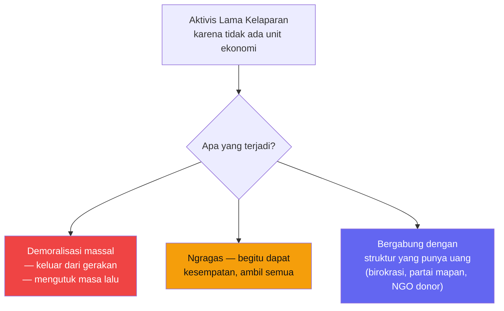

### 📚 Pelajaran dari Tan Malaka sendiri

Zen mengingatkan: ketika Tan Malaka menunggu uang dari Partai untuk mencetak *Aksi Massa* di Singapura dan uang itu tidak datang karena pemberontakan 1926 meletus lebih awal, **Tan Malaka bekerja sebagai juru tulis** di perusahaan ekspor-impor selama dua bulan ekstra untuk mengumpulkan uang sendiri dan mencetak pamfletnya.

> *"Nyari duit bekerja itu harus dilakukan. Organisasi yang mampu membangun unit ekonomi akan punya daya tahan yang jauh lebih panjang."*
> — Zen RS

Tan Malaka sendiri, dalam **Gerpolek**, sudah menulis bahwa tiga komponen gerakan harus berjalan bersama:

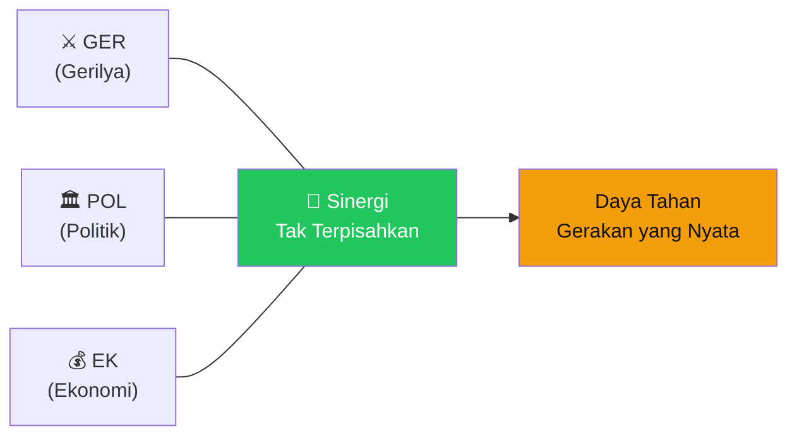

Ironisnya: generasi muda yang memuja Tan Malaka sering lupa bahwa sang tokoh sendiri punya argumen materialistik yang kuat soal kemandirian ekonomi gerakan.

---

## 🔥 Cancel Culture dan Kegagalan Gerakan Masyarakat Sipil

Bagian paling keras dan jujur dari diskusi ini adalah ketika Zen membahas kondisi gerakan masyarakat sipil (*civil society*) Indonesia.

> *"Saya tidak pernah optimistis dengan gerakan masyarakat sipil Indonesia sampai sekarang. Salah satu yang paling berat: senang sekali membelai orang, senang sekali menyingkirkan orang dalam satu barisan, memojokkan orang lalu menjatuhkannya."*
> — Zen RS

### 🧨 Problem Cancel Culture

Zen membedah masalah *cancel culture* (*budaya membatalkan/mengucilkan seseorang secara massal*) secara tajam:

**Masalah pertama:** Cancel culture tidak punya batas waktu. Hukum pidana punya batas — ada masa hukuman yang selesai. Cancel culture bisa permanen.

**Masalah kedua:** Tidak ada proses verifikasi. Hukum pidana ada proses pengadilan. Cancel culture cukup berbasis opini yang viral.

**Masalah ketiga (yang paling fatal):** Cancel culture membuat orang **merasa cukup** setelah meng-cancel seseorang. Tapi **struktur tidak berubah**. Sama seperti ketika seorang polisi yang memukul ibu-ibu dihukum kode etik — polisinya dihukum, tapi institusi berperilaku sama keesokan harinya.

<Callout type="danger" title="🚨 Analogi yang Menghantam">
Seorang wartawan dibully habis-habisan dan akhirnya resign dari profesinya karena... **memberitakan CCTV yang dirusak massa dalam aksi demonstrasi**.

Gerakan yang sama tidak terlalu gelisah ketika ada orang naik ke mobil komando dan mengucapkan kata-kata rasis. Tidak terlalu gelisah ketika demonstrasi berhari-hari tidak berhasil mengubah apapun.

Tapi sangat gelisah ketika ada pemberitaan tentang perusakan CCTV.

**Ini adalah logika moralisme yang mengalahkan analisis material.**
</Callout>

### 🏎️ Mobil di Jalan yang Menyempit

Zen mengutip analogi menarik tentang gerakan kiri yang saling berbenturan:

Gerakan-gerakan kiri itu seperti mobil yang berlomba menuju puncak gunung. Makin ke atas, jalannya makin sempit — sampai akhirnya ban-ban bergesekan satu sama lain tanpa henti.

Di titik kritis, alih-alih fokus pada musuh bersama di atas, energi habis untuk gesekan sesama yang menuju arah yang sama.

---

## 🗺️ Malaka Project, Tafsir, dan Infrastruktur Belajar

Kembali ke soal Malaka Project — kanal YouTube yang dikritik karena merepresentasikan Tan Malaka secara elitis.

Sikap Zen sangat pragmatis (*praktis*):

> *"Saya enggak ragu sama sekali ada 1, 2, 3 orang atau mungkin lebih banyak yang membaca karya Tan Malaka gara-gara Malaka Project. Pasti. Wong saya yang enggak terkenal aja ada orang baca Milan Kundera karena saya ngomong soal itu."*

Masalah bukan pada siapa yang memperkenalkan Tan Malaka. Masalahnya adalah: **siapa yang menyiapkan infrastruktur belajar lebih lanjut?**

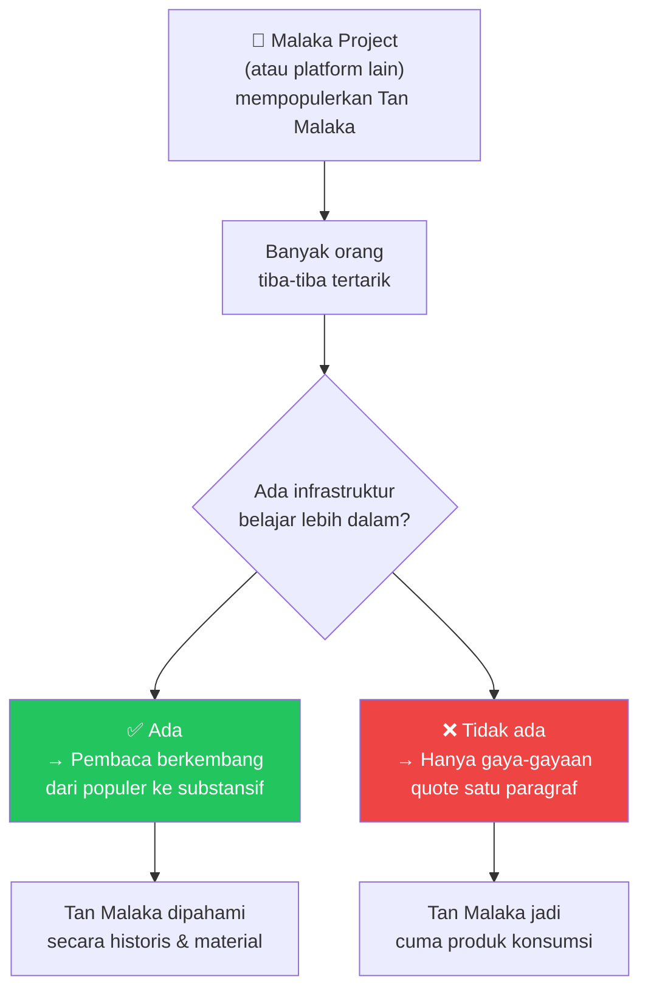

Zen mengusulkan pendekatan yang jauh lebih produktif daripada merutuki Malaka Project:

1. Kritik kalau memang ada misreading (*pembacaan keliru*) — itu sah
2. Tapi **sediakan alternatifnya**: infrastruktur belajar yang lebih mendalam
3. Seorang materialis tidak cukup hanya mengutuk — ia harus **menciptakan kondisi material** yang memungkinkan bacaan yang lebih baik

---

## 🔮 Pertanyaan yang Membuat Gerakan Maju: "Kalau Kamu Berkuasa, Apa yang Akan Kamu Lakukan?"

Seorang peserta diskusi mengajukan pertanyaan yang menurut Zen adalah pertanyaan paling produktif untuk gerakan:

*"Kalau kamu berkuasa, lima hal apa yang akan kamu lakukan?"*

Zen mengakui pertanyaan ini membuat dia agak tidak nyaman justru karena ia sadar **kurang material** jika tidak punya jawaban yang siap.

Tapi itulah gunanya: pertanyaan ini memaksa orang untuk:
- Punya **proyeksi ke depan** (*visi masa depan yang konkret*), bukan hanya nostalgia sejarah
- Menguji apakah program-program tokoh idola masih relevan
- Bertemu pada irisan (*titik temu*) konkret dengan sesama yang berbeda ideologi

Tan Malaka sendiri sudah memberikan contoh terbaik: ia membayangkan republik Indonesia **20 tahun sebelum** repubiknya beneran berdiri. Itu adalah keseriusan berpikir tentang masa depan yang harus ditiru.

<Callout type="success" title="✅ Satu Cara Membaca Tan Malaka yang Produktif">
Daripada memuja Tan Malaka sebagai abstraksi, tanyakan: **dari 30 program politiknya, mana yang masih relevan hari ini?**

Beberapa program liberalnya — upah minimum, jam kerja 7 jam — sudah terealisasi. Beberapa program lainnya — seperti wacana pemindahan penduduk Jawa secara paksa — hari ini akan segera di-cancel sebagai *settler colonialism* (*kolonialisme pemukiman*).

Memaksa Tan Malaka turun dari panggung kultus ke panggung material adalah cara paling menghormatinya sebagai pemikir.
</Callout>

---

## 🗺️ Peta Besar: Tan Malaka, Mitos, dan Gerakan

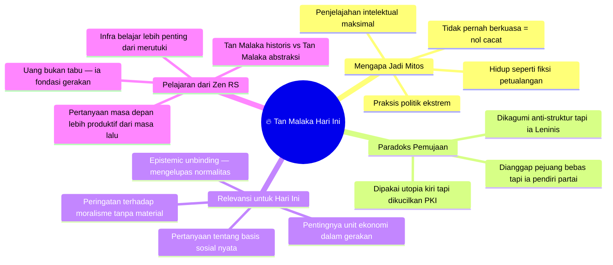

---

## 🏁 Penutup: Relevansi yang Berdiri di Atas Kegagalan

Diskusi Zen RS di Putcast adalah salah satu analisis paling jujur dan tajam tentang fenomena Tan Malaka yang pernah ada dalam format populer.

Tesis utamanya bisa dirangkum dalam satu kalimat:

> **Tan Malaka menjadi "agama baru" generasi muda justru karena ia gagal sebagai subjek politik — kegagalan yang membuat ia tidak punya cacat kekuasaan, sehingga ia bisa menjadi utopia murni yang terus dikejar tanpa harus pernah benar-benar dicapai.**

Dan Zen mengingatkan kita dengan keras: teologi tanpa materialisme adalah racun gerakan. Jika kita sungguh-sungguh menghormati Tan Malaka, kita harus mengikutinya bukan sebagai berhala — tapi sebagai pemikir yang selalu mempertanyakan kondisi material konkret sebelum bertindak.

Apakah kita sudah mengenal rakyat Toli-toli?

Apakah kita sudah punya unit ekonomi yang mandiri?

Apakah kita tahu imajinasinya tentang Indonesia 20 tahun ke depan?

Jika belum, kita masih jauh dari benar-benar mewarisi semangat Tan Malaka. 🔥

---

<Callout type="cite" title="📹 Sumber">
Artikel ini didasarkan pada diskusi **Zen RS × Putut TA Kepala Suku Mojo** di Putcast.

Tonton di YouTube: [ZEN RS: MITOS TAN MALAKA! KENAPA DIA JADI "AGAMA BARU" BAGI GENERASI MUDA](https://www.youtube.com/watch?v=8iMHRglvxOU)

**Buku yang dibahas:** *Naard de Republiek Indonesia* oleh Tan Malaka, diedisi ulang dengan catatan pendamping oleh Zen RS, terbit Desember 2025.
</Callout>
