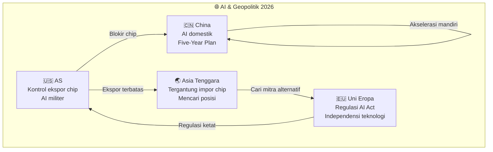
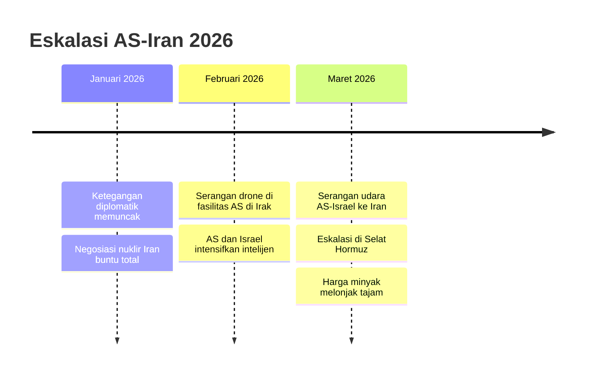
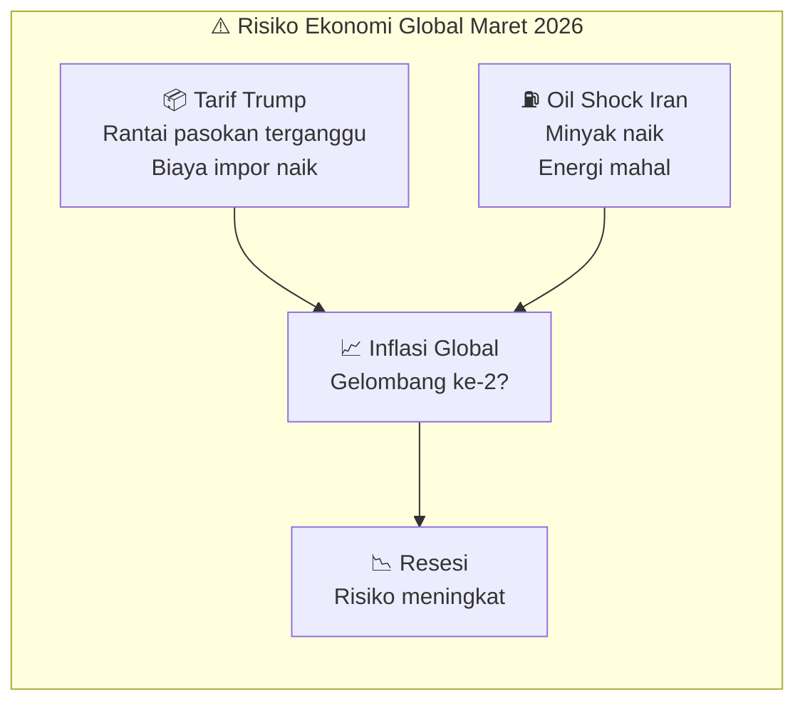
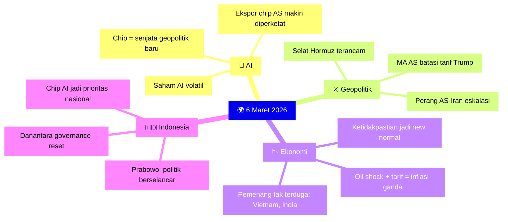

# 🗓️ Daily Note — 6 Maret 2026

> *Hari yang penuh turbulensi global: perang AS-Iran mendominasi geopolitik, chip AI jadi senjata baru perang dagang, Mahkamah Agung AS guncang kebijakan tarif Trump, dan Indonesia berusaha berselancar di antara semua guncangan.*

---

## 🤖 Kecerdasan Buatan (AI)

### 1. Amerika Serikat Siapkan Aturan Ekspor Chip AI Paling Ketat Sepanjang Sejarah

Washington sedang mempertimbangkan aturan ekspor chip AI baru yang akan **mengharuskan izin khusus untuk setiap penjualan chip Nvidia dan AMD ke luar negeri** — termasuk ke negara-negara yang selama ini dianggap sekutu. Lebih jauh, aturan ini bahkan mensyaratkan perusahaan asing yang ingin membeli chip AI dalam jumlah besar (200.000 unit ke atas) untuk **melakukan investasi di Amerika Serikat** sebagai prasyarat.

Ini bukan sekadar regulasi teknis. Ini adalah **senjatisasi teknologi** — chip AI kini setara dengan teknologi nuklir dalam kalkulus kekuatan geopolitik global.

Dampaknya langsung terasa:
- Saham Nvidia dan AMD bergejolak
- Negara-negara Asia (termasuk Indonesia) mulai khawatir soal akses chip masa depan
- China mempercepat pengembangan chip domestik (Huawei, SMIC)

> 💡 **Implikasi untuk Indonesia:** Proyek Sovereign AI Telkom 2028 dan ambisi AI nasional bisa terhambat jika akses chip dibatasi. Ini memperkuat urgensi kemitraan strategis dan diversifikasi sumber chip.

**Sumber:** Reuters, Bloomberg, TechCrunch, Investopedia

---

### 2. Delapan Cara AI Akan Membentuk Geopolitik di 2026

Atlantic Council merilis analisis tentang bagaimana AI mulai mengubah peta kekuatan global secara fundamental:

- **Warfare:** AI digunakan dalam sistem senjata otonom dan intelijen militer — terlihat nyata dalam konflik AS-Iran dan konflik aktif lainnya
- **Surveillance:** Negara-negara otoriter menggunakan AI untuk pemantauan massal warga
- **Disinformation:** AI generatif mempercepat produksi konten palsu di skala industri
- **Diplomasi Digital:** Platform teknologi besar kini berfungsi layaknya aktor kebijakan luar negeri — "Silicon Valley's New Diplomacy"
- **Ekonomi:** Negara yang menguasai AI akan menguasai rantai nilai global berikutnya

**Sumber:** Atlantic Council

---

### 3. Persaingan AI: Saham Teknologi Bergejolak

Beberapa saham AI terkemuka turun hingga 19% di awal 2026, dipicu kombinasi:
- Kekhawatiran regulasi ekspor chip
- Ketidakpastian geopolitik perang AS-Iran yang mengganggu rantai pasokan
- Pertanyaan valuasi setelah euforia AI 2024-2025

Analis Wall Street terpecah: sebagian merekomendasikan jual, sebagian melihat peluang beli jangka panjang di harga koreksi.

**Sumber:** Motley Fool, Nasdaq, Investopedia

---

## 🌍 Geopolitik

### 4. Perang AS-Iran: Eskalasi yang Mengubah Timur Tengah

Konflik bersenjata antara Amerika Serikat-Israel dan Iran memasuki babak baru. Serangan udara gabungan AS-Israel pada infrastruktur militer Iran menjadi titik infleksi terbesar dalam geopolitik Timur Tengah sejak dekade terakhir.

**Dampak langsung:**
- **Minyak:** Selat Hormuz — jalur 20% pasokan minyak dunia — terancam. Harga minyak melonjak, memicu ancaman inflasi gelombang kedua secara global
- **Shipping:** Jalur Laut Merah kembali terganggu setelah sempat membaik
- **Geopolitik regional:** Iran bergeser ke strategi *attrition* (perang kelelahan) daripada konfrontasi langsung
- **Tanduk Afrika:** Dampak tidak langsung ke stabilitas Somalia, Eritrea, dan Djibouti

Para analis di Soufan Center menilai serangan AS-Israel bertujuan **merestrukturisasi geopolitik Timur Tengah** — bukan sekadar operasi militer taktis.

**Sumber:** Reuters, CNN, Atlantic Council, Stimson Center, Soufan Center

---

### 5. Mahkamah Agung AS Batasi Kekuasaan Tarif Trump

Dalam putusan bersejarah, Mahkamah Agung Amerika Serikat membatasi kewenangan eksekutif presiden dalam menetapkan tarif perdagangan secara sepihak. Putusan ini berpotensi:
- Memangkas sebagian tarif Trump yang sedang berjalan
- Membuka peluang hukum bagi negara mitra dagang untuk menggugat
- Memaksa pemerintahan Trump mencari jalur legislatif (Kongres) untuk tarif baru

Namun analis mengingatkan: putusan ini *mengobati gejala, bukan penyakit* — ketidakpastian kebijakan tarif sudah terlanjur merusak kepercayaan bisnis global.

**Sumber:** CGTN, East Asia Forum, London Business School

---

## 📉 Ekonomi Global

### 6. Tarif + Perang Iran = Ancaman Inflasi Ganda

Kombinasi dua faktor besar sedang mengancam ekonomi global:

1. **Tarif Trump** — meski sebagian dibatasi MA, dampak pada rantai pasokan sudah terasa
2. **Perang AS-Iran** — ancaman oil shock; Bloomberg memperingatkan gelombang inflasi global baru

**Peta risiko dari para lembaga:**
- **ING:** 10 risiko utama ekonomi global 2026 — perang Timur Tengah dan tarif masuk dua besar
- **J.P. Morgan:** "Multidimensional polarization" — pasar saham dan obligasi bergerak berlawanan arah
- **Deloitte:** Proyeksi ekonomi AS 2026-2030 direvisi turun akibat ketidakpastian perdagangan
- **McKinsey:** Sinyal peringatan ekonomi global "sedang rusak" — indikator tradisional tidak lagi akurat

**Sumber:** Bloomberg, Reuters, ING, J.P. Morgan, Deloitte, McKinsey

---

### 7. Perang Dagang: Ada Pemenang Tak Terduga

Di tengah chaos tarif Trump, sejumlah negara justru diuntungkan:
- **Vietnam, India, Meksiko** — menarik relokasi manufaktur dari China
- **Kanada** — posisi justru menguat dalam pasar terintegrasi Amerika Utara
- **Indonesia** — berpotensi mendapat limpahan investasi, *jika* mampu memperbaiki iklim bisnis

**Sumber:** The New York Times, Brookings

---

## 🇮🇩 Indonesia

### 8. Prabowo "Berselancar" di Antara Guncangan Global

Presiden Prabowo merespons krisis Timur Tengah dengan strategi yang disebut analis sebagai **"politik berselancar"** — memanfaatkan posisi Indonesia yang tidak terikat blok untuk memaksimalkan kepentingan nasional.

Langkah-langkah terbaru:
- **Rapat darurat** dengan tokoh nasional membahas dampak perang Iran terhadap stabilitas ekonomi Indonesia
- **Pertemuan dengan mantan presiden dan wapres** — Jokowi mengungkap dua agenda utama: ketahanan energi dan stabilitas sosial-politik
- **Ajak ulama** rapatkan barisan mendukung perdamaian Timur Tengah — menempatkan Indonesia sebagai *honest broker* perdamaian
- **Kunjungan ke Inggris** — dijadwalkan bertemu Raja Charles III dan PM Starmer, fokus kerja sama ekonomi dan maritim

> 🧭 **Analisis:** Posisi "netral aktif" Prabowo — menolak masuk Belt of Peace (BoP) langsung, tapi juga tidak memihak blok AS — adalah kalkulasi risiko yang masuk akal. Indonesia butuh pasar ekspor dari AS *dan* investasi dari China sekaligus.

**Sumber:** Sekretariat Negara RI, RCTI+, JPNN, BBC Indonesia, ANTARA

---

### 9. Danantara: Governance Reset BUMN

Danantara Indonesia mengumumkan **governance reset** — restrukturisasi tata kelola Badan Usaha Milik Negara secara menyeluruh. Ini adalah sinyal bahwa pemerintah serius membenahi BUMN agar lebih kompetitif dan transparan sebelum bisa menjadi motor investasi yang efektif.

**Sumber:** prabowosubianto.com

---

### 10. Ekonomi Domestik: Optimisme yang Perlu Dijaga

- **Menkeu Sri Mulyani** dorong pertumbuhan ekonomi berkualitas — fokus 2026 bukan hanya angka GDP, tapi distribusi dan daya tahan
- **Survei Indikator Politik:** Mayoritas publik puas dengan kinerja Prabowo
- **Kampung Nelayan Merah Putih** — Menteri Trenggono presentasikan program ini sebagai model pembangunan ekonomi dari bawah
- **IKN** — Otorita IKN tegaskan transformasi ASN menuju ibu kota politik pada 2028

Namun tantangan struktural tetap ada: dampak oil shock dari Iran, potensi inflasi impor akibat tarif AS, dan ketergantungan pada ekspor komoditas yang rentan harga global.

**Sumber:** Kemenkeu RI, CNBC Indonesia, ikn.go.id, Kompas.com

---

## 🧠 Refleksi Hari Ini

Hari ini mengingatkan kita pada satu kebenaran: **di dunia yang semakin terhubung, tidak ada krisis yang benar-benar "di sana."** Perang di Timur Tengah mengguncang harga bensin di Jakarta. Regulasi chip di Washington mempengaruhi masa depan startup AI di Bandung. Tarif Trump menentukan daya saing produk Indonesia di pasar global.

Dalam ketidakpastian seperti ini, yang paling berharga bukan prediksi — melainkan **kemampuan adaptasi**.

---

*Artikel terkait: <WikiLink to="ground-zero-5-sosial-media-tatanan-masyarakat-pertahanan-negara" label="Ground Zero: Sosial Media, Tatanan Masyarakat & Pertahanan Negara" /> | <WikiLink to="game-theory-9-perang-as-iran" label="Game Theory: Perang AS-Iran dan Teori Permainan" />*
