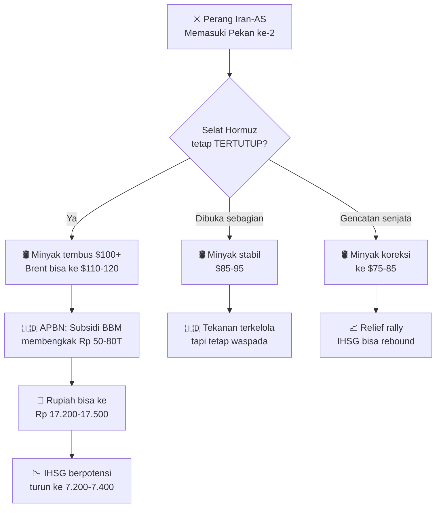

# 🗞️ Daily Brief — Minggu, 8 Maret 2026

> Perang Iran-AS memasuki pekan kedua — fasilitas minyak Tehran dihantam, Dubai keluarkan peringatan darurat. DOGE pakai ChatGPT untuk membabat hibah seni & humaniora. TNI siaga 1. Danantara gelontorkan Rp 16 T untuk hunian MBR di Meikarta.

---

## ⚔️ Perang Iran — Update Terkini

### 1. Serangan AS-Israel Hantam Fasilitas Minyak Tehran 🔥

Serangan udara pada hari Sabtu (7/3) menghantam **empat fasilitas penyimpanan minyak** dan satu pusat transfer minyak di Tehran dan Alborz. Ini pertama kalinya fasilitas industri sipil menjadi sasaran langsung. Asap hitam tebal menyelimuti langit Tehran pada Minggu pagi, dan bau terbakar menyengat udara ibu kota Iran.

Setidaknya **4 pengemudi tanker tewas** dalam serangan tersebut. Israel menyatakan bahwa mereka menyerang "fasilitas penyimpanan bahan bakar di Tehran" yang digunakan untuk "mengoperasikan infrastruktur militer." Media negara Iran menyebutnya sebagai "serangan dari AS dan rezim Zionis."

🔗 [Al Jazeera — Tehran Oil Strikes](https://www.aljazeera.com/where/iran/)

---

### 2. Iran Serang Pangkalan Udara AS di UEA — Dubai Keluarkan Peringatan Darurat ⚠️

Iran pada Sabtu mengatakan telah menyerang **pangkalan udara Al Dhafra** di selatan Abu Dhabi. Kementerian Pertahanan UEA mendeteksi 121 drone dan berhasil mencegat 119 — **2 jatuh di wilayah UEA**.

Dubai mengeluarkan **peringatan darurat**: penduduk diminta segera mencari perlindungan di gedung aman, menjauhi jendela dan area terbuka. Beberapa ledakan terdengar di Dubai pada Sabtu pagi. Penumpang di Bandara Internasional Dubai diarahkan ke terowongan kereta api.

<Callout type="warning" title="Kawasan Teluk dalam Ancaman">
Iran menargetkan radar dan pertahanan udara di Qatar, UEA, Yordania, Bahrain, Kuwait, dan Arab Saudi. Arab Saudi mencegat 2 rudal balistik yang diarahkan ke Pangkalan Udara Pangeran Sultan (pangkalan USAF aktif).
</Callout>

🔗 [Katadata — Perang Iran Pekan Kedua](https://katadata.co.id/berita/internasional/69ad02f1594eb/perang-iran-vs-as-dan-israel-memasuki-pekan-kedua-teheran-ogah-menyerah)

---

### 3. Presiden Iran: "Kami Tidak Akan Menyerah Tanpa Syarat" 🇮🇷

Presiden Iran **Masoud Pezeshkian** menyampaikan permintaan maaf kepada negara-negara tetangga — mengatakan Iran tidak bermaksud menyerang negara lain. Namun menanggapi tuntutan "penyerahan tanpa syarat" dari Trump, Pezeshkian menegaskan:

> *"AS dapat membawa mimpinya itu ke liang kubur. Kami tidak akan menyerah tanpa syarat."*

Trump membalas di Truth Social: *"Iran, yang sedang dipukuli habis-habisan, telah meminta maaf dan menyerah kepada negara-negara tetangganya... Hari ini Iran akan dihantam dengan sangat keras!"*

Permintaan maaf Pezeshkian memicu **penolakan internal** dari garis keras Garda Revolusi. Ulama garis keras Hamid Rasai mengkritik keras: *"Sikap Anda tidak profesional, lemah, dan tidak dapat diterima."*

🔗 [Katadata — Perang Iran](https://katadata.co.id/berita/internasional/69ad02f1594eb/perang-iran-vs-as-dan-israel-memasuki-pekan-kedua-teheran-ogah-menyerah)

---

## 🤖 AI & Teknologi

### 4. DOGE Pakai ChatGPT untuk Membabat Hibah Seni & Humaniora AS 🤦

*Department of Government Efficiency* (DOGE) — agensi Elon Musk yang sudah dibubarkan — ternyata menggunakan **prompt ChatGPT** untuk memutuskan hibah mana yang harus dibatalkan di *National Endowment for the Humanities* (NEH).

Menurut laporan *New York Times*, alih-alih menganalisis proyek secara cermat, mereka menarik ringkasan singkat dari internet dan memasukkannya ke ChatGPT dengan prompt sederhana:

> *"Does the following relate at all to D.E.I.? Respond factually in less than 120 characters. Begin with 'Yes' or 'No.'"*

Hasilnya **asal-asalan dan kadang absurd** — hibah untuk riset sejarah yang tidak ada hubungannya dengan DEI ikut dibatalkan.

🔗 [The Verge — DOGE ChatGPT NEH](https://www.theverge.com/ai-artificial-intelligence)

---

### 5. Kepala Robotika OpenAI Mundur karena Kontrak Pentagon ⚡

**Caitlin Kalinowski**, kepala divisi robotika OpenAI, mengundurkan diri karena kontrak perusahaan dengan Pentagon. Dia menyatakan bahwa kontrak tersebut "tidak cukup melindungi orang Amerika dari pengawasan tanpa surat perintah" dan bahwa memberikan AI "otonomi mematikan tanpa otorisasi manusia" adalah garis yang **"layak mendapat deliberasi lebih."**

🔗 [The Verge — OpenAI Robotics Head Resigns](https://www.theverge.com/ai-artificial-intelligence)

---

### 6. Anthropic Makin Booming Meski Dicap "Risiko Rantai Pasok" oleh Pentagon 📈

Designasi "supply-chain risk" dari Department of War AS terhadap Anthropic justru **berdampak terbalik** — permintaan Claude meledak. Claude memecahkan **rekor signup harian** dan menduduki **#1 App Store** di 40+ negara termasuk AS, Kanada, dan sebagian besar Eropa.

CEO Dario Amodei dalam memo internal: hubungan dengan pemerintah memburuk karena *"kami tidak berdonasi ke Trump"* dan *"kami tidak memberikan pujian bergaya diktator kepada Trump."*

Sementara itu, kontraktor pertahanan AS mulai **meninggalkan Claude** secara preventif — pivot dari Anthropic ke OpenAI demi menjaga kontrak militer.

🔗 [The Verge — Anthropic Booming](https://www.theverge.com/ai-artificial-intelligence)

---

### 7. AI Wikipedia Menambahkan Sumber yang Dihalusinasi 👻

Non-profit *Open Knowledge Association* menggunakan AI untuk menerjemahkan artikel Wikipedia — menghasilkan **halusinasi** berupa sumber yang salah, fabrikasi, dan tidak relevan. Editor Wikipedia kini menempatkan pembatasan terhadap penerjemah OKA, termasuk pemblokiran jika terlalu banyak kontribusi bermasalah.

🔗 [The Verge — AI Wikipedia Hallucinations](https://www.theverge.com/ai-artificial-intelligence)

---

### 8. Benchmark MacBook Neo Terungkap — Setara iPhone 16 Pro 💻

Hasil Geekbench pertama untuk **MacBook Neo** (laptop termurah Apple dengan chip A18 Pro):
- **Single-core:** 3.461 — setara iPhone 16 Pro (3.445)
- **Multi-core:** 8.668 — setara MacBook Air M1 (8.342)
- **Metal (GPU):** 31.286 — setara iPhone 16 Pro (32.575)

Secara performa multi-core, laptop seharga ~Rp 10 jutaan ini kurang lebih setara dengan MacBook Air M1 yang dirilis 2020.

🔗 [Kompas Tekno — MacBook Neo Benchmark](https://tekno.kompas.com/read/2026/03/08/19030087/skor-benchmark-laptop-macbook-neo-terungkap-setara-iphone-tapi-juga-macbook-air)

---

## 🇮🇩 Indonesia

### 9. TNI Siaga 1 di Tengah Perang Iran-AS 🇮🇩

Panglima TNI Jenderal **Agus Subiyanto** dilaporkan memerintahkan siaga 1 kepada seluruh jajaran TNI melalui surat telegram bertanggal 1 Maret 2026. Perintah mencakup:

- Menyiagakan personel dan alutsista
- Melaksanakan patroli di **objek vital strategis** — bandara, pelabuhan, stasiun kereta, terminal bus, kantor PLN
- Mengantisipasi perkembangan lingkungan strategis internasional

Wakil Ketua Komisi I DPR **Dave Laksono** menyebut ini mencerminkan "komitmen kuat dalam menjaga keamanan nasional."

🔗 [Katadata — TNI Siaga 1](https://katadata.co.id/berita/nasional/69ad2aab1dde9/mabes-tni-buka-suara-soal-perintah-status-siaga-1-di-tengah-perang-iran-as)

---

### 10. Danantara Siapkan Rp 16 Triliun untuk Bangun 140 Ribu Unit Hunian MBR di Meikarta 🏠

**Danantara Indonesia** (badan pengelola investasi negara) akan menggelontorkan Rp 14-16 triliun untuk membangun hunian MBR di **Meikarta, Cikarang** — di atas lahan 30 hektar yang dihibahkan Grup Lippo secara cuma-cuma (bernilai hingga Rp 6 triliun).

Rencana: **18 menara, 32 lantai**, total 140 ribu unit secara bertahap. CEO Rosan Roeslani menyebut ini "langkah bersejarah" karena pembangunan perumahan dalam skala besar dilakukan dalam satu proyek dan satu lokasi.

<Callout type="info" title="Konteks">
Pemerintah menargetkan **3 juta rumah per tahun** sebagai prioritas Presiden Prabowo. Data pemerintah: 9-15 juta keluarga masih menunggu akses hunian layak, dan 27 juta keluarga tinggal di gubuk-gubuk yang "sebetulnya bukan rumah."
</Callout>

🔗 [Katadata — Danantara Meikarta](https://katadata.co.id/finansial/bursa/69ad78a00319d/danantara-siapkan-rp-16-t-untuk-bangun-hunian-mbr-di-meikarta)

---

### 11. Grup Lippo Hibahkan Lahan 30 Hektar untuk Program Perumahan Rakyat

Pemerintah resmi menerima hibah lahan 30 hektar dari **Grup Lippo** di Cikarang. Peninjauan dihadiri Hashim Djojohadikusumo (Ketua Satgas Perumahan), Menteri PKP Maruarar Sirait, CEO Danantara Rosan Roeslani, dan pendiri Grup Lippo **Mochtar Riady** dan **James Riady**.

🔗 [Katadata — Lippo Hibah Lahan](https://katadata.co.id/finansial/bursa/69ad68630b061/grup-lippo-sumbang-lahan-30-hektar-di-cikarang-untuk-bangun-rumah-mbr)

---

## 💹 Pasar & Ekonomi Dunia

### Bursa Global — Pekan Berdarah di Tengah Perang ⚔️📉

| Indeks | Harga | Perubahan | % | Keterangan |
|--------|------:|----------:|--:|------------|
| 🇺🇸 S&P 500 | 6.740 | -90,69 | -1,33% | Turun 3 hari berturut-turut |
| 🇺🇸 Dow Jones | 47.502 | -453,19 | -0,95% | Tekanan sektor energi & pertahanan |
| 🇺🇸 Nasdaq | 22.388 | -361,31 | -1,59% | Tech sell-off berlanjut |
| 🇺🇸 Russell 2000 | 2.525 | -60,27 | -2,33% | Small-cap paling terpukul |
| 🇯🇵 Nikkei 225 | 55.621 | +342,78 | +0,62% | Rebound ringan (yen melemah) |
| 🇨🇳 Shanghai (SSE) | 4.124 | +15,63 | +0,38% | Stimulus Beijing masih menopang |
| 🇭🇰 Hang Seng | 25.757 | +435,95 | +1,72% | Tech China rally |
| 🇮🇳 SENSEX | 78.919 | -1.097 | -1,37% | Capital outflow asing |
| 🇮🇩 **IHSG** | **7.586** | **-124,85** | **-1,62%** | **Fitch outlook cut + perang Iran** |

<Callout type="warning" title="🇮🇩 IHSG dalam Tekanan Berat">
IHSG ditutup di **7.586** — turun -1,62% dan menyentuh level terendah dalam hampir setahun. Dua pukulan sekaligus:

1. **Fitch Ratings** memangkas outlook Indonesia — kekhawatiran fiskal terkait belanja MBG dan risiko harga minyak tinggi
2. **Perang Iran-AS** memperburuk sentimen risk-off global, mendorong capital flight dari emerging market

Trading Economics melaporkan: *"Indonesia Equities Under Pressure After Fitch Outlook Cut"*

**Year range:** 5.882 – 9.174 → IHSG kini hanya **17% di atas titik terendah** 1 tahun terakhir.
</Callout>

---

### Komoditas — Minyak Meledak, Emas All-Time High 🛢️🥇

| Komoditas | Harga | Perubahan Harian | % Bulanan | Keterangan |
|-----------|------:|---------:|----------:|------------|
| 🛢️ **Crude Oil (WTI)** | **$90,90/bbl** | **+$9,89 (+12,2%)** | +41,2% | 🔴 Meledak — Selat Hormuz tertutup |
| 🛢️ **Brent** | **$92,69/bbl** | **+$7,28 (+8,5%)** | +34,3% | Mendekati $100 |
| 🥇 **Emas** | **$5.158/oz** | +$74,70 (+1,5%) | +2,0% | All-time high — safe haven |
| 🥈 Perak | $84,33/oz | +$2,06 (+2,5%) | +1,2% | Ikut naik bersama emas |
| ⛽ Gasoline | $2,77/gal | +$0,13 (+5,0%) | +39,3% | BBM global melonjak |
| 🔥 Heating Oil | $3,62/gal | +$0,004 | +49,7% | Naik hampir 50% sebulan |
| 🌾 Gandum | 608 ¢/bu | +25,5 (+4,4%) | +15,0% | Supply chain Laut Hitam terganggu |
| 🌴 **CPO (Sawit)** | **MYR 4.375/T** | **+MYR 157 (+3,7%)** | +5,4% | ✅ Positif untuk Indonesia |
| ☕ Kopi | 294 ¢/lb | +5,35 (+1,9%) | +0,1% | Stabil tinggi |

<Callout type="danger" title="🛢️ Minyak Mendekati $100 — Red Alert untuk Indonesia">
**Crude Oil WTI melonjak +12,2% dalam SATU HARI** — kenaikan harian terbesar sejak invasi Rusia ke Ukraina 2022. Brent kini di $92,69.

**Dampak untuk Indonesia:**
- Indonesia = **net importer minyak** → setiap kenaikan $10/bbl minyak = tekanan ~Rp 25-30T pada APBN
- Subsidi BBM bisa membengkak drastis
- BI menyiratkan kemungkinan pangkas belanja MBG jika minyak tembus **$92/bbl** → kita sudah di ambang batas
- Rupiah tertekan karena kebutuhan dolar untuk impor minyak meningkat
</Callout>

---

### Mata Uang — Dolar Menguat, Rupiah Tertekan 💱

| Pasangan | Kurs | Perubahan | Keterangan |
|----------|-----:|----------:|------------|
| 🇺🇸/🇮🇩 **USD/IDR** | **Rp 16.949** | +29 (+0,17%) | Rupiah melemah — tekanan minyak + Fitch |
| 🇬🇧/🇮🇩 GBP/IDR | Rp 22.699 | +97 (+0,43%) | |
| 🇺🇸/🇯🇵 USD/JPY | 157,78 | -0,01 | Yen relatif stabil |
| 🇪🇺/🇺🇸 EUR/USD | 1,1578 | -0,004 (-0,34%) | Euro melemah vs dolar |

---

### Kripto — Bitcoin Tertekan Risk-Off 🪙

| Kripto | Harga | Perubahan | Keterangan |
|--------|------:|----------:|------------|
| ₿ Bitcoin | $66.993 | -$279 (-0,42%) | Risk-off, bukan safe haven |
| Ξ Ethereum | $1.934 | -$35 (-1,78%) | Ikut turun |
| XRP | $1,34 | -$0,013 (-0,92%) | |
| BNB | $613 | -$6,95 (-1,12%) | |
| DOGE | $0,089 | -$0,001 (-1,09%) | |

---

## 🔮 Prediksi & Outlook Ke Depan

### Skenario Jangka Pendek (1-2 Minggu)

### Faktor-Faktor Kunci yang Perlu Diamati 🔍

**🔴 Risiko Negatif:**
1. **Selat Hormuz** — Jika tetap tertutup, harga minyak bisa menembus $100-120/bbl, memicu krisis energi global
2. **Fitch downgrade actual** — Jika outlook negatif berujung downgrade rating, asing akan semakin agresif jual aset Indonesia
3. **Eskalasi perang ke negara Teluk lain** — Dubai dan Arab Saudi sudah terkena serangan, eskalasi lebih lanjut bisa memicu kepanikan global
4. **Tarif Trump baru** — 10% tarif global yang baru diberlakukan menambah tekanan pada perdagangan
5. **Capital flight emerging market** — Kombinasi minyak tinggi + dolar menguat = tekanan ganda untuk Rupiah

**🟢 Potensi Positif:**
1. **CPO (sawit) naik +3,7%** — Indonesia sebagai eksportir CPO terbesar dunia diuntungkan. Jika minyak tetap tinggi, CPO sebagai substitusi akan terus naik
2. **Emas menembus $5.158** — Indonesia punya cadangan emas (Freeport/ANTM) yang nilainya melonjak
3. **China masih stimulus** — Shanghai +0,38%, Hang Seng +1,72%, artinya demand dari China untuk komoditas Indonesia masih terjaga
4. **Gencatan senjata** — Jika Iran dan AS mencapai kesepakatan, relief rally bisa sangat signifikan
5. **Nickel stabil di $17.450** — Positif untuk industri nikel Indonesia

### Prediksi IHSG Pekan Depan 📊

| Skenario | Probabilitas | Target IHSG | Katalis |
|----------|:----------:|:-----------:|---------|
| 🔴 Bearish | 45% | 7.200 – 7.400 | Hormuz tertutup, minyak >$100, asing jual |
| 🟡 Sideways | 35% | 7.400 – 7.700 | Perang terkendali, minyak stabil $90-an |
| 🟢 Bullish | 20% | 7.700 – 7.900 | Gencatan senjata, relief rally |

<Callout type="important" title="💡 Strategi untuk Investor Indonesia">

**Jangka pendek (1-2 minggu):**
- ⚠️ **Defensif** — Hindari panic selling, tapi juga jangan agresif beli
- 🛢️ **Perhatikan saham energi** — PGAS, MEDC, AKRA bisa diuntungkan dari minyak tinggi
- 🥇 **Emas sebagai hedge** — ANTM, emas fisik, atau ETF emas sebagai pelindung portofolio
- 🌴 **CPO plays** — AALI, LSIP, TBLA bisa naik mengikuti harga sawit

**Jangka menengah (1-3 bulan):**
- Jika IHSG turun ke 7.200-an, ini bisa menjadi **area akumulasi** untuk saham-saham blue chip (BBCA, BBRI, TLKM) yang sudah tertekan jauh dari puncaknya
- Perhatikan kebijakan BI — jika Rupiah terus melemah, ada kemungkinan BI menaikkan suku bunga yang akan menekan saham lebih lanjut

*Disclaimer: Ini bukan nasihat investasi. Selalu lakukan riset sendiri dan konsultasi dengan penasihat keuangan profesional.*
</Callout>

---

## 📊 Ringkasan Angka Penting Hari Ini

| Indikator | Status | Keterangan |
|-----------|--------|------------|
| Perang Iran-AS | 🔴 Pekan ke-2 | Fasilitas minyak Tehran dihantam |
| Selat Hormuz | 🔴 Tertutup | IRGC klaim "kendali penuh" |
| Dubai | ⚠️ Peringatan darurat | 2 drone Iran jatuh di UEA |
| 🛢️ Crude Oil | 🔴 $90,90 (+12,2%) | Kenaikan harian terbesar sejak 2022 |
| 🥇 Emas | 🟢 $5.158 ATH | All-time high, safe haven |
| 🇮🇩 IHSG | 🔴 7.586 (-1,62%) | Terendah hampir 1 tahun |
| 🇮🇩 Rupiah | 🟡 Rp 16.949 | Melemah tipis vs dolar |
| 🇺🇸 S&P 500 | 🔴 6.740 (-1,33%) | Wall Street merah |
| ₿ Bitcoin | 🟡 $66.993 (-0,42%) | Tidak jadi safe haven |
| Claude (Anthropic) | 📈 Rekor signup | #1 App Store di 40+ negara |
| TNI Indonesia | 🟡 Siaga 1 | Patroli objek vital strategis |
| Danantara | 💰 Rp 16 T | 140 ribu unit hunian MBR |

---

## 🔖 Tautan Referensi Lengkap

- https://www.aljazeera.com/where/iran/
- https://katadata.co.id/berita/internasional/69ad02f1594eb/perang-iran-vs-as-dan-israel-memasuki-pekan-kedua-teheran-ogah-menyerah
- https://katadata.co.id/berita/nasional/69ad2aab1dde9/mabes-tni-buka-suara-soal-perintah-status-siaga-1-di-tengah-perang-iran-as
- https://katadata.co.id/finansial/bursa/69ad78a00319d/danantara-siapkan-rp-16-t-untuk-bangun-hunian-mbr-di-meikarta
- https://katadata.co.id/finansial/bursa/69ad68630b061/grup-lippo-sumbang-lahan-30-hektar-di-cikarang-untuk-bangun-rumah-mbr
- https://tekno.kompas.com/read/2026/03/08/19030087/skor-benchmark-laptop-macbook-neo-terungkap-setara-iphone-tapi-juga-macbook-air
- https://www.theverge.com/ai-artificial-intelligence
