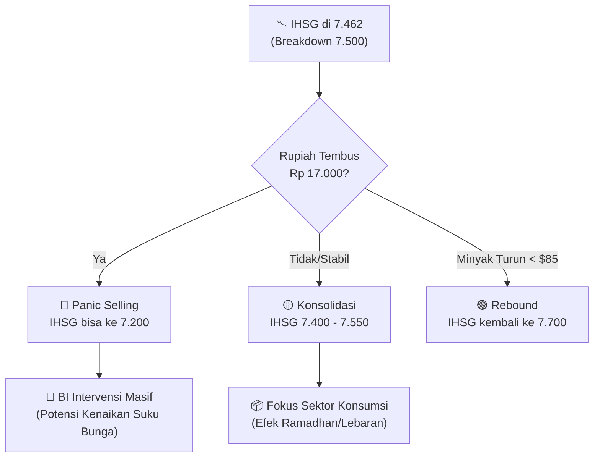

# 🗞️ Daily Brief — Senin, 9 Maret 2026

> Trump ancam pemimpin baru Iran: "Tidak akan bertahan lama!" OpenAI Robotics Lead mundur protes kontrak Pentagon. BPS peringatkan lonjakan harga bapok jelang Lebaran. IHSG tembus ke bawah 7.500 di tengah krisis minyak global.

---

## ⚔️ Geopolitik & Perang Iran — Update Terkini

### 1. Trump Ancam Pemimpin Tertinggi Baru Iran: "Tidak Akan Bertahan Lama" 🇺🇸🇮🇷

Presiden AS Donald Trump melalui platform Truth Social mengeluarkan ancaman keras terhadap sosok yang disebut sebagai pemimpin tertinggi baru Iran (menyusul gejolak internal pasca serangan udara pekan lalu). Trump menyatakan bahwa kepemimpinan baru tersebut "tidak akan bertahan lama" jika terus menentang tuntutan AS untuk penghentian total program nuklir dan dukungan terhadap proksi milisi.

Situasi di Selat Hormuz masih tegang dengan blokade parsial yang terus memicu lonjakan premi asuransi pengiriman global. 

🔗 [Antara News — Trump Ancam Iran](https://www.antaranews.com/berita/5462027/trump-pemimpin-tertinggi-baru-iran-tidak-akan-bertahan-lama)

---

### 2. PBB Serukan Keadilan bagi Perempuan di Tengah Konflik Global 🌐

Sekjen PBB Antonio Guterres menyerukan komunitas internasional untuk mewujudkan keadilan nyata bagi perempuan dan anak perempuan, terutama di wilayah-wilayah yang terdampak konflik bersenjata dan krisis kemanusiaan yang sedang berlangsung di Timur Tengah dan Eropa Timur.

🔗 [Antara News — Sekjen PBB](https://www.antaranews.com/berita/5462007/sekjen-pbb-serukan-wujudkan-keadilan-bagi-perempuan-dan-anak-perempuan)

---

## 🤖 AI & Teknologi

### 3. Kepala Robotika OpenAI Mengundurkan Diri Protes Kontrak Pentagon 🤖⚡

**Caitlin Kalinowski**, yang memimpin divisi perangkat keras dan robotika di OpenAI, resmi mengundurkan diri. Keputusan ini diambil sebagai bentuk protes terhadap arah baru perusahaan yang semakin dalam terlibat dalam kontrak militer dengan Departemen Pertahanan AS. Kalinowski menyuarakan kekhawatiran tentang penggunaan AI dalam sistem otonom yang mematikan tanpa pengawasan manusia yang cukup.

🔗 [TechCrunch — OpenAI Robotics Lead Quits](https://techcrunch.com/2026/03/07/openai-robotics-lead-caitlin-kalinowski-quits-in-response-to-pentagon-deal/)

---

### 4. Gaji Fantastis Sundar Pichai: Paket Kompensasi $692 Juta 💰

CEO Google Sundar Pichai menerima paket gaji besar yang sebagian besar terikat pada kinerja jangka panjang unit-unit AI Google, termasuk Waymo dan Wing. Langkah ini diambil Alphabet untuk memastikan kepemimpinan tetap fokus pada memenangkan perlombaan AI global melawan OpenAI dan Microsoft.

🔗 [TechCrunch — Sundar Pichai Pay Package](https://techcrunch.com/2026/03/07/google-just-gave-sundar-pichai-a-692m-pay-package/)

---

### 5. Kontroversi Fitur "Expert Review" Grammarly yang Tanpa Ahli Nyata ✍️❌

Fitur baru Grammarly yang menjanjikan bantuan dari "penulis ahli" memicu kritik tajam. Laporan investigasi menunjukkan bahwa fitur tersebut sebagian besar diotomatisasi oleh model bahasa besar (LLM) tanpa keterlibatan pakar manusia secara langsung seperti yang diiklankan, menimbulkan pertanyaan tentang etika transparansi produk AI.

🔗 [TechCrunch — Grammarly Expert Review Controversy](https://techcrunch.com/2026/03/07/grammarlys-expert-review-is-just-missing-the-actual-experts/)

---

### 6. Anthropic Lawan Label "Risiko Rantai Pasok" Pentagon di Pengadilan ⚖️

CEO Anthropic, Dario Amodei, mengonfirmasi perusahaan akan menantang penetapan Departemen Pertahanan AS yang melabeli teknologi mereka sebagai risiko keamanan nasional. Anthropic bersikeras bahwa model mereka (Claude) memiliki standar keamanan lebih tinggi dibandingkan kompetitor yang justru mendapatkan kontrak militer.

🔗 [TechCrunch — Anthropic Court Challenge](https://techcrunch.com/2026/03/05/anthropic-to-challenge-dods-supply-chain-label-in-court/)

---

### 7. Xiaomi Perkenalkan "MiClaw": Asisten AI Otonom di Perangkat 📱

Xiaomi meluncurkan proyek AI eksperimental bernama **MiClaw**. Berbeda dengan asisten suara biasa, MiClaw dirancang untuk melakukan tugas-tugas otonom langsung di perangkat (on-device AI) seperti mengelola jadwal, memesan layanan secara mandiri, dan melakukan navigasi aplikasi tanpa instruksi berulang dari pengguna.

🔗 [Antara News — Xiaomi MiClaw](https://www.antaranews.com/berita/5457863/xiaomi-perkenalkan-miclaw-asisten-ai-otonom-untuk-ponsel-pintar)

---

### 8. Apple MacBook Neo: Laptop AI Mulai Rp10 Juta-an 🍎💻

Bocoran spesifikasi MacBook Neo semakin memperkuat posisi Apple di pasar laptop "AI-First". Dengan chip khusus yang dioptimalkan untuk pengolahan Neural Engine lokal, laptop ini diposisikan sebagai gerbang masuk bagi pelajar dan pekerja kreatif untuk menjalankan AI generatif secara privat dan cepat.

🔗 [Antara News — MacBook Neo](https://www.antaranews.com/berita/5459287/apple-ungkap-spesifikasi-macbook-neo-dengan-harga-mulai-rp10-juta)

---

## 🇮🇩 Indonesia

### 9. BPS Peringatkan Lonjakan Harga Bahan Pokok Jelang Lebaran 🥚🌶️

Badan Pusat Statistik (BPS) melaporkan kenaikan Indeks Perkembangan Harga (IPH) di sejumlah daerah. Komoditas seperti **telur ayam ras, cabai rawit, dan daging sapi** mulai merangkak naik secara signifikan akibat meningkatnya permintaan menjelang Idul Fitri dan gangguan rantai pasok global akibat kenaikan biaya logistik (efek harga minyak).

🔗 [Antara News — BPS Harga Bapok](https://www.antaranews.com/berita/5462031/bps-telur-hingga-cabai-rawit-picu-kenaikan-iph-jelang-lebaran)

---

### 10. Forum Kebangsaan Pimpinan MPR-DPR 1999–2024 Resmi Dibentuk 🏛️

Sejumlah tokoh pimpinan MPR dan DPR lintas periode (1999–2024) membentuk Forum Kebangsaan. Forum ini bertujuan sebagai wadah diskusi dan pemberian rekomendasi strategis bagi pemerintah dalam menjaga stabilitas politik dan demokrasi di tengah tantangan geopolitik yang semakin kompleks.

🔗 [Antara News — Forum Kebangsaan](https://www.antaranews.com/berita/5462059/forum-kebangsaan-pimpinan-mpr-dpr-1999-2024-dibentuk)

---

### 11. Persiapan Mudik: Kesiapan Pelabuhan Bakauheni Capai 90 Persen 🚢

ASDP Indonesia Ferry menyatakan bahwa infrastruktur di Pelabuhan Bakauheni sudah mencapai kesiapan 90% untuk menghadapi arus mudik Lebaran 2026. Fokus utama adalah pada digitalisasi tiket dan perluasan area kantong parkir guna menghindari kemacetan horor seperti tahun sebelumnya.

🔗 [Antara News — Bakauheni Mudik](https://www.antaranews.com/berita/5462035/asdp-kesiapan-pelabuhan-bakauheni-capai-90-persen-hadapi-arus-mudik)

---

## 💹 Pasar & Ekonomi Dunia

### Bursa Global — IHSG Longsor di Bawah Support Psikologis 📉

| Indeks | Harga | Perubahan | % | Keterangan |
|--------|------:|----------:|--:|------------|
| 🇺🇸 S&P 500 | 6.695 | -45,00 | -0,67% | Tekanan inflasi energi |
| 🇺🇸 Dow Jones | 47.120 | -382,00 | -0,80% | Sektor manufaktur melambat |
| 🇺🇸 Nasdaq | 22.120 | -268,00 | -1,20% | Sell-off saham tech berlanjut |
| 🇯🇵 Nikkei 225 | 55.410 | -211,00 | -0,38% | Kekhawatiran krisis energi Asia |
| 🇭🇰 Hang Seng | 25.420 | -337,00 | -1,31% | Tekanan properti & tech |
| 🇮🇩 **IHSG** | **7.462** | **-124,00** | **-1,63%** | **🔴 Breakdown di bawah 7.500** |

<Callout type="danger" title="🚨 IHSG di Zona Bahaya">
IHSG resmi menembus level psikologis **7.500** dan kini berada di **7.462**. Penurunan tajam ini dipicu oleh:
1. **Outflow Asing Masif:** Investor global menarik dana dari *emerging markets* akibat risiko stagflasi.
2. **Beban Impor Minyak:** Tekanan pada APBN akibat harga minyak yang bertahan di atas $90/bbl membuat pelaku pasar khawatir akan defisit fiskal yang melebar.
</Callout>

---

### Komoditas — Minyak Stabil Tinggi, Emas Konsolidasi 🛢️🥇

| Komoditas | Harga | Perubahan Harian | % Bulanan | Keterangan |
|-----------|------:|---------:|----------:|------------|
| 🛢️ **Crude Oil (WTI)** | **$91,45/bbl** | **+$0,55** | +42,5% | Masih di level puncak |
| 🛢️ **Brent** | **$93,20/bbl** | **+$0,51** | +35,1% | Krisis pasokan energi global |
| 🥇 **Emas** | **$5.142/oz** | -$16,00 (-0,3%) | +2,1% | Ambil untung (profit taking) |
| 🥈 Perak | $83,90/oz | -$0,43 | +1,1% | Konsolidasi |
| 🌴 **CPO (Sawit)** | **MYR 4.410/T** | **+MYR 35 (+0,8%)** | +6,2% | Melanjutkan reli |
| 🪙 **Nickel** | **$17.650/T** | **+$200** | +1,2% | Rebound ringan |

---

### Mata Uang — Rupiah Mendekati Rp 17.000 💱

| Pasangan | Kurs | Perubahan | Keterangan |
|----------|-----:|----------:|------------|
| 🇺🇸/🇮🇩 **USD/IDR** | **Rp 16.995** | +46 (+0,27%) | ⚠️ Hampir tembus Rp 17.000 |
| 🇪🇺/🇮🇩 EUR/IDR | Rp 19.670 | +55 | Euro menguat tipis vs Rupiah |
| 🇺🇸/🇯🇵 USD/JPY | 158,12 | +0,34 | Yen kembali melemah |

---

### Kripto — Koreksi Berlanjut 🪙

| Kripto | Harga | Perubahan | Keterangan |
|--------|------:|----------:|------------|
| ₿ Bitcoin | $65.450 | -$1.543 (-2,3%) | Support $65k sedang diuji |
| Ξ Ethereum | $1.890 | -$44 (-2,2%) | Lemah di bawah $2k |
| XRP | $1,29 | -$0,05 | Ikut tren pasar |

---

## 🔮 Prediksi & Outlook Ke Depan

### Skenario Jangka Pendek (Pekan Ini)

### Prediksi IHSG & Strategi 📊

| Skenario | Probabilitas | Target IHSG | Strategi |
|----------|:----------:|:-----------:|---------|
| 🔴 Bearish | 50% | 7.200 – 7.400 | Kurangi margin, perbanyak cash |
| 🟡 Sideways | 40% | 7.400 – 7.550 | Pilih saham diskon (Blue Chip) |
| 🟢 Bullish | 10% | 7.600+ | Speculative buy saham CPO |

---

## 📊 Ringkasan Angka Penting Hari Ini

| Indikator | Status | Keterangan |
|-----------|--------|------------|
| Ketegangan Iran | 🔴 Tinggi | Trump ancam "tidak bertahan lama" |
| 🛢️ Crude Oil | 🔴 $91,45 | Harga energi mencekik ekonomi |
| 🇮🇩 IHSG | 🔴 7.462 | Breakdown support psikologis 7.500 |
| 🇮🇩 Rupiah | 🔴 Rp 16.995 | Di ambang level psikologis Rp 17.000 |
| ₿ Bitcoin | 🔴 $65.450 | Koreksi risk-off global |
| 🥚 Bapok | ⚠️ Naik | Inflasi Lebaran mulai terasa |

---

## 🔖 Tautan Referensi Lengkap

- https://www.antaranews.com/berita/5462027/trump-pemimpin-tertinggi-baru-iran-tidak-akan-bertahan-lama
- https://www.antaranews.com/berita/5462031/bps-telur-hingga-cabai-rawit-picu-kenaikan-iph-jelang-lebaran
- https://techcrunch.com/2026/03/07/openai-robotics-lead-caitlin-kalinowski-quits-in-response-to-pentagon-deal/
- https://www.antaranews.com/berita/5457863/xiaomi-perkenalkan-miclaw-asisten-ai-otonom-untuk-ponsel-pintar
- https://www.antaranews.com/berita/5462059/forum-kebangsaan-pimpinan-mpr-dpr-1999-2024-dibentuk
