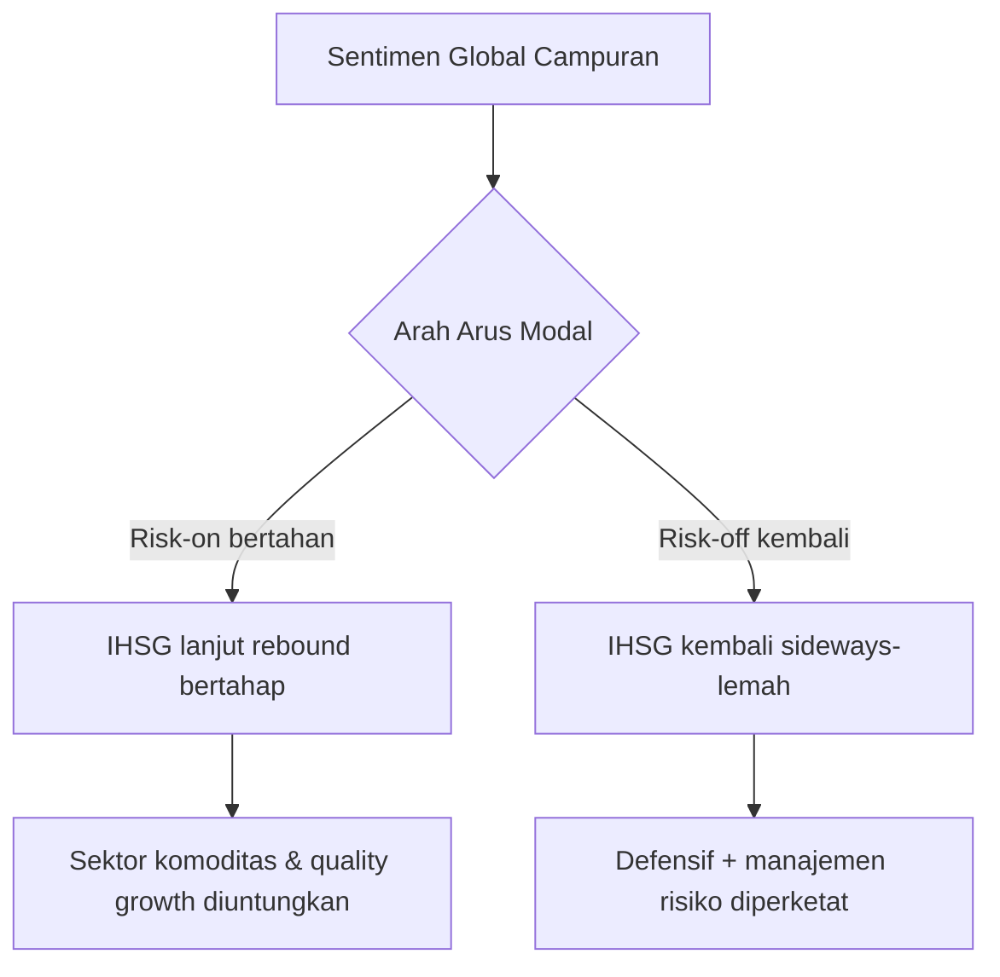

# 🗞️ Daily Brief — Selasa, 10 Maret 2026 (Update Siang)

> **Update terkini (per siang WIB):** AI enterprise bergerak cepat ke area *security + agentic workflow*, sementara pasar global tetap volatil karena kombinasi geopolitik, suku bunga, dan rotasi aset risiko.

---

## ⚔️ Geopolitik / Konflik

### 1) Narasi keamanan nasional dan AI makin keras di AS 🇺🇸

Perdebatan penggunaan AI untuk kepentingan pertahanan makin tajam, termasuk gesekan regulator–vendor AI. Ini penting karena arah kebijakan pertahanan AS berpotensi membentuk standar global adopsi AI di sektor publik dan militer.

### 2) Ketidakpastian global tetap menahan risk appetite 🌍

Pasar masih sensitif terhadap headline konflik dan energi. Implikasinya: arus modal ke negara berkembang cenderung selektif, membuat aset berisiko mudah berfluktuasi intraday.

---

## 🤖 AI & Teknologi (Berita Terkini)

### 3) Kemdiktisaintek perkuat kolaborasi talenta digital Indonesia 🎓

Berita terbaru dari ANTARA (puluhan menit lalu) menegaskan fokus pemerintah pada penguatan talenta digital/AI lewat kerja sama internasional. Ini sinyal strategis bahwa bottleneck utama Indonesia masih di kualitas SDM, bukan sekadar akses tools.

🔗 https://www.antaranews.com/tag/kecerdasan-buatan

### 4) Anthropic gugat Departemen Pertahanan AS ⚖️

Isu ini menegaskan bahwa persaingan model frontier kini bukan cuma soal performa, tapi juga soal akses pasar pemerintah, kepatuhan, dan risiko rantai pasok teknologi.

🔗 https://www.antaranews.com/tag/kecerdasan-buatan  
🔗 https://www.anthropic.com/news

### 5) OpenAI akan akuisisi Promptfoo (AI security) 🔐

Akuisisi ini memperlihatkan pergeseran prioritas industri: dari “siapa paling canggih menjawab prompt” ke “siapa paling aman dipakai di produksi enterprise.”

🔗 https://www.theverge.com/ai-artificial-intelligence

### 6) Anthropic rilis Claude Code “Code Review” (multi-agent) 👨‍💻

Tool ini dirancang untuk menangkap bug yang sering lolos dari review manusia. Dampaknya besar untuk tim engineering: QA jadi lebih paralel, cepat, dan terstruktur.

🔗 https://www.theverge.com/ai-artificial-intelligence

### 7) Microsoft uji integrasi Claude Cowork di Copilot 🧩

Arah produk AI makin jelas menuju *long-running, multi-step tasks*. Ini transisi dari assistant pasif ke rekan kerja digital semi-otonom.

🔗 https://www.theverge.com/ai-artificial-intelligence

### 8) Qualcomm dorong edge AI robotik lewat Ventuno Q (40 TOPS NPU) 🤖

Pergerakan ini memperkuat tren on-device/edge intelligence. Ke depan, use case AI industri akan makin banyak diproses lokal untuk latensi rendah dan privasi lebih baik.

🔗 https://www.theverge.com/ai-artificial-intelligence

### 9) Isu royalti musik vs AI di Indonesia makin mengemuka 🎵

Pakar hukum UGM menyoroti transparansi royalti dan dampak AI terhadap industri musik. Ini sinyal bahwa Indonesia mulai masuk fase negosiasi ulang hak ekonomi kreator di era model generatif.

🔗 https://www.antaranews.com/tag/kecerdasan-buatan

---

## 🇮🇩 Indonesia (3–4 Poin Utama)

1) **Talenta digital/AI jadi agenda struktural pemerintah** (bukan proyek jangka pendek).  
2) **Adopsi AI lokal mulai masuk ke ranah riil** seperti polling digital, edtech, dan fitur perangkat konsumen.  
3) **Diskursus AI Indonesia bergeser ke governance**: hak cipta, etika, dan distribusi nilai ekonomi.

🔗 Referensi umum: https://www.antaranews.com/tag/kecerdasan-buatan

---

## 💹 Pasar & Ekonomi Dunia (Update Terkini)

> Sumber angka pasar: TradingEconomics (snapshot tanggal **Mar/10**).

### Bursa Global

| Indeks | Harga | Perubahan | % Harian | Keterangan |
|---|---:|---:|---:|---|
| 🇺🇸 US500 | 6.789,54 | +6,45 | -0,09% | Volatil, risk sentiment campuran |
| 🇺🇸 US30 | 47.683 | +57 | -0,12% | Rotasi sektor berlanjut |
| 🇺🇸 US100 | 24.939 | +28 | -0,11% | Tech masih sensitif valuasi |
| 🇯🇵 JP225 | 54.355 | +1.626 | +3,08% | Rebound kuat Asia |
| 🇭🇰 HK50 | 25.935 | +527 | +2,07% | Relief rally |
| 🇮🇩 **JCI (IHSG)** | **7.394** | **+56** | **+0,77%** | Rebound teknikal (snapshot) |

### Komoditas

| Komoditas | Harga | % Harian | % Bulanan | Keterangan |
|---|---:|---:|---:|---|
| 🛢️ Crude Oil | 89,396 | -5,67% | +38,32% | Tetap tinggi secara bulanan |
| 🛢️ Brent | 93,604 | -5,41% | +34,88% | Risiko energi belum hilang |
| 🥇 Gold | 5.175,67 | +0,70% | +1,78% | Lindung nilai ketidakpastian |
| 🌴 Palm Oil | 4.568 (MYR/T) | +4,41% | +11,50% | Positif untuk sentimen komoditas |
| 🌾 Wheat | 585,57 | +4,89% | +8,99% | Tekanan pangan global tetap ada |
| ⛽ Natural Gas | 3,1085 | -0,37% | -1,60% | Fluktuatif |

### Mata Uang

| Pair | Level | % Harian | Catatan |
|---|---:|---:|---|
| EUR/USD | 1,16338 | -0,02% | Sideways lemah |
| USD/JPY | 157,514 | -0,10% | Yen masih rapuh |
| DXY | 98,713 | -0,47% | Dollar index korektif |
| USD/INR | 92,1320 | +0,66% | Tekanan di EM currency |

### Kripto

| Aset | Harga | % Harian | % Bulanan | Keterangan |
|---|---:|---:|---:|---|
| ₿ Bitcoin | 69.987 | +2,32% | +4,46% | Risk appetite membaik |
| Ξ Ether | 2.045,71 | +2,62% | +5,45% | Ikut reli mayor |
| XRP | 1,38092 | +1,38% | +0,99% | Kenaikan moderat |

### 🔮 Prediksi & Outlook (Jangka Pendek)

#### Skenario IHSG

| Skenario | Probabilitas | Rentang | Catatan Strategi |
|---|---:|---|---|
| Bearish ringan | 25% | Tekanan ulang support | Fokus proteksi risiko |
| Sideways | 50% | Konsolidasi sempit | Akumulasi selektif |
| Bullish terbatas | 25% | Rebound lanjutan | Trading disiplin katalis |

### Dampak untuk Indonesia

**Positif ✅**
- Narasi AI enterprise mendorong peluang implementasi B2B lokal.
- Penguatan komoditas tertentu bisa menopang sentimen domestik.
- Fokus talenta digital membuka ruang akselerasi SDM produktif.

**Negatif ⚠️**
- Volatilitas global tetap bisa menekan rupiah dan aset risiko.
- Ketidakjelasan regulasi AI berpotensi menahan adopsi skala besar.
- Risiko gejolak energi/pangan global masih perlu diwaspadai.

---

## 📊 Ringkasan Angka Penting

- **IHSG (snapshot): 7.394 (+0,77%)**
- **Crude Oil: 89,396** (bulanan masih tinggi)
- **Brent: 93,604**
- **Gold: 5.175,67**
- **Bitcoin: 69.987**
- Fokus AI hari ini: **security, code-review agents, coworker automation, edge robotics**

---

## 🔖 Referensi Lengkap

- https://www.antaranews.com/tag/kecerdasan-buatan
- https://www.theverge.com/ai-artificial-intelligence
- https://www.anthropic.com/news
- https://tradingeconomics.com/stocks
- https://tradingeconomics.com/commodities
- https://tradingeconomics.com/currencies
- https://tradingeconomics.com/crypto
