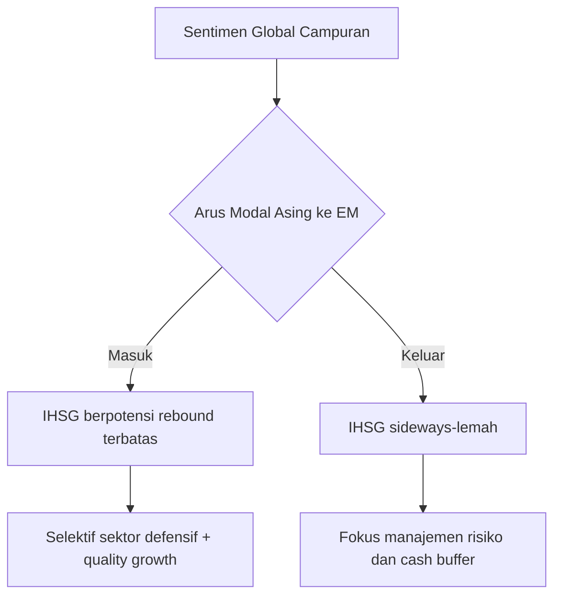

# 🗞️ Daily Brief — Selasa, 10 Maret 2026

> Fokus hari ini: adopsi AI enterprise masuk fase *security + agentic workflow*, sementara pasar global masih sensitif terhadap risiko geopolitik dan arah suku bunga. Di Indonesia, diskursus AI bergeser dari sekadar fitur ke isu tata kelola, hak cipta, dan kesiapan SDM.

---

## ⚔️ Geopolitik / Konflik (Jika Relevan)

### 1) Ketegangan global masih menjaga sentimen risk-off 🌍

Narasi geopolitik internasional belum sepenuhnya reda, sehingga pasar global cenderung berhati-hati. Dampaknya terasa pada aliran modal ke emerging markets yang lebih selektif, termasuk Indonesia.

### 2) Risiko kebijakan keamanan nasional dan teknologi makin beririsan 🛡️🤖

Perdebatan tentang penggunaan AI dalam ranah pertahanan kembali menguat. Ini menegaskan bahwa masa depan AI tidak hanya soal produk konsumen, tetapi juga soal kebijakan publik, akuntabilitas, dan governance lintas negara.

---

## 🤖 AI & Teknologi (WAJIB)

### 3) OpenAI akuisisi Promptfoo: keamanan AI jadi prioritas enterprise 🔐

Arah ini menunjukkan bahwa fase “demo AI” sudah lewat. Perusahaan kini menaruh perhatian besar pada *AI red-teaming*, evaluasi kerentanan, dan mitigasi risiko sejak tahap development.

🔗 https://www.theverge.com/ai-artificial-intelligence

### 4) Anthropic rilis Claude Code “Code Review” (multi-agent) 👨‍💻

Pembaruan ini menandai pergeseran dari *assistant* ke *review system* yang bisa bekerja paralel untuk menemukan bug lebih cepat. Produktivitas tim engineering berpotensi naik, terutama pada alur QA dan secure coding.

🔗 https://www.theverge.com/ai-artificial-intelligence

### 5) Microsoft uji “Claude Cowork” di Copilot 🧩

Trennya makin jelas: AI bukan hanya menjawab pertanyaan, tetapi menangani tugas multi-step jangka panjang. Ini mengarah ke model *digital coworker* untuk operasi bisnis harian.

🔗 https://www.theverge.com/ai-artificial-intelligence

### 6) Qualcomm dorong edge AI robotik lewat Ventuno Q (40 TOPS) 🤖

Setelah akuisisi Arduino, langkah ini memperkuat ekosistem AI perangkat keras untuk autonomous machine. Artinya, komputasi AI makin banyak dipindah ke perangkat (on-device/edge), tidak hanya bergantung cloud.

🔗 https://www.theverge.com/ai-artificial-intelligence

### 7) OpenAI tunda “adult mode”, fokus ke kualitas inti model 🧠

Prioritas produk dipindah ke peningkatan kecerdasan model, personalisasi, dan pengalaman proaktif. Ini memberi sinyal bahwa diferensiasi utama ke depan tetap ada di kualitas reasoning + UX, bukan sekadar fitur viral.

🔗 https://www.theverge.com/ai-artificial-intelligence

### 8) Indonesia: isu AI mulai masuk ranah hukum, royalti, dan etika ⚖️

Dari diskursus publik nasional, terlihat bahwa tantangan AI di Indonesia bukan lagi “bisa atau tidak bisa”, melainkan “adil atau tidak adil” dalam distribusi manfaat bagi kreator, pekerja, dan pengguna.

🔗 https://www.antaranews.com/tag/kecerdasan-buatan

---

## 🇮🇩 Indonesia (3–4 poin)

### 9) Adopsi AI lokal mulai bergerak ke use-case riil, bukan hanya chatbot

Inisiatif seperti polling digital berbasis AI memperlihatkan bahwa startup lokal mulai mengeksekusi produk vertikal yang lebih kontekstual untuk pasar Indonesia.

🔗 https://www.antaranews.com/tag/kecerdasan-buatan

### 10) Literasi talenta AI regional jadi alarm kompetitif untuk Indonesia 🎓

Program-program AI education di negara tetangga menegaskan urgensi percepatan kurikulum dan pelatihan praktis AI domestik agar talenta Indonesia tidak tertinggal dalam rantai nilai regional.

🔗 https://www.antaranews.com/tag/kecerdasan-buatan

### 11) AI smartphone makin mainstream ke fitur harian konsumen 📱

Peluncuran perangkat baru dengan fitur AI kamera memperlihatkan AI semakin “tak terlihat tapi terasa” dalam pengalaman pengguna. Ini mempercepat edukasi pasar secara organik.

🔗 https://www.antaranews.com/tag/kecerdasan-buatan

---

## 💹 Pasar & Ekonomi (WAJIB)

> *Catatan:* Snapshot pagi WIB bersifat indikatif untuk pemetaan arah pasar harian. Bukan rekomendasi investasi.

### Bursa Global

| Indeks | Arah | Catatan Ringkas |
|---|---|---|
| S&P 500 | Mixed | Investor menimbang data makro + arah suku bunga |
| Dow Jones | Mixed | Rotasi sektor defensif masih terlihat |
| Nasdaq | Volatil | Sentimen AI tetap kuat, tapi valuasi sensitif |
| Nikkei | Mixed | Efek yen dan ekspor jadi penentu utama |
| Hang Seng | Melemah terbatas | Tekanan sektor properti/teknologi |
| **IHSG** | Sideways cenderung hati-hati | Dipengaruhi arus modal asing & sentimen global |

### Komoditas

| Komoditas | Arah | Catatan |
|---|---|---|
| Minyak WTI/Brent | Bertahan tinggi | Risiko pasokan dan geopolitik |
| Emas | Cenderung kuat | Lindung nilai saat ketidakpastian |
| CPO | Stabil-positif | Permintaan regional mendukung |
| Gas | Fluktuatif | Cuaca + dinamika pasokan |
| Gandum | Volatil | Sensitif terhadap rantai pasok global |

### Mata Uang

| Pair | Arah | Catatan |
|---|---|---|
| USD/IDR | Cenderung kuat di dolar | Sentimen risk-off global |
| EUR/USD | Sideways | Menunggu sinyal bank sentral |
| USD/JPY | Sensitif | Dipengaruhi ekspektasi kebijakan Jepang |

### Kripto

| Aset | Arah | Catatan |
|---|---|---|
| BTC | Volatil | Ikut sentimen risk appetite global |
| ETH | Volatil | Terkait narasi ekosistem & institusi |
| XRP | Fluktuatif | Terpengaruh sentimen regulasi |

### 🔮 Prediksi & Outlook (Indonesia)

#### Skenario IHSG (jangka pendek)

| Skenario | Probabilitas | Rentang | Strategi Umum |
|---|---:|---|---|
| Bearish ringan | 30% | Tekanan intraday | Defensive, disiplin risk management |
| Sideways | 50% | Konsolidasi | Akumulasi bertahap saham berkualitas |
| Bullish terbatas | 20% | Rebound teknikal | Trading selektif pada katalis kuat |

### Dampak ke Indonesia: Positif vs Negatif

**Potensi Positif ✅**
- AI enterprise membuka peluang efisiensi lintas sektor (keuangan, manufaktur, layanan publik).
- Edge AI + perangkat konsumen bisa mempercepat adopsi digital produktif.
- Talenta lokal punya peluang naik kelas lewat kebutuhan AI implementation.

**Potensi Negatif ⚠️**
- Risiko ketimpangan keterampilan jika reskilling berjalan lambat.
- Potensi sengketa hak cipta/data jika regulasi tertinggal.
- Volatilitas pasar global dapat menekan rupiah dan minat risiko investor.

---

## 📊 Ringkasan Angka Penting Hari Ini

- Fokus global AI: **security + multi-agent coding + coworker automation**
- Fokus Indonesia AI: **hak cipta, governance, literasi talenta**
- Arah pasar: **hati-hati, selektif, sensitif terhadap geopolitik dan suku bunga**

---

## 🔖 Referensi

- https://www.theverge.com/ai-artificial-intelligence
- https://www.antaranews.com/tag/kecerdasan-buatan
