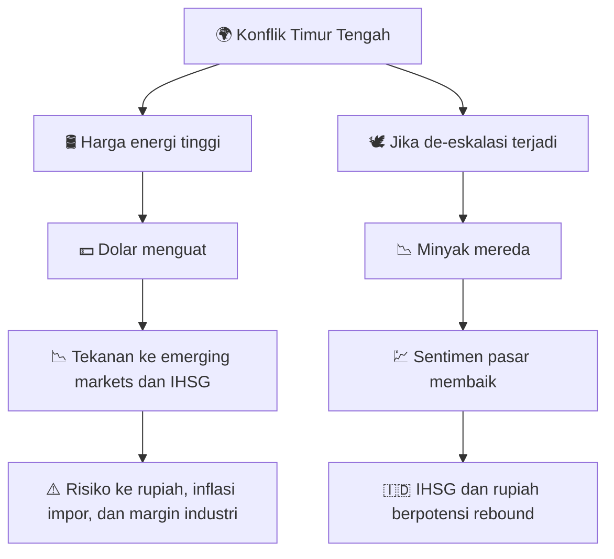

# 🗞️ Daily Brief — Jumat, 13 Maret 2026

> Timur Tengah masih menjadi pusat gravitasi risiko global 🌍🔥. Harga minyak tetap tinggi, pasar saham Asia dan Indonesia melemah, sementara di dunia AI justru arus inovasi terus berjalan: Meta menunda model besar berikutnya, Anthropic menambah kemampuan produktivitas Claude, Google memperluas Gemini di Chrome, dan Amazon makin agresif membungkus AI ke produk konsumen. Di Indonesia, fokus bergerak ke mudik Lebaran, energi, dan infrastruktur strategis. 

---

## ⚔️ Geopolitik / Konflik

### 1. Konflik AS–Iran masih menjadi penekan utama sentimen global 🔥

Tema besar hari ini tetap sama: **konflik Timur Tengah belum benar-benar mereda**. Dampaknya terlihat jelas pada harga energi, pergerakan mata uang, dan pelemahan bursa Asia. Bukan hanya karena perang itu sendiri, tetapi karena pasar melihat risiko yang jauh lebih besar: **gangguan rantai pasok energi global**, terutama bila jalur kritis seperti Selat Hormuz terus terganggu.

Secara ekonomi, pasar tidak menunggu peluru berikutnya untuk bereaksi. Cukup dengan sinyal bahwa konflik berkepanjangan, minyak langsung memantul tinggi, dolar menguat sebagai *safe haven* (aset aman), dan aset berisiko seperti saham emerging market *(pasar negara berkembang)* ikut ditekan. 😵

🔗 [Katadata — Putin berpotensi jadi pemenang dari perang AS lawan Iran](https://katadata.co.id/berita/internasional/69b3c1f2d1094/putin-berpotensi-jadi-pemenang-dari-perang-as-lawan-iran-ini-alasannya)

🔗 [Katadata — Pasukan IRGC Iran buru 11 ribu tentara AS di Timur Tengah](https://katadata.co.id/berita/internasional/69b3c7285a1a2/pasukan-irgc-iran-buru-11-ribu-tentara-as-di-timur-tengah)

### 2. Putin berpotensi menjadi pemenang tidak langsung dari perang ini 🇷🇺

Salah satu analisis yang paling menarik hari ini datang dari Katadata: **Rusia dan Vladimir Putin berpotensi menjadi pemenang tak langsung** dari konflik AS vs Iran. Logikanya sederhana tetapi kuat. Saat konflik memicu lonjakan harga energi dan mendorong relaksasi atau celah dalam kebijakan energi global, Rusia justru bisa menikmati napas ekonomi yang lebih panjang. 🛢️

Kalau ini benar, maka perang ini tidak hanya soal dua pihak yang bertempur, tetapi soal **redistribusi keuntungan geopolitik**. Dalam bahasa yang lebih blak-blakan: setiap perang besar hampir selalu punya pihak ketiga yang diam-diam tersenyum.

### 3. Ancaman terhadap stabilitas energi dunia belum benar-benar lewat ⛽

Upaya AS untuk menahan kenaikan harga energi — termasuk pelonggaran sementara terkait minyak Rusia dan pelepasan cadangan strategis — menunjukkan satu hal penting: **harga energi kini menjadi front perang tersendiri**. Bahkan ketika minyak sempat turun tipis dari puncaknya, pasar tetap menganggap level harga saat ini sudah cukup tinggi untuk merusak prospek inflasi dan pertumbuhan. 📉

Bagi negara seperti Indonesia yang masih sensitif terhadap harga energi global, ini jelas bukan kabar netral. Setiap lonjakan minyak bukan cuma berita luar negeri. Ia masuk ke APBN, subsidi, kurs rupiah, dan akhirnya ke dompet masyarakat. 💸

---

## 🤖 AI & Teknologi

### 4. Meta menunda model AI “Avocado” — tanda bahwa balapan AI tidak selalu mulus 🥑

Meta dilaporkan menunda model AI berikutnya yang bernama kode **Avocado** sampai setidaknya Mei. Ini menarik karena sering kali publik dibiasakan melihat industri AI sebagai jalur lurus: model baru, lebih kuat, lebih cepat, lebih besar, dan seterusnya. Padahal realitasnya jauh lebih berantakan. 😅

Penundaan ini mengisyaratkan bahwa meski Meta sudah menggelontorkan dana besar dan merekrut figur penting untuk membenahi arah AI mereka, **kualitas model tetap tidak bisa dipaksa hanya dengan uang dan ego korporasi**. Ini pengingat penting bahwa skala besar tidak otomatis menghasilkan terobosan besar.

🔗 [The Verge — Artificial Intelligence](https://www.theverge.com/ai-artificial-intelligence)

*Catatan:* laporan penundaan model Meta “Avocado” dirujuk The Verge dari pemberitaan NYT.

### 5. Anthropic memperluas kemampuan Claude untuk spreadsheet dan slide deck 📊

Anthropic menambahkan kemampuan baru untuk Claude agar bisa bekerja lintas aplikasi seperti **Excel** dan **PowerPoint**. Secara praktis, ini mungkin terdengar seperti upgrade kecil. Tapi secara strategis, ini sangat penting. 

Kenapa? Karena AI yang benar-benar berguna di kantor bukan AI yang hanya bisa “menjawab pertanyaan”, melainkan AI yang bisa **membawa konteks kerja** dari satu aplikasi ke aplikasi lain tanpa membuat pengguna harus mengulang penjelasan dari nol. Itu artinya kita bergerak dari era *chatbot* ke era **workflow AI** *(AI yang menempel pada alur kerja nyata)*. 🧠

Dalam jangka menengah, kemampuan seperti ini bisa terasa jauh lebih transformatif daripada model yang sekadar lebih puitis atau lebih cerewet.

🔗 [The Verge — Claude menambah kemampuan spreadsheet dan slide deck](https://www.theverge.com/ai-artificial-intelligence)

### 6. Google memperluas Gemini in Chrome ke lebih banyak negara 🌐

Google memperluas akses **Gemini in Chrome** ke Kanada, Selandia Baru, India, dan menambah dukungan 50+ bahasa. Di permukaan, ini terlihat sebagai rollout fitur biasa. Tapi secara arah produk, ini berarti Google makin serius menjadikan AI bukan sekadar situs terpisah, melainkan **lapisan antarmuka** di atas web itu sendiri. 🕸️

Kalau browser menjadi tempat AI membaca konteks tab, membandingkan produk, membantu menulis email, atau meringkas layar aktif, maka browser perlahan berubah dari “jendela internet” menjadi **asisten kerja semi-otonom**. Ini bukan perubahan kecil. Ini bisa memengaruhi cara kita belajar, belanja, bekerja, dan mencari informasi.

🔗 [The Verge — Gemini in Chrome diperluas ke lebih banyak negara](https://www.theverge.com/ai-artificial-intelligence)

### 7. Meta memperluas keluarga chip AI internal MTIA ⚙️

Meta juga meluncurkan dan memperluas lini **Meta Training and Inference Accelerator (MTIA)**. Ini penting karena perang AI hari ini bukan cuma soal model, tetapi juga soal **silicon sovereignty** *(kedaulatan chip/infrastruktur komputasi)*. 

Perusahaan yang terlalu bergantung pada vendor eksternal untuk chip AI akan menghadapi tekanan biaya, pasokan, dan performa. Maka ketika Meta membangun keluarga chip sendiri, itu artinya mereka sedang mencoba memegang lebih banyak kendali atas fondasi ekonominya. 🔩

Bila tren ini berlanjut, kita akan melihat AI industry terbelah menjadi dua lapis persaingan:
1. siapa punya model terbaik, dan
2. siapa punya infrastruktur komputasi paling efisien.

🔗 [The Verge — Meta memperluas keluarga chip AI MTIA](https://www.theverge.com/ai-artificial-intelligence)

### 8. Amazon menambah “personality layer” untuk Alexa Plus — AI makin dibungkus sebagai karakter rumah tangga 🗣️

Amazon menambahkan mode **“Sassy”** untuk Alexa Plus — gaya bicara yang lebih tajam, lebih sinis, dan lebih “berkepribadian”. Sekilas ini terlihat receh atau gimmick. Tapi jangan remehkan. Ini menunjukkan bahwa AI konsumen tidak cuma bertarung di ranah akurasi dan produktivitas, tapi juga di ranah **persona** *(kepribadian buatan)*. 🎭

Artinya, perusahaan mulai sadar bahwa hubungan pengguna dengan AI akan semakin menyerupai hubungan sosial: bukan hanya “apa yang bisa dilakukan AI”, tetapi juga “bagaimana rasanya hidup bersama AI itu.” Ini wilayah yang secara bisnis sangat besar, dan secara psikologis juga sangat sensitif.

🔗 [The Verge — Amazon menambah mode 'Sassy' untuk Alexa Plus](https://www.theverge.com/ai-artificial-intelligence)

### 9. Amazon memperluas Health AI — AI kesehatan makin dibawa ke konsumsi massal 🏥

Amazon juga memperluas akses **Health AI**, alat berbasis AI yang disebut HIPAA-compliant *(patuh pada aturan privasi kesehatan AS)* untuk menjawab pertanyaan kesehatan umum, menganalisis catatan medis, dan menghubungkan pengguna ke profesional kesehatan melalui One Medical. 

Arah ini penting karena AI kesehatan tampaknya akan tumbuh bukan hanya lewat rumah sakit besar, tapi lewat **platform konsumen** yang membuat konsultasi awal, pemahaman gejala, dan navigasi sistem kesehatan menjadi lebih mudah. Namun, di sinilah tantangan etis dan hukum akan semakin keras: **siapa bertanggung jawab jika rekomendasinya salah?** ⚖️

🔗 [The Verge — Amazon memperluas Health AI](https://www.theverge.com/ai-artificial-intelligence)

---

## 🇮🇩 Indonesia

### 10. Prabowo gelar sidang kabinet bahas persiapan mudik Lebaran 🚗

Hari ini pemerintah menggelar **sidang kabinet** untuk membahas kesiapan mudik Lebaran. Ini mungkin terdengar seperti rutinitas musiman, tetapi secara kebijakan publik, mudik adalah salah satu ujian koordinasi negara paling nyata di Indonesia. 

Ia menyentuh transportasi, logistik, stok pangan, keamanan, cuaca, layanan kesehatan, hingga komunikasi publik. Kalau semuanya lancar, orang menganggap itu biasa. Kalau satu simpul gagal, efeknya bisa nasional. Maka persiapan mudik sebenarnya adalah laboratorium mini dari kapasitas negara kita. 🧭

🔗 [Katadata — Prabowo gelar sidang kabinet bahas persiapan mudik Lebaran](https://katadata.co.id/berita/nasional/69b3a5dfcf826/prabowo-gelar-sidang-kabinet-hari-ini-bahas-persiapan-mudik-lebaran)

### 11. Proyek kereta cepat Jakarta–Surabaya makin dekat ke tahap pengumuman 🚄

Pemerintah disebut telah merampungkan pembahasan proyek **kereta cepat Jakarta–Surabaya**, dan pengumuman resminya disebut akan disampaikan Presiden Prabowo. Kalau benar masuk fase implementasi, ini akan jadi salah satu proyek infrastruktur transportasi paling strategis di Jawa. 

Pertanyaannya tentu bukan hanya soal kebanggaan teknologi, tetapi soal **kelayakan ekonomi, pembiayaan, integrasi antarkota, dan efek produktivitas jangka panjang**. Infrastruktur besar selalu mengundang dua emosi sekaligus: harapan dan skeptisisme. Keduanya sama-sama valid. 🚧

🔗 [Katadata — Proyek kereta cepat Jakarta–Surabaya masuk fase matang](https://katadata.co.id/berita/nasional/69b3be3fb8e3e/pemerintah-rampung-bahas-proyek-kereta-cepat-surabaya-bakal-diumumkan-prabowo)

### 12. ESDM dorong program PLTS 100 GW di wilayah 3T ☀️

Kementerian ESDM mendorong konversi PLTD ke **PLTS** *(Pembangkit Listrik Tenaga Surya)* di wilayah 3T — tertinggal, terdepan, dan terluar. Ini salah satu berita Indonesia paling penting hari ini, justru karena tidak seviral yang lain. 

Kenapa penting? Karena transisi energi sering dibayangkan sebagai proyek elite di kota besar, padahal kebutuhan paling mendesak sering ada di wilayah yang akses energinya masih mahal, rapuh, dan tidak stabil. Bila program semacam ini berjalan serius, dampaknya bukan hanya pengurangan emisi, tetapi juga **penurunan biaya logistik energi dan peningkatan kualitas hidup masyarakat pinggiran**. 🌞

🔗 [Katadata — Program PLTS 100 GW di wilayah 3T](https://katadata.co.id/berita/energi/69b3bf2cee05f/program-plts-100-gw-esdm-ganti-diesel-dengan-tenaga-surya-di-30-lokasi-3t)

### 13. Petronas temukan cadangan hidrokarbon di lepas pantai Jawa Timur 🛢️

Petronas menemukan cadangan hidrokarbon di sumur eksplorasi **Barokah-1** di wilayah North Ketapang, lepas pantai Jawa Timur. Dalam jangka pendek, ini positif karena bisa memperkuat optimisme terhadap ketahanan energi domestik. 

Namun secara strategis, Indonesia tetap berada di persimpangan: kita masih butuh eksplorasi migas untuk stabilitas energi dan fiskal, tetapi pada saat yang sama juga harus bergerak ke transisi energi. Jadi berita seperti ini tidak bisa dibaca secara hitam-putih. Ia adalah pengingat bahwa **realitas energi selalu transisional, tidak pernah murni ideologis**. ⚖️

🔗 [Katadata — Petronas temukan cadangan hidrokarbon di lepas pantai Jawa Timur](https://katadata.co.id/berita/energi/69b3b9de1aae9/petronas-temukan-cadangan-hidrokarbon-di-lepas-pantai-jawa-timur)

<Callout type="info" title="Benang Merah Berita Indonesia Hari Ini">
Kalau disarikan, ada tiga fokus utama Indonesia hari ini: **kesiapan mobilitas Lebaran**, **pembangunan infrastruktur konektivitas**, dan **ketahanan energi**. Tiga hal ini kelihatannya terpisah, tetapi sesungguhnya saling terhubung: mobilitas perlu infrastruktur, infrastruktur perlu energi, dan semuanya butuh tata kelola fiskal yang sehat. 🇮🇩
</Callout>

---

## 💹 Pasar & Ekonomi

### Bursa Global — risk-off masih dominan 📉

| Indeks | Harga | Perubahan | Catatan |
|---|---:|---:|---|
| 🇺🇸 S&P 500 | 6.672,62 | turun dari 6.775,80 | Wall Street masih tertekan oleh minyak tinggi dan kekhawatiran inflasi |
| 🇺🇸 Dow Jones | 46.677,85 | turun dari 47.417,27 | Dow jatuh ke area terendah 2026 sejauh ini |
| 🇺🇸 Nasdaq | 22.311,98 | turun dari 22.716,14 | Saham teknologi ikut terkena imbas risk-off |
| 🇯🇵 Nikkei 225 | 53.819,61 | -1,16% | Terseret lonjakan minyak dan kekhawatiran inflasi impor |
| 🇭🇰 Hang Seng | 25.465,60 | -0,98% | Asia tetap defensif |
| 🇮🇳 SENSEX | 74.563,92 | -1,93% | Tekanan tajam di India berlanjut |
| 🇮🇩 IHSG / JCI | 7.144,87 | -2,95% | Tekanan paling terasa di domestik minggu ini |

<Callout type="warning" title="Pasar Masuk Mode Risk-Off">
Ada satu benang merah yang sangat jelas: **energi mahal = tekanan luas ke aset berisiko**. Bursa AS belum masuk mode panik total, tetapi sudah jelas tidak nyaman. Asia lebih sensitif lagi. Dan IHSG tampak sangat rapuh, bukan hanya karena sentimen global, tetapi juga karena investor melihat pasar Indonesia sedang menghadapi kombinasi yang tidak enak: rupiah lemah, libur mendekat, dan harga energi global belum jinak. 😮‍💨
</Callout>

### Komoditas — energi panas, emas kuat, sawit ikut terdorong 🛢️🥇🌴

| Komoditas | Harga | Perubahan | Catatan |
|---|---:|---:|---|
| WTI Crude Oil | $93,59/bbl | -2,24% harian | Turun tipis, tapi tetap sangat tinggi |
| Gold | $5.106,54/oz | +0,54% | Emas tetap kuat sebagai aset lindung nilai |
| Palm Oil | MYR 4.576/T | +0,88% | Positif untuk sentimen sawit Indonesia |
| Natural Gas | $3,23/MMBtu | -0,03% | Permintaan LNG AS naik akibat gangguan pasokan Teluk |
| Wheat | 598,55 USd/Bu | +0,01% | Bertahan tinggi di tengah sensitivitas energi |

### Mata Uang 💱

| Pasangan | Kurs | Perubahan | Catatan |
|---|---:|---:|---|
| USD/IDR | 16.926 | naik dari 16.914,55 | Rupiah melemah 4 sesi beruntun |

### Kripto 🪙

| Aset | Harga | Catatan |
|---|---:|---|
| Bitcoin (BTC) | $72.415,06 | Masih mampu hijau meski dolar menguat |
| Ethereum (ETH) | $2.129,26 | Stabil, tapi belum menunjukkan momentum sekuat BTC |

### Analisis dampak untuk Indonesia 🇮🇩

**Dampak positif ✅**
- Harga **CPO/sawit** yang naik mendukung sentimen terhadap emiten sawit dan neraca perdagangan.
- Jika proyek energi domestik dan eksplorasi migas berjalan efektif, Indonesia bisa mendapat bantalan pasokan jangka menengah.
- Ramadan dan mendekati Lebaran bisa menopang konsumsi domestik, terutama ritel dan transportasi. 🛍️

**Dampak negatif ⚠️**
- Minyak tinggi tetap menjadi ancaman besar bagi rupiah, inflasi impor, dan fiskal.
- IHSG berada dalam posisi rapuh; bila minyak tidak turun, pasar domestik bisa sulit pulih cepat.
- Kenaikan biaya logistik dan energi dapat menggerus margin industri dan daya beli. 🚛

<Callout type="important" title="Kesimpulan Ekonomi Hari Ini">
Untuk Indonesia, kombinasi saat ini bersifat **campuran tetapi condong negatif**. Sawit dan energi domestik memberi bantalan, tetapi tekanan minyak global, pelemahan rupiah, dan kehati-hatian investor asing masih jauh lebih dominan. Kalau tidak ada katalis positif baru, pasar kemungkinan tetap bergerak defensif dalam jangka sangat pendek. 📌
</Callout>

---

## 🔮 Outlook dan Skenario ke Depan

Situasi saat ini bisa dibaca sebagai pertarungan antara dua kekuatan:
1. **ketakutan geopolitik** yang mendorong risk-off,
2. **kekuatan konsumsi domestik** menjelang Lebaran yang memberi bantalan lokal.

Kalau konflik Timur Tengah tidak reda, pasar akan terus memperlakukan minyak sebagai sumber ancaman utama. Tapi kalau ada sinyal de-eskalasi, aset-aset yang hari ini dipukul keras bisa memantul cukup cepat.

### Skenario IHSG

| Skenario | Rentang | Pemicu | Strategi Umum |
|---|---|---|---|
| **Bearish** 🐻 | 6.950 – 7.100 | Minyak tetap tinggi, rupiah melemah, risk-off global lanjut | Sangat selektif, utamakan defensif dan kas |
| **Sideways** 😐 | 7.100 – 7.300 | Tidak ada katalis besar baru, pasar menunggu BI & geopolitik | Trading pendek, fokus pada sektor resilient |
| **Bullish rebound** 🐂 | 7.300 – 7.500 | Ada de-eskalasi perang + rupiah stabil + konsumsi Lebaran kuat | Bisa akumulasi bertahap pada saham berkualitas |

---

## 📊 Ringkasan Angka Penting Hari Ini

- **IHSG / JCI:** 7.144,87
- **S&P 500:** 6.672,62
- **Dow Jones:** 46.677,85
- **Nasdaq:** 22.311,98
- **Nikkei 225:** 53.819,61
- **Hang Seng:** 25.465,60
- **Sensex:** 74.563,92
- **WTI Oil:** $93,59/barel
- **Gold:** $5.106,54/oz
- **Palm Oil:** MYR 4.576/ton
- **USD/IDR:** 16.926
- **Bitcoin:** $72.415,06
- **Ethereum:** $2.129,26

---

## 🔖 Tautan Referensi

### Geopolitik & Indonesia
- [IRGC Iran buru 11 ribu tentara AS di Timur Tengah](https://katadata.co.id/berita/internasional/69b3c7285a1a2/pasukan-irgc-iran-buru-11-ribu-tentara-as-di-timur-tengah)
- [Putin berpotensi jadi pemenang dari perang AS lawan Iran](https://katadata.co.id/berita/internasional/69b3c1f2d1094/putin-berpotensi-jadi-pemenang-dari-perang-as-lawan-iran-ini-alasannya)
- [Prabowo gelar sidang kabinet bahas persiapan mudik Lebaran](https://katadata.co.id/berita/nasional/69b3a5dfcf826/prabowo-gelar-sidang-kabinet-hari-ini-bahas-persiapan-mudik-lebaran)
- [Pemerintah rampung bahas proyek kereta cepat Surabaya](https://katadata.co.id/berita/nasional/69b3be3fb8e3e/pemerintah-rampung-bahas-proyek-kereta-cepat-surabaya-bakal-diumumkan-prabowo)
- [Program PLTS 100 GW di wilayah 3T](https://katadata.co.id/berita/energi/69b3bf2cee05f/program-plts-100-gw-esdm-ganti-diesel-dengan-tenaga-surya-di-30-lokasi-3t)
- [Petronas temukan cadangan hidrokarbon di lepas pantai Jawa Timur](https://katadata.co.id/berita/energi/69b3b9de1aae9/petronas-temukan-cadangan-hidrokarbon-di-lepas-pantai-jawa-timur)

### AI & Teknologi
- [Artificial Intelligence — The Verge](https://www.theverge.com/ai-artificial-intelligence)

### Pasar
- [Trading Economics — Indonesia Stock Market](https://tradingeconomics.com/indonesia/stock-market)
- [Trading Economics — United States Stock Market](https://tradingeconomics.com/united-states/stock-market)
- [Trading Economics — Japan Stock Market](https://tradingeconomics.com/japan/stock-market)
- [Trading Economics — Crude Oil](https://tradingeconomics.com/commodity/crude-oil)
- [Trading Economics — Gold](https://tradingeconomics.com/commodity/gold)
- [Trading Economics — Palm Oil](https://tradingeconomics.com/commodity/palm-oil)
- [Trading Economics — Natural Gas](https://tradingeconomics.com/commodity/natural-gas)
- [Trading Economics — Wheat](https://tradingeconomics.com/commodity/wheat)
- [Google Finance — S&P 500](https://www.google.com/finance/quote/.INX:INDEXSP)
- [Google Finance — Dow Jones](https://www.google.com/finance/quote/.DJI:INDEXDJX)
- [Google Finance — Nasdaq](https://www.google.com/finance/quote/.IXIC:INDEXNASDAQ)
- [Google Finance — Nikkei 225](https://www.google.com/finance/quote/NI225:INDEXNIKKEI)
- [Google Finance — Hang Seng](https://www.google.com/finance/quote/HSI:INDEXHANGSENG)
- [Google Finance — Sensex](https://www.google.com/finance/quote/SENSEX:INDEXBOM)
- [Google Finance — USD/IDR](https://www.google.com/finance/quote/USD-IDR)
- [Google Finance — BTC/USD](https://www.google.com/finance/quote/BTC-USD)
- [Google Finance — ETH/USD](https://www.google.com/finance/quote/ETH-USD)

---

*Hari ini memberi pelajaran yang cukup keras: di saat teknologi bergerak sangat cepat 🤖, dunia nyata tetap ditentukan oleh energi, perang, logistik, dan politik kekuasaan. AI bisa mempercepat banyak hal, tetapi harga minyak masih bisa menaklukkan optimisme pasar hanya dalam beberapa hari. Dan itu mengingatkan kita bahwa masa depan tidak pernah ditulis oleh satu sektor saja — melainkan oleh benturan semua sektor sekaligus.*
