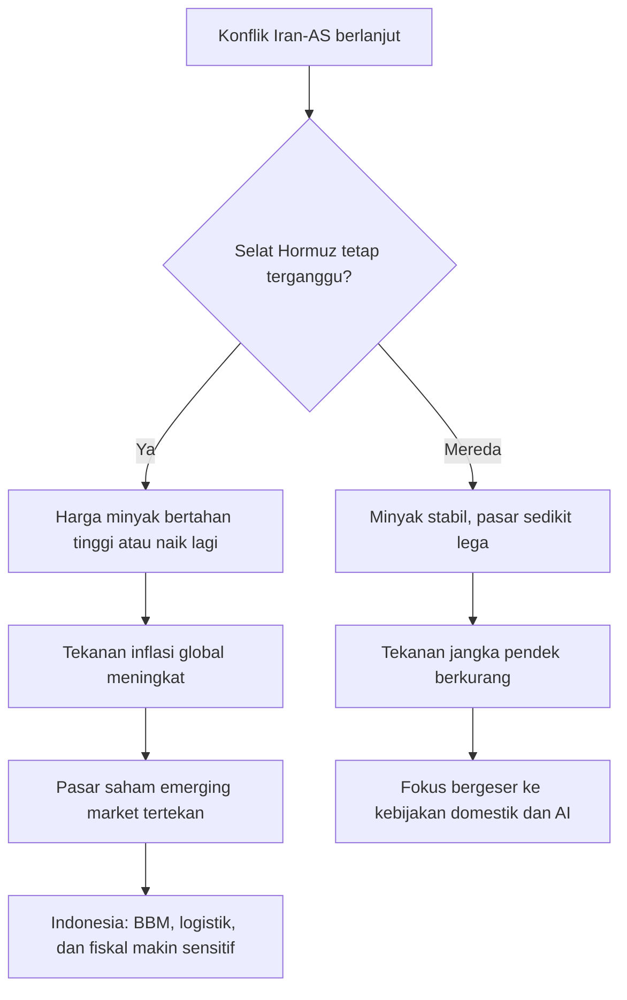

# 🗞️ Daily Brief — Sabtu, 14 Maret 2026

> Hari ini dunia bergerak di bawah tiga tekanan besar sekaligus: eskalasi perang Iran-AS yang mulai mengguncang jalur energi global, regulasi dan adopsi AI yang makin serius dari sekolah sampai layanan kesehatan, serta tekanan ekonomi yang memaksa Indonesia berpikir lebih defensif soal BBM, logistik, dan daya tahan fiskal. ⚠️

---

## ⚔️ Geopolitik / Konflik

### 1. AS Serang Situs Militer Iran di Pulau Kharg — Risiko Energi Global Makin Naik 🔥

Al Jazeera melaporkan bahwa AS menyerang target militer Iran di **Pulau Kharg**, wilayah yang sangat sensitif karena terkait infrastruktur minyak besar Iran. Secara strategis, ini penting bukan hanya karena eskalasi militer, tetapi juga karena serangan di area yang dekat dengan rantai pasok energi selalu berpotensi mengubah sentimen pasar global dalam hitungan jam.

Tekanannya tidak lagi semata bersifat simbolik. Begitu infrastruktur energi ikut terseret ke medan konflik, pasar akan membaca situasi ini sebagai ancaman langsung terhadap pasokan, biaya logistik, premi asuransi kapal, dan harga energi ke depan. Itu sebabnya isu Kharg tidak bisa dibaca sebagai berita perang biasa; ini adalah berita perang yang punya efek ekonomi global. 🛢️

🔗 [Al Jazeera — US attacks military sites on Iran’s Kharg island](https://www.aljazeera.com/where/iran/)

---

### 2. Selat Hormuz Tetap Jadi Titik Paling Rawan — Dua Kapal Pertamina Masih Tertahan 🚢

Pemerintah Indonesia masih melakukan pendekatan diplomatik intensif kepada Iran untuk mengeluarkan dua kapal milik Pertamina yang tertahan di kawasan **Selat Hormuz**. Ini sangat penting, karena Hormuz adalah jalur vital pergerakan migas dunia. Kalau gangguan di sana berlarut-larut, dampaknya tidak hanya terasa pada harga minyak internasional, tetapi juga pada beban impor energi negara-negara pengimpor seperti Indonesia.

Dari sudut pandang Indonesia, isu ini bukan abstrak. Ia langsung menyentuh ongkos logistik, keamanan pelayaran, pasokan energi, dan tekanan pada APBN. Karena itu, berita tentang dua kapal Pertamina ini harus dibaca sebagai sinyal bahwa konflik Timur Tengah sudah mulai masuk ke wilayah risiko operasional nyata bagi Indonesia. ⚓

🔗 [Katadata — Dua Kapal Pertamina Tertahan di Selat Hormuz](https://katadata.co.id/berita/energi/69b40ac0a2fe2/dua-kapal-pertamina-tertahan-di-selat-hormuz-ri-kebut-negosiasi-dengan-iran)

---

### 3. Jadwal Haji 2026 Belum Berubah, Tetapi Risiko Kawasan Sudah Nyata 🕋

Kemenlu memastikan jadwal keberangkatan haji tahun ini belum berubah meski Timur Tengah sedang memanas. Namun konteks yang lebih penting adalah pemerintah juga mengakui ada ribuan WNI yang sempat tertahan di Arab Saudi akibat jalur udara yang tidak sepenuhnya normal.

Ini menunjukkan bahwa walaupun agenda resmi ibadah belum dibatalkan, rantai mobilitas kawasan sudah mengalami tekanan. Bagi Indonesia, ini relevan secara langsung karena menyangkut manajemen risiko perjalanan, perlindungan WNI, kesiapan maskapai, dan kemampuan pemerintah merespons jika konflik makin melebar. ✈️

🔗 [Katadata — Jadwal Keberangkatan Haji 2026 Belum Berubah](https://katadata.co.id/berita/internasional/69b3fca7cbecf/jadwal-keberangkatan-haji-2026-belum-berubah-meski-timur-tengah-memanas)

---

## 🤖 AI & Teknologi

### 4. Indonesia Resmi Punya Pedoman Bersama Penggunaan AI di Pendidikan 🎓

Pemerintah menerbitkan **SKB 7 Menteri** terkait pedoman pemanfaatan teknologi digital dan kecerdasan artifisial di pendidikan formal, nonformal, dan informal. Ini penting karena Indonesia mulai bergerak dari sekadar wacana ke arah **governance** *(tata kelola)* yang lebih konkret: AI boleh dimanfaatkan, tetapi tidak dibiarkan liar tanpa kerangka usia, kesiapan anak, dan mitigasi risiko.

Secara politik kebijakan, ini langkah penting. Negara tampak ingin mengambil posisi tengah: tidak anti-AI, tetapi juga tidak menyerahkan dunia pendidikan sepenuhnya kepada logika chatbot instan. Ini bisa menjadi fondasi awal bagi perdebatan yang lebih matang tentang literasi AI, etika penggunaan, dan desain pembelajaran yang tidak mematikan proses berpikir siswa. 🧠

🔗 [Kompas Tekno — 7 Menteri Sahkan Aturan Penggunaan AI dalam Pendidikan](https://tekno.kompas.com/read/2026/03/13/10280027/7-menteri-sahkan-aturan-penggunaan-ai-dalam-pendidikan)

---

### 5. Siswa SD–SMA Dibatasi Memakai AI Instan seperti ChatGPT, Gemini, dan Claude 🚫

Menko PMK Pratikno menegaskan bahwa siswa SD hingga SMA tidak diperbolehkan memakai AI instan seperti ChatGPT dan sejenisnya secara bebas. Alasan yang dikemukakan cukup tegas: mencegah *brain rot* *(pembusukan kebiasaan berpikir)*, *cognitive debt* *(utang kognitif, yaitu ketergantungan yang mengurangi latihan berpikir mandiri)*, dan penurunan kapasitas kognitif anak.

Ini tentu akan memicu perdebatan. Di satu sisi, kekhawatiran pemerintah masuk akal: jika AI dijadikan jalan pintas permanen, proses belajar bisa menjadi dangkal. Di sisi lain, tantangan kebijakan berikutnya adalah membedakan mana penggunaan AI yang benar-benar merusak proses belajar, dan mana penggunaan AI yang justru bisa mendukung pembelajaran jika dirancang dengan benar. Jadi isu utamanya bukan hanya “boleh atau tidak”, tetapi **bagaimana desain penggunaannya**. 📚

🔗 [Kompas Tekno — Siswa SD-SMA Tak Boleh Pakai AI ChatGPT dkk](https://tekno.kompas.com/read/2026/03/13/07570097/menko-pmk-pratikno--siswa-sd-sma-tak-boleh-pakai-ai-chatgpt-dkk-)

---

### 6. Microsoft Masuk Lebih Dalam ke Vertical AI Lewat Copilot Health 🏥

Microsoft merilis **Copilot Health**, sebuah ruang khusus di dalam Copilot untuk membantu pengguna memahami hasil laboratorium, rekam medis, dan data dari perangkat *wearable* seperti Apple Watch, Oura, atau Fitbit. Ini menandai arah yang makin jelas dalam industri AI: kompetisi tidak lagi hanya soal chatbot umum, melainkan soal **vertical AI** *(AI yang fokus pada sektor spesifik bernilai tinggi)*.

Kesehatan adalah sektor yang sangat strategis karena nilainya tinggi, datanya kompleks, dan kebutuhan interpretasinya besar. Jika produk seperti Copilot Health matang, ia bisa mengubah cara orang membaca hasil tes, memahami laporan medis, dan menavigasi layanan kesehatan. Tetapi di saat yang sama, ia juga membuka pertanyaan besar soal privasi, akurasi, batas tanggung jawab, dan relasi antara AI dengan dokter manusia. ❤️‍🩹

🔗 [Kompas Tekno — Microsoft Rilis AI Kesehatan Copilot Health](https://tekno.kompas.com/read/2026/03/13/15210007/ikuti-chatgpt-dan-anthropic-microsoft-rilis-ai-kesehatan-copilot-health)

---

### 7. Persaingan AI Global Makin Bergeser ke Distribusi, Karakter Produk, dan Politik Teknologi 🌍

Dari lanskap pagi ini, terlihat bahwa AI global tidak lagi sekadar lomba “siapa model paling pintar”. Anthropic masih disorot karena keterlibatannya dalam isu pertahanan dan keamanan nasional. Google terus mendorong Gemini langsung ke Chrome. Amazon justru bermain di wilayah *personality layer* dengan gaya baru Alexa+. Meta, sementara itu, terlihat makin agresif dalam perebutan talenta dan infrastruktur AI.

Artinya, medan persaingan AI kini punya empat lapis sekaligus:
- **kapabilitas model**,
- **integrasi ke produk harian**,
- **regulasi dan geopolitik**,
- **dan diferensiasi pengalaman pengguna**.

Ini penting karena pemenang AI ke depan mungkin bukan hanya yang modelnya paling canggih, tetapi yang paling berhasil masuk ke kebiasaan manusia sehari-hari. 🤖

🔗 [Anthropic News](https://www.anthropic.com/news)
🔗 [The Verge — AI](https://www.theverge.com/ai-artificial-intelligence)
🔗 [The Verge — Alexa “Sassy” mode](https://www.theverge.com/tech/894135/amazons-sassy-personality-style-for-alexa-plus-has-a-lot-of-warning-labels)

---

## 🇮🇩 Indonesia

### 8. Prabowo Godok Skema Penghematan BBM, Termasuk Opsi Kurangi Hari Kerja ⛽

Presiden Prabowo meminta kabinet menyiapkan langkah penghematan konsumsi BBM sebagai respons terhadap tekanan harga energi akibat konflik Iran. Salah satu opsi yang disebut bahkan cukup ekstrem secara sosial-ekonomi: **pengurangan hari kerja**. Ini menunjukkan pemerintah membaca situasi energi global bukan sebagai gangguan jangka sangat pendek, tetapi sebagai ancaman yang cukup serius untuk menuntut penyesuaian kebijakan domestik.

Secara makro, ini sinyal bahwa pemerintah sedang menimbang ruang fiskal dan stabilitas harga. Jika minyak terus tinggi, maka subsidi, biaya logistik, inflasi, dan tekanan fiskal bisa meningkat bersamaan. Jadi, isu penghematan BBM ini bukan sekadar kampanye hemat energi, tetapi potensi awal dari kebijakan penyesuaian ekonomi yang lebih luas. 📉

🔗 [Katadata — Prabowo Godok Skema Penghematan BBM](https://katadata.co.id/berita/nasional/69b3fbfb2b4fa/prabowo-godok-skema-penghematan-bbm-kaji-opsi-kurangi-hari-kerja)

---

### 9. Pemerintah Fokus Jaga Arus Mudik, Diskon Tarif Transportasi Jadi Instrumen Sosial 🚉

Dalam sidang kabinet, Prabowo juga meminta pengawasan serius terhadap kesiapan mudik Lebaran, termasuk diskon tarif pesawat, kereta, kapal laut, dan tol. Di tengah tekanan energi dan potensi pelemahan daya beli, kebijakan seperti ini punya dua fungsi sekaligus: menjaga kelancaran mobilitas dan menahan tekanan psikologis-ekonomi masyarakat.

Secara politik-ekonomi, langkah ini menarik. Di satu sisi pemerintah sedang memikirkan penghematan BBM; di sisi lain pemerintah juga ingin menjaga agar momentum mudik tidak berubah menjadi sumber ketegangan sosial. Jadi arah kebijakannya tampak ganda: defensif secara fiskal, tetapi tetap berusaha suportif secara sosial. 🚍

🔗 [Katadata — Prabowo Bahas Mudik dan Diskon Tarif Transportasi](https://katadata.co.id/berita/nasional/69b3e55795368/prabowo-gelar-sidang-kabinet-bahas-mudik-minta-ada-diskon-tarif-transportasi)

---

## 💹 Pasar & Ekonomi

### 10. Minyak Naik ke Arah USD 100 — Pasar Makin Menganggap Risiko Pasokan Itu Nyata 🛢️

Trading Economics mencatat **WTI crude futures** naik lebih dari 2% menuju **USD 98 per barel** pada Jumat, didorong oleh berlanjutnya blokade Selat Hormuz dan eskalasi serangan terhadap Iran. Ini adalah perkembangan yang sangat penting karena begitu minyak bergerak ke area ini, pembacaan pasar berubah dari “gangguan geopolitik” menjadi “krisis pasokan yang bisa bertahan lebih lama”.

Bagi Indonesia, ini jelas bukan kabar baik. Indonesia adalah pengimpor minyak netto, sehingga kenaikan harga minyak hampir selalu berarti tekanan berlapis: subsidi, biaya distribusi, inflasi, kurs, dan beban fiskal. Jika konflik tak mereda, harga energi akan menjadi salah satu sumber tekanan ekonomi paling nyata dalam beberapa pekan ke depan. 🔴

🔗 [Trading Economics — Crude Oil](https://tradingeconomics.com/commodity/crude-oil)

---

### 11. IHSG Kembali Melemah, Tekanan Eksternal Belum Reda 📉

Trading Economics melaporkan saham Indonesia turun ke kisaran **7.323**, mencatat penurunan beruntun ketiga. Pelemahan ini dipicu kombinasi buruk: tekanan dari Wall Street, kekhawatiran inflasi energi akibat konflik Timur Tengah, dan ketidakpastian perdagangan global.

Bacaan yang lebih dalam: IHSG saat ini bukan hanya bereaksi terhadap sentimen luar negeri, tetapi juga terhadap kekhawatiran bahwa harga energi tinggi dapat menekan ruang fiskal Indonesia. Jadi pelemahan pasar saham domestik harus dibaca sebagai cermin dari kombinasi sentimen global dan kekhawatiran domestik sekaligus. 💼

🔗 [Trading Economics — Indonesia Stock Market (JCI)](https://tradingeconomics.com/indonesia/stock-market)

---

### 12. Emas Tetap Tinggi, tetapi Dolar yang Menguat Membatasi Reli 🥇

Harga emas menurut Trading Economics turun ke bawah **USD 5.050 per ounce** pada Jumat. Menariknya, ini menunjukkan bahwa di tengah perang dan ketegangan global, emas tidak otomatis naik tanpa hambatan. Penguatan dolar AS dan berubahnya ekspektasi suku bunga bisa menahan laju aset aman sekalipun.

Ini pelajaran penting untuk pasar: geopolitik memang mendorong permintaan *safe haven* *(aset pelindung)*, tetapi pasar keuangan tidak pernah digerakkan oleh satu faktor saja. Ketika dolar menguat dan pasar takut inflasi energi berkepanjangan, emas bisa kehilangan sebagian momentumnya meski risiko global masih tinggi. 🪙

🔗 [Trading Economics — Gold](https://tradingeconomics.com/commodity/gold)

---

## 📊 Ringkasan Angka Penting

- **WTI crude oil:** mendekati **USD 98/barel**
- **Gold:** di bawah **USD 5.050/oz**
- **IHSG / JCI:** sekitar **7.323**
- **Nikkei 225:** **53.819,61**
- **SSE (Shanghai):** **4.095,45**
- **Hang Seng:** **25.465,60**
- **SENSEX:** **74.563,92**

---

## 🔮 Outlook Singkat

Kalau tren hari ini ditarik ke depan, maka tiga hal layak dipantau ketat dalam 3–7 hari ke depan:

1. **Apakah konflik Timur Tengah makin menyeret infrastruktur energi?**
2. **Apakah Indonesia mulai mengumumkan kebijakan konkret penghematan BBM?**
3. **Apakah regulasi AI di pendidikan berkembang menjadi aturan yang lebih detail dan operasional?**

Dari semua itu, benang merahnya sederhana: dunia sedang bergerak ke arah yang lebih mahal, lebih hati-hati, dan lebih teregulasi. Negara, perusahaan teknologi, dan masyarakat sama-sama dipaksa menyesuaikan diri — hanya saja tekanan datang dari arah yang berbeda-beda. 🌐

---

## 🔖 Tautan Referensi

- [Al Jazeera — Iran coverage](https://www.aljazeera.com/where/iran/)
- [Katadata — Dua Kapal Pertamina Tertahan di Selat Hormuz](https://katadata.co.id/berita/energi/69b40ac0a2fe2/dua-kapal-pertamina-tertahan-di-selat-hormuz-ri-kebut-negosiasi-dengan-iran)
- [Katadata — Jadwal Keberangkatan Haji 2026 Belum Berubah](https://katadata.co.id/berita/internasional/69b3fca7cbecf/jadwal-keberangkatan-haji-2026-belum-berubah-meski-timur-tengah-memanas)
- [Kompas Tekno — 7 Menteri Sahkan Aturan Penggunaan AI dalam Pendidikan](https://tekno.kompas.com/read/2026/03/13/10280027/7-menteri-sahkan-aturan-penggunaan-ai-dalam-pendidikan)
- [Kompas Tekno — Siswa SD-SMA Tak Boleh Pakai AI ChatGPT dkk](https://tekno.kompas.com/read/2026/03/13/07570097/menko-pmk-pratikno--siswa-sd-sma-tak-boleh-pakai-ai-chatgpt-dkk-)
- [Kompas Tekno — Microsoft Rilis Copilot Health](https://tekno.kompas.com/read/2026/03/13/15210007/ikuti-chatgpt-dan-anthropic-microsoft-rilis-ai-kesehatan-copilot-health)
- [Anthropic News](https://www.anthropic.com/news)
- [The Verge — AI](https://www.theverge.com/ai-artificial-intelligence)
- [The Verge — Amazon Alexa+ personality styles](https://www.theverge.com/tech/894135/amazons-sassy-personality-style-for-alexa-plus-has-a-lot-of-warning-labels)
- [Katadata — Prabowo Godok Skema Penghematan BBM](https://katadata.co.id/berita/nasional/69b3fbfb2b4fa/prabowo-godok-skema-penghematan-bbm-kaji-opsi-kurangi-hari-kerja)
- [Katadata — Prabowo Bahas Mudik dan Diskon Tarif Transportasi](https://katadata.co.id/berita/nasional/69b3e55795368/prabowo-gelar-sidang-kabinet-bahas-mudik-minta-ada-diskon-tarif-transportasi)
- [Trading Economics — Crude Oil](https://tradingeconomics.com/commodity/crude-oil)
- [Trading Economics — Gold](https://tradingeconomics.com/commodity/gold)
- [Trading Economics — Indonesia Stock Market (JCI)](https://tradingeconomics.com/indonesia/stock-market)
