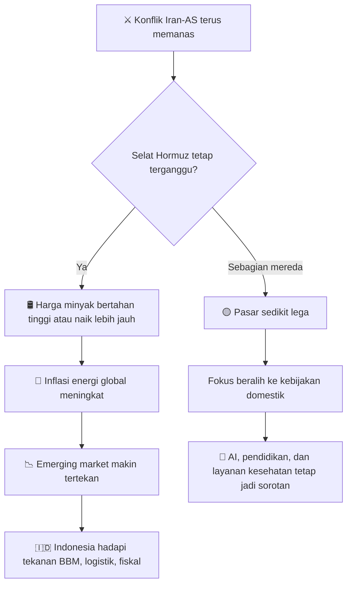

# 🗞️ Daily Brief — Sabtu, 14 Maret 2026

> Dunia hari ini bergerak di bawah satu bayangan besar: **perang yang mulai menyentuh jantung energi global**. Dari Pulau Kharg hingga Selat Hormuz, dari ruang kelas Indonesia hingga Copilot Health milik Microsoft, benang merah hari ini sama: **ketidakpastian global sedang memaksa negara, pasar, dan perusahaan teknologi untuk memilih antara percepatan dan kehati-hatian.**

---

## ⚔️ Geopolitik / Konflik

### 1. Serangan AS ke area strategis Iran mengubah perang menjadi krisis energi global 🔥

Al Jazeera menyorot serangan AS ke situs militer Iran di **Pulau Kharg** — sebuah lokasi yang tidak bisa dibaca hanya sebagai titik militer biasa. Kharg adalah simbol dari hubungan langsung antara perang dan pasar energi. Begitu wilayah yang beririsan dengan infrastruktur minyak ikut masuk ke radar serangan, maka pelaku pasar tidak lagi membaca konflik ini sebagai ketegangan regional, tetapi sebagai ancaman terhadap pasokan global.

Di sinilah perang berubah kualitas. Yang semula bisa dibingkai sebagai eskalasi militer, kini bergerak menjadi **krisis energi potensial**. Jalur logistik, premi asuransi kapal, biaya pengiriman, dan ekspektasi harga minyak semuanya mulai dipaksa naik. Itu sebabnya berita Kharg penting bukan hanya bagi Timur Tengah, tetapi juga bagi Indonesia, India, Tiongkok, Eropa, dan seluruh negara yang sensitif terhadap harga energi. 🛢️

🔗 [Al Jazeera — Iran coverage](https://www.aljazeera.com/where/iran/)

---

### 2. Selat Hormuz tetap menjadi urat nadi paling rawan — dan Indonesia sudah terkena dampaknya 🚢

Kementerian Luar Negeri RI masih melakukan negosiasi intensif agar dua kapal milik Pertamina bisa keluar dengan aman dari kawasan **Selat Hormuz**. Ini adalah berita yang secara simbolik sangat kuat: konflik di Timur Tengah sudah tidak lagi terasa “jauh”, karena dampaknya kini menyentuh aset energi Indonesia secara langsung.

Selat Hormuz adalah salah satu jalur paling penting dalam perdagangan migas dunia. Bila arus kapal tersendat, maka efeknya menjalar cepat: biaya pengiriman naik, distribusi melambat, pasokan terganggu, dan harga energi terdorong lebih tinggi. Dari sudut pandang Indonesia, ini berarti ancaman simultan terhadap **pasokan energi, logistik, nilai tukar, subsidi, dan sentimen fiskal**. ⚓

<Callout type="warning" title="Mengapa Selat Hormuz Sangat Penting?">
Selat Hormuz bukan sekadar jalur laut biasa. Ia adalah salah satu titik sempit paling strategis dalam ekonomi global. Gangguan kecil di sana bisa memperbesar efek harga minyak secara global, dan negara pengimpor energi seperti Indonesia hampir selalu terkena imbas lebih cepat daripada yang terlihat di berita utama.
</Callout>

🔗 [Katadata — Dua Kapal Pertamina Tertahan di Selat Hormuz](https://katadata.co.id/berita/energi/69b40ac0a2fe2/dua-kapal-pertamina-tertahan-di-selat-hormuz-ri-kebut-negosiasi-dengan-iran)

---

### 3. Haji 2026 belum berubah, tetapi tekanan mobilitas kawasan sudah nyata 🕋

Pemerintah memastikan jadwal keberangkatan haji 2026 belum berubah, karena Arab Saudi belum mengubah rencana penyelenggaraan. Namun di balik kabar yang menenangkan itu, ada fakta yang lebih penting: ribuan WNI sempat tertahan di Arab Saudi karena jalur udara belum sepenuhnya normal.

Ini menunjukkan bahwa bahkan sebelum ada perubahan resmi pada kebijakan ibadah, **rantai mobilitas kawasan sudah berada di bawah tekanan geopolitik**. Jadi, isu haji hari ini harus dibaca bukan hanya sebagai soal agama atau kalender perjalanan, melainkan sebagai indikator bahwa stabilitas logistik regional mulai terganggu. Bagi Indonesia, ini sangat relevan karena menyangkut perlindungan WNI, stabilitas penerbangan, dan kemampuan pemerintah menghadapi situasi darurat lintas negara. ✈️

🔗 [Katadata — Jadwal Keberangkatan Haji 2026 Belum Berubah](https://katadata.co.id/berita/internasional/69b3fca7cbecf/jadwal-keberangkatan-haji-2026-belum-berubah-meski-timur-tengah-memanas)

---

## 🤖 AI & Teknologi

### 4. Indonesia mulai serius mengatur AI di pendidikan 🎓

Pemerintah resmi menerbitkan **SKB 7 Menteri** tentang pemanfaatan teknologi digital dan kecerdasan artifisial di pendidikan. Ini langkah yang penting secara historis karena menandai pergeseran dari sekadar reaktif terhadap tren AI menjadi mulai membangun **kerangka tata kelola**. Negara tampak ingin mengambil posisi tengah: AI tidak ditolak, tetapi juga tidak dibiarkan masuk tanpa pagar etis, pedagogis, dan usia yang jelas.

Bila dibaca lebih dalam, kebijakan ini menunjukkan bahwa Indonesia mulai sadar satu hal penting: isu AI dalam pendidikan bukan cuma soal akses teknologi, tetapi soal **bagaimana menjaga agar teknologi tidak menggantikan proses berpikir yang seharusnya dilatih di sekolah**. Jadi perdebatan ke depan bukan lagi “pro-AI vs anti-AI”, melainkan soal bagaimana mendesain penggunaan AI agar tetap membangun manusia, bukan memanjakan ketergantungan. 🧠

🔗 [Kompas Tekno — 7 Menteri Sahkan Aturan Penggunaan AI dalam Pendidikan](https://tekno.kompas.com/read/2026/03/13/10280027/7-menteri-sahkan-aturan-penggunaan-ai-dalam-pendidikan)

---

### 5. Pembatasan AI instan untuk siswa SD–SMA membuka debat besar tentang masa depan belajar 🚫

Menko PMK Pratikno menegaskan bahwa siswa SD hingga SMA tidak boleh memakai AI instan seperti ChatGPT, Gemini, Claude, dan sejenisnya secara bebas. Pemerintah memakai istilah yang kuat: *brain rot* dan *cognitive debt* — dua istilah yang pada dasarnya mengacu pada kekhawatiran bahwa anak kehilangan latihan berpikir mandiri karena terlalu cepat bergantung pada jawaban instan.

Ini adalah debat besar zaman kita. Kekhawatiran pemerintah masuk akal, karena AI memang bisa mengubah belajar menjadi aktivitas salin-jawab yang dangkal. Tetapi pertanyaan berikutnya juga penting: apakah larangan saja cukup? Atau justru yang dibutuhkan adalah **kurikulum literasi AI**, pembelajaran berbasis proyek, dan desain evaluasi yang tidak mudah dipermainkan oleh chatbot? Dengan kata lain, isu hari ini bukan sekadar larangan, tetapi pertarungan tentang bentuk sekolah masa depan. 📚

🔗 [Kompas Tekno — Siswa SD-SMA Tak Boleh Pakai AI ChatGPT dkk](https://tekno.kompas.com/read/2026/03/13/07570097/menko-pmk-pratikno--siswa-sd-sma-tak-boleh-pakai-ai-chatgpt-dkk-)

---

### 6. Microsoft mendorong AI ke sektor bernilai tinggi lewat Copilot Health 🏥

Microsoft meluncurkan **Copilot Health**, ruang khusus di Copilot untuk membantu pengguna memahami hasil laboratorium, rekam medis, dan data dari perangkat *wearable*. Ini bukan langkah kecil. Ia menandai arah baru industri AI: dari chatbot serbaguna menuju **vertical AI** — AI yang dirancang untuk sektor tertentu dengan nilai tinggi, kebutuhan intens, dan data kompleks.

Kesehatan adalah salah satu arena paling strategis untuk AI karena ada kebutuhan besar akan interpretasi, navigasi informasi, dan personalisasi. Tetapi justru karena itu, ia juga sangat sensitif. Begitu AI masuk ke kesehatan, pertanyaan privasi, akurasi, tanggung jawab, dan hubungan antara mesin dengan otoritas medis menjadi jauh lebih serius. Jadi Copilot Health bukan cuma peluncuran produk; ia adalah tanda bahwa AI kini mulai bergerak ke sektor-sektor yang lebih berisiko tetapi juga lebih menguntungkan. ❤️‍🩹

🔗 [Kompas Tekno — Microsoft Rilis AI Kesehatan Copilot Health](https://tekno.kompas.com/read/2026/03/13/15210007/ikuti-chatgpt-dan-anthropic-microsoft-rilis-ai-kesehatan-copilot-health)

---

### 7. Persaingan AI global makin bergeser: bukan cuma model, tapi distribusi, regulasi, dan karakter produk 🌍

Dari lanskap berita hari ini, arah industri AI makin jelas. Anthropic masih disorot karena keterlibatan dan posisinya di isu pertahanan. Google terus mendorong Gemini langsung ke Chrome, yang artinya AI ingin masuk ke kebiasaan harian pengguna tanpa terasa seperti aplikasi terpisah. Amazon memilih jalur lain: memperkaya **karakter** asisten lewat mode seperti *Sassy*. Sementara Meta bergerak agresif dalam talenta dan infrastruktur.

Pelajarannya penting: pemenang AI masa depan mungkin bukan hanya yang paling kuat modelnya, tetapi yang paling berhasil dalam empat hal sekaligus:
- masuk ke rutinitas pengguna,
- lolos atau selaras dengan regulasi,
- menang dalam distribusi,
- dan membentuk pengalaman produk yang terasa personal.

AI sekarang bukan lagi semata perlombaan sains. Ia adalah perlombaan **ekosistem**. 🤖

🔗 [Anthropic News](https://www.anthropic.com/news)
🔗 [The Verge — Artificial Intelligence](https://www.theverge.com/ai-artificial-intelligence)
🔗 [The Verge — Alexa “Sassy” mode](https://www.theverge.com/tech/894135/amazons-sassy-personality-style-for-alexa-plus-has-a-lot-of-warning-labels)

---

## 🇮🇩 Indonesia

### 8. Pemerintah menyiapkan skema penghematan BBM — sinyal bahwa tekanan energi dianggap serius ⛽

Presiden Prabowo meminta kabinet menyiapkan langkah-langkah penghematan konsumsi BBM sebagai respons atas tekanan harga energi akibat konflik Iran. Salah satu opsi yang disebut bahkan cukup drastis secara sosial-ekonomi: **pengurangan hari kerja**. Ini menunjukkan pemerintah sedang memikirkan skenario yang lebih defensif, bukan lagi sekadar berharap harga energi segera normal.

Secara ekonomi, langkah ini bisa dibaca sebagai sinyal dini bahwa pemerintah sedang mencoba melindungi ruang fiskal. Bila minyak bertahan tinggi, Indonesia akan menghadapi tekanan simultan pada subsidi, biaya logistik, inflasi, dan kepercayaan pasar. Jadi berita ini penting bukan hanya karena kebijakannya belum final, tetapi karena ia memberi tahu kita arah pikiran pemerintah: **krisis energi global sedang dibaca sebagai ancaman nyata bagi stabilitas domestik.** 📉

<Callout type="important" title="Mengapa Ini Penting untuk Indonesia?">
Indonesia masih sangat sensitif terhadap harga energi global. Setiap lonjakan minyak bukan hanya memukul ongkos impor, tetapi juga bisa menekan subsidi, memperbesar biaya distribusi barang, dan memperberat tekanan pada masyarakat lewat inflasi.
</Callout>

🔗 [Katadata — Prabowo Godok Skema Penghematan BBM](https://katadata.co.id/berita/nasional/69b3fbfb2b4fa/prabowo-godok-skema-penghematan-bbm-kaji-opsi-kurangi-hari-kerja)

---

### 9. Mudik, diskon tarif, dan bantuan sosial: pemerintah mencoba menjaga sisi sosial ekonomi 🚉

Di saat yang sama, pemerintah juga meminta kesiapan penuh untuk arus mudik Lebaran, termasuk pengawasan diskon tarif transportasi dan dukungan TNI-Polri. Ini menarik, karena menunjukkan pendekatan ganda: di satu sisi negara mempertimbangkan penghematan BBM, di sisi lain negara juga ingin memastikan masyarakat tetap mendapat bantalan sosial dan kelancaran mobilitas menjelang hari besar.

Dari perspektif kebijakan publik, ini adalah upaya menjaga keseimbangan antara **disiplin ekonomi** dan **stabilitas sosial**. Pemerintah tampaknya paham bahwa tekanan ekonomi tidak boleh dibiarkan berubah menjadi tekanan psikologis dan sosial yang lebih luas. Karena itu, isu mudik hari ini bukan isu logistik semata, tetapi juga cara negara menjaga suasana publik tetap stabil di tengah ketidakpastian global. 🚍

🔗 [Katadata — Prabowo Bahas Mudik dan Diskon Tarif Transportasi](https://katadata.co.id/berita/nasional/69b3e55795368/prabowo-gelar-sidang-kabinet-bahas-mudik-minta-ada-diskon-tarif-transportasi)

---

## 💹 Pasar & Ekonomi

### 10. Harga minyak menuju USD 100 — pasar mulai menghitung skenario buruk 🛢️

Trading Economics mencatat **WTI crude futures** naik lebih dari 2% menuju **USD 98 per barel**. Ini bukan kenaikan biasa. Begitu harga bergerak ke area ini, pasar mulai berhenti bertanya “apakah ada gangguan?” dan mulai bertanya “berapa lama gangguan ini akan bertahan?”

Untuk Indonesia, level ini sangat sensitif. Negara pengimpor energi seperti Indonesia hampir selalu terkena efek berlapis ketika minyak naik tajam: subsidi tertekan, ongkos logistik naik, inflasi terdorong, dan rupiah menjadi lebih rentan. Bahkan jika belum tembus USD 100, pasar sering bereaksi seolah skenario terburuk sudah harus disiapkan. 🔴

🔗 [Trading Economics — Crude Oil](https://tradingeconomics.com/commodity/crude-oil)

---

### 11. IHSG melemah lagi — sentimen global dan fiskal domestik mulai bertemu 📉

Trading Economics menulis bahwa pasar saham Indonesia turun ke sekitar **7.323**, mencatat penurunan beruntun ketiga. Sentimennya datang dari luar: Wall Street melemah, harga minyak tinggi, dan risiko perdagangan global membesar. Tetapi ada lapisan yang lebih dalam: investor juga mulai khawatir bahwa tekanan energi global dapat mempersempit ruang fiskal Indonesia.

Inilah yang membuat pelemahan IHSG hari ini lebih penting daripada sekadar angka merah. Ia mencerminkan bahwa pasar mulai menggabungkan dua hal sekaligus: **risk-off global** dan **kerentanan domestik**. Kalau minyak tinggi bertahan, maka pasar akan makin sensitif terhadap setiap sinyal kebijakan fiskal dan subsidi energi di Indonesia. 💼

🔗 [Trading Economics — Indonesia Stock Market (JCI)](https://tradingeconomics.com/indonesia/stock-market)

---

### 12. Emas masih tinggi, tapi dolar yang kuat menahan reli safe haven 🥇

Harga emas bergerak di bawah **USD 5.050 per ounce**. Ini menarik karena menunjukkan bahwa di tengah perang sekalipun, emas tidak otomatis melesat tanpa hambatan. Penguatan dolar AS dan berubahnya ekspektasi suku bunga bisa menahan daya dorong *safe haven*.

Pelajarannya penting untuk membaca pasar: **krisis geopolitik tidak pernah bekerja sendirian**. Ia selalu berinteraksi dengan dolar, suku bunga, likuiditas, dan ekspektasi inflasi. Karena itu, pasar hari ini terasa lebih rumit: ketakutan mendorong emas naik, tetapi dolar yang kuat mencegah reli menjadi terlalu liar. 🪙

🔗 [Trading Economics — Gold](https://tradingeconomics.com/commodity/gold)

---

## 📊 Ringkasan Angka Penting

### Bursa Asia

| Indeks | Level | Perubahan | Catatan |
| :--- | ---: | ---: | :--- |
| **Nikkei 225** | 53.819,61 | -1,16% | Tekanan regional berlanjut |
| **SSE / Shanghai** | 4.095,45 | -0,82% | Risk sentiment melemah |
| **Hang Seng** | 25.465,60 | -0,98% | Tech dan China ikut tertekan |
| **SENSEX** | 74.563,92 | -1,93% | Emerging market sensitif energi |
| **IHSG / JCI** | 7.323 | -0,6% | Penurunan hari ketiga berturut-turut |

### Komoditas Kunci

| Aset | Level | Catatan |
| :--- | ---: | :--- |
| **WTI Crude Oil** | ~USD 98/barel | Mendekati batas psikologis USD 100 |
| **Gold** | < USD 5.050/oz | Safe haven tertahan dolar kuat |

<Callout type="danger" title="Sinyal Ekonomi Paling Penting Hari Ini">
Jika minyak benar-benar menembus dan bertahan di atas **USD 100**, maka tekanan berikutnya kemungkinan akan muncul berlapis: inflasi global, pelemahan sentimen pasar, beban impor energi, dan ruang fiskal Indonesia yang makin sempit.
</Callout>

---

## 🔮 Prediksi & Outlook Ke Depan

Kalau ditarik ke depan, ada tiga hal yang sangat layak dipantau dalam beberapa hari ke depan:

1. **Apakah eskalasi konflik mulai menyentuh lebih banyak infrastruktur energi?**
2. **Apakah pemerintah Indonesia benar-benar mengumumkan langkah konkret penghematan BBM atau relaksasi fiskal?**
3. **Apakah regulasi AI di pendidikan berkembang dari pedoman umum menjadi aturan operasional yang lebih detail?**

Kalau ketiga hal itu bergerak bersamaan, maka dunia akan masuk ke fase yang lebih mahal, lebih defensif, dan lebih teregulasi. Bagi Indonesia, tantangannya bukan hanya bertahan, tetapi memilih prioritas dengan disiplin: mana yang harus dijaga, mana yang harus ditunda, dan mana yang harus diatur sebelum terlambat. 🌐

---

## 🔖 Tautan Referensi Lengkap

- [Al Jazeera — Iran coverage](https://www.aljazeera.com/where/iran/)
- [Katadata — Dua Kapal Pertamina Tertahan di Selat Hormuz](https://katadata.co.id/berita/energi/69b40ac0a2fe2/dua-kapal-pertamina-tertahan-di-selat-hormuz-ri-kebut-negosiasi-dengan-iran)
- [Katadata — Jadwal Keberangkatan Haji 2026 Belum Berubah](https://katadata.co.id/berita/internasional/69b3fca7cbecf/jadwal-keberangkatan-haji-2026-belum-berubah-meski-timur-tengah-memanas)
- [Kompas Tekno — 7 Menteri Sahkan Aturan Penggunaan AI dalam Pendidikan](https://tekno.kompas.com/read/2026/03/13/10280027/7-menteri-sahkan-aturan-penggunaan-ai-dalam-pendidikan)
- [Kompas Tekno — Siswa SD-SMA Tak Boleh Pakai AI ChatGPT dkk](https://tekno.kompas.com/read/2026/03/13/07570097/menko-pmk-pratikno--siswa-sd-sma-tak-boleh-pakai-ai-chatgpt-dkk-)
- [Kompas Tekno — Microsoft Rilis Copilot Health](https://tekno.kompas.com/read/2026/03/13/15210007/ikuti-chatgpt-dan-anthropic-microsoft-rilis-ai-kesehatan-copilot-health)
- [Anthropic News](https://www.anthropic.com/news)
- [The Verge — Artificial Intelligence](https://www.theverge.com/ai-artificial-intelligence)
- [The Verge — Amazon Alexa+ personality styles](https://www.theverge.com/tech/894135/amazons-sassy-personality-style-for-alexa-plus-has-a-lot-of-warning-labels)
- [Katadata — Prabowo Godok Skema Penghematan BBM](https://katadata.co.id/berita/nasional/69b3fbfb2b4fa/prabowo-godok-skema-penghematan-bbm-kaji-opsi-kurangi-hari-kerja)
- [Katadata — Prabowo Bahas Mudik dan Diskon Tarif Transportasi](https://katadata.co.id/berita/nasional/69b3e55795368/prabowo-gelar-sidang-kabinet-bahas-mudik-minta-ada-diskon-tarif-transportasi)
- [Trading Economics — Crude Oil](https://tradingeconomics.com/commodity/crude-oil)
- [Trading Economics — Gold](https://tradingeconomics.com/commodity/gold)
- [Trading Economics — Indonesia Stock Market (JCI)](https://tradingeconomics.com/indonesia/stock-market)
