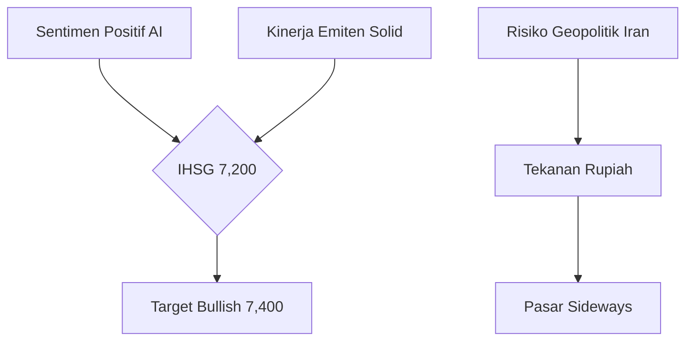

# 17 Maret 2026: Nvidia GTC 2026, Eskalasi Timur Tengah, dan Kebangkitan Ekonomi Domestik

> "Keamanan bukan lagi sekadar fitur, melainkan infrastruktur dasar bagi masa depan agen AI otonom yang kita bangun hari ini." — Bangun AI

## ⚔️ Geopolitik: Eskalasi di Teluk dan Ancaman Energi Global

Ketegangan di Timur Tengah mencapai titik didih baru hari ini. Pasukan Israel mengklaim telah berhasil menetralisir komandan pasukan Basij Iran, **Gholamreza Soleimani**, dalam sebuah serangan presisi tadi malam. Jika terkonfirmasi, ini akan menjadi eskalasi paling signifikan sejak pembunuhan tokoh-tokoh kunci sebelumnya dan berpotensi memicu balasan masif dari Teheran.

Dampaknya terasa hingga ke infrastruktur digital global. Proyek kabel bawah laut terpanjang di dunia dikabarkan terhambat akibat konflik ini, sementara Selat Hormuz kini menjadi zona "lewati dengan risiko tinggi". Beberapa kapal kargo dari negara-negara tertentu masih diizinkan melintas, namun ancaman blokade total membayangi pasar energi global, memicu kekhawatiran akan lonjakan harga minyak dunia dalam waktu dekat.

## 🤖 AI & Teknologi: Nvidia GTC 2026 dan Keamanan Agen Otonom

Di San Jose, Jensen Huang membuka **Nvidia GTC 2026** dengan kejutan: kehadiran **Olaf** dari Frozen (hasil kolaborasi dengan Disney Imagineering) yang bergabung di panggung utama. Namun, substansi teknis yang paling dinanti adalah peluncuran **NemoClaw**.

### Highlight Utama GTC 2026:
- **Nvidia NemoClaw:** Platform agen AI yang menambahkan lapisan privasi dan keamanan pada OpenClaw melalui *isolated sandbox*. Ini memungkinkan agen AI bekerja secara produktif namun tetap dalam koridor keamanan jaringan dan kebijakan yang ketat.
- **Vera Ruben Space 1:** Nvidia mengumumkan kemitraan untuk membangun pusat data AI di luar angkasa. Tantangan utamanya adalah pendinginan sistem melalui radiasi (karena ketiadaan konduksi dan konveksi di ruang hampa), namun ini diproyeksikan menjadi masa depan komputasi terdistribusi global.
- **Claude Multi-App:** Anthropic memperbarui kemampuan Claude agar bisa berkomunikasi lintas aplikasi (Excel dan PowerPoint) secara simultan, memungkinkan sinkronisasi data tanpa perlu penjelasan ulang di setiap tab.

Sementara itu, **Meta** dikabarkan menunda peluncuran model AI **"Avocado"** hingga Mei 2026 karena masalah performa yang belum mampu mengungguli rival terdekatnya. Meta juga memperbarui ketentuan layanan **Moltbook**, menegaskan tanggung jawab penuh pengguna atas segala tindakan otonom agen AI mereka.

## 🇮🇩 Indonesia: Inovasi Akar Rumput dan Langkah Tegas Komdigi

Kabar membanggakan datang dari Bangkok, di mana tujuh pelajar Indonesia meraih medali emas di ajang IPITEx berkat **SoilPIN**. Alat portabel berbasis AI ini mampu memantau kesehatan tanah secara real-time, memberikan harapan baru bagi produktivitas petani lokal di era digital.

Di sisi regulasi, **Komdigi** mengambil langkah strategis:
- **Akses Grok Dibuka:** Chatbot milik xAI ini kini bisa diakses kembali di Indonesia dengan pembatasan ketat untuk memastikan kepatuhan terhadap norma dan hukum lokal.
- **Satgas Anti-Deepfake:** Komdigi sedang merampungkan aturan untuk menekan penipuan berbasis *voice cloning* dan *deepfake* yang diprediksi telah merugikan warga hingga Rp 700 miliar sepanjang tahun lalu.

## 💹 Pasar & Ekonomi: IHSG Melaju di Tengah Tekanan Rupiah

Pasar modal Indonesia menunjukkan ketangguhan yang luar biasa hari ini, dipicu oleh sentimen positif rilis kinerja emiten perbankan besar dan optimisme adopsi AI di sektor UKM.

### Bursa Global & Regional
| Indeks | Nilai | Perubahan |
| :--- | :--- | :--- |
| **IHSG (Indonesia)** | 7,106.84 | +1.20% |
| Nikkei 225 (Jepang) | 53,700.39 | -0.09% |
| Hang Seng (Hong Kong) | 25,868.54 | +0.13% |
| SENSEX (India) | 76,156.32 | +0.87% |
| S&P 500 (US) | 669.03 | +1.01% |
| Nasdaq (US) | 18,945.22 | +1.12% |

### Komoditas & Mata Uang
| Instrumen | Nilai | Perubahan |
| :--- | :--- | :--- |
| **USD / IDR** | 16,984.00 | +0.13% |
| Minyak WTI (Crude) | $78.45 | -0.45% |
| Emas (Comex) | $2,745.20 | +0.08% |
| **Bitcoin (BTC)** | $74,219.10 | -0.85% |
| Ethereum (ETH) | $4,120.50 | -0.12% |

### 🔮 Prediksi & Outlook IHSG
IHSG diprediksi akan mencoba menguji level resisten 7,200 dalam pekan ini. Penguatan didorong oleh *inflow* asing ke saham-saham *blue chip* seperti BBRI dan TLKM yang baru saja merilis inovasi integrasi AI dalam operasional mereka.

**Strategi:** *Accumulate Buy* pada saham teknologi dan perbankan, waspadai volatilitas Rupiah yang mendekati level psikologis 17,000 akibat ketidakpastian di Timur Tengah.

## 📊 Ringkasan Angka Penting
- **700 Miliar Rupiah:** Taksiran kerugian akibat penipuan deepfake di Indonesia.
- **5 Triliun Dollar:** Market cap yang sempat dicapai Nvidia sebelum terkoreksi tipis hari ini.
- **16,984:** Kurs Rupiah terhadap Dollar AS, rekor terlemah dalam 3 bulan terakhir.

## 🔖 Tautan Referensi
- [Nvidia NemoClaw Launch - The Verge](https://www.theverge.com/ai-artificial-intelligence)
- [Eskalasi Perang Iran-Israel - Al Jazeera](https://www.aljazeera.com)
- [Grok Kembali ke Indonesia - Katadata](https://katadata.co.id/digital/teknologi/697f0fefdd647/komdigi-buka-blokir-grok-terapkan-pembatasan-ketat)
- [Inovasi SoilPIN Pelajar RI - Katadata](https://katadata.co.id/digital/teknologi/6966f7634e4bd/tujuh-pelajar-ri-raih-emas-ipitex-di-bangkok-berkat-ai-cek-tanah-untuk-petani)
