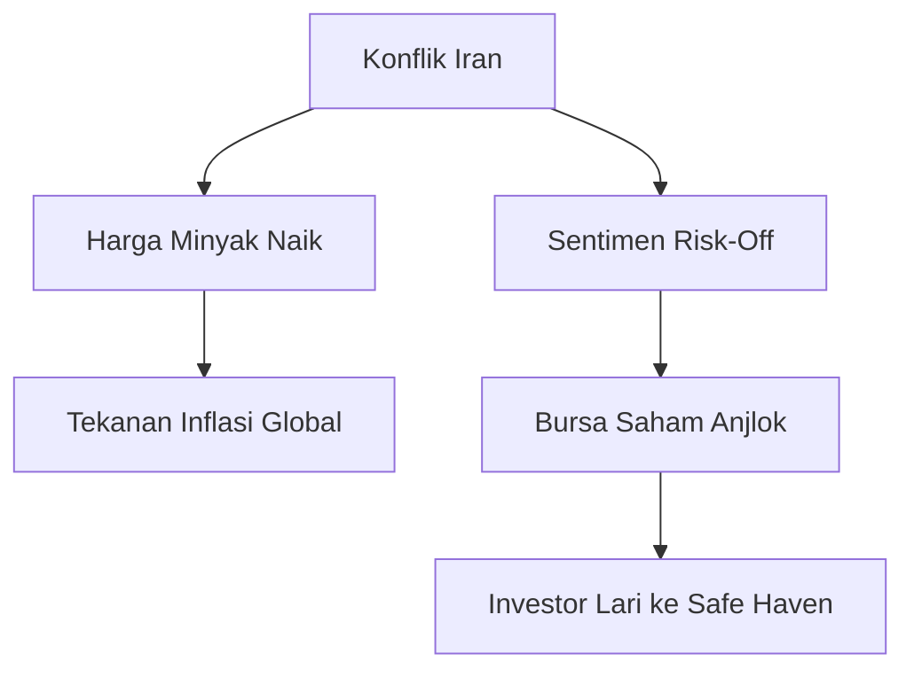

# WordPress Buka Pintu untuk Agen AI & Geopolitik Iran Memanas

> "Masa depan di mana AI bukan sekadar alat, tapi kolaborator aktif yang mampu mengelola konten secara mandiri telah tiba."

## ⚔️ Geopolitik / Konflik
Pasar global diguncang oleh ketegangan yang meningkat di Timur Tengah. Laporan terbaru mengindikasikan eskalasi konflik di wilayah Iran, yang memicu lonjakan harga minyak mentah dan tekanan jual di bursa saham Wall Street. S&P 500 dan Nasdaq mencatat penurunan signifikan karena kekhawatiran gangguan pasokan energi global.

## 🤖 AI & Teknologi
1. **WordPress Support untuk Agen AI:** WordPress.com kini secara resmi mendukung integrasi agen AI seperti Claude dan ChatGPT melalui protokol MCP. Ini memungkinkan agen AI untuk merancang, mengedit, dan menerbitkan postingan sebagai draf secara mandiri.
2. **Meta AI Moderation:** Meta mengumumkan rencana besar untuk mengganti ribuan kontraktor moderasi konten manusia dengan sistem AI otomatis dalam beberapa tahun ke depan untuk meningkatkan efisiensi dan keamanan platform.
3. **Microsoft MAI-Image-2:** Microsoft meluncurkan generasi kedua model generator gambarnya. Update ini membawa peningkatan drastis pada fotorealisme dan kemampuan render teks di dalam gambar yang lebih akurat di Copilot dan Bing.
4. **Samsung AI Chip Expansion:** Samsung berencana mengucurkan dana sebesar $73 miliar untuk memperluas produksi chip AI, bertujuan untuk menyaingi dominasi SK Hynix sebagai pemasok utama memori untuk Nvidia.
5. **Apple MacBook Ultra:** Rumor mengenai lini "MacBook Ultra" semakin kuat, diprediksi akan menggunakan layar OLED touchscreen dan fitur AI terintegrasi yang lebih dalam untuk menyaingi PC AI berbasis Windows.

## 🇮🇩 Indonesia
1. **Laptop AI di Indonesia:** Asus resmi meluncurkan Zenbook S14 OLED di pasar domestik, menjadi salah satu laptop pertama dengan NPU 50 TOPS yang siap melahap tugas AI lokal tanpa ketergantungan cloud.
2. **ChatGPT vs Kompetitor Lokal:** Tren penggunaan AI di Indonesia mulai menunjukkan pergeseran; meskipun ChatGPT masih dominan, pengguna mulai beralih ke alat AI spesialis untuk kebutuhan produktivitas tertentu.
3. **Penyaluran Pinjol AI:** Platform fintech Indonesia mulai memanfaatkan AI secara masif untuk melakukan penilaian risiko (scoring) guna menekan angka gagal bayar di kalangan Gen Z.

## 💹 Pasar & Ekonomi

### Bursa Global & Regional
| Indeks | Level | Perubahan |
| :--- | :--- | :--- |
| **S&P 500** | 6,506.48 | 🔴 -1.51% |
| **Nasdaq** | 21,647.61 | 🔴 -2.01% |
| **Dow Jones** | 45,577.47 | 🟢 +0.96% |
| **Nikkei 225** | 53,372.53 | 🔴 -3.38% |
| **Hang Seng** | 25,277.32 | 🔴 -0.88% |
| **IHSG** | 7,106.84 | 🟢 +1.20% |

### Komoditas & Mata Uang
| Komoditas | Harga | Perubahan |
| :--- | :--- | :--- |
| **Minyak WTI** | $98.09 | 🟢 +2.66% |
| **Minyak Brent** | $112.50 | 🟢 +3.54% |
| **Emas** | $4,488.72 | 🔴 -3.48% |
| **CPO (Palm Oil)** | 4,580 MYR | 🟢 +1.78% |
| **USD/IDR** | 16,585* | 🔴 Melemah |

*Catatan: Estimasi berdasarkan pergerakan pasar regional.*

### Kripto
| Aset | Harga | Status |
| :--- | :--- | :--- |
| **Bitcoin (BTC)** | $104,230 | 🟢 Outperforming |
| **Ethereum (ETH)** | $4,850 | 🟢 Stabil |

## 🔮 Prediksi & Outlook
Ketegangan geopolitik akan terus menjadi penggerak utama pasar dalam jangka pendek. Jika eskalasi berlanjut, harga minyak Brent berpotensi menembus level $120, yang akan memberikan tekanan inflasi tambahan bagi Indonesia. Strategi investasi saat ini adalah *defensive*, dengan fokus pada aset *safe haven* dan sektor energi.

## 📊 Ringkasan Angka Penting
- **$73 Miliar:** Komitmen Samsung untuk perang chip AI.
- **50 TOPS:** Standar minimum NPU untuk Laptop AI premium tahun 2026.
- **112.50:** Harga Brent (USD/Bbl) merespon tensi Timur Tengah.

## 🔖 Referensi
- [WordPress Blog: AI Agent Manage Content](https://wordpress.com/blog/2026/03/20/ai-agent-manage-content/)
- [The Verge: Meta AI Moderation](https://about.fb.com/news/2026/03/boosting-your-support-and-safety-on-metas-apps-with-ai/)
- [Microsoft News: MAI-Image-2](https://microsoft.ai/news/introducing-MAI-Image-2/)
- [Kompas Tekno: Laptop AI Asus Indonesia](https://tekno.kompas.com/read/2026/03/20/16020097/asus-zenbook-s14-oled-resmi-di-indonesia-ini-harganya)
- [Trading Economics: Commodities Live](https://tradingeconomics.com/commodities)
