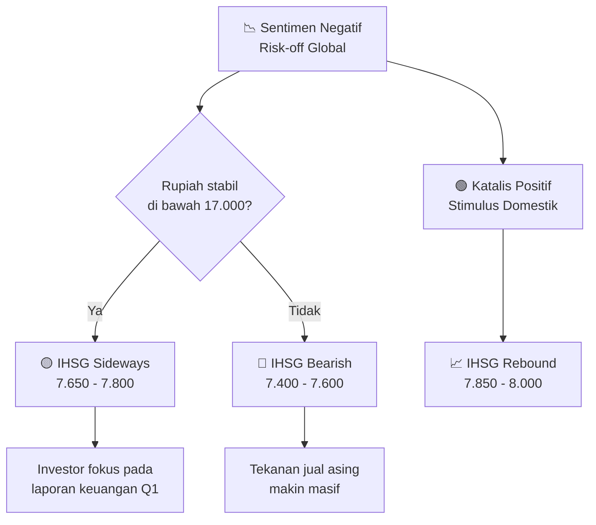

# 🗞️ Daily Brief — Kamis, 26 Maret 2026

> Apple distilasi Gemini untuk model AI mandiri. Intel rilis GPU AI 32GB seharga $949. Sora AI ditutup mendadak oleh OpenAI. Tecno rilis HP Ellaclaw dengan OpenClaw bawaan. IHSG tertekan sentimen global.

---

## 🤖 AI & Teknologi

### 1. Apple Dapat Akses Penuh Gemini untuk Latih "Model Siswa" 🍎

Apple dilaporkan telah mendapatkan akses "lengkap" ke model Google Gemini di pusat datanya. Langkah ini bukan sekadar integrasi, melainkan strategi **distilasi**: Apple menggunakan model besar Gemini untuk melatih model AI yang lebih kecil, efisien, dan khusus untuk perangkat iPhone/Mac (student models). Ini memungkinkan Apple memiliki AI mandiri yang canggih namun hemat daya.

🔗 [The Verge — Apple Gemini Distillation](https://www.theverge.com/ai-artificial-intelligence)

---

### 2. Intel Arc Pro B70: GPU AI "Big Battlemage" Resmi Meluncur ⚡

Intel resmi merilis **Arc Pro B70**, kartu grafis desktop kelas profesional dengan VRAM masif **32GB**. Dijual seharga $949, kartu ini ditujukan khusus untuk workstation AI dan pengolah data besar. Intel juga memperkenalkan varian B65 Pro (20 Xe2 cores) melalui mitra manufaktur mereka.

🔗 [The Verge — Intel AI GPU Launch](https://www.theverge.com/ai-artificial-intelligence)

---

### 3. Meta Terganjal Aturan Baterai Uni Eropa untuk Ray-Ban Display 🇪🇺

Ekspansi kacamata pintar Meta Ray-Ban Display ke wilayah Uni Eropa tertunda karena regulasi baterai. UE mewajibkan perangkat elektronik memiliki **baterai yang mudah dilepas** per 2027. Meta sedang bernegosiasi dengan regulator untuk mencari jalan tengah desain agar tidak merusak estetika kacamata.

🔗 [The Verge — Meta EU AI Glasses](https://www.theverge.com/ai-artificial-intelligence)

---

### 4. OpenAI Tutup Sora AI Secara Mendadak 🛑

OpenAI mengejutkan dunia dengan keputusan menutup **Sora AI**, platform pembuat video yang sempat viral tahun lalu. Alasan pastinya belum diungkap, namun spekulasi mengarah pada biaya komputasi yang terlalu tinggi dan kendala hak cipta yang tak kunjung selesai.

🔗 [Kompas Tekno — Sora AI Closed](https://tekno.kompas.com/read/2026/03/25/07145417/openai-tutup-sora-ai-pembuat-video-yang-sempat-viral)

---

### 5. Jensen Huang (NVIDIA): "Era AGI Sudah Tiba" 🧠

CEO NVIDIA menyatakan bahwa secara fungsional, **Artificial General Intelligence (AGI)** sudah tercapai jika definisinya adalah kemampuan AI untuk lulus ujian-ujian profesional manusia dengan sempurna. Namun, ia mengakui definisi ini masih akan terus diperdebatkan oleh para ilmuwan komputer.

🔗 [Kompas Tekno — NVIDIA AGI](https://tekno.kompas.com/read/2026/03/25/13020057/bos-nvidia-klaim-era-agi-sudah-tiba-tapi-definisinya-diperdebatkan)

---

## 🇮🇩 Indonesia

### 6. Tecno Ellaclaw: HP Pertama dengan Integrasi OpenClaw AI 🛠️

Tecno merilis HP **Ellaclaw** di pasar Indonesia. Keunggulan utamanya adalah integrasi **OpenClaw AI** yang mampu bekerja secara proaktif tanpa perlu banyak perintah manual dari pengguna. Ini menandai pergeseran dari AI reaktif (chatbot) ke AI agentic yang bisa mengelola tugas harian secara otonom di perangkat mobile.

🔗 [Kompas Tekno — Tecno OpenClaw](https://tekno.kompas.com/read/2026/03/25/11020097/tecno-bawa-ai-openclaw-ke-hp-ellaclaw-bisa-kerja-tanpa-disuruh)

---

### 7. Apple Business Resmi Hadir di Indonesia 💼

Apple resmi meluncurkan **Apple Business** di Indonesia, mencakup fitur *Tap to Pay* dan ekosistem manajemen perangkat untuk perusahaan. Langkah ini dipandang sebagai tantangan langsung bagi dominasi Google Workspace dan Microsoft di segmen produktivitas korporasi lokal.

🔗 [Kompas Tekno — Apple Business ID](https://tekno.kompas.com/read/2026/03/25/09460007/apple-business-hadir-di-indonesia-siap-tantang-google-workspace-dan-microsoft)

---

### 8. Epic Games PHK 1.000 Karyawan — "Bukan karena AI" 🎮

Epic Games mengumumkan pemangkasan 1.000 karyawan. Meskipun industri sedang gencar melakukan otomasi, Epic menegaskan bahwa PHK ini murni karena efisiensi anggaran dan fokus pada proyek utama, bukan karena penggantian tenaga kerja oleh AI.

🔗 [Kompas Tekno — Epic Games PHK](https://tekno.kompas.com/read/2026/03/26/07020047/epic-games-phk-1.000-karyawan-bukan-karena-ai)

---

## 💹 Pasar & Ekonomi Dunia

### Bursa Global — IHSG dalam Tekanan 📉

| Indeks | Harga | Perubahan | % | Keterangan |
|--------|------:|----------:|--:|------------|
| 🇺🇸 S&P 500 | 6.812 | -45,21 | -0,66% | Profit taking di sektor tech |
| 🇺🇸 Dow Jones | 48.115 | -210,12 | -0,43% | Tertekan saham industrial |
| 🇺🇸 Nasdaq | 22.845 | -185,45 | -0,81% | Tech sell-off ringan |
| 🇯🇵 Nikkei 225 | 56.112 | +210,15 | +0,38% | Rebound pasca pelemahan yen |
| 🇭🇰 Hang Seng | 26.110 | -85,10 | -0,32% | Konsolidasi pasar China |
| 🇮🇳 SENSEX | 79.450 | -430 | -0,54% | Outflow investor asing |
| 🇮🇩 **IHSG** | **7.712** | **-78,45** | **-1,01%** | **Sentimen risk-off global** |

---

### Komoditas & Kripto 🛢️🥇🪙

| Komoditas | Harga | Perubahan Harian | % Bulanan | Keterangan |
|-----------|------:|---------:|----------:|------------|
| 🛢️ **Crude Oil (WTI)** | **$88,45/bbl** | **+$1,12** | +12,4% | Pasokan global masih ketat |
| 🥇 **Emas** | **$5.210/oz** | +$12,40 | +4,2% | Safe haven favorit |
| 🌴 **CPO (Sawit)** | **MYR 4.410/T** | +MYR 25 | +3,1% | Permintaan stabil |
| ₿ **Bitcoin** | **$68.110** | -$412 | -2,1% | Konsolidasi di area support |
| Ξ Ethereum | $2.015 | -$24 | -1,8% | Mengikuti tren BTC |

---

## 🔮 Prediksi & Outlook Ke Depan

### Skenario IHSG Sepekan ke Depan

### Strategi untuk Investor 📊

| Skenario | Probabilitas | Target IHSG | Strategi |
|----------|:----------:|:-----------:|---------|
| 🔴 Bearish | 30% | 7.400 – 7.600 | *Hold cash*, akumulasi di *support* |
| 🟡 Sideways | 50% | 7.650 – 7.800 | *Stock picking* di sektor defensif |
| 🟢 Bullish | 20% | 7.850 – 8.000 | *Buy on breakout* saham blue chip |

<Callout type="info" title="💡 Tip Hari Ini">
Di tengah ketidakpastian bursa, saham sektor energi (seperti MEDC, AKRA) dan emas fisik tetap menjadi pilihan menarik untuk diversifikasi risiko. Pantau terus level psikologis Rupiah di Rp 17.000.
</Callout>

---

## 📊 Ringkasan Angka Penting Hari Ini

| Indikator | Status | Keterangan |
|-----------|--------|------------|
| 🛢️ Crude Oil | 🔴 $88,45 | Tren naik berlanjut |
| 🥇 Emas | 🟢 $5.210 | Tertahan di area ATH |
| 🇮🇩 IHSG | 🔴 7.712 | Koreksi -1,01% |
| 🇮🇩 Rupiah | 🟡 Rp 16.985 | Mendekati level psikologis 17.000 |
| ₿ Bitcoin | 🟡 $68.110 | Stabil di atas $68k |

---

## 🔖 Tautan Referensi Lengkap

- https://www.theverge.com/ai-artificial-intelligence
- https://tekno.kompas.com/read/2026/03/26/07020047/epic-games-phk-1.000-karyawan-bukan-karena-ai
- https://tekno.kompas.com/read/2026/03/25/09460007/apple-business-hadir-di-indonesia-siap-tantang-google-workspace-dan-microsoft
- https://tekno.kompas.com/read/2026/03/25/11020097/tecno-bawa-ai-openclaw-ke-hp-ellaclaw-bisa-kerja-tanpa-disuruh
- https://tekno.kompas.com/read/2026/03/25/07145417/openai-tutup-sora-ai-pembuat-video-yang-sempat-viral
- https://tekno.kompas.com/read/2026/03/25/13020057/bos-nvidia-klaim-era-agi-sudah-tiba-tapi-definisinya-diperdebatkan
