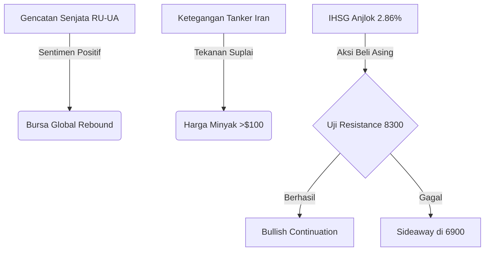

# AI Daily Brief: Meta 'Miserable' & Gencatan Senjata Rusia-Ukraina

> "Dunia AI hari ini: Antara efisiensi masif, tekanan manusia, dan secercah harapan perdamaian di Eropa Timur."

## ⚔️ Geopolitik / Konflik
*   **Rusia-Ukraina (Gencatan Senjata 3 Hari):** Presiden Donald Trump mengumumkan kesepakatan gencatan senjata sementara selama 3 hari antara Rusia dan Ukraina, termasuk pertukaran **1.000 tahanan**.
*   **Ketegangan AS-Iran:** Iran menangkap kapal tanker minyak di Teluk Oman; Militer AS membalas dengan melumpuhkan dua kapal tanker Iran, menunjukkan rapuhnya stabilitas jalur energi.
*   **Era Baru Hungaria:** Peter Magyar resmi dilantik sebagai Perdana Menteri Hungaria, mengakhiri era Viktor Orban dan diprediksi mengubah arah kebijakan luar negeri terhadap NATO/Uni Eropa.

## 🤖 AI & Teknologi
*   **Krisis Budaya Kerja Meta:** Karyawan dilaporkan merasa sangat tertekan ("miserable") karena tekanan masif untuk meluncurkan ribuan agen AI di tengah ancaman PHK 10% staf.
*   **Mozilla & Claude Mythos:** Audit keamanan Firefox berhasil mengidentifikasi dan memperbaiki 271 bug menggunakan model **Claude Mythos Preview**.
*   **PHK Cloudflare:** Pemutusan hubungan kerja terhadap 1.100 karyawan dilakukan seiring peningkatan penggunaan AI sebesar 600% yang membuat banyak peran administratif menjadi usang.
*   **Inovasi Medis MIT:** MIT merilis model AI pertama yang dirancang khusus untuk deteksi dini pencegahan Alzheimer.
*   **Ekspansi Nvidia:** Nvidia menggelontorkan lebih dari **$40 miliar** tahun ini sebagai investor ekuitas di berbagai ekosistem startup AI global.
*   **Chrome Integration:** OpenAI resmi merilis ekstensi Codex untuk Chrome, membawa kemampuan AI langsung ke dalam aplikasi web yang sedang digunakan.

## 🇮🇩 Indonesia
*   **ASUS Copilot+ PC:** Resmi meluncur di pasar Indonesia dengan integrasi asisten Omni virtual dan performa AI tingkat tinggi untuk produktivitas lokal.
*   **Pusat Inovasi AI ITB:** Kolaborasi ITB dan Telkomsel resmi membuka pusat inovasi AI untuk memperkuat talenta digital nasional.
*   **Strategi Komunikasi Istana:** Pemerintah berencana merangkul "homeless media" untuk menjangkau audiens generasi muda di platform digital.
*   **Ekspansi Startup AI RI:** Startup AI lokal menjalin kemitraan dengan Crawford Software untuk menembus pasar Amerika Serikat.

## 💹 Pasar & Ekonomi

### 🌍 Bursa Global & Regional
| Indeks | Nilai | Perubahan |
| :--- | :--- | :--- |
| S&P 500 | 7.398,93 | +0,84% |
| Nasdaq | 26.247,08 | +1,71% |
| Dow Jones | 49.609,16 | +0,02% |
| Nikkei 225 | 62.713,65 | -0,19% |
| Hang Seng | 26.393,71 | -0,87% |
| **IHSG (JCI)** | **6.969,40** | **-2,86%** |

### 🛢️ Komoditas (Live)
| Komoditas | Harga | Perubahan |
| :--- | :--- | :--- |
| Crude Oil (WTI) | $ 95,42 | +0,64% |
| Brent Oil | $ 101,29 | +1,23% |
| Emas (Gold) | $ 4.715,85 | +0,63% |
| CPO (Palm Oil) | RM 4.541 | +0,31% |

### 💱 Mata Uang & Kripto
| Pair | Nilai | Perubahan |
| :--- | :--- | :--- |
| USD/IDR | Rp 17.377,45 | +0,18% |
| EUR/USD | 1,0840 | 0,00% |
| Bitcoin (BTC) | $ 80.667 | 0,00% |

### 🔮 Prediksi & Outlook

**Analisis Dampak untuk Indonesia:**
Penurunan IHSG yang tajam (2,86%) merupakan peluang akumulasi bagi investor jangka panjang, mengingat aliran dana asing (*Foreign Inflow*) tetap masuk ke saham perbankan besar seperti BBRI dan BBCA senilai Rp 11 triliun. Namun, pelemahan Rupiah ke level Rp 17.377 patut diwaspadai karena dapat meningkatkan beban impor energi.

**Strategi IHSG:**
| Skenario | Probabilitas | Strategi |
| :--- | :--- | :--- |
| Bearish (Lanjut ke 6800) | 20% | *Wait and See*, perkuat *cash* |
| Sideways (Konsolidasi 6900-7100) | 50% | *Buy on Weakness* saham Bluechip |
| Bullish (Uji Resistance 8300) | 30% | *Trading Buy* pada sektor Teknologi |

## 📊 Ringkasan Angka Penting
*   **Rp 1.529 Triliun:** Anggaran prioritas nasional Prabowo 2027.
*   **$ 40 Miliar:** Total investasi ekuitas Nvidia di startup AI tahun ini.
*   **271:** Jumlah bug Firefox yang ditemukan oleh Claude AI.

## 🔖 Referensi
*   [The Verge - AI News](https://www.theverge.com/ai-artificial-intelligence)
*   [TechCrunch - Cloudflare Layoffs](https://techcrunch.com/2026/05/09/cloudflare-ai-layoffs/)
*   [Katadata - Geopolitik & Nasional](https://katadata.co.id/)
*   [CNBC Indonesia - Market Analysis](https://www.cnbcindonesia.com/market)
*   [Google Finance - Market Data](https://www.google.com/finance)
