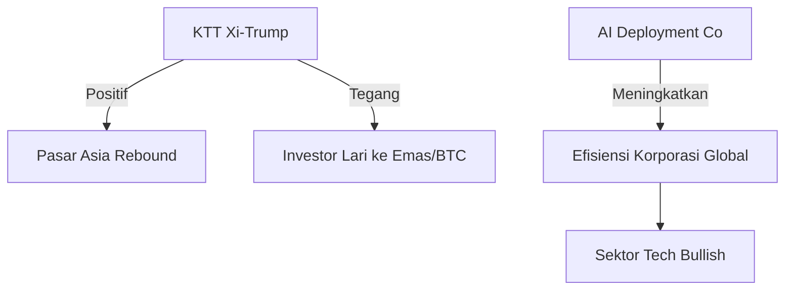

# 🧭 12 Mei 2026: "The Age of Industrial AI Deployment"

> "Transisi dari model eksperimental ke integrasi infrastruktur industri menandai babak baru persaingan teknologi global."

---

## ⚔️ Geopolitik & Konflik
- **KTT Xi-Trump di Beijing:** Presiden Xi Jinping dan Donald Trump dijadwalkan bertemu di Beijing untuk KTT dua hari guna membahas perbedaan perdagangan dan kebijakan teknologi. Beijing menyatakan kesiapan untuk mengelola perbedaan secara strategis.
- **Take It Down Act Mulai Berlaku:** Regulasi AS yang mewajibkan platform menghapus gambar intim tanpa konsensus dalam 48 jam mulai diberlakukan penuh pekan depan, menandai pengetatan pengawasan terhadap deepfake AI.

## 🤖 AI & Teknologi
- **OpenAI Luncurkan "OpenAI Deployment Company":** Dengan pendanaan awal $4 miliar dan valuasi $10 miliar, entitas ini fokus membantu perusahaan membangun dan menerapkan sistem AI kustom. Strategi ini mempertegas pergeseran OpenAI menuju model bisnis enterprise yang masif.
- **Kesaksian Satya Nadella (Musk v. Altman):** CEO Microsoft mengungkap bahwa kebutuhan komputasi Azure untuk OpenAI selalu melebihi proyeksi awal, menggambarkan betapa "laparnya" model AI modern terhadap sumber daya.
- **GPT-5.5-Cyber & Codex Security:** OpenAI mulai mengintegrasikan model khusus keamanan siber untuk melindungi infrastruktur kritis dari serangan berbasis AI yang makin canggih.
- **Meta & Isu Data Pelatihan:** Laporan internal menyebut Meta menggunakan pelacakan aktivitas komputer karyawan untuk mengumpulkan data pelatihan AI, yang memicu keresahan dan potensi PHK 10% staf bulan ini.

## 🇮🇩 Indonesia
- **Akademi AI & Robotik BSD City:** Kerja sama antara PT Bumi Serpong Damai dan PT ASIX Indonesia Cerdas resmi diluncurkan untuk membangun pusat riset dan pelatihan AI terintegrasi di kawasan BSD.
- **Inovasi Deteksi Anemia UMM:** Universitas Muhammadiyah Malang merilis aplikasi AI yang mampu mendeteksi gejala anemia melalui pemindaian mata, sebuah terobosan kesehatan digital lokal.
- **Kadin & Aksesibilitas Teknologi:** Kadin mendorong pemerataan infrastruktur digital agar UMKM di daerah tidak tertinggal dalam gelombang otomasi AI.

## 💹 Pasar & Ekonomi

### Bursa Global & Regional
| Indeks | Harga | Perubahan |
| :--- | :--- | :--- |
| S&P 500 | 7,412.85 | +0.19% |
| Dow Jones | 49,704.48 | +0.19% |
| Nasdaq | 26,274.13 | +0.10% |
| Nikkei 225 | 63,088.00 | +1.07% |
| **IHSG** | **6,905.62** | **-0.92%** |

### Mata Uang & Komoditas
- **USD/IDR:** Berada di kisaran stabil namun waspada terhadap penguatan Dollar pasca sinyal suku bunga AS.
- **Minyak WTI:** Diperdagangkan di kisaran $82/barel (estimasi pasar Jun 26).
- **Emas (GC=F):** Bertahan di level tinggi sebagai aset *safe haven* di tengah volatilitas pasar saham.

### Kripto
| Aset | Harga | Perubahan |
| :--- | :--- | :--- |
| Bitcoin (BTC) | $181,580 | +0.29% |
| Ethereum (ETH) | $22,333 | -0.57% |
| XRP | $41.48 | +1.90% |

---

## 🔮 Prediksi & Outlook
Secara teknikal, IHSG mengalami tekanan jual (*strong sell* signal) seiring pelemahan di beberapa sektor kunci. Investor cenderung *wait and see* menunggu hasil KTT Xi-Trump yang bisa berdampak pada stabilitas pasar Asia.

## 📊 Ringkasan Angka Penting
- **$14 Miliar:** Valuasi OpenAI Deployment Co.
- **6,905:** Level support kritis IHSG saat ini.
- **$181K:** Level psikologis baru Bitcoin.

---

## 🔖 Referensi
- [The Verge AI News](https://www.theverge.com/ai-artificial-intelligence)
- [Antara News - Kecerdasan Buatan](https://www.antaranews.com/tag/kecerdasan-buatan)
- [OpenAI Blog](https://openai.com/news/)
- [TradingView Market Data](https://www.tradingview.com/markets/indices/)

---
