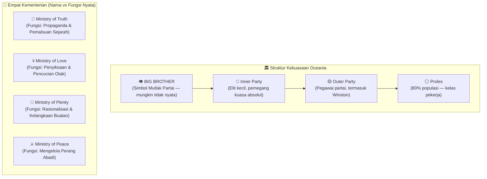
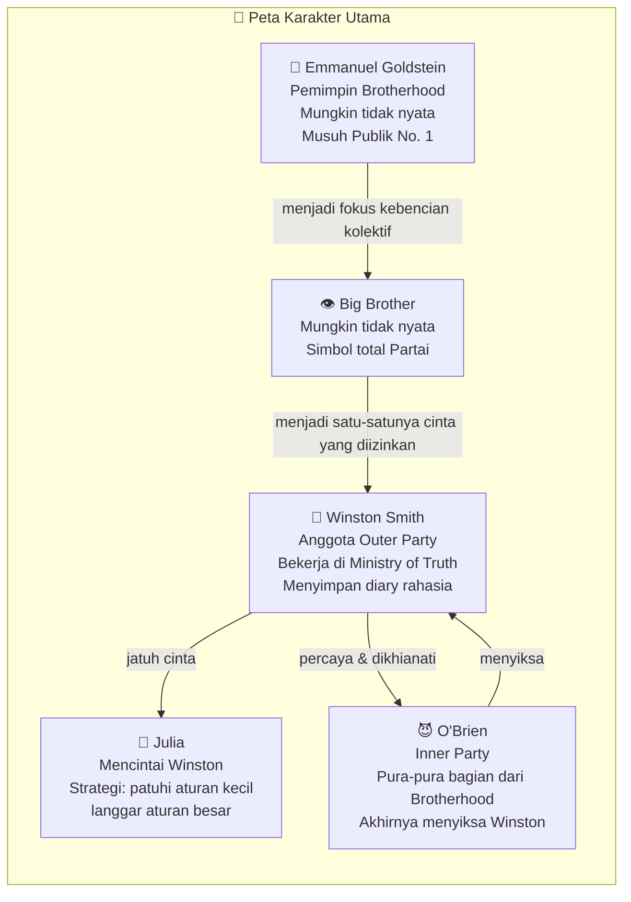
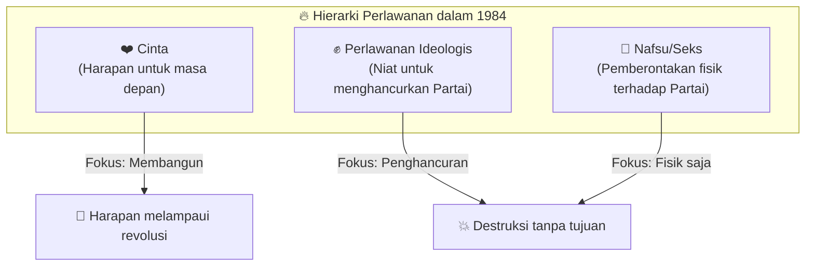
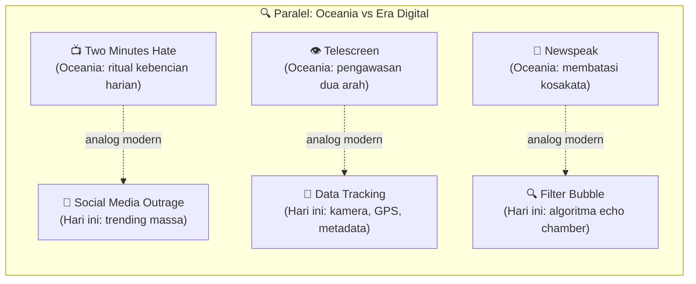
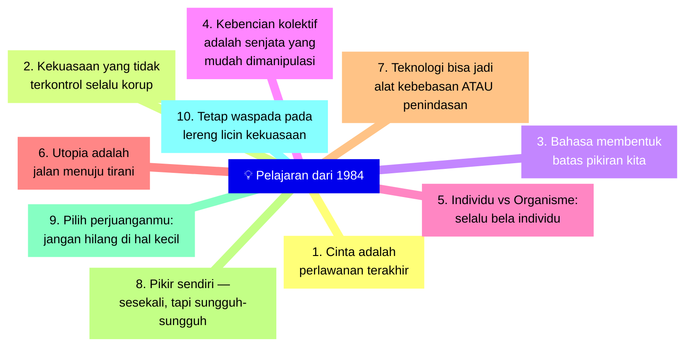

## Pembuka: Kebenaran yang Menolak Mati 🕯️

> *"There was truth, and there was untruth. And if you clung to the truth, even against the whole world, you were not mad."*
>
> — George Orwell, *1984*

Sedikit sekali novel yang mampu bertahan selama hampir delapan dekade dan tetap terasa seperti cermin untuk zaman sekarang. *1984* karya George Orwell adalah salah satunya. Buku ini telah diterjemahkan ke lebih dari 65 bahasa, terjual lebih dari 30 juta eksemplar, dilarang di puluhan negara otoriter — termasuk di bawah rezim Stalin, dan bahkan serecently 2022 di Belarus.

Namun yang paling menakjubkan bukanlah angka-angka tersebut, melainkan fakta bahwa istilah-istilah yang Orwell ciptakan kini menjadi bagian dari kamus dunia: **Big Brother** (kakak sulung yang mengawasi), **Thoughtcrime** (kejahatan pikiran), **Doublethink** (berpikir ganda yang kontradiktif), **Newspeak** (bahasa yang dirancang membatasi pikiran), dan kata sifat **Orwellian** sendiri — yang ironinya sering dipakai untuk menggambarkan hal-hal yang persis ingin dicegah oleh Orwell.

Artikel ini mengeksplorasi *1984* melalui lens intelektual Lex Fridman — ilmuwan AI dan podcaster ternama yang berbagi pemikirannya secara mendalam tentang buku ini. Bukan sekadar ringkasan plot, melainkan sebuah perjalanan filosofis ke dalam pertanyaan paling fundamental: *Apa yang tersisa dari kemanusiaan ketika negara menguasai segalanya?*

<Callout type="abstract" title="Sumber Kajian">
Artikel ini didasarkan pada ulasan *1984* oleh Lex Fridman: [1984 by George Orwell | Lex Fridman](https://www.youtube.com/watch?v=7Sk6lTLSZcA). Bacaan direkomendasikan: novel *1984* karya George Orwell (1949).
</Callout>

---

## Bagian I: Dunia Oceania — Anatomi Negara Totaliter 🏛️

*1984* berlatar di masa depan dystopian: sebuah negara-super bernama **Oceania**, dikuasai sepenuhnya oleh partai politik totaliter bernama **Ingsoc** (*English Socialism* / Sosialisme Inggris). Di puncak kekuasaan berdiri **Big Brother** — figur yang mungkin nyata, mungkin pula hanya simbol. Yang pasti: *ia ada di mana-mana*.

Yang paling mengerikan dari Oceania bukan sekadar tiranis militernya, melainkan cara ia **menguasai realitas itu sendiri**. Empat kementerian menjalankan kontrol ini:

- **Ministry of Truth (*Minitrue*):** Bukan menyebarkan kebenaran, tapi secara aktif *memalsukan* sejarah sesuai kebutuhan partai saat ini. Winston bekerja di sini, tugasnya menulis ulang artikel lama agar konsisten dengan kebijakan partai hari ini.
- **Ministry of Love (*Miniluv*):** Bukan tentang kasih sayang, tapi tentang penyiksaan fisik dan psikologis untuk menghancurkan individualitas. Di sinilah Room 101 berada.
- **Ministry of Plenty (*Miniplenty*):** Bukan tentang kemakmuran, tapi rasionalisasi — mengelola kelangkaan sambil meyakinkan rakyat bahwa mereka hidup lebih baik dari sebelumnya.
- **Ministry of Peace (*Minipax*):** Bukan perdamaian, melainkan pengelolaan perang yang tak pernah berakhir — sebagai mekanisme kontrol sosial dan distribusi sumber daya.

> 💡 **Satu prinsip Orwell yang paling menusuk:** *"War is Peace. Freedom is Slavery. Ignorance is Strength."*

Ini adalah **Doublethink** — kemampuan yang dipaksakan untuk memegang dua keyakinan yang saling bertentangan sekaligus, dan menerima keduanya sebagai kebenaran.

---

## Bagian II: Karakter Utama — Manusia-Manusia di Bawah Mesin 👤

**Winston Smith** adalah protagonis yang memulai sebuah pemberontakan kecil: ia menyimpan buku harian. Di dunia Oceania, tindakan ini saja sudah merupakan *Thoughtcrime* yang bisa berujung kematian. Winston sadar bahwa sejarah sedang dipalsukan — ia bahkan yang melakukannya — namun tetap berani menyimpan memorinya sendiri.

**Julia** adalah karakter yang kontras dengan Winston. Ia bukan pemberontak ideologis; ia pragmatis. Strateginya: *patuhi semua aturan kecil, agar bisa melanggar aturan yang besar*. Ia menghadiri semua rapat partai, mengenakan pita merah anti-seks, dan berpura-pura menjadi anggota partai yang patuh — sementara di baliknya ia menjalani kehidupan yang penuh dengan hasrat manusiawi yang terlarang.

**O'Brien** adalah karakter paling kompleks dan paling mengerikan. Ia meyakinkan Winston bahwa ia adalah bagian dari Brotherhood (*perlawanan bawah tanah*), memberikan buku terlarang karya Goldstein, dan membangun kepercayaan selama bertahun-tahun — hanya untuk akhirnya menjadi penyiksa Winston di ruang bawah tanah Ministry of Love.

---

## Bagian III: Senjata Partai — Mengontrol Pikiran dan Realitas 🧠

Orwell merancang beberapa mekanisme kontrol yang jauh lebih canggih dari sekadar polisi dan penjara:

### 1. Newspeak — Membunuh Pikiran dengan Membunuh Kata 📝

*Newspeak* adalah bahasa yang dirancang bukan untuk mempermudah komunikasi, melainkan **untuk mempersempit jangkauan pikiran**. Logikanya sederhana: jika kata untuk "kebebasan" tidak ada, maka konsep kebebasan pun tidak bisa terpikirkan.

Setiap tahun, kamus Newspeak semakin *tipis* — bukan semakin tebal. Kata-kata dihilangkan satu per satu. Kata-kata sinonim dihapus karena "tidak efisien". Kata-kata nuansa (*gradasi makna*) dilebur menjadi satu kata. "Baik" dan "sangat baik" diganti dengan "baik" dan "plusbaik" (*plusgood*).

**Relevansinya hari ini:** Kita hidup di era di mana bahasa terus disederhanakan, di mana karakter 280 huruf menggantikan esai, di mana *emoji* menggantikan kata-kata. Bukan karena ada konspirasi — tapi karena kenyamanan. Pertanyaannya: apakah kenyamanan bahasa yang semakin sederhana itu mengikis kemampuan kita berpikir kompleks?

### 2. Doublethink — Logika yang Menelan Dirinya Sendiri 🔄

*Doublethink* (berpikir ganda) adalah kemampuan memegang dua keyakinan yang saling bertentangan *sekaligus*, sambil mengetahui keduanya bertentangan, tapi tetap menerimanya sebagai kebenaran.

Contohnya: karyawan Ministry of Truth yang tahu bahwa ia sedang memalsukan sejarah, sekaligus percaya bahwa versi yang sudah dipalsukan itu memang benar sejak awal. Ia tidak berbohong dalam arti konvensional — ia benar-benar percaya pada dua hal yang mustahil secara bersamaan.

### 3. Telescreen dan Two Minutes Hate 📺

*Telescreen* adalah layar dua arah yang tidak bisa dimatikan. Ia memantau setiap gerakan, setiap ekspresi wajah (*facecrime* — kejahatan yang terungkap dari ekspresi wajah). Tidak ada ruang privat. Tidak ada momen sendirian.

*Two Minutes Hate* adalah ritual harian di mana seluruh warga diwajibkan berkumpul dan melampiaskan kebencian kolektif pada musuh negara (biasanya wajah Goldstein di layar). Yang mengerikan bukan bahwa ini diwajibkan — tapi bahwa setelah 30 detik, *tidak ada orang yang bisa menolak untuk terhanyut*.

Kutipan Orwell yang paling mengerikan soal ini:

> *"A hideous ecstasy of fear and vindictiveness, the desire to kill, to torture, to smash faces in with a sledgehammer seemed to flow through the whole group of people like an electric current, turning one even against one's will into a grimacing, screaming lunatic."*

---

## Bagian IV: Refleksi Lex Fridman — Cinta sebagai Perlawanan Terakhir ❤️

Lex Fridman, dalam ulasannya, menemukan satu tema sentral yang menurutnya paling kuat: **Cinta (*Love*) sebagai tindakan revolusioner terakhir**.

Ketika kemampuan berbicara dibatasi, ketika kemampuan berpikir rasional dimanipulasi, ketika sejarah ditulis ulang — *apa yang paling sulit dirampas?* Menurut Lex: **cinta untuk sesama manusia, dan cinta untuk kehidupan itu sendiri.**

Momen paling sederhana namun paling revolusioner dalam novel ini adalah ketika Julia menyelipkan selembar kertas ke tangan Winston. Kertas itu hanya berisi tiga kata: ***"I love you."***

Di dunia Oceania, tiga kata itu adalah tindakan subversif yang lebih berbahaya dari bom.

Lex membedakan dengan tajam antara **seks sebagai pemberontakan** dan **cinta sebagai harapan**. Winston dalam novel ini cenderung memaknai seks dengan Julia sebagai tindakan politik: *"Their embrace had been a battle, the climax a victory."*

Tapi Lex berpendapat bahwa reduksi hubungan manusia menjadi semata-mata perlawanan politis adalah berbahaya — karena obsesi pada penghancuran tanpa impian tentang apa yang akan dibangun setelahnya, bisa menghasilkan kekacauan baru yang tidak lebih baik dari yang dihancurkan.

> *"Cinta adalah hal mendasar yang menghubungkan kita semua, yang memungkinkan kita membangun masyarakat yang lebih baik setelah negara totaliter digulingkan."*
> — Lex Fridman

---

## Bagian V: Kekuasaan sebagai Tujuan Itu Sendiri ⚡

Salah satu monolog paling menggetarkan dalam literatur modern adalah ketika O'Brien menjelaskan tujuan sejati Partai kepada Winston yang sedang disiksa:

> *"The real power, the power we have to fight for night and day, is not power over things, but power over men. Power is inflicting pain and humiliation. Power is in tearing human minds to pieces and putting them together again in new shapes of your own choosing. Power is not a means, it is an end. One does not establish a dictatorship in order to safeguard a revolution. One makes the revolution in order to establish a dictatorship. The object of persecution is persecution. The object of torture is torture. The object of power is power."*

Ini adalah titik di mana *1984* berbeda dari novel dystopia lainnya. Kebanyakan rezim jahat dalam fiksi memiliki tujuan akhir — utopia, kemakmuran, kemuliaan bangsa. Tapi Oceania tidak. Partai tidak menginginkan kebahagiaan rakyat. Ia menginginkan **penderitaan yang abadi** sebagai bukti kekuasaan absolutnya.

O'Brien bahkan menggunakan analogi biologis yang sangat disturbing: **masyarakat sebagai organisme**. Individu seperti sel tubuh. Pembersihan massal (*great purges*), penyiksaan, dan pembunuhan seperti memotong kuku — tidak relevan selama organisme secara keseluruhan bertahan.

Ini adalah logika yang sama yang digunakan oleh Stalin: *"untuk membuat omelet, kamu harus memecahkan beberapa telur."* Dan inilah yang membuat devaluasi manusia sebagai individu menjadi bahaya paling fundamental — karena begitu kamu tidak lagi melihat seseorang sebagai manusia yang setara, semua kekejian menjadi *logis*.

---

## Bagian VI: Kebencian Kolektif dan Media Sosial Hari Ini 📱

Lex Fridman secara eksplisit berhati-hati untuk tidak *overclaim* — ia tidak mengatakan kita sudah hidup di dunia *1984*. Tapi ia mengidentifikasi satu paralel yang sangat kuat: **Two Minutes Hate sebagai karikatur dari apa yang terjadi di media sosial hari ini**.

Ketika seseorang menjadi *target* di Twitter/X, TikTok, atau platform manapun, yang terjadi hampir sama dengan ritual Two Minutes Hate: gelombang kemarahan kolektif yang tidak perlu dikuasai, tidak perlu dipikirkan, dan bisa diarahkan ke target mana pun dalam hitungan menit.

Yang membuat ini mengerikan adalah mekanisme psikologisnya: kemarahan itu terasa *benar*, terasa *adil*, terasa *bersatu*. Ia memberikan *rush* yang sama seperti yang digambarkan Orwell — *"a hideous ecstasy."*

> **Tanggung jawab kita:** Menciptakan teknologi yang membantu kita *melawan* kecenderungan ini, bukan mengeksploitasinya.

---

## Bagian VII: Room 101 — Menghancurkan Harapan Terakhir 🐀

Di ujung novel, Winston dibawa ke *Room 101* — ruangan yang berisi satu hal: ketakutan terdalam masing-masing individu. Bagi Winston, itu adalah tikus.

O'Brien mengancam akan menempelkan sangkar berisi tikus pada wajah Winston — dan pada momen itu, Winston melakukan hal yang tidak pernah ia bayangkan: ia meminta O'Brien untuk *melakukannya kepada Julia, bukan kepada dirinya*.

Itulah titik penghancuran yang sesungguhnya. Bukan bahwa Winston menderita, tapi bahwa **ia mengorbankan orang yang paling ia cintai untuk menyelamatkan dirinya sendiri**. Dan pengetahuan tentang apa yang ia katakan itu — tidak bisa dihapus, tidak bisa diralat. Ia menghancurkan kepercayaannya sendiri pada cinta.

Inilah tujuan akhir Partai: bukan mengubah tubuh atau kata-kata seseorang, tapi **mengubah batinnya sehingga yang tersisa hanyalah apati dan cinta untuk Big Brother**.

Lex mempertanyakan apakah ini benar-benar mungkin secara permanen. Ia berargumen bahwa ia *"tidak bisa membayangkan nyala cinta di hati manusia bisa dipadamkan sepenuhnya melalui penyiksaan."* Ia merujuk pada *Man's Search for Meaning* karya Viktor Frankl — tentang bagaimana manusia menemukan makna bahkan di kamp konsentrasi Nazi.

---

## Bagian VIII: Catatan Harapan — Appendix Newspeak 🌅

Ada satu detail kecil yang sering diabaikan pembaca, namun menyimpan pesan terpenting novel ini: **appendix** (*lampiran*) tentang Newspeak ditulis dalam *past tense* (waktu lampau), dalam bahasa Inggris biasa — bukan Newspeak.

Artinya: dari perspektif narrator appendix tersebut, **Oceania sudah jatuh**. Newspeak sudah menjadi bagian dari sejarah lama, bukan kenyataan saat ini.

Ini adalah pesan harapan yang tersembunyi di balik dystopia yang tampaknya tanpa jalan keluar: bahkan negara totaliter yang sempurna pun pada akhirnya akan runtuh.

---

## Bagian IX: 10 Pelajaran dari 1984 yang Relevan Hari Ini 📚

1. **Cinta adalah tindakan revolusioner** — bukan kelemahan.
2. **Semua ideologi bisa korup** — termasuk yang mengklaim paling mulia.
3. **Bahasa adalah medan perang** — siapa yang mengontrol kata, mengontrol pikiran.
4. **Kebencian kolektif adalah candu** — dan sangat mudah dimanipulasi.
5. **Individu tidak boleh dikorbankan demi "organisme"** — setiap manusia punya nilai intrinsik.
6. **Utopia adalah bahaya** — sempurna hanya ada jika kamu menghancurkan kemanusiaan.
7. **Teknologi adalah pedang bermata dua** — berjuanglah agar ia tetap menjadi alat kebebasan.
8. **Pikir secara independen** — sesekali, tapi sungguh-sungguh. Pertanyakan asumsimu.
9. **Pilih perjuanganmu** — seperti Julia: patuhi hal kecil, fokus pada kemenangan besar.
10. **Waspada pada lereng licin** — kekuasaan yang terpusat selalu berpotensi menjadi Oceania.

---

## Penutup: Apakah Kita Sudah Hidup di 1984? 🌍

Jawaban Lex Fridman jelas: **tidak**. Kita belum hidup di Oceania. Dan menyamakan setiap kebijakan yang tidak kita suka dengan "Orwellian" hanya melemahkan kemampuan kita untuk mengenali bahaya yang sesungguhnya ketika ia datang.

Tapi ada elemen-elemen yang perlu diwaspadai:
- Pengawasan massal yang semakin canggih
- Perang yang dijadikan alat kontrol populasi
- Bahasa yang disederhanakan hingga mengurangi nuansa berpikir
- Kebencian kolektif yang dikatalisis oleh algoritma media sosial
- Pemimpin yang lebih dijadikan *simbol* daripada manusia

*1984* bukan buku ramalan. Ia adalah **cermin**. Dan cermin terbaik bukan yang menunjukkan kita seperti apa, tapi yang menunjukkan ke mana kita bisa jatuh jika kita lengah.

Selama masih ada manusia yang berani menyimpan kebenaran di dalam hatinya — meski melawan seluruh dunia — selama itulah harapan belum mati.

---

*Artikel ini berkaitan erat dengan <WikiLink to="outwitting-the-devil-napoleon-hill-mengalahkan-iblis" label="Outwitting the Devil: Napoleon Hill & Bahaya Menjadi Drifter" /> yang membahas bagaimana kekuatan eksternal memanipulasi pikiran manusia, serta <WikiLink to="ngaji-filsafat-379-socrates-mengenali-diri" label="Ngaji Filsafat 379: Socrates dan Pentingnya Mengenali Diri" /> yang relevan dengan tema berpikir independen sebagai perlawanan terhadap tirani.*
