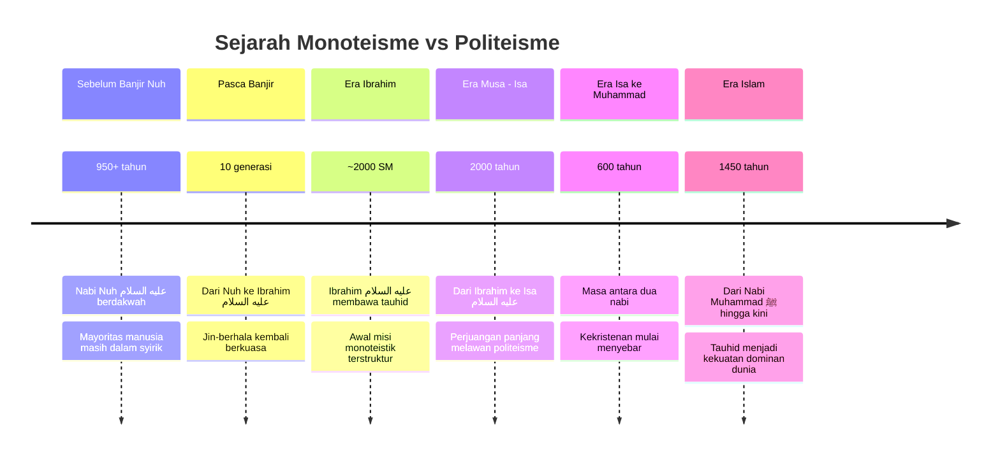

## Pembuka: Pertanyaan yang Selalu Mengganjal 🤔

Pernahkah Mas atau Mbak bertanya-tanya — dengan rasa heran yang jujur — *mengapa* nenek moyang manusia menyembah batu, kayu, dan patung?

Kita yang hidup di abad ke-21 ini sering merasa superior. *"Ah, mereka bodoh. Mana mungkin batu bisa mendengar doa?"* Kita mentertawakan tradisi lama itu sambil minum kopi pagi dan scrolling timeline. Mudah sekali.

Tapi ada pertanyaan yang lebih tajam dan lebih jujur: **Apakah memang tidak ada realitas di balik semua itu?**

Jawabannya — dan ini yang mengejutkan — adalah: **ada.**

Patung itu sendiri memang tidak nyata, tidak punya kekuatan apa-apa. Tapi realitas di *belakang* patung itu? Itu adalah soal lain sama sekali.

---

## Bagian 1: Iblis Bukan Sekadar Dongeng — Ia Adalah Pengganggu Nyata 👁️

<Callout type="warning" title="Perspektif Penting">
Tulisan ini membahas topik ini dari perspektif Islam dan kerangka teologi monoteistik. Referensinya adalah Al-Qur'an, kisah para nabi, dan penjelasan para ulama.
</Callout>

Dalam perspektif Islam, realitas di balik penyembahan berhala adalah **setan dan jin**. Bukan metafora. Bukan dongeng. Mereka adalah makhluk nyata yang hidup *di antara* manusia, tak kasat mata, dan punya agenda yang sangat jelas: **menyesatkan.**

Allah ﷻ mengisahkan janji Iblis secara eksplisit di dalam Al-Qur'an:

> *"Iblis berkata, 'Karena Engkau telah menghukumku tersesat, aku benar-benar akan (menghalang-halangi) mereka dari jalan-Mu yang lurus. Kemudian aku akan mendatangi mereka dari depan dan dari belakang, dari kanan dan dari kiri mereka...'"*
> — (QS. Al-A'raf: 16-17)

Dan Iblis punya satu senjata utama yang paling efektif sepanjang sejarah: **ketidaktampakan.**

> *"Sesungguhnya ia (Iblis) dan pengikut-pengikutnya melihat kamu dari suatu tempat yang kamu tidak bisa melihat mereka..."*
> — (QS. Al-A'raf: 27)

Di sinilah kunci dari seluruh drama penyembahan berhala itu dimulai. 🔑

---

## Bagian 2: Jin Sebagai "Preman Tak Kasat Mata" — Analogi yang Mengena 😈

Bayangkan sebuah analogi sederhana namun gelap:

Anda tinggal di sebuah kampung terpencil. Ada seseorang yang tidak bisa Anda lihat — tapi ia bisa memukul Anda, menakut-nakuti keluarga Anda, membuat ternak Anda mati, dan mendatangkan mimpi buruk setiap malam. **Anda tidak bisa melihatnya. Tidak bisa memukulnya balik. Tidak tahu di mana ia bersembunyi.**

Apa yang Anda lakukan?

Kebanyakan manusia akan melakukan hal yang sama: **mencari cara untuk menenangkan si pengganggu itu.**

Itulah persis yang terjadi di seluruh penjuru dunia kuno. Jin — makhluk yang mendiami lembah-lembah, hutan-hutan, gurun-gurun, dan pulau-pulau — bersikap seperti **preman tak kasat mata**. Mereka menakut-nakuti penduduk setempat, mendatangkan kesengsaraan, penyakit, dan ketakutan.

<Callout type="info" title="Dari Sumber Sejarah">
Dalam tradisi Arab pra-Islam, ketika seorang musafir tiba di sebuah lembah untuk bermalam, ia akan berteriak: *"Kami berlindung kepada penguasa lembah ini dari kejahatan pengikut-pengikutnya!"* — Ini bukan dongeng, ini adalah praktik nyata yang diabadikan dalam sejarah dan disebutkan dalam kisah turunnya wahyu Al-Qur'an.
</Callout>

Dan kapan si jin itu mau "berhenti mengganggu"? Jawabnya sederhana dan mengerikan sekaligus:

**Ketika mereka disembah.** 🏛️

Jin itu kemudian menunjuk pada sebuah batu, pohon, atau patung dan berkata (melalui cara-cara gaib): *"Itu aku. Sembah aku di sana."*

Maka lahirlah **berhala**. Bukan karena manusia bodoh. Tapi karena mereka takut, tersudut, dan tidak punya pertahanan.

---

## Bagian 3: Kenapa Setiap Suku Punya "Tuhan" Sendiri? 🗺️

Ini menjelaskan satu fenomena lintas budaya yang selama ini terkesan aneh: **setiap peradaban kuno punya pantheon dewa sendiri-sendiri.**

Bangsa Mesir punya Ra, Osiris, Isis. Bangsa Yunani punya Zeus, Apollo, Athena. Bangsa Romawi punya Jupiter, Mars, Venus. Bangsa Arab punya Hubal, Latta, Uzza. Bangsa India punya ratusan dewa. Setiap pulau di kepulauan Nusantara punya "penunggu"nya sendiri.

Kebetulan? Tidak.

Ini karena **jin itu teritorial**. Mereka mendiami wilayah-wilayah tertentu. Setiap lembah, setiap hutan, setiap gunung, setiap pulau — ada jin yang "menguasainya." Dan mereka menuntut penghormatan dari siapapun yang memasuki wilayah mereka.

```
Setiap wilayah → ada jin teritorial → jin menakut-nakuti penduduk
→ penduduk membuat berhala → menyembah berhala → jin "berhenti" mengganggu
→ lahirlah AGAMA LOKAL
```

Ini juga menjelaskan mengapa dalam kitab-kitab Yahudi dan Kristen, Tuhan sering disebut sebagai **"Allah (Tuhan) Israel"** — bukan sekadar "Allah" atau "Tuhan" saja.

Mengapa demikian? 🤔

Karena di telinga masyarakat zaman itu, konsep "tuhan" sudah termaknai sebagai *"kekuatan supranatural yang menguasai suatu wilayah."* Ketika para nabi berkata *"Tuhanku,"* orang-orang di sekitar mereka langsung bertanya: *"Oh, Tuhan suku mana? Tuhan wilayah mana?"*

Maka penegasan *"Ini Tuhan-nya Israel"* adalah cara menjelaskan kepada masyarakat yang masih berpikir politeistik bahwa: *"Ada Tuhan yang memihak suku ini."*

Mereka belum paham — atau belum mau paham — bahwa ini bukan sekadar "tuhan satu suku" tapi **Pencipta seluruh alam semesta** yang tak terbandingkan. 🌌

---

## Bagian 4: Kisah Nebukadnezar dan Nabi Daniel — Salah Paham yang Tragis 👑

Salah satu contoh paling vivid ada dalam kisah **Nabi Daniel عليه السلام** dan Raja Nebukadnezar dari Babilonia.

Ketika Nabi Daniel menunjukkan mukjizat yang luar biasa, Nebukadnezar — raja terkuat di zamannya — terkesan besar. Ia berkata:

> *"Sungguh, Tuhanmu adalah Tuhan yang terbesar!"*

Tapi makna kalimat itu di kepala Nebukadnezar sangat berbeda dengan yang dimaksud Nabi Daniel. Respon Nebukadnezar kemudian? **Ia hendak memasukkan Tuhan Israel ke dalam daftar pantheon-nya.**

*"Tuhan kalian juga hebat. Akan kita tambahkan ke dalam kumpulan dewa-dewa kita."* 🤦

Konsep monoteisme yang diajarkan Nabi Daniel — bahwa hanya ada **satu Tuhan, Pencipta segalanya, yang tidak bisa dibandingkan dengan siapapun** — itu belum masuk ke kepala Nebukadnezar. Bagi dia, "tuhan" adalah sebuah *level of power*, bukan *satu-satunya Kuasa Yang Mutlak.*

Hal serupa terjadi ketika Islam masuk ke India. Ketika kaum Muslimin datang dengan ajaran tauhid dan dibarengi karamah serta kejayaan yang nyata, sebagian penduduk lokal merespons:

*"Oh, kalian punya tuhan yang kuat juga ya? Oke, kita tambah deh ke dalam daftar."*

Inilah **logika syirik (politeisme) yang paling dasar**: menambah-nambah, bukan menggantikan. *Main aman* dengan menyembah sebanyak mungkin "tuhan."

<Callout type="danger" title="Bahaya Logika 'Main Aman' Ini">
Logika "lebih banyak lebih baik" dalam spiritualitas adalah jebakan yang sama yang masih relevan hingga hari ini — dalam bentuk yang lebih halus: mencampur ibadah Islam dengan ritual-ritual yang tidak ada sandarannya, "sekedar jaga-jaga."
</Callout>

---

## Bagian 5: Tauhid Sebagai Pembebasan — Bukan Sekadar Dogma 🕊️

Di sinilah misi para nabi dan ajaran monoteisme mendapatkan dimensinya yang paling mulia dan paling *human*.

Para nabi datang **bukan hanya untuk mengajarkan teologi abstrak.** Mereka datang untuk **membebaskan manusia** dari perbudakan rasa takut yang sangat nyata itu.

Pesannya sederhana dan revolusioner:

> *"Wahai manusia! Kalian tidak perlu takut pada jin-jin itu. Kalian tidak perlu menyembah berhala-berhala itu. Ada Yang Lebih Besar dari semua mereka. Yang Menciptakan mereka. Yang bisa memaksa mereka mundur hanya dengan izin-Nya."*

Ini bukan retorika kosong. Ini solusi praktis untuk masalah nyata yang menghantui umat manusia selama ribuan tahun.

<Callout type="tip" title="Gambaran yang Indah">
Al-Qur'an menggambarkan kondisi manusia sebelum wahyu dengan metafora "belenggu" (aghlan) — rantai yang memperbudak mereka pada ketakutan terhadap berhala. Dan wahyu datang untuk **memutus belenggu itu.**
</Callout>

Inilah yang membuat bangsa-bangsa lain begitu memusuhi Bani Israel zaman dahulu. Bukan semata-mata soal tanah atau politik. Tapi karena pesan para nabi mereka **sangat agresif terhadap sistem jin-berhala** yang sudah mapan itu.

Bayangkan: kalau Anda adalah sebuah peradaban yang seluruh sistem sosial, ekonomi, dan politiknya dibangun di atas pemujaan berhala tertentu — lalu datang satu kelompok kecil yang berkata, *"Semua berhala kalian itu cuma setan! Robohkan semuanya!"*

Tentu saja itu mengancam. Tentu saja ada resistensi. 😤

---

## Bagian 6: Kronologi Panjang — Manusia di Bawah Teror Jin 📅

Mari kita lihat betapa panjangnya periode ini dalam sejarah manusia:



Selama ribuan tahun itu — dari sebelum banjir Nuh, 10 generasi hingga Ibrahim, 2.000 tahun dari Ibrahim ke Isa, dan 600 tahun hingga Muhammad ﷺ — **jin-jin itu menjadi penguasa tak kasat mata** yang mendikte perilaku manusia.

Manusia hidup dalam ketakutan konstan. 😰

---

## Bagian 7: Umat Islam dan Iblis Hari Ini — Sebuah Refleksi 🌙

Bagian akhir ini yang paling relevan bagi kita.

Setelah semua penjelasan di atas, ada satu pertanyaan yang terasa penting: **Bagaimana posisi seorang Muslim terhadap jin dan setan hari ini?**

Jawabannya tegas dan membebaskan:

**Seorang Muslim yang benar-benar beriman kepada Allah tidak seharusnya takut kepada jin.**

Bukan berarti jin tidak ada — mereka ada. Bukan berarti mereka tidak berbahaya — mereka bisa berbahaya. Tapi posisi seorang mukmin adalah posisi yang **dilindungi**, bukan terkepung.

Ketika ada rasa takut yang berlebihan kepada jin, ada dua kemungkinan yang perlu dievaluasi:

1. **Kurangnya ilmu** — tidak tahu betapa luasnya perlindungan Allah bagi orang yang beriman.
2. **Ada dosa atau kelalaian** — sesuatu dalam hidup yang membuat "dinding" antara kita dan perlindungan Allah menjadi tipis.

<Callout type="success" title="Senjata Seorang Muslim">
**Dzikir, istighfar, shalat, dan membaca Al-Qur'an** — bukan jimat, bukan ritual adat campuran, bukan sesajen. Ini bukan klise. Ini adalah teknologi spiritual yang terbukti memutus koneksi antara manusia dan gangguan jin selama 1.400+ tahun.
</Callout>

Dan ini bukan sekadar retorika agama. Ini logis secara konseptual: kalau jin takut pada cahaya wahyu (mereka *lari* setiap kali ayat-ayat Al-Qur'an dibacakan), maka seorang Muslim yang hidupnya penuh dengan Al-Qur'an dan dzikir secara alami membangun sebuah *shield* yang sangat kuat. 🛡️

---

## Bagian 8: Kristianitas — Jembatan yang Belum Tuntas 🕊️

Satu poin penting yang disebutkan dalam ceramah ini: **Kristianitas memainkan peran penting sebagai jembatan dalam proses pembebasan manusia dari politeisme.**

Dalam periode antara Nabi Isa عليه السلام dan Nabi Muhammad ﷺ, ajaran monoteistik mulai menyebar jauh lebih luas dari sebelumnya. Kristianitas berhasil menjangkau populasi yang jauh lebih besar dari yang bisa dicapai Yudaisme.

Mengapa? Karena pesan Nabi Isa عليه السلام **tidak eksklusif untuk satu suku**. Ini universal.

Namun persoalannya adalah — dan ini kritis — ajaran itu kemudian **berubah** setelah Nabi Isa عليه السلام diangkat. Konsep Trinitas yang muncul belakangan secara fundamental mengubah sifat monoteistik ajaran aslinya.

Setan tetap punya celah untuk masuk: **melalui perubahan yang tampak kecil tapi hakikatnya menggeser segalanya.**

Inilah yang membuat Islam hadir sebagai "penyempurnaan final" — membawa tauhid dalam kemurniannya yang paling bersih, dikodifikasi dalam Al-Qur'an yang terjaga dari interpolasi, dan disempurnakan melalui keteladanan Nabi Muhammad ﷺ yang terdetail. ☪️

---

## Penutup: Bukan Cerita Lama — Ini Masih Relevan Hari Ini 🎯

Pertanyaan pembuka tadi — *mengapa manusia kuno "bodoh" menyembah berhala* — sekarang punya jawaban yang jauh lebih kaya dan lebih menghormati inteligensi mereka.

Mereka **tidak bodoh**. Mereka **terjebak** dalam sistem yang dibangun oleh makhluk-makhluk yang jauh lebih cerdas dan berbahaya dari yang mereka sangka, dengan satu agenda tunggal yang konsisten selama ribuan tahun: **memisahkan manusia dari Allah.**

Dan relevansinya hari ini?

Kita tidak perlu lagi takut pada jin yang bersembunyi di lembah gelap. Tapi sistem yang sama — upaya memisahkan manusia dari Allah — **masih berjalan**. Hanya bentuknya yang berubah. Lebih halus. Lebih canggih. Lebih meyakinkan.

Jahiliyyah modern tidak hadir dalam bentuk patung batu. Ia hadir dalam bentuk ideologi, kecanduan, gaya hidup, dan sistem nilai yang sedikit demi sedikit menggeser manusia dari fitrahnya.

Misi para nabi masih relevan. Tauhid masih relevan. **Pembebasan itu masih dibutuhkan.** 💫

---

<Callout type="cite" title="Sumber">
Tulisan ini terinspirasi dari ceramah **"Origin of Devil Worship (Exposed)"** di YouTube — https://www.youtube.com/watch?v=zp5xV23vcuw. Disarikan, diterjemahkan, diperluas, dan dimaknai ulang dalam konteks pemikiran Islam.
</Callout>
