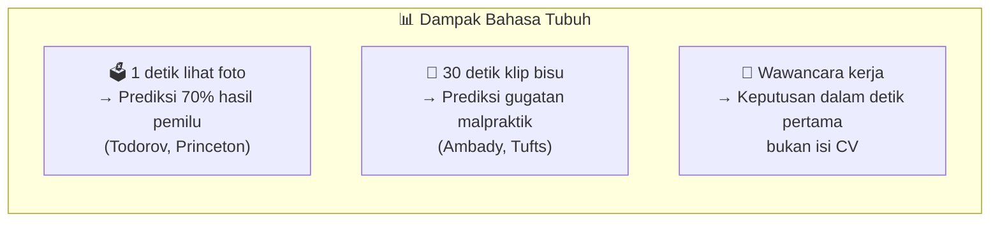
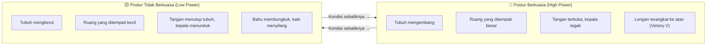
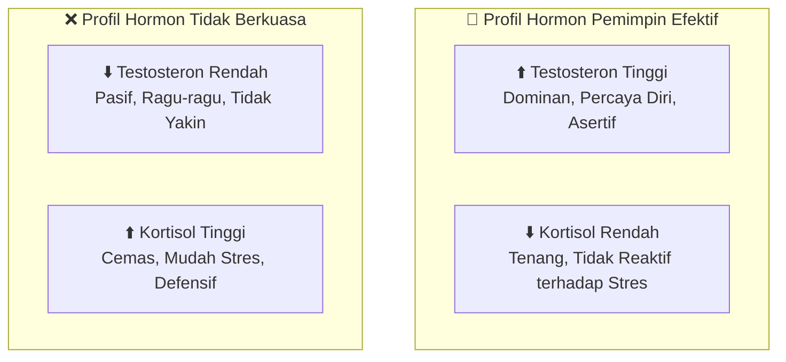
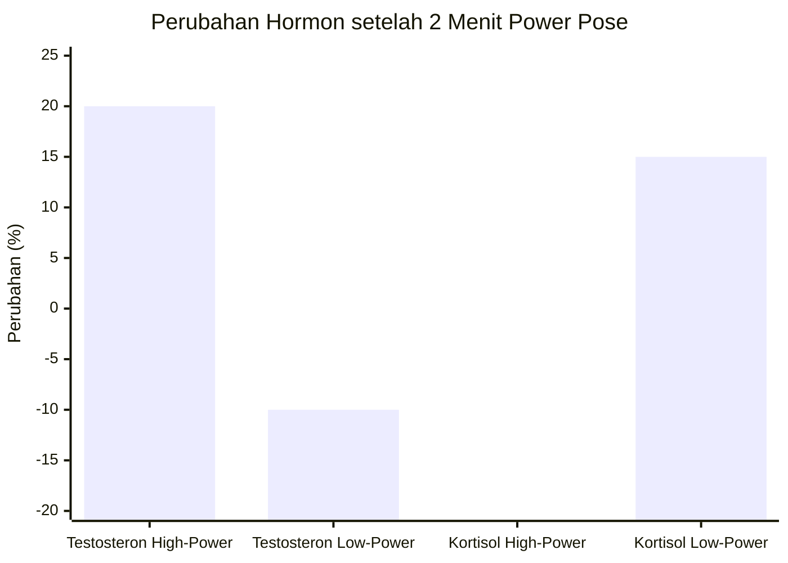
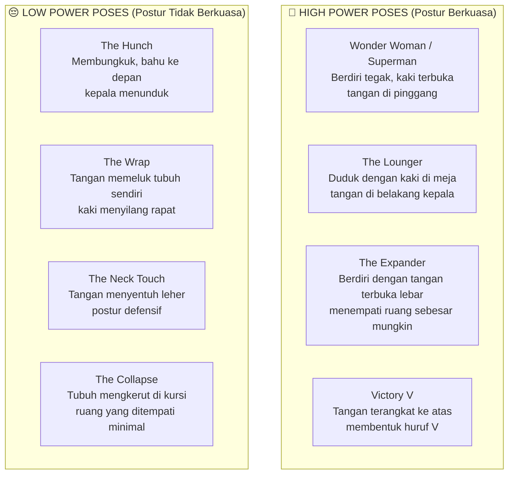
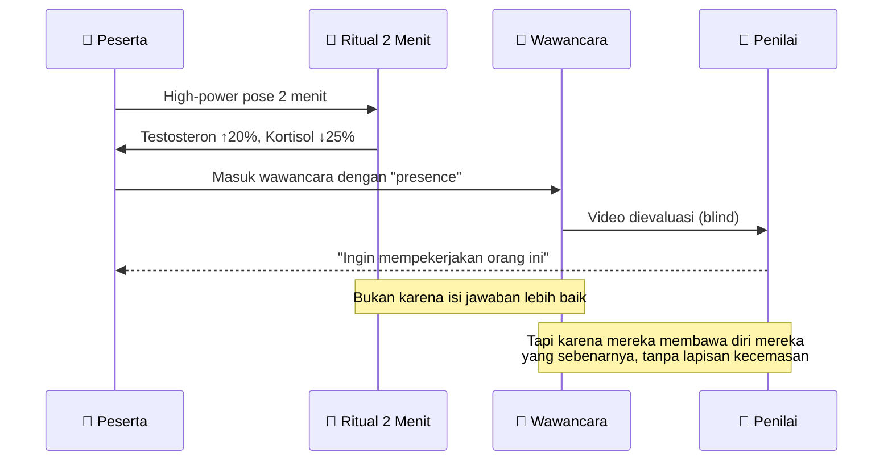
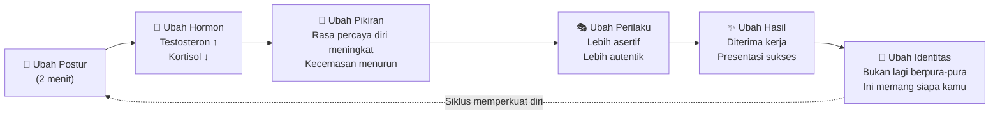
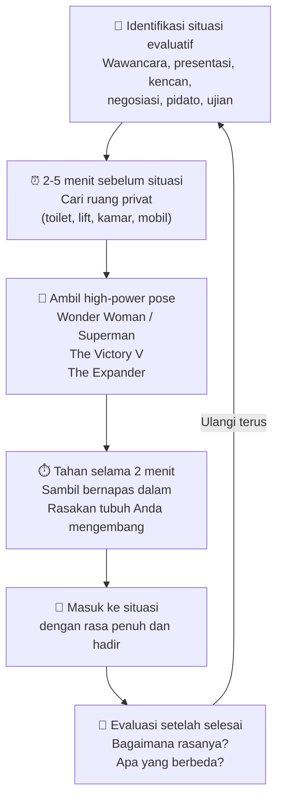
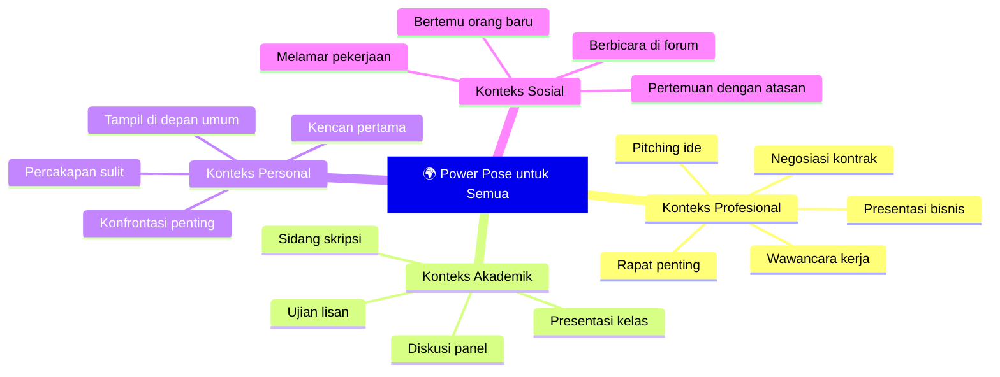

## Pendahuluan: Dua Menit yang Bisa Mengubah Hidup Anda 🤸

Bayangkan ini: sebelum masuk ke ruang wawancara kerja yang paling penting dalam hidup Anda, Anda berdiri sendirian di toilet selama dua menit dengan pose seperti superhero — dada membusung, kaki terbuka lebar, tangan di pinggang.

Konyol? Mungkin terlihat demikian.

Tapi Amy Cuddy — psikolog sosial dari Harvard Business School — punya data ilmiah yang mengatakan dua menit itu bisa secara harfiah **mengubah kimia otak Anda**, meningkatkan kadar testosteron (*hormon dominasi*), menurunkan kadar kortisol (*hormon stres*), dan membuat Anda tampil jauh lebih percaya diri, autentik, dan mengesankan.

Ceramah TED-nya yang berjudul *"Your Body Language May Shape Who You Are"* adalah salah satu ceramah TED paling banyak ditonton sepanjang masa — lebih dari 70 juta penayangan. Dan bukan tanpa alasan.

Karena apa yang Amy Cuddy sampaikan bukan sekadar tips motivasi dangkal. Ini adalah **sains tentang hubungan timbal balik antara tubuh dan pikiran** yang akan mengubah cara Anda memandang diri sendiri.

<Callout type="abstract" title="Sumber TED Talk">
Artikel ini adalah ringkasan mendalam dari ceramah TED Amy Cuddy: [Your Body Language May Shape Who You Are](https://www.youtube.com/watch?v=Ks-_Mh1QhMc). Ceramah ini disampaikan pada TED Global 2012 dan menjadi salah satu ceramah TED terpopuler sepanjang sejarah.
</Callout>

---

## Bagian I: Tubuh Kita Berbicara Sebelum Mulut Kita Membuka 👁️

Kita semua tahu bahwa bahasa tubuh (*body language*) penting. Kita membaca isyarat nonverbal (*nonverbal cues*, tanda-tanda yang disampaikan bukan lewat kata-kata) sepanjang hari — senyuman yang terasa palsu, jabat tangan yang terlalu lemah, tatapan yang menghindari kontak mata.

Tapi seberapa besar pengaruhnya sesungguhnya?

Jauh lebih besar dari yang kita duga.

### Riset Mengejutkan: 1 Detik Bisa Memprediksi Hasil Pemilu 😮

**Alex Todorov** dari Princeton University melakukan penelitian yang hasilnya mengguncang. Ia menunjukkan kepada partisipan foto-foto kandidat politik selama **satu detik** saja — bahkan kurang dari satu detik — dan meminta mereka menilai kompetensi sang kandidat.

Hasilnya: penilaian satu detik itu memprediksi **70% hasil pemilu Senator dan Gubernur Amerika Serikat**.

Tujuh puluh persen. Dari satu detik melihat wajah.

Ini bukan tentang kecerdasan pemilih atau isi kebijakan kandidat. Ini tentang **kesan pertama yang terbentuk dalam sepersekian detik** berdasarkan sinyal nonverbal — cara orang itu berdiri, ekspresi wajahnya, proyeksi kepercayaan dirinya.

### Dokter yang Tidak Pernah Digugat

Peneliti **Nalini Ambady** dari Tufts University meneliti hal yang sama dalam konteks medis. Ia memperlihatkan kepada orang-orang klip video 30 detik *tanpa suara* dari interaksi dokter-pasien, lalu meminta mereka menilai tingkat "kebaikan" (*niceness*) dokter tersebut.

Penilaian itu ternyata memprediksi **apakah dokter tersebut pernah digugat malpraktik atau tidak**.

Bukan soal apakah dokternya kompeten atau tidak. Bukan soal apakah diagnosanya benar. Tapi apakah pasien *menyukai* cara dokter itu berinteraksi dengan mereka — yang sepenuhnya dikomunikasikan melalui bahasa tubuh.

### Yang Sering Kita Lupakan: Tubuh Berbicara pada Diri Sendiri

Di sinilah Amy Cuddy menemukan titik yang jarang dibahas orang:

Kita tahu bahwa bahasa tubuh kita memengaruhi cara *orang lain* menilai kita. Tapi kita sering lupa bahwa **bahasa tubuh kita juga memengaruhi cara kita menilai diri sendiri** — pikiran, perasaan, bahkan hormon dalam darah kita.

Inilah yang membuat penelitian Amy Cuddy begitu revolusioner.

---

## Bagian II: Pelajaran dari Alam — Ekspansi vs Kontraksi 🦁

Untuk memahami hubungan antara tubuh dan kekuasaan, Amy Cuddy memulai dari yang paling fundamental: dunia hewan.

Di seluruh kerajaan hewan, ada pola yang konsisten dan universal:

**Mereka yang berkuasa, mengembang. Mereka yang tidak berkuasa, mengkerut.**

### Refleks Universal: Pose Kemenangan

Peneliti **Jessica Tracy** melakukan studi yang sangat mengungkapkan. Ia mengamati reaksi orang-orang ketika memenangkan pertandingan fisik.

Hasilnya: baik orang yang **bisa melihat normal** maupun orang yang **buta sejak lahir** (*congenitally blind*) melakukan gerakan yang persis sama ketika menang — tangan terangkat membentuk huruf V, dagu sedikit terangkat.

Orang buta sejak lahir tidak pernah *melihat* orang lain melakukan gerakan ini. Mereka tidak bisa menirunya dari pengamatan visual. Tapi mereka tetap melakukannya secara spontan.

**Ini berarti pose kemenangan adalah respons bawaan biologis, bukan perilaku yang dipelajari** — sudah tertanam dalam DNA kita sebagai makhluk hidup.

### Dinamika Pelengkap, Bukan Cermin

Ada satu pengamatan menarik lagi: ketika Anda berhadapan dengan seseorang yang menampilkan postur berkuasa, Anda *tidak* meniru mereka — Anda melakukan kebalikannya.

Ini yang disebut *complementing* (*melengkapi*) bukan *mirroring* (*mencerminkan*). Ketika bos Anda berdiri tegak dan mengambil banyak ruang, Anda secara tidak sadar membuat diri Anda lebih kecil.

Dinamika ini menciptakan hierarki sosial yang terjadi bukan melalui kata-kata, tapi melalui bahasa tubuh yang saling menyesuaikan secara otomatis.

<Callout type="info" title="Pengamatan di Ruang Kuliah MBA">
Amy Cuddy mengamati mahasiswa MBA-nya dan menemukan pola yang sangat jelas: mahasiswa yang masuk ke ruangan dengan langkah yakin, langsung menempati posisi tengah ruangan, duduk dengan postur terbuka, dan mengangkat tangan tinggi-tinggi ketika menjawab — mereka jauh lebih aktif berpartisipasi dan mendapat nilai lebih baik. Sementara mahasiswa yang masuk dengan bahu membungkuk, memilih sudut ruangan, dan mengangkat tangan dengan ragu-ragu — mereka kurang berpartisipasi, padahal *tidak kalah pintarnya*.
</Callout>

---

## Bagian III: Sains di Balik Power Pose — Hormon Tidak Bisa Bohong 🔬

Di sinilah Amy Cuddy mulai masuk ke data yang paling mengejutkan.

Pertanyaan utamanya adalah: **apakah pikiran kita yang mengubah tubuh, atau tubuh kita yang mengubah pikiran?**

Jawabannya: **keduanya**.

### Profil Hormonal Pemimpin yang Efektif

Penelitian pada primata dan manusia menemukan bahwa pemimpin yang efektif memiliki profil hormonal yang spesifik:

- **Testosteron tinggi** — hormon dominasi, kepercayaan diri, dan ketegasan
- **Kortisol rendah** — hormon stres; rendah berarti lebih tenang dalam tekanan

Ini bukan kebetulan. Pemimpin yang baik bukan hanya dominan — mereka juga *tidak mudah panik*. Mereka bisa bertindak tegas sambil tetap tenang di tengah krisis.

### Eksperimen: Dua Menit yang Mengubah Kimia Tubuh

Amy Cuddy dan kolaboratornya **Dana Carney** dari UC Berkeley merancang eksperimen sederhana namun brilliant.

**Protokol eksperimen:**
1. Ambil sampel air liur (*saliva*) partisipan untuk mengukur kadar hormon awal (*baseline*)
2. Instruksikan partisipan untuk melakukan *high-power pose* atau *low-power pose* selama **tepat dua menit**
3. Ambil sampel air liur kedua
4. Ukur perbedaannya

Hasilnya mengejutkan semua orang:

**Dalam angka:**
- **High-power pose:** Testosteron naik **+20%**, Kortisol turun **-25%**
- **Low-power pose:** Testosteron turun **-10%**, Kortisol naik **+15%**

Hanya dari **dua menit** mengubah postur tubuh.

Tidak ada kata-kata motivasi. Tidak ada visualisasi. Tidak ada afirmasi positif. Hanya postur tubuh.

### Toleransi Risiko: 86% vs 60%

Efeknya tidak berhenti di hormon. Amy Cuddy juga mengukur *risk tolerance* (*toleransi terhadap risiko*) dengan memberikan kesempatan berjudi kepada partisipan.

Hasilnya:
- **High-power posers:** **86%** bersedia berjudi
- **Low-power posers:** Hanya **60%** yang bersedia

Orang yang lebih percaya diri lebih berani mengambil risiko — dan kepercayaan diri itu bisa *diinduksi* hanya dengan mengubah postur tubuh selama dua menit.

<Callout type="tip" title="Mekanisme Biologis">
Tubuh dan pikiran berkomunikasi secara dua arah (*bidirectional*). Kita tersenyum karena senang — tapi penelitian juga menunjukkan bahwa kita merasa lebih senang *karena* tersenyum (efek ini disebut *facial feedback hypothesis* atau hipotesis umpan balik wajah). Hal yang sama berlaku untuk postur: tubuh tegak → otak menerima sinyal "saya berkuasa" → hormon berubah → rasa percaya diri meningkat → perilaku berubah.
</Callout>

---

## Bagian IV: Pose-Pose Kekuasaan — High Power vs Low Power 🧘

Amy Cuddy mengidentifikasi dua kategori besar postur tubuh:

### Kapan Harus Menggunakan Power Pose?

Amy Cuddy dengan tegas menyatakan: **bukan di depan orang lain**.

Power pose bukan untuk Anda lakukan di depan pewawancara sambil berdiri dengan tangan di pinggang. Itu justru akan terlihat aneh dan arogan.

Power pose adalah **ritual pribadi** — sesuatu yang Anda lakukan *sebelum* memasuki situasi evaluatif (*evaluative situation*, situasi di mana Anda dinilai orang lain).

**Contoh situasi yang ideal:**
- 🚽 Di kamar mandi, 2 menit sebelum wawancara kerja
- 🛗 Di lift, sebelum presentasi penting
- 🏠 Di kamar, sebelum kencan pertama
- 🎓 Di balik layar, sebelum naik panggung untuk pidato
- 💻 Di belakang meja dengan pintu tertutup, sebelum negosiasi besar

---

## Bagian V: Eksperimen Wawancara Kerja — Bukti Nyata di Dunia 💼

Jika eksperimen laboratorium masih terasa abstrak, Amy Cuddy membawa penelitiannya ke konteks yang paling relevan bagi banyak orang: **wawancara kerja**.

### Desain Eksperimen

Partisipan dibagi menjadi dua kelompok:
1. **Kelompok A:** Melakukan *high-power poses* selama 2 menit sebelum wawancara
2. **Kelompok B:** Melakukan *low-power poses* selama 2 menit sebelum wawancara

Kemudian semua partisipan menjalani wawancara kerja simulasi selama 5 menit yang sangat menegangkan:

- Mereka direkam (*recorded*)
- Pewawancara dilatih untuk **tidak memberikan umpan balik nonverbal apapun** — tidak mengangguk, tidak tersenyum, tidak mengerutkan kening — hanya menatap dengan ekspresi datar seperti robot

Ini yang disebut *"standing in social quicksand"* (*berdiri di pasir hisap sosial*) oleh peneliti Marianne LaFrance — lebih buruk dari diinterupsi atau diejek, karena tidak ada sinyal sama sekali yang bisa Anda jadikan pegangan.

### Hasilnya: Para Penilai Buta Tidak Bisa Bohong

Video wawancara kemudian ditonton oleh empat penilai (*coders*) yang:
- **Tidak tahu** hipotesis penelitian
- **Tidak tahu** siapa yang melakukan high-power pose dan siapa yang low-power pose

Para penilai ini diminta mengevaluasi kandidat berdasarkan berbagai faktor.

**Temuan mengejutkan:**

Semua penilai secara konsisten mengatakan: *"Kami ingin mempekerjakan orang-orang ini"* — dan mereka semua menunjuk ke kelompok yang melakukan high-power pose.

Tapi yang paling penting: **bukan isi atau kualitas jawaban yang membedakan mereka**.

Para penilai mengevaluasi struktur presentasi, kualitas argumentasi, dan kualifikasi kandidat — dan tidak ada perbedaan signifikan antara kedua kelompok dalam hal-hal itu.

Yang berbeda adalah **presence** (*kehadiran*) — kualitas tak terukur namun sangat terasa dari seseorang yang benar-benar hadir, autentik, dan percaya diri.

<Callout type="success" title="Apa Itu Presence?">
Amy Cuddy mendefinisikan *presence* sebagai kondisi di mana seseorang membawa **diri mereka yang sejati** (*true self*) ke dalam interaksi — tanpa lapisan kecemasan, tanpa kepura-puraan, tanpa rasa takut akan penilaian. Mereka tidak menyembunyikan bagian dari diri mereka. Mereka hadir sepenuhnya. Dan penilai bisa merasakannya, meski tidak bisa menjelaskannya secara verbal.
</Callout>

---

## Bagian VI: Impostor Syndrome — "Saya Tidak Seharusnya Berada Di Sini" 😔

Di bagian paling emosional dari ceramahnya, Amy Cuddy berhenti dari data ilmiah dan berbagi kisah pribadinya.

Ketika seseorang di audiensnya merespons saran *"fake it till you make it"* dengan berkata, **"Tapi rasanya palsu. Saya tidak mau sampai di sana tapi masih merasa seperti penipu"** — Amy Cuddy tersentuh secara mendalam.

Karena dia pernah merasakannya.

### Kecelakaan yang Merampas Identitas

Pada usia 19 tahun, Amy Cuddy mengalami kecelakaan mobil yang parah. Ia terlempar dari kendaraan, mengalami cedera kepala serius, dan ketika pulih di unit rehabilitasi, ia mendapati bahwa **IQ-nya turun sebanyak dua standar deviasi** (*standard deviation*, satuan pengukuran statistik).

Bagi Amy, ini bukan sekadar kehilangan angka. Seluruh hidupnya, ia telah mendefinisikan dirinya sebagai "orang yang cerdas." Identitas intinya adalah kecerdasannya. Dan itu diambil darinya dalam satu momen.

Ia dikeluarkan dari kampus. Para konselor mengatakan mungkin ia tidak akan bisa menyelesaikan kuliah.

Tapi Amy berjuang. Bekerja keras. Beruntung. Bekerja keras lagi. Beruntung lagi. Sampai akhirnya ia menyelesaikan kuliah — empat tahun lebih lambat dari teman-temannya.

Lalu ia meyakinkan **Susan Fiske**, seorang akademisi ternama, untuk menjadi pembimbing risetnya. Dan tiba-tiba Amy Cuddy berada di **Princeton**.

Dan setiap hari ia berpikir: ***"Saya tidak seharusnya berada di sini."***

### Malam Sebelum Presentasi Pertama

Malam sebelum presentasi pertamanya di Princeton — hanya 20 menit untuk 20 orang — Amy menelepon Susan Fiske dan mengatakan: **"Saya mau mundur."**

Susan tidak mengizinkannya. Ia berkata:

> *"Kamu tidak akan mundur. Karena aku sudah mengambil risiko untukmu, dan kamu tetap di sini. Kamu akan melakukannya. Kamu akan melakukan setiap ceramah yang pernah diminta darimu. Kamu hanya akan terus melakukannya dan terus melakukannya dan terus melakukannya, meski kamu ketakutan, meski kamu lumpuh, meski kamu seperti di luar tubuhmu — sampai kamu punya momen di mana kamu berkata, 'Ya Tuhan, saya benar-benar melakukannya. Saya sudah menjadi ini. Saya benar-benar melakukan ini.'"*

Dan itulah yang Amy lakukan. Lima tahun di program doktor, Northwestern, dan akhirnya Harvard. Sampai suatu hari ia tidak lagi berpikir tentang rasa tidak pantas itu.

### Mahasiswi yang Mengubah Segalanya

Di akhir tahun pertamanya mengajar di Harvard, seorang mahasiswi yang selama satu semester penuh **tidak pernah berbicara satu kata pun** di kelas datang ke kantornya. Setelah Amy memperingatkan bahwa ia harus berpartisipasi atau gagal, mahasiswi itu duduk di depannya — sepenuhnya hancur — dan berkata:

**"Saya tidak seharusnya berada di sini."**

Dan di momen itu, Amy menyadari dua hal:

Pertama: **ia tidak lagi merasakan perasaan itu.** Ia sudah menjadi orang yang berbeda. *Impostor syndrome* (*sindrom penipu* — perasaan tidak layak meskipun sudah berprestasi) sudah tidak ada lagi dalam dirinya.

Kedua: **mahasiswi ini seharusnya memang ada di sini!** Dan ia bisa melakukannya.

Amy berkata: *"Ya, kamu seharusnya di sini! Dan besok kamu akan berpura-pura, kamu akan membuat dirimu kuat..."*

Mahasiswi itu pergi. Dan keesokan harinya, ia memberikan komentar terbaik yang pernah diberikan dalam kelas itu.

---

## Bagian VII: Bukan "Fake It Till You Make It" — Tapi "Fake It Till You Become It" 🦋

Di sinilah Amy Cuddy membalik ungkapan populer yang sudah kita kenal selama bertahun-tahun.

*"Fake it till you make it"* artinya: pura-pura percaya diri sampai Anda berhasil mendapatkan apa yang Anda inginkan. Setelah berhasil, Anda boleh berhenti berpura-pura.

Tapi Amy Cuddy menawarkan sesuatu yang jauh lebih dalam:

### ***"Fake it till you become it"*** 🦋

Artinya: pura-pura percaya diri **sampai kepercayaan diri itu benar-benar menjadi bagian dari dirimu**. Sampai kamu tidak lagi perlu berpura-pura, karena kamu sudah *menjadi* orang yang percaya diri itu.

### Perbedaan Kritis

| Aspek | Fake it till you make it | Fake it till you become it |
|---|---|---|
| **Tujuan** | Mencapai hasil tertentu | Mengubah identitas diri |
| **Durasi** | Sementara, sampai berhasil | Terus-menerus sampai menjadi bagian diri |
| **Autentisitas** | Masih merasa palsu | Akhirnya menjadi asli |
| **Akhir** | Bisa berhenti berpura-pura | Tidak perlu berpura-pura lagi |

Mahasiswi Amy tidak hanya *made it* — dia tidak hanya mendapat nilai baik di kelas itu. Dia **menjadi** seseorang yang berbeda. Seseorang yang percaya bahwa ia seharusnya ada di sana.

Perubahan itu bukan hanya di luar, tapi di dalam.

<Callout type="important" title="Inti Transformasi">
Ketika Anda terus-menerus mengambil postur berkuasa, menghadapi situasi sulit meski takut, dan menunjukkan diri Anda sepenuhnya — otak Anda secara harfiah me-*rewire* (*menyusun ulang koneksi sarafnya*) untuk mendukung identitas baru Anda. Ini bukan manipulasi. Ini adalah bagaimana manusia tumbuh dan berubah.
</Callout>

---

## Bagian VIII: Aplikasi Praktis — Cara Menggunakan Power Pose 🛠️

Oke, cukup teorinya. Bagaimana ini diterapkan dalam kehidupan nyata?

### Langkah Praktis

### Daftar High-Power Poses yang Bisa Dicoba

**1. Wonder Woman / Superman** 🦸
- Berdiri tegak
- Kaki terbuka selebar bahu
- Tangan di pinggang
- Dada sedikit dimajukan
- Kepala tegak, dagu sedikit terangkat

**2. The Victory V** 🏆
- Tangan terangkat ke atas membentuk huruf V
- Kepala sedikit terangkat
- Senyum kecil

**3. The Lounger** 😎
- Duduk di kursi
- Kaki diangkat ke atas meja
- Tangan di belakang kepala
- Postur sangat rileks dan *expansive* (*mengambil banyak ruang*)

**4. The Expander** 🦅
- Berdiri
- Tangan terbuka lebar ke samping seperti sayap
- Kaki terbuka lebar

### Yang Perlu Dihindari Sebelum Situasi Penting

Amy secara khusus menyebutkan kebiasaan yang tanpa kita sadari **merusak kepercayaan diri sebelum situasi penting**:

Duduk menunggu wawancara sambil:
- 📱 Membungkuk di atas ponsel
- 🗒️ Menunduk menatap catatan
- 🤗 Melipat tangan memeluk tubuh sendiri
- 🦐 Menyilangkan kaki dan membuat tubuh sekecil mungkin

Semua ini adalah ***low-power poses***. Dan tanpa Anda sadari, Anda sedang memprogram otak Anda untuk masuk ke situasi penting dalam kondisi **stres dan tidak percaya diri**.

Solusinya? Pergi ke toilet 5 menit lebih awal. Lakukan *Wonder Woman pose*. Kemudian masuk.

---

## Bagian IX: Siapa yang Paling Membutuhkan Ini? 🌍

Amy Cuddy menutup ceramahnya dengan ajakan yang sangat menyentuh:

> *"Bagikan ini kepada orang-orang, karena mereka yang paling bisa memanfaatkannya adalah mereka yang tidak punya sumber daya, tidak punya teknologi, tidak punya status, dan tidak punya kekuasaan."*

Power pose adalah *free hack* (*trik gratis*) yang **tidak membutuhkan uang, koneksi, atau privilese**. Hanya butuh:
- Tubuh Anda
- Privasi selama 2 menit
- Kesediaan untuk mencoba

Ini yang membuat pesan Amy Cuddy begitu demokratis dan universal:

Seseorang yang baru lulus dari desa terpencil yang akan menghadapi wawancara kerja pertamanya di kota besar. Seorang perempuan dalam masyarakat yang tidak terbiasa memberi ruang bagi perempuan untuk tampil percaya diri. Seorang imigran yang masih ragu-ragu dengan kemampuan bahasanya. Seorang mahasiswa pertama generasi dalam keluarganya yang masuk ke universitas bergengsi.

Mereka semua bisa melakukan ini.

---

## Penutup: Dari "Fake It" ke "Become It" — Sebuah Undangan 🌱

Amy Cuddy tidak meminta kita untuk berpura-pura menjadi orang lain.

Dia meminta kita untuk berhenti **berpura-pura menjadi lebih kecil dari siapa kita sebenarnya**.

Kita semua punya kecenderungan untuk mengkerut di depan situasi yang mengancam — membungkuk, menyilangkan tangan, membuat diri kita sekecil mungkin, seolah-olah kita bisa menghilang dari penilaian orang lain.

Tapi dengan melakukan itu, kita justru **mengkonfirmasi ketakutan kita kepada diri sendiri** — dan kepada otak kita yang setia mengikuti sinyal dari tubuh.

Dua menit adalah semua yang dibutuhkan untuk memutus siklus itu.

Dua menit untuk memberi sinyal kepada tubuh Anda: *Saya di sini. Saya berhak mengambil ruang ini. Saya siap.*

Dan dengan cukup pengulangan — dengan cukup momen di mana Anda memilih untuk mengembang daripada mengkerut, untuk hadir daripada sembunyi — Anda tidak lagi berpura-pura.

Anda sudah menjadi orang itu.

<Callout type="quote" title="Pesan Terakhir Amy Cuddy">
"Perubahan kecil bisa membawa perubahan besar. Dua menit. Dua menit. Dua menit. Sebelum Anda masuk ke situasi evaluatif yang menegangkan, coba lakukan ini — di lift, di toilet, di belakang meja dengan pintu tertutup. Konfigurasikan otak Anda untuk menghadapi situasi itu dengan cara terbaik. Tingkatkan testosteron. Turunkan kortisol. Jangan keluar dari situasi itu dengan merasa bahwa Anda tidak menunjukkan siapa Anda sebenarnya. Keluarlah dengan merasa bahwa Anda benar-benar sudah menunjukkan dan menyatakan diri Anda."
</Callout>

---

*Ingin menonton ceramah aslinya? [Your Body Language May Shape Who You Are — Amy Cuddy | TED](https://www.youtube.com/watch?v=Ks-_Mh1QhMc)*
