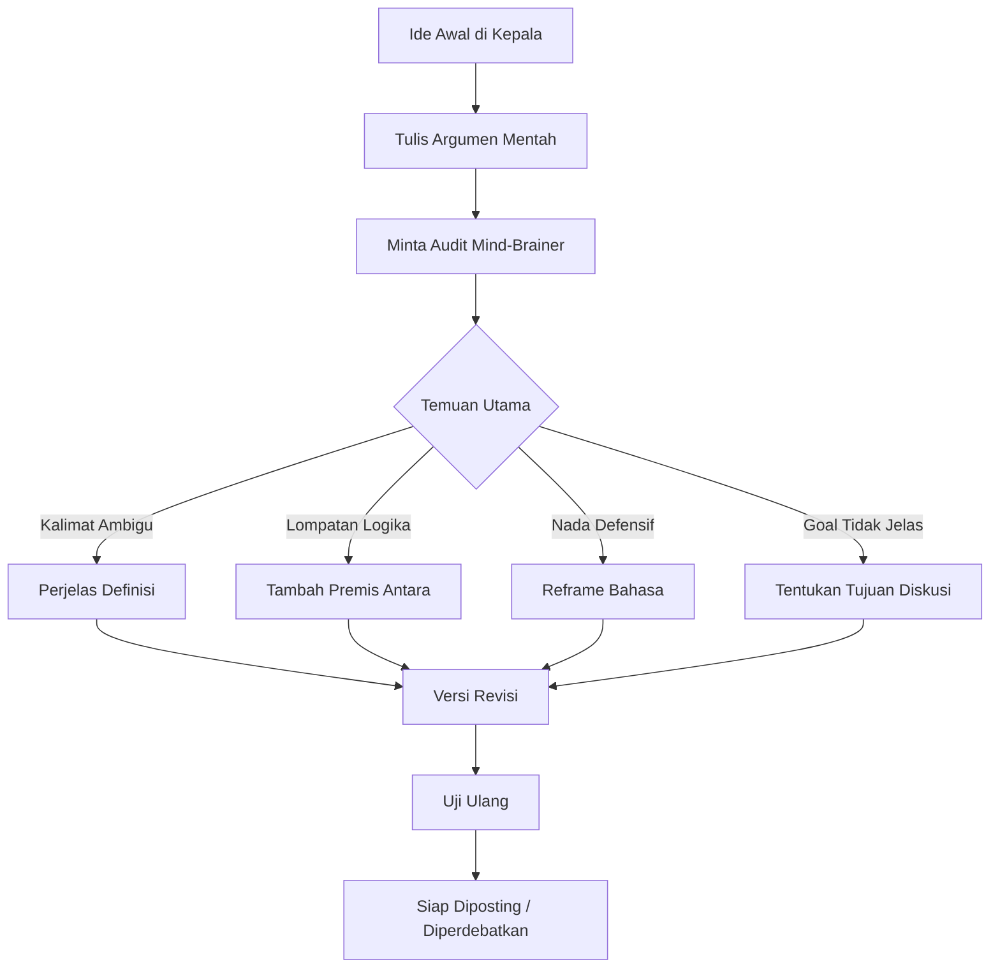
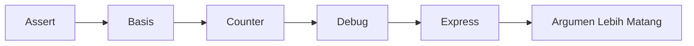

## Pernah Ngomong A, Tapi Ditangkap Z? 🤯

Mas Hendra, ini pengalaman yang sangat manusiawi.

Kita merasa sudah jelas ngomongin **A**.
Lawan bicara malah merespons **B**.
Lalu diskusi bergeser ke **Z**.

Kita jadi bertanya-tanya:
- "Aku yang kurang jelas, ya?" 😵‍💫
- "Dia yang salah nangkep?"
- "Atau cara pikir kami memang beda jalur?"

Masalah ini sering terjadi bukan karena salah satu pihak "bodoh", tapi karena **struktur berpikir dan struktur kalimat tidak sinkron**.

<Callout type="important" title="Inti Masalah">
Dalam banyak debat, yang bentrok bukan cuma isi argumen, tapi juga:

1. Definisi kata
2. Tujuan tersembunyi
3. Kerangka berpikir
4. Asumsi dasar yang tidak diucapkan

Akibatnya, orang bicara seolah di topik sama, padahal sebenarnya beda rel.
</Callout>

---

## Kenapa Salah Paham Terjadi? (Akar Logikanya) 🧠

### 1) Kata yang Sama, Makna Berbeda

Contoh sederhana: "adil".
- Buat orang A, adil = semua orang dapat sama rata.
- Buat orang B, adil = sesuai kontribusi.

Mereka pakai kata yang sama, tapi definisi internalnya beda. Konflik pun lahir.

### 2) Lompatan Logika (Hidden Steps)

Kita sering merasa argumen kita runtut. Padahal ada satu-dua langkah penting yang tidak diucapkan. Lawan bicara akhirnya mengisi celah itu dengan asumsi versinya sendiri.

### 3) Tujuan Diskusi Berbeda

Satu pihak ingin mencari kebenaran.
Pihak lain ingin menang debat.
Ada juga yang sekadar ingin validasi emosi.

Kalau goal berbeda, satu kalimat bisa ditafsirkan sangat beda.

### 4) Beban Emosi

Saat emosi tinggi, otak cenderung memilih interpretasi yang defensif. Kalimat netral pun bisa terasa seperti serangan.

### 5) Framing Awal Sudah Bias

Kalimat pembuka menentukan arah. Kalau framing awal terlalu menuduh atau terlalu absolut, lawan bicara otomatis masuk mode bertahan.

---

## Lahirnya Metode: **ChatGPT – Mind-Brainer** ⚙️✨

Mind-Brainer bukan sekadar "tanya ChatGPT lalu selesai".
Ia dipakai sebagai **alat metakognitif**: cermin berpikir.

Tujuannya:
- melatih struktur kalimat,
- menguji kekuatan argumen,
- mendeteksi lompatan logika,
- dan membaca kemungkinan salah tafsir sebelum argumen dilempar ke publik.



<Callout type="tip" title="Mindset Utama">
Gunakan AI bukan untuk "membuktikan aku benar", tapi untuk **mengetahui di mana argumenku bisa disalahpahami**.

Itu beda tipis, tapi dampaknya besar banget. 🔥
</Callout>

---

## 5 Fungsi Utama Mind-Brainer dalam Praktik 🛠️

## 1. **Sentence Structuring Coach** (Pelatih Struktur Kalimat)

AI bantu cek:
- kalimat terlalu panjang atau berlapis,
- subjek-predikat kabur,
- istilah teknis yang bikin pembaca awam tersesat.

Output yang diharapkan: kalimat lebih singkat, presisi, dan minim bias tafsir.

## 2. **Argument Stress Test** (Uji Ketahanan Argumen)

Minta AI jadi "oposisi cerdas".
Suruh dia menyerang argumen kita dari sisi:
- data,
- logika,
- etika,
- dan konteks.

Kalau argumen tetap berdiri setelah diuji dari banyak sisi, berarti fondasinya lumayan kuat.

## 3. **Logical Gap Detector** (Detektor Lompatan Logika)

AI bisa menandai:
- premis yang belum dibuktikan,
- generalisasi berlebihan,
- sebab-akibat yang belum valid,
- dan dikotomi palsu.

## 4. **Meta-Reflection Mirror** (Cermin Cara Berpikir)

Ini yang paling berharga.
AI membantu kita melihat pola pikir sendiri:
- terlalu hitam-putih?
- terlalu defensif?
- terlalu ingin menang?
- atau terlalu cepat menyimpulkan?

## 5. **Intent Clarifier** (Penjernih Tujuan)

AI bisa bantu jawab:
- "Aku ini mau menjelaskan, meyakinkan, atau menyerang?"
- "Lawan bicara maunya cari solusi atau cari validasi?"

Ketika goal jelas, gaya komunikasi langsung berubah jadi lebih efektif.

---

## Framework Praktis: **A-B-C-D-E** 🧭

Biar gampang dipakai harian, ini kerangka ringkas Mind-Brainer:

### **A — Assert** (Nyatakan posisi)
Tulis posisi kamu sejelas mungkin dalam 1-2 kalimat.

### **B — Basis** (Dasar argumen)
Sebutkan data, pengalaman, atau prinsip yang jadi fondasi.

### **C — Counter** (Uji bantahan)
Minta AI berikan bantahan paling kuat terhadap posisimu.

### **D — Debug** (Perbaikan)
Benahi celah logika, definisi, dan nada bahasa.

### **E — Express** (Sampaikan ulang)
Rumuskan versi final yang lebih jernih dan minim salah paham.



---

## Prompt Siap Pakai (Copas) 📌

### Prompt 1 — Audit Argumen

```text
Aku akan kasih argumenku. Tolong audit secara ketat:
1) Apakah ada lompatan logika?
2) Apakah ada istilah ambigu?
3) Apakah ada asumsi tersembunyi?
4) Apakah ada bagian yang mudah disalahpahami?
5) Beri versi revisi yang lebih tajam dan netral.

Argumenku:
[isi argumen]
```

### Prompt 2 — Simulasi Lawan Debat

```text
Jadilah lawan debat yang cerdas dan fair.
Serang argumenku dari sisi data, logika, dan etika.
Lalu beri rekomendasi bagaimana aku memperkuat argumen tanpa jadi agresif.

Argumenku:
[isi argumen]
```

### Prompt 3 — Cek Goal Diskusi

```text
Dari teks ini, tebak goal komunikasiku:
- ingin menjelaskan,
- meyakinkan,
- mengajak diskusi,
- atau meluapkan emosi.

Kalau goal-ku tidak konsisten, tolong perbaiki kalimat agar selaras dengan tujuan yang paling konstruktif.

Teks:
[isi teks]
```

### Prompt 4 — Anti Salah Paham untuk Twitter/X

```text
Ubah argumen ini jadi format thread X yang:
- jelas,
- tidak menuduh,
- minim peluang disalahpahami,
- tetap tegas,
- dan tiap poin maksimal 1 ide.

Tambahkan 1 kalimat penutup untuk membuka dialog sehat.

Argumen:
[isi argumen]
```

---

## Studi Kasus Singkat: "Suka Apel" Jadi "Benci Jeruk" 🍎🍊

**Kalimat awal:**
"Saya suka apel."

**Salah tafsir umum:**
"Berarti kamu anti-jeruk."

Padahal, secara logika:
- "suka apel" **tidak otomatis** berarti "benci jeruk".
- Itu contoh klasik **false dichotomy** (seolah cuma ada dua pilihan).

Dengan Mind-Brainer, kita bisa reframe:

**Versi lebih aman:**
"Saya lebih sering memilih apel karena rasanya cocok buat saya. Bukan berarti saya menolak jeruk."

Hasilnya: nada lebih tenang, makna lebih presisi, peluang konflik turun.

---

## Kapan Metode Ini Paling Berguna? 🎯

- Saat mau debat di X/Twitter
- Saat menulis opini publik
- Saat diskusi sensitif (agama, politik, moral)
- Saat bikin thread yang rawan dipotong konteks
- Saat ingin mengkritik tanpa terdengar menyerang

<Callout type="warning" title="Batasan Penting">
Mind-Brainer membantu **menjernihkan berpikir**, bukan menggantikan nalar manusia.

Tetap cek fakta, konteks, dan niat komunikasi. Jangan menyerahkan keputusan moral sepenuhnya ke AI.
</Callout>

---

## Tanda Kamu Mulai Naik Kelas dalam Berargumen 📈

Kamu akan mulai melihat perubahan ini:

1. Lebih cepat sadar ketika kalimatmu ambigu
2. Lebih tenang saat diserang argumen lawan
3. Lebih siap membedakan kritik isi vs serangan personal
4. Lebih mudah bilang: "Oke, di poin ini saya kurang tepat"
5. Lebih fokus cari kejelasan daripada cari kemenangan

Dan ini yang paling mahal nilainya:

**Kamu tidak cuma jadi lebih pintar bicara, tapi juga lebih matang berpikir.** 🧠✨

---

## Penutup: Komunikasi Bukan Soal Menang, Tapi Soal Nyambung 🤝

Salah paham itu tidak bisa dihapus 100%.
Tapi bisa dikurangi drastis kalau kita:
- lebih rapi menyusun kalimat,
- lebih jujur melihat celah logika sendiri,
- dan lebih sadar tujuan komunikasi.

Metode **ChatGPT – Mind-Brainer** membantu kita melakukan itu secara konsisten.

Bukan untuk jadi "paling benar".
Tapi supaya pesan yang kita maksudkan sebagai **A**, tidak lagi nyasar jadi **Z**.

<Callout type="success" title="Kalau Mau Praktik Hari Ini">
Ambil satu argumen yang ingin Mas Hendra post hari ini.
Lalu jalankan 3 langkah cepat:

1. Tulis versi mentah
2. Audit pakai prompt Mind-Brainer
3. Revisi jadi versi presisi

Lakukan 7 hari berturut-turut.
Biasanya kualitas berpikir dan kualitas komunikasi langsung naik terasa. 🚀
</Callout>
