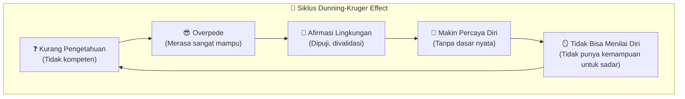
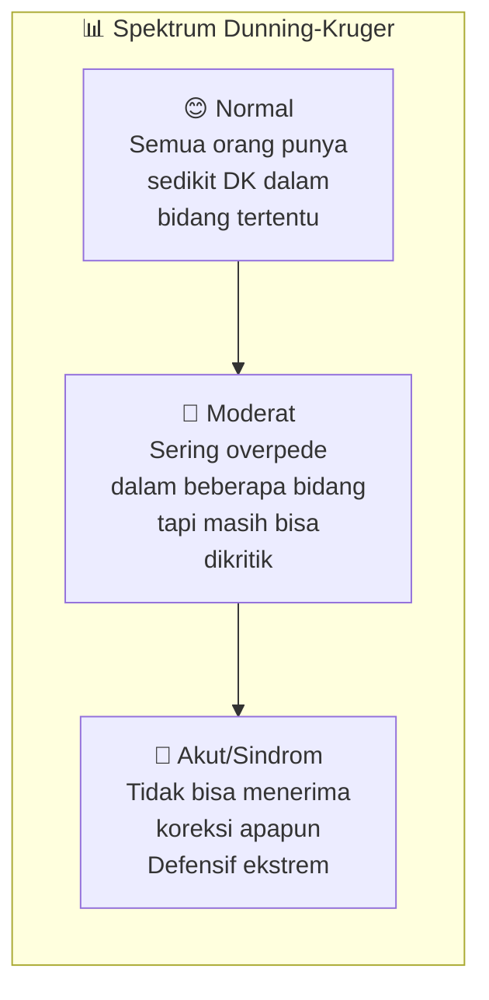
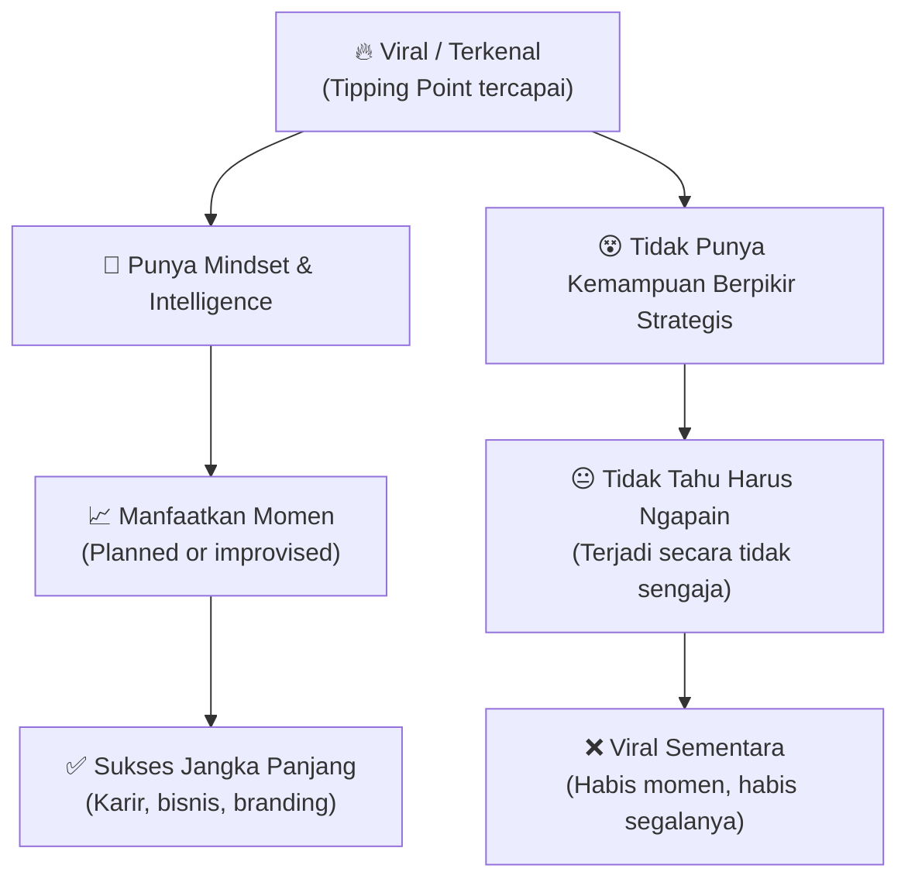
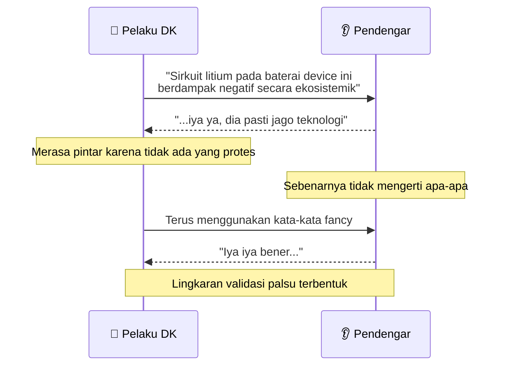
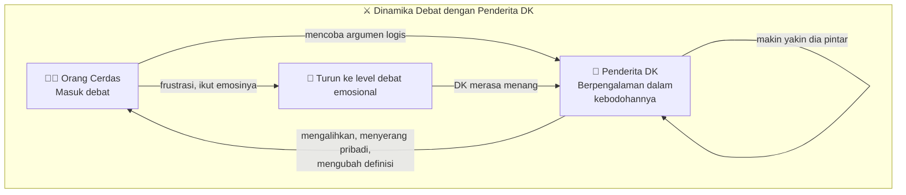
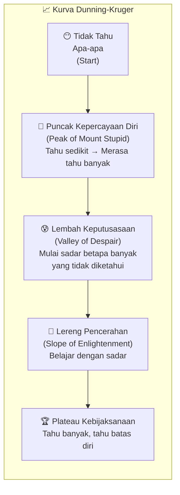
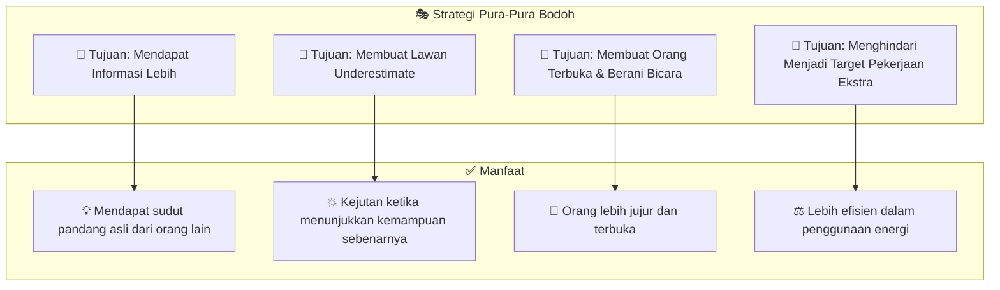
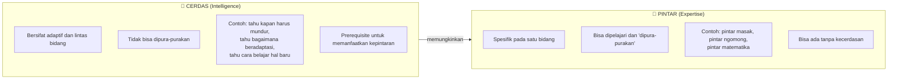
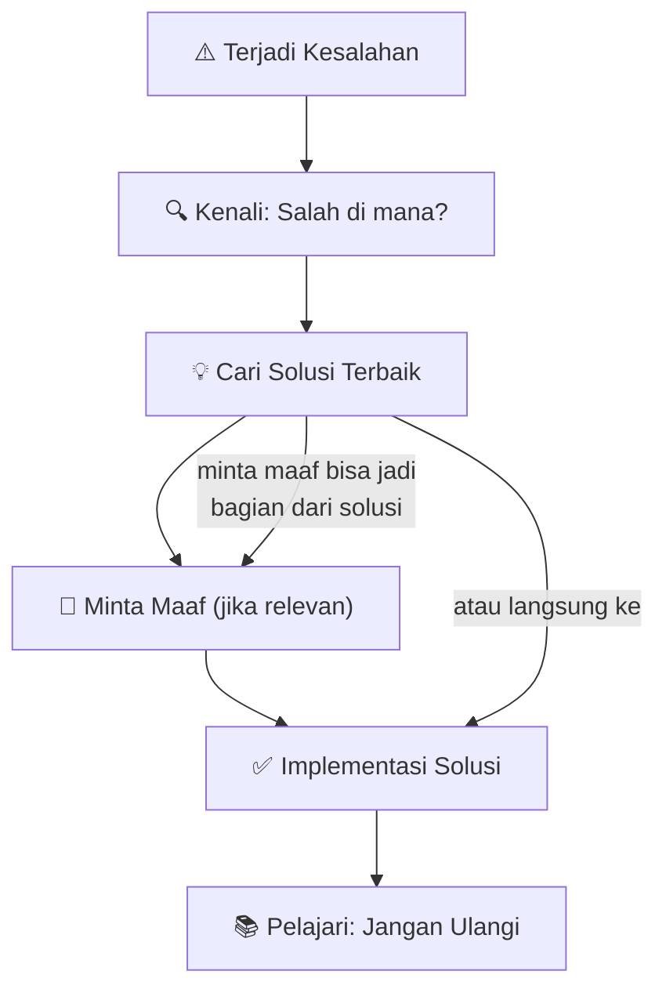
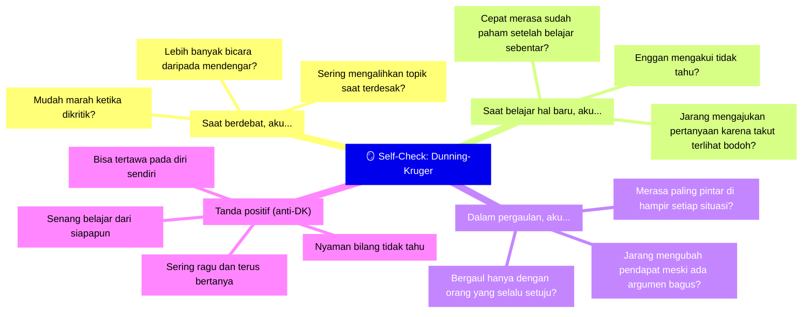

## Pembuka: Paradoks Paling Menyakitkan 🧠

> *"Satu hal yang paling menyakitkan adalah orang-orang yang merasa yakin adalah orang bodoh. Sedangkan mereka yang punya imajinasi dan pintar selalu dipengaruhi oleh keraguan dan ketidakpastian."*
>
> — Bertrand Russell, matematikawan dan filsuf

Pernahkah kamu berada di sebuah diskusi, di mana seseorang berbicara paling keras, paling percaya diri, paling yakin — tapi isi bicaranya ternyata dangkal? Atau sebaliknya: orang yang paling tahu justru paling banyak ragu, paling banyak berpikir, dan paling sering bertanya?

Ini bukan kebetulan. Ini adalah **Dunning-Kruger Effect** — salah satu fenomena psikologi kognitif paling relevan di zaman media sosial dan era viral seperti sekarang.

Artikel ini akan membedah tuntas: apa itu Dunning-Kruger Effect, mengapa ia berbahaya, bagaimana mengenalinya pada diri sendiri dan orang lain, dan apa yang membedakan orang yang **benar-benar cerdas** dengan orang yang sekadar *merasa* cerdas.

<Callout type="abstract" title="Sumber Kajian">
Artikel ini dikembangkan dari podcast **Noise — Daily Issues, Episode 32: "Merasa Pintar Padahal Otak Kosong! Dunning-Kruger Effect"** yang membahas topik ini dengan sangat tajam dan kontekstual untuk masyarakat Indonesia.
Sumber: [https://www.youtube.com/watch?v=Hkb3IjVlM5M](https://www.youtube.com/watch?v=Hkb3IjVlM5M)
</Callout>

---

## Bagian I: Apa Itu Dunning-Kruger Effect? 🎯

**Dunning-Kruger Effect** adalah bias kognitif (*cognitive bias* — kecenderungan berpikir yang menyimpang dari realita) yang pertama kali dirumuskan secara ilmiah oleh **David Dunning** dan **Justin Kruger** dari Cornell University pada tahun 1999.

Temuannya sederhana namun mengerikan:

> *Orang yang tidak kompeten tidak mampu mengenali ketidakkompetenannya sendiri.*

Dengan kata lain: **kalau kamu bodoh, kamu tidak tahu bahwa kamu bodoh.** Dan justru itulah yang membuatmu semakin percaya diri tanpa dasar.

Yang membuat efek ini sangat berbahaya adalah sifatnya yang *self-reinforcing* (memperkuat dirinya sendiri). Lingkaran ini terus berputar karena:

1. **Kemampuan yang dibutuhkan untuk menilai kompetensi** adalah kemampuan yang sama dengan yang dibutuhkan untuk *menjadi kompeten*
2. Orang yang tidak kompeten tidak punya kemampuan itu — sehingga mereka juga tidak mampu mengenali ketidakkompetenannya
3. Pujian dan validasi dari lingkungan memperparah kondisi ini

---

## Bagian II: Mengapa Ini Terjadi di Mana-Mana? 🌍

Efek Dunning-Kruger bukan monopoli segelintir orang. Ia ada — dalam kadar berbeda — **pada hampir semua orang**. Yang membedakan hanya *seberapa akut* kondisinya.

Mengapa hampir semua orang mengalaminya?

**Karena otak manusia dirancang untuk membuat *shortcut* (jalan pintas).** Kita tidak selalu punya waktu atau energi untuk mengevaluasi setiap keyakinan secara mendalam. Maka otak menggunakan *heuristics* — aturan praktis — yang salah satunya adalah: *"kalau orang-orang di sekitarku setuju, berarti aku benar."*

Di sinilah peran **echo chamber** (*kamar gema* — lingkungan yang hanya memantulkan balik keyakinan kita) menjadi sangat berbahaya. Media sosial memperparah ini secara masif: algoritma TikTok, Instagram, dan YouTube dirancang untuk menunjukkan konten yang kita *suka* — bukan konten yang menantang kita.

<Callout type="warning" title="Bahaya Echo Chamber">
Ketika kamu hanya bergaul dengan orang yang setuju denganmu, dan hanya mengonsumsi konten yang mengafirmasi keyakinanmu, kamu tidak sedang belajar — kamu sedang membangun ilusi kepintaran.
</Callout>

---

## Bagian III: Viral ≠ Pintar — Pelajaran dari Dunia Konten 📱

Salah satu ilustrasi paling menarik dari Dunning-Kruger Effect di era modern adalah fenomena **konten viral**. Coba perhatikan orang-orang berikut yang pernah viral di Indonesia:

- Fajar Sad Boy
- Awkarin
- Keanu, Sinta Jojo, Fadhil Jaidi, Bonge
- Ibu-anak yang viral di TikTok

Mereka semua pernah **viral** — punya kesempatan yang *sama* besar. Tapi nasib mereka berbeda-beda. Mengapa?

**Tipping point** (*titik balik kritis* — momen ketika sesuatu meledak secara masif) adalah hadiah yang sama untuk semua orang. Tapi apa yang dilakukan *setelah* tipping point itulah yang menentukan segalanya.

Orang yang terperangkap Dunning-Kruger, ketika viral, akan berpikir: *"Gue keren! Gue berbakat! Ini karena gue!"* — lalu tidak melakukan apa pun yang berarti untuk membangun di atas momen tersebut.

Orang yang benar-benar cerdas akan berpikir: *"Ini momen. Apa yang bisa gue bangun dari sini? Ke mana seharusnya ini pergi?"*

---

## Bagian IV: 4 Ciri Orang yang Terjangkit Dunning-Kruger 🔍

### 1. 🗣️ Menggunakan Kata-Kata Teknikal yang Tidak Dipahaminya

Salah satu tanda paling mudah dikenali: **menggunakan istilah rumit, asing, atau teknikal — tanpa benar-benar memahaminya.**

Tujuannya bukan berkomunikasi. Tujuannya adalah *terlihat pintar*. Dan ini bekerja — karena ketika pendengar tidak mengerti, mereka cenderung mengasumsikan bahwa yang bicara memang tahu sesuatu yang mereka tidak tahu.

Contoh klasik yang pernah viral: artis yang menggunakan kata-kata seperti *"konspirasi internasional yang mengintervensi psikologis"* dalam kalimat yang sebetulnya bisa diganti dengan *"saya dipengaruhi orang lain."*

<Callout type="tip" title="Cara Mengidentifikasi">
Tanda seseorang benar-benar paham suatu hal: ia bisa menjelaskannya **dengan bahasa yang paling sederhana**. Richard Feynman, fisikawan jenius, percaya bahwa jika kamu tidak bisa menjelaskan sesuatu dengan sederhana, berarti kamu belum benar-benar memahaminya.
</Callout>

### 2. 🪶 Hanya Nyaman Bermain di Permukaan

Orang yang terjangkit Dunning-Kruger Effect akan selalu **menghindari kedalaman topik**. Mereka cenderung:

- Mengalihkan pembicaraan ketika dibawa ke detail
- Memberikan jawaban yang panjang tapi ngambang
- Merasa terancam ketika ada pertanyaan spesifik
- Mengubah topik ketika terdesak

Ini terasa familiar dalam debat agama, politik, atau bahkan obrolan sehari-hari. Ketika seseorang yang *seolah-olah* paham ditanya lebih jauh, tiba-tiba dia bilang *"itu bukan poin yang sedang kita bahas"* atau *"kamu terlalu teknis."*

### 3. 📝 Over-Explanation — Panjang Tapi Kosong

Pernahkah kamu mendapat laporan panjang yang sebetulnya bisa diringkas dalam satu paragraf? Atau esai yang membutuhkan 4 halaman tapi isinya sama dengan esai 1 halaman?

Ini adalah *over-explanation* — tanda seseorang tidak tahu inti dari apa yang ingin disampaikan. Ia menggunakan banyak kata sebagai *kompensasi* dari dangkalnya pemahaman.

> 💡 Orang yang benar-benar paham tahu mana yang *esensial* dan mana yang *ornamen*. Ia tahu bagaimana memangkas dengan tepat tanpa kehilangan makna.

### 4. 🎉 Over-Excited Terhadap Pengalaman Minimal

Pernah lihat seseorang baru sekali ke Jepang, lalu seolah-olah menjadi pakar tata kota, transportasi publik, dan budaya Jepang? Atau baru baca satu buku tentang investasi, lalu menjadi *advisor* keuangan dadakan?

Ini adalah tanda klasik Dunning-Kruger: **pengalaman minimal diproyeksikan sebagai pemahaman maksimal.** Semakin tahu kita, semakin kita sadar betapa banyak yang belum kita tahu. Semakin tidak tahu kita, semakin kita merasa sudah tahu segalanya.

---

## Bagian V: Mengapa Jangan Berdebat dengan Orang Bodoh 🥊

Ada satu prinsip praktis yang sangat penting untuk dipahami:

> *"Jangan berdebat dengan orang bodoh, karena kamu tidak akan menang. Dan dia pikir dia yang menang."*

Mengapa? Karena orang yang tidak kompeten memiliki **pengalaman kebodohan yang lebih lama** daripada kamu. Ketika kamu masuk ke dalam debat dengannya, kamu *memasuki skema berpikirnya* — dan di skema itu, dia jauh lebih berpengalaman.

Prinsip ini bukan tentang arogansi. Ini tentang *manajemen energi* dan *kesadaran ekosistem*. Energimu lebih baik digunakan untuk belajar, berkarya, dan berkembang — bukan mengubah pikiran seseorang yang secara definitif tidak bisa menerima input baru.

<Callout type="important" title="Penting">
Menghindari debat dengan orang yang terjangkit DK parah bukan tanda pengecut atau menyerah. Itu tanda kebijaksanaan. Tahu *kapan dan dengan siapa* harus berdebat adalah salah satu tanda kecerdasan itu sendiri.
</Callout>

---

## Bagian VI: Kurva Dunning-Kruger — Perjalanan dari Ignoransi ke Kebijaksanaan 📈

Dunning dan Kruger menemukan pola yang sangat menarik dalam perjalanan belajar seseorang:

- **Fase Puncak Kepercayaan Diri (*Mount Stupid*):** Baru belajar sedikit, merasa sudah paham segalanya. Ini fase paling berbahaya.
- **Fase Lembah Keputusasaan (*Valley of Despair*):** Mulai sadar betapa kompleksnya suatu bidang. Banyak yang menyerah di sini.
- **Fase Lereng Pencerahan:** Terus belajar dengan kesadaran penuh. Kepercayaan diri tumbuh secara organik, berbasis kemampuan nyata.
- **Fase Plateau Kebijaksanaan:** Benar-benar ahli. Percaya diri tapi rendah hati — karena tahu persis di mana batas pengetahuannya.

> *"Orang bodoh lebih nekat. Orang pintar terus berpikir, penuh ragu-ragu. Tapi kalau kebanyakan berpikir dan tidak dijalankan, jadi bodoh juga."*

Paradoks ini nyata: **kepintaran bisa menjadi hambatan jika tidak disertai keberanian untuk bertindak.** Yang ideal adalah kombinasi: cukup berani untuk melangkah, cukup bijak untuk terus belajar.

---

## Bagian VII: Seni Pura-Pura Bodoh — Kecerdasan Tingkat Lanjut 🎭

Ini mungkin bagian yang paling kontra-intuitif (*berlawanan dengan intuisi*): **orang yang benar-benar cerdas kadang sengaja terlihat bodoh.**

Bukan karena mereka tidak tahu. Tapi karena mereka tahu kapan *tidak menunjukkan* apa yang mereka tahu menghasilkan hasil yang lebih baik.

### Kapan Pura-Pura Bodoh Menguntungkan?

**1. Untuk Mendapat Informasi Lebih Banyak**

Ketika kamu terlihat sudah tahu segalanya, orang akan *menyaring* apa yang mereka katakan padamu — karena mereka pikir kamu sudah tahu, atau mereka tidak mau kelihatan bodoh di depanmu. Ketika kamu terlihat tidak tahu, orang menjadi lebih terbuka, lebih detail, lebih jujur.

Inilah yang dilakukan jurnalis hebat, intel yang baik, dan pewawancara yang efektif: mereka *berpura-pura tidak tahu* untuk membuat narasumber berbicara lebih bebas dan lebih dalam.

**2. Untuk Membuat Lawan Underestimate (*Meremehkan*) Kamu**

Dalam kompetisi apa pun, lawan yang meremehkanmu akan *menurunkan standar persiapannya*. Ia akan berpikir *"ah, lawan segini aja gampang."* Dan pada saat itulah kamu menyerang dengan kemampuan sebenarnya.

Ini adalah prinsip yang sama dengan cerita Ronda Rousey — juara dunia MMA wanita yang kalah telak karena *underestimate* lawannya. Ia tidak mempersiapkan diri secara maksimal karena merasa musuhnya tidak sebanding. Satu *lucky kick* mengakhiri semuanya.

**3. Untuk Mendorong Orang Lain Berkontribusi**

Ketika kamu selalu terlihat paling pintar di ruangan, orang lain menjadi *terintimidasi* — mereka tidak berani menyampaikan ide, tidak berani bertanya, tidak berani berkontribusi. Ini merugikanmu karena kamu kehilangan perspektif berharga dari orang-orang di sekitarmu.

<Callout type="danger" title="Peringatan Penting">
Pura-pura bodoh hanya efektif dan etis **ketika kamu memang punya kemampuan nyata** di baliknya dan tujuannya positif. Pura-pura bodoh untuk menghindari tanggung jawab, atau untuk memanipulasi orang lain demi keuntungan pribadi yang merugikan, adalah penipuan — bukan kecerdasan.
</Callout>

---

## Bagian VIII: Pintar vs Cerdas — Dua Hal yang Berbeda 🧩

Salah satu pembedaan terpenting yang sering dilupakan:

> **Pintar ≠ Cerdas**

**Pintar** adalah kemampuan teknis dalam bidang tertentu. Kamu bisa pura-pura pintar memasak dengan menghafal resep. Kamu bisa pura-pura pintar berbicara dengan menghafal kata-kata fancy.

**Cerdas** adalah kemampuan adaptif yang lebih fundamental. Orang cerdas tahu:
- Kapan harus bicara dan kapan harus diam
- Kapan harus menunjukkan kemampuan dan kapan harus menyembunyikannya
- Bagaimana belajar hal baru dengan efisien
- Bagaimana mengenali batas pengetahuannya sendiri

---

## Bagian IX: 6 Tanda Orang yang Benar-Benar Cerdas 🌟

### 1. 🔓 Open-Minded Tapi Selektif

Orang cerdas tidak menutup pikirannya terhadap ide baru — tapi ia juga tidak menelan mentah-mentah setiap informasi yang datang. Ia tahu bahwa *menerima semua ide tanpa filter* sama berbahayanya dengan *menolak semua ide baru.*

Ia bertanya: *"Dari mana asalnya informasi ini? Siapa yang menyampaikan? Apa kepentingannya? Apakah ada bukti yang mendukung?"*

### 2. 🙋 Berani Mengakui Tidak Tahu

Salah satu hambatan terbesar dalam belajar adalah **ego** — tidak mau terlihat bodoh. Orang cerdas bisa mengatakan *"saya tidak tahu"* atau *"tolong jelaskan ulang"* tanpa merasa harga dirinya jatuh.

Kisata nyata yang sangat menarik: dalam sebuah rapat dengan dewan direksi yang semua anggotanya lulusan universitas top dunia, ada satu orang yang akhirnya mengakui tidak mengerti presentasi konsultan. Hasilnya? Semua orang di ruangan itu ternyata juga tidak mengerti — mereka hanya tidak berani mengakuinya.

> *"Otak gue blast, gue gak paham dia ngomong apa sama sekali. Sebelum lanjut, maaf — saya sama sekali tidak mengerti apa yang anda omongkan."*

Dan setelah ia berbicara, satu per satu orang lain mengakui hal yang sama. **Satu keberanian kecil membuka ruang bagi semua orang untuk jujur.**

### 3. 🔍 Mampu Mengenali dan Mengakui Kesalahan

Orang cerdas bisa melihat kesalahan dalam *cara berpikirnya sendiri* — bukan hanya dalam tindakannya. Dan ia tidak berhenti di *pengakuan* saja; ia mencari *solusi*.

Ada perbedaan penting di sini:
- **Mengakui salah** = mengetahui bahwa ada yang keliru
- **Minta maaf** = salah satu cara merespons kesalahan (bukan satu-satunya)
- **Mencari solusi** = langkah yang benar-benar menyelesaikan masalah

### 4. 😄 Punya Sense of Humor yang Tinggi — Terutama terhadap Diri Sendiri

Ada hubungan positif antara **tingkat kecerdasan dan kemampuan humor**. Bukan berarti orang cerdas selalu lucu — tapi mereka umumnya lebih mampu melihat *absurditas* dan *ironi* dalam situasi, termasuk pada diri mereka sendiri.

Sebaliknya, orang yang mudah tersinggung — terutama terhadap kritik atau candaan — cenderung memiliki **ego yang tidak proporsional dengan kemampuan nyatanya.** Kerentanan terhadap penghinaan adalah tanda bahwa harga diri seseorang terlalu bergantung pada penilaian orang lain.

<Callout type="note" title="Catatan">
Ini bukan berarti semua candaan boleh dilakukan kepada semua orang. Ada humor yang cerdas dan ada humor yang hanya kejam. Orang cerdas juga tahu perbedaannya — dan tahu kapan humor tidak tepat digunakan.
</Callout>

### 5. 🎨 Kreativitas yang Melampaui "Amati, Tiru, Modifikasi"

Di era di mana konten creator sudah puluhan juta orang, formula ATM (*Amati, Tiru, Modifikasi*) tidak lagi cukup. Kalau semua orang melakukan ATM terhadap sumber yang sama, hasilnya adalah **homogenisasi** — semua konten akhirnya terlihat sama.

Orang cerdas mampu bertanya: *"Kalau semua orang sudah bergerak ke arah X, apa yang belum dilakukan? Apa yang belum terpikirkan?"* Inilah yang membedakan **Red Ocean** (*samudra merah* — pasar yang sudah sangat kompetitif) dengan **Blue Ocean** (*samudra biru* — pasar baru yang belum diperebutkan).

### 6. 🦎 Adaptif terhadap Lingkungan

Mungkin ini yang paling penting: **orang cerdas tahu bagaimana menempatkan diri dalam konteks yang berbeda.**

Ia tahu kapan harus bicara dan kapan diam. Kapan menunjukkan kemampuan dan kapan menyembunyikannya. Kapan harus belajar dari orang yang lebih tua atau lebih berpengalaman, meski secara formal ia lebih senior.

Orang yang tidak bisa beradaptasi — yang selalu berperilaku sama di setiap situasi — pada akhirnya akan **disingkirkan oleh lingkungan yang lebih pintar**, atau akan tenggelam dalam lingkungan yang kurang berkualitas.

---

## Bagian X: Refleksi — Apakah Kamu Sedang Terjangkit? 🪞

Sebelum menutup artikel ini, ada baiknya kita melakukan *self-check* (*evaluasi diri*) yang jujur:

<Callout type="success" title="Kabar Baiknya">
Bahwa kamu sedang membaca artikel ini — dan mempertimbangkan apakah kamu mungkin terjangkit Dunning-Kruger Effect — itu sendiri sudah merupakan tanda bahwa kamu tidak berada di titik yang paling parah. Orang yang benar-benar terjangkit DK akut tidak akan pernah mempertanyakan hal ini.
</Callout>

---

## Bagian XI: 5 Cara Melawan Dunning-Kruger dalam Dirimu 💪

### 1. Cari Orang yang Lebih Pintar dari Kamu — dan Dengarkan Mereka
Jangan hanya bergaul dengan orang yang mengafirmasi keyakinanmu. Cari orang yang bisa menantang cara berpikirmu. Itu tidak nyaman, tapi itu yang membuatmu tumbuh.

### 2. Latih Keberanian untuk Berkata "Saya Tidak Tahu"
Ini bukan kelemahan. Ini adalah prasyarat untuk belajar. Kamu tidak bisa mengisi gelas yang sudah penuh.

### 3. Gunakan "Six Thinking Hats" (Enam Topi Berpikir) karya Edward de Bono
Metode ini mengajakmu melihat satu masalah dari 6 sudut pandang yang berbeda secara sistematis — termasuk sudut pandang yang bertentangan dengan keyakinanmu. Ini adalah vaksin yang efektif melawan bias konfirmasi.

### 4. Cari Feedback Spesifik, Bukan Validasi Umum
*"Bagaimana menurutmu?"* → menghasilkan validasi umum. *"Di bagian mana argumen ini paling lemah?"* → menghasilkan feedback yang berguna.

### 5. Dokumentasikan Prediksimu — Lalu Evaluasi
Tulis prediksi dan keyakinanmu secara eksplisit, dengan tingkat kepercayaan diri (*misalnya: 80% yakin ini benar*). Setelah waktu berlalu, evaluasi. Ini adalah cara terbaik untuk mengkalibrasi — menyesuaikan — tingkat kepercayaan dirimu dengan realita.

---

## Penutup: Keraguan adalah Tanda Kecerdasan 🌅

Kita kembali ke kutipan Bertrand Russell di awal:

> *"Orang-orang yang merasa yakin adalah orang bodoh. Sedangkan mereka yang punya imajinasi dan pintar selalu dipengaruhi oleh keraguan dan ketidakpastian."*

Keraguan bukan musuh. Keraguan adalah *bukti bahwa kamu cukup tahu untuk menyadari betapa banyak yang belum kamu ketahui.*

Yang berbahaya bukan keraguan — yang berbahaya adalah keyakinan palsu yang tidak diuji. Yang berbahaya adalah orang yang tidak tahu apa-apa tapi merasa tahu segalanya — dan kemudian membuat keputusan yang memengaruhi orang lain berdasarkan ilusi kepintaran itu.

Di dunia yang semakin bising, di mana semua orang berlomba-lomba terlihat pintar di media sosial, **kemampuan untuk jujur tentang batas pengetahuanmu sendiri** adalah salah satu keunggulan paling berharga yang bisa kamu miliki.

Orang yang benar-benar cerdas tidak perlu membuktikan kepintarannya. Mereka cukup terus bertanya, terus belajar, dan terus beradaptasi.

---

*Artikel ini berkaitan erat dengan <WikiLink to="1984-george-orwell-lex-fridman-totalitarianisme-dan-cinta" label="1984 George Orwell: Totalitarianisme dan Bahaya Pikiran yang Dikendalikan" /> — karena Dunning-Kruger Effect pada skala massal adalah salah satu mekanisme yang memungkinkan totalitarianisme beroperasi. Dan juga <WikiLink to="outwitting-the-devil-napoleon-hill-mengalahkan-iblis" label="Outwitting the Devil: Bagaimana Pikiran Kita Dimanipulasi" /> yang membahas bagaimana kekuatan luar bisa mengeksploitasi kebutaan kita terhadap diri sendiri.*
