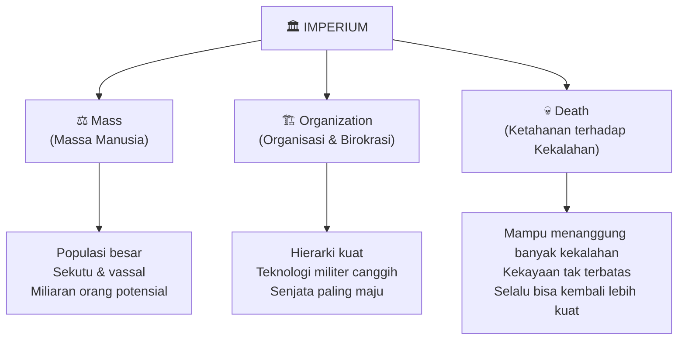
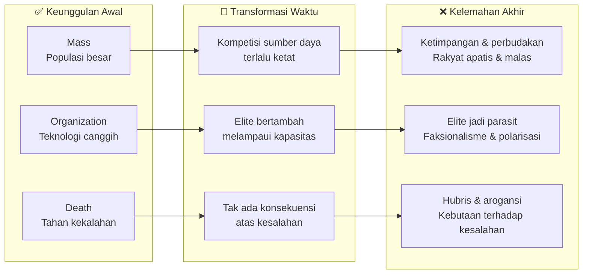
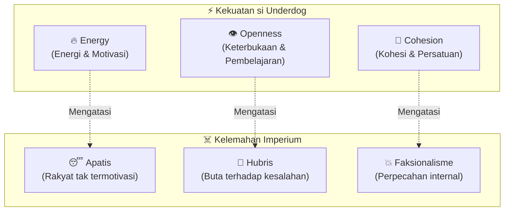
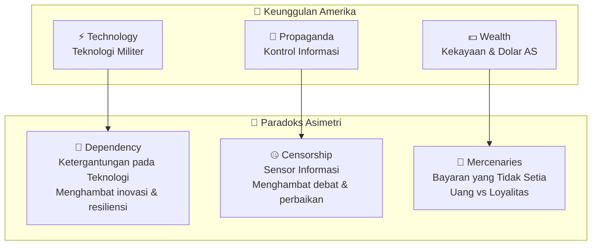
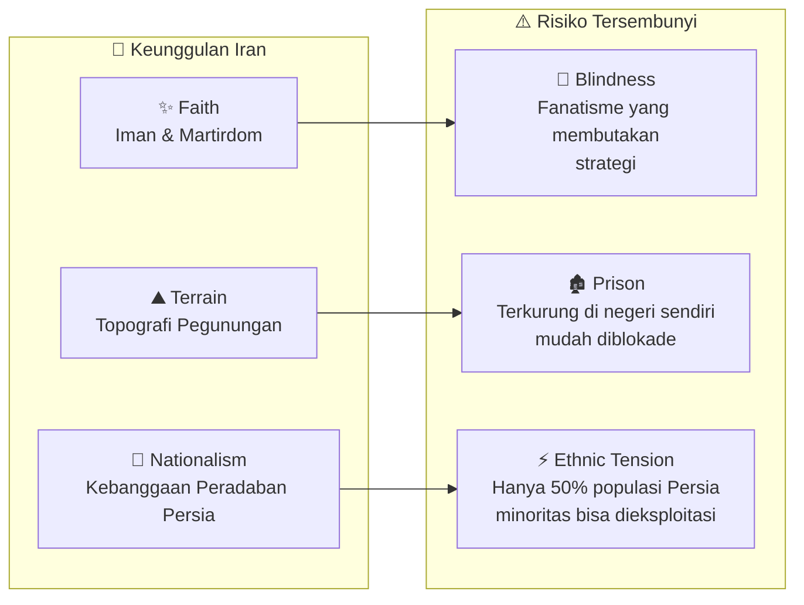
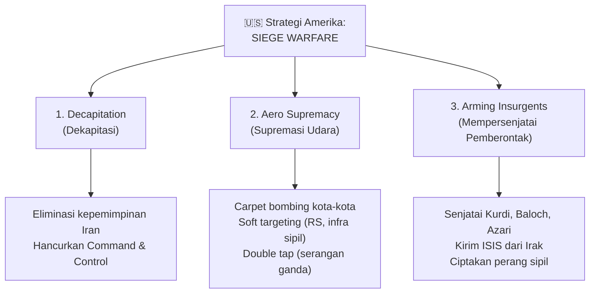
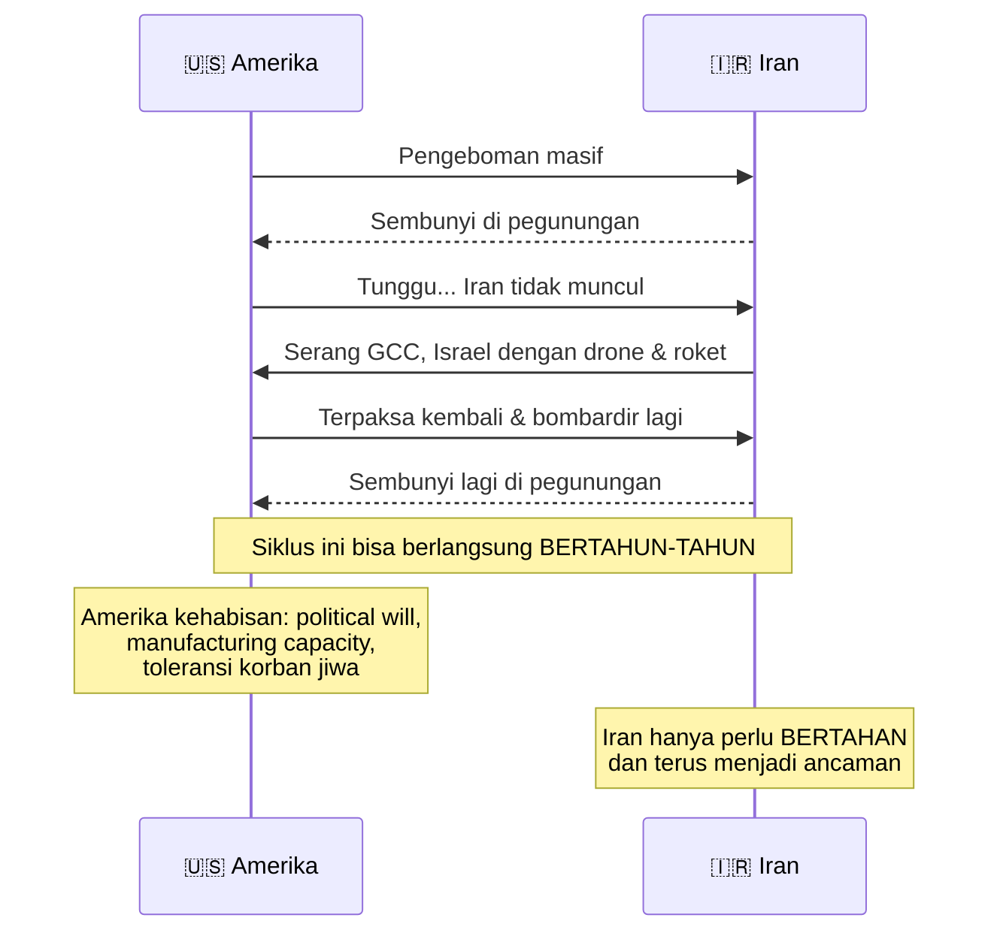
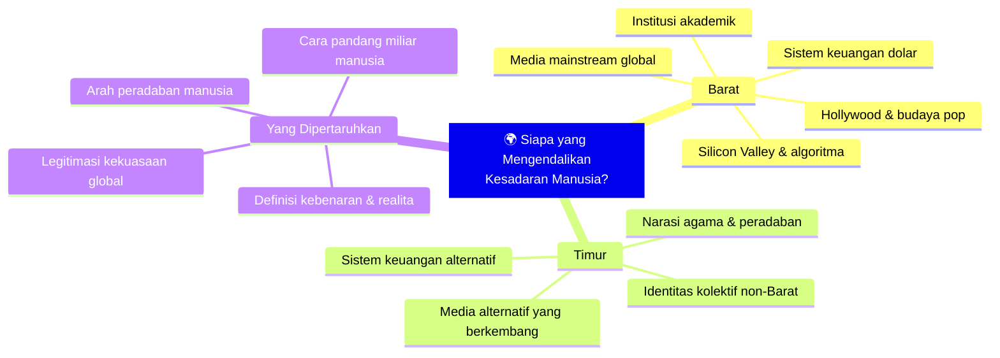
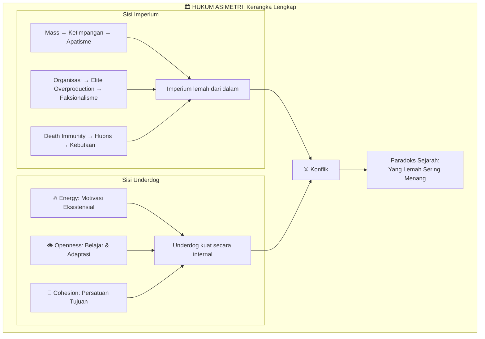

## Pendahuluan: Paradoks yang Terus Berulang dalam Sejarah 🤔

Ada sebuah pertanyaan yang terus menggelitik para ahli sejarah, strategi militer, dan ekonom selama ribuan tahun:

**Mengapa kekuatan terbesar sering kali kalah dari pihak yang jauh lebih lemah?**

Persia — imperium pertama di dunia dengan sumber daya tak terbatas — kalah dua kali dari bangsa Yunani yang jauh lebih kecil. Alexander the Great dengan pasukan suku yang relatif kecil berhasil menaklukkan hampir seluruh Eurasia dalam 10 tahun. Bangsa Viking dan Aztec, yang berasal dari pinggiran, berhasil mengguncang kekuatan besar. Roma dimulai dari sebuah suku kecil sebelum membangun Kekaisaran Mediterania.

Dan hari ini, Amerika Serikat — negara dengan anggaran militer terbesar dalam sejarah umat manusia, dengan teknologi persenjataan paling canggih, dengan jaringan aliansi mencakup sebagian besar dunia — sedang berperang melawan Iran, sebuah negara berpopulasi 92 juta jiwa yang dikepung sanksi ekonomi berlapis.

Dalam **Game Theory #10** ini, kita akan membedah konsep yang menjelaskan paradoks ini: **Hukum Asimetri** (*The Law of Asymmetry*). Sebuah kerangka teoritis yang, begitu Anda memahaminya, akan mengubah cara Anda membaca hampir semua konflik dalam sejarah manusia.

<Callout type="abstract" title="Sumber Kuliah">
Artikel ini adalah ringkasan mendalam dari kuliah Game Theory seri ke-10, yang membahas Hukum Asimetri dalam konteks perang AS-Iran yang sedang berlangsung. Video aslinya tersedia di YouTube: [Game Theory #10: The Law of Asymmetry](https://www.youtube.com/watch?v=t5oisJiorsU).
</Callout>

---

## Bagian I: Tiga Kekuatan Utama Sebuah Imperium ⚔️

Untuk memahami Hukum Asimetri, kita harus terlebih dahulu memahami apa yang membuat sebuah imperium terlihat *tak terkalahkan*.

Setiap imperium besar dalam sejarah memiliki tiga keunggulan struktural yang saling memperkuat:

### 1️⃣ Mass — Massa Manusia yang Tak Terbatas

Amerika Serikat memiliki populasi 350 juta jiwa. Tapi angka itu belum termasuk sekutu-sekutunya: *Five Eyes* (AS, Inggris, Kanada, Australia, Selandia Baru), Eropa, Korea Selatan, Jepang, dan hampir semua negara yang memiliki pangkalan militer Amerika.

Secara efektif, AS bisa mengandalkan miliaran manusia sebagai sumber daya potensial untuk perangnya.

### 2️⃣ Organization — Organisasi dan Teknologi Militer

Ini bukan sekadar birokrasi. *Organization* dalam konteks ini berarti kemampuan mengkonversi sumber daya manusia menjadi kekuatan militer yang terkoordinasi dan terarah.

AS memiliki satelit dengan kemampuan *precision targeting* (*penargetan presisi*) yang bisa mengidentifikasi target dari luar angkasa. Pesawat B-2 Spirit Stealth Bomber — mesin perang yang tak terdeteksi radar. Jet tempur F-35 dengan teknologi yang belum ada tandingannya. Sistem persenjataan yang merupakan puncak inovasi teknologi militer dalam sejarah manusia.

### 3️⃣ Death — Imunitas terhadap Kekalahan

Ini mungkin keunggulan paling tidak intuitif, tapi sangat krusial.

*Death* di sini bukan berarti kematian secara harfiah, melainkan **kemampuan sebuah imperium untuk menanggung banyak kekalahan tanpa runtuh**. Karena kekayaannya nyaris tak terbatas, karena populasinya sangat besar, karena organisasinya sangat kuat — sebuah imperium bisa kalah dalam satu perang dan kembali lagi dengan kekuatan yang lebih besar.

Amerika kalah di Vietnam. Mereka kemudian kembali dengan operasi militer baru di puluhan negara lain. Amerika kalah di Afghanistan selama 20 tahun, lalu pergi begitu saja — dan perekonomiannya tidak runtuh.

<Callout type="important" title="Kekuatan yang Terlihat Sempurna">
Dengan tiga keunggulan ini — massa tak terbatas, organisasi teknologi canggih, dan ketahanan terhadap kekalahan — secara teori sebuah imperium harusnya *kekal dan tak terkalahkan*. Namun sejarah mengatakan hal yang berbeda. Semua imperium jatuh. Dan mereka jatuh dengan sangat keras.
</Callout>

---

## Bagian II: Dialektika Kelemahan — Kekuatan yang Membalik Jadi Bencana 🔄

Di sinilah inti dari Hukum Asimetri mulai terungkap.

**Setiap kekuatan besar sebuah imperium, pada akhirnya, menjadi kelemahan terbesarnya.**

Ini bukan sekadar klise filosofis. Ini adalah mekanisme yang bisa dianalisis secara struktural.

### Massa → Ketimpangan → Apatisme

Ketika populasi sangat besar, terjadi **kompetisi ketat untuk sumber daya yang terbatas**. Terlalu banyak manusia bersaing untuk tanah, pekerjaan, dan kesempatan. Ini menciptakan ketimpangan struktural yang parah, yang kemudian melahirkan perbudakan (dalam berbagai bentuk, termasuk perbudakan utang).

Hasilnya? Rakyat menjadi **apatis, malas, dan tidak percaya pada pemerintah**. Mereka tidak termotivasi untuk bekerja keras, dan yang lebih kritis — mereka tidak termotivasi untuk berperang demi negaranya.

Jika Anda melihat Amerika hari ini: tingkat utang rumah tangga yang mengerikan, kesenjangan antara kaya dan miskin yang terus melebar, generasi muda yang lebih termotivasi untuk *jadi konten kreator* daripada bergabung dengan militer. Ini adalah manifestasi modern dari "massa yang kehilangan vitalitasnya."

### Organisasi → Produksi Berlebih Elite → Faksionalisme

*Organization* melahirkan hierarki. Hierarki melahirkan elite. Dan elite, dalam jangka panjang, cenderung menjadi **parasit** (*pemangsa ekonomi*).

Mekanismenya adalah *rent-seeking* (*perburuan rente*) — proses di mana mereka yang berkuasa menggunakan kekuasaannya untuk mengekstrak kekayaan dari masyarakat tanpa menciptakan nilai baru. Tuan tanah yang menaikkan sewa bukan karena produktivitas meningkat, tapi karena mereka *bisa*. Korporasi yang mendapat kontrak pemerintah bukan karena terbaik, tapi karena *punya koneksi*.

Masalah semakin kompleks karena fenomena yang disebut sejarawan **Peter Turchin** sebagai ***elite overproduction*** (*produksi berlebih elite*): semua orang ingin masuk ke kelas elite, tapi *power is a zero-sum game* — tidak semua bisa mendapatkannya.

Hasilnya? **Faksionalisme**. Perebutan kekuasaan di antara sesama elite. Elite yang terlalu banyak mulai memulai konflik untuk mengakumulasi lebih banyak kekuasaan.

Di Amerika, kita melihat ini dalam bentuk polarisasi ekstrem antara Demokrat dan Republik — dua faksi elite yang saling membenci dan menolak berkoordinasi, bahkan saat menghadapi ancaman eksternal.

### Ketahanan terhadap Kekalahan → Hubris → Kebutaan Strategis

Ini adalah dinamika yang paling berbahaya.

Ketika tidak ada konsekuensi nyata atas setiap kekalahan — karena selalu bisa *comeback* dengan lebih banyak sumber daya — sebuah imperium kehilangan kemampuannya untuk **belajar dari kesalahan**.

Lahirlah apa yang dalam tradisi Yunani disebut ***hubris***: keangkuhan buta yang membuat seseorang tidak mampu melihat kekurangannya sendiri. Bukan sekadar sombong, tapi **kebutaan aktif terhadap realita yang tidak menyenangkan**.

Di level militer dan pemerintahan, *hubris* berarti tidak ada yang berani menyampaikan kabar buruk kepada pemimpin. Tidak ada yang berani mengatakan "strategi ini salah." Semua orang takut kehilangan posisinya jika mengkritisi kebijakan yang sedang berjalan.

Hasilnya? Imperium terus mengulangi kesalahan yang sama, berulang kali, karena tidak ada mekanisme umpan balik yang sehat.

<Callout type="warning" title="Kesimpulan Paradoks">
Jadi: massa menjadi ketimpangan dan apatisme, organisasi menjadi parasitisme dan faksionalisme, dan ketahanan terhadap kekalahan menjadi *hubris* dan kebutaan strategis. Imperium yang terlihat tak terkalahkan dari luar, sebenarnya sedang membusuk dari dalam.
</Callout>

---

## Bagian III: Tiga Kualitas si Underdog — Kunci Kemenangan 🔑

Jika imperium membusuk dari dalam, apa yang membuat si *underdog* (pihak yang lebih lemah) bisa menang?

Hukum Asimetri menyatakan: pihak yang lebih lemah akan mengalahkan imperium jika berhasil mengembangkan **tiga kualitas spesifik** yang justru merupakan antitesis dari kelemahan imperium.

### 🔥 Energy — Motivasi yang Membara

Ketika imperium memiliki rakyat yang apatis, si *underdog* membutuhkan **energi** — motivasi yang mengakar pada kepentingan eksistensial.

Ini bukan soal semangat artifisial yang dipompa oleh propaganda. Ini soal **perbedaan taruhannya**.

Bagi Amerika, kalah di perang Iran adalah sebuah kekalahan yang memalukan — tapi kehidupan di Amerika tidak akan berubah drastis. Tentara pulang ke rumah, bisnis berjalan seperti biasa, dan dua tahun kemudian kebanyakan warga Amerika sudah lupa perang itu terjadi.

Bagi Iran? **Ini adalah pertarungan hidup-mati**. Jika kalah, negara mereka bisa di-*partition* (dipecah-pecah), pemimpin mereka dibunuh, peradaban 5.000 tahun mereka dihancurkan. **Tidak ada opsi mundur.**

Perbedaan dalam *motivasi* ini — yang jarang bisa dikuantifikasi tapi sangat nyata di medan pertempuran — adalah salah satu faktor penentu terbesar dalam konflik asimetris.

### 👁️ Openness — Keterbukaan untuk Belajar

Imperium menjadi tertutup. Mereka terkurung dalam gelembung informasinya sendiri, enggan mengakui kesalahan, menolak inovasi yang datang dari luar hierarki.

Si *underdog* yang cerdas akan melakukan sebaliknya: **menjadi sangat terbuka terhadap informasi, bersedia mengakui kesalahan secara jujur, mempromosikan orang berdasarkan meritokrasi bukan koneksi**, dan belajar dengan cepat dari setiap kekalahan.

Ini adalah keunggulan adaptif. Di medan pertempuran modern, kemampuan untuk belajar dengan cepat dan beradaptasi lebih berharga dari senjata paling canggih sekalipun.

### 🤝 Cohesion — Persatuan dalam Keberagaman

Sementara imperium terpecah-belah oleh faksionalisme elite, si *underdog* yang berhasil mampu menjaga **kohesi internal** — seluruh elemen masyarakat bersatu di balik tujuan bersama.

Ini bukan berarti harus homogen. Iran sendiri adalah negara dengan keberagaman etnis yang signifikan. Tapi dalam menghadapi musuh eksternal, keberagaman internal bisa dilebur menjadi satu identitas bersama yang kuat.

<Callout type="tip" title="Formula Kemenangan si Underdog">
Jika musuh dari imperium memiliki **Energi + Keterbukaan + Kohesi**, mereka akan mengalahkan imperium tersebut. Ini bukan ramalan — ini adalah pola yang terbukti berulang dalam ribuan tahun sejarah manusia.
</Callout>

---

## Bagian IV: Tiga Keunggulan Amerika vs Paradoks Asimetrinya 🦅

Dalam konteks perang AS-Iran, mari kita terapkan Hukum Asimetri secara konkret.

Amerika memiliki tiga keunggulan spesifik yang perlu diperiksa lebih teliti:

### ⚡ Teknologi: Keunggulan yang Melahirkan Ketergantungan

Bayangkan: Anda memiliki kalkulator paling canggih. Anda tidak perlu belajar matematika lagi. Sampai suatu hari kalkulator Anda rusak — dan Anda tidak bisa lagi menjumlah angka sederhana.

Inilah analogi yang tepat untuk ketergantungan Amerika pada teknologi militer.

Ketika Anda memiliki senjata paling canggih di dunia, Anda mulai **mengabaikan kreativitas, improvisasi, dan resiliensi di medan pertempuran**. Anda berpikir: "Jika ada masalah, kirim saja pesawat tempur."

Tapi teknologi bisa gagal. Teknologi bisa di-*jam* (diganggu sinyal). Teknologi membutuhkan infrastruktur logistik yang kompleks. Dan yang lebih penting: **teknologi canggih tidak bisa membeli loyalitas rakyat setempat atau memahami nuansa budaya dan geografi lokal**.

### 📡 Propaganda: Kontrol Informasi yang Menyensor Diri Sendiri

Amerika mengendalikan hampir seluruh ruang informasi global: New York Times, CNN, BBC, YouTube, Google, Twitter/X, Facebook. Ketika Amerika tidak mau Anda tahu sesuatu, sesuatu itu bisa disembunyikan dari mata publik.

Tapi ada harga yang harus dibayar untuk kekuasaan ini.

Ketika Anda mengendalikan narasi, Anda juga **mematikan mekanisme koreksi internal**. Tidak ada yang berani menyuarakan pendapat berbeda — karena mereka tahu akan di-*cancel*, dipecat, atau dicap sebagai pengkhianat.

Hasilnya? Di dalam ruang pengambilan keputusan Amerika — di Pentagon, di Gedung Putih, di Kongres — tidak ada debat yang sungguh-sungguh kritis. Semua orang terlalu takut untuk mengatakan: "Strategi ini bodoh dan kita akan kalah."

Mereka *drinking their own Kool-Aid* — percaya pada propaganda mereka sendiri sampai tidak bisa membedakan mana realita dan mana ilusi.

### 💵 Uang: Ketika Bayaran Tidak Sama dengan Loyalitas

AS memiliki *infinite money printer* — kontrol atas dolar AS yang merupakan *reserve currency* (mata uang cadangan) seluruh dunia. Mereka bisa mencetak uang sebanyak yang dibutuhkan, lalu menggunakan uang itu untuk menyuap, mengarming (*mempersenjatai*), dan merekrut orang-orang untuk melawan Iran dari dalam.

Strateginya elegan di atas kertas: bayar kelompok etnis minoritas di Iran untuk memberontak, beli loyalitas pejabat Iran agar berkhianat, rekrut tentara bayaran untuk memimpin operasi di dalam negeri.

Masalahnya satu: **orang yang berjuang karena bayaran tidak akan mati demi tujuan Anda**.

Mereka akan ambil uangnya dan lari pada momen kritis. Atau lebih buruk — mereka akan menipu AS, mengambil uang sebanyak mungkin sambil tidak benar-benar berjuang. Mereka bukan idealis, mereka adalah ***hustlers*** (*penipu oportunis*).

<Callout type="danger" title="Tiga Masalah Struktural Amerika">
Dari analisis di atas, Amerika menghadapi tiga masalah besar yang bersifat struktural dan sulit diperbaiki dalam jangka pendek:
1. **Kurangnya keinginan politik** (*political will*) — Rakyat AS tidak ingin berperang
2. **Krisis manufaktur dan logistik** — Pabrik sudah dipindahkan ke China
3. **Tidak tahan korban jiwa** — Jika ribuan tentara pulang dalam peti mati, revolusi dalam negeri bisa terjadi
</Callout>

---

## Bagian V: Tiga Keunggulan Iran dan Paradoksnya 🦁

Di sisi lain, Iran memiliki tiga keunggulan spesifik yang — jika dikelola dengan baik — bisa menjadi faktor penentu kemenangan.

### ✨ Iman: Kekuatan Spiritual yang Bisa Menjadi Kelemahan

Muslim Syiah (*Shia*) memiliki tradisi teologis yang sangat dalam tentang **martirdom** — pengorbanan diri untuk kebaikan yang lebih besar. Eskatologi Syiah (*keyakinan tentang akhir zaman*) menempatkan pengorbanan jiwa sebagai bentuk tertinggi ketakwaan.

Dengan Ayatollah Khamenai yang dibunuh oleh Amerika-Israel, motivasi untuk pembalasan (*vengeance*) menjadi sangat kuat dan mengakar secara spiritual.

**Tapi koin ini punya dua sisi.** Iman yang terlalu membara bisa melahirkan ***zealotry*** (*fanatisme buta*) — keberanian tanpa strategi. Ketika tidak takut mati, Anda mungkin akan mengorbankan ribuan tentara dalam posisi yang seharusnya dihindari.

Contoh konkret: Angkatan Laut Iran yang seharusnya disembunyikan atau ditenggelamkan sendiri sebelum AS sempat menghancurkannya — justru dibiarkan dan akhirnya dihancurkan AS. *Faith* tanpa perhitungan strategis bisa menjadi bencana.

### ⛰️ Topografi: Benteng yang Bisa Menjadi Penjara

Iran adalah **negara pegunungan yang sangat luas** — tiga kali ukuran Irak. Invasi darat oleh kekuatan manapun, termasuk AS, dianggap suicidal (*bunuh diri*) oleh hampir semua analis militer.

Pegunungan memberikan perlindungan alami, menyulitkan operasi udara yang presisi, dan menciptakan ladang emas untuk *guerilla warfare* (*perang gerilya*).

**Tapi benteng bisa menjadi penjara.** Topografi yang keras berarti Iran tidak memiliki banyak sumber daya. Musuh bisa memutus pasokan air, listrik, dan makanan tanpa harus memasuki wilayah pegunungan sama sekali. Blokade bisa lebih efektif dari invasi langsung.

### 🦁 Nasionalisme: Kebanggaan 5.000 Tahun yang Bisa Retak

Persia — peradaban Iran — adalah salah satu peradaban tertua dan terkaya dalam sejarah manusia. Bersama Yunani dan Yahudi, Persia membentuk fondasi peradaban Barat. Sastra, filsafat, matematika, arsitektur — warisan Persia tersebar di seluruh dunia.

Kebanggaan ini bisa menjadi **sumber energi luar biasa** ketika rakyat Iran merasa identitas dan peradaban mereka terancam.

**Tapi ada retakan di sini.** Hanya 50% populasi Iran adalah etnis Persia. Sisanya adalah Kurdi, Azari, Baloch, Arab, dan berbagai minoritas lain — yang memiliki keluhan historis tersendiri terhadap dominasi Persia.

Amerika tahu ini, dan strategi mereka secara eksplisit menargetkan perpecahan etnis ini.

---

## Bagian VI: Strategi Amerika — *Siege Warfare* dan Blowback-nya 🎯

Dari analisis kelemahan dan kekuatan kedua pihak, kita bisa memprediksi dengan akurasi tinggi apa strategi Amerika dalam perang ini.

### Dekapitasi: Membuang Pemimpin

Amerika akan mencoba mengeliminasi seluruh lapisan kepemimpinan Iran — dari para Jenderal militer hingga para pemimpin politik dan agama. Tujuannya: menghancurkan kemampuan Iran untuk membuat keputusan terkoordinasi.

**Yang ironis**: dari perspektif Hukum Asimetri, strategi ini justru *membantu* Iran. Ingat masalah *elite overproduction* — terlalu banyak pemimpin yang bersaing? Dengan membunuhi pemimpin-pemimpin ini, Amerika secara tidak sengaja **menyortir kepemimpinan Iran menjadi lebih lean (*ramping*), meritokratis, dan adaptif**.

Yang selamat dari dekapitasi adalah yang paling pintar, paling agresif, dan paling strategis. Persis tipe kepemimpinan yang dibutuhkan di masa perang.

### Supremasi Udara: *Carpet Bombing* dan Paradoksnya

Dengan kekuatan udara yang tidak tertandingi, AS akan:
- **Carpet bombing** (*pengeboman karpet*) — serangan masif pada infrastruktur militer dan sipil
- **Soft targeting** — menyerang rumah sakit, jembatan, pembangkit listrik untuk melemahkan kapasitas negara
- **Double tap** — menyerang dua kali: serangan pertama membunuh target, serangan kedua membunuh orang yang datang menolong — ilegal di bawah hukum internasional, tapi efektif secara psikologis

**Yang ironis**: Dengan mengebom kota-kota Iran, Amerika justru **menyatukan masyarakat Iran yang sebelumnya terpecah antara sekuler perkotaan dan konservatif pedesaan**.

Selama ini, konflik internal Iran yang paling besar adalah antara kaum muda urban yang sekuler dan progresif, versus kelompok pedesaan yang religius dan tradisional. Mereka tidak cocok satu sama lain.

Tapi ketika bom jatuh di kota-kota, warga urban tidak lagi melihat sesama warga pedesaan sebagai musuh. Mereka semua melihat Amerika sebagai musuh bersama. Strategi AS yang dimaksudkan untuk melemahkan Iran justru **menciptakan kohesi sosial yang tidak pernah ada sebelumnya**.

### Mempersenjatai Pemberontak: Api yang Membakar Balik

Amerika akan memanfaatkan perpecahan etnis Iran — Kurdi di barat, Baloch di tenggara, Azari di barat laut — dengan mempersenjatai dan melatih kelompok-kelompok ini untuk memberontak.

Tapi strategi ini punya efek paradoks:

Dengan menyerang identitas etnis minoritas Iran, Amerika justru **membangunkan nasionalisme Persia yang selama ini tertekan oleh teokrasi**. Rezim Iran selama ini tidak terlalu mempromosikan identitas Persia karena ingin menciptakan identitas pan-Islam yang lebih inklusif untuk semua etnis.

Tapi ketika Azari, Kurdi, dan Baloch mulai memberontak dengan dukungan asing, orang-orang Persia harus membangkitkan kembali memori kolektif mereka — Cyrus Agung, Kekaisaran Achaemenid, kejayaan Sasanid — untuk menemukan energi perlawanan.

**Amerika tidak sengaja menciptakan musuh terkuat yang mungkin: Iran yang bersatu di bawah identitas Persia yang bangga dan energetik.**

<Callout type="warning" title="Blowback Strategis">
Ketiga pilar strategi AS — dekapitasi, supremasi udara, dan pemberontakan etnis — masing-masing dirancang untuk melemahkan Iran. Tapi melalui Hukum Asimetri, ketiganya justru menciptakan efek sebaliknya: kepemimpinan yang lebih meritokratis, kohesi sosial yang lebih kuat, dan nasionalisme yang lebih berapi-api. Amerika sedang memenangkan setiap pertempuran taktis sambil kalah dalam perang strategis.
</Callout>

---

## Bagian VII: Strategi Iran — *Guerilla Warfare* dan Logika "Pain in the Ass" 🐝

Jika Amerika bermain *siege warfare* (perang pengepungan), Iran akan merespons dengan ***guerilla warfare*** (perang gerilya).

Logikanya sederhana: **petak umpet berskala militer**.

Iran tidak perlu menang dalam arti tradisional. Iran tidak perlu mengalahkan AS di medan terbuka — itu memang tidak mungkin.

Yang perlu Iran lakukan adalah **menjadi *pain in the ass* yang tidak pernah selesai** — terus menciptakan kerugian ekonomi, terus menyebabkan jatuhnya korban jiwa (meski tidak banyak), terus memaksa AS menghabiskan sumber daya, terus mengguncang pasar minyak dunia, terus membuat AS dalam posisi defensif.

Dan Amerika, karena tidak memiliki *political will*, tidak memiliki kapasitas manufaktur untuk perang panjang, dan tidak tahan korban jiwa — **dipaksa menginginkan perang yang cepat dan murah**, justru skenario yang paling sulit diwujudkan melawan Iran.

### Pertanyaan Terbesar: Apakah AS Akan Invasi Darat?

Pertanyaan terbesar yang akan menentukan nasib perang ini adalah: **apakah Amerika akhirnya akan melakukan invasi darat ke Iran?**

Jika ya — Amerika sudah kalah.

Invasi darat Iran adalah skenario yang dianggap suicidal oleh hampir semua analis militer serius. Pegunungan Iran, ukuran geografis Iran (tiga kali Irak), populasi 92 juta yang bermotivasi tinggi, dan jalur logistik AS yang sangat panjang — semua itu membuat pendudukan Iran tidak mungkin.

Strategi Iran adalah menciptakan tekanan sebesar mungkin untuk *memancing* Amerika melakukan apa yang paling buruk bagi mereka: invasi darat.

---

## Bagian VIII: Rahasia Tersembunyi — Mengapa Perang Ini Benar-Benar Terjadi? 🤯

Di titik ini, muncul pertanyaan yang lebih mendasar: **jika semua orang tahu Amerika tidak bisa menang, mengapa perang ini terjadi?**

Bukan rahasia lagi di kalangan analis militer bahwa selama bertahun-tahun, para Jenderal AS selalu menjawab "tidak" ketika ditanya tentang invasi Iran. Terlalu berisiko, terlalu mahal, tidak ada cara menang. Bahkan rencana invasi Iran yang sudah dipersiapkan bertahun-tahun selalu diblokir oleh penilaian militer yang waras.

Lalu mengapa sekarang?

Versi resmi Trump: negosiasi nuklir yang tidak berhasil. Tapi buktinya kuat bahwa Iran sebenarnya bersedia menerima hampir semua syarat AS.

Versi Marco Rubio (*Menteri Luar Negeri AS*): AS menyerang duluan karena mendengar Israel akan menyerang, dan Iran akan membalas dengan menyerang AS juga. Logika yang aneh dan terdengar seperti **casus belli** (*alasan pembenaran perang*) yang diciptakan.

Lalu ada petunjuk yang sangat mengejutkan:

Laporan dari internal militer AS menyebutkan bahwa beberapa komandan menyampaikan kepada prajuritnya bahwa ini adalah ***war for Jesus* — perang untuk menciptakan Armageddon (*akhir zaman*) dan memicu kedatangan kembali Yesus Kristus**.

Sebuah Perwira Senior diduga menyatakan bahwa **Trump telah "diurapi" oleh Yesus untuk "menyalakan api di Iran" dan menciptakan Armageddon**.

<Callout type="danger" title="Christian Zionism dan Teologi Akhir Zaman">
Apa yang disebut di atas adalah ideologi **Christian Zionism** (*Zionisme Kristen*) — sebuah aliran teologi yang percaya bahwa:
1. Pembentukan kembali negara Israel adalah tanda akhir zaman yang diprediksi Alkitab
2. Perang besar di Timur Tengah (Armageddon) adalah prasyarat kedatangan Yesus kembali
3. Mendukung Israel dan memicu konflik di kawasan ini adalah **tugas suci**

Aliran ini sangat berpengaruh di kalangan evangelis Amerika yang mendukung Trump.
</Callout>

---

## Bagian IX: Batas Game Theory — Ketika Motivasi Bukan Material 🌌

Ini membawa kita ke poin yang paling mengguncang dalam seluruh diskusi Game Theory ini:

**Bagaimana Game Theory bisa menjelaskan perilaku yang tidak rasional secara material?**

Jika pemimpin-pemimpin AS termotivasi bukan oleh kepentingan ekonomi atau geopolitik, tapi oleh keyakinan eskatologis — keyakinan bahwa memulai perang ini adalah kehendak Tuhan — maka semua kalkulasi *cost-benefit* (*untung-rugi*) konvensional menjadi tidak relevan.

Mereka tidak memainkan permainan yang kita kira mereka mainkan.

**Jawabannya adalah: ini masih Game Theory, tapi kita salah mengidentifikasi *reward* yang mereka kejar.**

Kita mengasumsikan permainan yang dimainkan adalah tentang:
- Minyak
- Geopolitik
- Dominasi ekonomi
- Keamanan regional

Tapi jika para pengambil keputusan kunci memainkan permainan yang *reward*-nya adalah:
- Legitimasi teologis
- Identitas "pahlawan akhir zaman"
- Kehidupan kekal bagi yang berkorban
- Kejayaan spiritual yang melampaui kehidupan duniawi

Maka permainan yang kita analisis dan permainan yang mereka mainkan adalah **dua game yang sama sekali berbeda**.

### Kesadaran sebagai Mata Uang Sejati

Di sinilah kita tiba pada **revelation** (*wahyu*) besar yang menjadi penutup kuliah ini:

> *"The real power, the real currency in the world is not money. It is human consciousness — or basically attention."*

Perang ini bukan tentang minyak. Bukan tentang nuklir. Bukan tentang geopolitik regional.

**Ini adalah perang untuk mengendalikan kesadaran umat manusia** — cara miliaran orang memahami realita, menentukan kebenaran, dan memberikan legitimasi kepada kekuasaan.

Karena *consciousness* (*kesadaran*) itulah yang menciptakan semua kekayaan dan kekuasaan di dunia ini.

Siapa yang mengendalikan narasi, mengendalikan cara manusia berpikir — merekalah yang sesungguhnya berkuasa. Dan kekuasaan atas narasi ini sedang diperebutkan secara sangat sengit hari ini, di seluruh platform digital, di seluruh konflik militer, di seluruh pertarungan ideologis yang terjadi bersamaan.

---

## Penutup: Pertanyaan yang Harus Dijawab Sendiri 🔭

Hukum Asimetri memberikan kita kerangka yang powerful untuk memahami konflik ini. Tapi pada akhirnya, ada satu pertanyaan empiris yang harus dijawab oleh perkembangan peristiwa itu sendiri:

**Apakah Iran berhasil mentransformasi dirinya menjadi masyarakat yang energetik, terbuka, dan kohesif?**

Jika jawabannya ya:
- Apakah rakyat Iran semakin termotivasi dan bersatu di balik pertahanan negaranya?
- Apakah kepemimpinan Iran belajar dengan cepat, mengakui kesalahan, dan beradaptasi secara meritokratis?
- Apakah perpecahan internal — antara sekuler dan religius, antara etnis Persia dan minoritas — berhasil diatasi oleh kesadaran identitas bersama?

Jika ketiga pertanyaan ini terjawab dengan "ya", maka prediksi Hukum Asimetri terpenuhi: Iran akan menang, dan Amerika akan kalah — bukan dalam pertempuran individual, tapi dalam perang secara keseluruhan.

<Callout type="quote" title="Hukum Asimetri dalam Satu Kalimat">
"Kekuatan paling besar tidak selalu menang. Yang menang adalah pihak yang mampu mengubah kelemahannya menjadi kekuatan, sementara musuhnya terlena oleh kekuatannya sendiri yang perlahan berubah menjadi kelemahan."
</Callout>

---

## Ringkasan Visual: Seluruh Hukum Asimetri 🗺️

---

*Artikel ini adalah bagian dari seri Game Theory yang membahas aplikasi praktis teori permainan dalam konflik geopolitik kontemporer. Seri sebelumnya: <WikiLink to="game-theory-9-perang-as-iran" label="Game Theory #9: Ikhtisar Strategis Perang AS-Iran" />*
