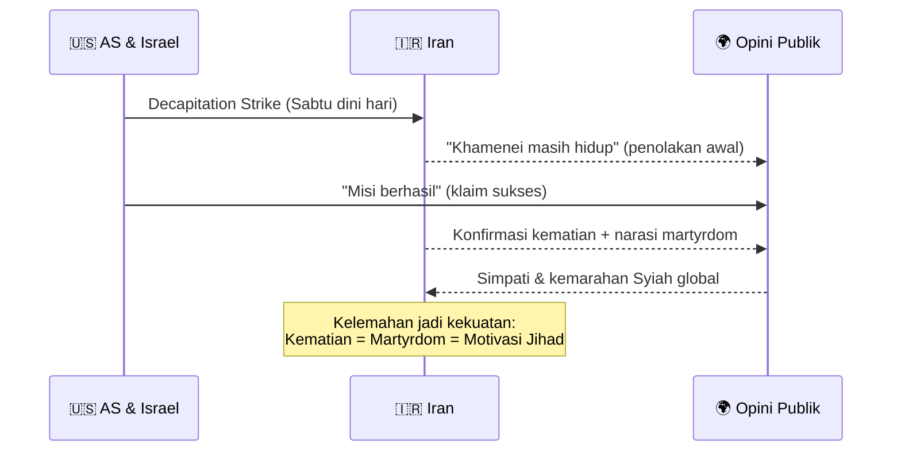
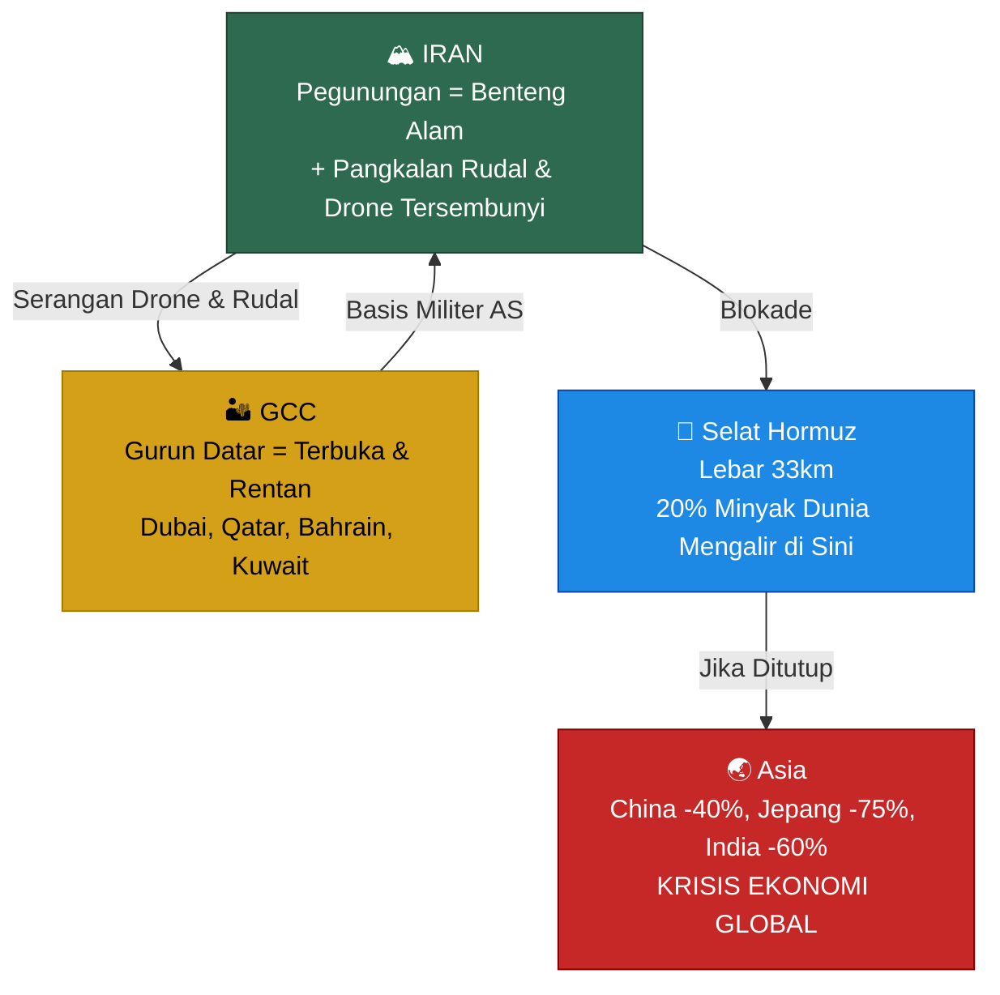
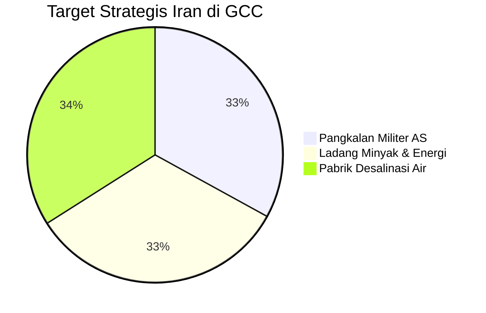
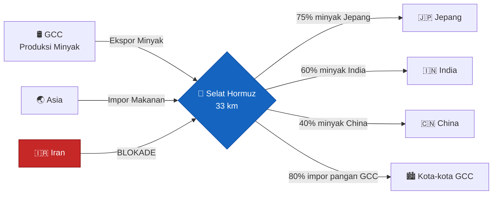
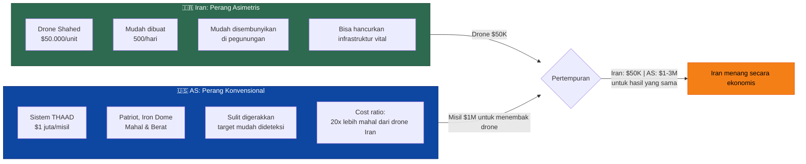
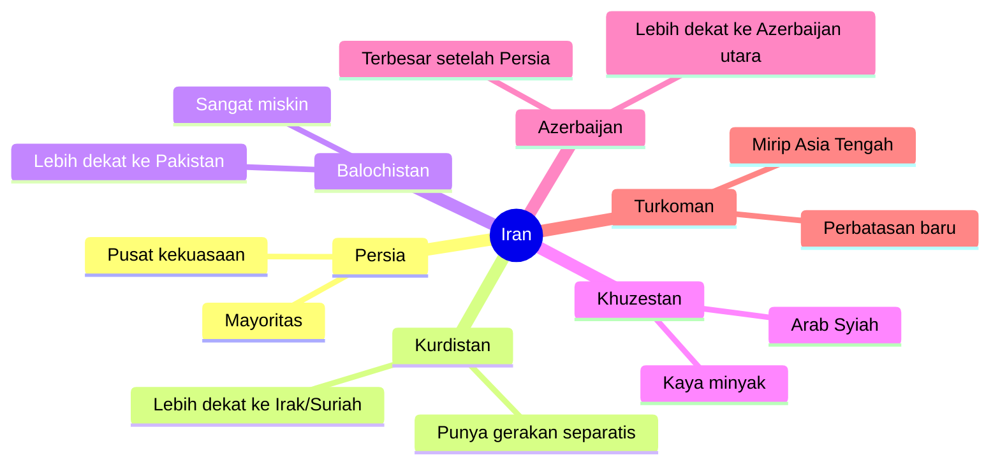
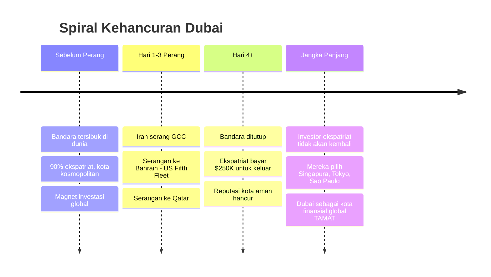
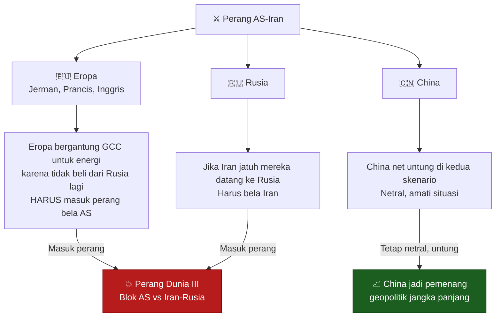
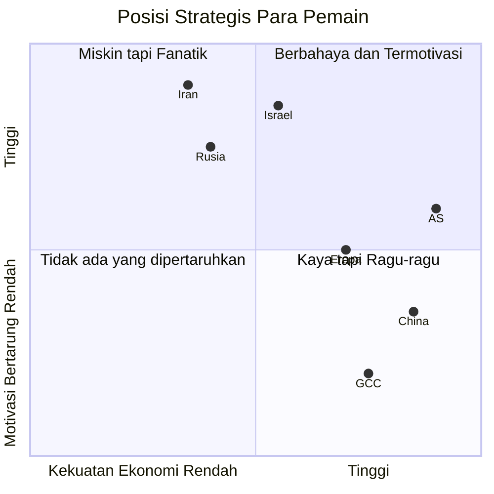

## Selamat Datang di "Akhir Dunia" 🌍💥

*"Setelah perang ini selesai, dunia tidak akan pernah sama lagi."*

Kalimat itu bukan dari novel fiksi ilmiah. Itu adalah pembuka dari sebuah kuliah Game Theory yang direkam saat **Perang AS-Iran** baru memasuki hari keempat. Dan kalimat itu terasa semakin nyata setiap harinya.

Di seri **Game Theory #9** ini, kita tidak akan membahas sejarah semata. Kita akan **membedah konflik terbesar abad ke-21** menggunakan kacamata Teori Permainan — alat analisis yang bisa membantu kita memahami *mengapa* setiap pihak mengambil keputusan yang mereka ambil, dan *ke mana* konflik ini akan berujung.

Kenapa game theory relevan di sini? Karena intinya sederhana: **setiap keputusan strategis bergantung pada apa yang dilakukan pihak lain**. Amerika, Israel, Iran, Arab Saudi, Rusia, China — mereka semua adalah pemain di papan catur raksasa yang taruhannya adalah tatanan dunia itu sendiri. 🎯

<Callout type="warning" title="Konteks Penting">
Artikel ini adalah analisis akademis berdasarkan transkrip kuliah Game Theory. Narasi dan framing berasal dari materi kuliah yang menggunakan pendekatan teori permainan untuk menganalisis konflik geopolitik. Pandangan yang disampaikan adalah pandangan analitis, bukan editorial.
</Callout>

---

## Babak Pertama: Pembunuhan Pemimpin Tertinggi Iran 🎯💀

### Operasi "Decapitation Strike"

Di pagi buta hari Sabtu, pesawat-pesawat Israel dan Amerika meluncurkan apa yang dalam doktrin militer disebut sebagai **"decapitation strike"** — serangan langsung terhadap kepala pimpinan musuh.

Targetnya: **Ayatollah Khamenei**, Pemimpin Tertinggi Iran yang berusia 86 tahun.

Operasi ini melibatkan:
- Intelijen real-time tentang lokasi Khamenei 🔍
- Serangan udara masif ke lokasi tersebut ✈️
- Mata-mata yang berhasil merekam konfirmasi kematian 📹

Iran awalnya **membantah** kematian Khamenei. Tapi akhirnya media pemerintah Iran mengakui: ia gugur dalam serangan udara tersebut. Dan narasi yang dibangun Iran kemudian justru adalah sebuah masterstroke propaganda:

> *"Ia berusia 86 tahun dan sakit kanker prostat. Ia bisa pergi ke Moskow untuk selamat. Tapi ia memilih untuk tinggal dan mati bersama rakyatnya. Ia mati bersama putrinya, menantunya, dan cucu-cucunya."*

### Matematika Martyrdom: Mengapa Kematian Justru Memperkuat Iran 🔥

Di sinilah **kesalahan kalkulasi strategis** terbesar Amerika dan Israel terjadi.

Mereka berpikir: *"Potong kepalanya, tubuhnya akan jatuh."*

Tapi dalam **Syiah Islam**, kematian pemimpin tidak melemahkan gerakan — ia *menyulut* gerakan. Ini bukan sekadar propaganda. Ini adalah **inti dari teologi Syiah** yang sudah berusia lebih dari seribu tahun:

**🕌 Syiah vs Sunni — Perbedaan Mendasar:**
- **Sunni** = mayoritas (~90% Muslim dunia). Lebih pragmatis, lebih tersebar.
- **Syiah** = minoritas, selalu dalam sejarahnya menjadi kelompok yang **dipersekusi**. Karena itulah, konsep **martyrdom** (syahid) menjadi inti identitas mereka.

Bagi Syiah, mati untuk agama bukan tragedi — itu adalah **kehormatan tertinggi**. Dan ketika pemimpin tertinggi mereka terbunuh oleh "Great Satan" (Amerika) bersama keluarganya, itu bukan sinyal untuk menyerah. Itu adalah sinyal untuk **jihad total**. ☠️➡️🔥

<Callout type="important" title="Pelajaran Game Theory: Jangan Salah Baca Payoff Matrix Lawan">
Dalam Game Theory, salah satu kesalahan paling fatal adalah mengasumsikan lawan memiliki **preference yang sama** dengan kita. Amerika mengasumsikan Iran akan "rasional" dalam artian ekonomis: takut mati, takut kalah. Tapi bagi kombatan Syiah yang termotivasi jihad, kematian bukan cost — itu adalah **reward**. Ini mengubah seluruh payoff matrix secara fundamental.
</Callout>

---

## Peta Perang: Geografi adalah Takdir ⛰️🗺️

### Mengapa Peta Ini Menceritakan Segalanya

Bahkan tanpa mengetahui detik-demi-detik pertempuran, **geografi saja** sudah bisa menceritakan bagaimana perang ini akan berkembang.

### Pegunungan Iran = Benteng Tak Tertembus 🏔️

Iran adalah **benteng pegunungan**. Di balik gunung-gunung itu, Iran menyembunyikan:
- Pangkalan rudal balistik 🚀
- Pangkalan drone ✈️
- Gudang senjata tersembunyi 🏭

Dari sini, Iran bisa menyerang ke seluruh kawasan GCC — dan **tidak ada yang bisa dilakukan untuk menghentikannya**. Gurun Arabia yang datar seperti papan biliar: tidak ada tempat sembunyi, tidak ada pertahanan alami.

### GCC = Target Empuk yang Sempurna 🎯

Kawasan GCC (Gulf Cooperation Council) — Dubai, Abu Dhabi, Qatar, Bahrain, Kuwait, Arab Saudi — adalah kebalikan dari Iran:

- **Flat** seperti meja, tanpa cover geografis
- **Terbuka** dari semua sudut serangan
- **Rapuh** karena infrastrukturnya terpusat (pabrik desalinasi, ladang minyak)

Iran **tidak perlu** membunuh tentara Amerika. Iran hanya perlu meledakkan **tiga jenis infrastruktur**:

**1. 🏛️ Pangkalan Militer AS** — Basis operasi AS di Bahrain (US Fifth Fleet), Qatar, dll.

**2. ⛽ Ladang Minyak** — Seberapa sulit mengebom ladang minyak dengan drone? *Tidak sulit sama sekali.* Pertanyaannya bukan *apakah* bisa dihancurkan, tapi *kapan*.

**3. 💧 Pabrik Desalinasi** — Ini yang paling mematikan. GCC tidak punya air tawar alami. Mereka bergantung pada **desalinasi** untuk 60% pasokan air. Satu drone seharga $50.000 bisa menghancurkan pabrik desalinasi bernilai ratusan juta dollar dan membuat jutaan orang kehausan dalam hitungan hari. 😱

<Callout type="danger" title="Angka yang Bikin Ngeri: Water Stress GCC">
Berikut data **water stress index** kawasan ini (100% = minum sebanyak yang diproduksi alam, idealnya 10%):

- 🇪🇬 **Mesir**: 6.420%
- 🇸🇦 **Arab Saudi**: 883%
- 🇧🇭 **Bahrain**: ~4.000%
- 🇦🇪 **Dubai/UAE**: 17.000%

Ya, Dubai mengonsumsi **170x lebih banyak air** dari yang alam produksi. Semuanya bergantung pada listrik untuk desalinasi. Matikan listriknya, matikan kotanya.
</Callout>

---

## Selat Hormuz: Pusar Ekonomi Dunia 🌊💰

### 33 Kilometer yang Menentukan Nasib Dunia

**Selat Hormuz** hanyalah jalur sempit sepanjang 33 kilometer — orang bisa berenang menyeberanginya. Tapi jalur ini adalah **titik pivot** dari seluruh sistem ekonomi global:

**Minyak yang mengalir melalui Hormuz:**
| Negara | Ketergantungan |
|--------|----------------|
| 🇯🇵 Jepang | 75% |
| 🇮🇳 India | 60% |
| 🇨🇳 China | 40% |
| Total dunia | 20% minyak global |

PM Jepang bahkan secara terbuka menyatakan: *"Jika Selat Hormuz ditutup, Jepang kehabisan minyak dalam 8-9 bulan. Ekonomi Jepang akan runtuh."*

Dan Iran **telah menutup** Selat Hormuz.

### Senjata Dua Mata: Hormuz Bisa Membunuh GCC dan Amerika Sekaligus 🗡️

GCC bukan hanya mengekspor minyak. Mereka juga **mengimpor makanan** — 80% dari total kebutuhan pangan mereka datang dari luar. Jika Selat Hormuz tertutup, kapal makanan tidak bisa masuk.

Dubai, Riyadh, Abu Dhabi — kota-kota ini hanya bisa bertahan **beberapa minggu** sebelum krisis pangan melanda.

Tapi efek dominonya jauh lebih besar:

1. GCC **menjual minyak** → dapat Dollar AS
2. Dollar AS itu **diinvestasikan** ke pasar saham Amerika (S&P 500, Nasdaq)
3. Investasi GCC ke pasar AS **terus meningkat** sejak 2012

Jika GCC runtuh → mereka menarik investasi dari pasar AS → **pasar saham AS runtuh** → **ekonomi Amerika runtuh**.

Itu bukan spekulasi. Itu **strategi yang Iran sedang jalankan**. 📉💸

---

## Asymmetry: Kenapa yang "Lemah" Tidak Selalu Kalah ⚖️🎯

### Logika yang Terbalik

Secara konvensional, kita berpikir: Amerika yang punya angkatan bersenjata terbesar di dunia pasti menang melawan Iran yang miskin dan terisolasi. Tapi Game Theory mengajarkan kita: **ukuran dan kekuatan bukan satu-satunya faktor**.

Yang menentukan adalah **asymmetry** — perbedaan cara bertarung.

### The Shahed Drone: Senjata Murah yang Mengubah Segalanya 🚁

Drone Shahad Iran adalah bukti sempurna asymmetric warfare:
- **Harga**: \$35.000–\$50.000 per unit
- **Produksi**: ~500 unit per hari
- **Stok**: ~80.000 unit (estimasi)
- **Kemampuan**: Bisa menghancurkan pabrik desalinasi, ladang minyak, hotel, infrastruktur penting

Dan cara Amerika bertahannya? Menggunakan **THAAD (Terminal High Altitude Area Defense)** dengan harga **$1 juta per misil**. Sering butuh 2-3 misil untuk menembak satu drone.

**Matematikanya**: Iran mengeluarkan $50.000, Amerika harus keluarkan $2-3 juta. Per **satu** engagement. Dalam skala ribuan drone sehari? Itu **kebangkrutan yang terprogram**. 💸

<Callout type="note" title="Mengapa AS Tidak Bersiap untuk Ini?">
Jawabannya: **military doctrine**. Militer AS dibangun saat Perang Dingin — era di mana perang sejati tidak terjadi karena kedua pihak punya nuklir. Perang Dingin adalah **perang pamer** (flexing). Senjata-senjata mahal seperti kapal induk, stealth bomber, sistem pertahanan udara canggih — semuanya dirancang untuk **menakut-nakuti**, bukan untuk perang sesungguhnya.

Akibatnya: sistem militer AS **tidak dirancang** untuk menghadapi ribuan drone murah. Itu titik buta yang Iran manfaatkan sepenuhnya.
</Callout>

### Doktrin "Shock and Awe" yang Gagal Total 💥❌

Amerika menggunakan strategi klasik **Shock and Awe** — serangan masif untuk "memutus kepala" musuh dengan harapan tubuhnya runtuh sendiri.

Masalahnya? Iran **sudah mengantisipasi ini** dengan desentralisasi total:

- Tidak ada satu komando pusat yang bisa dihancurkan
- Setiap wilayah punya perintah dan strategi mandiri
- Hancurkan Teheran? Tentara di wilayah lain tetap bertempur

Lebih parah lagi: **siapa yang paling mendukung rezim Iran?** Bukan warga kota yang berpendidikan dan progresif — justru **kaum fundamentalis Syiah di pedesaan**. Dan siapa yang paling didukung Amerika? Warga kota yang sebenarnya *menginginkan* pergantian rezim.

Dengan membom Teheran, Amerika justru **membunuh sekutunya sendiri** dan membiarkan **musuh sejatinya** tidak tersentuh di pegunungan. 🤦

---

## Kelemahan Iran: Air dan Etnisitas 💧🗺️

### Iran Juga Punya Tumit Achilles 🦶

Meski Iran tampak tak tertembus dari sisi militer, ia punya **dua kelemahan fundamental** yang menjadi target utama strategi Amerika-Israel:

**Kelemahan 1: Krisis Air 💧**

Iran sendiri menghadapi masalah air yang serius. Danau Urmia di Iran Utara — pernah menjadi danau air asin terbesar keenam di dunia — kini **nyaris menghilang**. Foto perbandingan 1984 vs hari ini menunjukkan hampir 90% danau itu lenyap karena perubahan iklim dan eksploitasi berlebihan.

Iran memiliki water stress **72%** — jauh lebih baik dari GCC, tapi tetap mengkhawatirkan. Dan Israel-AS tahu ini.

Strategi mereka: **hancurkan infrastruktur air Iran** — bendungan, reservoir, pembangkit listrik — sehingga Iran menjadi "penjara pegunungan" tanpa air. Warga akan kelaparan dan haus, memaksa mereka memberontak, atau menciptakan krisis pengungsi massal.

**Kelemahan 2: Fragmentasi Etnis 🗺️**

Iran bukan negara monolitik. Di pusat ada **Persia**, tapi di pinggiran ada **10+ kelompok etnis** yang secara budaya lebih dekat dengan negara tetangga mereka daripada dengan Teheran:

Strategi jangka panjang Amerika: **pecah Iran menjadi enklave-enklave etnis** yang saling bersaing memperebutkan air. Bukan lagi satu negara kuat, tapi **sepuluh negara lemah** yang terus berperang internal. Persia dikurung di tengah, sementara pinggiran disusupi uang, senjata, dan dukungan politik dari Washington dan Tel Aviv.

---

## Grand Strategy: Dua Visi yang Bertentangan 🏛️⚔️

Ini inti dari seluruh konflik. Bukan soal nuklir. Bukan soal teroris. Ini soal **siapa yang menguasai tatanan dunia**:

```mermaid
graph TB
    subgraph AS_Plan["🇺🇸🇮🇱 Rencana Amerika-Israel"]
        AP1[Hancurkan Infrastruktur Air Iran]
        AP2[Serang Kota: Ciptakan Krisis Pengungsi]
        AP3[Dukung Kelompok Etnis Minoritas]
        AP4[Pecah Iran jadi Enklave Etnis]
        AP5[Mereka Saling Perang Memperebutkan Air]
        AP6[Hasil: Iran tidak pernah bisa bangkit lagi]
        AP1 --> AP2 --> AP3 --> AP4 --> AP5 --> AP6
    end

    subgraph IR_Plan["🇮🇷 Rencana Iran"]
        IP1[Martyr Khamenei → Sulut Jihad Global Syiah]
        IP2[Hancurkan GCC → Runtuhkan Petrodollar]
        IP3[Tutup Selat Hormuz → Krisis Ekonomi Global]
        IP4[Bangkitkan Pemberontakan Syiah di Bahrain, Pakistan, Irak]
        IP5[Gulingkan Rezim Boneka Arab yang Pro-AS]
        IP6[Hasil: Pax Islamica — Iran sebagai pemimpin dunia Muslim]
        IP1 --> IP2 --> IP3 --> IP4 --> IP5 --> IP6
    end

    style AS_Plan fill:#0d47a1,stroke:#001a72
    style IR_Plan fill:#1b5e20,stroke:#0a3d0a
```

### Petrodollar: Tulang Punggung Kekaisaran Amerika 💵

Untuk memahami kenapa Iran menyerang GCC — bukan langsung Amerika — kita perlu paham **sistem Petrodollar**:

1. **GCC menjual minyak** hanya dengan **Dollar AS** (bukan yuan, bukan euro)
2. Ini menciptakan **permintaan artifisial** terhadap Dollar AS di seluruh dunia
3. GCC lalu **menginvestasikan** Dollar itu di Wall Street
4. Pasar saham AS naik → Ekonomi AS tumbuh → Kekuatan AS bertahan

Hancurkan GCC → Petrodollar runtuh → Dollar AS kehilangan nilai → **Kekaisaran Amerika bubar secara ekonomis**. Itu "senjata nuklir ekonomi" Iran.

<Callout type="abstract" title="Pax Islamica: Visi Akhir Iran">
Iran tidak hanya ingin bertahan. Tujuan akhirnya lebih ambisius: menjadi **pemimpin seluruh dunia Muslim** — bukan hanya Syiah.

Caranya: **gulingkan rezim-rezim boneka AS** di seluruh Timur Tengah (Saudi Arabia, Mesir, Yordania, Algeria) dengan memobilisasi rakyat yang sudah lama menderita di bawah diktator yang didukung Washington. Jika berhasil, Iran menjadi hegemon Islam. Dan Amerika tidak punya jangkauan militer yang cukup untuk menghentikannya.
</Callout>

---

## Babak Dubai: Kematian Sebuah Kota 🏙️💀

### Dari Surga ke Zona Perang dalam Satu Malam

Dubai adalah studi kasus paling dramatis dari perang ini. Bayangkan: kota yang **90% penduduknya adalah ekspatriat asing**, yang membangun identitasnya di atas **keamanan dan netralitas**, tiba-tiba menjadi target serangan Iran.

Apa yang terjadi:
- Bandara Dubai **ditutup** 🛬❌
- Orang kaya rela membayar **$250.000** hanya untuk naik pesawat keluar 💰
- Investasi asing mengalir keluar dengan kecepatan yang belum pernah terjadi sebelumnya 📉

Dan pertanyaannya: **kenapa Iran menyerang Dubai yang "netral"?**

Jawabannya singkat: *karena tidak ada yang benar-benar netral*. GCC menyediakan **pangkalan udara** yang digunakan Israel dan Amerika untuk menyerang Iran. GCC menyediakan **wilayah udara**. GCC memfinansing operasi militer melalui investasi ke AS.

Dalam kalkulus game theory Iran: Dubai bukan korban tak berdosa. Dubai adalah **komponen infrastruktur musuh**. 🎯

---

## Faktor Nuklir dan Ground Troops: Pertanyaan yang Menentukan ☢️🪖

### Dua Pertanyaan Besar yang Menggantung di Udara

Dua skenario yang bisa mengubah seluruh dinamika perang:

**Pertanyaan 1: Apakah AS akan kirim pasukan darat?** 🪖

Secara militer, **satu-satunya cara** menghancurkan Iran secara definitif adalah dengan mengirim pasukan darat — setengah juta hingga dua juta tentara — untuk menggulingkan pemerintahannya.

Tapi ini memiliki implikasi yang mengerikan:
- Iran adalah negara **4x lebih besar dari Irak** 🗺️
- Medan pegunungan sangat tidak menguntungkan penyerang
- Pasukan AS akan menghadapi perlawanan religius yang tidak takut mati

Apakah Amerika punya kemauan politik untuk itu? Secara historis, setelah Vietnam, Afghanistan, dan Irak — jawabannya sangat diragukan.

**Pertanyaan 2: Apakah Iran akan gunakan senjata nuklir?** ☢️

Jika Iran meyakini mereka akan kalah secara total, apakah mereka akan menggunakan nuklir sebagai opsi terakhir?

Ini bukan pertanyaan akademis. Ini adalah **real-time game of chicken** — permainan ayam — di mana kedua pihak memacu mobil mereka ke satu sama lain dengan harapan pihak lain yang swerve duluan.

<Callout type="danger" title="Game of Chicken di Skala Global ☢️">
Game of Chicken adalah situasi di mana dua pihak saling mendekat dengan kecepatan penuh, dan yang pertama **membelok dianggap kalah**. Tapi jika keduanya tidak membelok, **keduanya hancur**.

Masalahnya: Iran adalah negara Syiah yang percaya pada martyrdom. Mereka memiliki **threshold toleransi kekalahan yang jauh lebih tinggi** dari Amerika. Dalam game of chicken, siapa yang tidak takut mati... tidak akan membelok lebih dulu. 🚗💥🚗
</Callout>

---

## Dimensi Global: Ketika Semua Ikut Terlibat 🌐

### Mengapa Ini Bisa Benar-Benar Menjadi PD III

Konflik ini tidak bisa tetap lokal. Setiap pemain besar dunia punya **kepentingan eksistensial** di sini:

**Eropa 🇪🇺**: Setelah konflik Ukraina, Eropa tidak bisa beli energi dari Rusia. Mereka 100% bergantung pada GCC. Jika GCC runtuh, Eropa dalam krisis energi parah. Mereka **tidak punya pilihan** selain mendukung AS secara militer.

**Rusia 🇷🇺**: Bagi Putin, membiarkan Iran jatuh adalah bunuh diri strategis. Jika Amerika bisa gulingkan Iran, langkah berikutnya adalah Rusia. Moskow sudah berikan sanctuary kepada banyak pemimpin Iran. Mereka **tidak akan tinggal diam**.

**China 🇨🇳**: Posisi paling menarik. China sebenarnya *bisa* menang di kedua skenario. Mereka punya hubungan dengan Iran (energi), sekaligus dengan AS (perdagangan). China kemungkinan akan **tetap netral** — sambil mengkonsolidasikan pengaruh di kawasan yang terbengkalai akibat perang.

---

## Koneksi Ukraine-Iran: Satu Perang, Dua Front 🔗

Salah satu insight paling underrated dari analisis ini: **perang Ukraine dan perang Iran adalah konflik yang sama**. Mereka terhubung:

- Rusia butuh Iran untuk mempertahankan diri dari ekspansi NATO
- Iran butuh Rusia untuk balancing kekuatan AS
- Eropa tidak bisa ambil minyak Rusia → minta GCC → GCC diserang Iran → Eropa krisis energi
- Krisis energi Eropa memaksa Eropa fokus ke Timur Tengah, **melupakan Ukraine**

Atau sebaliknya: jika AS terlalu terjebak di Iran, mereka melemah di front Ukraine — memberi Rusia peluang di Eropa Timur.

Ini adalah **grand game of two-front war** yang belum pernah dunia alami sejak 1939–1945.

---

## Kesimpulan: Dunia Sedang dalam Permainan yang Tidak Ada Pemenangnya 🌍♟️

Setelah membedah semua ini, kita sampai pada kesimpulan yang menyedihkan: **tidak ada pemenang dalam perang ini**. Yang ada hanya siapa yang bertahan lebih lama dan siapa yang hancur lebih cepat.

**Siapa yang paling berpotensi "menang"?** Secara ironisnya: **China**. Mereka tidak ikut bertempur, tapi mereka akan membangun ulang hubungan dengan siapapun yang menang, sambil mengisi kekosongan kekuatan yang ditinggalkan perang.

**Siapa yang paling rentan kalah?** **GCC**. Mereka tidak punya ideologi, tidak punya geografi yang defensif, dan sebagian besar penduduknya adalah ekspatriat yang akan pergi begitu keadaan tidak nyaman.

**Pelajaran Game Theory terbesar dari semua ini?** 🎓

> **Jangan pernah memulai perang yang tujuannya tidak bisa dicapai dengan cara militer.** Amerika bisa menghancurkan Iran secara fisik, tapi tidak bisa menghancurkan *ide* jihad, *nilai* martyrdom, dan *jaringan* Syiah global yang sudah ada selama 14 abad. Kamu tidak bisa memenangkan permainan jika kamu bahkan tidak memahami payoff matrix lawan.

<Callout type="cite" title="Sumber">
Artikel ini diadaptasi dari transkrip kuliah **Game Theory #9: The US-Iran War** yang disampaikan secara langsung sebagai analisis akademis di tengah konflik yang sedang berlangsung. Video asli tersedia di YouTube.

📎 https://www.youtube.com/watch?v=jIS2eB-rGv0
</Callout>

---

## Pertanyaan untuk Dipikirkan Bersama 🤔

Setelah membaca analisis ini, ada beberapa pertanyaan yang layak kita renungkan:

1. **Apakah "shock and awe" bisa pernah berhasil** melawan pihak yang tidak takut mati?
2. **Siapakah yang benar-benar mengendalikan** Amerika — rakyatnya, atau konglomerat industri militer yang untung dari setiap perang?
3. **Apa yang akan Indonesia lakukan** jika Selat Hormuz tertutup permanen dan harga minyak meledak 300%?
4. **Bisakah perang ini berakhir dengan negosiasi**, atau sudah terlalu dalam untuk kembali?

Dan mungkin pertanyaan paling penting:

> *Ketika kedua pihak memiliki kemampuan untuk menghancurkan satu sama lain, dan keduanya memiliki alasan kuat untuk tidak mundur — apakah ada jalan keluar yang tidak melibatkan kehancuran bersama?*

Dalam **Game Theory**, situasi seperti ini disebut **Nash Equilibrium dari kehancuran mutual**. Tidak ada pihak yang bisa membaik dengan mengubah strategi secara sepihak. Satu-satunya jalan keluar adalah **mengubah permainan itu sendiri**. 🕊️

Dan mengubah permainan, dalam konteks ini, berarti: **negosiasi yang jujur, mediator yang kredibel, dan kompromi yang menyakitkan dari semua pihak**.

Semoga dunia menemukan jalannya ke sana. 🙏
