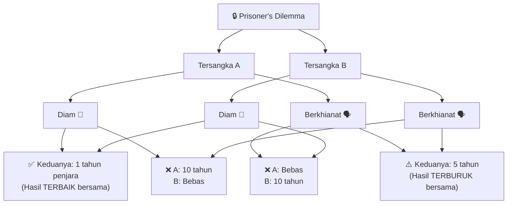
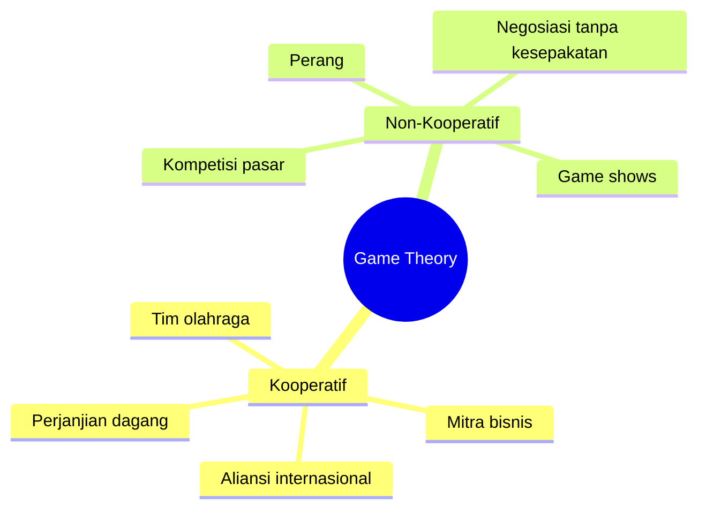
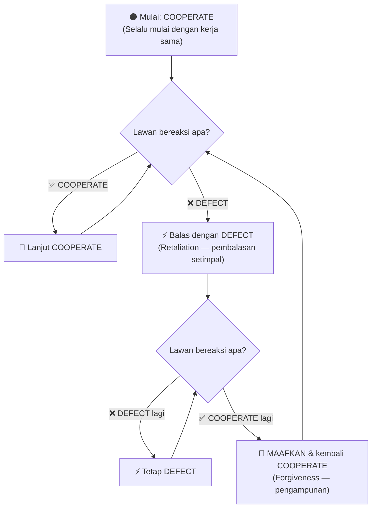
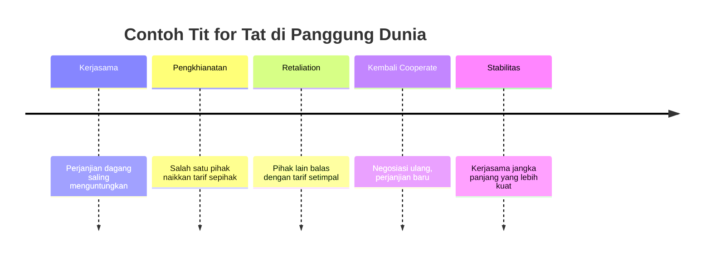
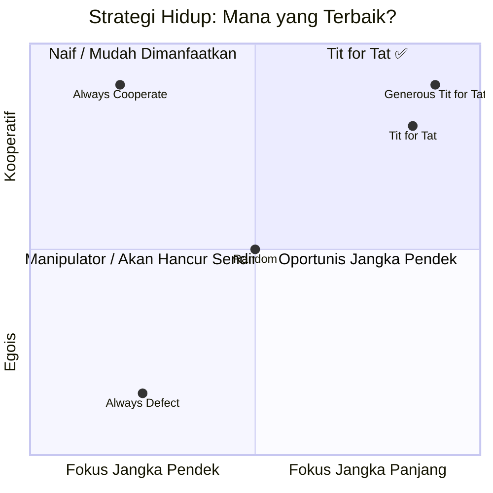
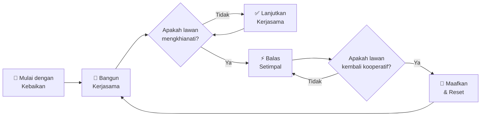

## 🎯 Bayangkan Situasi Ini

Kamu berumur 23 tahun. Baru pindah ke apartemen dua kamar bersama seorang teman — bukan sahabat dekat, tapi bukan orang asing juga. Kalian sepakat membagi tugas rumah tangga: kamu cuci piring hari Minggu, dia hari Rabu.

Minggu pertama, kamu cuci. Rabu pertama, dia cuci. Semua berjalan lancar.

Lalu suatu hari Rabu, pulang kerja larut malam, kamu melihat tumpukan piring kotor di dapur. Kamu diam, pikir mungkin dia cuma lupa. *Besok pasti beres.*

Tapi Minggu berikutnya tiba — tumpukan makin tinggi. Piring meluber keluar dari bak cuci. Dia tidak di rumah, kamu akhirnya cuci sendiri.

Minggu berikutnya, dia cuci. Lega.

...Sampai Rabu berikutnya datang lagi. Piring menumpuk lagi. Kamu tegur. Dia bilang "oke nanti". Keesokan harinya? Masih numpuk. Lusa? Masih.

**Kamu sekarang dihadapkan pada pertanyaan yang lebih dalam dari sekadar piring kotor:**

> *Strategi apa yang paling tepat untuk menghadapi situasi ini? Dan lebih jauh lagi — strategi apa yang paling optimal dalam menghadapi kehidupan secara keseluruhan?*

Pertanyaan inilah yang dijawab oleh sebuah cabang ilmu yang disebut **Game Theory** (Teori Permainan).

---

## 🧠 Apa Itu Game Theory?

**Game Theory** — atau dalam Bahasa Indonesia disebut **Teori Permainan** — adalah studi matematis tentang pengambilan keputusan dan strategi dalam situasi di mana hasil akhir bergantung pada pilihan orang lain, bukan hanya dirimu sendiri.

Lebih tepatnya, Game Theory memeriksa bagaimana **konflik** dan **kerjasama** di antara para pengambil keputusan yang rasional dapat menghasilkan hasil yang optimal atau justru suboptimal (kurang ideal).

<Callout type="info" title="Definisi Singkat">
🎲 **Game Theory** = Ilmu tentang strategi pengambilan keputusan dalam situasi yang melibatkan lebih dari satu pihak, di mana pilihan setiap pihak memengaruhi hasil untuk semua pihak yang terlibat.
</Callout>

Dalam konteks Game Theory, kata *"game"* (permainan) tidak hanya berarti permainan konvensional seperti catur atau poker. **"Game" merujuk pada setiap interaksi** antara dua pihak atau lebih yang memiliki hasil saling memengaruhi, baik itu:

- 🏠 Dua teman sekamar yang berbagi tugas rumah
- 🏢 Dua perusahaan yang bersaing di pasar
- 🌍 Dua negara yang bernegosiasi perjanjian dagang
- ⚔️ Dua negara yang saling mengancam dengan kekuatan militer

Intinya: hampir **semua interaksi langsung dalam kehidupan** adalah sebuah "game" dalam terminologi ini.

---

## 🔒 Dilema Narapidana (Prisoner's Dilemma)

Salah satu konsep paling terkenal dalam Game Theory adalah **Prisoner's Dilemma** (Dilema Narapidana). Ini adalah situasi hipotetis di mana dua individu sebenarnya bisa mendapat hasil terbaik jika saling bekerja sama — namun masing-masing punya insentif pribadi untuk mengkhianati yang lain.

Cerita klasiknya begini:

> Dua orang tersangka ditangkap polisi dan diinterogasi di ruang terpisah. Mereka tidak bisa berkomunikasi. Polisi menawarkan kepada keduanya: **"Kalau kamu bersaksi melawan temanmu, kamu bebas — tapi temanmu 10 tahun penjara. Kalau kalian berdua diam, masing-masing hanya 1 tahun. Kalau kalian berdua bersaksi, masing-masing 5 tahun."**

Secara logika individualis, **berkhianat** selalu tampak lebih menguntungkan — apapun yang dilakukan orang lain. Tapi jika keduanya berpikir sama, hasilnya justru buruk untuk keduanya.

Inilah paradoks utama dalam Prisoner's Dilemma: **pilihan yang paling "rasional" secara individual menghasilkan outcome (hasil) yang buruk untuk semua.**

---

## 🎮 Dua Jenis Interaksi dalam Game Theory

Game Theory membedakan dua tipe fundamental dari interaksi:

### 🤝 1. Cooperative Game Theory (Teori Permainan Kooperatif)

Dalam interaksi kooperatif, semua pihak memiliki **tujuan yang sama atau selaras**. Contohnya:
- Rekan satu tim sepak bola
- Pasangan bisnis (partner)
- Aliansi internasional dan perjanjian dagang

Di sini, sumber daya dan informasi sering dibagi secara bebas, dan keadilan serta manfaat bersama (*mutual benefit*) secara aktif dikejar.

### ⚔️ 2. Non-Cooperative Game Theory (Teori Permainan Non-Kooperatif)

Ini jauh lebih umum di dunia nyata dan — jujur saja — jauh lebih menarik. Dalam interaksi non-kooperatif, setiap pihak bertindak **secara mandiri demi kepentingannya sendiri**, berpotensi merugikan pihak lain.

Contoh nyata yang menarik: acara TV Inggris akhir 2000-an bernama **"Golden Balls"**. Dua orang asing duduk berhadapan dan memilih: **Split** (bagi dua) atau **Steal** (ambil semua).

| Pilihan A | Pilihan B | Hasil A | Hasil B |
|-----------|-----------|---------|---------|
| Split | Split | 50% uang | 50% uang |
| Split | Steal | ❌ Nol | ✅ 100% |
| Steal | Split | ✅ 100% | ❌ Nol |
| Steal | Steal | ❌ Nol | ❌ Nol |

Dalam situasi *one-off* (sekali jadi) seperti ini, Game Theory secara matematis menunjukkan bahwa **"Steal" adalah pilihan dominan yang rasional** — apapun yang dilakukan lawan. Tapi tentu saja, hidup bukan acara TV. Hampir tidak ada interaksi yang benar-benar "sekali jadi" tanpa konsekuensi jangka panjang.

---

## 🏆 Eksperimen Axelrod 1980: Turnamen Komputer Legendaris

Pada tahun **1980**, ilmuwan politik bernama **Robert Axelrod** melakukan sesuatu yang revolusioner. Ia ingin menjawab pertanyaan besar:

> 🤔 *"Dari semua strategi pengambilan keputusan yang ada, manakah yang paling efektif dalam jangka panjang?"*

Axelrod mengundang para pakar dari berbagai disiplin ilmu di seluruh dunia untuk mengirimkan **program komputer** yang akan bertarung dalam sebuah turnamen berbasis *iterated Prisoner's Dilemma* (Dilema Narapidana yang Diulang).

### 📋 Aturan Turnamen

- Setiap program bertanding melawan semua program lain (termasuk salinan dirinya sendiri)
- Setiap pertandingan terdiri dari **200 ronde**
- Dalam setiap ronde: **Cooperate** (kerja sama) atau **Defect** (khianati)

**Sistem poin:**

| Skenario | Poin Kamu | Poin Lawan |
|----------|-----------|------------|
| Kamu Cooperate, Lawan Cooperate | 3 | 3 |
| Kamu Cooperate, Lawan Defect | 0 | 5 |
| Kamu Defect, Lawan Cooperate | 5 | 0 |
| Kamu Defect, Lawan Defect | 1 | 1 |

### 🎭 Karakter-Karakter yang Bersaing

Program-program yang masuk beragam karakternya:

- 🦁 **Grass Camp** — Sangat licik (*cunning*), menguji kelemahan lawan lalu mengeksploitasinya
- 🎲 **Jaws** — Menyelipkan gerakan acak untuk menciptakan kebingungan dan kejutan
- 😈 Program-program *nasty* lainnya — Agresif sejak awal, jarang kooperatif
- 😊 Program-program *nice* — Kooperatif di awal, responsif

Total ada **14 program** yang bersaing (ditambah satu program acak 50/50 yang ditambahkan Axelrod sendiri).

### 🥇 Pemenangnya?

Setelah turnamen selesai, Axelrod menjalankan ulang seluruhnya **5 kali** untuk memastikan hasilnya konsisten. Dan setiap kali, pemenangnya selalu sama:

<Callout type="success" title="🏆 Pemenang: TIT FOR TAT">
Program paling sederhana dan paling kooperatif dari semua yang bersaing. Dikirim oleh psikolog **Anatol Rapoport** — hanya 4 baris kode.
</Callout>

Pada turnamen kedua, Axelrod meningkatkan kompleksitas: tidak ada jumlah ronde yang tetap (seperti kehidupan nyata — kamu tidak tahu kapan interaksi berakhir). **62 program** bersaing. Hasilnya? **Tit for Tat menang lagi.**

---

## 🔄 Strategi Tit for Tat: Sesederhana Itu

**Tit for Tat** (secara harfiah: "ganti rugi setimpal" atau dalam idiom Indonesia: "balas budi setimpal") memiliki aturan yang sangat sederhana:

### 4 Sifat Kunci Tit for Tat

Axelrod merangkumnya dengan sempurna dalam bukunya *"The Evolution of Cooperation"* (Evolusi Kerjasama):

<Callout type="tip" title="4 Pilar Kesuksesan Tit for Tat">

**1. 😊 Nice (Ramah)** — Selalu mulai dengan kooperasi. Tidak pernah menjadi pihak pertama yang mengkhianati. Ini mencegahnya terjebak dalam konflik yang tidak perlu.

**2. ⚡ Retaliatory (Reaktif/Tegas)** — Segera membalas pengkhianatan. Ini mencegah lawan memanfaatkannya secara terus-menerus.

**3. 💚 Forgiving (Pemaaf)** — Begitu lawan kembali kooperatif, langsung maafkan dan mulai ulang. Tidak menyimpan dendam (*grudge*).

**4. 🔍 Clear (Transparan)** — Strateginya mudah dibaca. Lawan tahu apa yang akan terjadi. Ini membangun kepercayaan dan mendorong kerjasama jangka panjang.

</Callout>

### 🤔 Paradoks Menarik: Tidak Pernah Menang Satu Pertandingan Pun

Fakta mengejutkan: **Tit for Tat tidak pernah memenangkan satu pertandingan individual pun.** Dalam duel satu lawan satu, ia hanya bisa seri atau kalah — karena tidak pernah mengeksploitasi lawan.

Tapi itulah yang membuatnya jenius: dengan **konsisten kooperatif**, ia mengumpulkan poin dari banyak pertandingan sehingga secara keseluruhan memiliki skor tertinggi. Ia menang di *tournament* meskipun tidak menang di setiap *game*.

> 💡 **Insight Kunci:** Dalam kehidupan, fokus pada "menang setiap pertandingan" sering kali adalah strategi yang salah. Yang penting adalah **menang dalam jangka panjang** — dan itu membutuhkan kerjasama, bukan perang.

---

## 🌍 Dari Komputer ke Kehidupan Nyata

Mengapa semua ini relevan dengan hidup kita sehari-hari? Karena hampir semua dinamika manusia — dari hubungan personal hingga geopolitik — bisa dipetakan ke dalam kerangka ini.

### 🏠 Di Rumah: Masalah Piring Kotor

Kembali ke skenario awal. Dengan kacamata Tit for Tat:

- **Minggu pertama** → Kamu lakukan bagianmu (Cooperate)
- **Lawan skip** → Kamu awalnya maafkan (Forgive sekali — generous Tit for Tat)
- **Lawan skip lagi** → Saatnya *retaliate*: kamu juga skip, atau konfrontasi langsung
- **Lawan kembali kooperatif** → Kamu maafkan dan kembali kooperatif

Bukan dendam, bukan juga menjadi *doormat* (keset — orang yang selalu diinjak). **Tegas namun adil.**

### 💼 Di Bisnis: Negosiasi dan Kompetisi

Perusahaan-perusahaan besar yang menerapkan strategi "curi pasar dengan segala cara" sering kali mendapat balasan setimpal: boikot, tuntutan hukum, kehilangan mitra. Sebaliknya, perusahaan yang membangun reputasi fair play (*main adil*) cenderung mendapat kerjasama jangka panjang yang jauh lebih menguntungkan.

### 🌏 Di Geopolitik: Hubungan Antarnegara

Ini bukan hanya teori — ini adalah pola yang berulang dalam sejarah diplomasi internasional.

---

## ⚠️ Keterbatasan: Dunia Nyata Lebih Rumit

Axelrod sendiri mengakui bahwa ada keterbatasan eksperimennya. Program dan simulasi komputer, semaju apapun, tidak bisa sepenuhnya mereplikasi kompleksitas interaksi nyata:

<Callout type="warning" title="Keterbatasan Game Theory">

**Dunia nyata melibatkan:**
- 👥 Banyak pihak sekaligus (bukan hanya dua)
- 🌀 Informasi yang tidak lengkap dan asimetris
- 💸 Sumber daya dan leverage (kekuatan tawar) yang tidak setara
- ❤️ Emosi, sentimen, dan irrasionalitas manusia
- 🎭 Kepentingan yang berubah-ubah
- 🌪️ Chaos dan kejadian tak terduga

</Callout>

Manusia adalah makhluk yang merasakan, berharap, dan percaya — bukan hanya menghitung dan mengeksekusi. Ini membuat aplikasi Game Theory di dunia nyata selalu memerlukan **kebijaksanaan dan konteks**, bukan sekadar formula.

Namun demikian, prinsip-prinsipnya tetap sangat relevan sebagai **panduan orientasi**, bukan resep kaku.

---

## 💡 Pelajaran yang Bisa Kamu Bawa Pulang

### 1. 😊 Mulailah dengan Kebaikan — Itu Bukan Kelemahan

Tit for Tat selalu memulai dengan kooperasi. Dalam kehidupan, ini berarti: beri kepercayaan di awal. Anggap orang lain berniat baik sampai terbukti sebaliknya. Ini bukan naivitas — ini adalah **strategi optimal yang telah terbukti secara ilmiah**.

### 2. ⚡ Tegaslah pada Pengkhianatan — Jangan Jadi Korban

Membiarkan orang melakukan kesalahan tanpa konsekuensi adalah undangan untuk terus dimanfaatkan. **Retaliation yang proporsional** — bukan berlebihan, tidak kurang — adalah tanda kesehatan dalam hubungan apa pun.

### 3. 💚 Maafkan, Tapi Jangan Lupakan Pola

Begitu lawan kembali menunjukkan itikad baik, maafkan. Tapi tetap ingat polanya — karena ini akan membantumu memutuskan seberapa besar kepercayaan yang pantas diberikan ke depan. **Forgiveness ≠ Naivety** (Memaafkan ≠ Kebodohan).

### 4. 🔍 Jadilah Transparan dan Konsisten

Ketika orang tahu apa yang bisa mereka harapkan darimu, mereka lebih mungkin untuk bekerja sama. Opasitas (*ketidaktransparanan*) dan manipulasi mungkin menguntungkan jangka pendek, tapi merusak kepercayaan jangka panjang yang jauh lebih berharga.

### 5. 🎯 Tidak Semua Pertandingan Harus Dimenangkan

Banyak orang terobsesi untuk "menang" di setiap interaksi — setiap argumen, setiap negosiasi, setiap pertemuan. Tit for Tat mengajarkan bahwa ini kontraproduktif. **Hasil jangka panjang lebih penting dari kemenangan sesaat.**

---

## 🧬 Evolusi, Alam, dan Moralitas

Menariknya, prinsip Tit for Tat tidak hanya ditemukan dalam simulasi komputer. Axelrod kemudian mengeksplorasi bagaimana strategi serupa muncul secara **alami dalam evolusi biologi** — pada hewan, tumbuhan, bahkan bakteri. Kerjasama yang terbentuk bukan karena altruisme (*kebaikan tanpa pamrih*) murni, tapi karena **secara strategis menguntungkan** dalam jangka panjang.

Dari perspektif moral dan sejarah, strategi Tit for Tat pada dasarnya mencerminkan prinsip **"mata ganti mata"** (*an eye for an eye*) — namun dengan nuansa penting: setelah konsekuensi proporsional ditegakkan, **keseimbangan dan kerjasama harus dipulihkan**.

Ini bukan balas dendam tanpa henti. Ini adalah keadilan yang memungkinkan rekonsiliasi (*perdamaian kembali*).

<Callout type="quote" title="Robert Axelrod — The Evolution of Cooperation">
"What makes it possible for cooperation to emerge is the fact that the players might meet again."

*"Yang memungkinkan kerjasama muncul adalah fakta bahwa para pemain mungkin akan bertemu lagi."*
</Callout>

---

## 🔁 Ringkasan: The Simple Strategy

**Strategi ini bekerja karena:**

1. ✅ Tidak pernah memulai konflik
2. ✅ Tidak membiarkan dirinya dimanfaatkan
3. ✅ Tidak menyimpan dendam yang tidak produktif
4. ✅ Mudah dibaca dan diprediksi → membangun kepercayaan

---

## 🏁 Penutup: Cuci Piringmu

Di akhir video yang menginspirasi artikel ini, naratornya berkata sesuatu yang sederhana namun resonan:

> *"At least for starters, for our own sake, when our day comes, let's be sure we do the dishes."*
> 
> *"Setidaknya untuk permulaan, demi kebaikan kita sendiri — ketika giliran kita tiba, pastikan kita mencuci piring."*

Ini adalah metafora yang sempurna. Sebelum kita bisa mengubah dunia, kita harus bisa diandalkan dalam hal-hal kecil. Kita harus menjadi orang yang **memulai dengan kebaikan, merespons dengan adil, memaafkan dengan bijaksana, dan konsisten dalam tindakan**.

Game Theory mengajarkan bahwa kita tidak bisa mengontrol apakah orang lain akan kooperatif atau tidak. Tapi kita bisa mengontrol pilihan kita sendiri. Dan setiap pilihan yang kita buat akan membentuk — perlahan tapi pasti — kualitas semua hubungan dan hasil yang kita raih dalam hidup.

**Jadi, sudahkah kamu mencuci piringmu hari ini?** 🍽️

---

<Callout type="note" title="Sumber & Referensi">
Artikel ini terinspirasi dari video YouTube oleh kanal **Pursuit of Wonder**: [Game Theory: A Simple Strategy That Will Change Your Life Forever](https://www.youtube.com/watch?v=ivfw_TcsHbw)

Untuk pembacaan lebih lanjut:
- 📚 *The Evolution of Cooperation* — Robert Axelrod (1984)
- 📚 *The Selfish Gene* — Richard Dawkins (1976) — Bab tentang evolusi altruisme
- 🎓 Robert Axelrod's tournaments: [prisonersdilemma.net](https://www.prisonersdilemma.net)
</Callout>
