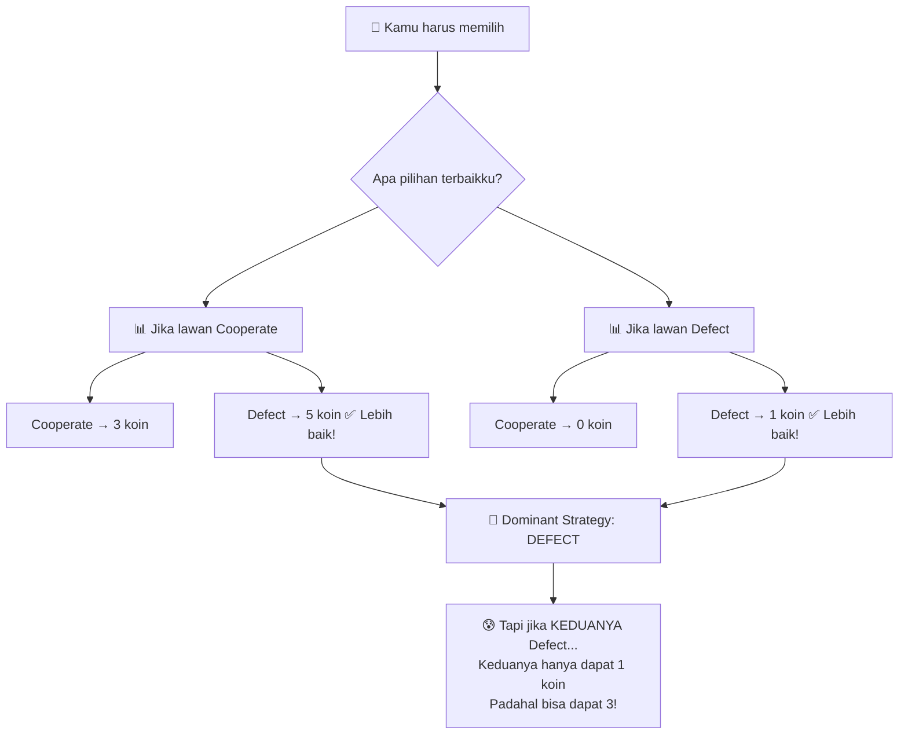
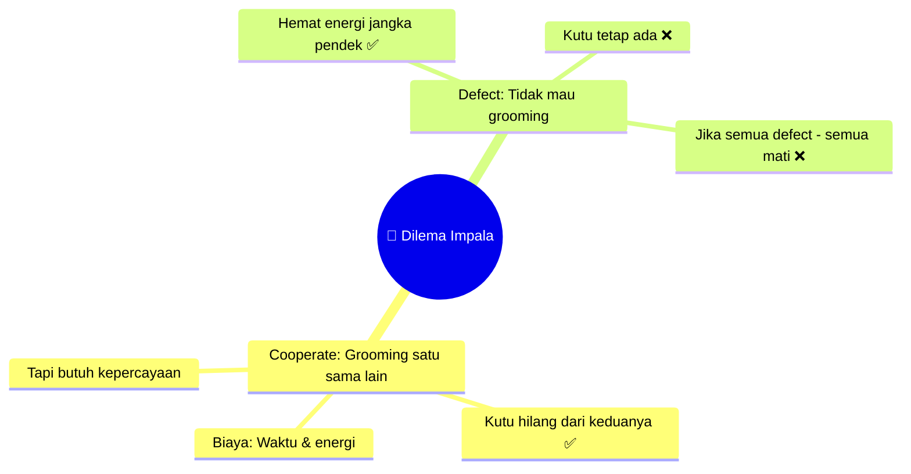
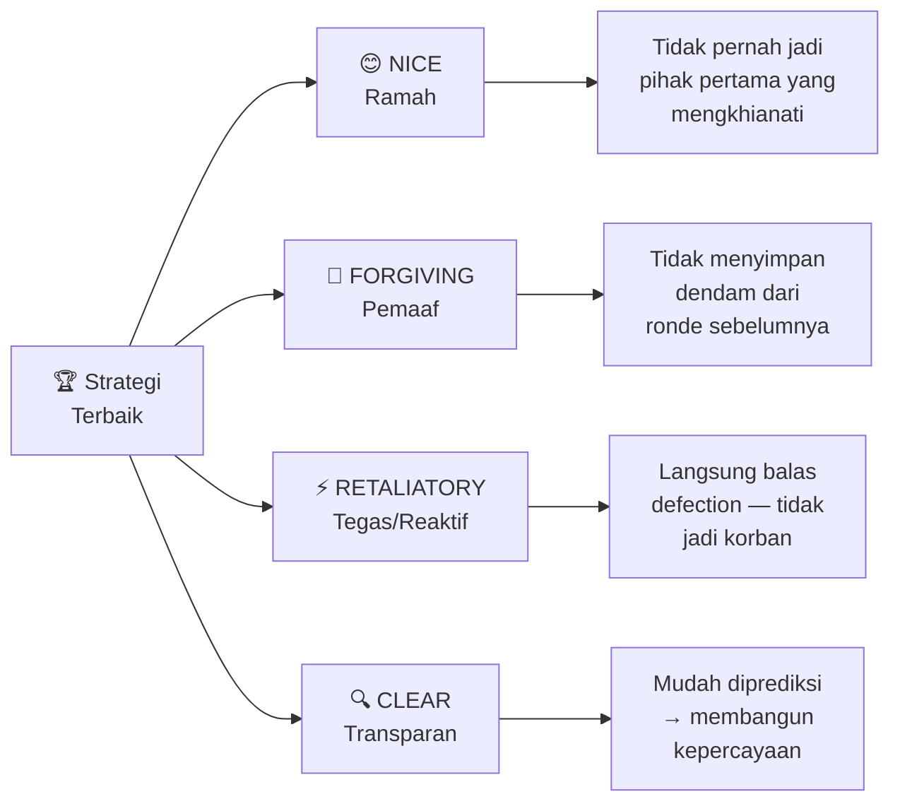
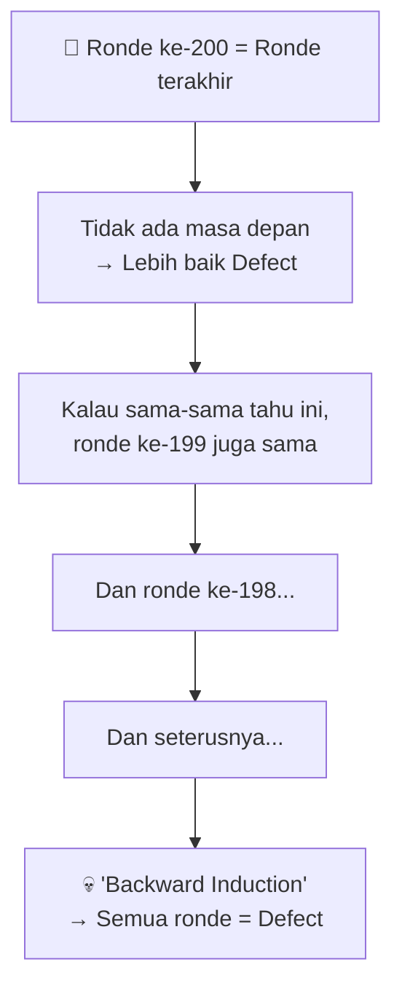
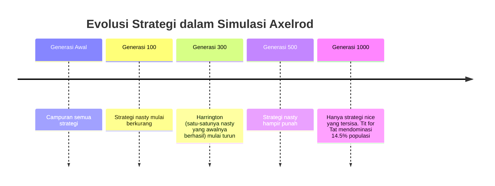
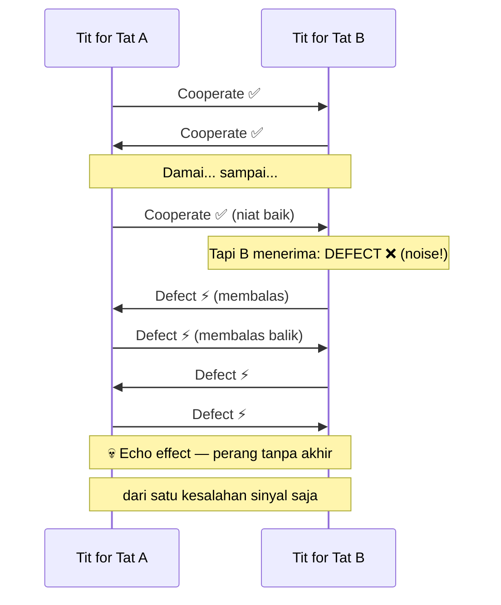
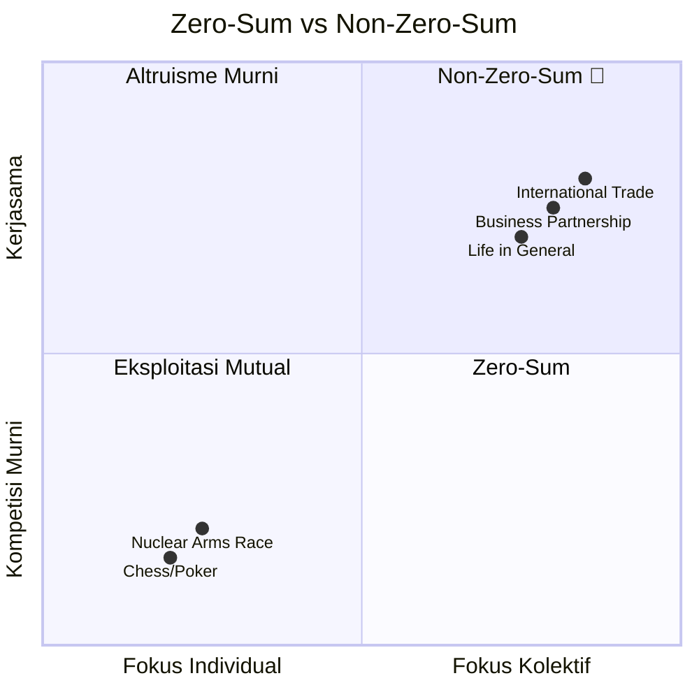
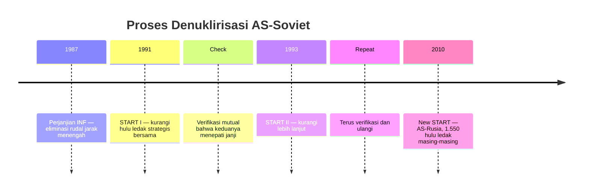

## ☢️ 3 September 1949 — Dunia Berubah Selamanya

Sebuah pesawat pengintai cuaca Amerika terbang di atas Jepang. Rutin. Biasa saja.

Sampai mereka menganalisis sampel udara yang dikumpulkan hari itu.

Di dalam sampel tersebut, ditemukan **jejak material radioaktif**. Angkatan Laut AS segera mengumpulkan sampel air hujan dari kapal-kapal dan pangkalan di seluruh dunia. Hasilnya mengkonfirmasi: ada **Cerium-141** dan **Yttrium-91** — dua isotop dengan waktu paruh (*half-life*) satu hingga dua bulan. Artinya, mereka baru saja diproduksi. Dan satu-satunya cara memproduksinya adalah melalui **ledakan nuklir**.

Tapi AS tidak melakukan uji coba nuklir tahun itu.

Kesimpulan yang tak terhindarkan: **Uni Soviet telah berhasil membuat bom atom.**

Ini adalah kabar yang paling ditakuti Amerika. Supremasi militer yang mereka bangun melalui *Manhattan Project* kini mulai memudar. Beberapa pejabat bahkan mengusulkan serangan nuklir preemptif (*mendahului*) terhadap Soviet sebelum terlambat.

John von Neumann, salah satu pendiri Game Theory, berkata dengan dingin:

> *"Jika kamu bertanya mengapa tidak bom mereka besok, aku bertanya: mengapa tidak hari ini? Jika kamu bilang hari ini jam lima sore, aku bilang: mengapa tidak jam satu siang?"*

Dunia berdiri di tepi jurang pemusnahan diri sendiri. Dan di sinilah, pada tahun 1950, sebuah lembaga riset bernama **RAND Corporation** mencoba mencari jawaban menggunakan alat yang tidak terduga: **Game Theory** (Teori Permainan).

---

## 🎲 Satu Game, Jutaan Implikasi

Pada tahun yang sama, dua matematikawan di RAND menemukan sebuah *game* (permainan) baru yang — tanpa mereka sadari saat itu — **sangat mirip dengan konflik AS-Soviet**. Game ini kita kenal sekarang sebagai:

<Callout type="info" title="🔒 Prisoner's Dilemma (Dilema Narapidana)">
Salah satu konsep paling terkenal dan paling banyak dikaji dalam sejarah Game Theory. Ribuan makalah ilmiah telah diterbitkan tentang berbagai versi game ini — karena ia muncul di mana-mana dalam kehidupan.
</Callout>

### Cara Main

Seorang bankir punya peti penuh koin emas. Ia mengundangmu dan satu pemain lain untuk bermain. Kalian masing-masing punya dua pilihan: **Cooperate** (bekerja sama) atau **Defect** (mengkhianati).

| Kamu | Lawan | Hasil Kamu | Hasil Lawan |
|------|-------|------------|-------------|
| Cooperate | Cooperate | 🟡 3 koin | 🟡 3 koin |
| Cooperate | Defect | ❌ 0 koin | 🏆 5 koin |
| Defect | Cooperate | 🏆 5 koin | ❌ 0 koin |
| Defect | Defect | 😐 1 koin | 😐 1 koin |

### Logika yang Menjebak

Mari kita pikirkan secara rasional:

- **Jika lawanmu Cooperate** → kamu bisa Cooperate (dapat 3) atau Defect (dapat 5). Defect lebih baik.
- **Jika lawanmu Defect** → kamu bisa Cooperate (dapat 0) atau Defect (dapat 1). Defect lebih baik.

**Kesimpulan: apapun yang dilakukan lawanmu, Defect selalu lebih baik untukmu.**

Dan jika lawanmu berpikir rasional juga, mereka akan sampai pada kesimpulan yang sama.

**Hasil: kalian berdua Defect, masing-masing dapat 1 koin — padahal kalian bisa dapat 3 koin jika sama-sama Cooperate.**

---

## 🌍 Dari Game ke Realita: Perlombaan Senjata Nuklir

Inilah yang terjadi antara AS dan Soviet. Keduanya terjebak dalam Prisoner's Dilemma raksasa:

- **Cooperate** = sepakat tidak mengembangkan senjata nuklir lebih jauh
- **Defect** = terus kembangkan nuklir diam-diam

Secara logika, masing-masing negara selalu punya insentif untuk terus mengembangkan nuklir — "kalau kami berhenti tapi mereka tidak, kami kalah". Akibatnya:

> **Keduanya menghabiskan sekitar $10 triliun** mengembangkan puluhan ribu senjata nuklir — lebih dari cukup untuk menghancurkan satu sama lain berkali-kali. Namun karena keduanya punya nuklir, tidak ada yang bisa menggunakannya. Keduanya jauh lebih buruk dari jika mereka berkooperasi sejak awal.

---

## 🦌 Dilema Narapidana di Alam: Impala dan Kutu

Sebelum kita ke solusinya, mari lihat betapa universal-nya masalah ini.

Di padang savana Afrika, rusa **impala** rentan terhadap **kutu** (*tick*) yang bisa menyebabkan penyakit menular, kelumpuhan, bahkan kematian. Mereka membersihkan kutu dengan cara saling merawat satu sama lain (*mutual grooming* — saling membersihkan bulu/kulit).

Masalahnya: merawat impala lain membutuhkan **air liur, elektrolit, waktu, dan perhatian** — semua sumber daya berharga di bawah teriknya matahari Afrika dengan predator yang bisa menyerang kapan saja.

Jadi setiap impala menghadapi dilema: **grooming yang lain, atau tidak?**

Jika interaksi hanya sekali: rasional untuk tidak grooming. Tapi impala bertemu satu sama lain **hari demi hari**. Situasinya berulang. Dan di sinilah segalanya berubah.

---

## 🏆 Turnamen Komputer Axelrod 1980: Mencari Strategi Terbaik

Pada **1980**, ilmuwan politik **Robert Axelrod** ingin menjawab pertanyaan definitif:

> *"Dalam Prisoner's Dilemma yang dimainkan berulang kali — seperti kehidupan nyata — strategi apa yang paling efektif?"*

Ia mengadakan **turnamen komputer** yang kini menjadi legenda dalam sejarah ilmu pengetahuan.

### 📋 Aturan Turnamen Pertama

- Setiap program (*strategy*) bertanding melawan semua program lain
- Setiap program juga bertanding melawan **salinan dirinya sendiri**
- Setiap pertandingan berlangsung **200 ronde**
- Sistem poin sama dengan Prisoner's Dilemma standar
- Turnamen diulangi **5 kali** untuk memastikan hasilnya bukan kebetulan

Total **14 program** dikirim dari pakar berbagai disiplin ilmu, ditambah satu program *random* (50/50) yang ditambahkan Axelrod sendiri.

### 🎭 Karakter-Karakter yang Bertanding

**Friedman** — Mulai dengan Cooperate, tapi jika lawan defect sekali saja → **defect selamanya** tanpa pengampunan. *Maximally unforgiving* (tanpa ampun sama sekali).

**Joss** — Mulai dengan Cooperate, lalu meniru gerakan terakhir lawan seperti Tit for Tat — tapi sesekali (sekitar 10% waktu) diam-diam **Defect tanpa provokasi**.

**Graaskamp** — Bekerja mirip Joss, tapi alih-alih acak, ia Defect tepat di ronde ke-50 untuk **menyelidiki strategi lawan** dan mencari kelemahan yang bisa dieksploitasi.

**Name Withheld** — Program paling rumit dengan **77 baris kode**.

Dan lainnya, mulai dari yang Axelrod gambarkan sebagai *"simple and nice"* (sederhana dan ramah) hingga *"cunning and nasty"* (licik dan kejam).

### 🥇 Pemenangnya Mengejutkan Semua Orang

Setelah semua pertandingan selesai dan poin dihitung, pemenangnya adalah...

<Callout type="success" title="🏆 Tit for Tat — Program Paling Sederhana">
Dikirim oleh psikolog dan peneliti perdamaian **Anatol Rapoport**. Hanya butuh **4 baris kode**. Dan ia menang 5 kali berturut-turut.
</Callout>

---

## 🔄 Tit for Tat: Empat Sifat Pembawa Kemenangan

Axelrod menganalisis mengapa Tit for Tat menang dan menemukan bahwa **semua strategi terbaik** di turnamen memiliki empat kualitas serupa:

### 😊 Sifat 1: NICE (Ramah)

*Nice* dalam konteks ini bukan berarti naif atau lemah. Ini berarti: **tidak pernah menjadi pihak pertama yang mengkhianati**.

Dari 15 strategi di turnamen pertama: **8 strategi nice, 7 strategi nasty**. Hasil? **8 besar semuanya nice**. Bahkan strategi nice yang terburuk pun jauh mengalahkan strategi nasty terbaik.

<Callout type="tip" title="💡 Insight Penting">
Memulai dengan keramahan bukan kelemahan — itu adalah **keunggulan kompetitif** yang telah terbukti secara matematis.
</Callout>

### 💚 Sifat 2: FORGIVING (Pemaaf)

Strategi yang bisa *membalas* (retaliatory) tapi tidak *menyimpan dendam* (grudge). Tit for Tat hanya melihat gerakan **terakhir** lawan — bukan akumulasi sejarah.

Bandingkan dengan Friedman yang *maximally unforgiving*: satu defection → defect selamanya. Terasa memuaskan secara emosional? Mungkin. Efektif jangka panjang? Tidak.

> **Dendam yang berkelanjutan = perang tanpa akhir yang merugikan semua pihak.**

### ⚡ Sifat 3: RETALIATORY (Tegas/Reaktif)

Ini adalah lawannya dari "menjadi pushover" (*keset* — orang yang selalu diinjak). Jika lawan defect → **balas segera**. Tidak langsung, tidak setengah-setengah.

*Always Cooperate* (selalu kooperatif tanpa syarat) adalah strategi yang paling mudah dieksploitasi dan memiliki performa terburuk. Kebaikan tanpa batas justru **mengundang eksploitasi**.

### 🔍 Sifat 4: CLEAR (Transparan)

Program yang terlalu rumit dan opaque (*tidak transparan*) — mirip program random — sulit dibaca oleh lawan. Akibatnya, lawan tidak tahu apa yang diharapkan dan default ke asumsi terburuk: *"Lebih baik defect karena aku tidak tahu apa yang akan dia lakukan."*

Ketika strategimu **mudah diprediksi dan konsisten**, lawan bisa membangun pola kepercayaan (*trust*) denganmu.

---

## 🔁 Turnamen Kedua: Lebih Kompleks, Hasil Sama

Axelrod kemudian mengumumkan turnamen kedua dengan satu perubahan krusial: **tidak ada jumlah ronde yang pasti per game**.

Mengapa ini penting? Dalam turnamen pertama dengan 200 ronde yang pasti, ada masalah logika:

Ini disebut **Backward Induction** (Induksi Mundur): jika kamu tahu kapan interaksi berakhir, rasionalitas mendorongmu untuk defect di akhir, yang kemudian menarik mundur logika yang sama ke semua ronde sebelumnya.

Dalam kehidupan nyata, kita **tidak tahu kapan hubungan berakhir** — dan itulah yang membuat kerjasama tetap mungkin.

**62 program** bersaing di turnamen kedua. Para peserta sudah tahu hasil turnamen pertama dan bisa menggunakannya. Dua kubu terbentuk:

- **Kubu Pertama**: "Jelas bahwa nice dan forgiving itu menang — kami submit strategi yang lebih nice dan forgiving." Salah satunya submit *Tit for Two Tats* (baru balas setelah lawan defect **dua kali berturut-turut**).
- **Kubu Kedua**: "Kalau semua orang nice, kami bisa exploit mereka dengan strategi nasty!" Salah satunya: **Tester** — defect di ronde pertama untuk "tes" lawan. Jika lawan tidak balas, terus eksploitasi. Jika lawan balas, minta maaf dan main normal.

Hasilnya? **Tit for Tat menang lagi.** Di 15 besar: hanya satu yang nasty. Di 15 terbawah: hanya satu yang nice.

---

## 🧬 Simulasi Evolusi: Kerjasama Muncul dari Keserakahan

Axelrod kemudian melangkah lebih jauh. Ia membuat **simulasi ekologi** di mana strategi yang sukses "bereproduksi" (jumlahnya bertambah) dan strategi yang gagal "punah" (jumlahnya berkurang) — persis seperti seleksi alam.

**Harrington** — satu-satunya strategi nasty yang masuk 15 besar — awalnya tumbuh cepat karena bisa mengeksploitasi strategi-strategi lemah. Tapi begitu mangsanya punah... Harrington pun ikut jatuh. **Predator tidak bisa hidup tanpa mangsa.**

### 🌱 "Pulau Kerjasama" yang Mengubah Dunia

Salah satu temuan paling menakjubkan dari simulasi ini:

> Bayangkan dunia yang dipenuhi strategi *Always Defect* yang kejam. Kemudian muncul **sekelompok kecil** Tit for Tat di satu sudut — mereka berinteraksi satu sama lain lebih sering karena kedekatan geografis.
>
> Mereka mulai mengumpulkan poin lebih banyak. Jumlah mereka bertambah. Perlahan, mereka menyebar. Dan akhirnya... **mereka mengambil alih seluruh populasi.**

<Callout type="important" title="🌟 Implikasi Luar Biasa">
Kerjasama tidak membutuhkan altruisme (*kebaikan tanpa pamrih*) murni. Organisme bisa bertindak demi kepentingan diri sendiri — dan **kerjasama tetap bisa muncul dan menyebar**.

Ini mungkin menjelaskan bagaimana kita beralih dari dunia organisme yang sepenuhnya egois menjadi dunia penuh kerjasama seperti yang kita lihat hari ini — dari impala yang saling grooming hingga ikan yang membersihkan hiu.
</Callout>

---

## 📡 Masalah Noise (Kebisingan): Ketika Sinyal Salah Dibaca

Turnamen Axelrod beroperasi di lingkungan yang sempurna: setiap gerakan selalu ditransmisikan dengan benar. Tapi dunia nyata penuh dengan **noise** (gangguan/kesalahan komunikasi).

Pada **1983**, sistem peringatan dini berbasis satelit Soviet mendeteksi peluncuran rudal balistik antarbenua dari AS. **AS tidak meluncurkan apapun.** Sistem Soviet salah mengidentifikasi sinar matahari yang memantul dari awan ketinggian tinggi sebagai rudal.

Beruntung, Kolonel **Stanislav Petrov** — perwira Soviet yang bertugas — memutuskan untuk mengabaikan alarm itu berdasarkan intuisi. Dunia selamat karena satu orang memilih untuk tidak bereaksi.

### Bagaimana Noise Menghancurkan Tit for Tat

Dalam lingkungan dengan noise, Tit for Tat yang sempurna bisa terjebak dalam spiral retaliasi yang tidak pernah berakhir — keduanya kehilangan 2/3 dari poin yang seharusnya mereka dapatkan.

### 💊 Solusinya: Generous Tit for Tat

Tambahkan **10% lebih banyak pengampunan**: alih-alih membalas setiap defection, hanya balas **sekitar 9 dari 10 kali**. Kadang-kadang, maafkan satu defection — karena mungkin itu hanya noise, bukan niat jahat.

Ini memungkinkan "pemutusan echo" (*breaking the cycle*) sambil tetap cukup tegas untuk tidak dieksploitasi.

---

## ♟️ Zero-Sum vs Non-Zero-Sum: Kesalahpahaman Terbesar

Tit for Tat memiliki paradoks yang indah:

> **Ia tidak pernah menang dalam satu pertandingan pun secara individual** — dalam duel satu-lawan-satu, ia hanya bisa seri atau kalah. Namun di keseluruhan turnamen, ia selalu menang.

Sebaliknya, *Always Defect* tidak pernah kalah satu pertandingan — ia hanya bisa seri atau menang. Namun di keseluruhan turnamen, ia performanya sangat buruk.

Ini menyingkap **kesalahpahaman fundamental** tentang "menang":

Dalam **zero-sum games** (*permainan dengan jumlah nol*) seperti catur atau poker, keuntungan satu orang = kerugian orang lain. Di sini, strategi agresif mungkin masuk akal.

Tapi **sebagian besar kehidupan tidak zero-sum**. Dalam kehidupan, "banker" (bandar) adalah **dunia itu sendiri** — semesta peluang, sumber daya, nilai yang bisa diciptakan bersama. Kamu tidak perlu mengambil dari orang lain untuk menang. Kamu hanya perlu **menemukan situasi win-win dan bekerja sama untuk mewujudkannya**.

---

## 🕊️ Bagaimana AS dan Soviet Akhirnya Belajar

Dari 1950 hingga 1986 — hampir 40 tahun — AS dan Soviet terus membangun arsenal nuklir mereka dalam spiral tanpa akhir.

Lalu, mulai akhir 1980-an, mereka mulai **mengurangi** stockpile (persediaan) nuklir mereka.

Bagaimana caranya? Bukan dengan satu perjanjian besar (yang akan menjadi satu Prisoner's Dilemma berskala global — terlalu berisiko). Tapi dengan cara yang persis mencerminkan prinsip Tit for Tat:

**Sedikit demi sedikit. Verifikasi setiap langkah. Ulangi.**

Itulah Tit for Tat dalam diplomasi internasional sesungguhnya — bukan kepercayaan buta, bukan juga ketidakpercayaan total. Tapi **kerjasama bertahap yang terverifikasi**.

---

## 🌱 Pelajaran Akhir: Pemain Membentuk Lingkungan

Ada satu kutipan yang paling membekas dari semua ini:

> *"In the short term, it is often the environment that shapes the player. But in the long run, it is the players that shape the environment."*
>
> *"Dalam jangka pendek, seringkali lingkungan yang membentuk pemain. Tapi dalam jangka panjang, para pemainlah yang membentuk lingkungan."*

Ini adalah penghiburan sekaligus tanggung jawab yang besar.

**Penghiburan:** Jika kamu hidup di lingkungan yang penuh dengan orang-orang yang saling mengkhianati, jangan putus asa. Sekelompok kecil yang berpegang pada strategi kooperatif bisa, perlahan, mengubah ekosistem di sekitar mereka.

**Tanggung Jawab:** Setiap keputusan yang kamu buat — dalam hubungan, bisnis, komunitas — tidak hanya memengaruhi dirimu dan orang-orang di sekitarmu hari ini. Ia membentuk **ekspektasi, norma, dan budaya** yang akan memengaruhi semua interaksi masa depan.

<Callout type="important" title="🎯 Ringkasan Strategi Terbaik">

Berdasarkan lebih dari 40 tahun penelitian sejak turnamen Axelrod, prinsip-prinsip inti ini tetap berlaku:

1. **😊 Be Nice** — Jangan mulai konflik duluan
2. **⚡ Be Retaliatory** — Jangan biarkan dirimu dieksploitasi
3. **💚 Be Forgiving** — Jangan simpan dendam yang tidak produktif
4. **🔍 Be Clear** — Jadilah konsisten dan mudah diprediksi
5. **🎁 Be Generous** — Dalam lingkungan yang tidak sempurna, sesekali maafkan untuk memutus siklus konflik

</Callout>

---

## 🎭 Penutup: Mainkan Game of Life dengan Bijak

Game Theory mengajarkan bahwa kita hidup bukan dalam satu permainan yang dimainkan sekali, melainkan dalam **ribuan permainan yang berulang** — dengan anggota keluarga, rekan kerja, tetangga, komunitas, bangsa.

Dan karena interaksi-interaksi ini berulang, karena kita **mungkin akan bertemu lagi** — seperti yang dikatakan Axelrod — kerjasama bisa muncul bahkan di antara para egois, bahkan di antara para rival.

Kita tidak bisa mengontrol apakah orang lain akan kooperatif atau mengkhianati kita. Tapi kita bisa mengontrol strategi kita sendiri.

Strategi terbaik yang ditemukan sains bukan yang paling licik, bukan yang paling agresif, bukan yang paling naif. Tapi yang paling **manusiawi dalam arti terdalam**: mulai dengan kebaikan, tegaklah saat disakiti, maafkan saat ada itikad baik, dan jadilah konsisten.

Dan setiap keputusan kita — betapapun kecilnya — bisa menjadi benih dari "pulau kerjasama" kecil yang perlahan-lahan mengubah dunia di sekitar kita.

**Jadi, mainkan game ini dengan bijak. Karena dampaknya mungkin jauh lebih besar dari yang kamu bayangkan.** 🌍

---

<Callout type="note" title="📚 Sumber & Referensi">
Artikel ini terinspirasi dari video **Veritasium** oleh Derek Muller: [This game theory problem will change the way you see the world](https://www.youtube.com/watch?v=mScpHTIi-kM)

Untuk eksplorasi lebih lanjut:
- 📖 *The Evolution of Cooperation* — Robert Axelrod (1984)
- 🎓 Percakapan Axelrod × Steven Strogatz (Cornell) dalam video ini
- ☢️ Stanislav Petrov — perwira yang menyelamatkan dunia pada 1983
- 🦌 Penelitian tentang kerjasama mutual pada impala Afrika
</Callout>
