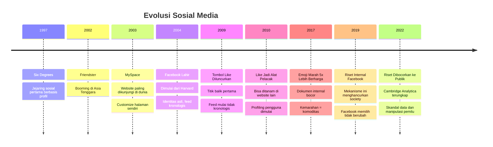
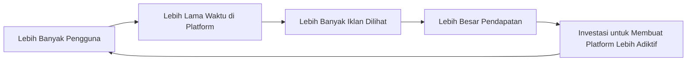
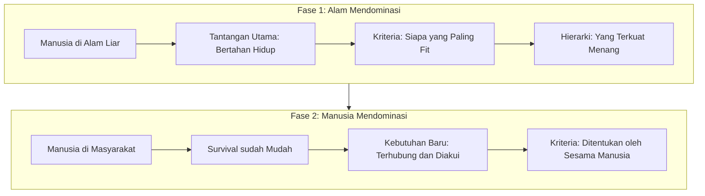
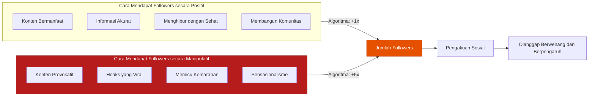
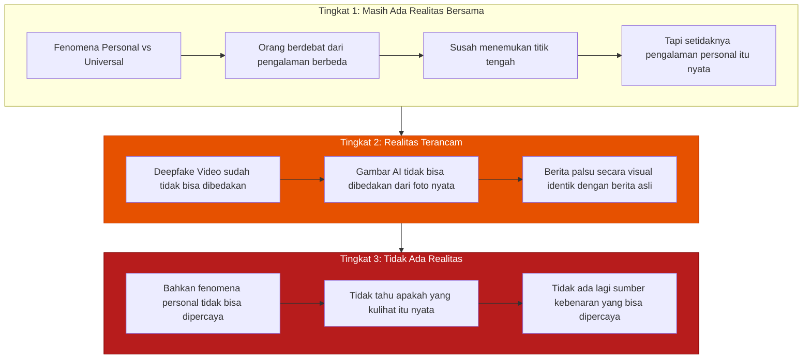
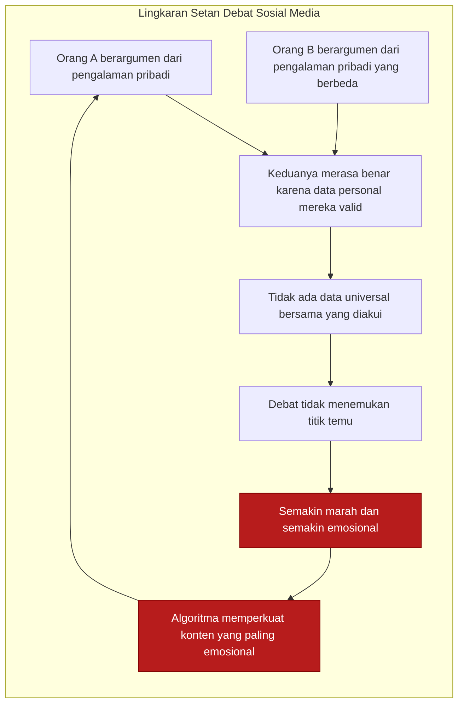
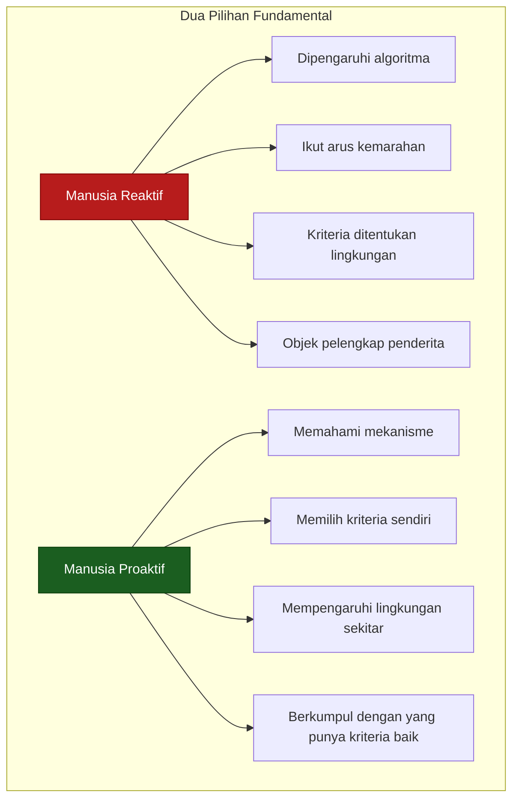

## Pembuka: Berhala Zaman Modern 🪆

*"Zaman sekarang menyembah berhala itu dianggap kuno. Tapi lupa kita menyembah para idola. Bahasa Inggrisnya berhala itu idol."*

Kita menganggap *divide et impera* — strategi pecah belah dan adu domba — adalah taktik kolonialisme masa lalu. Kita sudah merdeka, 1945. Sudah bebas.

Tapi pernahkah kamu berhenti dan benar-benar mempertanyakan: **apakah kita benar-benar merdeka?**

Tidak semua kontrol membutuhkan senjata. Tidak semua penjajahan harus kelihatan. Yang penting hanya satu: **kamu bisa berlaku seperti yang penjajah inginkan** — tanpa perlu dipaksa, tanpa perlu sadar, bahkan sambil merasa bebas.

*Jangan-jangan kita belum merdeka. Hanya cara kontrolnya saja yang berbeda.* 🤔

Inilah pertanyaan besar yang dibuka di **Ground Zero Episode 5** — sebuah diskusi mendalam tentang sosial media, tatanan masyarakat, dan pertahanan negara yang relevansinya semakin terasa setiap hari.

---

## Bagian I: Nabi-Nabi yang Menyesali Ciptaannya 🧑‍💻😔

### Justin Rosenstein dan Tombol Like

Ada sebuah nama yang jarang disebut tapi jejaknya ada di mana-mana: **Justin Rosenstein**. Dia adalah salah satu *engineer* (insinyur perangkat lunak) di Facebook yang menciptakan **tombol Like** (*suka*) — fitur yang sekarang dipakai di hampir semua platform digital di dunia.

Dan sekarang? Rosenstein menyebut ciptaannya sendiri sebagai **"kilatan kesenangan palsu"** (*bright bing of pseudo-pleasure*).

Lebih jauh dari itu:
- Dia memasang *parental control* (kontrol orang tua) di HP-nya sendiri agar anaknya tidak bisa sembarangan mengunduh aplikasi
- Dia memblokir Snapchat dari hidupnya — menyebutnya sama dengan **heroin**
- Dia bahkan tidak mengelola akun Facebook-nya sendiri, diserahkan ke orang lain, karena katanya: *"susah menghentikan diri dari ngecek-ngecek, ngintip-ngintip"*

Yang menciptakan kecanduan pun tidak bisa menghindari kecanduan itu sendiri. **Kalau yang membuatnya saja seperti itu, kira-kira ada apa?** 💊

### Steve Jobs dan iPad-nya

Tokoh berikutnya: **Steve Jobs**. Sang legenda Silicon Valley yang menciptakan iPad. Aturan makan malamnya? **Tanpa gadget**. Anak-anaknya? Dilarang pakai iPad yang ayah mereka sendiri ciptakan.

Bahkan sekolah paling *leading* di Silicon Valley — tempat anak-anak karyawan Apple, Google, dan eBay bersekolah — **melarang gadget untuk anak di bawah 11 tahun**. Mereka justru diajarkan memasak, berkebun, *go-kart*, kerajinan tangan. Aktivitas yang "analog" dan nyata.

*Mengapa para arsitek dunia digital justru melindungi anak-anak mereka dari dunia digital yang mereka bangun?* 🤨

### Chamath Palihapitiya — Mantan VP Facebook yang Menyesal

Yang paling mengejutkan: **Chamath Palihapitiya**, mantan *Vice President* (Wakil Presiden) Facebook yang tugasnya adalah **menumbuhkan jumlah pengguna**. Dalam sebuah ceramah di Stanford, dia mengaku secara terbuka:

> *"Feedback loop dopamin jangka pendek yang kami ciptakan sedang menghancurkan cara kerja masyarakat."*

Bukan saya yang bilang itu. Bukan peneliti independen. Tapi **orang yang membangun sistemnya sendiri**. Dan secara spesifik, dia melarang anak-anaknya menggunakan sosial media.

Fakta pendukung: anak-anak yang menggunakan sosial media **minimal 3 jam sehari** memiliki tendensi depresi hingga bunuh diri **27% lebih tinggi** dibandingkan yang tidak.

> *"Pembuat heroin mungkin tidak akan makan heroinnya sendiri. Tapi dijual untuk orang lain memakai obatnya. Saya takut kita ada di posisi itu — makan sesuatu tanpa tahu bahwa itu racun."* 🧪

---

## Bagian II: Sejarah Sosial Media — Dari Lumpur ke Algoritma Kemarahan 📜

### Sebelum Facebook Ada

Kita perlu melihat sejarahnya dengan jujur — apakah sosial media diciptakan dengan niat jahat dari awal? Atau apakah ada titik belok di tengah jalan yang bahkan pembuatnya tidak antisipasi?

Jawabannya lebih nuansa dari sekadar "ya" atau "tidak".

Facebook bukan percobaan sosial media pertama. Sebelumnya ada **Six Degrees**, **Friendster**, **MySpace**. MySpace sempat menjadi website **paling banyak dikunjungi di dunia** — setiap orang bisa *customize* halamannya sendiri, mengekspresikan identitas.

Tujuannya sederhana: bikin profil, terhubung dengan teman, mengekspresikan diri.

### Titik Kunci: Monetisasi Mengubah Segalanya

Facebook dimulai dari lingkaran kecil — dari kampus Harvard, pakai identitas asli, feed sederhana dan kronologis. Breakthrough awalnya bahkan sesederhana ketika Mark Zuckerberg menambahkan status: *single, in a relationship, atau complicated*. *Growth*-nya (pertumbuhan penggunanya) langsung meledak.

Tapi ketika platform sudah besar, muncul pertanyaan bisnis: **bagaimana memonetisasinya?**

Terinspirasi dari Google — yang bisa berbuat baik tanpa menyusahkan penggunanya melalui **model iklan** — Facebook mengadopsi strategi yang sama. Dan di sinilah **titik kunci yang mengubah segalanya**:

> *Kalau sumber penghasilan adalah iklan, maka semakin banyak orang yang melihat platform, semakin banyak iklan yang bisa ditampilkan, semakin besar pendapatan.*

Artinya: **ada insentif langsung untuk membuat pengguna kecanduan pada platform**. Bukan kebetulan. Bukan efek samping yang tidak diinginkan. Ini adalah **desain bisnis yang disengaja**.

### 2009: Tombol Like dan Berakhirnya Feed Kronologis

**2009**: Tombol Like diluncurkan. Ini bukan sekadar fitur kecil. Ini adalah **titik balik besar**. Mulai saat ini, postingan tidak lagi ditampilkan secara kronologis. Yang muncul di atas bukan yang terbaru — tapi yang menghasilkan **paling banyak interaksi**.

Algoritma mulai di-*tuning* (disetel) untuk memilih konten yang **memaksimalkan views**. Dan manusia — secara psikologis — lebih terdorong untuk merespons konten yang **kontroversial dan memicu kemarahan**.

**2010**: Tombol Like berevolusi menjadi **alat pelacak** (*tracker*). Facebook bisa ditanam di website lain. Artinya Facebook tidak hanya melacak apa yang kamu lakukan di dalam platformnya — tapi juga **seluruh aktivitas browsing-mu di internet**. Inilah fondasi dari profiling pengguna yang sangat detail.

### 2017: Dokumen Internal yang Mengungkap Segalanya

Bocoran dokumen internal Facebook 2017 mengungkap sesuatu yang sangat penting: ketika emoji *reaction* (marah, sedih, heran, dll) diluncurkan, **emoji marah dinilai lima kali lipat lebih berharga dalam algoritma** dibandingkan emoji like biasa.

Ini bukan kebetulan. Ini adalah **keputusan bisnis yang sadar**:

> Konten yang memicu kemarahan menghasilkan lebih banyak interaksi. Lebih banyak interaksi = lebih banyak views = lebih banyak iklan = lebih banyak uang.

Hasilnya? **Kemarahan disebarkan secara algoritmis jauh lebih cepat** daripada konten yang menginspirasi atau mendidik. Platform secara aktif **memperkuat dan menyebarkan kemarahan** karena itu menguntungkan secara bisnis.

*Bukan saya yang bilang ini. Ini riset internal Facebook sendiri*, yang kemudian dibocorkan ke publik pada 2022 oleh mantan karyawan yang keluar dari perusahaan.

Dan pilihan Facebook ketika dihadapkan pada temuan bahwa mekanisme mereka **menghancurkan tatanan masyarakat**? Mereka memilih **tidak mengubah model bisnisnya**. 💸

### Cambridge Analytica: Ketika Data Dipakai untuk Memenangkan Pemilu 🗳️

Puncak dari semua ini: skandal **Cambridge Analytica**. Data Facebook digunakan untuk **memenangkan kandidat politik** — dengan menargetkan pesan yang tepat, kepada orang yang tepat, pada waktu yang tepat.

Dari 20 pemilihan yang diikuti Cambridge Analytica, **19 menang**. Hanya sekali kalah. *Success rate* hampir 100%.

Termasuk di antaranya:
- Pemilihan Presiden Amerika Serikat (Trump 2016)
- Brexit (referendum keluar dari Uni Eropa)
- Dan berbagai pemilihan lain di seluruh dunia

Strategi "Make America Great Again" (*MAGA*) pun disebut didasarkan dari analisis profil pengguna Facebook — mencari *framing* (bingkai pesan) yang paling efektif untuk mendapatkan lebih dari 50% suara.

Inilah gambaran nyatanya: **sosial media mengambil semua data kita, membuat kita marah, mengambil keuntungan dari kemarahan itu, lalu menggunakan data tersebut untuk mengatur arah hidup kita — tanpa kita sadari**.

*Berbahaya. Sangat berbahaya.* ☠️

---

## Bagian III: Psikologi Manusia — Mengapa Kita Begitu Rentan? 🧠

### Aku dan Non-Aku: Lingkungan yang Membentuk Perilaku

Untuk memahami mengapa sosial media begitu efektif memanipulasi kita, kita perlu kembali ke dasar psikologi manusia.

Manusia selalu hidup dalam sebuah **lingkungan**. Garis paling dasar yang bisa ditarik adalah: **aku** dan **non-aku**. Non-aku itu bisa alam, bisa manusia lain, bisa hewan.

Interaksi antara aku dan non-aku inilah yang membentuk perilaku. Dan sepanjang sejarah, ada dua fase besar:

### Kriteria Alam: Survival of the Fittest (Bertahan Hidup yang Terkuat)

Ketika alam yang mendominasi lingkungan manusia, **kriterianya sangat sederhana**: siapa yang bisa bertahan hidup paling lama?

Semua hewan — termasuk manusia purba — berlomba-lomba untuk **beradaptasi dengan alam sekitarnya**. Yang paling cocok dengan alamnya, yang paling mudah mencari makan, yang paling kuat — itulah yang akan bertahan dan menghasilkan banyak keturunan.

Ada contoh menarik dari dunia hewan: *pufferfish* (*ikan buntal*) jantan membuat pola geometri yang indah di dasar laut untuk menarik betina. Penguin mengumpulkan batu-batu terbaik. Burung *bowerbird* membangun sarang paling artistik.

Semua itu pada dasarnya sinyal: **"Aku sudah tidak perlu khawatir soal makan. Aku punya sisa energi untuk membuat hal-hal seperti ini — artinya genku bagus, cocok untuk keturunan kita."**

### Kriteria Sosial: Kebutuhan Terhubung dan Diakui 🤝

Seiring waktu, manusia menjadi makhluk yang semakin sosial. Mereka yang berkelompok bertahan lebih lama dari yang hidup sendiri. Maka muncullah **naluri sosial** yang terprogram dalam DNA kita:

1. **Naluri terhubung** (*connected*): ingin berhubungan dengan manusia lain
2. **Naluri diakui** (*recognized*): ingin mendapat pengakuan dari lingkungannya

Naluri diakui ini bahkan bukan hanya manusiawi — ini bersifat **universal di antara makhluk sosial**. Ada hormon bernama **serotonin** yang mengatur perasaan diakui ini. Dan serotonin ditemukan bahkan pada krustasea (*udang-udangan*) — makhluk yang berpisah dari garis evolusi manusia jutaan tahun lalu.

Artinya: **kebutuhan untuk diakui adalah naluri purba yang tertanam sangat dalam**, jauh lebih dalam dari yang kita sadari.

### Kriteria: Siapa yang Menentukan Apa yang "Dihargai"?

Ini insight yang sangat penting: **perilaku manusia berubah sesuai dengan kriteria di lingkungan tempat dia hidup**.

Contoh sederhana: jika seseorang mengejar pasangan, dan pasangan tersebut menyukai pria berpenampilan rapi, maka orang itu akan menjaga penampilan. Bukan karena dia secara intrinsik menghargai kerapian — tapi karena **itu kriteria yang ditetapkan oleh orang yang ingin dia kesan**.

*Yang menentukan kriteria bukan yang dipilih — tapi yang memilih. Yang dipilih akan mengubah perilakunya agar masuk kriteria.*

Dan ini berlaku di semua level:

| Lingkungan | Kriteria yang Berlaku | Siapa yang Naik Hierarki |
|-----------|----------------------|--------------------------|
| Akademis | Gelar (S1, S2, S3) | Yang paling berpendidikan |
| Spiritual | Kedekatan pada Tuhan | Yang paling saleh |
| Kekayaan | Jumlah harta | Yang paling kaya (apapun caranya) |
| Politik | Jumlah suara | Yang paling populer di massa |
| Sosial Media | Jumlah followers | Yang paling viral |

Yang menarik: **pada kriteria kekayaan**, orang tidak peduli bagaimana seseorang menjadi kaya — dari kerja keras, korupsi, atau bahkan merampok. Yang penting dia kaya, maka dia dihormati. Kita bisa melihat ini terjadi di sekitar kita.

*Ini bukan benar. Tapi ini wajar — karena memang itulah kriteria yang berlaku di lingkungan tersebut.*

---

## Bagian IV: Sosial Media sebagai Mesin Kriteria Baru 📱

### Kriteria Baru: Followers, Like, Subscribe

Sosial media tidak hadir di ruang kosong. Ia hadir di tengah **manusia yang punya naluri mendalam untuk terhubung dan diakui**. Dan sosial media memberikan **kriteria pengakuan baru** yang sangat eksplisit:

- **Followers** (pengikut): seberapa banyak orang mengikutimu
- **Likes** (suka): seberapa banyak orang menyukai kontenmu
- **Subscribers** (pelanggan): seberapa banyak orang berlangganan kepadamu

Apakah kriteria ini sudah masuk ke kepala kita? Coba pikir: jika kamu mendapat DM (*direct message*, pesan langsung) dari dua orang — satu punya 10 followers, satu punya 1 juta followers — **mana yang lebih cepat kamu respons?**

Kalau jawabannya 1 juta followers, itu masuk akal. Tapi **trace balik ke belakang**: kenapa kamu menganggap yang 1 juta lebih pantas direspons duluan?

Kita sudah tidak sadar **menerima sistem kriteria baru** yang mengukur nilai seseorang berdasarkan popularitasnya di sosial media. **Persis seperti kriteria kekayaan** — kita tidak peduli bagaimana seseorang mendapatkan banyak followers. Apakah dari membuat konten bermanfaat, dari fitnah yang viral, atau dari memprovokasi orang lain agar marah dan mengikuti akunnya.

### Meritokrasi vs Popularitas: Mengapa Ini Penting?

**Meritokrasi** (*meritocracy*) adalah sistem di mana yang naik hierarki adalah yang paling **kompeten** — yang paling mampu, paling ahli di bidangnya. Bukan yang paling kaya, bukan yang paling populer.

Mengapa meritokrasi penting? Karena pada hierarki meritokrasi, para pemimpin yang naik adalah yang **benar-benar capable** (*mampu*). Mereka yang membuat keputusan besar punya kemampuan untuk membuat keputusan besar.

Masalahnya: **tidak semua orang punya kemampuan untuk menilai kompetensi orang lain**.

Ini insight yang sering diabaikan. Untuk menilai apakah seseorang dokter yang baik, kamu perlu pengetahuan kedokteran. Untuk menilai apakah seseorang pemain catur yang hebat, kamu perlu tahu catur.

Contoh nyata: jika dua pemain catur ahli bertanding, dan salah satunya melakukan **langkah jenius yang tidak terduga** — seorang ahli catur yang menonton akan terkesima: *"Luar biasa! Strategi yang brilian!"* Sementara orang awam melihatnya: *"Sama-sama mindahin bidak sih, apa bedanya?"*

Karena kamu tidak memahami kompleksitasnya, kamu **tidak bisa menilai** apakah langkah itu jenius atau biasa saja.

*"Hanya wali yang bisa tahu wali"* — ada peribahasa Indonesia yang menangkap kebenaran ini dengan sempurna.

### Bahaya Hierarki Popularitas untuk Demokrasi 🗳️

Di sosial media, **kompetensi disamakan dengan popularitas**. Dan ini menghasilkan masalah serius untuk demokrasi:

Bayangkan kapal yang oleng, nahkodanya tidak ada. Kita perlu memilih nahkoda baru. Di kapal itu ada banyak orang. Yang paling populer — yang paling lucu, yang paling pandai bergaul, yang paling disukai banyak orang — bisa terpilih menjadi nahkoda.

**Tapi apakah dia bisa mengemudikan kapal?**

Salah pilih: semua tenggelam.

Plato sendiri pernah menentang demokrasi dengan logika yang mirip ini. Dan itu bukan berarti demokrasi salah — demokrasi memberi suara kepada semua orang, dan itu hak yang penting. Tapi **tanpa pendidikan politik yang memadai**, pemilih tidak bisa membedakan mana pemimpin yang benar-benar kompeten dan mana yang hanya pandai *marketing* diri.

Solusinya? **Transisi** — dari pemilih karena hak, menjadi **pemilih karena mampu memilih**. Partai politik seharusnya — karena dibiayai negara — memberikan **pendidikan politik** yang meningkatkan kemampuan masyarakat untuk menilai kualitas ide dan pemimpin, bukan hanya menggalang massa secara instan.

---

## Bagian V: Ancaman Nyata — Deepfakes dan Runtuhnya Realitas 🎭

### Tiga Tingkat Bahaya

Kita sudah membahas bahaya yang sudah terjadi. Tapi ada eskalasi (*peningkatan bertahap*) bahaya yang perlu dipetakan:

### Deepfake: Setahun Lagi Kayak Apa?

Beberapa tahun lalu, ada video *deepfake* (*video palsu berbasis AI yang menampilkan seseorang melakukan sesuatu yang tidak pernah dilakukannya*) Will Smith makan pizza yang hasilnya masih terlihat aneh dan tidak realistis. Semua orang bisa langsung tahu itu palsu.

Setahun kemudian? Kualitasnya sudah jauh melampaui itu.

Teknologi *deepfake* berkembang **secara eksponensial** (*berlipat ganda secara sangat cepat*). Apa yang hari ini masih terlihat palsu, dalam 6 bulan hingga 1 tahun ke depan akan **tidak bisa dibedakan dari video asli**.

Implikasinya mengerikan:

- Kamu tidak bisa mempercayai video yang kamu lihat
- Kamu tidak bisa mempercayai foto yang kamu lihat
- Kamu tidak bisa mempercayai berita yang kamu baca

Ini bukan hanya tentang hoaks (*berita palsu*) biasa. Ini tentang **runtuhnya kemampuan manusia untuk memverifikasi realitas**. Dan ketika tidak ada lagi realitas bersama yang bisa dipercaya, **tatanan sosial pun runtuh**.

> *"Saya tidak tahu apa yang akan terjadi. Dan yang pasti, ini tidak bisa diselesaikan hanya dengan undang-undang dan regulasi. Ini masalah manusia. Ini masalah bagaimana strategi sosial untuk menata kita bersama."*

### Hilangnya Kepakaran: Ketika Semua Orang Merasa Ahli 🎓❌

Ada dampak lain yang lebih halus tapi sama bahayanya: **hilangnya kepakaran** (*loss of expertise*).

Survei cita-cita anak muda hampir di seluruh dunia menunjukkan: **cita-cita nomor satu adalah menjadi populer** — menjadi *influencer* (*orang berpengaruh di media sosial*), *content creator* (*pembuat konten*).

Ini bukan hanya tentang pilihan karir. Ini tentang **apa yang dianggap berharga** oleh sebuah generasi. Ketika hierarki yang berlaku adalah popularitas, dan popularitas bisa dicapai tanpa keahlian — maka **keahlian menjadi tidak relevan**.

Bayangkan satu generasi yang hampir semuanya ingin jadi *influencer*. Siapa yang akan menjadi **dokter**? Siapa yang akan menjadi **insinyur**? Siapa yang akan menjadi **ilmuwan**, **ahli hukum**, **guru**?

Ada pengecualian menarik: **China**. Di China, aplikasi mirip TikTok yang populer secara global (*Douyin*, versi internalnya) **diatur algoritmanya oleh negara**. FYP (*For You Page*, halaman rekomendasi konten) dipenuhi konten sains, teknologi, engineering. Yang naik hierarki adalah ilmuwan, astronot, insinyur.

Hasilnya? Cita-cita generasi muda China mayoritas ingin menjadi **scientist** (*ilmuwan*), **astronaut** (*antariksawan*), **engineer** (*insinyur*).

*Generasi mudanya hanya berubah karena algoritma yang berbeda.* Dan itu sudah terbukti terjadi.

---

## Bagian VI: Masalah Opini dan Informasi yang Tidak Grounded 🔍

### Fenomena Personal vs Fenomena Universal

Ada masalah epistemologis (*berkaitan dengan cara kita mendapatkan pengetahuan*) yang sering diabaikan: **perbedaan antara fenomena personal dan fenomena universal**.

Data yang kamu dapatkan dari pengalaman pribadimu adalah valid sebagai **data personal**. Tapi kamu tidak bisa menggunakannya untuk memotret keadaan nasional atau global.

Untuk memahami fenomena universal, kamu butuh data dari **sangat banyak sampel yang beragam** — itulah fungsi survei, riset, dan metodologi ilmiah.

Di sosial media, batas ini menjadi kabur. Orang berdebat menggunakan pengalaman personal mereka seolah-olah itu adalah data universal. Hasilnya?

> *Dua orang yang berdebat bisa dua-duanya benar dari perspektif data personal masing-masing. Tapi tidak ada titik temu karena tidak ada data universal yang sama-sama mereka akui.*

Dan siklus ini terus berputar karena **tidak ada insentif dalam hierarki sosial media untuk berpikir lebih dalam** — yang ada insentifnya adalah untuk **berteriak lebih keras** dan **lebih emosional**, karena itu yang menghasilkan lebih banyak engagement (*keterlibatan*).

### Arus Informasi yang Salah Arah

Masalah besar yang dihasilkan dari semua ini: **arus informasi yang beredar di publik bukan arus informasi yang fundamental**.

Arus informasi yang dominan adalah:
- Yang keluar dari **kemarahan**
- Yang keluar dari orang-orang yang **ingin naik hierarki popularitas**
- Bukan dari orang yang benar-benar **mencari kebenaran**

*Mencari kebenaran itu tidak hanya di sosial media*. Mencari kebenaran membutuhkan riset, mengumpulkan data, memverifikasi sumber, melihat berbagai kemungkinan narasi. Itu membutuhkan **waktu, energi, dan kapasitas** yang tidak dihargai oleh algoritma sosial media.

---

## Bagian VII: Pertahanan — Kita Tidak Berdaya, atau Kita Memilih untuk Tidak Berdaya? 🛡️

### Tidak Bisa Mengandalkan Platform atau Pemerintah

Kita tidak bisa memaksa Facebook, Google, atau TikTok untuk mengubah model bisnisnya. Mengapa? Karena pada 2022 saja, **Google dan Meta menghasilkan total $341 miliar hanya dari iklan**. Itu adalah jumlah uang yang sangat besar — tidak ada insentif finansial untuk berubah.

Demo sebesar apapun tidak akan mengubah itu. Yang suka platform tersebut pun akan *counter-demo* (*demo balik*).

Lalu pemerintah? Kapal besar berbelok lambat. Ada banyak kepentingan di dalam birokrasi yang membuat regulasi bergerak jauh lebih lambat dari teknologi.

**Pertahanannya ada di diri kita sendiri.** Dan untuk bertahan, kita harus paham mekanismenya.

### Kunci: Memilih Kriteria yang Kamu Hidup Di Dalamnya 🔑

Ini adalah insight paling penting dari seluruh diskusi ini: **manusia punya kebebasan untuk memilih kriteria mana yang akan dia ikuti**.

Lingkungan alam itu **absolut** — kalau badai datang, badai datang. Tidak bisa menolak.

Tapi lingkungan sosial yang dibuat manusia? **Manusia punya pilihan**. Yang sering dilupakan karena kebutuhan untuk diakui di sekitarnya begitu kuat sehingga orang otomatis mengikuti kriteria yang ada.

Ada kalimat dari lagu Wali yang disebutkan: *"Wong saleh kumpulono"* — berkumpullah dengan orang-orang saleh. Kenapa? Karena **ketika kamu masuk pada kumpulan orang yang menggunakan kriteria tertentu**, kriteria pengakuan yang berlaku di sekitarmu berubah.

Kalau kamu berkumpul dengan orang-orang yang menggunakan kriteria kepandaian dan manfaat — untuk diakui di sana, kamu harus menjadi lebih pandai dan bermanfaat. Kamu tidak peduli berapa followers-mu.

*Ini sebenarnya adalah kebebasan sejati: kemampuan untuk tidak peduli pada kriteria yang tidak kamu pilih sendiri.*

### Dua Pertanyaan yang Harus Dijawab

Pada akhirnya, ada dua pertanyaan yang harus dijawab masing-masing dari kita — bukan untuk orang lain, tapi untuk diri sendiri:

> **Kamu jenis manusia yang mana? Manusia yang dipengaruhi lingkungan — atau manusia yang mau mempengaruhi lingkungan?**

Tidak perlu besar atau kecil dulu. Putuskan yang mana.

Kalau jawabannya ingin mempengaruhi lingkungan, maka langkah pertama adalah: **pahami mekanismenya**. Karena ketika kamu paham mekanismenya, kamu paham kemungkinan ancaman berikutnya, dan kamu bisa menyiapkan pertahanan.

### Tindakan Konkret yang Bisa Dilakukan Sekarang ✅

Berdasarkan semua yang kita bahas, berikut adalah langkah-langkah konkret:

**1. Diet Informasi** 🥗
Seperti diet makanan, terapkan diet informasi. Kurangi waktu di platform yang algoritma-nya dirancang untuk kecanduan. Tentukan jadwal dan batas waktu yang jelas.

**2. Perhatikan Emosi** 🧘
Ketika kamu merasa sangat marah oleh sebuah konten — itu bisa jadi tanda bahwa kamu sedang **dieksploitasi algoritma**, bukan berarti kontennya benar. Marah = tanda untuk berhenti dan memverifikasi.

**3. Cari Sumber Primer** 📚
Jangan puas dengan ringkasan atau opini orang lain. Biasakan mencari sumber primer — dokumen asli, data original, penelitian langsung. Bedakan antara **opini** dan **fakta berbasis data**.

**4. Pilih Komunitas dengan Kriteria yang Baik** 👥
*"Wong saleh kumpulono"* — bergabunglah dengan komunitas yang menggunakan kriteria yang kamu inginkan. Di komunitas itu, kamu akan secara alami termotivasi untuk mengembangkan nilai-nilai tersebut.

**5. Ajarkan Berpikir Kritis, Bukan Hanya Konten** 🎓
Untuk yang punya anak, murid, atau pengaruh pada generasi muda: ajarkan **cara berpikir**, bukan hanya konten tertentu. Kemampuan untuk membedakan fenomena personal dan universal, untuk memverifikasi sumber, untuk menahan emosi reaktif — itu adalah kemampuan yang paling dibutuhkan generasi berikutnya.

---

## Penutup: Tatanan Masyarakat adalah Pilihan Kolektif 🌐

Semua politisi bergantung pada konstituennya. Semua bisnis bergantung pada konsumennya. **Yang menentukan kriteria adalah yang memilih** — bukan yang dipilih. Yang dipilih akan menyesuaikan diri.

Ini berarti: **kita lebih berdaya dari yang kita kira**.

Ketika kita sebagai masyarakat mengubah kriteria — tidak lagi menghargai popularitas semata, mulai menghargai kedalaman, kejujuran, dan kompetensi — maka para pemimpin, politisi, dan pembuat konten akan **menyesuaikan diri dengan kriteria baru itu**.

Ini bukan perubahan yang terjadi dalam semalam. Dan ini bukan perubahan yang bisa diserahkan pada pemerintah atau platform. Ini adalah perubahan yang dimulai dari **satu individu yang memutuskan untuk tidak dikendalikan**, lalu menyebar ke **komunitas kecil**, lalu ke **masyarakat yang lebih luas**.

Tatanan masyarakat adalah **pilihan kolektif** yang dibentuk dari pilihan-pilihan individual yang kecil, setiap hari.

*Asah taringmu. Asah kukumu. Kamu berdaya. Dan kita perlu melakukan ini bersama-sama.* 🦁

<Callout type="important" title="Pertanyaan untuk Direnungkan">
1. Kriteria apa yang saat ini paling mempengaruhi perilakumu di sosial media?
2. Apakah kamu sadar kapan emosimu sedang dieksploitasi oleh algoritma?
3. Komunitas dengan kriteria seperti apa yang ingin kamu masuki dan bangun?
4. Bagaimana kamu bisa berkontribusi pada pendidikan berpikir kritis di lingkungan sekitarmu?
</Callout>

<Callout type="cite" title="Sumber">
Artikel ini diadaptasi dari transkrip **Ground Zero Episode 5: Sosial Media, Tatanan Masyarakat, dan Pertahanan Negara** — sebuah diskusi mendalam tentang mekanisme sosial media, psikologi manusia, dan pertahanan diri di era digital.

📎 https://www.youtube.com/watch?v=10pG87FFkf8
</Callout>
