## Nostalgia dan Kedalaman yang Tersembunyi 🌸

Bagi banyak dari kita yang tumbuh di era 2000-an, dua seri anime mendefinisikan masa remaja: *Fullmetal Alchemist* dan *Naruto*. Desain karakter ninja yang modern, teknik-teknik pertarungan yang memukau, dan mitologi dunia yang terus berkembang membuatnya tak terlupakan. 

Setiap Kamis sore, kita menunggu episode baru dengan antusiasme yang tak tertahankan. Kita meniru gerakan *Rasengan*, berdebat tentang siapa yang lebih kuat antara Sasuke dan Naruto, dan menghafalkan urutan *hand seals* berbagai jutsu. 🥷

Namun, dalam esai yang tajam dan mendalam berjudul **"Iruka Sensei and the Ethics of the Master"**, [Naoki Yamamoto](https://naokiyamamoto.substack.com/) mengajak kita melihat melampaui tontonan visual yang memukau itu. Dia mengungkap bahwa di balik semua pertarungan supernatural dan kekuatan luar biasa, *Naruto* melestarikan sesuatu yang profoundly klasik dalam tradisi bercerita Asia Timur:

**Hubungan antara Guru (*Shisho/Master*) dan Murid (*Deshi/Disciple*).** 👨‍🏫👦

<Callout type="info" title="🎋 Konsep Transmisi dalam Tradisi Timur">
Hampir setiap karakter utama dalam *Naruto* berdiri dalam sebuah **garis keturunan** (*lineage*). Mereka diajar, dibentuk, dikoreksi, dan terkadang bahkan dilukai oleh seorang guru.

Murid tidak sekadar meniru secara mekanis. Mereka:
- Menerima instruksi dari guru
- Menafsirkan dan menginternalisasi ajaran
- Mentransformasi menjadi teknik mereka sendiri
- Akhirnya meneruskannya ke generasi berikutnya

Pola ini akan terasa familiar bagi siapa saja yang pernah mempelajari seni tradisional Jepang: kenjutsu (pedang), chadō (upacara teh), ikebana (merangkai bunga), atau shodō (kaligrafi).

**Transmisi bukan repetisi mekanis. Ini adalah pembentukan etika.** 🎎
</Callout>

## Episode Pertama: Pemadatan Seluruh Filosofi 📺

Episode pertama *Naruto* memadatkan seluruh struktur filosofis ini dalam satu pertemuan yang menghancurkan sekaligus indah. Dan di sinilah Yamamoto mengajukan pertanyaan yang mengejutkan:

**Siapakah guru sejati pertama Naruto?**

Kebanyakan dari kita akan menjawab:
- **Kakashi Hatake** — sang Copy Ninja yang bisa meniru 1000+ jutsu? ❌
- **Jiraiya** — salah satu Sannin legendaris, penulis novel, ahli Sage Mode? ❌

Ternyata bukan keduanya. Guru sejati pertama Naruto adalah:

**Iruka Umino.** ✅

Secara teknis, Iruka tidak istimewa. Dia bukan anak ajaib. Dia tidak memiliki *Kekkei Genkai* atau jutsu rahasia tingkat S. Dibandingkan dengan mentor-mentor yang datang setelahnya, Iruka tampak sangat *biasa saja*.

**Namun dia adalah guru terpenting yang pernah dimiliki Naruto.** Mengapa?

<Callout type="success" title="💡 Insight Kunci">
Karena Iruka tidak pertama-tama membentuk **teknik** Naruto.

**Dia membentuk hatinya.** ❤️

Dan tanpa hati yang benar, semua kekuatan di dunia hanya akan menjadi kehancuran.
</Callout>

## Konteks: Naruto Si Anak Kesepian 😢

Mari kita pahami konteksnya. Naruto Uzumaki adalah:
- **Yatim piatu** — kedua orang tuanya meninggal saat melindungi desa
- **Dijauhi masyarakat** — penduduk desa memperlakukannya dengan kebencian dan ketakutan
- **Wadah monster** — Kyuubi (Rubah Berekor Sembilan) disegel di dalam tubuhnya

Orang dewasa di sekitarnya melihatnya bukan sebagai anak yang menderita kehilangan, melainkan sebagai **monster itu sendiri**. Mereka memproyeksikan trauma kolektif mereka kepada seorang anak kecil yang tidak bersalah.

Kenakalannya—mencoret-coret wajah Hokage di gunung, mencuri, mencari perhatian—bukan sekadar pemberontakan anak kecil. Itu adalah **strategi bertahan hidup** dari seorang anak yang sangat kesepian. 

Dia berteriak pada dunia: *"Lihat aku! Aku ada di sini! Aku manusia juga!"* 📢

Iruka, sebagai guru di Akademi Ninja, awalnya ketat terhadap Naruto. Dia sering menghukumnya. Tapi ada perbedaan fundamental: **Iruka tidak pernah meninggalkannya.** 🤝

## Momen Kebenaran di Hutan: Pengorbanan dan Pengakuan 🌲

Momen penentu datang ketika Mizuki, ninja penghianat, memanipulasi Naruto untuk mencuri gulungan rahasia. Mizuki ingin memanfaatkan kekuatan Kyuubi untuk tujuan jahatnya sendiri. Dia mengungkapkan kepada Naruto kebenaran yang selama ini disembunyikan: bahwa dia adalah wadah monster yang membunuh banyak orang.

Naruto hancur. 💔

Iruka, menyadari bahaya, mencari Naruto di hutan. Ketika Mizuki hendak membunuh Naruto, Iruka melompat dan **melindungi Naruto dengan tubuhnya sendiri**. Shuriken besar menancap di punggung Iruka.

Pada saat itu, kebenaran yang lebih dalam terungkap:

<Callout type="danger" title="💔 Iruka's Trauma">
**Orang tua Iruka dibunuh oleh Kyuubi, 12 tahun yang lalu.**

Berdasarkan logika trauma, Iruka seharusnya membenci Naruto. Dia memiliki alasan yang "sah" untuk melihat Naruto sebagai sumber penderitaannya.

Namun apa yang terjadi? Iruka tidak menyangkal rasa sakitnya. Dia tidak berpura-pura sebagai orang suci yang tanpa luka. 

Sebaliknya, dia **meminta maaf**. 🙏
</Callout>

Iruka berkata pada Naruto:

> "Aku juga... tumbuh sendirian sepertimu, Naruto. Tidak ada yang mengakui keberadaanku. Aku seharusnya lebih memahami kesepianmu. Maafkan aku."

> "Tapi sekarang aku tahu. Kamu bukan Kyuubi. Kamu adalah Naruto Uzumaki dari Desa Konoha. Dan aku percaya padamu." ✨

**Pada saat itulah Naruto 'terbangun' pada kekuatannya yang sesungguhnya.**

Seri ini tidak dimulai dengan penguasaan teknis (*Rasengan*, *Sage Mode*, *Kurama Mode*). Seri ini dimulai dengan **pengakuan etis** (*ethical recognition*). Seorang manusia melihat manusia lain, bukan sebagai objek ketakutan, tetapi sebagai subjek yang memiliki martabat dan potensi.

## Apa Itu Guru Sejati? Definisi yang Mengejutkan 🎓

Di sini, Yamamoto menawarkan meditasi mendalam tentang apa sebenarnya arti seorang *Master*—seorang guru sejati. Dan definisinya mungkin mengejutkan kita:

### 1. Guru Bukan Makhluk yang Sempurna 🚫👼

**Guru bukanlah orang yang sudah selesai dengan dirinya sendiri.** Dia bukan dewa moral yang berdiri di atas gunung tanpa kesalahan.

Iruka memiliki trauma. Dia memiliki kebencian. Dia mengalami kesulitan untuk melihat Naruto secara objektif di awal. **Dan justru itulah yang membuatnya guru sejati.**

Karena dia tidak menyembunyikan kekurangannya. Dia menghadapinya, mengakuinya, dan memilih untuk tidak dikuasai olehnya.

### 2. Guru Tidak Berdiri Jauh di Atas ⛰️

Guru bukan seseorang yang berdiri infinitely di atas murid, memandang dari menara gading, mengeluarkan perintah tanpa empati.

**Guru berjalan hanya sedikit di depan murid.** 

Dia sudah melewati jalan yang sama. Dia tahu bagaimana rasanya tersandung, bagaimana rasanya bingung, bagaimana rasanya ingin menyerah. Dan dia menunjukkan: *"Lihat, aku pernah di posisimu. Ini yang aku lakukan. Ini yang berhasil. Ini yang gagal. Sekarang, temukan caramu sendiri."*

### 3. Guru Memiliki Keberanian untuk Vulnerable 💪

Ini adalah poin paling penting dan paling radikal:

<Callout type="important" title="🔑 Kerentanan sebagai Kekuatan">
**Seorang guru sejati memiliki keberanian untuk mengekspos dirinya yang belum selesai** (*unfinished self*).

Ketika murid mencari bantuan dalam krisis, orang yang langsung memberikan jawaban siap pakai (*ready-made answers*) atau menjamin keamanan absolut **bukanlah guru**. Itu adalah **kontrol**. Itu adalah dominasi yang menyamar sebagai bimbingan.

Mengajar yang sejati membutuhkan:
- **Restraint** — penahan diri, tidak mengambil alih
- **Trust** — kepercayaan bahwa murid bisa menemukan jalannya
- **Willingness to stand beside** — kesediaan berdiri di samping, bukan di atas

Guru tidak mengabsorpsi perjuangan murid. Dia menemaninya. 🤝
</Callout>

### 4. Tanpa Murid, Tidak Ada Guru 🔄

Dan inilah paradoks yang indah: **Guru tidak eksis secara independen.**

Iruka tidak menjadi guru sejati pada hari dia diangkat sebagai instruktur Akademi Ninja. Dia menjadi guru pada hari dia:
- Mengungkapkan kebenciannya
- Menghadapinya dengan jujur
- **Dan tetap memilih untuk melindungi Naruto**

Dia menjadi *master* ketika dia **membiarkan dirinya diubah oleh murid yang seharusnya dia ajar**.

Murid, dalam perjuangannya menuju kedewasaan, justru **menjadi guru bagi gurunya**. Murid menuntut gurunya untuk tetap berjalan di jalan pembentukan etika. 

```mermaid
graph LR
    A[👨‍🏫 Guru] -->|Mengajar & Membimbing| B[👦 Murid]
    B -->|Menuntut Integritas & Pertumbuhan| A
    
    A -.->|Transmisi Etika| B
    B -.->|Transformasi Guru| A
    
    style A fill:#48dbfb,stroke:#333,stroke-width:2px
    style B fill:#feca57,stroke:#333,stroke-width:2px
```

## Es Krim yang Meleleh: Mengelola Duka dengan Bijak 🍦💔

Nanti dalam cerita, setelah kematian Jiraiya yang tragis, kita melihat kembali pentingnya Iruka.

Naruto duduk sendirian dalam kesedihan yang mendalam. Dia memegang es loli (*popsicle*) yang meleleh—jenis yang sama yang dulu dia bagi dengan Jiraiya-sensei. Es itu meleleh di tangannya, seperti waktu yang tak bisa dikembalikan.

Naruto berada di tepi jurang. Tepi keputusasaan. Tepi balas dendam yang gelap. 😤

Siapa yang datang? **Iruka.**

Dan apa yang dia lakukan? Ini sangat penting:

<Callout type="note" title="🧭 Wisdom dalam Berduka">
**Iruka tidak menceramahi Naruto tentang pengampunan.**

Dia tidak mengeluarkan perintah moral yang abstrak tentang "kebenaran" atau "kebaikan". Dia tidak menekan emosi Naruto dengan mengatakan "jangan sedih" atau "jangan marah".

Sebaliknya, dia **mengingatkan Naruto akan cinta yang pernah dia terima.**

Dia berkata: *"Jiraiya-sensei mencintaimu seperti cucunya sendiri. Dia percaya pada ninja yang akan kamu jadi. Dia tidak akan mau kamu hancur karena ini."*
</Callout>

Iruka tidak **menekan** kemarahan Naruto. Dia **mengorientasikan ulang** kemarahan itu dengan **mengembalikannya pada memori cinta**. 

Ini adalah keterampilan emosional tingkat tinggi yang jarang kita lihat:
- Bukan penekanan emosi (*suppression*)
- Bukan pelampiasan tanpa kontrol (*unrestrained venting*)
- Melainkan **transformasi emosi melalui konteks yang lebih dalam** 🔄

```mermaid
graph TD
    A[💔 Duka dan Kemarahan Naruto] --> B{Pilihan Respons}
    
    B -->|Respons Buruk 1| C[❌ Suppress: Jangan sedih]
    B -->|Respons Buruk 2| D[❌ Unleash: Balas dendam buta]
    B -->|Respons Iruka| E[✅ Reorient: Ingat cinta Jiraiya]
    
    E --> F[💪 Kemarahan menjadi Tekad]
    E --> G[😢 Duka menjadi Penghormatan]
    
    style E fill:#10ac84,stroke:#333,stroke-width:3px
    style F fill:#feca57,stroke:#333,stroke-width:2px
    style G fill:#48dbfb,stroke:#333,stroke-width:2px
```

## Etika Melalui Kehadiran, Bukan Doktrin 📜

Yamamoto menekankan perbedaan penting ini:

**Etika dalam *Naruto* tidak disampaikan sebagai doktrin abstrak.**

Etika ditransmisikan melalui:
- **Kehadiran** (*presence*) — guru yang hadir di saat krisis
- **Memori** (*memory*) — mengingat kembali momen-momen cinta dan kepercayaan
- **Kepercayaan** (*trust*) — keyakinan bahwa murid akan menemukan jalan

Apa yang bisa ditunjukkan seorang guru kepada muridnya bukanlah **kebajikan tanpa cela** (*flawless virtue*).

Melainkan:

<Callout type="success" title="✨ Tiga Kekuatan Guru Sejati">
1. **Kekuatan untuk menghadapi kegelapan diri sendiri** tanpa menyerah padanya 🌑
2. **Kejujuran untuk mengakui kebencian** tanpa membiarkannya mendikte tindakan 😡➡️🤝
3. **Keberanian untuk tetap berada di samping manusia lain** di jam paling rapuh mereka 💔➡️❤️
</Callout>

Dan dalam pertemuan itu, sesuatu yang **resiprokal** terjadi. Murid, dalam perjuangannya menuju kedewasaan, justru **menjadi guru bagi gurunya**. Guru terus berjalan di jalan pembentukan etika karena **murid menuntutnya darinya**.

## Kesimpulan: Transmisi Tanggung Jawab, Bukan Dominasi 🔄

Untuk semua pertarungan epiknya, untuk semua eskalasi mitologis kekuatan (*Susano'o*, *Bijuu Mode*, *Rinnegan*, *Six Paths*), *Naruto* pada akhirnya **bukan cerita tentang kekuatan** (*power*).

Ini adalah cerita tentang **transmisi** (*transmission*). 

Tentang bagaimana kekuatan (*strength*) bergerak dari satu generasi ke generasi berikutnya, **bukan sebagai dominasi, tetapi sebagai tanggung jawab yang dipercayakan** (*entrusted responsibility*).

**Iruka mengajarkan Naruto bukan dengan kesempurnaan, tetapi dengan kerentanan.**

Dia menunjukkan bahwa menjadi guru sejati bukan tentang:
- Tidak memiliki luka ❌
- Tidak memiliki kebencian ❌
- Tidak memiliki keraguan ❌

Melainkan tentang:
- **Menghadapi luka dengan kejujuran** ✅
- **Tidak membiarkan kebencian menguasai** ✅
- **Tetap memilih cinta dan kepercayaan** ✅

Dan pelajaran itu bergema sepanjang hidup Naruto. Ketika dia menjadi Hokage, ketika dia menghadapi musuh-musuhnya, ketika dia mendidik generasi berikutnya—**dia selalu kembali pada pelajaran pertama yang diajarkan Iruka:**

> *"Kamu bukan monster. Kamu adalah manusia yang berharga. Dan aku percaya padamu."* 💛

---

<Callout type="quote" title="🌸 Renungan Penutup">
Dalam dunia yang sering mengagungkan kekuatan, dominasi, dan kesempurnaan, *Naruto*—melalui karakter sederhana bernama Iruka Umino—mengingatkan kita pada kebenaran yang lebih dalam:

**Kekuatan sejati bukan tentang tidak pernah jatuh. Kekuatan sejati adalah tentang bagaimana kita bangkit, bagaimana kita menghadapi luka kita, dan bagaimana kita tetap memilih untuk percaya dan mencintai.**

Dan itulah pelajaran yang paling berharga dari seorang guru. 🍥
</Callout>

---

## Referensi & Bacaan Lanjut 📚

- **Artikel Asli:** [Iruka Sensei and the Ethics of the Master](https://naokiyamamoto.substack.com/p/iruka-sensei-and-the-ethics-of-the) oleh Naoki Yamamoto
- **Manga:** *Naruto* oleh Masashi Kishimoto (1999-2014)
- **Anime:** *Naruto* & *Naruto: Shippuden* oleh Studio Pierrot
- **Konsep Filosofis:** Tradisi *Shu-Ha-Ri* dalam seni bela diri Jepang
- **Psikologi:** Attachment Theory dan pentingnya *secure base* dalam perkembangan

---

<Callout type="tip" title="💬 Untuk Diskusi">
Siapa "Iruka" dalam hidup Anda? Siapa orang yang tidak sempurna, tetapi justru karena kejujurannya tentang ketidaksempurnaannya, menjadi guru terbaik Anda?

Bagikan refleksi Anda tentang hubungan guru-murid yang pernah mengubah hidup Anda. 🌟
</Callout>
