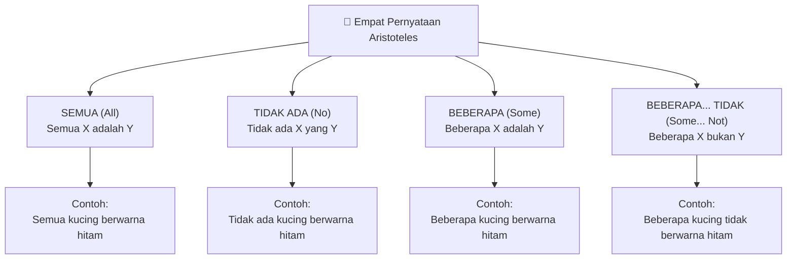
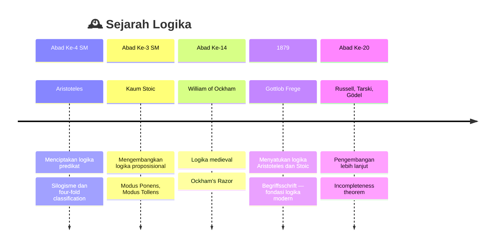
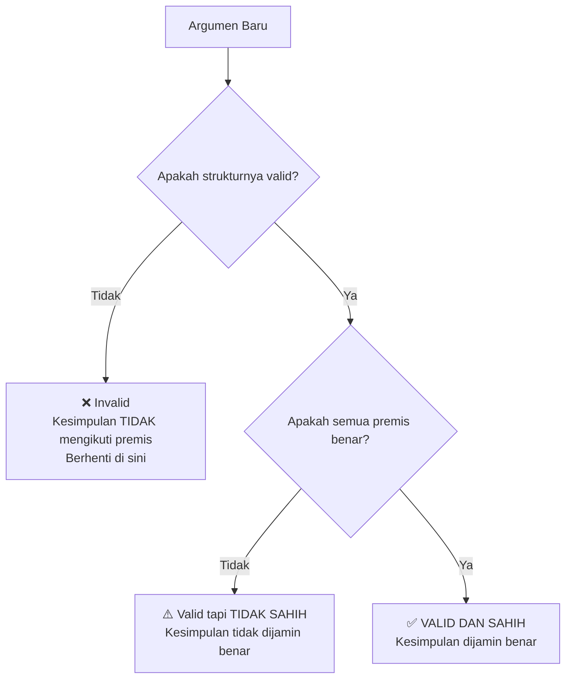
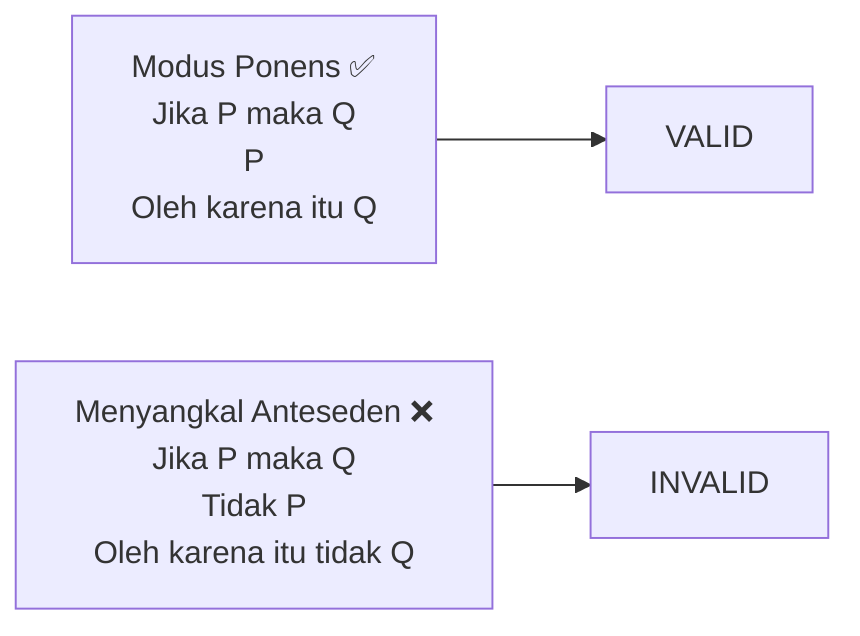
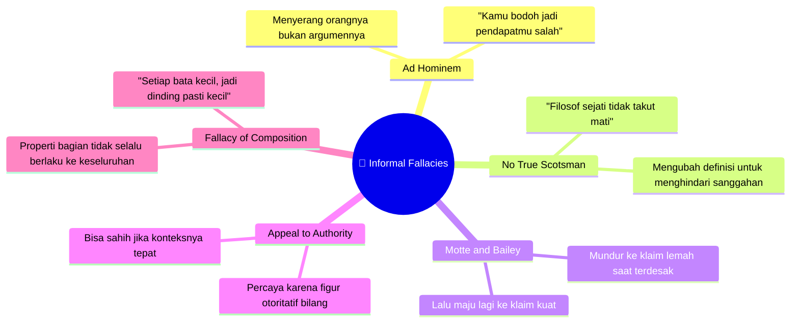
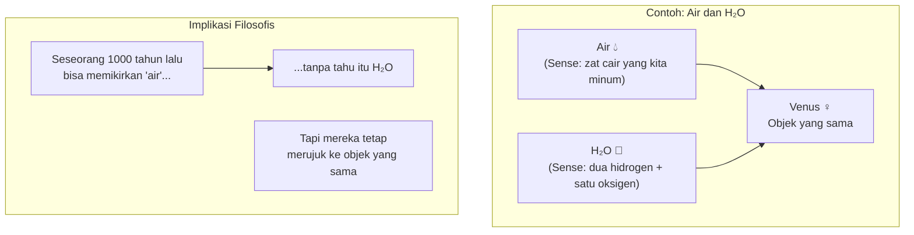
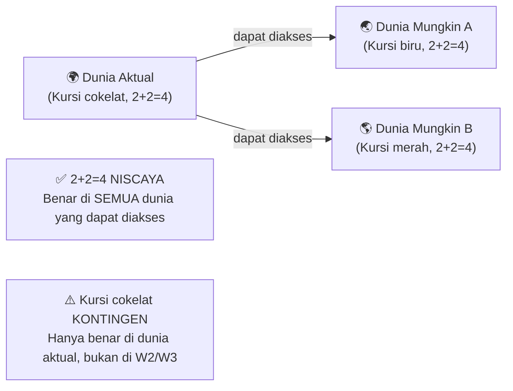
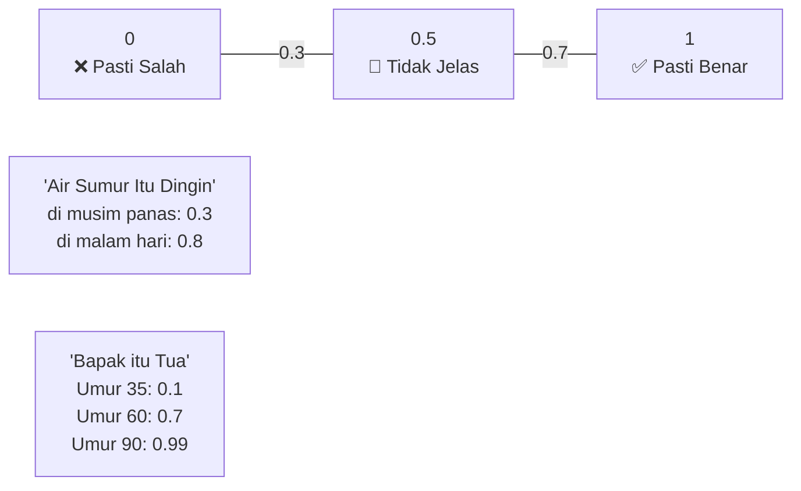
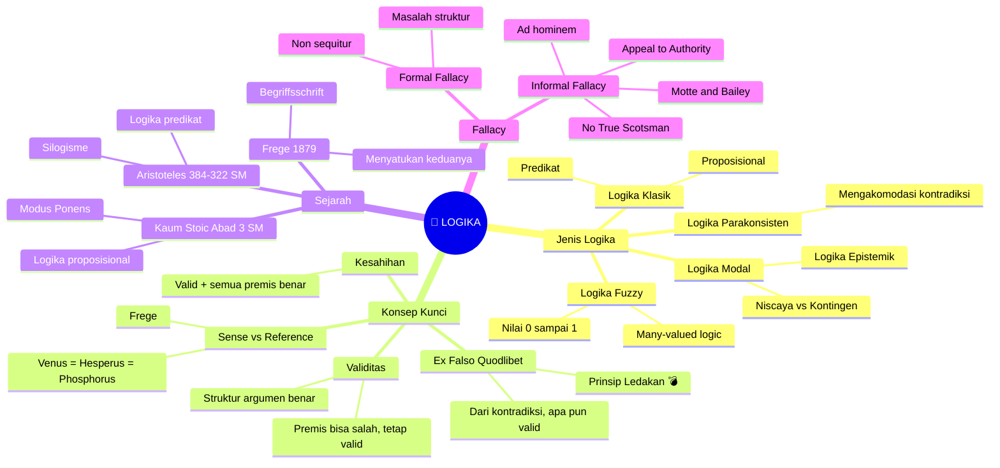

## 🤔 Apa Itu Logika?

Sebelum menjawab, coba bayangkan percakapan seperti ini:

> *"Hei, semua manusia itu fana, kan? Dan Socrates itu manusia. Jadi Socrates pasti fana."*

Kamu mungkin langsung berpikir: *"Ya, tentu saja."* Bahkan kamu tidak bisa membayangkan kesimpulan itu salah — selama dua premis sebelumnya benar.

**Itulah logika.** 🎯

Secara tradisional — sejak zaman Aristoteles — logika (*logic* dalam bahasa Inggris) didefinisikan sebagai **prinsip penalaran paling umum yang memungkinkan kamu bergerak dari apa yang sudah kamu ketahui, menuju kesimpulan yang pasti benar, tanpa celah untuk kesalahan.**

Tapi — seperti banyak hal dalam filsafat — jawabannya tidak sesederhana itu.

<Callout type="info" title="📖 Dua Pandangan Utama tentang Logika">
**1. Monisme Logika (*Logical Monism*):** Ada satu logika sejati yang berlaku universal — itulah yang dipelajari oleh para filsuf. Buku terbaru *The One True Logic* oleh Owen Griffiths & Alexander Paseau membela pandangan ini.

**2. Pluralisme Logika (*Logical Pluralism*):** Logika adalah *alat* — ada banyak sistem logika untuk berbagai konteks. Seperti relativisme moral, setiap sistem logika bisa sama baiknya untuk domain yang berbeda.
</Callout>

---

## 🏛️ Dua Tradisi Kuno yang Lama Terpisah

### Logika Aristoteles: Predikat dan Term

Aristoteles adalah bapak logika formal Barat. Sistemnya berbasis **predikat** (*predicate*) dan **term** (*term*) — hubungan antara subjek dan propertinya.

Ia mengenali empat tipe pernyataan:

Sistem Aristoteles beroperasi **di dalam kalimat** — menganalisis hubungan antara term dan propertinya.

### Logika Stoic: Proposisi dan Implikasi

Kaum Stoic (*Stoics* — filsuf Yunani-Romawi yang terkenal karena etikanya) ternyata juga logikawan hebat. Mereka memperkenalkan logika **berbasis proposisi** (*proposition*) — kalimat utuh yang bisa benar atau salah.

Dari sinilah lahir **Modus Ponens** — aturan logika yang kita gunakan setiap hari:

> *Jika P, maka Q. P. Oleh karena itu, Q.*

Contoh konkret:
- Premis 1: Jika hujan, aku akan basah.
- Premis 2: Sekarang hujan.
- Kesimpulan: Oleh karena itu, aku basah.

<Callout type="tip" title="💡 Perbedaan Aristoteles vs Stoic">
- **Aristoteles:** Bekerja *di dalam* kalimat — menganalisis predikat dan subjek. ("Semua kucing... ada kucing...")
- **Stoic:** Bekerja *antar* kalimat — menghubungkan proposisi utuh. ("Jika P maka Q...")

Analoginya seperti perbedaan **quantum mechanics** dan **relativitas umum** dalam fisika — keduanya benar, tapi lama tidak bisa disatukan.
</Callout>

### Gottlob Frege: Penyatuan di 1879

Selama lebih dari **2.000 tahun**, kedua sistem ini berdiri sendiri-sendiri. Kant bahkan pernah berkata dengan percaya diri: *"Logika tidak maju satu langkah pun sejak Aristoteles."*

Ia salah besar. 😅

Pada tahun 1879, seorang matematikawan-filsuf Jerman bernama **Gottlob Frege** menerbitkan *Begriffsschrift* (*Konsep Tulisan*) — sebuah karya yang menyatukan logika Aristoteles dan Stoic dalam satu sistem formal yang elegan.

Inilah mengapa Frege disebut **Bapak Logika Modern**.

---

## ✅ Valid vs. Sahih: Dua Konsep yang Sering Tertukar

Ini adalah salah satu perbedaan terpenting dalam logika — dan sering disalahgunakan, bahkan oleh orang yang cukup terpelajar.

### Validitas (*Validity*)

Sebuah argumen **valid** (*valid*) jika:

> **Tidak ada situasi di mana semua premis benar, tetapi kesimpulan salah.**

Perhatikan: ini **hanya tentang struktur**. Sama sekali tidak peduli apakah premisnya benar atau tidak di dunia nyata.

Contoh argumen valid tapi absurd:
- Premis 1: Jika hujan, maka Joe Folly adalah jenis burung.
- Premis 2: Sekarang hujan.
- Kesimpulan: Oleh karena itu, Joe Folly adalah jenis burung. 🐦

Argumen ini **valid** — karena jika kedua premis itu benar, kesimpulannya *harus* benar. Tapi tentu saja premisnya tidak benar di dunia nyata.

### Kesahihan (*Soundness*)

Sebuah argumen **sahih** (*sound*) jika:

> **Valid + semua premis benar di dunia nyata.**

Contoh argumen sahih:
- Premis 1: Semua manusia fana.
- Premis 2: Socrates adalah manusia.
- Kesimpulan: Socrates fana.

Struktur valid ✅ + premis-premisnya benar ✅ = Argumen sahih ✅

<Callout type="warning" title="⚠️ Jebakan di Diskusi Online">
Kalau seseorang berargumen "alam semesta mulai ada, jadi pasti ada penyebabnya" — dan kamu tidak setuju — **jangan katakan argumennya 'tidak valid'**. Argumennya bisa jadi *valid* secara struktur, tapi kamu menganggapnya *tidak sahih* karena mempersoalkan kebenaran salah satu premisnya.

**Invalid** = masalah struktur.
**Tidak sahih** (*unsound*) = premis tidak benar.

Ini bukan soal gaya bahasa — perbedaan ini memberitahu kamu di mana letak perselisihan yang sebenarnya!
</Callout>

---

## 💥 *Ex Falso Quodlibet*: Dari Kontradiksi, Segalanya Mungkin

Ini adalah prinsip yang paling mengejutkan dalam logika klasik — dan juga salah satu yang paling elegan.

**Prinsip:** Dari sepasang premis yang saling kontradiksi (*contradiction*), kesimpulan **apa pun** bisa ditarik secara valid.

Contoh:
- Premis 1: Sekarang hujan.
- Premis 2: Sekarang tidak hujan.
- Kesimpulan: Oleh karena itu, ada gorilla sedang mengamuk di jalanan Jakarta.

Apakah argumen ini valid? **Ya!** 😱

Kenapa? Karena validitas didefinisikan sebagai "tidak ada situasi di mana premis benar dan kesimpulan salah." Jika premis-premisnya saling kontradiksi, **tidak ada situasi di mana keduanya bisa benar secara bersamaan** — sehingga kondisi untuk ketidakvalidan tidak pernah terpenuhi.

Prinsip ini juga dikenal sebagai **Principle of Explosion** (*prinsip ledakan*) 💣 — karena begitu kamu mengizinkan sebuah kontradiksi masuk ke dalam sistem, seluruh sistemmu "meledak": kamu bisa membuktikan *apa saja*.

<Callout type="danger" title="💣 Prinsip Ledakan">
Inilah mengapa kontradiksi tidak diizinkan dalam logika klasik.

Analoginya: dalam matematika, kamu tidak boleh membagi dengan nol — karena jika kamu melakukannya, kamu bisa "membuktikan" bahwa 1 = 2, dan seluruh sistem matematika runtuh.

Sama halnya, satu kontradiksi dalam sistem logika bisa membuat semuanya "valid" — yang artinya *tidak ada* yang valid.
</Callout>

---

## 🚫 Logical Fallacy: Kesalahan Penalaran

*Fallacy* (*kesalahan penalaran*) terbagi dua jenis besar.

### Formal Fallacy (*Kesalahan Formal*): Masalah Struktur

Ini adalah kesalahan dalam **struktur argumen** — bukan pada isi atau kebenarannya.

**Contoh: Menyangkal Anteseden (*Denying the Antecedent*)**

- Premis 1: Jika hujan, aku basah.
- Premis 2: Tidak hujan.
- Kesimpulan (salah!): Oleh karena itu, aku tidak basah.

Ini **invalid** — karena aku bisa saja basah karena mandi, disiram tetangga jahil, atau hujan dari arah lain. Tidak adanya hujan tidak membuktikan aku tidak basah.

Pada dasarnya, semua *formal fallacy* adalah bentuk dari **non sequitur** (*tidak mengikuti*) — kesimpulan yang tidak benar-benar mengikuti dari premis-premisnya.

### Informal Fallacy (*Kesalahan Informal*): Masalah Konteks dan Konten

Ini lebih sulit dianalisis secara formal — kesalahannya bukan di struktur, melainkan di **cara berargumen** dalam konteks diskusi nyata.

<Callout type="note" title="📝 Catatan Penting tentang Informal Fallacy">
Menunjukkan bahwa seseorang melakukan *informal fallacy* **tidak sama** dengan membuktikan kesimpulannya salah. Argumen yang cacat bisa saja mengarah pada kesimpulan yang benar — hanya saja kesimpulan itu tidak *dibuktikan* oleh argumen tersebut.

Banyak sekali argumen buruk yang menghasilkan kesimpulan benar — dan argumen bagus yang ternyata salah premisnya!
</Callout>

---

## 🌊 Bentuk Argumen (*Propositional Form*): Keterampilan yang Mengubah Segalanya

Salah satu keterampilan paling praktis yang bisa kamu ambil dari logika adalah kemampuan **memformulasikan argumen dalam bentuk proposisional** (*propositional form*).

Artinya: mengambil "word salad" (*salad kata*) dari percakapan sehari-hari dan menyaringnya menjadi:
1. **Premis 1** — apa yang diasumsikan?
2. **Premis 2** — apa lagi yang diasumsikan?
3. **Kesimpulan** — apa yang ingin disimpulkan?

**Sebelum formulasi (membingungkan):**
> *"Ya intinya, alam semesta pasti punya awal, dan kalau ada awal pasti ada yang nyiptain, jadi ya Tuhan itu pasti ada kan?"*

**Setelah formulasi (jelas):**
- Premis 1: Segala sesuatu yang mulai ada pasti punya penyebab.
- Premis 2: Alam semesta mulai ada.
- Kesimpulan: Oleh karena itu, alam semesta punya penyebab.

Sekarang kamu bisa **mendebat dengan tepat** — kamu tahu persis di premis mana yang ingin kamu sanggah. (Aquinas, misalnya, menyangkal premis 2: ia tidak percaya bahwa *akal semata* bisa membuktikan alam semesta punya awal.)

<Callout type="tip" title="💡 Latihan 5 Jam yang Mengubah Cara Pandangmu">
Menurut Joe Folley dalam wawancara ini, hanya **5 jam** berlatih dengan buku logika dasar sudah cukup untuk **mengubah fundamental cara kamu melihat dunia**.

Kamu tidak perlu menjadi matematikawan. Kamu hanya perlu terbiasa menyaring argumen menjadi bentuk proposisional — dan keterampilan itu akan bekerja secara otomatis dalam percakapan sehari-hari.

**Rekomendasi:**
- [Open Logic Project](https://openlogicproject.org/) — Buku logika gratis, sangat readable
- *For All X* — Buku teks yang digunakan di Cambridge untuk logika tahun pertama
- *A Friendly Introduction to Mathematical Logic* — Lebih matematis, dari dasar hingga Incompleteness Theorem Gödel
</Callout>

---

## 🌍 Sense dan Reference: Frege dan Kekacauan Makna

Frege tidak hanya menyatukan dua sistem logika — ia juga mengembangkan teori **sense** (*makna/cara identifikasi*) dan **reference** (*rujukan/objek yang ditunjuk*) untuk membersihkan kebingungan dalam bahasa.

Contoh klasik:
- **Hesperus** (*bintang pagi*) dan **Phosphorus** (*bintang sore*) — keduanya nama Venus di zaman kuno.
- Keduanya **merujuk ke objek yang sama** (Venus).
- Tapi **cara orang mengidentifikasinya berbeda** — satu di pagi hari, satu di sore.

Perbedaan *sense* dan *reference* ini sangat berguna untuk menganalisis argumen filosofis yang terasa "curang" — seperti argumen Descartes tentang pikiran dan tubuh:

> *"Aku bisa membayangkan pikiranku ada tanpa tubuhku. Oleh karena itu, pikiran dan tubuh adalah entitas yang berbeda."*

Frege akan berkata: **hati-hati!** Kamu bisa membayangkan "pikiran" dan "sistem saraf" sebagai hal yang berbeda — tetapi itu hanya perbedaan *sense* (cara identifikasi), bukan bukti bahwa *reference*-nya (objek yang ditunjuk) memang berbeda.

---

## 🎭 Logika Modal: Kemungkinan dan Keniscayaan

Logika klasik hanya mengenal dua nilai kebenaran: **benar** atau **salah**.

Tapi ada pertanyaan yang lebih bernuansa:
- *Apakah 2+2=4 benar secara **niscaya** (necessary)?*
- *Apakah kursi ini berwarna cokelat benar secara **kontingen** (contingent)?*

Keduanya benar — tapi dengan cara yang berbeda. Warna kursi bisa saja berbeda. Tapi 2+2=4 tidak bisa lain.

**Logika Modal** (*Modal Logic*) menangkap perbedaan ini dengan menambahkan operator **□** (*box* — niscaya/necessary) dan **◇** (*diamond* — mungkin/possible).

Sistem ini menggunakan konsep **possible worlds** (*dunia-dunia yang mungkin*) — bukan multiverse fiksi ilmiah, tapi sekadar cara berpikir:

> *"Ada dunia yang mungkin di mana kursi ini biru" = ada situasi konseptual di mana kursi ini biru, bahkan jika tidak ada dalam kenyataan.*

### Logika Epistemik: Logika Kepercayaan dan Pengetahuan

Kerangka yang sama bisa dipakai untuk menganalisis **kepercayaan** (*belief*) dan **pengetahuan** (*knowledge*):

> *"Agen A percaya bahwa P" = P benar di semua dunia yang A pertimbangkan.*

Ini memberikan cara formal yang sangat rapi untuk mendefinisikan "percaya" tanpa harus masuk ke debat metafisik yang panjang.

---

## 🌫️ Logika Fuzzy: Dunia Tidak Selalu Hitam-Putih

Logika klasik menuntut setiap pernyataan bernilai **benar (1) atau salah (0)** — tidak ada di antaranya.

Tapi bagaimana dengan: *"Pak Budi itu orang kaya"*?

Apakah ini benar? Tergantung — kaya dibandingkan apa? Pak Budi mungkin "agak kaya" atau "lumayan kaya", bukan "benar-benar kaya" atau "pasti miskin".

**Logika Fuzzy** (*Fuzzy Logic*) memperkenalkan nilai kebenaran kontinu antara 0 dan 1:
- **0** = pasti salah
- **0.3** = agak salah / sedikit benar
- **0.5** = indeterminate / tidak jelas
- **0.7** = cukup benar
- **1** = pasti benar

Logika Fuzzy sangat berguna untuk:
- **Kecerdasan buatan (AI)** — sistem kontrol mesin cuci, AC, dll.
- **Analisis linguistik** — kata-kata vague (*samar*) seperti "tinggi", "cepat", "jauh"
- **Teori probabilitas** — menggabungkan ketidakpastian

---

## 🌿 Logika sebagai Ilmu Normatif

Pertanyaan terakhir yang menarik: **dari mana aturan-aturan logika berasal?**

Mereka bukan hanya deskripsi bagaimana kita berpikir — karena kita sering berpikir secara tidak logis (penelitian psikologi Kahneman & Tversky membuktikan ini). Kita sering berpikir secara heuristik (*heuristic* — jalan pintas mental), emosional, dan asoasiatif.

Logika adalah **ilmu normatif** (*normative science*) — seperti yang dikatakan filsuf CS Pierce:

> *"Logika bukan tentang bagaimana kamu berpikir — melainkan tentang bagaimana kamu seharusnya berpikir."*

Ini memunculkan pertanyaan filosofis yang menarik: bisakah kita bersikap *anti-realis* terhadap logika, seperti kita bisa bersikap anti-realis terhadap moralitas?

Aristoteles punya jawaban pragmatis yang elegan untuk itu. Jika ada yang menolak Hukum Non-Kontradiksi (*Law of Non-Contradiction* — sebuah proposisi tidak bisa benar dan salah sekaligus), ia berkata:

> *"Baiklah. Coba pikirkan sebuah kontradiksi. Kamu tidak bisa melakukannya. Itulah buktinya."*

<Callout type="abstract" title="📐 Tiga Hukum Dasar Logika">
Inilah tiga **hukum dasar logika** (*foundational laws of logic*) yang dianggap sebagai bedrock (*landasan terdalam*) dari seluruh penalaran:

**1. Hukum Identitas (*Law of Identity*):**
> Sebuah hal adalah dirinya sendiri. A = A.

**2. Hukum Non-Kontradiksi (*Law of Non-Contradiction*):**
> Sebuah proposisi tidak bisa benar sekaligus salah pada waktu dan cara yang sama.

**3. Hukum Tertium Non Datur (*Law of Excluded Middle*):**
> Sebuah proposisi harus benar atau salah — tidak ada pilihan ketiga.
> *(Catatan: hukum ketiga ini ditolak oleh logika intuisionis dan sebagian logika many-valued)*
</Callout>

---

## 📚 Rangkuman: Peta Konsep Logika

---

## 🎯 Mengapa Belajar Logika?

Logika bukan hanya untuk matematikawan atau filsuf. Ini adalah **keterampilan meta-kognitif** (*meta-cognitive skill*) — kemampuan untuk berpikir tentang cara kamu berpikir.

Dalam kehidupan sehari-hari, logika membantumu:

1. **🔍 Mengenali argumen yang cacat** — dalam berita, media sosial, debat politik
2. **💬 Berkomunikasi lebih jelas** — dengan memformulasikan posisimu dalam bentuk proposisional
3. **🤝 Berdebat lebih produktif** — dengan pertama-tama menyepakati *struktur* perdebatan sebelum membahas kebenarannya
4. **🧩 Memecahkan masalah lebih sistematis** — dengan memisahkan apa yang kamu ketahui dari apa yang kamu simpulkan

<Callout type="success" title="✅ Mulai Belajar Logika Hari Ini">
**Sumber gratis:**
- 🌐 [Open Logic Project](https://openlogicproject.org/) — Buku teks gratis, termasuk *For All X* yang dipakai di Cambridge
- 📖 *Volker Halbach's Logic Manual* — Pengantar yang sangat baik
- 📘 *A Friendly Introduction to Mathematical Logic* — Dari dasar hingga Gödel

**Waktu yang dibutuhkan:** 5 jam kumulatif sudah cukup untuk mengubah cara pandangmu tentang argumen dan penalaran.
</Callout>

---

*Artikel ini didasarkan pada percakapan [Joe Folley dengan Alex O'Connor di YouTube](https://www.youtube.com/watch?v=thtomlDVBPI) — salah satu pengantar logika paling accessible dan mengalir yang pernah ada.*
