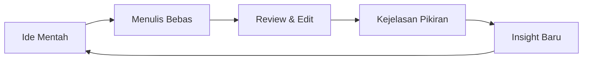

## Menulis Bukan untuk Dibaca

Paradoks: tulisan terbaik sering lahir ketika kita tidak peduli apakah ada yang membacanya. Menulis untuk diri sendiri membebaskan kita dari tekanan performa.

<Callout type="tip" title="Tips Menulis">
Mulai dengan menulis 10 menit setiap hari tanpa memikirkan kualitas. Konsistensi lebih penting dari kesempurnaan.
</Callout>

## Proses, Bukan Produk

Saat menulis, pikiran yang tadinya kabur dipaksa menjadi kalimat. Kalimat memaksa struktur. Struktur memaksa kejelasan.

> "I don't know what I think until I write it down." — Joan Didion

<Callout type="info" title="Fun Fact">
Penelitian menunjukkan bahwa menulis tangan mengaktifkan bagian otak yang berbeda dibanding mengetik, dan dapat meningkatkan retensi memori.
</Callout>

## Alur Berpikir

Berikut visualisasi proses menulis sebagai cara berpikir:

## Rumus Produktivitas Menulis

Jika kita menulis $n$ kata per hari selama $d$ hari, total output adalah:

$$T = n \times d$$

Dengan konsistensi 500 kata/hari selama setahun: $T = 500 \times 365 = 182.500$ kata — cukup untuk 2-3 buku!

## Catatan Kecil, Dampak Besar

Kebiasaan menulis catatan pendek setiap hari ternyata lebih powerful daripada menulis essay panjang sesekali. Konsistensi mengalahkan intensitas.

<Callout type="warning" title="Peringatan">
Jangan terjebak dalam "productive procrastination" — menghabiskan waktu menyempurnakan sistem catatan alih-alih benar-benar menulis.
</Callout>

Baca juga tulisan terkait: <WikiLink to="berpikir-sistematis" label="Berpikir Sistematis" /> untuk memperdalam topik ini.

## Kesimpulan

Mulai menulis. Jangan tunggu topik sempurna. Tulis apa yang ada di kepala sekarang.

<Callout type="success" title="Takeaway">
Menulis bukan soal menghasilkan karya, tapi soal **menjernihkan pikiran**. Mulai sekarang, bukan besok.
</Callout>
