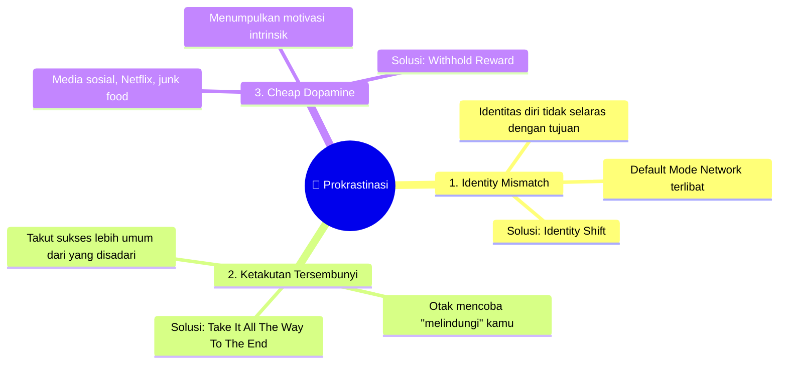
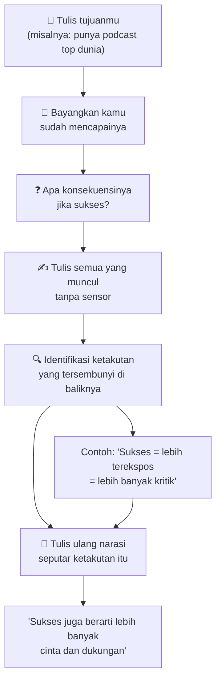
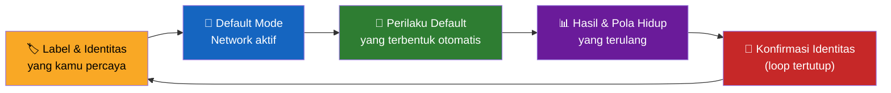
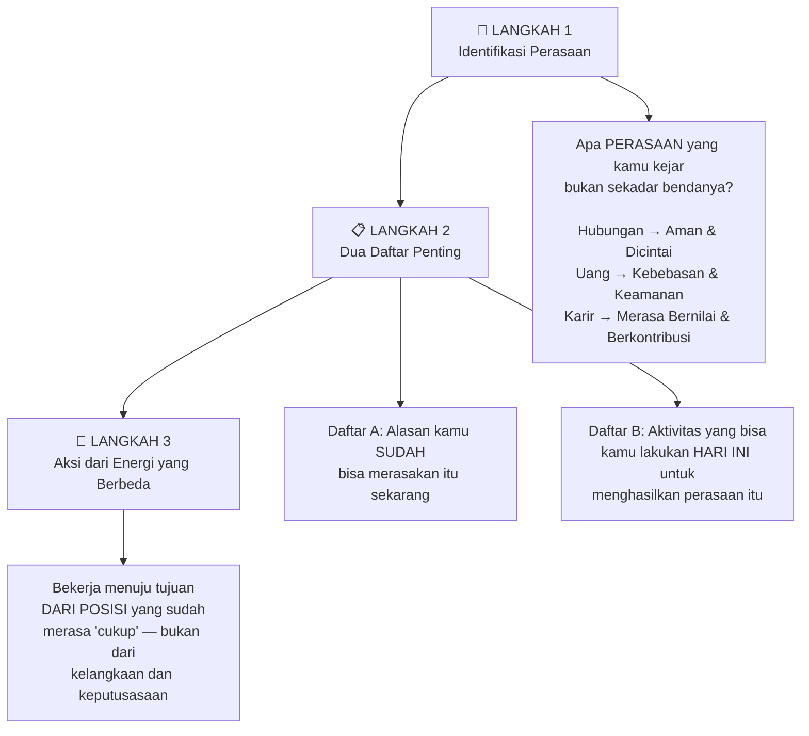
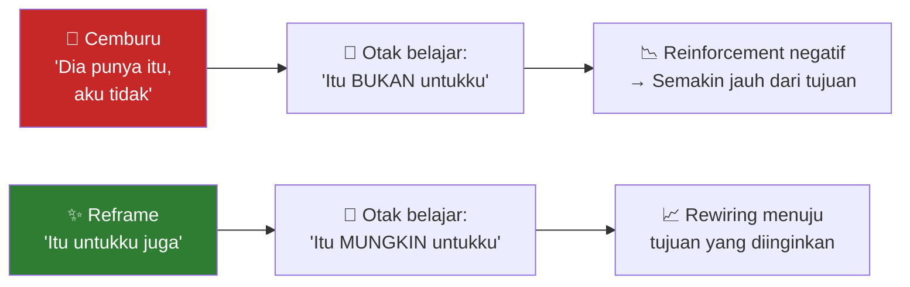
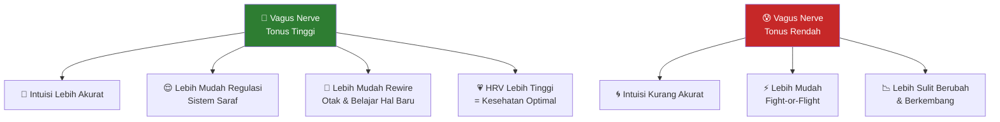
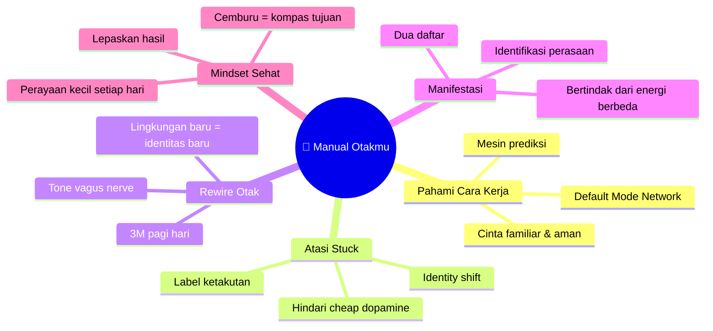

## 🧠 Kamu Sedang Mengemudikan Mobil yang Tidak Kamu Mengerti

Bayangkan kamu sedang menyetir di jalan tol. Tiba-tiba mobil bermasalah. Mesin tersendat, lampu indikator menyala, dan kamu tidak tahu harus berbuat apa.

Jika kamu tidak paham cara kerja mobil itu, kamu hanya bisa berhenti di pinggir jalan — **terjebak**.

Tapi jika kamu mengerti cara kerjanya — tahu bagian mana yang bermasalah, tahu cara mengatasinya — kamu bisa melanjutkan perjalanan.

**Otakmu bekerja persis seperti ini.**

Ketika kamu merasa stres, kewalahan, sulit fokus, atau terjebak dalam rutinitas yang tidak memuaskan — itu bukan karena kamu "tidak cukup baik" atau "tidak cukup keras berusaha". Itu karena kamu mengemudikan mesin paling kompleks di alam semesta tanpa memahami cara kerjanya.

Artikel ini adalah manualnya.

---

## 🔍 Mengapa Kita Merasa "Stuck"?

*"Stuck"* — kata dalam bahasa Inggris yang berarti **terjebak** — adalah perasaan yang dialami jutaan orang: terjebak dalam pekerjaan yang salah, hubungan yang tidak sehat, atau mimpi yang tidak kunjung terwujud.

Dari perspektif neurosains (*ilmu saraf*), perasaan "stuck" ini sangat **normal dan natural** — bahkan sudah tertanam dalam biologi kita.

Sebabnya: **otak adalah mesin prediksi**.

<Callout type="info" title="🔮 Otak: Mesin Prediksi, Bukan Kamera">
Kita tidak benar-benar "mengalami realita" secara langsung. Yang terjadi adalah otak kita **memfilter semua yang kita lihat, dengar, rasakan** — lalu memprediksi apa yang akan terjadi selanjutnya.

Itulah mengapa kita bisa merasa cemas tanpa alasan yang jelas: otak sedang memprediksi ancaman masa depan, bukan merespons bahaya nyata di saat ini.
</Callout>

Otak sangat menyukai **hal yang aman dan familiar**. Ia dirancang untuk mempertahankan *status quo* (kondisi saat ini) karena dalam perspektif evolusi, hal yang familiar = aman = bertahan hidup.

Masalahnya: pertumbuhan pribadi, karir baru, hubungan yang lebih baik — semua ini justru membutuhkan hal yang **tidak familiar**. Dan otak akan selalu mencoba menarikmu kembali ke zona nyaman.

---

## 🚫 3 Penyebab Utama Prokrastinasi — Menurut Neurosains

**Prokrastinasi** (*procrastination* — kebiasaan menunda-nunda) adalah salah satu manifestasi paling umum dari perasaan "stuck". Dan ada **3 penyebab berbeda** yang membutuhkan solusi berbeda.

### 🎭 Penyebab 1: Identity Mismatch (Ketidakselarasan Identitas)

Ini adalah penyebab yang paling jarang disadari, namun paling fundamental.

**Default Mode Network** (*Jaringan Mode Default*) adalah jaringan saraf di otak yang aktif saat kita tidak sedang fokus pada tugas spesifik — saat melamun, merenung, atau beristirahat. Fungsinya sangat penting: ia **mengatur dan mendorong perilaku default kita**, serta membangun **narasi atau cerita tentang siapa diri kita**.

Inilah yang terjadi:

> Katakanlah kamu ingin memulai podcast. Kamu tahu itu tujuanmu. Kamu ingin melakukannya. Tapi terus menunda. Mengapa?
>
> Karena **identitasmu belum selaras** dengan citra diri sebagai "podcaster". Default Mode Network-mu tidak melihat kamu sebagai podcaster — dan karenanya, ia tidak mendorong perilaku yang diperlukan untuk mewujudkannya.

Solusinya bukan bekerja lebih keras atau mencari motivasi lebih banyak. Solusinya adalah **identity shift** (pergeseran identitas).

<Callout type="tip" title="💡 Identity Shift: Cara Praktisnya">
Alih-alih berkata *"Aku mau jadi podcaster"* (di masa depan), mulailah berkata *"Aku adalah podcaster"* (sekarang).

Ini bukan kebohongan pada diri sendiri — ini adalah cara kerja otak. Persis seperti cara kita tertidur: kita **berpura-pura** sudah tidur (berbaring, tutup mata, perlambat napas) sampai akhirnya otak mewujudkannya.

Ketika kamu memilih identitas baru, otakmu **berhenti menggunakan masa lalu untuk memprediksi masa depan** — dan mulai menggunakan identitas baru yang kamu pilih sebagai dasar prediksinya.
</Callout>

**Label yang kamu pakai sangat penting.** Jika kamu tumbuh dengan label "anak yang lambat belajar", "orang yang tidak terorganisir", atau "tipe yang tidak bisa konsisten" — label-label itu sudah tertanam dalam Default Mode Network-mu. Dan mereka menentukan perilakumu tanpa kamu sadari.

Kamu punya **kekuatan untuk memilih label baru**.

---

### 😰 Penyebab 2: Ketakutan Tersembunyi (Bukan Ketakutan akan Kegagalan)

Ini mengejutkan banyak orang: salah satu alasan paling umum kita prokrastinasi bukan karena **takut gagal** — melainkan karena **takut sukses**.

Mengapa? Karena otak memprediksi konsekuensi kesuksesan itu sendiri:

- Sukses = lebih banyak orang yang melihatmu
- Lebih banyak orang melihat = lebih banyak kritik dan penghakiman
- **Otak: "Bahaya! Lebih baik jangan dimulai."**

Ketakutan ini bekerja di bawah level kesadaran — itulah mengapa banyak orang tidak menyadarinya.

#### Teknik: "Take It All The Way To The End"

Teknik ini sangat efektif untuk mengidentifikasi ketakutan tersembunyi. Caranya:

**Proses Labeling (Penamaan) Ketakutan**

Ada alasan neurosaintifik mengapa menulis dan menamai ketakutanmu itu efektif. Ketika kamu **melabeli emosi**, kamu mengaktifkan **Prefrontal Cortex** (*korteks prefrontal* — bagian otak yang bertanggung jawab untuk penalaran dan pengambilan keputusan).

**Prefrontal Cortex** dan **Amygdala** (*amigdala* — pusat respons emosional dan rasa takut) memiliki hubungan seperti **jungkat-jungkit**: ketika aktivitas satu naik, aktivitas yang lain turun.

Jadi ketika kamu **menamai ketakutanmu**, secara harfiah kamu **mengurangi kekuasaan amigdala** dan **mengaktifkan CEO otakmu** — bagian rasional yang bisa membantu kamu berpikir jernih dan membuat keputusan yang lebih baik.

<Callout type="warning" title="⚠️ Perhatian Penting">
Jangan visualisasikan ketakutan jika kamu merasa itu bisa memicu respons fisik yang intens. Teknik ini dimaksudkan untuk eksplorasi ringan yang terkontrol, bukan untuk menghadapi trauma berat tanpa pendampingan profesional.
</Callout>

---

### 🍭 Penyebab 3: Cheap Dopamine (Dopamin Murahan)

**Dopamin** (*dopamine*) adalah neurotransmitter (*zat pengirim sinyal di otak*) yang sering salah dipahami. Banyak orang mengiranya adalah "hormon kesenangan" — tapi lebih tepat disebut **"hormon motivasi dan antisipasi"**.

**Dopamin tidak peduli dengan mimpimu. Dopamin hanya peduli dengan apa yang kamu automatisasi dan ulangi.**

Yang menjadi masalah adalah **cheap dopamine** (dopamin murahan): sumber-sumber yang memberikan lonjakan dopamin instan tanpa kerja keras:

| Sumber Cheap Dopamine | Efek pada Motivasi |
|-----------------------|-------------------|
| Scroll media sosial | 📉 Menumpulkan drive untuk tugas besar |
| Binge-watching Netflix | 📉 Desensitisasi reseptor dopamin |
| Junk food tengah malam | 📉 Mengganggu restorasi dopamin saat tidur |
| Shopping impulsif | 📉 Reward tanpa effort = brain-hijacking |

**Analogi yang tepat:** Jika kamu ngemil (*snacking*) terus-menerus sepanjang hari, kamu tidak akan pernah benar-benar lapar saat jam makan. **Cheap dopamine = ngemil untuk otak**. Kamu tidak akan pernah merasa "lapar" untuk menyelesaikan tugas besar yang bermakna.

#### Masalah Tersembunyi: Scroll Malam Hari

Ini sangat krusial dan jarang dibahas:

> **Dopamin di-reset dan dipulihkan saat kamu tidur.** Tapi jika kamu memberi dirimu cheap dopamine (scroll, Netflix, camilan) sebelum tidur, kamu melakukan dua kerusakan sekaligus:
>
> 1. **Mengganggu kualitas tidur** → dopamin tidak bisa memulihkan diri sepenuhnya
> 2. **Mendesensitisasi reseptor dopamin** → kamu bangun pagi dengan sensitivitas dopamin yang lebih rendah, artinya **motivasi pagi hari berkurang**

Itulah mengapa banyak orang merasa "malas" di pagi hari meskipun sudah tidur cukup lama.

#### Solusi: Withhold Reward (Tahan Hadiah)

Teknik yang terbukti efektif: **jangan berikan reward kepada dirimu sebelum menyelesaikan tugas yang kamu tunda**.

Ini bukan tentang hukuman diri sendiri — ini tentang melatih otak. Seekor anjing tidak belajar duduk secara gratis. Ketika anjing duduk lalu mendapat camilan, **dopamin melonjak → pembelajaran terjadi → perilaku terpola**.

Kamu bisa melatih otakmu dengan cara yang sama. Identifikasi sesuatu yang benar-benar kamu inginkan (baju baru, makan di restoran favorit, aktivitas yang kamu sukai) dan **jadikan itu reward setelah tugas selesai**.

Ini juga berarti: miliki **sesuatu yang ditunggu-tunggu** (*something to look forward to*). Dopamin juga dilepaskan dalam **antisipasi** — bukan hanya saat menerima reward. Itulah mengapa anak-anak tidak bisa tidur malam sebelum Natal. Rasa antisipasi itu sendiri sudah memompa dopamin dan produktivitas.

---

## 🧬 Default Mode Network & Kekuatan Identitas

Setelah memahami tiga penyebab prokrastinasi, mari selami lebih dalam tentang bagaimana **identitas** bekerja di level neurosains.

Loop ini berjalan terus-menerus — dan bisa menjadi loop yang memberdayakan **atau** loop yang membatasi, tergantung identitas apa yang kamu beri "makan".

**Kabar baiknya:** karena loop ini dimulai dari identitas, kamu bisa **masuk ke loop kapan saja** dengan memilih identitas baru secara sadar.

---

## 😻 Eksperimen Kucing & Cara Otak Membangun Realita

Salah satu studi paling mengungkap tentang cara kerja otak dilakukan pada **1970-an** menggunakan anak-anak kucing (*kittens*).

Para peneliti membesarkan kucing dalam dua kelompok:
- **Kelompok A**: hanya dipaparkan pada garis **horizontal** (mendatar)
- **Kelompok B**: hanya dipaparkan pada garis **vertikal** (tegak lurus)

Ketika dewasa dan dilepaskan ke lingkungan normal:

| Kelompok | Yang Terjadi |
|----------|-------------|
| Kucing Horizontal | **Menabrak kaki meja dan kursi** — tidak bisa "melihat" objek vertikal karena otaknya tidak terprogram untuk membangunnya |
| Kucing Vertikal | **Gagal melompat ke atas permukaan datar** — tidak bisa melihat objek horizontal dengan baik |

**Implikasi yang mengubah segalanya:**

> Jika cara kucing dibesarkan menentukan apa yang bisa mereka *persepsi* dalam realita mereka — apa yang **tidak bisa kamu lihat dalam hidupmu** karena cara otakmu terprogram?

Pekerjaan impian itu mungkin ada di depan matamu. Hubungan yang kamu inginkan mungkin sudah ditawarkan. Peluang bisnis itu mungkin sudah lewat berkali-kali. Tapi **otakmu tidak terprogram untuk melihatnya**.

<Callout type="important" title="🎯 Implikasi untuk Manifestasi">
Ini adalah dasar neurosaintifik dari apa yang banyak orang sebut "manifestasi" (*manifestation* — proses mewujudkan keinginan ke dalam realita).

Bukan sihir. Bukan sekadar "berpikir positif". Ini adalah proses **rewiring otak** (pemrograman ulang otak) sehingga ia mulai **membangun dan mempersepsi** hal-hal yang sebelumnya tidak terlihat.

Kamu harus **menjadi versinya** sebelum bisa **melihatnya** di realitamu.
</Callout>

---

## ✨ 3 Langkah Manifestasi Berbasis Neurosains

Berikut adalah proses tiga langkah yang bisa diterapkan langsung:

### 🎯 Langkah 1: Identifikasi Perasaan

Prinsip fundamental: **kamu tidak menginginkan benda itu sendiri — kamu menginginkan perasaan yang kamu percaya akan dibawa benda itu kepadamu**.

- Ingin uang banyak? → Mungkin yang kamu cari adalah **kebebasan, keamanan, atau pilihan**
- Ingin hubungan romantis? → Mungkin yang kamu cari adalah **dicintai, dimengerti, atau didukung**
- Ingin karir prestisius? → Mungkin yang kamu cari adalah **dihargai, berkontribusi, atau diakui**

Ketika kamu tahu **perasaan yang sebenarnya kamu kejar**, kamu bisa mulai menciptakannya **sekarang** — tanpa harus menunggu "bendanya" tiba.

### 📋 Langkah 2: Dua Daftar Penting

**Daftar A — Alasan kamu SUDAH bisa merasakan perasaan itu:**

Otak kita sering mengabaikan bukti-bukti positif yang sudah ada. Jika kamu mencari perasaan "accomplished" (terpenuhi/berprestasi), tulis semua hal yang sudah kamu capai — betapapun kecilnya. Banyak orang di komunitas neurosains bahkan **mencetak CV mereka dan menempelnya di cermin kamar mandi** sebagai pengingat harian.

**Daftar B — Aktivitas yang bisa kamu lakukan hari ini untuk menciptakan perasaan itu:**

Apa yang bisa kamu lakukan **sekarang, dalam kendalimu**, untuk merasakan perasaan itu? Jika kamu menginginkan perasaan "accomplished":
- Selesaikan satu tugas kecil yang sudah lama tertunda
- Olahraga (exercise selalu menghasilkan perasaan accomplished)
- Bantu seseorang dan lihat dampak langsung tindakanmu

### 🔄 Langkah 3: Bertindak dari Energi yang Berbeda

Setelah melakukan Langkah 1 dan 2 secara konsisten, kamu akan mulai **bertindak menuju tujuanmu dari tempat yang sudah merasa cukup** — bukan dari tempat kekurangan dan keputusasaan.

Perbedaannya sangat nyata. Dua orang yang sama-sama bekerja keras menuju tujuan yang sama bisa mendapat hasil yang sangat berbeda — tergantung dari **energi apa** mereka bekerja.

---

## 🔬 Mengapa "Sangat Menginginkan Sesuatu" Justru Menghalangimu

Ini adalah konsep yang paling kontra-intuitif (*berlawanan dengan intuisi*) dalam neurosains perilaku.

Ketika kamu **sangat terikat pada suatu outcome** (hasil) — di titik di mana itu meningkatkan level stres — yang terjadi adalah:

1. **Kortisol** (*cortisol* — hormon stres) meningkat
2. Kortisol tinggi **mempersempit persepsi** — kamu mengalami *tunnel vision* (pandangan terowongan)
3. Tunnel vision = **kamu tidak bisa melihat jalur alternatif** menuju tujuanmu
4. Sistem saraf dalam mode **fight-or-flight** (*lawan-atau-lari*) → sangat sulit untuk belajar hal baru atau rewire otak

Bayangkan seorang anak di kelas yang sedang di-bully oleh semua teman-temannya. Bisakah ia fokus belajar? Hampir tidak mungkin. Tapi jika ia merasa aman di kelas itu, ia bisa menyerap pelajaran dengan jauh lebih baik.

**Keamanan emosional adalah prasyarat untuk pertumbuhan neurosaintifik**.

### 💫 Efek Inkubasi (Incubation Effect)

Ada fenomena otak yang disebut **incubation effect** (*efek inkubasi*). Kamu pasti pernah mengalaminya:

> Kamu memikirkan suatu masalah keras-keras... tidak ketemu jawabannya. Lalu kamu jalan-jalan, mandi, atau tidur — dan tiba-tiba jawabannya muncul.

Ini karena **alam bawah sadar kita** mampu memproses informasi dalam jumlah yang jauh lebih besar dan membuat koneksi yang lebih kreatif dibandingkan pikiran sadar — **tapi hanya ketika kamu tidak terlalu fokus pada masalah itu**.

Ketika kamu terlalu terikat dan terus-terusan memikirkan sesuatu, kamu justru **menghentikan efek inkubasi** dari bekerja.

> *"Lepaskan hasilnya bukan berarti kamu berhenti bekerja. Itu berarti kamu fokus pada input yang bisa kamu kendalikan, tapi melepaskan 'bagaimana' dan 'kapan' — dan membiarkan proses di balik layar bekerja."*

---

## 💚 Kecemburuan Adalah Ketakutan dengan Topeng

Salah satu insight paling praktis: **kecemburuan** (*jealousy* / *envy*) bisa digunakan sebagai **kompas menuju keinginan tersembunyi**.

Ketika kamu merasa cemburu pada seseorang, otakmu sebenarnya sedang berkata:

> *"Aku mau itu juga, tapi aku tidak percaya itu mungkin untukku."*

Dengan kata lain, **setiap kali kamu merasa cemburu, kamu sedang mengajari otakmu bahwa hal itu bukan untukmu**.

Sebaliknya, coba teknik ini: ketika melihat sesuatu yang kamu inginkan dimiliki orang lain, katakan pada dirimu sendiri: **"Itu untukku juga."**

---

## 🌱 Neuroplastisitas: Otak Bisa Berubah di Usia Berapa Pun

**Neuroplastisitas** (*neuroplasticity*) adalah kemampuan otak untuk membentuk koneksi saraf baru dan mengubah dirinya sendiri sebagai respons terhadap pengalaman dan pembelajaran.

Ini bukan metafora — ini fakta biologis yang terbukti secara ilmiah.

Artinya: diagnosis, label, dan "cara kamu selama ini" **bukan harga mati**. ADHD, kecemasan kronis, pola pikir negatif — semuanya adalah **konfigurasi otak yang bisa diubah** melalui praktik yang tepat dan konsisten.

<Callout type="success" title="🔑 Kunci Neuroplastisitas">
Untuk memaksimalkan kemampuan otak beradaptasi dan belajar:
- **Regulasi sistem saraf** (bukan dalam kondisi fight-or-flight)
- **Tidur berkualitas** (saat tidur, otak membersihkan limbah dan mengkonsolidasikan pembelajaran)
- **Gerakan fisik** (olahraga terbukti meningkatkan neuroplastisitas)
- **Pengulangan yang disengaja** (habit formation — pembentukan kebiasaan)
</Callout>

---

## 🌿 Vagus Nerve: Jembatan Antara Otak dan Tubuh

Salah satu temuan paling menarik yang jarang dibahas: **Nervus Vagus** (*vagus nerve* — saraf vagus, saraf kranial ke-10) memiliki peran krusial yang sering diabaikan.

Nervus vagus adalah "superhighway" (*jalan raya utama*) antara otak dan organ tubuh — jantung, paru-paru, sistem pencernaan. Ia adalah komponen utama dari **koneksi pikiran-tubuh** (*mind-body connection*).

Riset terbaru menunjukkan bahwa **tingkat "tonus" (kekuatan) nervus vagus** terhubung langsung dengan:

- 🎯 **Akurasi intuisi** — semakin toned vagus nerve, intuisi semakin akurat
- 🧘 **Regulasi sistem saraf** — lebih mudah kembali ke kondisi tenang dari stres
- 🧠 **Kemampuan belajar dan rewiring otak** — kondisi yang optimal untuk pertumbuhan
- ❤️ **Heart Rate Variability / HRV** (variabilitas detak jantung) — indikator kesehatan sistem saraf

### Cara Meningkatkan Tonus Vagus Nerve:

- 🎵 **Humming** (*bersenandung*) — bisa dilakukan kapan saja, bahkan saat kamu merasa cemas
- 🌿 **Grounding** (*berjalan bertelanjang kaki di alam*)
- 🏃 **Exercise** (*olahraga*) — semua jenis
- 🙏 **Gratitude practice** (*praktik syukur*) — terbukti secara neurosaintifik
- 🧘 **Meditasi dan breathwork** (*latihan pernapasan*)
- 📳 **Bone conduction vibration** (perangkat khusus yang menggunakan konduksi tulang)

---

## 🌅 Rutinitas Pagi: 3M untuk Otak Optimal

Ketika ditanya apa satu hal yang bisa dilakukan seseorang esok pagi, jawabannya adalah: **3M — Movement, Mindset, Mindfulness**.

<Callout type="tip" title="🌅 The 3M Morning Routine">

**🏃 Movement (Gerakan)**
Setiap malam saat tidur, otak membuang "limbah" (*waste products*) melalui sistem limfatik ke leher. Jika kamu tidak bergerak di pagi hari, limbah itu hanya menggenang. Studi terbaru bahkan menghubungkan hal ini dengan **Alzheimer's dan penurunan kognitif**.

Tidak perlu gym 1 jam — 3 *sun salutations* (gerakan yoga dasar) selama 1 menit pun sudah cukup.

**🧠 Mindset (Pola Pikir)**
Tanam "benih" untuk hari ini. Bisa berupa: menulis afirmasi, membaca kutipan inspiratif, atau menetapkan satu niat harian yang spesifik.

**🧘 Mindfulness (Kesadaran Penuh)**
"Gemburkan tanah" sebelum menanam benih. Meditasi, breathwork, atau sekadar duduk hening 5 menit sambil memperhatikan pernapasan.

*Lama: Bisa 15 menit, bisa 2 jam — sesuaikan dengan harimu.*

</Callout>

---

## 🔄 Otak sebagai Mesin Asosiasi: Kenapa Lingkungan Baru = Identitas Baru

Otak bukan hanya mesin prediksi — ia juga **mesin asosiasi**. Otak suka membuat koneksi antara berbagai hal.

Ketika kamu berada di **lingkungan yang sama** selama bertahun-tahun, otakmu memiliki ribuan asosiasi yang tertanam kuat: tempat ini = orang ini = identitas ini = perilaku ini.

Ketika kamu **berpindah ke lingkungan baru**, otak tidak punya asosiasi lama untuk "menarikmu kembali". Ini seperti **clean slate** (*lembar kosong*) — jauh lebih mudah untuk membangun identitas baru, keyakinan baru, dan kebiasaan baru.

Inilah mengapa banyak orang yang ingin "berubah" merasa jauh lebih mudah setelah pindah kota, berganti pekerjaan, atau bahkan sekadar mendekorasi ulang kamar mereka.

---

## 🧩 Semua Orang Hidup di Realita yang Berbeda

Salah satu insight paling membebaskan dari neurosains: **tidak ada dua orang yang melihat dunia yang persis sama**.

> **Kamu tidak melihat dengan matamu. Kamu melihat dengan otakmu.**
>
> Yang dilakukan mata hanyalah menerima sinyal cahaya. Sinyal itu lalu berjalan melewati otak — di mana **pikiran, emosi, keyakinan, dan pengalaman masa lalu** semuanya ikut diproses — **baru kemudian** citra yang kamu "lihat" dibentuk.

Ini berarti:
- Orang yang mengkritikmu **hidup di realita berbeda dari kamu**
- Cara mereka melihat dunia dibentuk oleh pemrograman mereka sendiri
- Opini mereka adalah **kebenaran di dalam realita mereka** — tapi tidak harus menjadi kebenaranmu

Bayangkan kembali eksperimen kucing: kucing yang dibesarkan dengan garis horizontal memberi saran kepada kucing yang dibesarkan dengan garis vertikal. Keduanya berbicara dari realita yang sama sekali berbeda.

<Callout type="quote" title="Insight Penting">
*"Being misunderstood is the tax that you pay for being authentic."*

*"Disalahpahami adalah pajak yang kamu bayar untuk menjadi dirimu yang autentik."*
</Callout>

---

## 💎 Ringkasan: Manual Singkat untuk Otakmu

---

## 🏁 Penutup: Kamu Bukan Stuck — Kamu Belum Tahu Cara Menghidupkan Mesinnya

Jika ada satu hal yang harus diambil dari semua ini:

**Kamu bukan rusak. Kamu bukan tidak cukup baik. Kamu hanya mengemudikan mesin yang paling rumit di alam semesta tanpa membaca manualnya.**

Dan sekarang kamu sudah mulai membacanya.

Otak yang kamu miliki adalah **instrumen paling luar biasa yang pernah ada** — lebih canggih dari supercomputer manapun yang pernah dibuat manusia. Dan tidak seperti komputer, ia bisa **memprogram ulang dirinya sendiri** berdasarkan pilihan yang kamu buat setiap hari.

Setiap pikiran yang kamu pilih, setiap label yang kamu pegang, setiap tindakan kecil yang kamu ambil — semua itu sedang secara literal **mengubah struktur fisik otakmu**.

Kamu tidak harus menunggu jadi sempurna untuk mulai. Kamu tidak harus menunggu "siap" untuk berubah. Kamu hanya perlu mulai dengan langkah pertama yang paling kecil — dan percayakan pada mesin luar biasa di dalam kepalamu untuk melakukan sisanya.

**Mulai hari ini. Dari sini.** 🌱

---

<Callout type="note" title="📚 Sumber & Referensi">
Artikel ini terinspirasi dari percakapan dalam podcast **On Purpose with Jay Shetty** bersama **Dr. Emily** (neuroscientist & coach): [Brain Neuroscientist: "This Will DELETE Your Old Self!" - How To Manifest Anything You Want](https://www.youtube.com/watch?v=cUbe6HbFncE)

Untuk eksplorasi lebih lanjut:
- 📖 *The Brain That Changes Itself* — Norman Doidge (tentang neuroplastisitas)
- 📖 *How Emotions Are Made* — Lisa Feldman Barrett (tentang otak sebagai mesin prediksi)
- 🧘 Studi tentang meditasi dan neuroplastisitas: Harvard Medical School (2011)
- 🌿 Penelitian Vagus Nerve & HRV: Dr. Stephen Porges (Polyvagal Theory)
</Callout>
