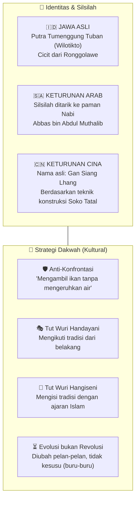
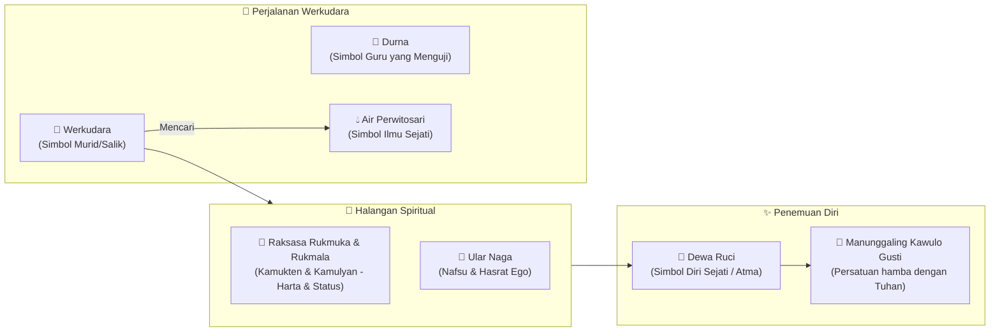
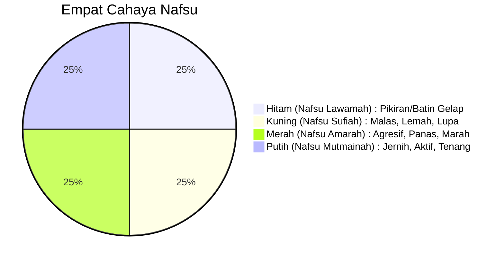

## Pembuka: Nama yang Paling Sering Disebut 🌿

Di antara sembilan wali yang menyebarkan Islam di tanah Jawa, ada satu nama yang selalu muncul pertama kali di bibir orang Jawa ketika membicarakan Islam, kebatinan, dan kearifan lokal: **Sunan Kalijaga**.

Namanya terpatri di nama-nama universitas Islam, di lagu-lagu anak yang ternyata menyimpan filsafat tinggi, di cerita wayang yang membius jutaan penonton, di kidung yang masih dibaca ketika malam tiba. Ia bukan sekadar tokoh sejarah — ia adalah **guru abadi** yang ajarannya terus hidup di lipatan-lipatan budaya Jawa hingga hari ini.

Namun siapa sebenarnya Sunan Kalijaga? Apa yang ia ajarkan? Dan mengapa metode dakwahnya yang dianggap "terlalu lunak" justru berhasil mengislamkan hampir 90% masyarakat Jawa dalam tempo kurang dari dua abad?

*Ngaji Filsafat 138* yang membahas **Sufi Nusantara: Sunan Kalijaga** — sebuah perjalanan intelektual untuk memahami salah satu pikiran terbesar yang pernah lahir di bumi Nusantara.

<Callout type="abstract" title="Sumber Kajian">
Artikel ini merupakan ringkasan mendalam dari Ngaji Filsafat 138: Sufi Nusantara — Sunan Kalijaga. Sumber asli: [Ngaji Filsafat 138](https://www.youtube.com/watch?v=wCfNKC9y66A). Fokus kajian ini adalah **pemikiran dan ajaran** Sunan Kalijaga, bukan kontroversi sejarahnya.
</Callout>

---

## Bagian I: Mengenal Sang Wali — Identitas dan Metodologi 👤

Sunan Kalijaga adalah figur yang sangat kompleks. Ia hidup di masa transisi besar dari akhir kekuasaan Majapahit, melalui Kesultanan Demak, Pajang, hingga awal Mataram. Umurnya sangat panjang, dan perannya tidak hanya sebagai pendakwah awam, tapi juga penasihat spiritual di kalangan istana.

### Strategi "Mengambil Ikan Tanpa Mengeruhkan Air" 🐟

Sunan Kalijaga menyadari bahwa masyarakat Jawa sangat kuat memegang tradisi. Jika Islam datang dengan cara menyerang adat, hasilnya akan kontraproduktif. Rumus beliau sederhana:
1. Jika adat itu buruk tapi sulit diubah, jangan dipaksa. Dekati, ikuti, lalu **ubah pelan-pelan**.
2. Pakai jalur seni: Wayang, Gamelan, Baju, dan Lagu.
3. Gunakan simbolisme yang akrab di telinga masyarakat (misalnya cerita Dewa Ruci).

Hasilnya? Islam di Jawa terasa seperti "milik sendiri", bukan agama asing yang mengancam kebudayaan lokal.

---

## Bagian II: Dewa Ruci — Simbolisme Manunggaling Kawulo Gusti 🌊

Karya monumental yang sering diasosiasikan dengan Sunan Kalijaga adalah modifikasi cerita pewayangan **Dewa Ruci**. Ini bukan sekadar cerita petualangan Bima (Werkudara), tapi sebuah **alegori sufistik** yang sangat dalam.

Dalam cerita ini, Werkudara disuruh mencari air suci di dasar samudra. Di sana, ia bertemu dengan sosok mungil yang wajahnya persis dirinya sendiri — itulah Dewa Ruci. Bima disuruh masuk ke dalam telinga Dewa Ruci yang kecil, dan di dalamnya ia justru melihat seluruh alam semesta yang luas.

**Pesan filosofisnya:** Tuhan itu tidak jauh. Ia ada di dalam "samudra" batinmu sendiri. Untuk menemuinya, kamu harus mengalahkan "Raksasa" (gila harta dan status) serta "Naga" (hawa nafsu).

---

## Bagian III: Bekal Mencari Ilmu Sejati — Kualitas Batin 💎

Sunan Kalijaga mengajarkan bahwa untuk mencapai *Ilmu Sejati*, seorang manusia harus memiliki kualitas batin tertentu. Beliau merumuskannya dalam rangkaian kata-kata Jawa yang sangat padat makna:

1.  **Rilo (Rida):** Ikhlas total, menjadikan Allah sebagai awal dan akhir segalanya.
2.  **Legowo:** Berlapang dada. Apa pun yang terjadi tidak menjadi beban batin. *"Allahnya tidak hilang."*
3.  **Nerimo (Qana'ah):** Menerima apa pun pemberian Tuhan tanpa menuntut atau menyesali.
4.  **Anurogo (Rendah Hati):** Tidak sombong, tidak merasa besar.
5.  **Eling (Ingat):** Frekuensi batin yang selalu terhubung dengan Allah di setiap tarikan napas.
6.  **Santoso (Sentosa):** Konsisten berada di jalan yang benar (*Ihdinash Shiratal Mustaqim*).
7.  **Gembiro (Gembira):** Menjalani hidup dengan ceria karena batinnya sudah rida. Orang stres adalah orang yang tidak rida.
8.  **Rahayu (Selamat):** Selalu menginginkan keselamatan dan kebaikan bagi orang lain.
9.  **Wilujengan (Sehat):** Menjaga amanah fisik titipan Tuhan.
10. **Marsudi Kaweruh:** Tidak pernah berhenti belajar. Jangan merasa sudah pintar.
11. **Semedi (Muhasabah):** Introspeksi diri, Tafakur ke dalam batin.
12. **Ngurang-urangi:** Diet rohani. Mengurangi tidur, makan, dan bicara yang tidak perlu (tidak boros energi duniawi).

---

## Bagian IV: Membedah Empat Cahaya Nafsu 🕯️

Dalam *Suluk Linglung*, diceritakan pengalaman Werkudara (atau Sunan Kalijaga sendiri) melihat empat cahaya saat masuk ke dimensi spiritual. Keempat cahaya ini adalah manifestasi dari jenis-jenis nafsu manusia:

- **Cahaya Hitam (Lawamah):** Batin yang gelap. Mengikuti batin di level ini hanya akan membawa pada kehancuran karena hati sudah tertutup.
- **Cahaya Kuning (Sufiah):** Penyakit "manusiawi" yang berbahaya: malas, lemah, dan gampang lupa. Sering kali kita membenarkan kemalasan kita dengan alasan "hak istirahat".
- **Cahaya Merah (Amarah):** Batin yang panas. Mengambil tindakan saat batin berwarna merah hanya akan membawa penyesalan. *"Mundur dulu sebentar kalau mau marah."*
- **Cahaya Putih (Mutmainah):** Inilah tujuan kita. Batin yang jernih, aktif, tidak malas, dan tidak dikuasai amarah.

---

## Bagian V: Topo & Zakat — Latihan Menaklukkan Energi Hidup 🧘‍♂️

*Topo* (Tapa) berasal dari kata *Tapas* (energi/panas). Menjalankan *Topo* berarti upaya menaklukkan dan menguasai energi hidupmu sendiri. Sunan Kalijaga membaginya menjadi dua dimensi: **Topo (ke dalam)** dan **Zakat (perilaku ke luar)**.

| Dimensi | Topo (Latihan Dalam) | Zakat (Praktik Luar) |
| :--- | :--- | :--- |
| **Badan** | Sopan Santun | Gemar berbuat baik |
| **Hati** | Rela & Sabar | Tidak prasangka buruk (Su'uzon) |
| **Nafsu** | Ikhlas | Tangguh & Pemaaf |
| **Nyawa** | Jujur | Tidak mencela/mengganggu orang lain |
| **Rasa** | Melakukan Keutamaan | Diam, menyesali salah, bertaubat |
| **Cahaya** | Suci | Ikhlas total pada Allah |
| **Atma** | Eling Lan Waspodo | Menjaga kehidupan (Hayu) |

### Diet Rohani: Topo Anggota Badan 🍎

Sunan Kalijaga memberikan resep khusus untuk kesehatan mental melalui pengendalian indra:
- **Mata:** Kurangi tidur (melekan) + Tidak tamak pada milik orang lain.
- **Telinga:** Cegah hawa nafsu + Tidak mendengarkan kata-kata buruk/hoaks.
- **Hidung:** Kurangi minum + Tidak mencela keburukan orang lain.
- **Lisan:** Kurangi makan + Menghindari kata-kata kotor/menyakiti.
- **Tangan:** Tidak mencuri + Tidak menyakiti orang lain lewat perbuatan.
- **Kaki:** Menghindari tempat jahat + Selalu introspeksi langkah yang diambil.

---

## Bagian VI: Kidung Rumekso ing Wengi — Doa Tolak Balak 🌌

Salah satu warisan paling sakral adalah **Kidung Rumekso ing Wengi**. Ini adalah semacam "mantra" atau doa dalam bahasa Jawa agar mudah dipahami oleh masyarakat zaman itu.

Yang unik, beliau mengaitkan bagian tubuh manusia dengan para nabi dan sahabat sebagai simbol energi yang harus diserap:

- **Otak:** Nabi Syis (Ilmu sakral/bijaksana)
- **Ucapan:** Nabi Musa (Kalimullah - teman ngobrol Allah)
- **Napas:** Nabi Isa (Ruhullah)
- **Pendengaran:** Nabi Yakub (Waskito - tajam firasat)
- **Suara:** Nabi Daud (Indah & Merdu)
- **Nyawa:** Nabi Ibrahim (Vitalitas & Semangat mencari kebenaran)
- **Ketampanan/Rupa:** Nabi Yusuf
- **Rambut:** Nabi Idris (Ilmuwan - pelindung kepala)
- **Kulit:** Ali bin Abi Thalib
- **Darah:** Abu Bakar Ash-Shiddiq
- **Daging:** Umar bin Khattab
- **Tulang/Sumsum:** Utsman bin Affan
- **Mata:** Muhammad ﷺ (Pedoman membedakan benar dan salah)

Inti dari kidung ini adalah: *"Dadiao Sariro Tunggal"* — seraplah seluruh energi nabi dan sahabat tersebut ke dalam dirimu sehingga kamu menjadi manusia yang utuh.

---

## Bagian VII: Lir-Ilir — Seruan untuk Bangkit 🥥

Lagu yang kita kira lagu mainan anak-anak ini sebenarnya adalah teks yang sangat terbuka dan canggih secara filsafat.

> *"Lir-ilir, lir-ilir, tandure wis sumilir..."*

**Artinya:** Bangunlah! Bangkitlah! Situasinya sekarang sudah mendukung (tanamannya sudah mulai tumbuh hijau). Fasilitas sudah lengkap (temanten anyar). Ayo kita bergerak!

> *"Cah Angon, cah angon, penekno blimbing kuwi..."*

Kita semua adalah **Cah Angon** (penggembala) — minimal menggembala diri sendiri. **Blimbing** adalah simbol keutamaan (lima rukun Islam/Pancasila). Meskipun licin (susah dijalankan), tetaplah panjat! Gunakan itu untuk mencuci pakaianmu (dirimu).

> *"Dodot iro, dodot iro, kumitir bedah ing pinggir..."*

Bajumu (karaktermu) sedang robek karena nafsu. Jahitlah! Perbaiki dirimu sekarang juga, mumpung masih ada waktu (padang rembulane), mumpung kesempatan masih terbuka lebar.

---

## Bagian VIII: Filosofi Alat Pertanian — Luku & Cangkul 🚜

Inilah bukti jeniusnya Sunan Kalijaga. Beliau bisa menjelaskan filsafat ketuhanan hanya dengan menggunakan alat-alat petani di sawah.

### 1. Luku (Alat Bajak)
- **Cekelan (Pegangan):** Hidup butuh pedoman.
- **Pancatan (Tumpuan kaki):** Ilmu harus diamalkan (dipijak/dijalankan).
- **Tanding:** Gunakan akal untuk memilih alternatif yang paling tepat.
- **Singkal (Sing Sugih Akal):** Tanah dibalik. Tanah yang mati ditaruh di bawah, yang subur di atas. Jika kamu tidak kreatif (tidak jalan akalnya), kamu akan "dibalik" dan ditindas oleh zaman.
- **Kajen (Fokus):** Fokus pada persatunya pikiran dan perbuatan.
- **Racuk (Mengarah ke Pucuk):** Orientasi hidup harus selalu ke atas — kepada Allah (*Ilaihi Rojiun*).

### 2. Cangkul
- **Pacul (Ngipatake barang kang muncul):** Mekanisme untuk menyingkirkan nafsu dan hal-hal buruk dari hati.
- **Bawak (Obahing Awak):** Jangan diam saja, berusahalah!
- **Doran (Ndongo marang Pangeran):** Setelah berusaha, jangan lupa berdoa. Allah yang mengintervensi hasil akhirnya.

---

## Bagian IX: 10 Wejangan Agung (Dasadharma) 📜

Berikut adalah ringkasan 10 prinsip hidup dari Sunan Kalijaga yang sangat populer:

1.  **Urip Iku Urup:** Hidup itu harus bercahaya (bermanfaat) bagi orang lain. Nyalakan dirimu dulu, baru terangi sekitarmu.
2.  **Memayu Hayuning Bawono:** Memperindah indahnya dunia. *Amar Ma'ruf Nahi Mungkar*.
3.  **Suro Diro Jayoningrat, Lebur Dening Pangastuti:** Kejahatan dan kekuatan sebesar apa pun akan kalah oleh kebaikan dan kasih sayang.
4.  **Ngeluruk Tanpo Bolo, Menang Tanpo Ngasorake:** Berjuang tanpa membawa massa, menang tanpa merendahkan lawan.
5.  **Sekti Tanpo Aji, Sugih Tanpo Bondo:** Sakti karena disayang Allah (bukan karena jimat), kaya karena batinnya merasa cukup (bukan karena harta).
6.  **Datan Serik Lamun Ketaman, Datan Susah Lamun Kelangan:** Tidak sakit hati saat dihina, tidak sedih saat kehilangan. Karena semua milik Allah.
7.  **Ojo Gumunan, Ojo Getunan, Ojo Kagetan, Ojo Aleman:** Jangan mudah terheran-heran, jangan menyesali masa lalu, jangan gampang kaget oleh perubahan, dan jangan manja.
8.  **Ojo Ketungkul Marang Kalungguhan, Kadonyan lan Kamareman:** Jangan ditaklukkan oleh jabatan, harta dunia, dan kenikmatan sesaat.
9.  **Ojo Keminter Mundak Keblinger, Ojo Cidro Mundak Ciloko:** Jangan sok pintar (nanti tersesat), jangan ingkar janji (nanti celaka).
10. **Ojo Adigang, Adigung, Adiguno:** Jangan sombong dengan kekuatan, kedudukan, atau kepandaian.

---

## Penutup: Ngeli Ananging Ora Keli 🌊

Sebagai penutup, ada satu pesan Sunan Kalijaga yang sangat relevan untuk manusia modern:

> **"Anglaras ilining banyu, ngeli ananging ora keli."**

**Artinya:** Ikutilah aliran air (arus zaman). Jangan kuper, jangan menutup diri dari teknologi (WA, internet, dsb). Tapi ingat — kamu hanya **Ngeli** (ikut mengalir), tapi tidak boleh **Keli** (tenggelam/hanyut).

Tetaplah pakai perangkat zamanmu, tapi jangan biarkan prinsip hidupmu, kebenaranmu, dan keimananmu larut oleh arus zaman yang merusak. Jadilah seperti air yang mengalir ke laut, tapi tetap murni.

Semoga kearifan Kanjeng Sunan Kalijaga ini bisa menjadi kompas bagi kita untuk menavigasi kehidupan yang semakin riuh ini.

---

*Artikel ini berkaitan erat dengan <WikiLink to="ngaji-filsafat-221-nizami-layla-majnun-alegori-cinta-ilahiah" label="Ngaji Filsafat 221: Layla Majnun — Alegori Cinta Ilahiah" /> yang juga membahas simbolisme pencarian Tuhan lewat cinta, serta <WikiLink to="ngaji-filsafat-264-menyelami-penderitaan" label="Ngaji Filsafat 264: Menyelami Penderitaan" /> yang mengeksplorasi bagaimana sikap Rilo dan Nerimo menjadi kunci menghadapi badai hidup.*
