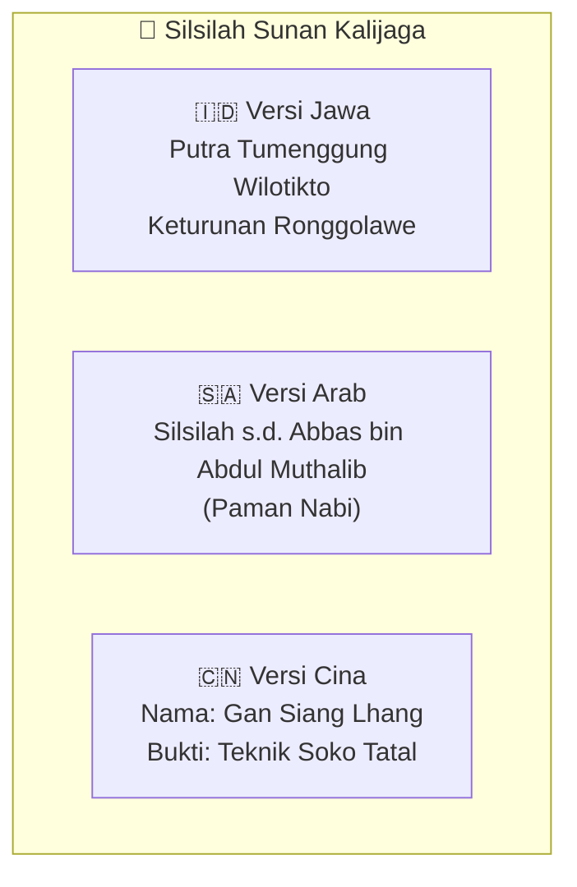
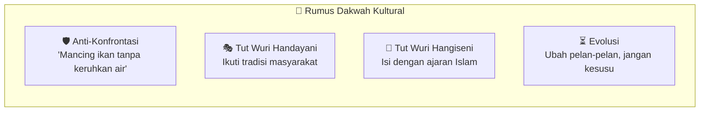
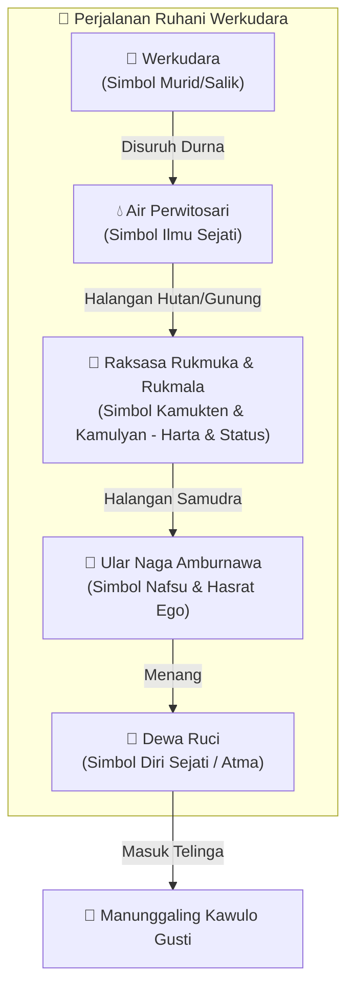
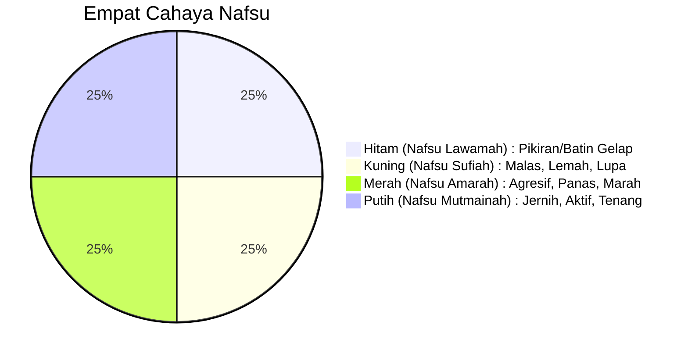

## Pembuka: Nama yang Paling Sering Disebut 🌿

Di antara sembilan wali yang menyebarkan Islam di tanah Jawa, ada satu nama yang selalu muncul pertama kali di bibir orang Jawa ketika membicarakan Islam, kebatinan, dan kearifan lokal: **Sunan Kalijaga**.

Namanya terpatri di universitas Islam, di lagu-lagu anak yang menyimpan filsafat tinggi, di lakon wayang yang membius jutaan penonton, hingga di kidung yang dibaca saat malam tiba. Ia bukan sekadar tokoh sejarah — ia adalah **guru abadi** yang ajarannya terus hidup di lipatan-lipatan budaya Jawa hingga hari ini.

Namun siapa sebenarnya Sunan Kalijaga? Apa yang ia ajarkan? Dan mengapa metode dakwahnya yang dianggap "terlalu lunak" justru berhasil mengislamkan hampir 90% masyarakat Jawa dalam tempo singkat?

<Callout type="abstract" title="Sumber Kajian">
Artikel ini merupakan uraian mendalam dari Ngaji Filsafat 138: Sufi Nusantara — Sunan Kalijaga oleh Dr. Fahruddin Faiz. Fokus utama kajian ini adalah **pemikiran dan ajaran filosofis**, bukan sekadar data sejarah biografis.
</Callout>

---

## Bagian I: Identitas, Silsilah, dan Kontroversi 👤

Sunan Kalijaga hidup di masa transisi besar: dari akhir Majapahit, melalui Demak, Pajang, hingga awal Mataram. Umurnya sangat panjang, menjadikannya saksi sekaligus aktor utama perubahan peradaban Jawa.

Mengenai asal-usulnya, terdapat tiga versi besar yang saling melengkapi:
1.  **Versi Jawa:** Beliau adalah putra Adipati Tuban, Tumenggung Wilotikto. Silsilahnya ditarik ke belakang hingga ke **Ronggolawe**, pahlawan Majapahit.
2.  **Versi Arab:** Silsilahnya ditarik hingga ke paman Nabi, **Abbas bin Abdul Muthalib**.
3.  **Versi Cina:** Disebutkan dalam buku Slamet Mulyono dengan nama **Gan Siang Lhang**. Hal ini didukung oleh penggunaan teknik konstruksi *Soko Tatal* di Masjid Demak yang mirip dengan teknik perkayuan Tiongkok kuno.

---

## Bagian II: Strategi Dakwah "Mengambil Ikan Tanpa Mengeruhkan Air" 🐟

Jasanya yang paling besar adalah pengislaman tanah Jawa secara masif. Dari abad ke-7 hingga ke-12, kuantitas Muslim di Jawa sangat sedikit. Namun setelah munculnya para wali (khususnya Sunan Kalijaga), hampir 90% masyarakat Jawa menjadi Muslim dalam dua abad.

Strategi dakwahnya didasarkan pada dua prinsip utama:
1.  **Tut Wuri Handayani:** Mengikuti tradisi masyarakat dari belakang, tidak menentang secara keras.
2.  **Tut Wuri Hangiseni:** Sambil mengikuti, sedikit demi sedikit diisi dengan ajaran Islam.

Sunan Kalijaga sangat anti-konfrontasi. Beliau percaya bahwa kekerasan hanya akan menghasilkan perlawanan. Beliau menggunakan jalur seni: wayang, gamelan, lagu, hingga baju takwa untuk menyusupkan nilai-nilai tauhid.

---

## Bagian III: Membedah Mitos dengan Semiotika 🔍

Sunan Kalijaga adalah wali yang paling banyak dikelilingi mitos. Dalam kacamata filsafat (menggunakan semiotika Roland Barthes), mitos ini bisa dibaca secara **denotatif** (fakta luar biasa/karamah) maupun **konotatif** (makna simbolis).

Contohnya, mitos Sunan Kalijaga memegang *Mustaka* (kubah) Masjid Demak dengan tangan kiri dan memegang Ka'bah dengan tangan kanan untuk meluruskan kiblat.
- **Secara konotatif:** Ini menunjukkan informasi bahwa Islam gaya Jawa yang dibawa para wali tetap berkiblat lurus ke Ka'bah, tidak menyimpang, meski dibungkus budaya lokal.

---

## Bagian IV: Dewa Ruci — Alegori Manunggaling Kawulo Gusti 🌊

Kisah Dewa Ruci adalah modifikasi pewayangan yang dijadikan sarana dakwah tingkat tinggi. Kisah perjalanan Werkudara (Bima) mencari *Air Perwitosari* (Ilmu Sejati) adalah gambaran perjalanan ruhani seorang sufi.

Bima harus mengalahkan Raksasa (simbol keinginan duniawi/harta) dan Naga (simbol ego) sebelum bisa bertemu Dewa Ruci. Saat Bima masuk ke dalam telinga Dewa Ruci yang kecil, ia justru melihat seluruh alam semesta. Ini adalah simbol bahwa Tuhan tidak jauh, Ia ada di kedalaman batinmu sendiri.

---

## Bagian V: Bekal Mencari Ilmu Sejati — 12 Kualitas Batin 💎

Untuk bisa menaklukkan "naga" nafsu, seorang pencari kebenaran harus memiliki kualitas-kualitas berikut:

1.  **Rilo (Rida):** Ikhlas total. Allah sebagai awal dan akhir.
2.  **Legowo:** Berlapang dada. Apa pun yang terjadi tidak menjadi beban batin.
3.  **Nerimo (Qana'ah):** Menerima apa pun pemberian Tuhan tanpa mengeluh.
4.  **Anurogo:** Rendah hati, tidak merasa besar.
5.  **Eling:** Frekuensi batin yang selalu terhubung dengan Allah (*Dzikir*).
6.  **Santoso:** Konsisten berada di jalan yang benar (*Istiqamah*).
7.  **Gembiro:** Ceria. Orang yang rida pasti ceria, orang stres adalah orang yang tidak rida.
8.  **Rahayu:** Selalu menginginkan keselamatan dan kebaikan bagi sesama.
9.  **Wilujengan:** Menjaga kesehatan fisik sebagai amanah titipan Tuhan.
10. **Marsudi Kaweruh:** Terus menambah wawasan, jangan pernah merasa pintar.
11. **Semedi:** Introspeksi ke dalam batin (Tafakur/Muhasabah).
12. **Ngurang-urangi:** Mengurangi hal-hal duniawi yang tidak esensial (tidak boros energi).

---

## Bagian VI: Empat Cahaya Nafsu 🕯️

Dalam pertemuannya dengan "Dewa Ruci" (atau Nabi Khidir dalam versi *Suluk Linglung*), terlihat empat warna cahaya yang mewakili nafsu manusia:

- **Cahaya Hitam (Lawamah):** Simbol batin yang gelap. Jangan ikuti kata hati jika sedang gelap.
- **Cahaya Kuning (Sufiah):** Simbol malas dan lupa. Ini nafsu yang sering dianggap "manusiawi" padahal penyakit.
- **Cahaya Merah (Amarah):** Simbol agresivitas. Jangan bertindak saat marah, karena pikiran tidak tertata.
- **Cahaya Putih (Mutmainah):** Pikiran dan batin yang jernih. Inilah tujuan utama.

---

## Bagian VII: Topo & Zakat Anggota Badan 🧘‍♂️

Sunan Kalijaga mengajarkan "Diet Rohani" melalui pengendalian tujuh lapisan batin dan anggota badan.

| Anggota Badan | Topo (Ke Dalam) | Zakat (Ke Luar) |
| :--- | :--- | :--- |
| **Mata** | Mengurangi tidur (Melekan) | Tidak tamak pada milik orang lain |
| **Telinga** | Mencegah hawa nafsu | Tidak dengar kata buruk/hoaks |
| **Hidung** | Mengurangi minum | Tidak suka mencela orang lain |
| **Lisan** | Mengurangi makan | Menghindari kata-kata buruk |
| **Aurat** | Menahan syahwat | Menghindari zina |
| **Tangan** | Tidak mencuri | Tidak menyakiti orang lain |
| **Kaki** | Hindari tempat jahat | Introspeksi langkah (Muhasabah) |

---

## Bagian VIII: Kidung Rumekso ing Wengi — Doa Tolak Balak 🌌

Doa ini dibuat dalam bahasa Jawa agar masyarakat paham maksud permintaannya. Sunan Kalijaga memetakan energi para nabi dan sahabat ke dalam tubuh kita:
- **Otak:** Nabi Syis (Ilmu sakral)
- **Ucapan:** Nabi Musa (Kalimullah)
- **Napas:** Nabi Isa (Ruhullah)
- **Nyawa:** Nabi Ibrahim (Vitalitas mencari kebenaran)
- **Mata:** Nabi Muhammad ﷺ (Pedoman benar/salah)

Intinya: **"Dadiao Sariro Tunggal"** — seraplah seluruh kualitas luhur para utusan Tuhan tersebut ke dalam pribadimu.

---

## Bagian IX: Tafsir Filosofis Lir-Ilir dan Gundul-Gundul Pacul 🥥

Dua lagu ini sering dianggap lagu anak-anak, padahal menyimpan ajaran spiritual yang dalam.

### 1. Lir-Ilir (Seruan Bangun)
- **Lir-ilir:** Bangunlah dari tidur spiritual.
- **Tandure wis sumilir:** Kesempatan sudah ada di depan mata.
- **Cah Angon:** Kita semua adalah pemimpin/penggembala diri sendiri.
- **Blimbing:** Simbol 5 rukun Islam atau keutamaan. Meski licin (susah), tetaplah panjat untuk membersihkan diri.
- **Dodot Iro:** Karakter/bajumu sedang robek (rusak karena dosa), jahitlah sekarang mumpung belum terlambat.

### 2. Gundul-Gundul Pacul (Filosofi Pemimpin)
- **Gundul:** Kepala yang melambangkan kehormatan/kekuasaan.
- **Pacul (Papat Kang Cucul):** Empat indra (mata, telinga, hidung, mulut) yang harus dijaga dari nafsu.
- **Gembelengan:** Jika pemimpin sombong dan main-main dengan amanah rakyat.
- **Wakul ngglimpang segane dadi sak latar:** Amanah (bakul nasi) akan tumpah berserakan, rakyat sengsara, kekuasaan hancur sia-sia.

---

## Bagian X: Perumpamaan Luku dan Cangkul 🚜

Bahkan alat tani pun dijadikan sarana filsafat:
- **Luku (Alat Bajak):** Memiliki *Cekelan* (Pedoman), *Pancatan* (Amalan), *Singkal* (Sugih Akal/Kreatif), dan *Racuk* (Mengarah ke Puncak/Allah).
- **Cangkul:** Terdiri dari *Pacul* (Menyingkirkan yang jelek), *Bawak* (Obahing Awak/Berusaha), dan *Doran* (Ndongo marang Pangeran/Berdoa).

---

## Bagian XI: 10 Wejangan Sunan Kalijaga 📜

1.  **Urip Iku Urup:** Hidup harus memberi cahaya bagi sesama.
2.  **Memayu Hayuning Bawono:** Memperindah dunia, memberantas kejahatan.
3.  **Suro Diro Joyoningrat Lebur Dening Pangastuti:** Kejahatan kalah oleh kasih sayang.
4.  **Ngeluruk Tanpo Bolo, Menang Tanpo Ngasorake:** Berjuang tanpa massa, menang tanpa merendahkan.
5.  **Sekti Tanpo Aji, Sugih Tanpo Bondo:** Sakti karena Allah, kaya karena batin merasa cukup.
6.  **Datan Serik Lamun Ketaman, Datan Susah Lamun Kelangan:** Tidak sakit hati dihina, tidak sedih kehilangan.
7.  **Ojo Ngumunan, Ojo Getunan, Ojo Kagetan, Ojo Aleman:** Jangan gampang heran, menyesal, kaget, atau manja.
8.  **Ojo Ketungkul Marang Kalungguhan, Kadonyan lan Kamurahan:** Jangan diperbudak jabatan dan kesenangan dunia.
9.  **Ojo Keminter Mundak Keblinger, Ojo Cidro Mundak Ciloko:** Jangan sok pintar dan jangan khianat.
10. **Ojo Adigang, Adigung, Adiguno:** Jangan sombong dengan kekuatan, kedudukan, atau kepandaian.

---

## Penutup: Ngeli Ananging Ora Keli 🌊

Ajaran terakhir yang paling relevan untuk zaman modern adalah: **"Anglaras ilining banyu, ngeli ananging ora keli."**
- Ikutilah arus zaman (pakai teknologinya, pahami logikanya).
- Tapi jangan sampai hanyut/tenggelam (pertahankan prinsip dan imanmu).

Sunan Kalijaga mengajarkan kita untuk menjadi Muslim yang luwes namun kokoh. Beliau membuktikan bahwa Islam bisa menyatu dengan budaya tanpa harus kehilangan jati dirinya.

---

*Artikel ini berkaitan erat dengan <WikiLink to="ngaji-filsafat-221-nizami-layla-majnun-alegori-cinta-ilahiah" label="Ngaji Filsafat 221: Layla Majnun — Alegori Cinta Ilahiah" /> yang membahas cinta sebagai jalan menuju Tuhan, serta <WikiLink to="ngaji-filsafat-379-socrates-mengenali-diri" label="Ngaji Filsafat 379: Socrates — Mengenali Diri" /> yang memiliki kemiripan dalam konsep Gnothi Seauton (Kenalilah Dirimu).*
