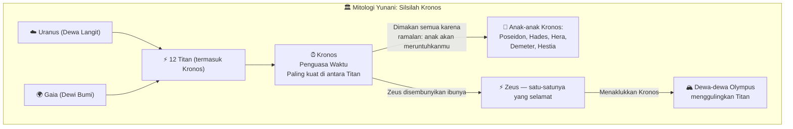
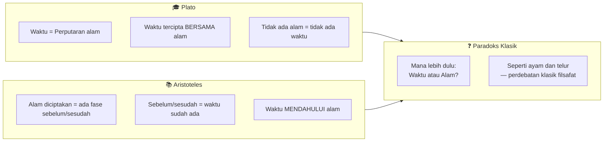
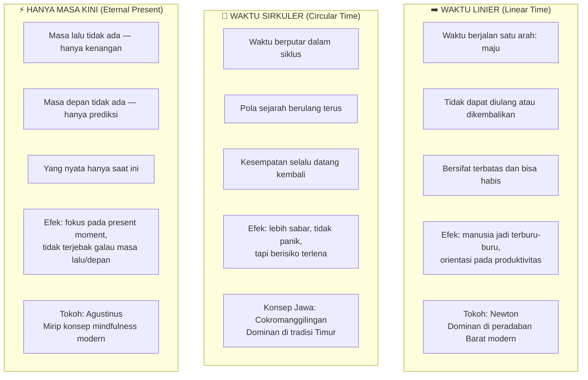
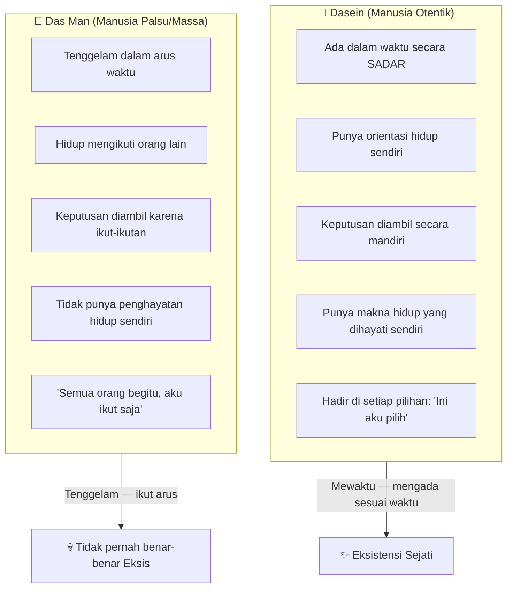
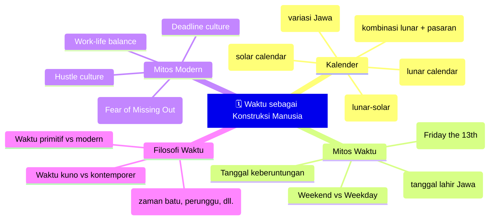
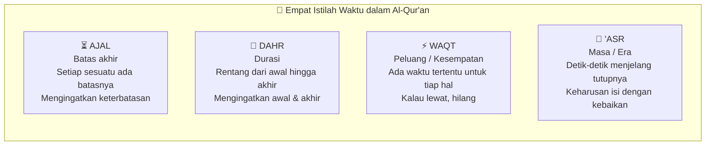
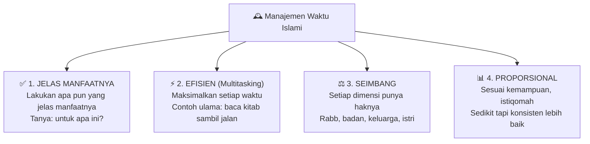
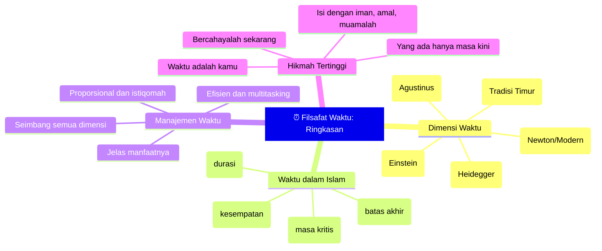

## Pembuka: Pertanyaan yang Membuat Kita Terdiam 🤔

Ada sebuah kalimat dari **Aurelius Augustinus** — filsuf besar abad ke-4 Masehi yang lebih dikenal sebagai **Santo Agustinus** — yang sudah berusia lebih dari 1.600 tahun, namun terasa seperti baru saja diucapkan:

> *"Apakah waktu itu? Jika tak seorang pun mengajukan pertanyaan, aku tahu. Tapi jika seseorang mengajukan pertanyaan dan aku mau memberi penjelasan, aku tidak tahu lagi."*

Coba rasakan kalimat ini sejenak.

Kita semua "tahu" apa itu waktu. Kita hidup di dalamnya setiap detik. Kita mengaturnya, meratapi kekurangannya, bersyukur atas kehadirannya. Ketika ada yang bertanya "jam berapa sekarang?" kita menjawab tanpa berpikir panjang. Ketika ada yang berkata "waktu kita terbatas," kita mengangguk-angguk setuju.

Tapi ketika seseorang benar-benar berhenti dan bertanya: **"Apa sebenarnya waktu itu?"** — tiba-tiba kita kehilangan kata-kata.

Inilah yang dipelajari dalam **Ngaji Filsafat 219** — sebuah kajian santai namun mendalam tentang *filsafat waktu*, yang menjelajahi bagaimana para pemikir terbesar dalam sejarah manusia bergulat dengan pertanyaan yang tampaknya sederhana ini.

<Callout type="abstract" title="Sumber Kajian">
Artikel ini merupakan ringkasan mendalam dari Ngaji Filsafat 219: Philosophy of Time (Filsafat Waktu). Video aslinya tersedia di: [Ngaji Filsafat 219 — Filsafat Waktu](https://www.youtube.com/watch?v=00cCUX229ug).
</Callout>

---

## Bagian I: Mengapa Waktu Sulit Didefinisikan — Pelajaran dari Agustinus 🌀

Masalah yang Agustinus ungkapkan lebih dari 16 abad lalu adalah masalah yang sangat akrab bagi siapa pun yang pernah belajar **mantiq** (*logika formal*) atau *ilmu definisi*.

Dalam tradisi ilmu klasik, cabang pertama yang dipelajari adalah **ta'rif** (*definisi*). Dan mendefinisikan sesuatu bukan hal yang mudah.

Tugas paling mendasar filsafat adalah **clarifying concepts** — *memperjelas konsep*. Masalahnya, kita sering berdebat, berdiskusi, bahkan bertengkar tentang sesuatu yang konsepnya sendiri belum kita sepakati — atau bahkan belum kita pahami dengan baik.

Kita teriak-teriak pro atau anti sesuatu, padahal ketika ditanya "apa itu yang kamu maksudkan?" — kita diam.

Dengan waktu, masalahnya bahkan lebih dalam: **waktu adalah sesuatu yang kita rasakan setiap saat, namun justru karena terlalu dekat itulah kita kesulitan melihatnya dengan jernih**.

Seperti ikan yang tidak menyadari keberadaan air karena ia hidup di dalamnya.

---

## Bagian II: Waktu dalam Mitos — Kronos, Titan Pemakan Anak 🐉

Sebelum filsafat, ada mitos. Dan dalam mitologi Yunani, waktu dipersonifikasikan sebagai **Kronos** (*Cronus*) — salah satu dari dua belas *Titan*, generasi dewa-dewa sebelum Olympus.

Ada ramalan yang menghantui Kronos: **anaknyalah yang akan meruntuhkan kekuasaannya**. Maka demi menghindar dari takdir, Kronos memakan semua anaknya — satu per satu — kecuali Zeus yang berhasil disembunyikan oleh ibunya.

Dan ramalan itu terbukti. Zeus bertumbuh, menaklukkan Kronos, dan mendirikan dinasti dewa-dewa Olympus yang kemudian menjadi pusat mitologi Yunani.

**Makna mitologisnya kuat sekali:**

Kronos — waktu — adalah yang melahirkan segalanya. Tapi sesuatu yang dilahirkan oleh waktu pada akhirnya akan ditelan kembali olehnya. Manusia lahir dalam waktu, hidup dalam waktu, dan mati dalam waktu.

Waktu adalah ibumu sekaligus pemangsamu.

<Callout type="info" title="Kronos dan Kronologi">
Nama Kronos inilah yang kemudian menjadi akar kata untuk banyak istilah modern tentang waktu: *chronology* (kronologi — urutan kejadian dalam waktu), *chronic* (kronis — berlangsung lama), *synchronize* (sinkronisasi — menyesuaikan waktu), dan *anachronism* (anakronisme — sesuatu yang salah zamannya).
</Callout>

### Waktu dalam Puisi: Kahlil Gibran

Gibran Khalil Gibran, penyair Lebanon yang terkenal lewat *The Prophet* (*Sang Nabi*), juga bergulat dengan waktu. Dalam novelnya, ketika seorang ahli astronomi bertanya tentang waktu kepada tokoh utama Almustafa, jawabannya sangat puitis:

> *"Engkau ingin mengukur sang waktu yang tiada ukur dan tanpa ukuran... Bukankah sang waktu itu sebagaimana hakikat cinta — tiada mengenal batas ukuran serta tak dapat dibagi?"*

Waktu seperti cinta: tidak bisa diukur dari ujung ke ujung, tidak bisa dibagi-bagi secara merata tanpa kehilangan sesuatu yang esensial, dan selalu mengalir melampaui semua upaya kita untuk menatanya.

---

## Bagian III: Waktu dalam Tradisi Filsafat — Plato, Aristoteles, Newton, Einstein 🔭

### Plato: Waktu Lahir Bersama Alam

Menurut **Plato**, waktu **diciptakan bersama-sama dengan alam semesta** — *co-eternal* (*sama-sama abadi*) dengan dunia materi. Waktu ada karena ada perputaran — perputaran bintang-bintang, rotasi bumi, revolusi planet. Tanpa gerak alam, tidak ada waktu.

Konsep Plato tentang waktu sangat intuitif: waktu adalah "citra bergerak dari kekekalan" (*moving image of eternity*) — cara semesta yang bersifat sementara meniru yang sempurna dan kekal.

### Aristoteles: Waktu Mendahului Alam

Muridnya, **Aristoteles**, tidak setuju. Ia melihat sebuah kelemahan logis dalam argumen Plato:

Jika alam semesta *diciptakan* — artinya ada kondisi "belum ada" sebelum ada — maka ada fase "sebelum ada alam" dan "setelah ada alam." Dan perbedaan antara "sebelum" dan "setelah" itu sendiri sudah merupakan waktu.

**Berarti waktu harus sudah ada *sebelum* alam semesta tercipta.**

Tapi ini melahirkan paradoks baru yang memutar kepala: kalau waktu ada sebelum alam, waktu itu seperti apa? Dan sebelum waktu itu sendiri ada apa?

Perdebatan Plato-Aristoteles ini bukan hanya obrolan akademik kosong. Ia kemudian masuk ke perdebatan besar dalam teologi Islam — antara **Al-Ghazali** dan **Ibnu Rusyd** (*Averroes*) — tentang kebaruan alam (*huduts al-alam*). Apakah alam semesta diciptakan dari ketiadaan (*ex nihilo*), atau sudah ada sejak kekal? Dan jika diciptakan, kapan tepatnya Allah menciptakan waktu?

### Newton: Waktu yang Mutlak dan Absolut

**Sir Isaac Newton** membawa pandangan yang lebih modern dan "ilmiah": **waktu bersifat mutlak** (*absolute*), **independen** dari segala sesuatu, dan mengalir dengan kecepatan yang sama di seluruh alam semesta.

Bagi Newton, waktu adalah panggung yang netral di mana semua peristiwa fisik terjadi. Tidak peduli apa yang terjadi di dalamnya, waktu terus berjalan dengan ritme yang tetap dan konsisten.

Dari sini lahir beberapa keyakinan dasar tentang waktu yang kita pegang sampai hari ini:

- ⏩ Waktu berjalan **linear** — maju terus, tidak bisa mundur
- ⚠️ Waktu bersifat **terbatas** — sekali terlewat, tidak bisa kembali
- ⏰ Waktu adalah **sumber daya langka** — *Time is money*, waktu adalah uang

Inilah yang melahirkan "mentalitas modern" tentang waktu: efisiensi, produktivitas, *time management*, dan perasaan selalu keburu-buru.

### Einstein: Relativitas Waktu

**Albert Einstein** mengguncang semua asumsi Newtonian dengan **Teori Relativitas**-nya (*Theory of Relativity*). Waktu, bagi Einstein, bukanlah panggung netral yang absolut — ia **relatif** terhadap kecepatan dan gravitasi.

Ketika wartawan atau orang awam meminta Einstein menjelaskan relativitas, ia sering menjawab dengan cara yang lebih mudah dipahami:

> *"Letakkan tanganmu di atas kompor panas selama satu menit, maka rasanya seperti satu jam. Lalu duduklah dengan gadis cantik selama satu jam, maka rasanya seperti satu menit. Itulah relativitas."*

Secara saintifik, Einstein membuktikan bahwa jam yang bergerak lebih lambat dari jam yang diam (*time dilation* — pelebaran waktu). Semakin cepat Anda bergerak mendekati kecepatan cahaya, semakin lambat waktu berlalu bagi Anda dibanding orang yang diam.

<Callout type="warning" title="Perdebatan yang Belum Selesai">
Perdebatan tentang hakikat waktu — apakah ia objektif, subjektif, sirkuler, linier, atau relatif — belum selesai sampai hari ini. Fisika kuantum dan kosmologi modern terus menghadirkan pertanyaan-pertanyaan baru yang membuat waktu semakin misterius, bukan semakin jelas.
</Callout>

---

## Bagian IV: Tiga Teori Besar tentang Sifat Waktu ⚙️

Dari seluruh tradisi pemikiran, ada tiga pandangan besar tentang bagaimana waktu bergerak:

### 1️⃣ Waktu Linier — Senjata Orang Produktif

Waktu linier adalah ideologi waktu yang mendominasi peradaban modern. Waktu berjalan ke depan, tidak pernah mundur, dan setiap detik yang terlewat hilang selamanya.

Ini melahirkan semua ungkapan yang kita kenal: *"waktu adalah uang," "jangan buang-buang waktu," "kesempatan tidak datang dua kali."*

Jika Anda sedang berjuang mengejar target, ingin sukses cepat, atau sedang dalam mode sprint — ideologi waktu linier adalah motivasi yang tepat.

### 2️⃣ Waktu Sirkuler — Kebijaksanaan yang Menyeimbangkan

Waktu sirkuler adalah pandangan yang lebih banyak ditemukan dalam tradisi Timur, termasuk budaya Jawa dengan konsep **Cokromanggilingan** (*roda yang berputar terus menggilas*).

Cokromanggilingan menggambarkan hidup seperti roda — kadang di atas, kadang di bawah. Yang sekarang di bawah, suatu saat akan di atas. Yang sekarang di atas, harus waspada karena roda terus berputar.

Dan dalam pandangan sirkuler, **sejarah selalu berulang**. Perang, perdamaian, kejayaan, kehancuran — semuanya datang dan pergi dalam pola yang bisa dipelajari.

Implikasi praktisnya: **jangan putus asa ketika gagal, karena siklus baru selalu datang**. Tidak lolos CPNS kali ini? Ada tes lagi. Usaha bangkrut? Ada kesempatan lagi. Waktu sirkuler mengajarkan kesabaran dan ketahanan.

<Callout type="tip" title="Cokromanggilingan dan Triwikromo">
Dalam falsafah Jawa, kunci untuk menaklukkan Cokromanggilingan — roda naik-turunnya kehidupan — adalah **Triwikromo**: menguasai tiga dunia waktu sekaligus. Masa lalu (lewat kebijaksanaan dan refleksi), masa kini (lewat fokus dan tindakan), dan masa depan (lewat perencanaan dan visi). Orang yang menguasai ketiganya tidak akan guncang ketika roda berada di bawah, dan tidak akan lupa diri ketika berada di atas.
</Callout>

### 3️⃣ Hanya Masa Kini — Kebijaksanaan Agustinus

Ini adalah teori paling kontemplatif dan paradoksal dari Agustinus.

Agustinus berpendapat: **masa lalu tidak benar-benar ada, dan masa depan tidak benar-benar ada. Yang ada hanyalah masa kini.**

Bukan berarti kemarin tidak pernah terjadi. Tapi kemarin *sekarang* hanya hadir sebagai **kenangan** (*memory*) — bukan sebagai realita yang sedang berlangsung. Dan masa depan *sekarang* hanya hadir sebagai **perkiraan** (*expectation*) — bukan sebagai sesuatu yang nyata-nyata ada.

Maka yang sejati dan nyata hanya satu: **masa kini yang sedang kamu jalani sekarang**.

Implikasinya sangat kuat secara psikologis:

- Kamu yang **galau karena masa lalu** sedang bersedih tentang sesuatu yang *tidak ada*. Ia sudah hilang.
- Kamu yang **cemas tentang masa depan** sedang menderita tentang sesuatu yang *belum tentu ada*. Ia mungkin tidak pernah terjadi.
- **Satu-satunya yang nyata adalah sekarang.** Fokuslah di sini.

---

## Bagian V: Waktu Objektif vs Waktu Subjektif — Dua Dimensi yang Berbeda ⏱️

Salah satu kontribusi terpenting Agustinus dalam filsafat waktu adalah pembedaan antara **waktu objektif** (*objective time*) dan **waktu subjektif** (*subjective time*).

```mermaid
flowchart LR
    subgraph OBJ["📏 WAKTU OBJEKTIF"]
        O1["Bisa diukur dengan instrumen"]
        O2["Sama bagi semua orang"]
        O3["Kalender, jam, detik, menit"]
        O4["Tidak terpengaruh perasaan"]
        EX_O["Contoh: Ceramah berlangsung<br/>tepat 45 menit"]
    end

    subgraph SUBJ["💭 WAKTU SUBJEKTIF"]
        S1["Dirasakan berbeda-beda"]
        S2["Dipengaruhi emosi dan konteks"]
        S3["'Cepat' atau 'Lambat' terasa berbeda"]
        S4["Bersumber dari persepsi mental"]
        EX_S["Contoh: 45 menit itu terasa<br/>sangat panjang (jika bosan)<br/>atau sangat singkat (jika asyik)"]
    end

    OBJ <-->|"Realita yang sama,<br/>pengalaman berbeda"| SUBJ
```

### Ilustrasi Waktu Subjektif dalam Kehidupan Sehari-hari

🚗 **Macet di jalan** — 30 menit terasa seperti 2 jam
🍽️ **Ditraktir makan dengan teman yang menyenangkan** — 2 jam terasa seperti 30 menit
📝 **Ujian yang tidak bisa dijawab** — 2 jam terasa seperti 10 menit (terlalu cepat!)
😴 **Ceramah yang membosankan** — 20 menit terasa seperti setengah hari
❤️ **Bersama orang yang dicintai** — waktu selalu terasa terlalu singkat

Semua ini adalah **waktu yang sama secara objektif** — jam tetap berdetak dengan kecepatan yang sama. Tapi *pengalaman* waktu yang dirasakan bisa sangat berbeda.

### Contoh Ekstrem: Ashabul Kahfi

Dalam Al-Qur'an, kisah **Ashabul Kahfi** (*Pemuda-pemuda Gua*) memberikan ilustrasi dramatis tentang perbedaan waktu objektif dan subjektif.

Mereka tidur di dalam gua selama **309 tahun** — itulah waktu objektifnya. Tapi secara subjektif, ketika mereka terbangun, pengalaman mereka hanyalah seperti **tidur semalam biasa**.

Bayangkan Anda tertidur hari ini dan terbangun 300 tahun kemudian — dunia yang Anda kenal sudah tidak ada. Negara berubah, bahasa berubah, teknologi berubah total. Tapi bagi Anda, rasanya seperti baru saja menutup mata.

Dalam terminologi **Ibnu Arabi** (*mistikus besar Islam, 1165-1240 M*), ada dua dimensi waktu:
- **Al-waqtu al-thabi'i** (*waktu alami/objektif*)
- **Al-waqtu fawqa al-thabi'i** (*waktu di atas natural/supranatural*)

Isra Mi'raj Nabi Muhammad ﷺ adalah contoh sempurna: secara subjektif, beliau menjalani perjalanan yang luar biasa panjang — dari Mekah ke Yerusalem, naik ke langit-langit, bertemu para Nabi. Tapi secara objektif, perjalanan itu terjadi dalam waktu yang sangat singkat.

---

## Bagian VI: Waktu Eksistensial — Heidegger dan Manusia yang Otentik 🧭

Filsuf Jerman **Martin Heidegger** (*1889-1976*), dalam mahakarya-nya **Being and Time** (*Sein und Zeit*, artinya *Ada dan Waktu*), membawa diskusi tentang waktu ke level yang lebih dalam lagi: level **eksistensi manusia** (*eksistensial* = berkaitan dengan keberadaan/eksistensi manusia).

Heidegger menggunakan dua istilah kunci dalam bahasa Jerman:
- **Innerzeitigkeit** (*keberadaan dalam waktu*) — semua makhluk ada dalam waktu
- **Zeitlichkeit** (*temporalitas*) — cara khas manusia mengada dalam waktu

Bagi Heidegger, semua benda fisik ada *dalam* waktu — batu, pohon, bintang, semuanya. Tapi manusia memiliki hubungan yang berbeda dan unik dengan waktu karena manusia **menyadari** keberadaannya dalam waktu dan bisa memilih bagaimana ia mengisi waktu itu.

### Dasein vs Das Man: Manusia Otentik vs Manusia Palsu

Menurut Heidegger, banyak manusia yang tidak pernah benar-benar *eksis* — mereka hanya *tenggelam* dalam arus waktu tanpa pernah membuat pilihan yang benar-benar mereka hayati sendiri.

Lahir tidak pilih. Sekolah dipilihkan orang tua. Agama dipilihkan orang tua. Kuliah mungkin juga dipilihkan. Pekerjaan mengikuti tren. Pasangan mungkin juga karena tekanan sosial.

Orang seperti ini hidup dalam waktu tapi tidak pernah **mewaktu** — tidak pernah mengada secara otentik sesuai dengan siapa dirinya sebenarnya.

**Mewaktu** berarti: *tampillah dalam waktu sebagai dirimu yang sejati*. Buatlah keputusan-keputusan hidupmu bukan karena ikut-ikutan, tapi karena itu benar-benar pilihanmu — pilihan yang kamu pertanggungjawabkan.

<Callout type="important" title="Kritik Heidegger yang Relevan Hari Ini">
Di era media sosial, tekanan untuk "ikut arus" lebih kuat dari sebelumnya. Apa yang kamu makan, pakai, tonton, dan percayai sering kali lebih ditentukan oleh algoritma dan tekanan sosial daripada oleh penghayatan diri yang sejati. Pertanyaan Heidegger menjadi lebih mendesak: apakah pilihan-pilihanmu benar-benar *milikmu*?
</Callout>

---

## Bagian VII: Waktu sebagai Makna dan Imajinasi — Kalender, Mitos, dan Konstruksi Sosial 📅

Ada satu dimensi waktu lagi yang sering luput dari perhatian: **waktu sebagai produk imajinasi dan kesepakatan manusia**.

Matahari terbit dan terbenam — itu objektif. Bumi mengelilingi matahari dalam 365 hari — itu juga objektif. Tapi **bagaimana kita membagi dan menamai satuan-satuan itu?** Itu adalah **konstruksi manusia**.

Seminggu ada tujuh hari — itu bukan hukum alam. Orang Jawa punya sistem *pasar* yang seminggu ada lima hari (*Pon, Wage, Kliwon, Legi, Pahing*). Kalender Masehi, Hijriah, Jawa, Imlek — semuanya adalah sistem yang berbeda-beda untuk "membingkai" pergerakan alam yang sama.

### Mitos Weekend — Produk Masyarakat Kapital?

Satu mitos waktu yang sangat relevan hari ini adalah **weekend** (*akhir pekan*). Mengapa orang begitu mendambakan Jumat malam dan Sabtu-Minggu?

Filsuf **Herbert Marcuse** dalam karyanya **One-Dimensional Man** (*Manusia Satu Dimensi*) memberikan analisis tajam: logika *weekend* adalah produk dari **masyarakat kapitalis** yang memaksa orang bekerja tanpa *passion* (*gairah*), hanya untuk memenuhi target ekonomi.

Ketika pekerjaan bukan eksistensi tapi hanya kewajiban — maka *weekend* menjadi kompensasi. Liburan menjadi pelarian dari realita pekerjaan yang menyiksa.

Sebaliknya, **Imam Ali bin Abi Thalib** RA menggambarkan kondisi ideal yang berbeda:

> *"Kerjaku adalah rekreasiku, rekreasiku adalah kerjaku."*

Orang yang bekerja sesuai *passion*, yang menemukan makna dalam pekerjaannya, tidak butuh pelarian dari kerjanya. Ia menjalani hidupnya sebagai satu kesatuan yang utuh — bukan sebagai pertarungan antara "waktu kerja" yang menyiksa dan "waktu bebas" yang didambakan.

---

## Bagian VIII: Waktu dalam Perspektif Islam — Empat Istilah Kunci 🌙

Al-Qur'an dan tradisi Islam memiliki kosakata yang kaya dan nuanced (*bernuansa*) untuk waktu. Ada empat istilah utama yang perlu dipahami:

### ⏳ Ajal — Batas Akhir yang Pasti

**Ajal** (*ajaluhu marun* — sudah tiba ajalnya) berarti batas akhir yang tidak bisa ditawar dan tidak bisa diundur.

Pelajaran dari ajal: **segala sesuatu ada batasnya**. Kesedihan ada batasnya. Kesenangan ada batasnya. Ujian ada batasnya. Kekuasaan ada batasnya. Bahkan hidup ini sendiri ada batasnya.

Ketika sedang dalam kesulitan, ingatlah: kesulitanmu ada ajalnya. Ketika sedang dalam kesenangan, ingatlah: kesenanganmu ada ajalnya — jangan terlena dan lupa diri.

### 🌊 Dahr — Durasi Keberadaan

**Dahr** berarti durasi — rentang waktu dari awal hingga akhir suatu keberadaan. Alam semesta ini ada durasinya. Manusia ada durasinya. Peradaban ada durasinya.

Kalau *ajal* menekankan pada *batas akhir*, maka *dahr* menekankan pada *keseluruhan rentang* — dari awal sampai akhir.

Pelajarannya: sadari bahwa kamu adalah makhluk yang berawal dan berakhir. Hanya Allah yang tidak berawal dan tidak berakhir. Kesadaranini melahirkan **tawadhu'** (*kerendahan hati*) yang sejati.

### ⚡ Waqt — Kesempatan yang Bisa Habis

**Waqt** (*waktu*) dalam konteks Al-Qur'an biasanya bermakna **kesempatan** atau **peluang** yang ada dalam rentang waktu tertentu. Contoh paling jelas adalah waktu-waktu shalat: *"Innassholata kanat 'alal mu'minina kitaaban mawquuta"* — shalat adalah kewajiban yang terikat pada waktu-waktu tertentu.

Begitu waktu subuh habis, kamu kehilangan *waqt* untuk shalat subuh. Waktu itu tidak kembali.

Maka *waqt* mengingatkan: **ada kesempatan-kesempatan yang terikat pada momen tertentu**. Lewat momen itu, kesempatan hilang.

### 🌅 'Asr — Masa yang Mengingatkan Kefanaan

***Asr*** adalah nama salah satu shalat, tapi juga berarti *masa* atau *era*. Allah bersumpah dengan *al-'Asr* di awal Surah Al-'Asr — dan ini bukan kebetulan.

'Asr adalah waktu sore — saat siang hampir habis dan malam akan segera datang. Ini adalah metafora untuk kondisi manusia: kita selalu berada di ambang batas, selalu di *asr*-nya sesuatu — hampir habis belajar, hampir habis usia muda, hampir habis usia hidup.

Dan di situlah urgensinya: **bergeraklah sekarang, sebelum malam datang**.

<Callout type="quote" title="Surah Al-'Asr: Resep Anti-Rugi">
وَالْعَصْرِ ۙ إِنَّ الْإِنسَانَ لَفِي خُسْرٍ ۙ إِلَّا الَّذِينَ آمَنُوا وَعَمِلُوا الصَّالِحَاتِ وَتَوَاصَوْا بِالْحَقِّ وَتَوَاصَوْا بِالصَّبْرِ

*"Demi masa. Sesungguhnya manusia benar-benar dalam kerugian, kecuali orang-orang yang beriman, beramal saleh, saling menasihati dalam kebenaran, dan saling menasihati dalam kesabaran."*

Ini adalah "resep anti-rugi" yang paling ringkas dan komprehensif: Iman (kesadaran akan keterbatasan diri), Amal Saleh (tindakan nyata), dan Muamalah (hubungan dengan sesama manusia yang diisi dengan kejujuran dan kesabaran).
</Callout>

---

## Bagian IX: Nasihat Para Ulama tentang Waktu 💎

### Imam Syafi'i — Waktu adalah Pedang

*"Al-waqtu kassayf, in lam taqtha'hu qatha'ak."*

**"Waktu ibarat pedang. Kalau engkau tidak menggunakannya untuk memotong, maka ia akan memotongmu."**

Ini adalah salah satu aforisme (*ungkapan pendek bermakna dalam*) paling terkenal tentang waktu dalam tradisi Islam. Tapi sering hanya dikutip separuh. Kelanjutannya sama pentingnya:

*"Wa nafsuka in lam tushghalha bil haqqi shaghalaka bil bathil."*

**"Dan jiwamu, jika tidak kamu sibukkan dengan kebenaran, maka ia akan menyibukkanmu dengan kebatilan."**

Artinya: waktu yang tidak diisi dengan sesuatu yang bermakna tidak berarti kosong — ia akan *diisi sendiri* oleh hal-hal yang sia-sia dan merusak.

### Ibnu Mas'ud — Penyesalan yang Paling Dalam

*"Tiada yang pernah kusesali selain keadaan ketika matahari tenggelam — umurku berkurang, tapi amalku tidak bertambah."*

**Abdullah bin Mas'ud** (*sahabat Nabi yang terkenal dengan kecerdasan dan kezuhudannya*) mengungkapkan penyesalan yang sangat spesifik: bukan tentang kesalahan yang ia lakukan, tapi tentang waktu yang berlalu tanpa pengisian yang bermakna.

### Hasan Al-Bashri — Tanda Allah Berpaling

*"Di antara tanda Allah berpaling dari seorang hamba adalah Allah menjadikannya sibuk dalam hal-hal yang sia-sia sebagai tanda mencuekimu."*

**Hasan Al-Bashri** (*ulama tabi'in yang terkenal dengan kearifan dan kezuhudannya*) memberi peringatan keras: jika hidupmu terasa penuh dengan kesibukan namun tidak ada satupun yang benar-benar bermakna — waspadai. Itu mungkin pertanda bahwa kamu sedang dalam kondisi yang jauh dari Allah.

---

## Bagian X: Manajemen Waktu — Prinsip dari Tradisi Keilmuan Islam 📋

Dari seluruh diskusi filosofis dan teologis di atas, bagaimana kita menerapkan pemahaman tentang waktu dalam kehidupan nyata?

Ada empat prinsip manajemen waktu yang diambil dari tradisi keilmuan Islam:

### ✅ Prinsip 1: Jelas Manfaatnya

*"Nikmatani maghbunun fiihima katsiirun minan naas: assihhah wal faraagh"* — **Ada dua nikmat yang banyak orang tertipu di situ: waktu luang dan kesehatan.** (HR. Bukhari)

Sebelum melakukan apa pun, tanyakan: *manfaatnya apa?* Bukan berarti semua hal harus produktif secara ekonomi — bahkan istirahat dan bermain punya manfaat nyata untuk kesehatan mental dan fisik. Yang berbahaya adalah melakukan sesuatu tanpa pernah tahu mengapa.

### ⚡ Prinsip 2: Efisien dan Multitasking

Para ulama klasik memberikan teladan luar biasa dalam hal ini:

- **Khatib Al-Baghdadi** (*ulama hadis*): ke mana-mana selalu membawa buku untuk dibaca sambil berjalan
- **Imam Sulaim Ar-Razi** (*ulama Syafi'iyah*): keluar rumah untuk urusan singkat, sambil berhasil mengkhatamkan satu juz Al-Qur'an
- **Abul Barakat** (*kakek Ibnu Taimiyah*): minta saudaranya membacakan buku keras-keras di luar kamar mandi agar ia tetap bisa mendapatkan ilmu saat di dalam

Tentu esensinya bukan soal kamar mandi, tapi soal **kesadaran bahwa setiap momen bisa diisi dengan sesuatu yang bermakna** — sambil menunggu, sambil dalam perjalanan, sambil melakukan rutinitas.

### ⚖️ Prinsip 3: Seimbang

*"Inna lirabbika 'alaika haqqan, wa inna libadanika 'alaika haqqan, wa inna li ahlika 'alaika haqqan..."*

**"Sesungguhnya Tuhanmu punya haknya, badanmu punya haknya, keluargamu punya haknya... berikan haknya masing-masing sesuai kadarnya."** (HR. Bukhari)

Manajemen waktu yang baik bukan berarti memaksimalkan satu dimensi sambil mengorbankan yang lain. Spiritualitas, kesehatan fisik, hubungan keluarga, dan produktivitas kerja — semuanya membutuhkan perhatian.

### 📊 Prinsip 4: Proporsional dan Istiqomah

*"Inna ahabbal a'mali ilallahi adwamuha wa in qalla"* — **"Sesungguhnya amal yang paling dicintai Allah adalah yang paling konsisten, meskipun sedikit."** (HR. Muslim)

Jangan memulai dengan target yang terlalu besar sehingga cepat kehabisan semangat. Mulai kecil, tapi konsisten. Lima halaman buku sehari yang rutin jauh lebih berharga dari lima puluh halaman sekali-sekali lalu berhenti sebulan.

---

## Bagian XI: Bintang-Bintang Hawking dan Pelajaran Spiritualnya 🌟

Stephen Hawking, fisikawan jenius dari Cambridge, mengembangkan **teori kerucut cahaya** (*light cone theory*) tentang masa lalu dan masa depan.

Salah satu implikasinya yang paling menakjubkan: **bintang-bintang yang kita lihat di langit malam ini bukan gambar bintang yang sedang ada sekarang — tapi gambar bintang seperti jutaan tahun yang lalu**.

Cahaya membutuhkan waktu untuk melakukan perjalanan. Bintang yang jaraknya satu juta tahun cahaya dari bumi — cahayanya yang sampai ke mata kita sekarang adalah cahaya yang dikirimkan satu juta tahun lalu. Bintang itu sendiri mungkin sudah tidak ada.

**Secara spiritual, ini bisa dimaknai:**

Apa yang kamu lakukan hari ini — kebaikan yang kamu tanam, ilmu yang kamu sebarkan, karya yang kamu hasilkan — **efeknya akan terus bersinar jauh ke masa depan, bahkan setelah kamu tiada**.

Seperti bintang yang sudah padam tapi cahayanya masih menerangi alam semesta jutaan tahun kemudian — *bercahayalah seterang-terangnya sekarang*. Meski kamu tidak ada nanti, cahayamu akan dinikmati oleh orang-orang setelahmu.

<Callout type="success" title="Pesan untuk Generasi Ini">
Jangan meremehkan apa yang kamu lakukan hari ini. Sebuah tulisan yang kamu tulis, kata-kata baik yang kamu ucapkan, ilmu yang kamu ajarkan — efeknya bisa jauh melampaui hidupmu. Seperti cahaya bintang yang terus melakukan perjalanan jutaan tahun setelah bintangnya sendiri padam.
</Callout>

---

## Penutup: Waktu adalah Kamu 🦋

Di akhir semua perdebatan filsafat ini — dari Plato dan Aristoteles yang berdebat tentang mana yang lebih dulu, alam atau waktu; dari Newton yang meyakini waktu mutlak; dari Einstein yang membuktikan waktu relatif; dari Agustinus yang menegaskan hanya masa kini yang ada; dari Heidegger yang mengajak kita mewaktu secara otentik — ada satu kesimpulan sederhana namun mendalam:

**Waktu adalah kamu.**

Agustinus sudah mengatakannya: ukuran waktu bukan pada gerakan benda-benda di luar sana. Ukurannya ada di dalam dirimu — dalam cara kamu mengingat masa lalu, menghayati masa kini, dan membayangkan masa depan.

Waktu yang kamu miliki adalah waktu yang sama dengan yang dimiliki oleh Nabi Muhammad ﷺ, Imam Syafi'i, Ibnu Sina, Newton, Einstein — 24 jam sehari. Tidak lebih, tidak kurang.

Pertanyaannya bukan "apakah kamu punya cukup waktu?"

Pertanyaannya adalah: **siapa kamu dalam waktu yang kamu miliki?**

---

*Artikel ini adalah bagian dari seri Ngaji Filsafat yang mengkaji gagasan-gagasan filsafat besar dalam bahasa yang mudah dipahami. Artikel terkait: <WikiLink to="ngaji-filsafat-221-nizami-layla-majnun-alegori-cinta-ilahiah" label="Ngaji Filsafat 221: Layla Majnun — Alegori Cinta Ilahiah" />*
