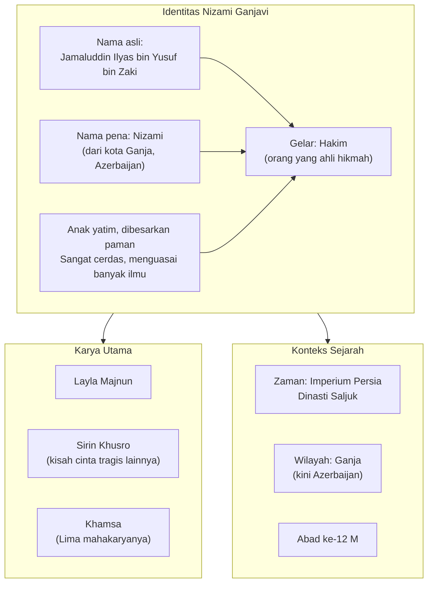
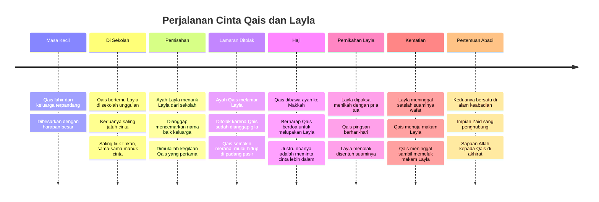
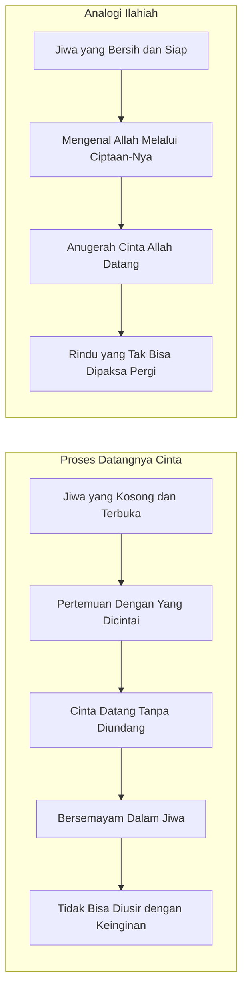
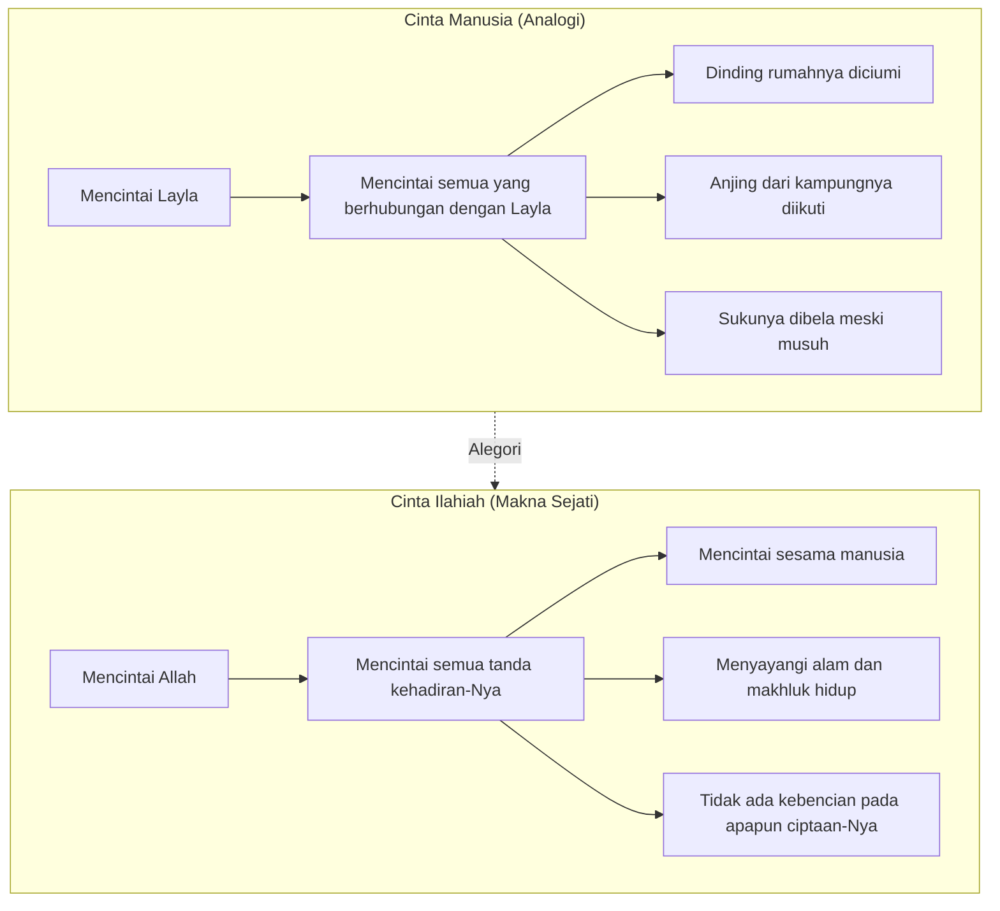
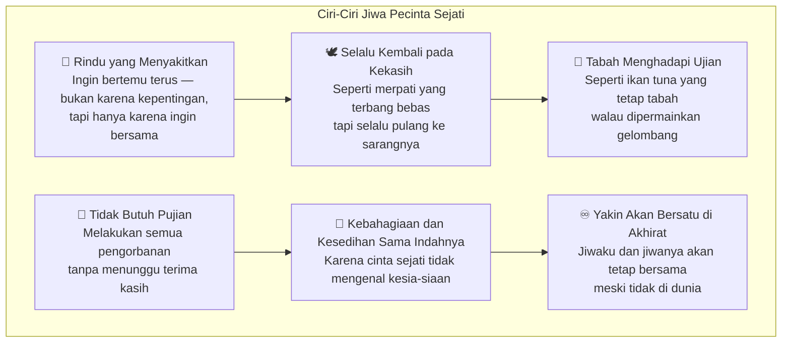
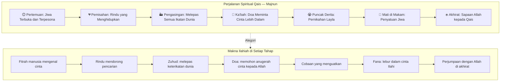

## Pembuka: Cinta Bukan Pacaran, Pacaran Bukan Cinta 💡

Sebelum kita berbicara tentang Nizami, ada satu kalimat dari **Ibnu Arabi** yang perlu kita pahami dulu sebagai fondasi:

> *"Innal hubba al-hakiki bainal basyari huwa al-bidayah li ta'arrifu'llah wa suuril bimahabbatihi wa awa'ilu'l-fuyudhil ilahiyyah."*

Terjemahannya: **"Sesungguhnya cinta yang hakiki antara manusia adalah awal perjalanan menuju pengenalan kepada Allah, dan merasakan pengalaman mencintai-Nya, serta merupakan awal untuk mendapatkan anugerah dan kemuliaan dari Allah."**

Artinya: cinta sejati antar manusia bukan sekadar perasaan romantis biasa. Ia adalah **pengantar** — sebuah latihan jiwa untuk kemudian mengenal cinta yang lebih besar, cinta kepada Sang Pencipta. 🌿

Ini penting dipahami karena malam ini kita akan membahas sebuah karya sastra yang tampaknya bercerita tentang dua orang muda yang saling jatuh cinta. Tapi di balik lapisan luarnya yang romantis, tersimpan **makna yang jauh lebih dalam** — sebuah alegori (*simbolisme berupa narasi*) tentang kerinduan jiwa kepada Tuhan.

Dan satu hal lagi: **cinta itu bukan pacaran**. Kadang pacaran tidak ada cintanya. Kadang cinta hadir tanpa pacaran. Cinta sejati bisa diarahkan kepada siapa saja — orang tua, sahabat, tetangga, alam semesta. *Latihlah jiwa untuk mencintai*, agar ia menjadi lembut, peka, dan siap mengenal cinta yang lebih tinggi.

---

## Mengenal Nizami Ganjavi — Sang Hakim Penyair 📖

Nama lengkapnya adalah **Jamaluddin Ilyas bin Yusuf bin Zaki**, namun dunia mengenalnya sebagai **Nizami** atau **Nizami Ganjawi** — merujuk pada kota Ganja, yang kini menjadi wilayah Azerbaijan. Pada zamannya, daerah tersebut masih berada di bawah Imperium Persia, Dinasti Saljuk.

Nizami adalah seorang anak yatim yang dibesarkan oleh pamannya. Ia sangat cerdas, menguasai banyak ilmu agama, dan karena kedalaman hikmatnya, ia digelari **Hakim** — bukan dalam arti hakim pengadilan (*penguasa*), melainkan **orang yang ahli hikmah**, bijaksana, arif.

Yang menarik dari hidupnya: Nizami menikah tiga kali. Istri pertamanya adalah hadiah dari Sultan — sebuah kebiasaan di masa itu, ketika sultan sering menganugerahkan hadiah istimewa kepada penyair yang karya-karyanya mereka sukai.

Layla Majnun sendiri sebenarnya bukanlah cerita yang pertama kali ditulis oleh Nizami. Sebelum Nizami menulisnya, kisah Layla dan Majnun sudah beredar sebagai **folklor** (*cerita rakyat*) di kalangan bangsa Arab — lengkap dengan syair-syair Qais yang sudah dihafal banyak orang. Yang diperdebatkan adalah: apakah ini kisah nyata atau rekaan? Yang menarik, di India terdapat makam yang diyakini sebagai makam Layla dan Majnun, berdampingan.

---

## Asal-Usul Nama: Layla dan Majnun 🌙

Sebelum masuk ke ceritanya, ada baiknya kita memahami makna di balik nama-nama dalam kisah ini.

**Qais** — nama asli sang kekasih — adalah seorang pemuda tampan dari keluarga terpandang, idola di sukunya. Tapi karena kegilaannya dalam mencintai, ia mendapat julukan **Majnun**.

*Majnun* berasal dari akar kata yang sama dengan *jin*. Secara harfiah (*kata per kata*) artinya adalah "orang yang kesurupan jin". Dalam bahasa populer kita terjemahkan sebagai **gila**. Dan memang, orang yang jatuh cinta sedalam itu — akalnya tidak lagi berjalan normal, seperti orang kesurupan. Ada penjelasan kimiawi: otak manusia yang sedang jatuh cinta memang mengalami perubahan hormonal yang signifikan.

Sementara **Layla** — nama kekasihnya — secara akar kata berarti **malam**. Ada dua versi mengapa ia dinamakan Layla: pertama, karena matanya yang sangat indah dan hitam pekat seperti malam. Kedua, karena rambutnya yang sangat hitam, lebat, berkilau seperti kegelapan malam. 🌑

Dalam konteks sufistik (*berkaitan dengan tasawuf*), nama Layla yang berarti "malam" pun memiliki makna simbolis yang dalam: malam adalah waktu keintiman, waktu munajat (*doa dan curahan hati*), waktu seorang hamba paling dekat dengan Tuhannya.

---

## Sinopsis Kisah: Dari Pertemuan Hingga Perpisahan Abadi 📜

### Pertemuan di Sekolah Unggulan 🏫

Cerita dimulai dengan **Umar**, ayah Qais, yang sampai tua belum dikaruniai anak. Setelah bertirakat (*menjalankan laku spiritual dengan penuh kesungguhan*) dan berdoa panjang, ia akhirnya dianugerahi seorang putra yang sangat tampan — **Qais**.

Qais tumbuh menjadi idola di sukunya. Karena memang dari keluarga terpandang, ia disekolahkan di sekolah paling elit. Di sekolah inilah ia bertemu **Layla** — putri ketua suku lain yang terkenal kecantikannya.

Keduanya langsung saling jatuh cinta. Di dalam kelas, saling pandang, saling lirik. Sama-sama mabuk. Sama-sama terpesona. Dan dari sinilah lahir syair-syair Qais yang pertama:

> *"Berlalu masa saat orang-orang padaku memohon pertolongan, dan kini adakah penolong yang akan mengabarkan rahasia jiwa pada Layla? Cinta telah membuatku lemah tak berdaya seperti anak hilang jauh dari keluarga. Cinta laksana air yang menetes menimpa bebatuan — waktu berlalu dan bebatuan itu akan hancur berkeping-keping bagai kaca berpecahan. Begitulah cinta yang engkau bawa padaku..."*

### Pemisahan yang Mengawali Kegilaan 💔

Gosip menyebar di mana-mana. Dua anak orang terpandang — berpacaran ke mana-mana, tidak bisa dipisah. Ayah Layla merasa nama baiknya tercoreng. Maka dengan tegas, Layla dipanggil pulang dan dilarang keluar lagi dari rumah.

Inilah titik pemisahan pertama. Dan di sinilah babak pertama kegilaan Qais dimulai.

*Yang keluar dari mulutnya hanya satu: Layla. Layla. Layla.*

Ini bukan sekadar drama remaja. Nizami sedang mengajarkan sesuatu yang dalam: **kalau kamu benar-benar jatuh cinta pada sesuatu, namanya akan keluar secara otomatis dari mulutmu — tanpa perlu dipaksa**. Tidak perlu ritual, tidak perlu target berapa ribu kali dalam semalam. Kalau fondasinya ada, ia mengalir sendiri.

### Lamaran yang Ditolak dan Hidup di Padang Pasir 🏜️

Melihat anaknya semakin "gila", akhirnya ayah Qais atas nasihat banyak orang memutuskan untuk melamar Layla secara resmi. Minta apa saja kami penuhi. Bahkan nyawa kami jadikan taruhan.

Jawaban orang tua Layla? **"Siapa saja boleh menikahi anakku — kecuali putra Anda."**

Logika seorang ayah: mana ada orang tua yang merelakan anaknya dinikahi oleh orang gila? Meskipun gilanya karena cinta pada putrinya, tetap saja — ketika masih waras berpacaran saja sudah jadi bahan omongan satu kampung. Apalagi sekarang.

Penolakan ini membuat Qais yang tadinya sudah sedikit tenang, kambuh kembali lebih dahsyat. Ia pergi dari rumah, menyepi, hidup di padang pasir, di gua-gua, di bawah terik matahari tanpa alas kaki, tanpa baju yang layak. Rambutnya gondrong. Tubuhnya tak terawat.

Tapi yang mengherankan: **binatang-binatang buas di sekitarnya justru jinak**. Anjing, ular, macan — semuanya berkumpul di sekelilingnya, menjaganya seperti para penjaga. Bahkan yang seharusnya saling memangsa tidak saling menyerang ketika berada di dekat Majnun.

Nizami memberikan penjelasan yang indah untuk ini: **orang yang jiwanya dipenuhi cinta memancarkan aura cinta**. Siapa pun — bahkan binatang buas sekalipun — yang mendekat akan merasakan kehangatan itu. Sebaliknya, orang yang jiwanya penuh kebencian: jangankan diajak bicara, didekati saja orang enggan karena hawanya tidak menyenangkan.

---

## Pelajaran-Pelajaran Filsafat Cinta dari Qais 💎

Di sinilah inti dari karya Nizami: setiap episode dalam kisah Qais dan Layla adalah **pelajaran tentang hakikat cinta**. Mari kita telusuri satu per satu.

### 1. Cinta Adalah Datang Tanpa Diundang 🌊

Kata Majnun:

> *"Cinta masuk ke dalam sanubari tanpa kami undang, bagai ilham dari langit yang datang menerjang lalu bersemayam dalam jiwa."*

Cinta bukan sesuatu yang bisa kita rencanakan, bisa kita atur kapan mulainya, kapan berakhirnya. Ia **datang tanpa permisi** dan kemudian **berdiam tanpa mau pergi**. 

Kahlil Gibran pun berkata serupa: *"Pasrahlah kalau cinta memanggilmu."* Kenapa? Karena kamu tidak akan bisa melawan. Kamu tidak akan bisa menipu dirimu sendiri.

Dalam konteks cinta ilahiah (*cinta kepada Tuhan*): anugerah cinta kepada Allah pun tidak bisa dipaksakan dengan kuantitas ritual semata. Ia datang ketika jiwa sudah siap, ketika fondasi sudah dibangun.

### 2. Cinta Adalah Kebebasan, Bukan Belenggu 🦅

> *"Cinta tidak pernah membelenggu karena cinta adalah pembebas yang melepaskan simpul-simpul keberadaan. Cinta adalah pembebas dari segala belenggu."*

Ini kontra-intuitif (*berlawanan dengan apa yang biasanya kita pikirkan*). Bukankah orang yang jatuh cinta justru merasa "terikat"? Tidak bisa tidur, tidak bisa makan, tidak bisa berpikir selain tentang yang dicintainya?

Yang dimaksud Nizami dan Majnun di sini berbeda: **cinta membebaskan kamu dari ikatan ego, dari ketakutan, dari keserakahan, dari pamrih**. Majnun rela melepaskan kedudukannya sebagai putra mahkota suku. Ia tidak peduli kehilangan teman-temannya. Ia tidak peduli kehilangan harta. Semua itu ia tinggalkan dengan ringan.

*Cinta membebaskan dari egoisme*. Orang yang masih sangat egois, masih sangat perhitungan, masih selalu bertanya "apa untungnya bagiku?" — belum benar-benar jatuh cinta.

Kalau dunia ini dipenuhi relasi cinta, bayangkan betapa damainya: dalam persaingan politik pun, masing-masing pihak akan berkata, "Silakan, saya persilakan Anda memimpin" — bukan karena kalah, tapi karena cinta yang membebaskan dari keserakahan posisi.

### 3. Cinta Mengubah Racun Menjadi Madu 🍯

> *"Banyak racun yang harus kita telan untuk menambah nikmatnya cinta. Atas nama cinta, racun yang pahit pun terasa manisnya."*

Orang yang sedang jatuh cinta sering kali melakukan hal-hal yang bagi orang luar terlihat konyol, melelahkan, bahkan menyiksa. Tapi bagi yang menjalaninya, semua itu terasa manis.

Qais pernah menyamar menjadi pengemis — berjalan dari rumah ke rumah di kampung Layla, dikejar anak-anak kecil, dikejar anjing, dilempari batu. Orang lain melihat: betapa memalukan, betapa lelah. Tapi Qais? Ia bahagia luar biasa karena bisa melihat pintu rumah Layla. **Melihat sandalnya saja sudah cukup untuk membuat hatinya berbunga-bunga**.

Ini pelajaran bahwa dalam cinta, definisi "bahagia" dan "menderita" berubah. Yang dari luar terlihat sengsara, dari dalam terasa seperti kebahagiaan terbesar.

### 4. Mencintai Dinding Rumah Sang Kekasih 🧱❤️

Ada satu episode yang sangat terkenal dalam kisah ini — dan sangat indah secara simbolis.

Ketika Qais tidak tahu cara masuk ke rumah Layla, ia datang diam-diam pada malam hari, menempel di dinding rumah Layla, dan **menciumi setiap sudut dinding itu**. Orang yang melihat tentu bingung: apa yang ia ciumi? Hanya tembok.

Tapi Qais berkata:

> *"Aku berjalan melintasi rumah-rumah Layla, kucium dinding itu, kucium semua sudut-sudutnya. Namun cintaku bukan untuk dinding itu — melainkan cinta pada siapa yang tinggal di dalamnya."*

Ini adalah pelajaran tasawuf (*mistisisme Islam*) yang sangat dalam:

**Konsekuensi dari mencintai seseorang adalah mencintai semua yang berhubungan dengannya.** 

Maka jika kita benar-benar mencintai Allah, kita pasti akan **memuliakan dan menghargai semua yang berhubungan dengan Allah** — apakah itu sesama manusia, binatang, tumbuhan, alam semesta. Karena semua yang ada di alam semesta ini adalah *tanda-tanda kehadiran Allah*.

Tembok rumah Layla adalah tanda adanya Layla. Setiap makhluk di alam semesta adalah tanda adanya Allah.

> *Jika seseorang mengaku mencintai Allah tapi masih ada yang ia benci di alam ini, padahal semua yang ada di alam semesta adalah tanda-tanda kehadiran-Nya — berarti cintanya belum sepenuhnya tumbuh.*

### 5. Cinta Menghasilkan Kesetiaan Tanpa Pamrih ⚓

> *"Cinta bukanlah harapan atau ratapan. Walau tiada harapan, aku akan tetap mencintainya. Sampaikan salamku pada dia wahai angin malam, katakan aku akan tetap menunggu hingga ajal datang menjelang."*

Mengapa ada orang yang tidak setia? Biasanya karena **ada pamrih** di balik cintanya — harapan tertentu yang tidak terpenuhi. Ketika harapan itu gagal, "cintanya" pun pergi.

Tapi cinta sejati — yang murni tanpa pamrih — tidak membutuhkan syarat. Walau tidak ada harapan untuk bersatu, walau tidak ada kepastian, **cinta itu tetap ada**. Kalau memang benar-benar cinta, tidak perlu dituntut untuk setia — ia setia dengan sendirinya.

Ini juga menjelaskan mengapa banyak orang "berhenti beribadah" ketika doanya tidak dikabulkan. Karena ibadah mereka masih berbasis pamrih, bukan cinta. **Cinta kepada Allah yang sejati tidak bersyarat** — ia tetap hadir dalam suka maupun duka, dalam doa yang dikabulkan maupun yang belum.

### 6. Ciri-Ciri Jiwa yang Sedang Mencintai 🔍

Nizami melalui Majnun memberikan peta yang sangat detail tentang bagaimana jiwa seorang pecinta itu:

**Ciri pertama: Rindu yang menyakitkan.** Bukan rindu karena utang belum dibayar, bukan rindu karena ada kepentingan. Rindu yang murni — ingin ketemu, dan begitu ketemu pun tidak tahu mau ngapain. Ketemu saja sudah cukup.

**Ciri kedua: Selalu kembali pada yang dicintai.** Apapun aktivitasmu, apapun yang kamu alami, pada akhirnya hatimu kembali kepada yang kamu cintai. Seperti burung merpati yang terbang bebas di angkasa luas tapi tetap saja kembali pada kekasihnya.

**Ciri ketiga: Tabah menghadapi ujian.** Seperti ikan tuna yang tetap kokoh meski dipermainkan gelombang besar timbul tenggelam di lautan. Tujuannya tidak berubah.

**Ciri keempat: Tidak butuh pujian.** Kalau masih menunggu ucapan terima kasih, kalau masih menghitung berapa banyak pengorbanan yang sudah dilakukan lalu berharap diapresiasi — itu belum cinta. Cinta sejati memberi tanpa menghitung.

**Ciri kelima: Kebahagiaan dan kesedihan sama indahnya.** Karena dalam cinta sejati, tidak ada yang sia-sia. Bahkan kesedihan pun indah — karena di dalamnya ada kenangan, ada rindu, ada denyut jiwa yang hidup.

### 7. Paradoks Jarak: Dekat Membebankan, Jauh Menggelisahkan 🧭

> *"Bila dekat rumahnya Layla, aku merasa terbebani. Bila aku jauh darinya, aku merasa sedih. Sehingga dekat maupun jauh, bersemayam rindu dan gelisah."*

Ini adalah paradoks (*hal yang tampak bertentangan tapi keduanya benar*) yang sangat akrab dalam hubungan cinta — dan ini juga adalah gambaran hubungan manusia dengan Tuhannya.

**Dekat dengan Allah itu membebankan**: ada tanggung jawab, ada kehati-hatian, ada ibadah yang harus dijaga, ada akhlak yang harus dipertahankan.

**Jauh dari Allah itu menggelisahkan**: ada rasa khawatir akan murka-Nya, ada kegelisahan batin yang tidak bisa dijelaskan, ada kekosongan yang tidak bisa diisi oleh apapun.

Paradoksnya: kalau kamu merasakan keduanya, itu tanda bahwa kamu sedang dalam proses mencintai. **Tapi pada akhirnya, lebih dekat tetap lebih baik** — meskipun lebih berat, lebih penuh tanggung jawab. Seperti yang Majnun katakan: *"sungguh ternyata dekat dengannya lebih baik daripada jauh darinya."*

### 8. Doa di Ka'bah — Mintalah Cinta Lebih Dalam 🕋

Salah satu episode paling terkenal dalam kisah ini adalah ketika ayah Qais membawanya berhaji, berharap di tanah suci anaknya berdoa untuk *melupakan* Layla.

Tapi sesampainya di depan Ka'bah, doa Majnun justru sebaliknya:

> ***"Robbi zidni min isqiha"*** — *"Ya Tuhanku, tambahkanlah cinta dan kerinduanku padanya!"*

> ***"Wainqosurat Umri bil isqi fidzhu fi umriha"*** — *"Seandainya semakin berkurang umurku karena cinta, maka tambahlah umurnya (Layla)."*

> ***"Robbi zidni Layla hubban wa tansanikroha abadan"*** — *"Wahai Tuhan, tambahkanlah cintaku pada Layla. Jangan membuatku lupa untuk mengingatnya selamanya."*

Bagi Nizami — dan ini adalah inti dari alegori (*simbolisme cerita*) ini — nama Layla di sini adalah kode untuk Allah. **Mintalah kepada Allah agar Dia menganugerahimu cinta yang semakin dalam kepada-Nya.** Mintalah agar kamu jatuh cinta kepada-Nya. Bukan sekadar takut kepada-Nya, bukan sekadar butuh kepada-Nya — tapi **mencintai-Nya**.

---

## Kisah-Kisah Sampingan yang Penuh Hikmah ✨

Di luar alur utama, Nizami dan Rumi menambahkan beberapa episode pendek yang masing-masing mengandung pelajaran tersendiri.

### Gelas Tua Berisi Anggur vs Gelas Emas Berisi Cuka 🍷

Ketika teman-teman Majnun menawarkan: *"Kalau kamu mau, kami bisa mendatangkan perempuan yang jauh lebih cantik darimu."*

Jawab Majnun:

> *"Kalian sebaliknya merasa puas dan cukup dengan bentuk gelas tapi tak tahu apa yang paling penting dari sebuah gelas. Tak ada artinya gelas emas berhias permata tapi isinya cuka. Wadah tua dan rusak berisi anggur bagiku lebih baik ketimbang seratus gelas emas berisi cuka."*

Pelajaran modernnya: **jangan lihat casingnya**. Orang yang masih sangat sibuk dengan penampilan fisik — masih belum benar-benar jatuh cinta. Cinta sejati tidak peduli casing. Bahkan kondisi apapun dari yang dicintai akan tampak indah bagi yang mencintainya.

Kata Rumi: *"Cinta menjadikan sesuatu tampak menawan, namun yang tampak menawan tak selalu menyebabkan jatuh cinta."*

### Unta yang Mencintai Anaknya 🐫

Suatu ketika Majnun ingin cepat bertemu Layla dan menunggang seekor unta. Tapi unta itu baru melahirkan — masih sayang-sayangnya dengan anaknya. Jadinya maju mundur, maju mundur, tidak nyampai-nyampai.

Akhirnya Majnun turun dan berkata: *"Cintamu dan cintaku tidak sejalan. Kamu mencintai anakmu, aku mencintai Layla. Menunggangimu membuat perjalanan beberapa hari memakan waktu enam puluh tahun."*

Lalu Majnun berlari sendiri. Di tengah jalan kakinya patah. Tapi ia tidak berhenti — ia ikat sendiri kakinya, lalu **menggelindingkan badannya** menuju Layla.

Pelajarannya sangat dalam: **selama masih ada banyak beban yang kamu tempel di dirimu — ketakutan akan penilaian orang, keserakahan harta, keangkuhan posisi — kamu tidak akan pernah sampai pada yang kamu cintai**. Tinggalkan semua beban itu. Berlarilah, menggelindinglah jika perlu, menuju yang kau cintai.

### Dipermalukan di Pesta, Tapi Malah Tersenyum 😊

Di rumah Layla diadakan pesta besar. Majnun yang tidak diundang menyusup masuk dan ikut antri mengambil makanan — berharap bisa sejenak bertatap muka dengan Layla.

Ketika giliran Majnun tiba, Layla justru memecahkan piring yang untuk Majnun. Di depan seluruh tamu. Sebuah penghinaan yang tampaknya terang-terangan.

Keluarga Layla dan tamu-tamu bersorak: *"Alhamdulillah, Layla sudah sadar, sudah tidak peduli dengan Majnun!"*

Tapi Majnun justru tersenyum lebar.

Ketika ditanya mengapa tersenyum padahal baru dipermalukan, Majnun heran: *"Kapan saya dipermalukan? Layla memecahkan piringku — supaya aku ikut antrian lagi! Dan di antrian nanti, aku bisa memandangnya lagi. Kami bisa berlama-lama saling menatap."*

Rahasianya ada di situ — orang luar tidak mengerti karena mereka bukan pecinta.

**Analog ilahiahnya**: *Bila doamu lama tidak dikabulkan, mungkin Allah suka rindu mendengarkan suaramu. Bila ujianmu terasa berat, mungkin Allah ingin kamu berlama-lama berdekatan dengan-Nya.* Jangan cepat-cepat menyimpulkan bahwa Allah tidak peduli — mungkin justru sebaliknya: Ia ingin kamu lebih sering datang, lebih sering bermunajat, lebih lama bersama-Nya.

### Pisau Tabib yang Ditakutkan 🔪

Suatu ketika Majnun sakit dan perlu dibedah. Tapi ia menolak keras. Tabib bingung: selama ini Majnun tidak takut macan, tidak takut ular, tidak takut binatang buas apa pun di padang pasir — mengapa takut pisau bedah?

Jawab Majnun: *"Bukan pisaunya yang aku takuti. Aku takut pisaunya menyakiti Layla."*

Tabib makin bingung: *"Loh, yang dibedah kamu, bukan Layla."*

Majnun: *"Justru itu. Layla ada di setiap bagian tubuhku. Ia ada di aliran darahku. Kalau aku disakiti, Layla yang sakit."*

Ini adalah gambaran tentang **menyatunya pecinta dengan yang dicintai**. Dalam cinta yang sudah sangat dalam, batas antara "aku" dan "kamu" menjadi kabur. Bila yang kamu cintai disakiti, kamu yang merasakan sakitnya. Dan begitu pula sebaliknya.

Dalam konteks cinta kepada Allah: *seorang yang benar-benar mencintai Allah akan merasakan kesakitan ketika melihat larangan-Nya dilanggar, bukan karena takut hukuman, tapi karena* **tidak rela** *hal yang dicintai diperlakukan tidak semestinya*.

### Sindiran untuk Orang yang Shalatnya Masih Bisa Melihat 🙈

Ada episode yang mengandung sindiran halus namun sangat tajam. Ketika Majnun melihat seekor anjing dari kampung Layla melintas, ia langsung mengikutinya — berharap anjing itu bisa membawanya menemui Layla. Dalam pengejarannya itu, ia melintas di depan sekelompok orang yang sedang shalat berjamaah tanpa melihat mereka.

Setelah Majnun kembali, orang-orang itu marah: *"Tadi kamu lewat di depan kami sedang shalat, kenapa kamu tidak ikut shalat berjamaah dengan kami?"*

Majab Majnun: *"Demi Allah, waktu kalian sedang shalat berjamaah, saya sama sekali tidak melihat kalian. Hati saya hanya fokus pada anjing Layla, siapa tahu bisa mempertemukan saya dengannya. Tapi kalian — sedang berbicara dengan Allah — masih bisa melihat dan memperhatikan saya?"*

> *"Bila kalian benar-benar cinta pada Allah sebagaimana diriku cinta pada Layla, pasti kalian tidak melihat aku saat kalian sedang shalat."*

Sindirannya menusuk: **Aku saja yang cuma mengejar anjing milik Layla sampai tidak melihat kalian. Kalian yang sedang menghadap Allah — masih sempat-sempatnya memperhatikan sekelilingmu?**

---

## Klimaks: Pernikahan Layla, Kematian, dan Perjumpaan Abadi 🌹

### Layla Dipaksa Menikah

Tekanan sosial akhirnya memaksa Layla untuk menikah dengan seorang pria tua bernama **Abu Salam**. Ini adalah "kiamatnya" Qais — ia pingsan berhari-hari ketika mendengar kabar itu.

Tapi Layla — yang sepanjang waktu harus memendam rindunya sendirian di dalam dada sementara Majnun bebas mengekspresikan cintanya ke seluruh penjuru dunia — mengirim surat yang sangat mengharukan:

> *"Engkau memaklumatkan cintamu ke seluruh dunia, sementara aku membakarnya di dalam hatiku. Katakan padaku kekasih, mana di antara kita yang lebih dimabuk cinta?"*

Dan tentang pernikahannya, Layla berkata jelas: *"Ranjangku tak pernah mempertemukan kepalaku dan kepalanya. Permata di tubuhku masih tersimpan utuh, bersih, dan tak pernah disentuh oleh jamahan tangan siapapun."*

Layla menolak disentuh suaminya — ia tetap setia kepada Qais dalam batin, meskipun secara fisik berada di bawah atap yang berbeda.

### Wasiat Layla yang Indah 💌

Setelah suaminya meninggal lebih dulu, kesehatan Layla turun drastis. Ia pun menyampaikan wasiat kepada ibunya:

> *"Ibu, bila aku mati, kenakanlah aku baju penganten yang paling bagus. Jangan bungkus aku dengan kain kafan biasa — carilah kain berwarna merah muda bagai darah segar seorang yang syahid. Riaslah wajah dan tubuhku secantik mungkin, bagaikan pengantin paling cantik di seluruh bumi. Alis dan bulu mataku — ambillah dari debu yang melekat di kaki kekasihku. Dan janganlah usapkan minyak wangi — usapkanlah dengan air mata Qais."*

*"Dan sampaikan padanya: Layla sahabatnya dalam kesedihan itu sekarang sudah tiada. Ia telah bebas dari belenggu duniawi. Hatinya hanya diberikan kepadamu. Dan ia mati untukmu."*

### Kematian Majnun di Atas Makam Layla 🌙

Setelah Layla wafat, Qais tidak ke mana-mana lagi. Ia hanya ada di satu tempat: **makam Layla**. Pekerjaannya satu-satunya: memeluk nisan dan makam kekasihnya setiap hari.

Dan akhirnya, ia meninggal dalam keadaan **memeluk makam Layla**. Persis seperti yang ia doakan — tidak ada lagi yang dapat dipertahankan di dunia setelah jiwa satu-satunya dipanggil.

### Sapaan Allah di Akhirat 🌟

Salah satu tambahan paling indah dalam cerita ini datang dari sebuah mimpi yang dialami seorang Sufi: di akhirat, Allah menyapa Qais:

> ***"Wahai Qais, mengapa engkau menyebut nama-Ku dengan nama Layla waktu di dunia?"***

Pertanyaan itu bukan teguran. Itu adalah **penyingkapan identitas yang tersembunyi**. Selama di dunia, Qais berseru "Layla... Layla..." — tapi di akhirat terungkap bahwa yang selama ini ia cintai, yang selama ini menjadi pusat hidupnya, yang selama ini ia rindukan dengan segenap jiwa — adalah **Allah sendiri**.

Inilah inti dari seluruh karya Nizami: **Layla adalah kode untuk Allah**. Qais — si Majnun — adalah gambaran jiwa yang sedang menempuh perjalanan menuju Tuhan, mabuk cinta ilahiah, tidak peduli dengan apapun selain Yang Dicintai.

---

## Layla dan Majnun dalam Kacamata Tasawuf 🔮

### Mengapa Para Sufi Menulis Roman Cinta?

Mungkin ada yang bertanya: mengapa para Sufi seperti Nizami, Rumi, Jami, dan lainnya menulis kisah-kisah roman percintaan? Apakah itu tidak berlebihan?

Jawabannya ada di awal: mereka menjadikan cinta manusiawi sebagai **pintu masuk** ke pemahaman yang lebih tinggi. Karena tidak semua orang bisa langsung memahami konsep cinta ilahiah yang abstrak — tapi hampir semua orang pernah merasakan cinta, pernah rindu, pernah sakit karena cinta.

Dengan menggunakan bahasa cinta yang universal itu, para Sufi membangun **jembatan** dari pengalaman yang sudah dirasakan pembaca menuju pemahaman tentang cinta kepada Tuhan.

*Kalau memahami kisah ini hanya sebagai cinta biasa antara laki-laki dan perempuan — itu pun tidak apa-apa*, kata ustaz dalam kajian ini. *Karena cinta romantis biasa pun sebenarnya merupakan anugerah dari Allah, dan merupakan pengantar untuk menuju cinta yang lebih tinggi.*

### Takhalluq bi Akhlaqillah — Berakhlak Seperti Akhlak Allah

Dalam tradisi tasawuf, puncak dari suluk (*perjalanan spiritual*) adalah **takhalluq bi akhlaqillah** — berakhlak seperti akhlak Allah. Allah Maha Menyayangi, kita menyayangi. Allah Maha Sabar, kita bersabar. Allah Maha Adil, kita berlaku adil.

**Termasuk: Allah Maha Mencintai, kita mencintai.**

Maka latihan mencintai — mencintai sesama manusia, mencintai orang tua, mencintai sahabat, mencintai alam — adalah *latihan berakhlak seperti akhlak Allah*.

Dan kisah Layla Majnun — dengan segala intensitasnya, dengan segala kedalaman rindu dan pengorbanannya — adalah pelajaran tentang bagaimana seharusnya kita mencintai Tuhan: **habis-habisan, tanpa pamrih, tanpa syarat, sampai mati**.

---

## Penutup: Mana di Antara Kita yang Lebih Dimabuk Cinta? 🤍

Di penghujung kisah yang panjang ini, ada satu pertanyaan Layla yang tidak pernah terjawab — dan sengaja tidak dijawab:

> *"Engkau memaklumatkan cintamu ke seluruh dunia, sementara aku membakarnya di dalam hatiku. Katakan padaku kekasih — mana di antara kita yang lebih dimabuk cinta?"*

Nizami sengaja membiarkan pertanyaan ini mengambang. Karena itu adalah pertanyaan yang ditujukan kepada **kita, sang pembaca**.

Setelah mendengar semua ini, merenungkan semua pelajaran tentang cinta yang sejati, tentang kesetiaan tanpa pamrih, tentang kebebasan yang lahir dari cinta, tentang kerinduan yang menghidupkan jiwa — pertanyaannya kembali kepada kita:

**Seberapa dalam kita mencintai?**

Dan ke manakah cinta itu kita arahkan? Kepada siapa? Kepada apa?

*Layla yang sesungguhnya, menurut Nizami, adalah Allah. Dan Majnun — si gila yang abadi — adalah gambaran jiwa yang paling utuh: jiwa yang sudah tidak peduli dengan apapun di dunia ini, selain bisa dekat dengan Yang Paling Dicintai.*

*Boleh jadi, di antara kita semua, ada yang sedikit Majnun — ada yang sedikit gila karena rindu kepada Tuhan. Dan itu bukan kekurangan. Itu, justru, adalah karunia.* 🌙✨

<Callout type="info" title="Tentang Ngaji Filsafat">
Kajian ini adalah bagian dari seri **Ngaji Filsafat** yang membahas filsafat dan sastra dari perspektif Islam dan tasawuf. Episode 221 ini membahas **alegori cinta** dalam tradisi sastra Sufi, dengan fokus pada karya agung **Nizami Ganjavi**, sang Hakim Penyair dari Azerbaijan.

Seri sebelumnya membahas **Jami** dengan karya *Yusuf Zulaikha*, dan seri berikutnya akan beralih ke **Filsafat Barat** — Rene Descartes, David Hume, Henri Bergson, dan Albert Camus.
</Callout>

<Callout type="cite" title="Sumber">
Artikel ini diadaptasi dari transkrip **Ngaji Filsafat 221: Nizami Ganjavi — Layla Majnun**, sebuah kajian mendalam tentang sastra sufi, alegori cinta, dan perjalanan jiwa menuju Tuhan.

📎 https://www.youtube.com/watch?v=K6W6BYNpWMs
</Callout>
