## Pembuka: Penderitaan adalah Bahasa yang Semua Orang Mengerti 😔

Tidak ada satu pun manusia yang hidup tanpa pernah menderita.

Tidak peduli seberapa kaya, seberapa pintar, seberapa saleh — penderitaan adalah tamu yang selalu datang tanpa diundang. Ia hadir dalam berbagai wajah: sakit fisik, sakit hati, kehilangan, kekecewaan, ketidakadilan, dan kesendirian.

Tapi justru karena itulah, penderitaan menjadi salah satu topik terpenting dalam sejarah filsafat manusia. Bukan untuk diratapi — tapi untuk *dipahami*.

Karena hanya dengan memahami penderitaan secara mendalam, kita bisa mulai menemukannya sebagai sesuatu yang bermakna, bukan sekadar kutukan.

**Ngaji Filsafat 264** mengajak kita menyelami penderitaan dari berbagai sudut pandang: filsafat Barat, pemikiran Timur, agama-agama besar, sufisme, kearifan Jawa, sosiologi, dan teodisi (*cabang filsafat tentang kejahatan dan penderitaan dalam hubungannya dengan Tuhan*).

<Callout type="abstract" title="Sumber Kajian">
Artikel ini merupakan ringkasan mendalam dari Ngaji Filsafat 264: Menyelami Penderitaan. Video aslinya tersedia di: [Ngaji Filsafat 264 — Menyelami Penderitaan](https://www.youtube.com/watch?v=-SHqsfNiQRg).
</Callout>

---

## Bagian I: Apa Itu Penderitaan? — Empat Ciri Dasarnya 🔍

Sebelum masuk ke teori besar, kita perlu mendefinisikan dulu apa yang dimaksud dengan penderitaan. Secara filosofis, penderitaan memiliki empat ciri utama:

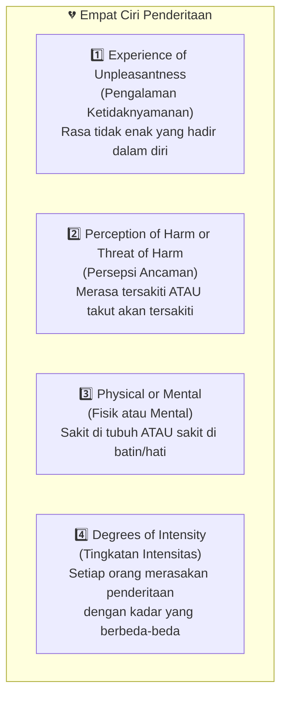

### 🎯 Poin Penting: Ukuran Penderitaan Berbeda Bagi Setiap Orang

Salah satu ciri yang paling sering kita lupakan adalah **degrees of intensity** (*tingkatan intensitas*) — bahwa penderitaan yang sama bisa dirasakan sangat berbeda oleh dua orang yang berbeda.

Bayangkan dua mahasiswa yang sama-sama mendapat nilai jelek di ujian. Yang pertama — sudah terbiasa dengan nilai rendah sejak semester awal. Baginya, ini biasa saja. Yang kedua — selalu mendapat nilai bagus, sekali ini mendapat nilai jelek. Baginya, rasanya seperti dunia kiamat.

*Kejadiannya sama. Penderitaannya berbeda.*

Ini mengajarkan kita satu hal penting dalam berelasi dengan orang lain: **jangan mengukur penderitaan orang lain dengan ukuran dirimu sendiri**. Apa yang bagimu "cuma bercanda" atau "masalah kecil" — bisa menjadi luka yang sangat dalam bagi orang lain.

<Callout type="info" title="Hadis Tentang Tidak Menyakiti">
*"Al-Muslimu man salimal muslimuna min lisaanihi wa yadih"* — Seorang Muslim sejati adalah yang membuat Muslim lain merasa aman dari lisan dan tangannya. Bukan hanya tidak menyakiti, tapi membuat orang *merasa aman* bahwa ia tidak akan disakiti. Ini perbedaan yang sangat halus namun bermakna dalam.
</Callout>

---

## Bagian II: Dua Jenis Mispersepsi — Delusi Hipokondris dan Nihilistis ⚠️

Sebelum melanjutkan ke perspektif para filsuf, perlu kita waspadai dua bentuk *mispersepsi* (*salah memandang*) tentang penderitaan yang dikenal dalam psikologi:

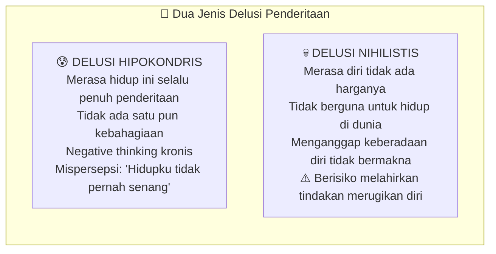

**Delusi hipokondris** (*hipokondriasis* = kecenderungan merasa selalu sakit/menderita) adalah kondisi di mana seseorang meyakini hidupnya selalu penuh penderitaan tanpa jeda kebahagiaan sama sekali. Ini bukan refleksi realita — ini *distorsi kognitif* (*gangguan cara berpikir*).

**Delusi nihilistis** (*nihilisme* = pandangan bahwa tidak ada yang bermakna) jauh lebih berbahaya. Ini adalah kondisi ketika seseorang merasa dirinya tidak ada harganya, tidak berguna untuk ada di dunia. Dalam kondisi ekstrem, inilah yang bisa mendorong seseorang menuju keputusasaan yang dalam.

Perlu ditegaskan: **setiap manusia yang Allah izinkan hadir di muka bumi ini pasti ada tujuannya**. Tidak ada manusia yang sama sekali tidak bernilai. Jika seseorang tampak seperti "sampah masyarakat" — itu bukan karena ia tidak bernilai, tapi karena ada kegagalan pengelolaan, baik dari dirinya maupun dari masyarakat di sekitarnya.

---

## Bagian III: Perspektif Filsafat Barat — Penderitaan sebagai Tantangan yang Harus Ditaklukkan 🏆

Ciri khas peradaban Barat dalam melihat penderitaan adalah: **penderitaan adalah tantangan, bukan takdir yang harus diterima begitu saja**. Penderitaan diposisikan sebagai musuh yang harus dikalahkan, fase yang harus dilewati untuk menjadi lebih kuat.

Mari kita telusuri tiga filsuf Barat yang paling penting dalam topik ini:

### 1️⃣ Arthur Schopenhauer — Kendalikan Keinginan, Kurangi Penderitaan

**Arthur Schopenhauer** (*1788-1860*), filsuf Jerman yang terkenal dengan pesimismenya, menulis *The World as Will and Representation* (*Dunia sebagai Kehendak dan Representasi*).

Tesisnya sederhana namun menghantam keras:

> *Hidup digerakkan oleh keinginan. Tapi sebagian besar keinginan tidak akan pernah terpenuhi. Maka penderitaan adalah konsekuensi logis dari keberadaan manusia.*

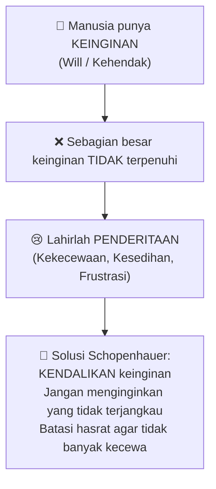

Bagi Schopenhauer, jalan keluar bukan dengan *menambah* kemampuan meraih keinginan — tapi dengan *mengurangi* keinginan itu sendiri. Jangan terlalu banyak *karep* (*keinginan*), jangan terlalu banyak mengandai-andai. Semakin sedikit yang kita inginkan, semakin sedikit kita akan kecewa.

Ini selaras dengan banyak ajaran kebijaksanaan Timur, termasuk Buddhisme dan Taoisme.

### 2️⃣ Friedrich Nietzsche — Iyakan Penderitaan, Wujudkan Will to Power

**Friedrich Nietzsche** (*1844-1900*), filsuf Jerman yang terkenal dengan konsep *übermensch* (*manusia unggul*), memiliki quote yang sangat terkenal:

> *"To live is to suffer. To survive is to find some meaning in the suffering."*
> *"Hidup berarti menderita. Untuk bertahan hidup berarti memberi makna terhadap penderitaan."*

Tapi Nietzsche tidak berhenti di situ. Ia mengenalkan konsep ***ja-sagen*** (*mengiyakan/menerima*) dan ***will to power*** (*kehendak untuk berkuasa/unggul*):

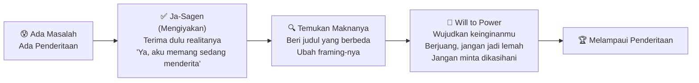

**Langkah pertama Nietzsche: iyakan dulu.** Jangan lari dari masalah, jangan pura-pura tidak ada masalah. Akui: "Ya, aku sedang dalam kesulitan."

**Langkah kedua: beri makna yang berbeda.** Mahasiswa yang belum lulus-lulus? Jangan dikasih judul "tidak mampu" — tapi "diberi kesempatan belajar lebih lama." Diputus pacar? Bukan "dicampakkan" — tapi "diselamatkan dari hubungan yang tidak cocok."

**Langkah ketiga: wujudkan will to power.** Setelah menerima dan memberi makna, bergeraklah. Berjuang. Jangan menjadi orang yang menunggu dikasihani.

<Callout type="tip" title="Perbedaan Schopenhauer vs Nietzsche">
Keduanya setuju bahwa hidup itu penuh penderitaan. Tapi solusinya berbeda: **Schopenhauer** → *kurangi keinginan*. **Nietzsche** → *iyakan kenyataan, lalu wujudkan keinginanmu dengan penuh kekuatan*. Dua pendekatan yang saling melengkapi tergantung situasinya.
</Callout>

### 3️⃣ Albert Camus — Hidup Itu Absurd, Nikmati Saja

**Albert Camus** (*1913-1960*), filsuf dan novelis Prancis-Aljazair yang terkenal dengan *L'Étranger* (*Si Asing*), melihat sumber penderitaan dari sudut yang berbeda: ***absurditas*** (*keabsurdan*).

Hidup ini absurd karena penuh **kontradiksi** (*pertentangan*) dan **ketidakjelasan**. Ideal-ideal yang ada di kepala kita sering tidak nyambung dengan kenyataan yang kita hadapi sehari-hari.

Camus menggunakan kisah **Sisifus** (*Sisyphus*) sebagai metafora:

Dalam mitologi Yunani, Sisifus adalah raja yang dihukum oleh para dewa untuk mendorong batu besar ke puncak gunung — dan setiap kali hampir sampai, batu itu menggelinding kembali ke bawah. Begitu terus, tanpa akhir, sampai kiamat.

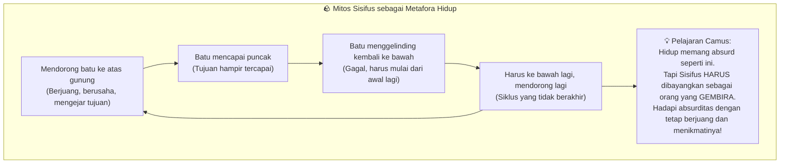

Tanggapan Camus: **nikmati saja absurditas ini**. Kita harus membayangkan Sisifus sebagai orang yang gembira — bukan sebagai orang yang tersiksa. Karena itulah satu-satunya cara manusia bisa hidup dengan bermartabat di tengah dunia yang tidak masuk akal.

---

## Bagian IV: Perspektif Filsafat Timur — Penderitaan Lahir dari Ketidaktahuan 🌿

Berbeda dengan Barat yang melihat penderitaan sebagai tantangan eksternal, tradisi pemikiran Timur cenderung melihat penderitaan sebagai **cerminan dari kondisi internal manusia itu sendiri**.

Inti pemikiran Timur: **orang menderita bukan karena situasinya yang buruk, tapi karena cara berpikirnya yang kurang tepat**.

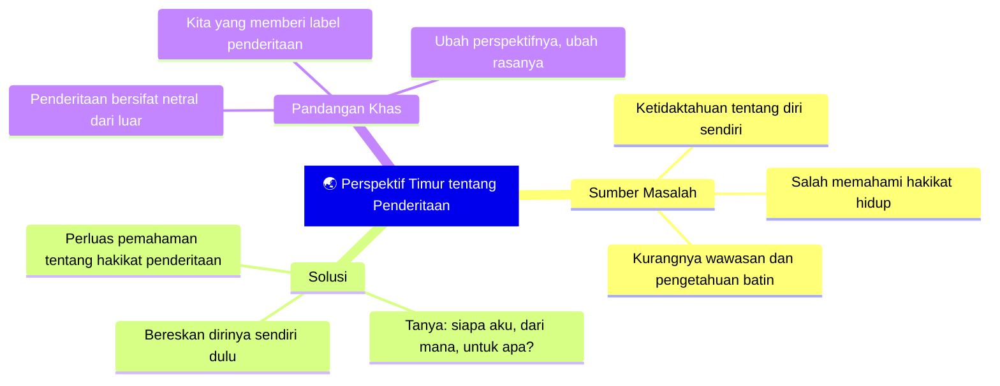

Seperti yang sudah kita pelajari tentang *sakit* sebelumnya — begitu kita membuka lebih banyak simpul pengetahuan tentang hikmah di balik sakit, rasa penderitaan itu mulai berkurang. **Pengetahuan adalah penawar penderitaan.**

Itulah mengapa para pemikir Timur selalu memulai dari pertanyaan-pertanyaan fundamental tentang diri:
- Siapa aku sebenarnya?
- Dari mana asal rasa menderita ini?
- Apa tujuan hidupku?
- Apa peran dan posisiku dalam kehidupan yang lebih besar ini?

---

## Bagian V: Penderitaan dalam Agama-Agama Besar 🕌🕉️⛪

Secara umum, agama-agama besar melihat penderitaan dalam tiga kerangka besar:

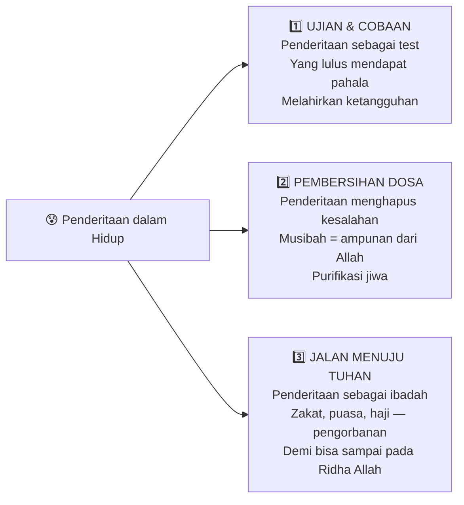

### 🪷 Buddhisme — Duka sebagai Hakikat Hidup

Dalam Buddhisme, penderitaan dikenal sebagai ***duka*** — kata Sansekerta yang diserap ke dalam Bahasa Indonesia menjadi "duka" (penderitaan). Ini adalah salah satu dari *Empat Kebenaran Mulia* (*Cattari Ariyasaccani*) yang diajarkan Buddha Siddharta Gautama.

Ada **tiga jenis duka** dalam Buddhisme:

| Jenis Duka | Nama | Contoh |
|---|---|---|
| Penderitaan Biasa | *Dukkha-dukkha* | Sakit fisik, sariawan, sakit kepala |
| Penderitaan karena Perubahan | *Viparinama-duka* | Putus cinta, ditinggal orang yang dicintai |
| Penderitaan sebagai Hakikat Manusia | *Sankhara-duka* | Kelahiran, usia tua, kematian — keterbatasan manusia |

**Penyebab duka dalam Buddhisme ada dua:**
- ***Tanha*** (*nafsu, hasrat yang tidak terkendali*)
- ***Avidja*** (*kebodohan, kegelapan batin, kurangnya pengetahuan*)

Ini sebenarnya menyatukan perspektif Barat dan Timur: Schopenhauer berbicara tentang *tanha* (kendalikan keinginan), dan pemikiran Timur berbicara tentang *avidja* (perluas pengetahuan). Keduanya diperlukan.

### ☸️ Hinduisme — Karmapala, Panen dari yang Kita Tanam

Hinduisme melihat penderitaan sebagai **buah dari perbuatan kita sendiri** — konsep yang dikenal sebagai ***karmapala*** (*karma* = perbuatan, *pala* = buah/hasil).

Ada tiga jenis karmapala yang sangat penting:

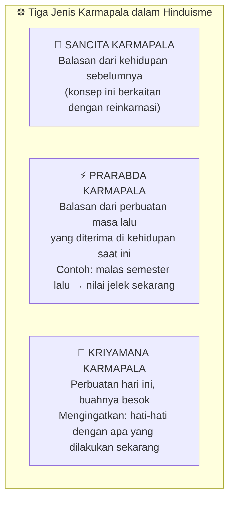

*Kriyamana karmapala* adalah peringatan yang paling relevan dalam kehidupan sehari-hari: "Pak, saya sudah banyak berbuat buruk tapi hidupku baik-baik saja?" — jangan terlena. **Yang akan datang pasti kamu nikmati.** Buah dari perbuatan tidak selalu langsung terasa, tapi ia pasti akan datang.

### ☯️ Taoisme — Lepas dari Keterikatan, Bebas dari Penderitaan

**Lao Tzu** (*Laozi*), pendiri Taoisme, memberikan pandangan yang sangat khas tentang sumber penderitaan:

> *"Kekayaan dan kemuliaan apabila dijadikan kebanggaan akan mendatangkan penderitaan."*

Ini adalah inti dari pemikiran Taois: penderitaan lahir bukan dari kekurangan, tapi dari **keterikatan** (*attachment*). Ketika kita menjadikan kekayaan dan kemuliaan sebagai identitas kita — sebagai sesuatu yang kita banggakan dan mati-matian pertahankan — maka pada saat kekayaan itu habis atau kemuliaan itu tercemar, penderitaan yang kita rasakan akan luar biasa.

Solusi Taoisme:

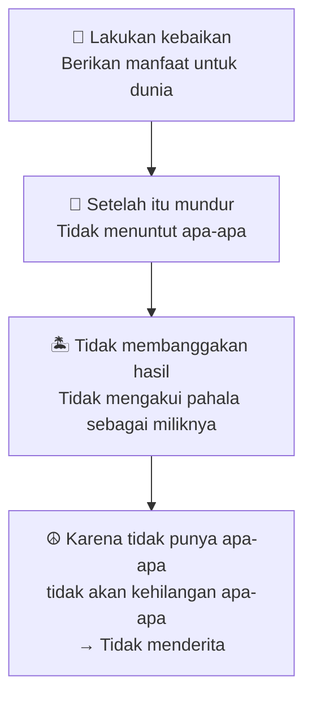

> *"Bekerja tetapi tidak membanggakan kepandaiannya. Berjasa tetapi tidak mengakui pahalanya. Oleh karena tidak mempunyai apa-apa, maka dia tidak pernah kehilangan apa-apa."*

Ini konsep yang sangat dalam: **belajarlah dari alam**. Alam memberikan hujan, sinar matahari, udara, dan kehidupan — tapi alam tidak pernah mengklaim itu sebagai miliknya. Alam tidak menagih balas jasa. Dan alam, karenanya, tidak pernah kecewa.

<Callout type="quote" title="Ajaran Lao Tzu tentang Keterikatan">
Penderitaan hadir bukan karena kita kekurangan sesuatu, tapi karena kita terlalu erat menggenggam sesuatu. Lepaskan genggaman itu, dan penderitaan pun melemah.
</Callout>

---

## Bagian VI: Perjalanan ke Barat — Empat Murid Biksu Tong sebagai Alegori Jiwa 🐒

Di luar teori-teori formal, ada sebuah alegori (*perumpamaan simbolik*) yang sangat kaya maknanya dari tradisi sastra Tiongkok: kisah ***Perjalanan ke Barat*** (*Journey to the West* / *Xi You Ji*) — serial legendaris yang kita kenal dengan tokoh **Kera Sakti Sun Go Kong**.

Empat murid Biksu Tong (*Tang Sanzang*) dalam cerita ini sebenarnya melambangkan **empat hambatan jiwa manusia** yang jika tidak dikelola, akan terus melahirkan penderitaan:

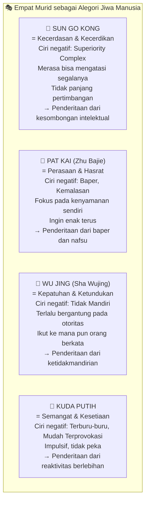

Cerita ini mengajarkan bahwa **penderitaan lahir bukan dari musuh di luar sana, tapi dari karakter-karakter dalam diri kita yang belum dikelola dengan baik**. Sun Go Kong yang terlalu arogan akan tersandung kesombongannya sendiri. Pat Kai yang terlalu menuruti hasrat akan terus-menerus kecewa. Wu Jing yang terlalu patuh pada otoritas akan kehilangan dirinya sendiri.

Perjalanan ke Barat adalah perjalanan jiwa manusia menuju kesempurnaan — dengan segala rintangan yang lahir dari dalam dirinya sendiri.

---

## Bagian VII: Perspektif Sufisme — Memilih Penderitaan sebagai Jalan Pembersihan Diri 🌹

Di antara semua perspektif, **Sufisme** memiliki pandangan yang paling paradoksal (*bertentangan dengan logika umum*): penderitaan bukan sesuatu yang harus dihindari — melainkan sesuatu yang *dipilih* sebagai jalan untuk membersihkan diri.

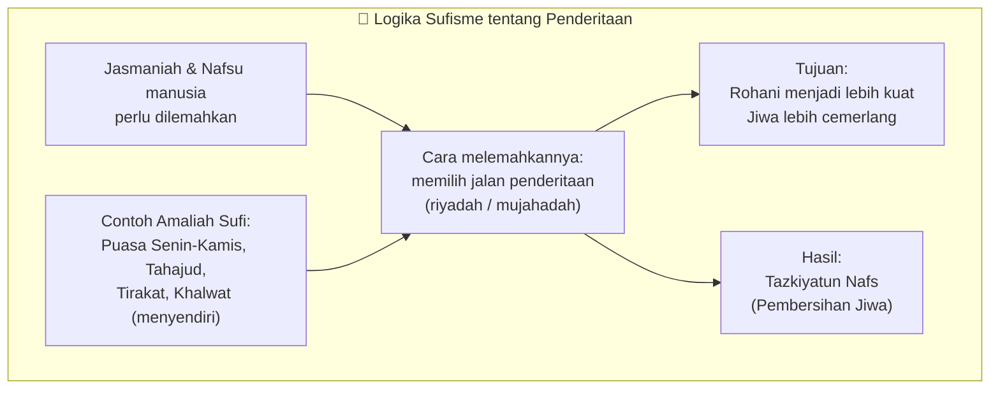

Para Sufi tidak memilih jalan yang menyakitkan karena tidak tahu mana yang lebih enak. Justru sebaliknya — mereka sangat tahu bedanya enak dan tidak enak, tapi mereka *memilih* yang tidak enak demi tujuan yang lebih tinggi.

Ini yang dalam tradisi Jawa disebut ***tirakat*** — dari kata Arab *taraka* yang berarti "meninggalkan." Meninggalkan kenikmatan tertentu untuk sementara waktu, bukan sebagai hukuman diri, tapi sebagai *investasi* untuk menguatkan dimensi rohani.

Logikanya sederhana:
- **Menderita di dunia** tidak apa-apa, asal rohaninya cemerlang
- **Menderita sekarang** tidak apa-apa, asal akhiratnya bahagia

Dan dalam sufisme, proses inilah yang disebut ***via purgativa*** (*Latin untuk "jalan pembersihan"*) — perjalanan jiwa melalui penderitaan menuju cahaya.

---

## Bagian VIII: Ki Ageng Suryomentaram — Mulur dan Mungkret, Ritme Abadi Kehidupan 🎡

Salah satu pemikir asli Nusantara yang paling tajam tentang penderitaan adalah **Ki Ageng Suryomentaram** (*1892-1962*), putra Sultan Hamengkubuwono VII yang melepaskan kemewahan dan gelarnya untuk menjadi rakyat biasa demi mencari kebijaksanaan sejati.

Pandangan beliau tentang penderitaan terasa sangat *membumi* dan relevan:

> *Penderitaan adalah keniscayaan hidup — tapi sifatnya sementara, silih berganti dengan kesenangan.*

Konsep kunci dari Ki Ageng: ***mulur*** dan ***mungkret*** — dua gerakan keinginan manusia yang terus berulang seperti napas:

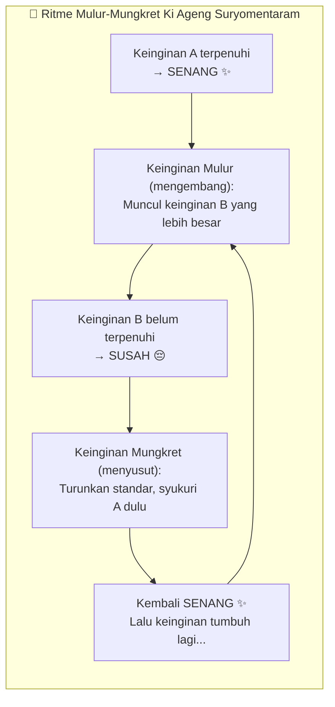

**Mulur** (*mengembang*) — ketika satu keinginan terpenuhi, kita tidak berhenti di situ. Keinginan kita tumbuh, mengembang, menginginkan yang lebih.

**Mungkret** (*menyusut*) — ketika keinginan tidak terpenuhi dan kita terus mengalami kesulitan, kita akhirnya menurunkan standar, bersyukur dengan apa yang ada. Keinginan menyusut, dan kita kembali merasa bahagia.

Hidup kita terus bergerak dalam ritme ini: senang-susah-senang-susah. Keinginan mengembang-menyusut-mengembang-menyusut. Tidak pernah berhenti di satu kutub.

**Implikasi praktisnya:**

Jika kamu sedang dalam fase senang — jangan lupa diri. Keinginanmu akan mengembang dan masa sulit pasti akan datang lagi.

Jika kamu sedang dalam fase susah — jangan putus asa. Keinginanmu akan menyusut dan kamu akan menemukan kebahagiaan kembali dalam hal-hal yang lebih sederhana.

<Callout type="success" title="Wisdom Ki Ageng untuk Masa Kini">
Ketika seseorang baru lulus kuliah dan senang, ia segera menginginkan pekerjaan bagus. Gagal mendapat pekerjaan impian — susah. Tapi kemudian ia bersyukur untuk kelulusannya dulu, menyusutkan harapannya sementara. Senang lagi. Lalu tumbuh keinginan baru... Begitu seterusnya. Inilah ritme hidup yang tidak perlu diresistansi — hanya perlu dipahami dan diterima.
</Callout>

---

## Bagian IX: Tiga Akar Penderitaan dari Perspektif Sosiologi — Talcott Parsons 🔬

Dari sudut pandang **sosiologi**, **Talcott Parsons** (*1902-1979*), salah satu sosiolog terpenting abad ke-20, mengidentifikasi tiga karakter dasar eksistensi manusia yang menjadi akar dari semua penderitaan:

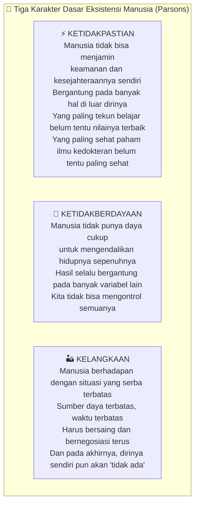

Tiga karakter ini bukan keluhan — ini adalah **realita fundamental dari kemanusiaan**. Dan sadar akan ketiga ini justru seharusnya melahirkan **tawadhu'** (*kerendahan hati*) yang tulus:

Kita tidak pasti. Kita tidak berdaya sepenuhnya. Kita serba terbatas.

Dan justru dari sinilah lahir kebutuhan akan Tuhan — karena manusia yang benar-benar memahami ketiga karakter ini tidak akan pernah bisa menjadi sombong.

---

## Bagian X: Teodisi — Perdebatan yang Belum Selesai 🤔

***Teodisi*** (*theodicy*) adalah cabang filsafat yang membahas hubungan antara penderitaan/kejahatan dengan keberadaan Tuhan. Ini adalah salah satu perdebatan paling panas dalam sejarah filsafat agama.

Ada tiga jawaban umum yang diberikan untuk pertanyaan "mengapa Allah mengizinkan penderitaan?":

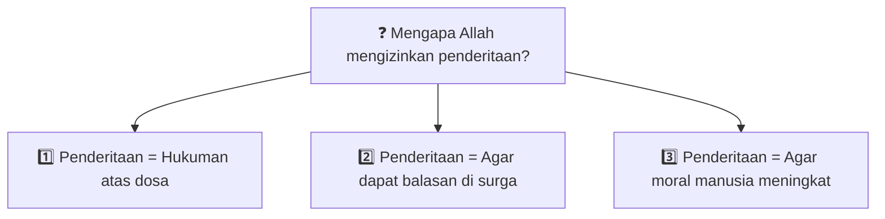

Namun setiap jawaban ini punya **celah** yang bisa didiskusikan:

**Bantahan atas jawaban 1** (penderitaan = hukuman): Bagaimana dengan anak-anak kecil yang tidak berdosa yang menjadi korban bencana? Bagaimana dengan ulama dan orang-orang saleh yang juga terkena musibah? Ini tidak bisa disebut sepenuhnya hukuman.

**Bantahan atas jawaban 2** (demi surga): Jika Allah Maha Baik dan Maha Kuasa, mengapa syarat untuk masuk surga harus disiksa dulu di dunia? Apakah Allah tidak bisa memberi surga tanpa ujian yang berat?

**Bantahan atas jawaban 3** (agar moral meningkat): Dalam kenyataannya, ada orang yang justru semakin putus asa, semakin jauh dari moralitas, bahkan ada yang murtad gara-gara bencana yang ia alami.

<Callout type="warning" title="Tentang Debat Teodisi">
Semua argumen di atas — baik yang pro maupun yang kontra — adalah produk pemikiran manusia. Dan karena manusia tidak sempurna, setiap argumen pasti punya celah. Bukan berarti tidak boleh berpikir kritis — justru berpikir kritis adalah tanda keimanan yang matang. Tapi kita harus rendah hati bahwa jawaban final tentang misteri penderitaan ada di tangan Allah, bukan di tangan logika manusia.
</Callout>

### 🛡️ Mengapa Tidak Bijak Menyebut Allah sebagai Sumber Penderitaan

Ada perspektif menarik tentang mengapa secara psikologis dan spiritual, pandangan bahwa "Allah adalah sumber penderitaan" justru *merugikan* manusia yang sedang menderita:

**Alasan 1:** Allah yang Maha Baik tidak mungkin menjadi sumber keburukan. Keburukan lahir dari manusia yang menjauh dari kebaikan.

**Alasan 2:** Penderitaan, apapun bentuknya, pasti ada tujuan baiknya — seperti orang tua yang melarang anak main game terus-menerus. Orang tua yang melarang bukan berarti membenci anak.

**Alasan 3 (yang paling kuat):** Ketika sedang menderita, pelarian terakhir manusia adalah Allah. Jika Allah sudah diposisikan sebagai *sumber* penderitaan — ke mana lagi kita akan berlari? Kita kehilangan tempat bergantung yang paling kuat di saat paling lemah. Ini justru membuat penderitaan semakin berat.

---

## Bagian XI: Tujuh Dosa Sumber Penderitaan — Mahatma Gandhi 🕊️

**Mahatma Gandhi** (*1869-1948*), tokoh kemerdekaan India yang terkenal dengan gerakan *ahimsa* (*tanpa kekerasan*), mengidentifikasi **tujuh dosa** yang menjadi sumber penderitaan dalam kehidupan bermasyarakat:

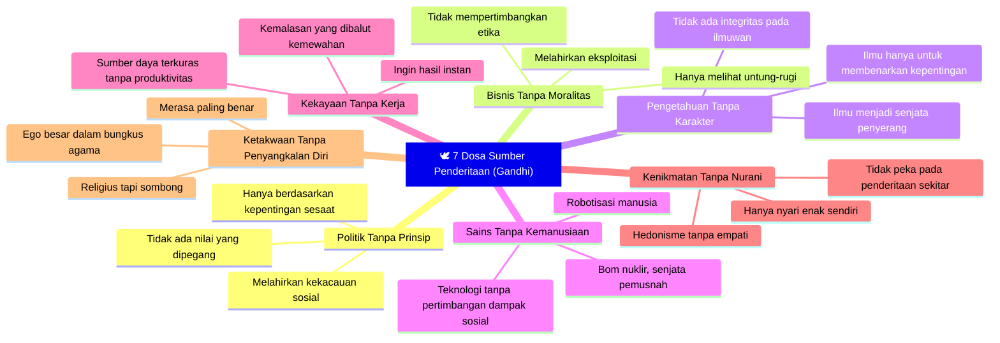

Ini adalah **penderitaan level kemasyarakatan** — bukan hanya penderitaan individu, tapi penderitaan yang lahir ketika tatanan masyarakat rusak oleh tujuh dosa ini.

---

## Bagian XII: Kunci Menghadapi Penderitaan — Empat Langkah dan Tiga Fase dengan Allah 🗝️

Setelah menjelajahi begitu banyak perspektif, sampailah kita pada yang paling penting: **bagaimana menghadapi penderitaan secara konkret?**

### 🔑 Empat Langkah Praktis

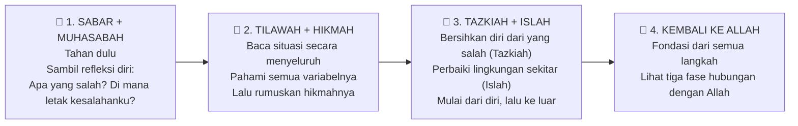

### ✨ Tiga Fase Hubungan dengan Allah di Saat Menderita

Ini adalah bagian paling mendalam dari seluruh kajian — tiga fase yang bisa kita alami ketika kita menapaki penderitaan bersama Allah:

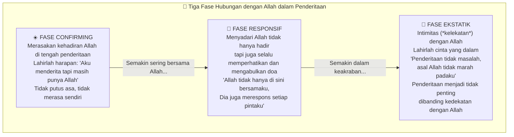

Fase ketiga — **fase ekstatik** (*ekstatik* = keadaan kebahagiaan spiritual yang meluap-luap) — adalah kondisi yang digambarkan oleh Nabi Muhammad ﷺ setelah melewati tahun-tahun penderitaan yang luar biasa:

Kehilangan Khadijah (*istri tercinta*), kehilangan Abu Thalib (*paman pelindung*), pergi berdakwah ke Thaif dan dilempari batu hingga berdarah-darah — namun yang keluar dari mulut beliau adalah doa yang sangat terkenal ini:

> *"Ya Allah, jika Engkau tidak marah padaku, aku tidak peduli. Sungguh, keluasan kemurahan-Mu bagiku sangat luas."*

Inilah **fase ekstatik** — ketika kedekatan dengan Allah sudah sedemikian dalam sehingga penderitaan yang paling berat pun terasa ringan karena ada Allah di dalamnya.

---

## Bagian XIII: Empat Quotes Penutup yang Menginspirasi 💬

### 1. Tim dari *Quotes about Suffering*
> *"All suffering is caused by being in the wrong place. If you are unhappy where you are — move."*
> *"Semua penderitaan lahir dari berada di tempat yang salah. Jika kamu tidak bahagia di tempatmu — pindahlah."*

Kadang penderitaan bukan karena kita lemah — tapi karena kita salah posisi, salah porsi, salah menempatkan diri. Jalan keluarnya: bergerak, pindah, ubah situasi.

### 2. Fyodor Dostoyevsky
> *"Pain and suffering are always inevitable for a large intelligence and a deep heart. The really great men must, I think, have great sadness on earth."*
> *"Rasa sakit dan penderitaan selalu tak terhindarkan bagi orang yang akalnya besar dan hatinya dalam. Orang-orang besar, menurutku, pasti mengalami kesedihan yang juga besar di bumi ini."*

Jangan berkecil hati dengan besarnya penderitaanmu. Bisa jadi itu tanda bahwa kamu memang ditakdirkan untuk menjadi orang yang besar.

### 3. *Quotes tentang Perubahan*
> *"Part of our human suffering is caused by our unwillingness to change along with the change around us. Don't fight change — embrace it."*
> *"Sebagian penderitaan kita lahir dari ketidakmauan kita untuk berubah bersama lingkungan yang sudah berubah. Jangan melawan perubahan — peluklah perubahan."*

Kekakuan hati adalah salah satu sumber terbesar penderitaan yang tidak perlu.

### 4. Aristoteles
> *"Suffering becomes beautiful when anyone bears great calamities with cheerfulness, not through insensibility but through greatness of mind."*
> *"Penderitaan menjadi indah ketika seseorang menanggungnya dengan keceriaan — bukan karena tidak peka, tapi karena pikirannya sudah luas."*

Tujuan akhir dari semua pemahaman tentang penderitaan ini adalah agar kita bisa **menanggung penderitaan dengan gembira** — bukan karena kita tidak merasakan sakitnya, tapi karena kita sudah cukup paham untuk tidak lagi tersiksa olehnya.

---

## Penutup: Penderitaan adalah Undangan 🌱

Dari seluruh perjalanan pemikiran yang panjang ini — dari Schopenhauer yang meminta kita mengendalikan keinginan, Nietzsche yang meminta kita mengiyakan dan berjuang, Camus yang meminta kita menikmati absurditas, Buddhisme yang melihat duka sebagai hakikat, Hinduisme yang mengingatkan konsekuensi karma, Taoisme yang mengajarkan melepas keterikatan, Sufisme yang menjadikan penderitaan sebagai jalan pembersihan, hingga Ki Ageng Suryomentaram yang melihat ritme mulur-mungkret sebagai keniscayaan — semuanya menunjukkan satu hal:

**Penderitaan bukan musuh yang harus diperangi habis-habisan.**

Penderitaan adalah **undangan** — undangan untuk tumbuh, untuk memahami diri lebih dalam, untuk membersihkan jiwa, untuk mendekat kepada Allah.

Dan bagi yang bisa menjalani tiga fase hubungan dengan Allah dalam penderitaan — dari *confirming* ke *responsif* hingga *ekstatik* — penderitaan itu akhirnya tidak lagi terasa seperti hukuman.

Ia terasa seperti **anugerah yang dibungkus dengan keras**.

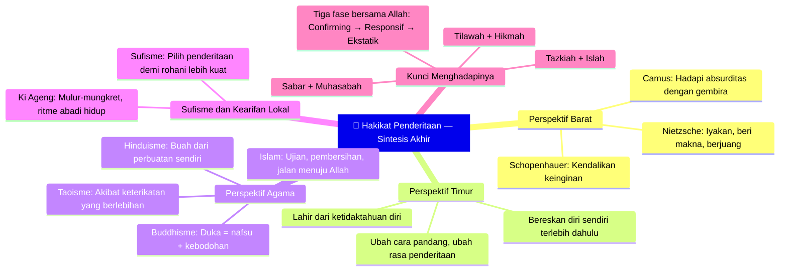

*Artikel ini adalah bagian dari seri Ngaji Filsafat. Artikel terkait: <WikiLink to="ngaji-filsafat-219-filsafat-waktu" label="Ngaji Filsafat 219: Filsafat Waktu" /> dan <WikiLink to="ngaji-filsafat-221-nizami-layla-majnun-alegori-cinta-ilahiah" label="Ngaji Filsafat 221: Layla Majnun — Alegori Cinta Ilahiah" />*
