## Pembuka: Filsuf Paling Bijaksana yang Tidak Ganteng 🏛️

Ada sebuah paradoks yang menarik dalam sejarah filsafat Barat.

Tokoh yang diakui sebagai **orang paling bijaksana di seluruh Yunani** — oleh peramal paling dihormati di kuil Delphi — adalah seorang pria yang secara fisik digambarkan sebagai paling tidak menarik se-Athena. Perutnya buncit, matanya agak melotot, hidungnya besar, pundaknya penuh bulu, kakinya agak bengkok, dan ia ke mana-mana tanpa sandal — *nyeker*.

Namanya **Socrates** (*470–399 SM*).

Ia bukan berasal dari keluarga bangsawan. Ayahnya pematung, ibunya bidan. Ia sendiri pernah membantu ayahnya membuat patung sebelum akhirnya menghabiskan sebagian besar hidupnya berjalan-jalan di seluruh penjuru kota Athena — nongkrong di pasar *Agora*, mendekati siapa pun, dan mengajukan pertanyaan-pertanyaan yang membuat orang terdiam, lalu sadar, lalu tersadar lagi.

Karena kebiasaannya inilah ia mendapat gelar yang sekarang terdengar lucu tapi dulu sangat bermakna: ***Gadfly of Athens*** — **Lalatnya Athena**. Ia terus-menerus "mengganggu" masyarakat agar berpikir lebih dalam.

Dan itulah tepatnya yang membuatnya berbahaya bagi penguasa. Pada usia sekitar 70 tahun, Socrates dihukum mati — dipaksa minum racun hemlock — karena dianggap **merusak pikiran pemuda Athena** dan tidak menghormati dewa-dewa negara. Sebuah akhir yang tragis bagi orang yang hidupnya diabdikan untuk kebenaran.

Namun sebelum kita membahas kehidupannya, ada satu pertanyaan yang jauh lebih penting untuk kita jawab hari ini: **Apa yang diajarkan Socrates tentang mengenali diri sendiri, dan mengapa itu relevan untukmu sekarang?**

<Callout type="abstract" title="Sumber Kajian">
Artikel ini merupakan ringkasan mendalam dari Ngaji Filsafat 379: Socrates — Mengenali Diri, oleh Dr. Fahruddin Faiz, M.Ag. Video aslinya tersedia di: [Ngaji Filsafat 379 — Socrates: Mengenali Diri](https://www.youtube.com/watch?v=bcR9xmnYNbk).
</Callout>

---

## Bagian I: Revolusi Berpikir Socrates — Dari Kosmos ke Manusia 🌌➡️👤

Sebelum era Socrates, para filsuf Yunani sibuk dengan satu pertanyaan besar: **apa hakikat alam semesta ini?**

Thales berpendapat segala sesuatu berasal dari air. Heraklitos melihat api sebagai prinsip dasar alam. Anaksimenes menyebut udara. Mereka semua berpikir tentang *Kosmos* — alam semesta dan mekanismenya. Cara berpikir ini disebut ***kosmosentris*** (*kosmos* = alam semesta, *sentris* = berpusat pada).

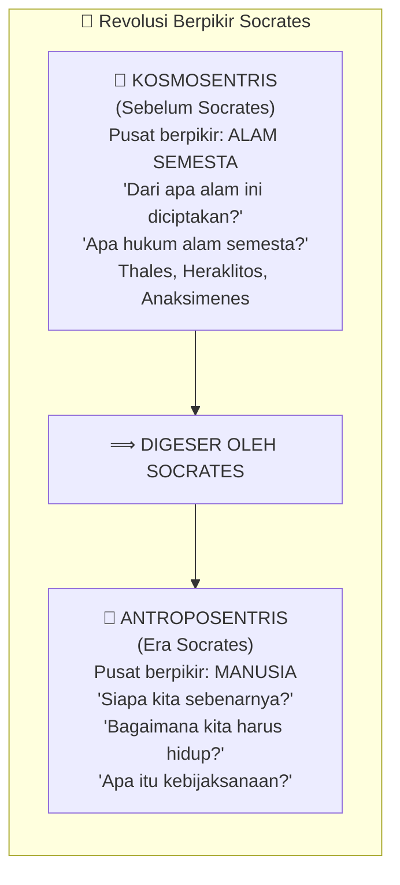

Socrates datang dan berkata: ada yang lebih penting dari semua itu. Bukan berarti alam tidak penting — tapi **manusianya** harus dibereskan dulu.

Pemikirannya adalah ***antroposentris*** (*antropos* = manusia): sebelum kita memahami Kosmos, kita perlu memahami diri kita sendiri terlebih dahulu. Karena yang akan membaca ayat-ayat alam itu adalah manusia — dan kalau manusianya belum beres, bacaannya pun tidak akan beres.

Dalam perspektif Islam, ini selaras dengan konsep bahwa ada empat jenis ayat (*tanda-tanda kekuasaan*) Allah yang harus dibaca manusia:

| Jenis Ayat | Istilah | Contoh |
|---|---|---|
| Wahyu tertulis | *Ayat Qauliah* | Al-Qur'an, hadis |
| Alam semesta | *Ayat Kauniah* | Langit, bumi, makhluk hidup |
| **Diri manusia** | **Ayat Nafsiah** | **Jiwa, pikiran, perilaku** |
| Sejarah | *Ayat Tarikhiah* | Peradaban, pengalaman bangsa-bangsa |

Socrates memilih fokus pada **ayat nafsiah** — membaca diri manusia. Dan dia benar: tanpa kacamata manusia yang sehat dan bening, semua bacaan lainnya pun akan menjadi keruh.

---

## Bagian II: Misi Socrates — Bukan Harta, Bukan Jabatan, tapi Kebaikan 🕊️

Socrates hidup miskin. Sementara kaum **sofis** (*sophists* — cendekiawan bayaran yang menjual ilmu dan kepandaian untuk kepentingan) hidup makmur dari pengaruh mereka, Socrates memilih jalan yang berbeda.

Dalam salah satu kutipannya yang paling kuat, ia berkata:

> *"Saya tidak peduli dengan hal-hal yang dipedulikan banyak orang — menghasilkan uang, memiliki rumah yang nyaman, pangkat militer atau sipil yang tinggi, organisasi, partai, penunjukan politik. Aku akan mempersembahkan diriku untuk sesuatu yang lebih: aku akan mencoba membujukmu untuk tidak terlalu memikirkan apa yang orang lain miliki, tetapi untuk menjadikan dirimu sebaik dan serasional mungkin."*

Ini bukan omong kosong. Ini adalah **manifesto hidup** Socrates — dan itulah yang akhirnya membuatnya dihukum mati. Ketika seseorang terus-menerus mengajak orang berpikir kritis terhadap otoritas, kekuasaan, dan norma yang berlaku, ia pasti akan berbenturan dengan yang berkuasa.

<Callout type="info" title="Apakah Socrates Seorang Nabi?">
Ada pendapat menarik — bahkan ada yang menulisnya dalam sebuah buku — bahwa Socrates mungkin adalah tokoh yang disebut dalam Al-Qur'an sebagai **Luqmanul Hakim**. Argumennya: kata "Luqman" berasal dari *laqoma* (menelan), sesuai dengan cara kematian Socrates yang dipaksa menelan racun. Sementara "al-Hakim" (yang penuh hikmah) sesuai dengan reputasinya sebagai filsuf. Ini bukan kesimpulan yang bisa dipastikan, tapi menarik untuk dijadikan bahan renungan dan diskusi.
</Callout>

---

## Bagian III: *Living Rightly* — Bukan Sekadar Hidup, tapi Hidup yang Benar ✨

Salah satu kutipan Socrates yang paling mendasar adalah:

> *"It is not living that matters, but living rightly."*
> *"Bukan sekadar hidup yang penting, melainkan hidup yang benar."*

Ini mengundang pertanyaan yang sangat mendasar: **apa bedanya?**

Siapapun bisa *sekadar hidup*. Mengalir mengikuti arus — yang lain sekolah, ikut sekolah; yang lain kuliah, ikut kuliah; yang lain menikah, ikut menikah; punya anak, bekerja, lalu meninggal. Ini bukan hidup yang jelek — tapi apakah ini benar-benar *hidup*?

Hamka pernah berkata: *"Kalau hidup hanya sekadar hidup, kera juga hidup. Kalau bekerja hanya sekadar bekerja, kerbau juga bekerja."*

Socrates ingin lebih dari itu. Ia ingin manusia hidup dengan **kebijaksanaan** — dan kebijaksanaan menurutnya memiliki tiga fondasi utama:

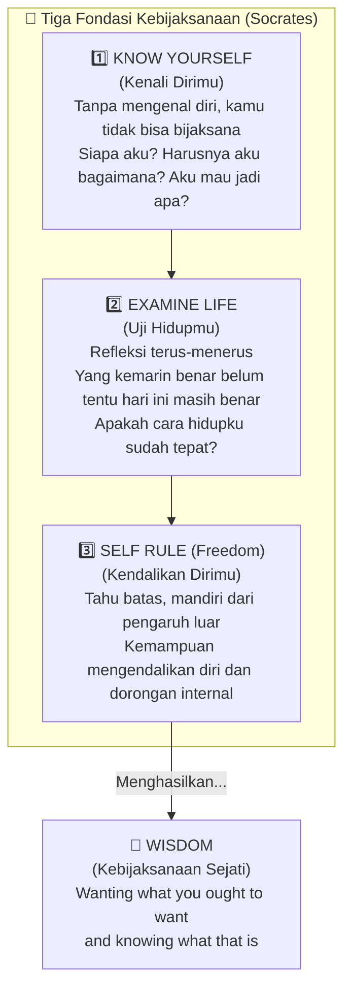

**Bijaksana** (*wisdom*) bukan sekadar benar. Banyak orang tahu yang benar tapi tidak bijaksana dalam menyampaikannya. Bijaksana adalah kemampuan **menerapkan kebenaran secara pas** — sesuai dosis, ruang, waktu, porsi, dan proporsinya.

Contoh sederhana: seorang dosen yang berhenti pada kebenaran akan memberi nilai *pas-pasan* kepada semua mahasiswa yang memang pas-pasan. Tapi dosen yang bijaksana ingat bahwa Allah memerintahkan tidak hanya *adil* tapi juga *ihsan* (kebaikan lebih) — kadang nilai C bisa naik menjadi B bukan karena ketidakadilan, tapi karena kebijaksanaan.

---

## Bagian IV: Gnothi Seauton — Kenali Dirimu 🔍

Kalimat paling terkenal dari Socrates, yang konon terukir di pilar-pilar Kuil Delphi (*Delfi*), adalah:

> ***Gnothi Seauton*** — **Kenali Dirimu** (*Know Thyself*)

Ini bukan sekadar slogan motivasi. Ini adalah program filosofis yang sangat dalam. Menurut Socrates, mengenali diri mencakup tiga dimensi:

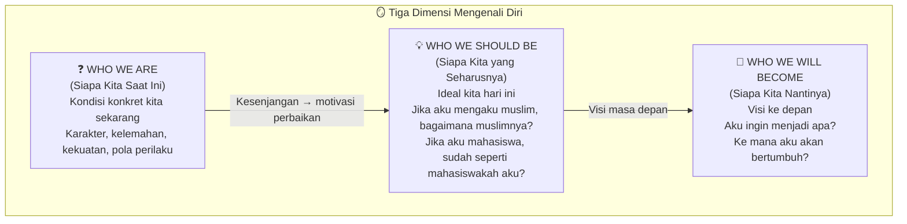

Tiga pertanyaan ini sederhana tapi berat jika dijawab dengan jujur:

1. **Siapa aku sebenarnya?** — Bukan nama dan alamat, tapi karakter, motivasi, pola, dan hal-hal yang benar-benar menggerakkanmu.
2. **Idealnya aku seharusnya bagaimana?** — Jika kamu mengaku beriman, sudah seperti apa imanmu? Jika kamu mahasiswa, sudah seperti apa perilaku akademismu?
3. **Nantinya aku ingin menjadi apa?** — Bukan cita-cita untuk CV, tapi visi terdalam tentang siapa dirimu di masa depan.

Socrates menyebut ini sebagai pondasi untuk mencapai kebahagiaan (*eudaimonia*). Tanpa mengenal diri, bahagia sejati tidak mungkin diraih — karena kamu tidak tahu apa yang sebenarnya kamu butuhkan.

### Dua Sisi Diri: Jiwa dan Raga 🌿

Langkah pertama dalam mengenal diri adalah menyadari bahwa kita memiliki **dua dimensi**:

| Dimensi | Sifat | Asupan yang Menyehatkan | Asupan yang Melemahkan |
|---|---|---|---|
| **Jasmani / Fisik** | Sementara, fana | Makanan bergizi, istirahat, olahraga | Racun, penyakit |
| **Rohani / Jiwa** | Lebih abadi, esensial | Kebaikan, keadilan, kebenaran, pengetahuan | Kekayaan, ketenaran, kekuasaan (sebagai tujuan) |

Socrates menegaskan: jiwa adalah kunci kebahagiaan. Dan jiwa hanya sehat jika yang dikejar adalah **kebaikan, keadilan, kebenaran, dan pengetahuan** — bukan kekayaan, ketenaran, dan kekuasaan.

Ini bukan berarti kekayaan dan ketenaran itu haram atau buruk. Tapi jika itu dijadikan *tujuan utama* hidup, jiwa akan melemah. Ketenaran itu rapuh — satu kesalahan kecil bisa menghancurkan nama baik yang dibangun puluhan tahun. Kekayaan itu sementara — dan jika identitas kita bergantung padanya, ketika ia habis, kita pun ikut hancur.

Anggaplah kekayaan dan ketenaran sebagai **efek samping** dari hidup yang benar — bukan sebagai tujuan. Jika datang, syukuri. Jika tidak datang, tidak apa-apa karena bukan itu yang dikejar.

---

## Bagian V: Johari Window — Peta untuk Mengenal Dirimu 🪟

Salah satu alat psikologi yang paling berguna untuk memahami konsep Socrates adalah ***Johari Window*** (*Jendela Johari*) — dikembangkan oleh dua psikolog dari University of California: **Joseph Luft** dan **Harry Ingham** (namanya digabung menjadi "Jo-Hari").

Teori ini membagi diri kita ke dalam empat kuadran berdasarkan apa yang diketahui oleh diri sendiri vs. orang lain:

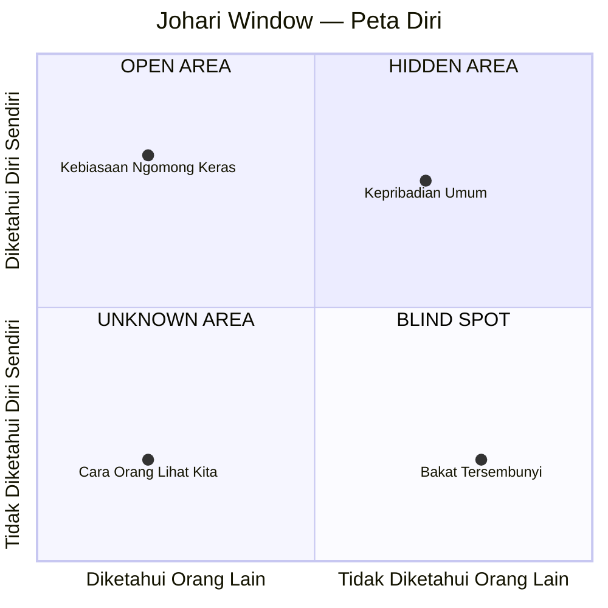

Penjelasan lebih rinci:

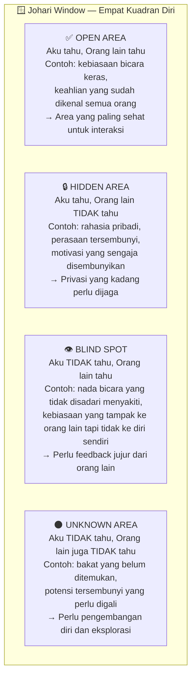

### 💡 Cara Membuka Setiap Kuadran

**Memperluas Open Area:** Sering berbagi tentang diri secara jujur dengan orang yang dipercaya.

**Mengungkap Blind Spot:** Minta feedback jujur dari teman dekat. Tanyakan: *"Menurutmu, aku ini orang seperti apa?"* Siaplah untuk mendengar hal yang tidak menyenangkan — karena di situlah pertumbuhan terjadi.

**Menjelajahi Unknown Area:** Keluar dari zona nyaman. Coba hal-hal baru. Eksplorasi minat yang belum pernah dicoba. *"Ternyata aku bisa bisnis juga"* — ini hanya mungkin terjadi jika kamu berani mencoba bisnis.

<Callout type="tip" title="Latihan Johari Window">
Ambil selembar kertas. Bagi menjadi empat bagian. Isi setiap bagian dengan hal-hal yang kamu ketahui tentang dirimu (Open + Hidden), dan minta satu teman jujur untuk mengisi apa yang mereka lihat tentangmu (Open + Blind Spot). Perbandingan keduanya bisa sangat mengejutkan — dan sangat bermanfaat.
</Callout>

---

## Bagian VI: Mengapa Mengenal Diri Itu Sulit? — Enam Hambatan Utama 🚧

Jika mengenal diri itu sepenting yang dikatakan Socrates, mengapa begitu banyak orang yang tidak benar-benar mengenal dirinya sendiri?

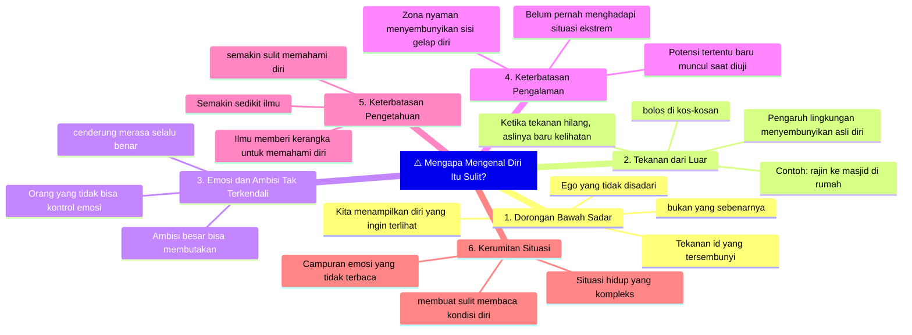

Hambatan yang paling sering dan paling halus adalah **tekanan ego dari dalam**. Manusia itu, ketika membaca dirinya sendiri, seringkali tidak objektif. Kita cenderung melihat diri kita dalam cahaya yang lebih baik — mencari alasan ketika salah, membesar-besarkan kebaikan yang kita lakukan.

Itulah mengapa Socrates menekankan bahwa mengenal diri **tidak hanya soal introspeksi diam-diam di kamar**. Justru ***interaksi dengan orang lain*** sering mengungkap siapa kita lebih akurat dibanding renungan sendirian.

---

## Bagian VII: Dampak Tidak Mengenal Diri — Di Tiga Aspek Kehidupan 💔

Socrates memberi peringatan konkret tentang apa yang terjadi ketika kita gagal mengenal diri.

### 1. 💑 Dalam Cinta dan Hubungan

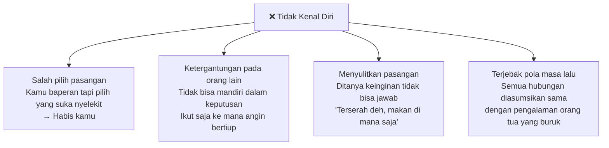

Mengenal diri sebelum mencari pasangan bukan romantisme murahan — ini adalah **kecerdasan emosional** (*emotional intelligence*). Kamu perlu tahu: aku ini orang yang seperti apa? Aku butuh orang yang bagaimana? Apa yang benar-benar penting bagiku dalam sebuah hubungan?

### 2. 💼 Dalam Pekerjaan dan Karier

Tanpa pengenalan diri, kamu akan:
- **Tidak jelas tentang cita-cita** — kerja di mana pun yang menerima, tanpa visi
- **Kehilangan peluang** yang cocok dengan kapasitasmu karena tidak mengenali kapasitas itu
- **Membuang waktu** untuk pekerjaan yang tidak sesuai dengan jiwa dan bakatmu
- **Salah pilih jurusan** — kuliah bertahun-tahun di tempat yang tidak cocok, baru sadar setelah lulus

Dalam Al-Qur'an pun ada konsep ini: *"Kullu yaq'malu 'ala syakilatih"* — **setiap orang bekerja sesuai dengan *sakilah*-nya** (kondisi, karakter, bakat, dan passionnya masing-masing).

### 3. 🤝 Dalam Kehidupan Sosial

Orang yang tidak mengenal dirinya:
- Tidak sadar bahwa gayanya terlihat sombong bagi orang lain, padahal dia merasa tawadu
- Terus-menerus merasa kesepian karena tidak tahu dirinya sendiri — bagaimana orang lain bisa memahaminya?
- Tidak bisa berempati dengan orang lain, karena memahami diri sendiri saja sudah sulit

---

## Bagian VIII: Menguasai Diri — Tiga Konsep Kunci dari Bahasa Yunani 🏛️

Setelah mengenal diri, langkah berikutnya adalah **menguasai diri**. Socrates menyebutnya dalam tiga konsep:

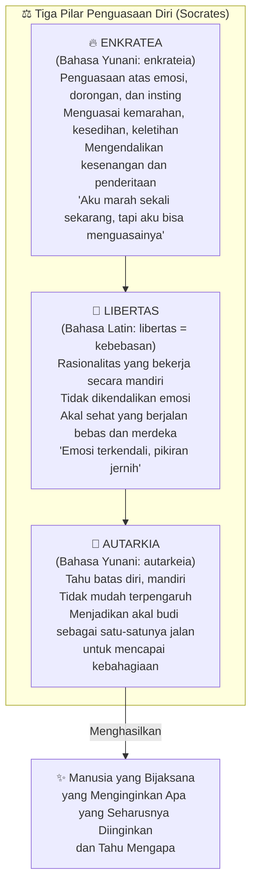

**Enkratea** (*penguasaan diri*) adalah lapisan pertama: kamu harus bisa menguasai emosi-emosimu. Marah itu boleh — tapi kamu yang harus menguasai kemarahanmu, bukan kemarahan yang menguasaimu.

**Libertas** (*kebebasan*) adalah lapisan kedua: ketika emosi sudah terkendali, akal sehat bisa berjalan dengan merdeka. Ini kebebasan yang sesungguhnya — bukan kebebasan dari tanggung jawab, tapi kebebasan dari perbudakan emosi.

**Autarkia** (*kecukupan diri*) adalah lapisan ketiga: orang yang *tahu batas* — mandiri dari pengaruh eksternal yang tidak perlu, dan menjadikan akal budi sebagai kompas utama dalam hidupnya.

---

## Bagian IX: Membentuk Diri — Enam Faktor yang Membentuk Siapa Kita 🏗️

Setelah mengenal dan menguasai diri, tiba saatnya **membentuk diri** (*self-formation*). Enam faktor yang mempengaruhi pembentukan diri:

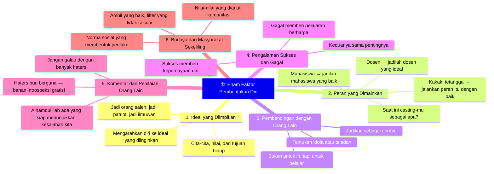

<Callout type="success" title="Tentang Haters">
Kata Dr. Fahruddin Faiz dengan jenaka: *"Alhamdulillah kalau punya haters. Ada orang yang siap sedia menunjukkan kesalahan kita sehingga kita bisa jadi lebih baik — dan tidak usah bayar."* Bagi yang tidak punya haters? *"Bikin iklan: dicari haters, tugasnya menilai diriku ini sudah baik apa belum."* 😄
</Callout>

---

## Bagian X: Menguji Diri — *An Unexamined Life is Not Worth Living* 🔬

Setelah mengenal diri, Socrates mengatakan satu hal yang bahkan lebih keras:

> ***"An unexamined life is not worth living."***
> ***"Hidup yang tidak diuji tidak layak untuk dihidupi."***

Ini bukan provokasi kosong. Ini adalah undangan untuk **senantiasa mempertanyakan** keyakinan, pilihan, dan arah hidupmu — bukan karena kamu tidak yakin, tapi justru *karena* kamu yakin bahwa kebenaran itu dinamis.

Yang kemarin benar, belum tentu hari ini masih benar. Yang hari ini cocok, belum tentu besok masih cocok. Dunia berubah, konteks berubah, dirimu pun berubah.

Istiqamah sejati bukan hanya *mengistikamahi kebaikan*, tapi **mengistikamahi perbaikan**. Ada bedanya:
- *Mengistikamahi kebaikan*: tahajud 2 rakaat sejak dulu, terus 2 rakaat saja meski sudah lebih mampu.
- *Mengistikamahi perbaikan*: dulu 2 rakaat karena baru bisa, sekarang sudah lebih kuat — naikkan jadi 4.

### 🔰 Triple Filter Socrates — Tiga Saringan untuk Segala Sesuatu

Dari kebiasaan menguji hidup ini lahirlah salah satu konsep paling praktis dari Socrates yang relevan hingga era media sosial hari ini: ***Triple Filter*** (*Tiga Saringan*).

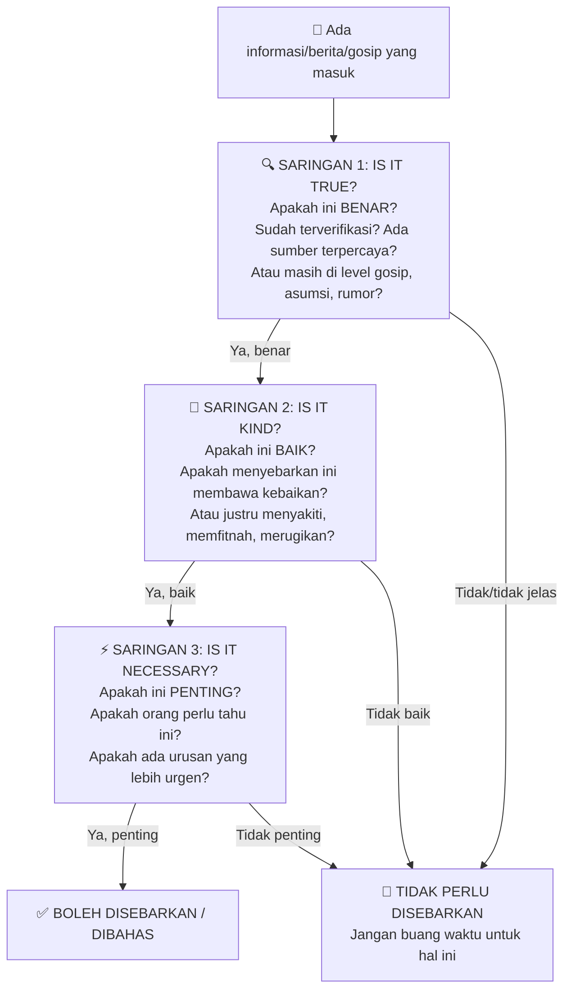

**Kisah asalnya:** Suatu hari, seorang teman datang ke Socrates dengan berkata: *"Aku membawa gosip baru dari kota yang menggosipkan dirimu dan murid-muridmu!"*

Socrates menjawab: *"Sebelum kamu cerita, jawab tiga pertanyaanku. Pertama, apakah yang kamu bawa itu pasti benar?"* — Temannya mengakui: belum tentu, namanya juga gosip. *"Kedua, apakah tentang hal-hal yang baik?"* — Tentu tidak, gosip ya tentang yang jelek-jelek. *"Ketiga, apakah saya perlu tahu itu? Apakah ada pengaruhnya jika saya tidak tahu?"* — Temannya mengakui: tidak ada pengaruhnya.

Socrates pun berkata: *"Gosip yang kamu bawa belum pasti benar, bukan tentang hal baik, dan aku tidak perlu tahu. Jadi untuk apa kamu ceritakan itu?"*

Ini sangat relevan hari ini. Berapa banyak waktu kita habiskan untuk hal-hal yang **tidak benar, tidak baik, dan tidak penting**? Triple filter Socrates bisa menjadi panduan literasi digital yang jauh lebih efektif dari banyak workshop komunikasi yang kita ikuti.

### 💬 Menguji Diri Melalui Dialektika — Bukan Hanya Introspeksi

Menguji diri tidak selalu berarti duduk diam merenung sendirian. Dari buku *Doris Mitchell Green*, Socrates dan Plato sebenarnya menggunakan instrumen yang disebut ***dialektika*** (*dialektik*) — argumen bolak-balik antara para pendebat yang siap menantang ide satu sama lain.

> *"Jika engkau ingin tahu pikiranmu, engkau harus mencoba meyakinkan orang lain tentang ide tersebut."*

Artinya: **bicaralah dengan orang yang bisa menantangmu.** Diskusi yang sehat adalah cermin terbaik untuk memeriksa kualitas pemikiranmu.

Untuk ini, dua kualitas yang diperlukan:

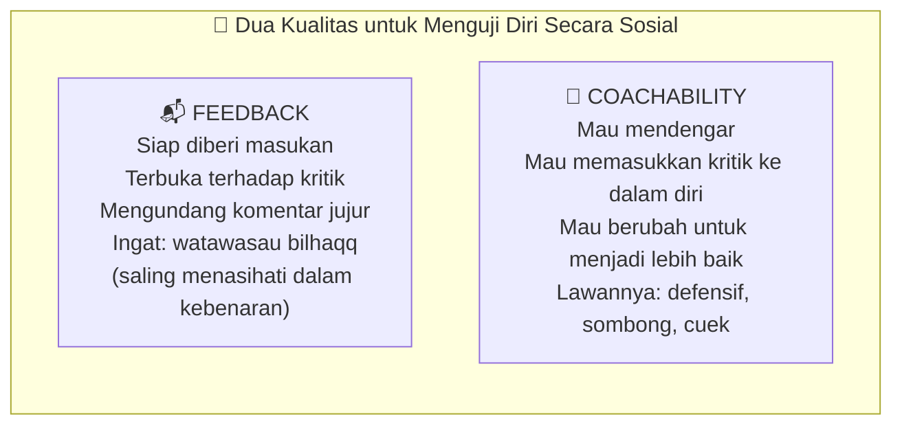

**Coachability** (*kemampuan untuk di-coach / dilatih / dinasihati*) adalah kualitas yang langka namun sangat menentukan pertumbuhan seseorang. Orang yang defensif — yang selalu punya alasan atas setiap kritik, yang selalu merasa paling benar — pada dasarnya telah menutup pintu pertumbuhannya sendiri.

---

## Bagian XI: Membaca Diri — Empat Lensa Analisis 🔭

Ketika kita mencoba membaca dan memahami diri, ada empat lensa yang perlu dicermati:

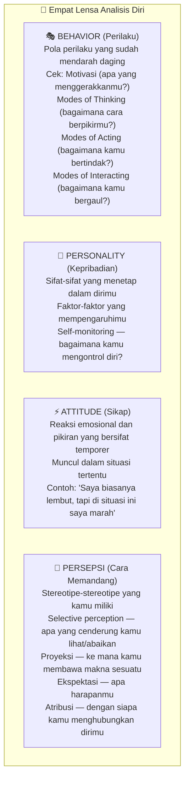

Ini bukan teori psikologi yang harus dikuasai secara akademis. Ini adalah **peta untuk mengamati diri sendiri** dengan lebih teliti dan jujur.

---

## Bagian XII: Empat Quotes Socrates yang Mengubah Cara Pandang 💬

### 1. Tentang Meningkatkan Diri (Bukan Menjatuhkan Orang Lain)

> *"The easiest and noblest way is not to destroy others, but to improve yourself."*
> *"Jalan paling mudah dan paling mulia adalah bukan menghancurkan orang lain, melainkan meningkatkan kualitas dirimu sendiri."*

Ini sangat relevan di era media sosial. Kita sering melihat orang yang merasa lebih tinggi dengan cara *menjatuhkan* orang lain — membongkar kelemahan, menyebarkan aib, mendebat dengan niat merendahkan. Ini mungkin berhasil membuat lawan terlihat lebih rendah. Tapi apakah itu membuatmu naik?

Al-Qur'an sudah mengajarkan: *fastabiqul khayraat* — **berlombalah dalam kebaikan**. Bukan berlomba dalam menghancurkan. Tunjukkan bahwa kebaikanmu lebih banyak, kualitasmu lebih tinggi. Itu jauh lebih mulia.

### 2. Tentang Kebijaksanaan Sejati

> *"Wisdom is knowing how little we understand about life, ourselves, and the world around us."*
> *"Kebijaksanaan adalah ketika kamu menyadari betapa sedikitnya yang kamu pahami tentang hidup, dirimu, dan dunia di sekelilingmu."*

Orang yang semakin pintar biasanya semakin *tawadu* (*rendah hati*) — bukan karena memaksa diri rendah hati, tapi karena ia sadar betapa banyak hal yang belum ia ketahui. Setiap satu informasi yang kita dapat biasanya diikuti sepuluh pertanyaan baru. Itulah mengapa orang bijak itu menunduk — bukan karena lemah, tapi karena sadar.

Socrates terkenal dengan ungkapan: *"Satu-satunya yang aku tahu adalah bahwa aku tidak tahu apa-apa."*

### 3. Tentang Belajar

> *"Smart people learn from everything and everyone. Average people learn from their experiences. Stupid people already have all the answers."*
> *"Orang pintar belajar dari segalanya dan dari siapapun. Orang biasa belajar dari pengalamannya. Orang bodoh sudah merasa punya semua jawaban."*

Jika kamu merasa sudah tahu segalanya dan tidak ada yang perlu dipelajari lagi — itulah tanda berhentinya pertumbuhan. Dalam Islam, belajar itu wajib sepanjang hayat. Orang yang merasa sudah pintar dan tidak perlu belajar lagi sedang meninggalkan kewajiban agamanya.

### 4. Tentang Mengubah Dunia

> *"Let him that would move the world, first move himself."*
> *"Biarlah dia yang bercita-cita mengubah dunia, pertama-tama menggerakkan dirinya sendiri."*

Socrates menggeser pemikiran dari kosmosentris ke antroposentris — dan quote ini adalah manifestasinya dalam kehidupan praktis. Sebelum kamu ingin mengubah orang lain, masyarakat, bangsa, atau dunia — **mulailah dari dirimu sendiri**. Perubahan terbesar selalu dimulai dari dalam.

---

## Bagian XIII: Tiga Tahap — Mengenal, Menguasai, Membentuk Diri 🗺️

Seluruh ajaran Socrates tentang *know thyself* bermuara pada satu perjalanan yang terdiri dari tiga tahap:

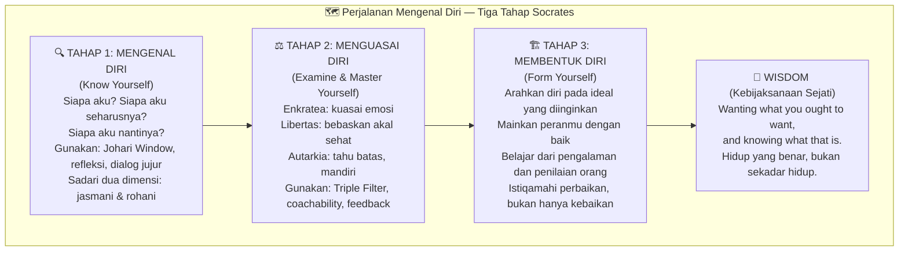

---

## Penutup: *The Greater the Difficulty, The Greater the Glory* 🌟

Socrates meninggalkan satu pesan terakhir yang cocok menjadi penutup perjalanan kita:

> *"The greater the difficulty, the greater the glory of overcoming it."*
> *"Semakin besar kesulitannya, semakin besar kejayaan yang kita rasakan saat menaklukkannya."*

Mengenal diri itu memang sulit. Lebih mudah untuk mengalir saja, ikut arus, tidak pernah bertanya terlalu dalam tentang siapa kita sebenarnya. Tapi Socrates mengatakan: justru karena sulit itulah, ketika kamu berhasil mengenali dirimu, kebahagiaan yang kamu rasakan akan berlipat ganda.

Jadi mulailah dari hal sederhana:
- Tulislah tentang dirimu sendiri. Siapa kamu hari ini?
- Petakan dirimu dengan Johari Window.
- Tanyakan kepada teman yang paling jujur: *"Menurutmu, aku ini orang seperti apa?"*
- Setiap kali mau menyebarkan sesuatu, terapkan Triple Filter.
- Dan setiap beberapa bulan, tanya kembali: *Apakah hidupku saat ini sudah sesuai dengan yang seharusnya? Apakah saatnya melakukan perbaikan?*

Karena pada akhirnya, **kesuksesan, kebahagiaan, dan kemuliaan** — semuanya dimulai dari satu langkah yang tampak sederhana namun menjadi paling langka dilakukan:

**Kenali dirimu.** 🪞

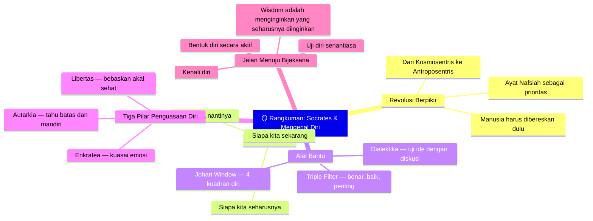

*Artikel ini adalah bagian dari seri Ngaji Filsafat. Artikel terkait: <WikiLink to="ngaji-filsafat-264-menyelami-penderitaan" label="Ngaji Filsafat 264: Menyelami Penderitaan" /> dan <WikiLink to="ngaji-filsafat-219-filsafat-waktu" label="Ngaji Filsafat 219: Filsafat Waktu" />*
