## Pembuka: Buku yang Terlalu Berani untuk Zamannya 📖🔥

Bayangkan kamu menulis sebuah buku yang sudah kamu tahu sejak awal akan dilarang, dikecam, dan tidak akan bisa diterbitkan.

Itulah yang terjadi dengan **Napoleon Hill** pada tahun **1938**. Ia menyelesaikan sebuah manuskrip yang ia sebut sebagai *transkrip percakapannya dengan Iblis* — sebuah wawancara imajiner yang radikal, provokatif, dan melampaui batas norma sosial zamannya. Bahkan di dalam buku itu sendiri, sang Iblis sudah "memperingatkan" Napoleon bahwa buku ini akan dilarang dan dibenci orang.

Dan memang begitulah yang terjadi.

Manuskrip itu tersimpan selama **72 tahun** — baru akhirnya diterbitkan pada **2011** oleh The Napoleon Hill Foundation, dengan editorial oleh Sharon Lechter. Dan hasilnya luar biasa: buku ini langsung relevan, masih dibaca, dan masih membakar pikiran orang hingga hari ini.

**Judulnya: *Outwitting the Devil*** — **Mengalahkan Iblis.**

Tapi tunggu dulu — ini bukan buku tentang sihir, okultisme, atau kepercayaan supernatural. Ini adalah buku ***self-help*** — pengembangan diri — yang menggunakan "Iblis" sebagai **paradigma** (*sudut pandang*) untuk membedah kelemahan-kelemahan terdalam manusia. Napoleon Hill menggunakan tokoh Iblis sebagai metafora untuk semua kekuatan negatif yang ada dalam pikiran manusia — rasa takut, kemalasan, kebiasaan buruk, dan mentalitas pasrah.

Seperti kata Napoleon Hill sendiri: *banyak yang bisa kita pelajari dari Iblis.* Atau dari siapapun yang merepresentasikan sisi gelap — karena seperti kata pepatah, *tidak ada cahaya tanpa mengenal kegelapan.*

Dan Kartini pun pernah berkata: **habis gelap, terbitlah terang.**

<Callout type="abstract" title="Sumber Kajian">
Artikel ini merupakan ringkasan mendalam dari Eps 40: Menggali Kebijaksanaan dari Iblis — Podcast Dede Issues, membahas buku *Outwitting The Devil* karya Napoleon Hill (ditulis 1938, diterbitkan 2011). Video aslinya tersedia di: [Eps 40 — Outwitting The Devil](https://www.youtube.com/watch?v=gcJvkkZHkAk).
</Callout>

---

## Bagian I: Napoleon Hill — Bapak Genre Self-Help Modern 🏛️

Sebelum masuk ke isi buku, penting untuk memahami siapa Napoleon Hill dan mengapa kata-katanya masih relevan hampir satu abad kemudian.

**Napoleon Hill** (*1883–1970*) adalah penulis buku pengembangan diri yang buku-bukunya menjadi fondasi dari hampir semua buku motivasi modern yang kamu baca sekarang. Ia adalah ***Father of Self-Help Books*** — Bapak genre buku pengembangan diri.

Karyanya yang paling terkenal, *Think and Grow Rich* (1937), telah terjual lebih dari **100 juta kopi** dan menjadi salah satu buku terlaris sepanjang sejarah. Hampir semua guru motivasi, life coach, dan penulis self-help modern — dari Tony Robbins hingga Robert Kiyosaki — mengakui pengaruh Hill terhadap pemikiran mereka.

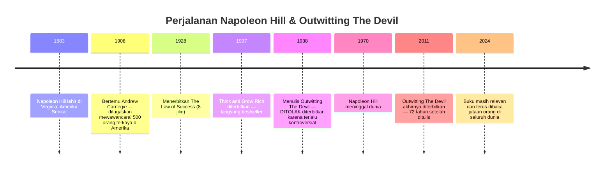

Yang membuat *Outwitting the Devil* berbeda dari karya Hill lainnya adalah pendekatannya yang sangat unik: ia **tidak** mengajarkan dari sudut pandang kesuksesan. Ia mengajarkan dari sudut pandang **kegagalan** — dengan meminjam suara Iblis sebagai narator yang mengungkap semua kelemahan manusia dengan jujur dan tanpa belas kasihan.

---

## Bagian II: Senjata Utama Iblis — Rasa Takut 😨

Menurut Napoleon Hill dalam wawancara imajiner ini, **kekuatan terbesar Iblis bukanlah tipu daya atau kutukan**. Kekuatannya jauh lebih sederhana dan jauh lebih mematikan:

**Rasa Takut.**

> *"Iblis tidak butuh kamu percaya bahwa dia ada. Dia hanya butuh kamu takut."*

Ini adalah insight yang sangat tajam. Pernahkah kamu bertemu seseorang yang dengan bangga berkata *"Saya tidak percaya setan!"* — tapi ketika ada suara aneh di malam hari, atau ketika melihat orang berpakaian kostum setan, dia lari terbirit-birit?

Persis. Iblis tidak peduli soal kepercayaan. Yang penting adalah **ketakutan**.

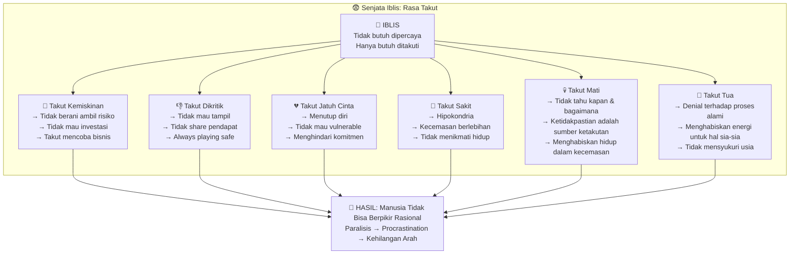

Dari semua ketakutan ini, ada satu yang paling halus dan paling merusak: **ketakutan yang berujung pada kemalasan dan penundaan** (*procrastination*). Ketika kamu takut akan sesuatu, kamu tidak melakukan apa-apa. Kamu menunda. Kamu mencari alasan. Kamu kehilangan motivasi. Dan akhirnya, kamu **kehilangan arah**.

Inilah yang Napoleon Hill sebut sebagai: ***The Habit of Drifting*** — Kebiasaan Mengapung Tanpa Arah.

### Tentang Rasa Takut akan Kematian

Ada insight yang sangat mendalam tentang mengapa manusia takut mati. Menurut Hill, masalahnya bukan pada kematian itu sendiri — melainkan pada **ketidakpastian** (*uncertainty*):

> *"Masalah dengan mati bukan tentang mati itu sendiri. Masalah dengan mati adalah kamu tidak tahu **kapan** dan **bagaimana**."*

Jika seseorang tahu dengan pasti bahwa ia akan mati besok jam 3 sore, ia tidak akan takut — ia hanya akan mempersiapkan diri. Yang membuat takut adalah ketidakhadiran informasi itu. ***You don't know the uncertainty*** — itulah sumber ketakutan sesungguhnya.

<Callout type="info" title="Takut sebagai Motivator?">
Rasa takut tidak selalu negatif. Dalam dosis yang tepat, rasa takut bisa menjadi **motivator** yang kuat. Takut miskin bisa mendorongmu bekerja keras. Takut sakit bisa mendorongmu hidup sehat. Yang menjadi masalah adalah ketika rasa takut itu **melumpuhkanmu** — membuatmu berhenti, menunda, dan tidak melakukan apa-apa. Rasa takut yang fungsional adalah yang mendorongmu maju, bukan yang menahanmu di tempat.
</Callout>

---

## Bagian III: Drifter — Manusia yang Hidupnya Mengapung 🌊

Salah satu konsep paling kuat dalam buku ini adalah konsep **drifter** — secara harfiah berarti "orang yang mengapung" atau "orang yang melayang tanpa arah".

Drifter adalah orang yang **membiarkan hidup membawanya ke mana saja** — tanpa tujuan, tanpa keputusan aktif, hanya mengikuti arus. Ia hanya menjadi **penumpang** dalam hidupnya sendiri — bukan pengemudi.

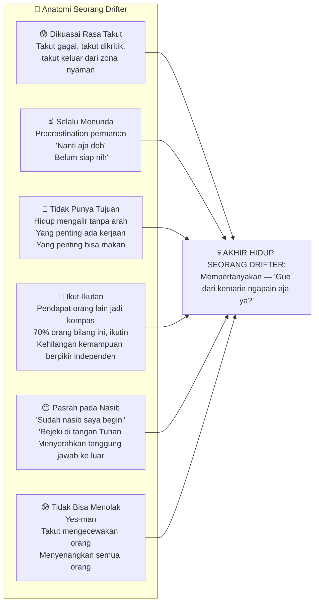

### Mengapa "Pasrah pada Nasib" Bisa Berbahaya?

Ada nuansa yang sangat menarik tentang konsep pasrah. Kita sering mendengar kalimat seperti: *"Rejeki di tangan Tuhan"* atau *"Jodoh sudah ditentukan di atas"*. Ini bukan salah — secara teologis memang benar.

Tapi Napoleon Hill menyoroti sesuatu yang penting: **ketika kepasrahan itu digunakan sebagai *alasan* untuk tidak berusaha**, di situlah masalahnya. Ketika seseorang berkata *"ya sudah, miskin memang nasib saya"* lalu tidak melakukan apa-apa untuk mengubah kondisinya — itulah yang dimanfaatkan oleh mentalitas Iblis.

Tidak ada kutipan bijak yang berbunyi *"Berdoa, lalu terima saja hasilnya."* Yang ada adalah: **berdoa dan bekerja keras**. Jika kamu menginginkan sesuatu, kejarlah. Doakan, lalu ambil langkah nyata. Seperti kata pepatah sederhana: *"Lu mau cewek? Kejar ceweknya. Jangan blok terus minta Tuhan yang ngatur."*

Iblis senang dengan orang yang menyerahkan semua kepada takdir sambil duduk diam. Karena Tuhan pun akan berkata: *"Kenapa kamu yang miskin menyalahkan Aku? Itu bukan urusanku — kamu yang tidak mau berusaha."*

---

## Bagian IV: Bagaimana Iblis Masuk — Tiga Jalur Infiltrasi 👻

Pertanyaan berikutnya: bagaimana mentalitas Iblis ini bisa masuk ke dalam pikiran manusia? Napoleon Hill mengidentifikasi tiga jalur utama:

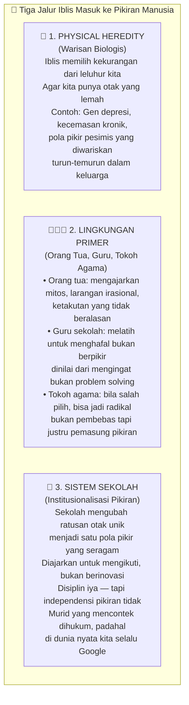

### 💡 Tentang Sistem Sekolah

Ini adalah kritik yang keras namun jujur: sistem pendidikan tradisional lebih banyak melatih **memori** daripada **pemikiran kritis**. Murid dinilai dari seberapa baik ia mengingat jawaban yang sudah ditentukan — bukan dari seberapa kreatif ia memecahkan masalah.

Bandingkan dengan dunia kerja nyata: hampir semua pekerjaan mengharuskan *problem-solving*, *collaboration*, dan *creative thinking* — bukan menghafal. Bahkan Google pun ada di genggamanmu.

Menariknya, "menyontek" dalam konteks yang tepat sebenarnya adalah **belajar dari orang lain** — sesuatu yang justru sangat dihargai di dunia profesional. Mengambil inspirasi, memodifikasi, dan membuat versi yang lebih baik adalah inti dari inovasi.

Jadi, ini bukan salah sekolah sepenuhnya. Sekolah mengajarkan disiplin — dan itu berharga. Tapi **independensi berpikir** (*independent thinking*) harus datang dari rumah, dari lingkungan, dan dari kesadaran diri sendiri. Sekolah memberimu disiplin; kamu sendiri yang harus membangun pemikiranmu.

<Callout type="warning" title="Mitos yang Ditanamkan Sejak Kecil">
Banyak ajaran yang kita terima sejak kecil ternyata tidak logis: *"Jangan pulang malam, nanti diculik wewe gombel"* — ini bukan penjelasan, ini ketakutan. *"Kalau tidak makan habis, orang Afrika yang kelaparan"* — tidak ada hubungannya. Ajaran-ajaran seperti ini, menurut Napoleon Hill, adalah cara Iblis masuk: melalui mitos yang membuat kita tidak bisa berpikir rasional. Kenali mana ajaran yang membangun pikiran dan mana yang membelenggunya.
</Callout>

---

## Bagian V: The Law of Hypnotic Rhythm — Hukum Ritme Hipnotis 🔄

Salah satu konsep paling canggih dalam buku ini adalah apa yang Napoleon Hill sebut sebagai ***The Law of Hypnotic Rhythm*** — **Hukum Ritme Hipnotis**.

Konsepnya sederhana namun sangat dalam: **pengulangan kebiasaan menciptakan pola yang permanen**. Dan pola yang permanen itu bisa berupa kebiasaan baik *atau* buruk.

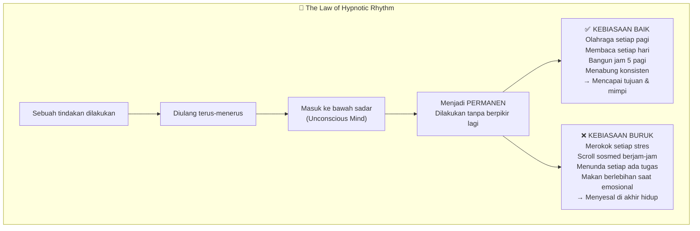

Ini adalah mekanisme yang sama di balik semua kebiasaan — baik maupun buruk. Ketika seseorang pertama kali mencoba rokok, rasanya tidak enak (bahkan pahit dan mual). Tidak ada anak kecil yang *secara alami* menyukai rokok. Tapi karena lingkungan, karena tekanan sosial, karena *"semua orang melakukannya"*, seseorang mulai mencoba. Kemudian mencoba lagi. Lalu lagi. Hingga otak beradaptasi, nikotin menciptakan ketergantungan kimia, dan tiba-tiba *tidak merokok* terasa tidak nyaman.

Hukum Ritme Hipnotis bekerja dalam **dua arah** — ia akan mengukuhkan apapun yang kamu ulang. Maka pertanyaannya bukan *"bagaimana saya menghindari hukum ini?"* melainkan: **"kebiasaan apa yang ingin saya kukuhkan menjadi permanen dalam hidup saya?"**

### Delayed Gratification vs Instant Gratification ⏱️

Ini adalah salah satu pertarungan terpenting dalam kehidupan modern: **kepuasan yang tertunda (*delayed gratification*)** versus **kepuasan instan (*instant gratification*)**.

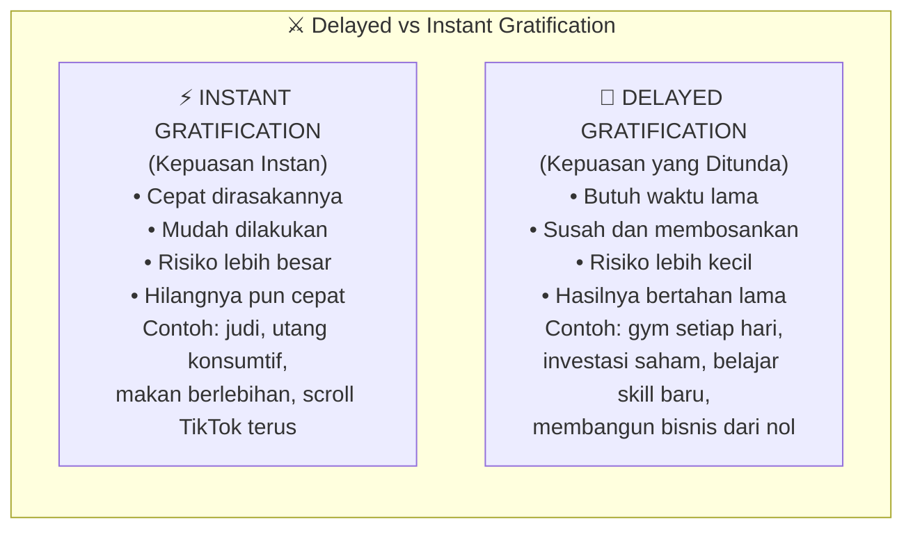

Orang yang pergi ke gym setiap hari dan tidak melihat perubahan badan selama berbulan-bulan — namun tetap pergi — adalah contoh luar biasa dari *delayed gratification*. Itu bukan sesuatu yang mudah. Karena setiap hari, otak kamu memberikan sinyal: *"Buat apa? Tidak ada bedanya. Lebih baik istirahat di rumah."* Dan setiap hari, ia harus melawan sinyal itu.

Itulah yang membuat orang-orang dengan kemampuan *delayed gratification* sangat langka — dan sangat sukses.

> *"Hal-hal yang baik butuh waktu. True love is hard to get; the rush is easy to get."*

---

## Bagian VI: Dominating Thoughts — Pikiran yang Mendominasi 🧠

Senjata ketiga Iblis adalah **pikiran yang mendominasi** (*dominating thoughts*) — yaitu kemampuan memenuhi pikiran manusia dengan hal-hal negatif yang tidak produktif.

Di era modern, ini jauh lebih efektif dari zaman Napoleon Hill karena ada satu hal yang tidak ada di tahun 1938: **media sosial**.

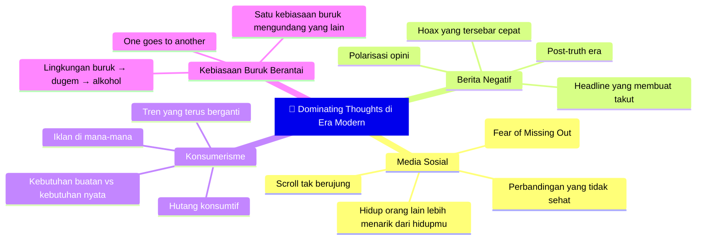

Ada satu insight yang sangat menarik tentang mengapa serangan di media sosial terasa begitu sakit meski datang dari orang asing yang bahkan tidak kamu kenal:

> *"Kenapa kamu marah ketika dikatain di Instagram padahal mereka tidak di-mention? Karena kamu percaya bahwa Instagram adalah **rumahmu** — homepage-mu. Dan ketika ada orang masuk ke rumahmu lalu berkata 'Kamu goblok!', tentu saja kamu marah."*

Media sosial telah menjadi **perluasan identitas** kita. Kita merasakannya bukan sebagai "platform digital" tapi sebagai "ruang di mana saya berada". Dan Iblis sangat pintar memanfaatkan ruang itu — menaruh pikiran negatif, perbandingan yang menyakitkan, dan drama yang menguras energi di tempat yang paling kita percaya.

---

## Bagian VII: Menjadi Non-Drifter — 7 Prinsip untuk Mengalahkan Iblis 🛡️

Di sinilah inti dari buku ini. Napoleon Hill, setelah mewawancarai Iblis tentang semua kelemahan manusia, akhirnya bertanya: *"Baiklah. Lalu bagaimana cara mengalahkanmu?"*

Jawabannya sederhana: **Jadilah Non-Drifter.**

Dan ada **7 prinsip** yang membentuk seorang Non-Drifter:

```mermaid
flowchart TD
    subgraph SEVEN["🛡️ 7 Prinsip Non-Drifter"]
        P1["1️⃣ DEFINITENESS OF PURPOSE<br/>(Ketegasan Tujuan)<br/>Punya tujuan yang jelas<br/>Kejar tujuan itu tanpa lelah<br/>Bahkan ketika hasilnya belum kelihatan<br/>→ Ini adalah delayed gratification dalam aksi"]
        P2["2️⃣ MASTERY OF SELF<br/>(Penguasaan Diri / Disiplin)<br/>Disiplin itu memberi kebebasan<br/>Katakan YA untuk hal yang membantumu<br/>Katakan TIDAK untuk hal yang merugikanmu<br/>→ Kebebasan sejati datang dari disiplin"]
        P3["3️⃣ LEARNING FROM ADVERSITY<br/>(Belajar dari Kegagalan)<br/>Gagal itu normal — semua orang gagal<br/>Setiap kesulitan mengandung manfaat<br/>Jawab setiap masalah dengan: GOOD<br/>→ Bagaimana ini bisa berakhir baik buat saya?"]
        P4["4️⃣ CONTROLLING ENVIRONMENT<br/>(Kendalikan Lingkungan)<br/>Lingkunganmu menentukan siapa kamu<br/>Jika kamu tidak bisa mewarnai lingkungan<br/>lingkungan yang akan mewarnaimu<br/>→ Keluar jika perlu. Pilih lingkunganmu dengan sadar"]
        P5["5️⃣ TIME<br/>(Waktu & Delayed Gratification)<br/>Waktu adalah netral — ia mengukuhkan apapun<br/>yang kamu ulang, baik maupun buruk<br/>Segala sesuatu yang baik butuh waktu<br/>→ Tidak ada orang kaya dalam semalam yang bertahan"]
        P6["6️⃣ HARMONY<br/>(Jadilah Aktor Utama Hidupmu)<br/>Kamu yang paling penting dalam hidupmu<br/>Jangan sibuk menyenangkan semua orang<br/>Hanya dengarkan kritik dari yang selevel atau lebih tinggi<br/>→ Orang yang mengkritikmu belum tentu lebih baik darimu"]
        P7["7️⃣ CAUTION<br/>(Kehati-hatian & Perencanaan)<br/>Pikirkan sebelum bertindak<br/>Pertimbangkan dampak jangka panjang<br/>Rencanakan dengan matang<br/>→ Jangan impulsif. Pikirkan: ini efeknya apa ke hidupmu?"]
    end

    P1 --> P2 --> P3 --> P4 --> P5 --> P6 --> P7
    P7 --> RESULT["🏆 NON-DRIFTER<br/>Punya tujuan, mandiri, bertanggung jawab,<br/>menginspirasi orang lain,<br/>dan menjadi aktor utama hidupnya sendiri"]
```

Mari kita bahas setiap prinsip secara lebih mendalam.

---

## Bagian VIII: Bedah 7 Prinsip Non-Drifter 🔍

### 1️⃣ Definiteness of Purpose — Ketegasan Tujuan

*"Punya tujuan dan raih tujuan itu tanpa lelah."*

Ini adalah prinsip pertama dan paling fundamental. Tanpa tujuan yang jelas, kamu adalah seorang drifter secara definisi — karena tanpa arah, hidupmu akan dibentuk oleh kekuatan-kekuatan eksternal: opini orang lain, tren sosial, atau sekadar mengikuti apa yang dilakukan orang di sekitarmu.

Tujuan yang kuat bukan hanya soal "aku ingin kaya" atau "aku ingin sukses". Tujuan yang kuat adalah spesifik, terukur, dan **cukup bermakna** sehingga kamu mau berjuang untuk itu bahkan ketika tidak ada hasilnya yang kelihatan dalam jangka pendek.

> *"Tidak ada orang kaya dalam sehari. Orang kaya dalam sehari biasanya miskin lagi."*

Kekayaan yang dibangun perlahan — melalui bisnis yang ditempa bertahun-tahun, keahlian yang diasah setiap hari — adalah kekayaan yang bertahan. Ini adalah *definiteness of purpose* dalam aksi.

### 2️⃣ Mastery of Self — Disiplin sebagai Kebebasan

Ada paradoks yang sangat indah di sini: **disiplin itu memberi kebebasan**, bukan mengambilnya.

Kebanyakan orang berpikir bahwa orang disiplin adalah orang yang terikat aturan, kaku, dan tidak bebas. Padahal justru sebaliknya. Orang yang disiplin dengan keuangannya bebas dari utang. Orang yang disiplin dengan kesehatannya bebas dari penyakit. Orang yang disiplin dengan waktunya bebas untuk melakukan hal-hal yang benar-benar ia inginkan.

*Mastery of self* juga berarti kemampuan untuk **berkata tidak**. Ini adalah skill yang langka dan sangat berharga — kemampuan untuk menolak sesuatu yang menarik namun merugikanmu dalam jangka panjang. Yes-man tidak punya ini. Drifter tidak punya ini.

### 3️⃣ Learning from Adversity — Jadikan Kegagalan sebagai Guru

> *"Good."*

Satu kata yang menurut Napoleon Hill bisa mengubah cara kamu merespons masalah. Ketika sesuatu yang buruk terjadi, reaksi pertama yang benar bukan panik, bukan menyalahkan orang lain, dan bukan larut dalam kesedihan — tapi bertanya: **"Bagaimana ini bisa berakhir baik buat saya?"**

Dipecat? Good. Berarti ini kesempatan untuk karier yang lebih baik.
Putus? Good. Berarti ada pelajaran tentang dirimu dan apa yang sebenarnya kamu butuhkan.
Bisnis gagal? Good. Berarti kamu baru saja mendapatkan MBA termahal dan paling berkesan dalam hidupmu.

Ini bukan denial atau positivity palsu. Ini adalah **reframing** (*pemaknaan ulang*) yang aktif — memilih untuk mengambil manfaat dari setiap kesulitan.

### 4️⃣ Controlling Environment — Lingkungan adalah Takdirmu

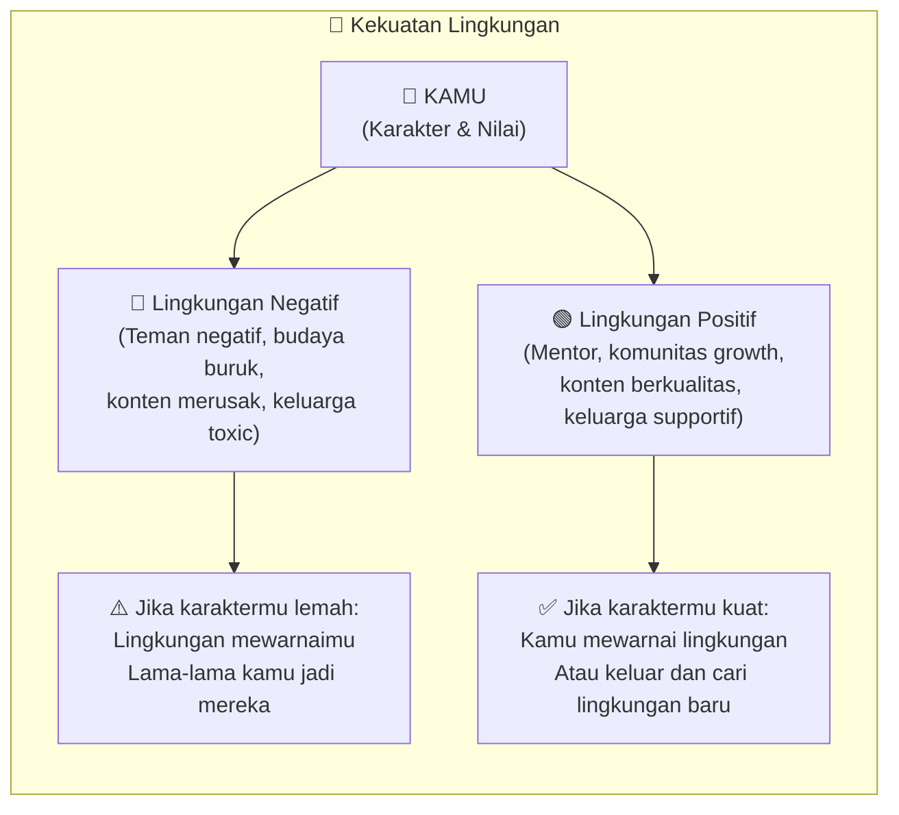

Ada satu quote yang sangat tajam tentang ini:

> *"Kalau kamu adalah orang yang paling hebat di ruangan tersebut, kamu berada di tempat yang salah — kecuali kamu bisa mengubah orang-orang di bawahmu menjadi lebih baik."*

Ini adalah indikator bahwa sudah saatnya kamu naik level — mencari lingkungan yang lebih menantang, mentor yang lebih jauh di depanmu, komunitas yang mendorongmu untuk terus tumbuh.

### 5️⃣ Time — Waktu Mengukuhkan Segalanya

Waktu adalah netral. Ia tidak berpihak pada kebaikan atau keburukan. Ia hanya mengukuhkan apapun yang kamu ulang. Satu tahun kamu olahraga setiap hari — tubuhmu berubah. Satu tahun kamu menghindari olahraga — kesehatanmu memburuk. Waktunya sama; hasilnya berbeda karena pilihan yang berbeda.

Di era *instant gratification*, kita sering lupa bahwa **segala sesuatu yang bernilai membutuhkan waktu**. Hubungan yang sehat dibangun bertahun-tahun. Keahlian yang dikuasai diasah ribuan jam. Bisnis yang kokoh tumbuh perlahan dari akar yang kuat.

### 6️⃣ Harmony — Jadilah Aktor Utama, Bukan Penonton

Prinsip ini berbicara tentang sesuatu yang sangat relevan di era media sosial: **jangan habiskan energi untuk memikirkan apa yang orang lain pikirkan tentangmu**.

Ini bukan berarti menjadi arogan atau tidak peduli pada feedback. Tapi ada perbedaan besar antara **menerima kritik yang konstruktif dari orang yang kompeten** dengan **terobsesi oleh opini orang yang bahkan tidak selevel denganmu**.

> *"Hanya dengarkan kritik dari orang yang sekelas atau lebih tinggi dari kamu. Kalau pengamat militer mengkritik seorang jenderal — ngapain didengerin? Tapi kalau jenderal lain yang mengkritik — baru perlu diperhatikan."*

### 7️⃣ Caution — Berpikir Sebelum Bertindak

Prinsip terakhir adalah tentang kehati-hatian dan perencanaan. Setiap keputusan besar dalam hidupmu harus melalui satu pertanyaan: **apakah ini akan berdampak baik pada hidupku di masa depan?**

Drifter hidup secara impulsif — mengikuti apa yang terasa baik sekarang tanpa mempertimbangkan konsekuensinya. Non-drifter berpikir terlebih dahulu, merencanakan dengan matang, dan tidak menyalahkan orang lain atas kegagalannya — karena ia tahu bahwa setiap keputusan adalah tanggung jawabnya sendiri.

---

## Bagian IX: 98% vs 2% — Drifter dan Non-Drifter di Mana-mana 📊

Salah satu klaim paling mengejutkan dalam buku ini adalah bahwa menurut Iblis sendiri:

> ***"98% manusia dikontrol oleh rasa takut dan menjalani hidup sebagai drifter."***

Hanya **2%** yang benar-benar menjadi Non-Drifter.

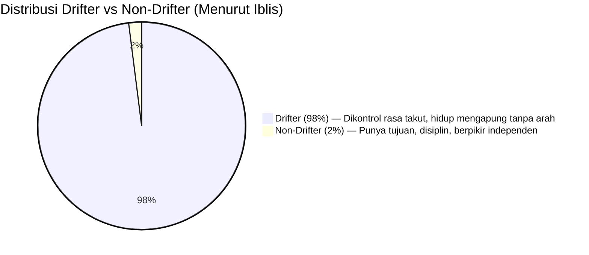

Angka ini tentu saja metaforis — bukan data ilmiah. Tapi ia menangkap sesuatu yang nyata: mayoritas orang menjalani hidup dalam mode reaktif, bukan proaktif. Mereka merespons keadaan, bukan menciptakannya.

Yang menarik adalah: **menjadi Non-Drifter tidak membutuhkan kecerdasan luar biasa, bakat khusus, atau keberuntungan**. Yang dibutuhkan adalah:

1. Kesadaran bahwa kamu *bisa* memilih
2. Keberanian untuk mengambil pilihan itu
3. Disiplin untuk konsisten menjalankannya

---

## Bagian X: Relevansi di Era Digital — Iblis Modern 📱

Napoleon Hill menulis ini di tahun 1938. Tapi konsepnya tidak pernah lebih relevan dari sekarang.

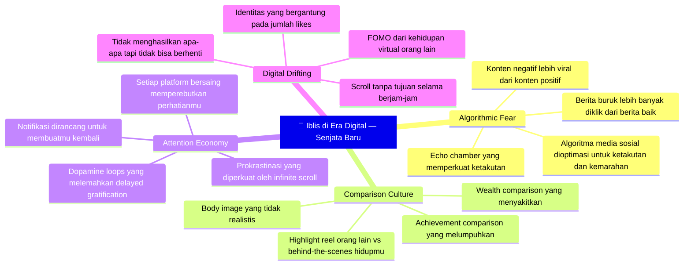

Di era digital, menjadi *drifter* jauh lebih mudah dari sebelumnya. Kamu bisa menghabiskan 6 jam sehari di TikTok tanpa sadar — dan setiap jam itu, kamu memberikan perhatianmu kepada orang lain, membiarkan algoritma memutuskan apa yang harus kamu pikirkan, dan melatih otakmu untuk mengharapkan kepuasan instan.

*The Law of Hypnotic Rhythm* berlaku di sini: semakin sering kamu scroll tanpa tujuan, semakin otomatis itu terjadi. Semakin susah untuk berhenti.

<Callout type="success" title="Cara Melawan Digital Drifting">
Prinsip Non-Drifter berlaku penuh di dunia digital:
- **Definiteness of Purpose**: Sebelum membuka HP, tanyakan dulu — *untuk apa aku membuka ini?*
- **Mastery of Self**: Set batas waktu screen time yang nyata dan patuhi
- **Controlling Environment**: Unfollow akun yang membuatmu merasa lebih buruk tentang dirimu
- **Caution**: Sebelum share sesuatu, tanyakan: benar? baik? perlu? (persis Triple Filter Socrates!)
</Callout>

---

## Bagian XI: Outwitting the Devil dalam Perspektif yang Lebih Luas 🌐

Menarik untuk melihat bagaimana konsep-konsep dalam buku Napoleon Hill ini bersesuaian dengan berbagai tradisi pemikiran lain:

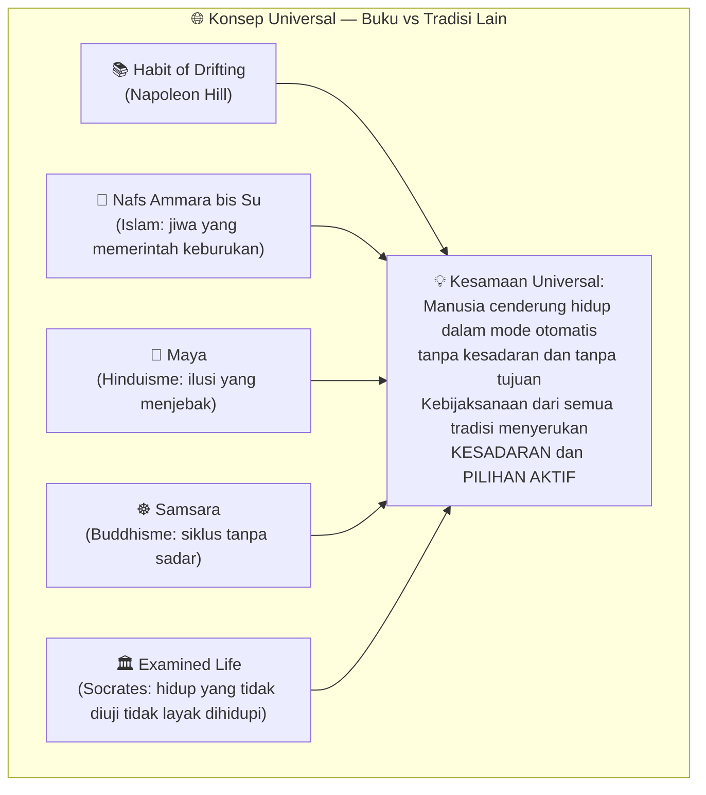

Ini bukan kebetulan. Berbagai tradisi spiritual dan filosofis dari berbagai penjuru dunia dan era sejarah yang berbeda — semuanya sampai pada insight yang sama: **manusia punya kecenderungan untuk "tertidur"** — hidup secara otomatis, dikuasai oleh insting, ketakutan, dan kebiasaan, tanpa benar-benar *hadir* dan *memilih* dalam hidupnya.

Dan solusinya pun seragam: **kesadaran** (*awareness*), **pilihan aktif** (*active choice*), dan **disiplin** (*discipline*).

---

## Bagian XII: Mengapa Buku Ini Perlu 72 Tahun untuk Diterbitkan? 🤔

Ada satu pertanyaan yang menarik: jika isi buku ini sebenarnya adalah pengembangan diri biasa — mengapa ia dianggap terlalu kontroversial untuk diterbitkan selama 72 tahun?

Jawabannya ada di **judulnya dan caranya dikemas**.

Di tahun 1938, menerbitkan buku yang mengklaim sang penulis berbicara langsung dengan Iblis — dan Iblis itu berbicara secara kooperatif, bahkan memberikan *tips* untuk mengalahkannya — adalah sesuatu yang sangat *edgy*. Ini menantang sensitivitas religius yang kuat di Amerika pada masa itu.

Tapi ada alasan yang lebih dalam: **buku ini menantang otoritas institusi**. Hill mengkritik sistem sekolah, guru agama, orang tua, dan budaya pasrah. Di era ketika otoritas-otoritas itu sangat berkuasa dan tidak biasa untuk dikritik secara publik, ini adalah tindakan yang berani — bahkan berbahaya.

Dan paradoksnya: **Iblis sendiri sudah memperingatkan Napoleon Hill bahwa buku ini akan dilarang**. Seperti sebuah lelucon kosmik — atau bukti bahwa Napoleon Hill memang sangat memahami psikologi manusia.

---

## Penutup: Siapa yang Mengendalikan Hidupmu? 🔑

Pada akhirnya, *Outwitting the Devil* adalah tentang satu pertanyaan fundamental:

**Siapa yang mengendalikan hidupmu?**

Apakah *kamu* — dengan tujuan yang jelas, keputusan yang sadar, dan disiplin yang konsisten?

Atau apakah **kekuatan-kekuatan luar** — rasa takut yang tidak kamu sadari, kebiasaan buruk yang sudah permanen, opini orang-orang yang levelnya tidak setara denganmu, dan algoritma yang dirancang untuk membuat kamu scroll terus?

Napoleon Hill memberikan jawabannya dengan sangat jelas melalui 7 prinsip Non-Drifter. Tapi mengetahuinya saja tidak cukup. Seperti semua kebijaksanaan yang baik — **ia harus dipraktikkan, bukan sekadar dibaca.**

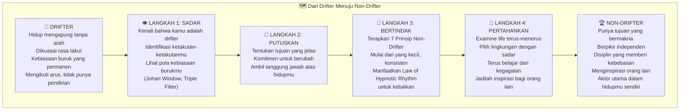

Seperti kata Napoleon Hill — melalui suara Iblis yang penuh ironi:

> *"Musuh terbesarku adalah orang-orang yang membantu orang lain untuk berpikir dan memiliki inisiatif. Karena aku tidak bisa mengendalikan orang yang berpikir."*

Maka: **berpikirlah**. Secara independen, kritis, dan berani. Itu saja sudah cukup untuk membuatmu menjadi musuh terbesarnya.

---

*Artikel ini berkaitan erat dengan <WikiLink to="ngaji-filsafat-379-socrates-mengenali-diri" label="Ngaji Filsafat 379: Socrates — Kenali Dirimu" /> yang membahas konsep mengenali diri sendiri sebagai fondasi kebijaksanaan, serta <WikiLink to="ngaji-filsafat-264-menyelami-penderitaan" label="Ngaji Filsafat 264: Menyelami Penderitaan" /> yang mengeksplorasi bagaimana berbagai tradisi filsafat melihat penderitaan sebagai jalan menuju pertumbuhan.*
