## Pembuka: Siapa Pria Ini dan Kenapa Kamu Harus Mendengarnya 🎭⚖️

Bayangkan seseorang yang dalam satu napas bisa bicara tentang **disertasi doktoral hukum Islam dari University of Chicago**, lalu di napas berikutnya bilang bahwa ia baru saja *platinum* Elden Ring — salah satu video game paling brutal dan sulit yang pernah dibuat manusia.

Orang itu adalah **Pramudya Oktavinanda**, dan ia hadir di podcast **What Is Up, Indonesia? (WIUI)** bersama Andovi da Lopez dan Abigail Limuria dalam sebuah episode yang, dengan segala hormat kepada seluruh podcast di Indonesia, layak disebut sebagai salah satu percakapan intelektual paling kaya yang pernah direkam dalam format santai.

Artikel ini adalah rekaman pemikiran — upaya saya untuk menangkap esensi dari apa yang dibicarakan dalam *Part 1* ini, mengurainya secara mendalam, dan menghubungkannya dengan dunia yang lebih luas. Karena percakapan seperti ini terlalu berharga untuk sekadar didengarkan sekali, lalu dilupakan.

---

## Siapa Pramudya Oktavinanda? 🌟

Sebelum masuk ke substansi, mari kita kenali dulu siapa pria ini — karena backgroundnya adalah kunci untuk memahami *mengapa* cara berpikirnya berbeda dari kebanyakan orang.

**Jabatan dan Identitas:**
- ⚖️ Managing Partner di **Umbra**, firma hukumnya sendiri
- 🎓 **Doktor hukum (SJD)** dari University of Chicago, dengan spesialisasi Law, Economics, dan Islamic Law
- 🏛️ Ketua **ILUNI** (Ikatan Alumni Universitas Indonesia)
- 🎙️ Host podcast **The Reading Chamber**, sebuah podcast tentang buku yang kini punya hampir 40.000 subscriber
- 🥋 **Indoor disciple** dari Wuang — sekolah kung fu dari Taiwan

**Hal-hal yang tidak akan kamu sangka:**
- 👗 Sudah menghadiri **Paris Fashion Week sebanyak 6 kali** — untuk Alexander McQueen
- 🍜 Punya akun Instagram khusus kuliner bernama **Shokun Master**, fokus restoran Michelin star di Jepang
- 🎮 Telah *platinum* **Elden Ring** (yang, bagi yang tidak tahu, merupakan prestasi gaming yang membutuhkan ratusan jam, ketangguhan mental tingkat dewa, dan toleransi terhadap rasa sakit yang luar biasa)
- 📺 **Naoki Hamaguchi** — kreator Final Fantasy 7 — follow dia di Twitter dan Instagram

<Callout type="info" title="Tentang Platinum di Elden Ring 🏆">
Untuk konteks: Mendapat *platinum trophy* di Elden Ring berarti menyelesaikan **100% dari semua achievement** dalam game tersebut — termasuk mengalahkan semua boss opsional yang sangat sulit, menemukan semua ending, dan menjalani puluhan jam eksplorasi. Ini bukan sekadar "tamat main game." Ini adalah bentuk dedikasi yang langka.
</Callout>

Poin pentingnya: **Pramudya adalah manusia yang menolak untuk dikotak-kotakkan.** Di satu sisi ia seorang akademisi hukum yang serius; di sisi lain, ia hidup dengan penuh dan gembira, menjelajahi fashion, kuliner, gaming, anime, dan seni bela diri. Dan justru karena *luasnya* referensi inilah ia mampu menjelaskan hal-hal kompleks dengan cara yang mengejutkan.

---

## Disertasi yang Mengguncang: Pragmatisme Postnerian dalam Hukum Islam 📖🤔

Inti dari percakapan Part 1 ini adalah disertasi doktoralnya yang berjudul:

> *"Interpreting Immutable Legal Text: The Posnerian Pragmatism of Islamic Law"*

Judul ini mungkin terdengar berat. Tapi izinkan saya mengurainya lapis per lapis — karena ini adalah salah satu gagasan paling penting yang perlu dipahami oleh siapapun yang ingin berpikir jernih tentang hubungan antara agama, hukum, dan kehidupan modern.

### Premis Utama: "Sempurna" Tidak Berarti "Tidak Berubah" ♾️

Pramudya memulai dari sebuah ayat Al-Quran yang sangat terkenal — yang mengklaim bahwa pada hari itu, **agama Islam telah disempurnakan**. Sebagian besar orang membacanya sebagai penutup: hukum Islam sudah final, tidak bisa diubah.

Pramudya membaca pertanyaan yang berbeda: *Apa sebenarnya yang dimaksud dengan "sempurna"?*

Ia menunjukkan paradoks yang sama ada dalam konstitusi Amerika Serikat, yang menyebut tujuannya adalah membentuk *"a more perfect union"* — sempurna, tapi bisa menjadi lebih sempurna. Bagaimana sesuatu yang sempurna bisa menjadi lebih sempurna?

Jawabannya, menurut Pramudya, adalah bahwa **"sempurna" harus dimaknai sebagai sesuatu yang *malleable*** — fleksibel, bisa beradaptasi dengan perubahan keadaan — bukan sebagai benda beku yang tidak boleh disentuh.

```mermaid
graph TD
    A[Klaim: Islam sudah sempurna ✅] --> B{Apa makna 'sempurna'?}
    B -->|Interpretasi 1| C[Beku, tidak berubah selamanya]
    B -->|Interpretasi 2| D[Adaptif, berevolusi sesuai konteks]
    C --> E[❌ Bertentangan dengan realitas perubahan hukum]
    D --> F[✅ Konsisten dengan praktik hukum Islam historis]
    F --> G[Kesimpulan: Sempurna = Dapat diinterpretasikan ulang dengan justifikasi yang kuat]
```

### Bukti: Perbudakan dan Logika yang Runtuh 😮

Untuk membuktikan poinnya, Pramudya menggunakan contoh yang paling tabu sekaligus paling jelas: **perbudakan**.

Banyak Muslim modern berargumen bahwa Islam selalu melarang perbudakan. Pramudya, dengan tenang dan berbasis referensi klasik, menunjukkan bahwa ini tidak akurat secara historis.

Ia bahkan membuka dan membacakan langsung dari kitab **Al-Risala** karya **Imam Syafi'i** — pendiri mazhab yang paling banyak diikuti di Indonesia — halaman 125:

> *"...slaves cannot own property and that what a slave owns is in fact owned by his master... He does not even own himself."*

Ini bukan ayat yang ambigu. Ini adalah pernyataan eksplisit dari salah satu ulama hukum Islam paling berpengaruh dalam sejarah: **perbudakan itu halal dan sah.**

<Callout type="warning" title="Konteks Penting ⚠️">
Pramudya tidak sedang membenarkan perbudakan. Ia sedang melakukan sesuatu yang jauh lebih penting: **membuktikan bahwa hukum Islam sudah berubah dalam praktiknya**, dan kita perlu memiliki teori yang bisa menjelaskan dan membenarkan perubahan tersebut — bukan menyembunyikannya dengan klaim apologetik.
</Callout>

Ia juga mengutip **Yusuf al-Qaradawi** — ulama terkenal yang menulis *Halal dan Haram dalam Islam* — yang mendefinisikan prinsip bahwa *"sesuatu yang diizinkan oleh Tuhan tidak bisa dilarang oleh manusia."* Namun, al-Qaradawi tidak membahas perbudakan dalam konteks prinsip ini. Mengapa?

Karena begitu ia membahasnya, **seluruh logikanya runtuh**. Karena perbudakan *sudah diizinkan* oleh teks klasik, maka menurut prinsip itu, manusia tidak bisa melarangnya. Tapi dunia modern sudah melarangnya. Jadi, siapakah yang "salah"?

Jawabannya, kata Pramudya: **tidak ada yang salah, karena hukum memang sudah berubah** — dan itu adalah hal yang baik. Yang salah adalah ketidakjujuran dalam mengakui bahwa perubahan itu terjadi.

### Contoh Lain: Warisan dan Poligami di Indonesia 🇮🇩

Pramudya memberikan contoh yang lebih dekat dengan kehidupan sehari-hari:

**1. Poligami**
Dalam hukum Islam klasik (bersumber langsung dari Al-Quran dan Hadis), seorang pria boleh menikahi hingga empat istri **tanpa perlu izin dari istri pertama**. Di Indonesia, Undang-Undang Perkawinan mewajibkan izin tersebut untuk pendaftaran resmi.

Ini adalah perubahan hukum nyata. Indonesia telah, secara diam-diam namun efektif, mengubah ketentuan hukum Islam klasik.

**2. Pembagian Waris**
Dalam hukum Islam klasik Arab (bersifat patrilineal), **anak perempuan tidak bisa menghalangi bagian waris yang jatuh ke saudara-saudara almarhum**. Di Indonesia, berkat teori yang dikembangkan oleh Profesor Hazairin, anak perempuan *bisa* menghalangi bagian tersebut — karena Indonesia bersifat bilateral (baik laki-laki maupun perempuan bisa mewarisi secara penuh).

Ini juga perubahan. Bukan penyimpangan dari Islam, melainkan **adaptasi yang didasari justifikasi yang kuat**.

<Callout type="tip" title="Poin Kunci Disertasi 💡">
Kesimpulan akhir disertasi Pramudya bisa diringkas dalam satu kalimat: **"Sebagian hukum Islam bisa diubah, asalkan perubahan tersebut didasari justifikasi yang kuat dan bertujuan untuk memaksimalkan kesejahteraan masyarakat."**

Ini bukan bid'ah. Ini adalah pengakuan jujur terhadap kenyataan sejarah — dikombinasikan dengan teori yang bisa membenarkan praktik tersebut secara akademis.
</Callout>

---

## Kisah Musa dan Khidir: Al-Quran sebagai Sumber Filsafat Hukum 📜✨

Salah satu bagian paling brilian dari percakapan ini adalah ketika Pramudya menggunakan **kisah Musa dan Khidir** dari Al-Quran sebagai fondasi filosofis disertasinya.

Kisahnya terkenal tapi jarang dianalisis secara mendalam seperti ini:

### Ringkasan Kisah 📖

Musa — nabi terbesar yang menerima wahyu langsung dari Tuhan — suatu hari mengklaim dirinya sebagai manusia paling berpengetahuan. Tuhan pun mengirimnya bertemu seorang hamba yang tidak disebutkan namanya (yang dalam tafsir populer disebut **Khidir**), yang menerima ilmu langsung dari Tuhan.

Syaratnya: *Musa harus ikut tanpa bertanya*.

Tiga kejadian terjadi:

| Kejadian | Tindakan Khidir | Reaksi Musa |
|---|---|---|
| 1️⃣ Naik perahu | Khidir melubangi perahu milik nelayan miskin | "Kamu merusak milik orang!" (Strike 1) |
| 2️⃣ Melewati anak-anak | Khidir membunuh seorang anak yang sedang bermain | "Kamu membunuh anak yang tidak bersalah!" (Strike 2) |
| 3️⃣ Tiba di desa yang menolak mereka | Khidir memperbaiki tembok rumah terbengkalai tanpa bayaran | "Kenapa kamu bekerja gratis untuk orang-orang yang menghina kita?" (Strike 3) |

Musa pun dikeluarkan dari perjalanan. Lalu Khidir menjelaskan:

1. 🚤 **Perahu dilubangi** agar terlihat rusak dan tidak diambil oleh raja yang sedang lewat merampas semua kapal yang bagus — untuk melindungi si nelayan miskin.
2. 👦 **Anak dibunuh** karena Khidir memiliki pengetahuan (*probabilistik*, bukan pasti) bahwa anak itu akan menghancurkan kedua orang tuanya di masa depan.
3. 🏚️ **Tembok diperbaiki** karena di bawahnya tersimpan harta yang Tuhan niatkan untuk anak-anak dari keluarga shaleh yang tinggal di sana — agar mereka bisa menemukannya kelak.

### Interpretasi Pramudya: Ini Bukan Dongeng, Ini Teori Hukum dan Kebijakan Publik 🔍

Pramudya menawarkan pembacaan yang sama sekali berbeda dari tafsir konvensional yang cenderung mistis:

**Kejadian Pertama: Prinsip *Least Cost Avoider*** ⚓

Dalam *law and economics*, ketika dua pilihan sama-sama memiliki biaya, kita harus memilih yang paling *efisien dalam menghindari kerugian terbesar*. Melawan raja dengan kekuatan langsung = banyak korban, nelayan tetap kehilangan perahu. Melubangi perahu = kerugian minimal, raja tidak mengambil.

> *"Jika kamu harus memilih antara dua tindakan yang keduanya merugikan, pilih yang least cost — yang meminimalkan total kerugian."*

**Kejadian Kedua: Tragedi Statistik vs. Keputusan Kebijakan Publik** 📊

Pramudya mengutip ucapan Stalin yang terkenal (namun gelap): *"Kematian satu orang adalah tragedi. Kematian jutaan orang hanyalah statistik."*

Ini terdengar kejam. Tapi ini adalah dilema yang dihadapi setiap pembuat kebijakan publik — setiap hari. Ketika anggaran pendidikan dipotong, *seseorang* kehilangan masa depannya. Ketika anggaran kesehatan dialihkan, *seseorang* mati lebih cepat. Keputusan itu harus tetap dibuat.

Pesan kisah ini, menurut Pramudya, bukan "membunuh itu boleh kalau ada tujuannya." Melainkan: **setiap keputusan kebijakan punya konsekuensi nyata terhadap nyawa manusia, dan pemimpin harus menanggung beban itu dengan sadar dan serius.**

**Kejadian Ketiga: *Skin in the Game* dan Pelayanan Tanpa Apresiasi** 🏗️

Ini yang menurutnya paling penting: Khidir memperbaiki tembok di desa yang menghina mereka, tanpa bayaran, tanpa apresiasi, tanpa seseorang yang tahu — bahkan tanpa Musa mengerti.

Mengapa ini penting? Karena tanpa kejadian ketiga ini, dua kejadian sebelumnya mengajarkan bahwa pemimpin bisa mengambil keputusan besar *tanpa ada konsekuensi bagi dirinya sendiri*. Khidir merusak perahu dan pergi. Khidir membunuh anak dan pergi. Tidak ada pertanggungjawaban.

Kejadian ketiga menyeimbangkannya: **pemimpin sejati tetap bekerja bahkan ketika tidak dilihat, tidak diapresiasi, bahkan ketika orang membencinya.**

```mermaid
graph LR
    A[Tiga Kisah Khidir] --> B[Efisiensi Biaya ⚓]
    A --> C[Tanggung Jawab Kebijakan 📊]
    A --> D[Skin in the Game 🏗️]
    B --> E[Law & Economics: Least Cost Avoider]
    C --> F[Setiap keputusan = nyawa manusia]
    D --> G[Pemimpin tidak boleh kabur dari konsekuensi]
    E --> H[Teori Hukum Islam yang Pragmatis ✅]
    F --> H
    G --> H
```

<Callout type="example" title="Hubungan dengan Kasus 9/11 💰">
Untuk memperkuat argumennya tentang *valuasi kehidupan*, Pramudya merujuk pada kasus 9/11 di Amerika Serikat. Setelah tragedi itu, pemerintah harus menghitung kompensasi bagi keluarga korban. Seseorang — seorang aktuaris ahli — akhirnya mengembangkan formula untuk menghitung nilai ekonomis dari satu nyawa manusia, berdasarkan potensi penghasilan, investasi, dan faktor lainnya.

Ini terdengar dingin dan kalkulatif. Tapi tanpa formula itu, tidak ada cara yang adil untuk mendistribusikan kompensasi. Dan Pramudya menunjukkan: kisah Khidir sudah memberikan *landasan filosofis* untuk melakukan hal ini ribuan tahun sebelum kasus 9/11 — bahwa kehidupan memiliki nilai yang bisa dan harus diperhitungkan secara bertanggung jawab.
</Callout>

---

## Hukum Islam adalah Konsekuensialis — Dan Itu Hal yang Baik 🎯

Salah satu klaim terkuat Pramudya adalah bahwa **Islam pada dasarnya mengadopsi pandangan konsekuensialis** — sesuatu itu benar atau salah bukan karena ia *secara inheren* benar atau salah, melainkan karena *konsekuensinya*.

Ini bertentangan dengan pandangan *deontologis* (sesuatu benar karena merupakan kewajiban/aturan) yang sering diasosiasikan dengan agama.

Namun Pramudya menunjukkan bahwa dalam hukum Islam sendiri ada konsep **maslahah mursalah** — kemaslahatan publik, kepentingan umum — yang memungkinkan perubahan hukum ketika kepentingan masyarakat menuntutnya. Ini adalah **konsekuensialisme yang sudah tertanam dalam tradisi Islam itu sendiri**.

Dan ini paralel sempurna dengan apa yang disebut **Richard Posner** — pahlawan yudisial Pramudya, hakim dan akademisi hukum Amerika yang paling produktif sepanjang sejarah — sebagai *welfare maximization* dalam *law and economics*: tujuan hukum adalah memaksimalkan kesejahteraan masyarakat secara keseluruhan.

---

## Sejarah Islam Adalah Game of Thrones yang Sesungguhnya 👑⚔️

Bagian yang paling mengejutkan dari percakapan ini adalah ketika Pramudya mulai membahas sejarah khulafaur rasyidin — empat khalifah pertama setelah Nabi Muhammad wafat.

Dan ia melakukannya bukan dengan nada apologetik yang biasa, melainkan dengan kejujuran seorang sejarawan.

### Abu Bakar, Umar, Usman, Ali: Bukan Fairy Tale 📚

Banyak narasi populer menggambarkan masa keempat khalifah ini sebagai zaman keemasan yang sempurna. Pramudya, mengutip buku **Abu Ala Maududi** yang dibacanya sejak SMP Negeri Kesatuan, menunjukkan realitas yang jauh lebih kompleks:

- 🏆 **Abu Bakar** diangkat karena senioritas — bukan karena ada mekanisme pemilihan yang jelas
- 📋 **Umar bin Khattab** (favorit Pramudya — "the first law and economics scholar") ditunjuk langsung oleh Abu Bakar
- 😬 **Usman bin Affan** — salah satu dari sepuluh sahabat yang dijanjikan surga oleh Nabi — melakukan nepotisme besar-besaran, mengangkat semua anggota keluarganya ke posisi pemerintahan, dan akhirnya dibunuh dalam pemberontakan
- ⚔️ **Ali bin Abi Talib** — dipilih melalui semi-pemilihan — kemudian berkonflik dengan Muawiyah, masuk ke arbitrasi yang diceritakan berakhir dengan tipu daya, dan kemudian dibunuh

Dan dari konflik Ali vs. Muawiyah inilah lahir **Syiah** — yang Pramudya tegaskan bukan terutama perbedaan teologis, melainkan **konflik politik yang kemudian berubah menjadi konflik religius**.

<Callout type="important" title="Taktik Muawiyah yang Brilian dan Mengejutkan 🗡️">
Salah satu momen paling mengesankan dalam percakapan ini adalah ketika Pramudya menceritakan taktik Muawiyah ketika pasukannya hampir kalah melawan pasukan Ali:

Muawiyah memerintahkan pasukannya untuk **menancapkan halaman-halaman mushaf Al-Quran di ujung tombak mereka** — di tengah pertempuran.

Efeknya langsung: pasukan Ali berhenti. Mereka tidak bisa menyerang sesuatu yang suci. Dan karena kebimbangan itu, momentum pertempuran berbalik.

Pramudya menghubungkan ini dengan dialog dalam film Superman — di mana seorang karakter dari Krypton berkata kepada Superman: *"Apa yang membedakanmu dari kami adalah kamu masih punya moralitas. Aku tidak."*

**Muawiyah adalah pragmatis mutlak yang memahami bahwa musuhnya punya moralitas — dan ia menggunakannya sebagai senjata.**
</Callout>

---

## Iman, Logika, dan Mengapa Islam Cocok dengan Temperamen Seorang Lawyer 🧠❤️

Andovi — yang Katolik — bertanya kepada Pramudya pertanyaan yang jujur dan personal: *"Bagaimana kamu menyeimbangkan semua pengetahuan akademis ini dengan imanmu sendiri?"*

Jawaban Pramudya sangat mengungkapkan:

> *"Saya seorang lawyer. Saya mencintai logika. Dan yang membuat Islam cocok bagi saya adalah bahwa Islam lebih jujur — dan lebih pragmatis."*

Ia bercerita bahwa semasa SMP di Sekolah Kristen Kesatuan, ia justru mendapat nilai sempurna untuk mata pelajaran agama Kristen — termasuk menghafal ayat-ayat Alkitab dan menjelaskan konsep *conscience* dalam doktrin Katolik — sambil tersenyum bahwa gurunya sempat memarahi siswa-siswa Katolik karena "kalah sama anak Muslim ini."

Tapi ia tidak akan pernah menjadi Kristen — karena ada satu konsep yang tidak bisa ia terima:

> *"Jika ada yang menamparmu di pipi kanan, berikan juga pipi kirimu."*

Pramudya berkata langsung: *"Sorry. Kalau kamu nampar saya, saya akan balas."* 😄

Dan itu, menurutnya, mencerminkan mengapa Islam cocok dengan *temperamentnya*: **Islam adalah agama yang pragmatis, yang mengakui kompleksitas dunia, dan yang tidak meminta pengikutnya untuk menjadi martir tanpa alasan.**

---

## Tentang Membaca: Cara Pramudya Membangun Pengetahuan 📚🧠

Bagian akhir episode ini membahas tentang kebiasaan membaca — dan ini mungkin bagian yang paling praktis dan bisa langsung diterapkan.

### Perjalanan Membaca Pramudya 📖

1. **Usia 2-3 tahun**: Belajar baca dengan *Donald Duck* — karena ia tidak sabar menunggu ibunya membacakan; ingin membaca sendiri 😂
2. **SD**: *Childcraft* — koleksi ensiklopedia anak yang memperkenalkannya pada dunia yang luas
3. **SMP**: Buku serius pertama — karya **Abu Ala Maududi** tentang pemerintahan Islam yang ia temukan untuk tugas kelas
4. **S1**: Membeli buku **Richard Posner** tentang teori hukum — *dan tidak mengerti sama sekali* 😅
5. **S2 di Chicago (2012)**: Bertemu Posner langsung, mulai memahami
6. **S3 di Chicago (2015-2018)**: Membaca ulang buku yang sama — dan *semuanya tiba-tiba masuk akal*

<Callout type="tip" title="Lesson: Buku yang Tidak Dimengerti Bukan Buku yang Buruk 💡">
Ada buku yang membutuhkan kamu untuk **berkembang terlebih dahulu** sebelum kamu bisa mengerti. Membacanya terlalu dini bukan sia-sia — itu seperti latihan awal yang membangun fondasi tanpa kamu sadari. Bertahun-tahun kemudian, kamu membacanya lagi dan tiba-tiba semuanya *klik*.

**Jangan menyerah pada buku yang terasa terlalu berat.** Simpan. Kembali lagi nanti.
</Callout>

### Cara Mempertahankan Pengetahuan 🔄

Pramudya mengungkap "rahasia" yang bukan rahasia:

> *"Saya tidak pernah highlight buku. Cara saya mengingat adalah dengan menceritakannya kembali kepada orang lain."*

Ini adalah prinsip pengajaran klasik: **Feynman Technique** — jika kamu bisa menjelaskan sesuatu dengan sederhana, berarti kamu benar-benar mengerti.

The Reading Chamber bukan sekadar podcast. Baginya, itu adalah **repository pengetahuan** — cara ia *memaksa dirinya sendiri* untuk mengolah ulang semua yang sudah ia baca, sehingga pengetahuan itu tidak menguap.

Ia membandingkannya dengan berlatih seni bela diri: *"Kalau kamu mau lebih baik, kamu harus mengajarkan kepada orang lain. Karena mengajar memaksamu untuk benar-benar menguasai."*

---

## Superpower yang Sebenarnya: Toleransi Terhadap Rasa Sakit 💪

Di penghujung episode, Pramudya ditanya tentang superpowernya. Jawabannya mengejutkan:

> *"Superpower saya bukan kejeniusan. Superpower saya adalah toleransi terhadap rasa sakit yang sangat tinggi."*

Ia menceritakan bahwa sepanjang hidupnya, orang-orang yang paling dekat dengannya — ibunya, bosnya, istrinya, koleganya — adalah orang-orang yang paling *"pain in the ass"*. Dan ia tidak mengeluh. Ia justru bersyukur.

Karena itulah yang membentuknya. Tanpa semua tekanan itu, ia tidak akan punya ketangguhan yang sekarang ia miliki.

Ini bukan klise motivasi. Ini adalah observasi yang sangat spesifik tentang bagaimana karakter terbentuk: **bukan dari keberhasilan, melainkan dari kemampuan bertahan menghadapi hal-hal yang menyulitkan.**

<Callout type="quote" title="Refleksi Personal">
*"Saya tidak akan memilih ibu yang berbeda, bos yang berbeda, atau istri yang berbeda. Karena interaksi dengan mereka — seberat apapun — adalah yang memproduksi siapa saya sekarang."*

— Pramudya Oktavinanda
</Callout>

---

## Mengapa Percakapan Seperti Ini Langka dan Berharga 🌟

Kita hidup di era *short-form content*. TikTok 30 detik. Thread Twitter 280 karakter. Konten yang dioptimalkan untuk ditonton setengah sambil rebahan.

Dan di tengah lanskap itu, ada seseorang yang duduk selama lebih dari satu jam, membahas disertasi tentang interpretasi hukum Islam, mengutip kitab-kitab klasik, menghubungkan kisah Khidir dengan teori *least cost avoider*, dan menyamakan sejarah khalifah dengan Game of Thrones — **bukan untuk terlihat pintar, tapi karena itulah cara berpikirnya yang alami.**

Ini yang membuat Pramudya Oktavinanda berbeda.

Dan ini yang membuat WIUI berbeda: mereka menciptakan ruang di mana percakapan seperti ini bisa terjadi, dalam format yang *accessible*, untuk generasi yang mungkin tidak pernah akan membaca 300 halaman disertasi doktoral tentang hukum Islam.

---

## Kesimpulan: Baca Lebih Banyak, Pikirkan Lebih Dalam 📚🔍

Jika ada satu hal yang perlu kamu bawa dari episode ini, ini dia:

**Kejujuran intelektual adalah bentuk penghormatan tertinggi terhadap tradisi yang kamu yakini.**

Pramudya tidak mendekonstruksi Islam karena ia tidak percaya. Ia mendekonstruksinya justru karena ia percaya — dan ia ingin memahaminya secara jujur, bukan dengan ilusi apologetik yang pada akhirnya lebih merusak daripada melindungi.

Dunia membutuhkan lebih banyak orang yang berpikir seperti ini: orang yang **cukup mencintai sesuatu untuk mau melihatnya apa adanya**, bukan hanya apa yang ingin mereka lihat.

<Callout type="cite" title="Sumber 🎙️">
Episode ini bisa ditonton di YouTube: [When Islamic Law Meets Game of Thrones - Pramudya Oktavinanda (Part 1)](https://www.youtube.com/watch?v=uDKwbYWsK4A) — diproduksi oleh **What Is Up, Indonesia? (WIUI)** dengan host Andovi da Lopez dan Abigail Limuria.
</Callout>

---

*Apa bagian dari percakapan ini yang paling mengubah cara berpikirmu? Apakah argumen Pramudya tentang "sempurna = adaptif" masuk akal bagimu? Tulis di komentar.* 👇
