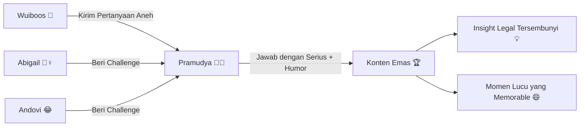
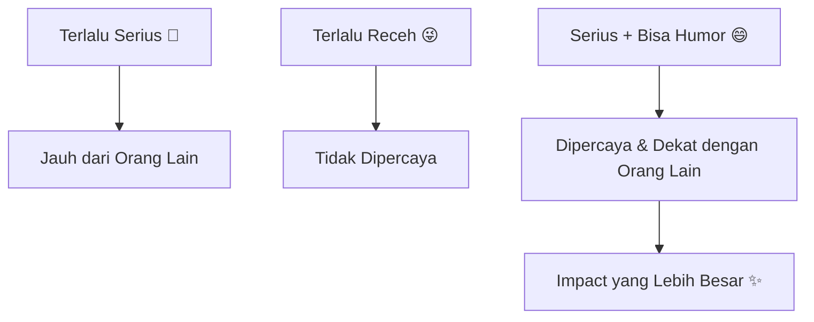

## Perkenalan: Ketika Dunia Hukum Bertemu Dunia Receh 🎙️⚖️

Ada sesuatu yang sangat menyegarkan ketika melihat seseorang yang *sangat serius* dalam pekerjaannya rela duduk, melepas jubah formalitasnya, dan menjawab pertanyaan-pertanyaan yang… tidak serius sama sekali.

Itulah yang terjadi dalam episode terbaru **What Is Up, Indonesia? (WIUI)**, ketika **Pramudya Oktavinanda** — pengacara top Indonesia yang juga dikenal lewat podcast-nya *The Reading Chamber* — kembali hadir untuk **Part 2** bersama Andovi da Lopez dan Abigail Limuria.

Kalau di Part 1 kita sudah diperkenalkan dengan sosoknya yang intelektual dan passionate soal buku dan hukum, maka di Part 2 ini sisi *humanis* dan *humoris* Pramudya benar-benar meledak keluar. 😄💥

<Callout type="info" title="Tentang WIUI">
**What Is Up, Indonesia? (WIUI)** adalah media independen yang mengkurasi isu sosial-politik Indonesia dengan cara yang mudah dipahami — khususnya untuk generasi muda Indonesia yang tumbuh di luar negeri (*internationally-raised Indonesian youths*). Dipandu oleh **Andovi da Lopez** dan **Abigail Limuria**, WIUI sudah memiliki **51.1K subscribers** di YouTube dan menjadi salah satu suara penting dalam diskursus Indonesia kontemporer.
</Callout>

---

## Format yang Berbeda: Pertanyaan dari Wuiboos + Challenge dari Host 🎯🤣

Kalau biasanya episode WIUI berformat diskusi serius — membahas kebijakan publik, geopolitik, atau isu sosial mendalam — episode ini sengaja dirancang sebagai *"hiburan berotak"*.

Formatnya sederhana tapi efektif:

1. **Pertanyaan dari Wuiboos** — komunitas pendengar setia WIUI mengirimkan pertanyaan-pertanyaan yang bisa sangat receh, absurd, atau bahkan filosofis-tapi-ngawur 😂
2. **Challenge dari Abigail dan Andovi** — dua host memberikan tantangan langsung yang harus direspons oleh tamu

Dan Pramudya, dengan seluruh kewibawaan seorang pengacara senior, *menerima semua tantangan itu dengan sportif*.

---

## Apa yang Membuat Kombinasi Ini Berhasil? 🤔✨

Mungkin kamu bertanya-tanya: *Kenapa seorang pengacara papan atas mau repot-repot ikut format seperti ini?*

Jawabannya, menurut saya, ada dua:

### 1. Pramudya Paham Nilai Komunikasi Publik 📣

Seorang pengacara yang hebat bukan hanya pandai berargumen di depan hakim — ia juga tahu cara berbicara dengan **bahasa yang dimengerti orang awam**. Format WIUI yang ringan dan accessible justru menjadi *jembatan* yang sempurna untuk menyebarkan pemahaman hukum ke audiens yang lebih luas.

Dengan menjawab pertanyaan-pertanyaan receh, Pramudya secara tidak langsung sedang melakukan *legal literacy* — membantu masyarakat memahami bagaimana cara berpikir seorang pengacara, bahkan dalam konteks yang paling santai sekalipun.

<Callout type="tip" title="Lesson for Life 💡">
**Kemampuan untuk mengomunikasikan hal-hal kompleks dengan cara sederhana adalah superpower.** Tidak semua orang bisa melakukannya — dan mereka yang bisa, biasanya adalah orang yang benar-benar *menguasai* bidangnya.
</Callout>

### 2. WIUI Sudah Membangun Trust dan Safe Space 🛡️

Andovi dan Abigail bukan host sembarangan. Mereka sudah membangun reputasi sebagai interviewer yang *respectful* namun berani. Tamu-tamu WIUI — mulai dari politisi, diplomat, sampai pengacara — merasa nyaman untuk buka diri karena *tone-nya tidak sensasional*.

Episode dengan **Pita Limjaroenrat** (mantan calon PM Thailand) yang sudah ditonton **143K kali** adalah bukti bahwa WIUI bisa menangani figur publik internasional dengan matang. Kehadiran Pramudya di Part 2 ini pun terasa natural dan authentic, bukan sekadar konten demi engagement.

---

## Potret Pramudya: Lebih dari Sekadar Pengacara 📚⚖️

Yang menarik dari sosok Pramudya Oktavinanda adalah ia bukan pengacara biasa. Ia adalah tipikal **"lawyer yang membaca terlalu banyak"** — seperti yang sudah ditunjukkan di Part 1.

Podcast pribadinya, **@TheReadingChamber-ID**, adalah bukti nyata bahwa ia memandang *intelektualitas* bukan sebagai beban, melainkan sebagai *jalan hidup*. Di era di mana banyak profesional sibuk dengan hustle culture dan metric-driven success, Pramudya mewakili archetype yang berbeda:

> *Orang yang sukses secara profesional justru karena ia tidak pernah berhenti belajar dan membaca.*

<Callout type="quote" title="Filosofi Membaca">
"Does reading make you a better person?" — ini bukan hanya judul video dari *The New Society* yang juga trending minggu ini, tapi sebuah pertanyaan yang secara implisit dijawab oleh cara hidup Pramudya: **Ya, jika kamu membaca dengan tujuan dan refleksi.**
</Callout>

---

## Mengapa Format "Unserious Questions" Justru Mengungkap Kebenaran Terdalam? 🎭💎

Ada ironi yang menarik di sini.

Pertanyaan-pertanyaan "tidak serius" justru seringkali mengungkap hal-hal yang lebih jujur dibandingkan pertanyaan formal. Kenapa?

Karena ketika seseorang tidak sedang dalam *mode defensif*, ketika ia tidak merasa perlu menjaga citra atau hati-hati dengan setiap kata, ia akan menjawab dari tempat yang **lebih genuine**.

Bayangkan perbedaan ini:

| Pertanyaan Formal 🎩 | Pertanyaan Tidak Serius 🃏 |
|---|---|
| "Apa pandangan Anda tentang reformasi hukum di Indonesia?" | "Kalau kamu jadi hakim untuk satu hari, kasus apa yang pertama kamu selesaikan?" |
| "Bagaimana strategi Anda dalam menangani kasus besar?" | "Apa kebiasaan aneh yang kamu lakukan sebelum sidang?" |
| "Apa legacy yang ingin Anda tinggalkan?" | "Kalau hidupmu dijadikan film, siapa yang main jadi kamu?" |

Pertanyaan kolom kanan terasa *lebih ringan*, tapi sering menghasilkan jawaban yang **lebih jujur, lebih manusiawi, dan lebih memorable**. 💡

---

## WIUI sebagai Jembatan Generasi Indonesia Diaspora 🌏🇮🇩

Tidak bisa membahas episode ini tanpa memahami *untuk siapa* WIUI dibuat.

WIUI lahir dari kebutuhan generasi muda Indonesia yang tumbuh di luar negeri — mereka yang berbicara dalam dua bahasa, hidup di antara dua budaya, dan kadang merasa *estranged* dari tanah air meski selalu rindu dengannya.

Format bahasa campuran (Indonesia-English) dan topik yang menjembatani isu lokal dengan perspektif global menjadikan WIUI unik di ekosistem media Indonesia. Kehadiran Pramudya — seorang figur yang dikenal di circle hukum dan intelektual Indonesia — membawa *kredibilitas* sekaligus *kehangatan* yang dibutuhkan audiens ini.

<Callout type="important" title="Catatan Menarik 📌">
Episode "Board of Peace, Diplomacy, and 'Loving Constructive Feedback' for Menlu Sugiono" bersama **Dino Patti Djalal** (37K views, 3 minggu lalu) menunjukkan bahwa WIUI tidak takut mengundang figur yang secara langsung terlibat dalam kebijakan Indonesia saat ini. Ini bukan sekadar podcast entertainment — ini adalah **public diplomacy yang dibalut format yang accessible**.
</Callout>

---

## Pelajaran dari Episode Ini: Jadilah Orang yang Bisa Tertawa pada Diri Sendiri 😂🧠

Jika ada satu hal yang bisa saya ambil dari episode Part 2 ini, itu adalah:

**Keseriusan dan humor bukan musuh. Mereka adalah teman dalam membangun kepercayaan.**

Pramudya datang sebagai pengacara serius, tapi ia mau bermain. Ia mau terlihat canggung atau lucu. Ia mau menjawab pertanyaan absurd tanpa kehilangan substansi. Dan justru karena itu, ia terlihat *lebih manusiawi*, lebih relatable, dan pada akhirnya lebih *dipercaya*.

Di dunia profesional yang sering kali terlalu kaku dan penuh performance, kemampuan untuk **tidak terlalu serius pada dirimu sendiri** adalah sebuah kekuatan yang underrated. 💪

---

## Kesimpulan: Watch It! 🎬🍿

Episode ini bukan sekadar konten hiburan. Ini adalah pengingat bahwa:

- 🎓 **Kompetensi + Humilitas** adalah kombinasi yang jarang tapi powerful
- 📺 **Format yang "ringan"** tidak selalu berarti dangkal — kadang ia lebih efektif menyampaikan kebenaran
- 🤝 **Trust dibangun dari keaslian**, bukan dari kesempurnaan
- 📚 **Orang yang banyak membaca** cenderung lebih fleksibel dalam berpikir — termasuk lebih bisa tertawa pada diri sendiri

Kalau kamu belum menonton Episode Part 1 dan Part 2 Pramudya di WIUI, ini saatnya. Tonton sambil ngemil, tapi bersiaplah untuk tiba-tiba berpikir tentang sistem hukum Indonesia. 😄

<Callout type="cite" title="Sumber">
Video ini bisa ditonton di YouTube: [Asking a Very Serious Lawyer Very Unserious Things - Pramudya Oktavinanda (Part 2)](https://www.youtube.com/watch?v=CpnpcaZXS8Y) — dirilis 20 Februari 2026 oleh **What Is Up, Indonesia? (WIUI)**.
</Callout>

---

*Apakah kamu sudah menonton episode ini? Apa pertanyaan paling absurd yang kamu dengar, dan apa jawaban Pramudya yang paling mengejutkan? Tulis di komentar!* 👇
