## Pembuka: "Kamu Bangun Pagi dan Memilih untuk Susah Payah" 🎮⚔️

Kalau di Part 1 kita diajak masuk ke dunia serius penuh disertasi, hukum Islam, dan sejarah khalifah — maka Part 2 ini adalah **pesta**.

Pramudya Oktavinanda kembali duduk bersama Andovi da Lopez dan Abigail Limuria di podcast **What Is Up, Indonesia? (WIUI)**, tapi kali ini ia menghadapi tantangan yang jauh lebih berbahaya dari seorang hakim di pengadilan: **pertanyaan-pertanyaan absurd dari para penggemar WIUI (Wuiboos)**.

Dan ia bertahan. Dengan nilai sempurna.

Episode ini dibuka dengan Pramudya menjelaskan mengapa ia bisa *platinum* (menyelesaikan semua pencapaian) di Elden Ring — salah satu game paling brutal yang pernah ada. Jawabannya singkat dan sangat khas Pramudya:

> *"Kamu main Elden Ring karena kamu memilih untuk susah payah. Kamu bangun pagi dan memilih untuk susah payah."* 😂

Kalimat ini menjadi tema sempurna untuk seluruh episode: seorang manusia yang sangat serius dalam hidupnya, tapi tahu persis kapan harus tidak serius dan menikmati momen.

---

## Bagian 1: Pertanyaan Para Penggemar — Dari Manajemen Waktu hingga One Piece 🎯

### Pertanyaan 1: Bagaimana Caranya Mengatur Waktu? ⌚

Pertanyaan dari **@deaf_tier**: *"Sebagai pemilik firma Umbra dan ketua ILUNI, bagaimana kamu mengatur waktu di antara begitu banyak aktivitas tapi masih bisa main game, baca komik, latihan kung fu, dan sebagainya?"*

Ini pertanyaan yang semua orang penasaran, tapi jarang ada yang mau menjawab dengan jujur. Pramudya menjawabnya tuntas.

**Kunci pertama: Bekerja dari Rumah Mengubah Segalanya** 🏠

Pramudya sejak awal memilih profesi pengacara justru karena satu alasan sederhana: pekerjaannya tidak mengenal jam 9 pagi sampai 5 sore. Bisa dikerjakan kapan saja, dari mana saja. Pandemi lalu memperkuat hal itu — *work from home* membuat batas antara kerja dan kehidupan pribadi menjadi jauh lebih cair.

> *"Saya tidak pernah melihat waktu secara kaku. Ini jam kerja, itu jam main — itu cara berpikir yang salah."*

**Kunci kedua: Integrasi, Bukan Keseimbangan** ⚖️

Konsep paling menarik yang Pramudya perkenalkan adalah perbedaan antara *work life balance* dan *work life integration*:

| Keseimbangan Kerja-Kehidupan ⚖️ | Integrasi Kerja-Kehidupan 🔄 |
|---|---|
| Memisahkan jam kerja dan jam pribadi secara ketat | Mencampur keduanya secara alami mengikuti kondisi |
| "Sekarang jam kerja, jadi tidak boleh santai" | "Selesai satu pekerjaan, main sebentar, lanjut lagi" |
| Kaku, tergantung jadwal | Fleksibel, mengikuti energi dan situasi |
| Disiplin waktu yang keras | Disiplin diri, bukan disiplin jam |

Contoh paling nyata adalah kebiasaannya pergi ke Jepang. Banyak orang heran, "Kok bisa sering ke Jepang?" Jawabannya: karena bahkan di Jepang, ia tetap membawa laptop, tetap bisa dihubungi klien, dan tetap berlatih kung fu setiap pagi. Bukan liburan penuh, bukan kerja penuh — **integrasi**.

> *"Bahkan saudara kung fu saya bilang, kamu masih latihan waktu di Jepang juga ya? Iya, karena itu adalah komitmen yang harus dilakukan setiap hari."*

<Callout type="tip" title="Prinsip Bunga Berbunga dalam Kebiasaan 📈">
Pramudya juga berbagi rahasia latihan hariannya yang ternyata sangat berlaku untuk semua bidang:

**"Orang berpikir harus 8 jam non-stop. Tidak perlu. Lakukan 30 menit, tapi lakukan setiap hari. Konsisten. Itu seperti bunga berbunga — sama persis dengan investasi keuangan."**

Prinsip ini berlaku untuk membaca, olahraga, belajar bahasa, menulis, atau keahlian apapun. Sedikit setiap hari, dilakukan terus-menerus, jauh mengalahkan banyak tapi sesekali saja.
</Callout>

Rutinitas hariannya ternyata tidak terlalu rumit — ia hanya mengalir mengikuti kondisi: bangun pagi, baca berita, latihan kung fu, mandi, kerja, main dengan kucing, baca beberapa halaman buku, lanjut kerja lagi, sesekali main game. Tidak ada jadwal kaku. Yang ada adalah **kebiasaan yang mengalir setiap hari**.

---

### Pertanyaan 2: Kalau Menjadi Pemimpin Tertinggi Indonesia 🏛️😂

Pertanyaan ini langsung membuat suasana berubah — dari ringan menjadi sedikit serius, lalu berakhir dengan jawaban yang sangat jujur dan mengundang tawa.

Pramudya tidak menjawab dengan janji-janji kebijakan. Ia malah mengutip pemikiran **James Madison** (bukan Alexander Hamilton) dalam *The Federalist Papers*:

> *"Kalau manusia itu benar-benar malaikat, tidak perlu ada hukum dan pemerintahan. Tapi manusia bukan malaikat. Dan masalahnya, yang duduk di pemerintahan juga manusia — bukan malaikat juga."*

Ini adalah inti dari teori yang disebut **pilihan publik** (*public choice theory*) — sebuah pendekatan ilmu ekonomi yang memandang perilaku politisi dan birokrat sebagaimana manusia biasa: bisa salah, bisa punya kepentingan sendiri, dan bisa korup.

Kesimpulannya: **tidak ada sistem politik yang sempurna karena manusia itu memang tidak sempurna**, termasuk mereka yang memerintah.

Tapi kemudian Pramudya memberikan jawaban yang lebih jujur dan jauh lebih *dia*:

> *"Saya lebih suka jadi seperti Luffy di One Piece — manusia paling bebas di lautan. Kalau saya mendapat tawaran jabatan penting, pertanyaan pertama yang langsung terlintas di kepala saya: 'Kalau saya terima ini, apakah saya masih bisa pergi ke Jepang kapanpun saya mau?'"* 😄

> *"Apa gunanya punya kekuasaan absolut kalau kamu tidak bisa bebas melakukan apapun dengan kekuasaan itu?"*

Kalimat itu sederhana tapi sangat tajam. Kekuasaan tanpa kebebasan tidak berbeda dari penjara yang lebih mewah.

---

### Pertanyaan 3: Momen "Gold D. Roger" — Pesan untuk Generasi Muda 🏴‍☠️✨

Ini adalah pertanyaan paling menyentuh dalam episode ini, dikirim oleh **@atif.hack** dalam gaya kode One Piece:

> *"Kehadiranmu di YouTube dan media sosial telah menciptakan gelombang anak muda yang ingin menjadi penerusmu — bahkan dari berbagai latar belakang di luar hukum. Kehadiranmu seperti kata-kata terakhir Gold D. Roger yang menginspirasi banyak orang untuk menjadi bajak laut. Pesan apa yang kamu punya untuk mereka? Kata-kata terakhirnya: 'Hartaku ada di sana. Kamu mau? Ambil saja.'"*

Pramudya diam sesaat. Ia benar-benar tersentuh — tapi langsung berkelakar bahwa ia tidak mau disamakan dengan Gold D. Roger:

> *"Saya tidak mau jadi Gold D. Roger. Dia mati terlalu muda!"* 😂

Tapi kemudian ia bicara serius. Pesannya untuk generasi muda:

**"Ini adalah perjalanan yang panjang dan berliku."**

Ia menceritakan tentang bartender favoritnya di Tokyo, **Bar Benfidich** — Hiroyasu Kayama, salah satu bartender terbaik di dunia. Dalam sebuah wawancara, Kayama pernah berkata:

> *"Datanglah ke Benfidich 30 tahun lagi. Saya akan sudah mati sambil masih bartending."*

Dan bagi Pramudya, itulah esensi dari sebuah *keahlian sejati*: seseorang yang begitu mencintai pekerjaannya sehingga ia akan melakukannya hingga napas terakhir — dan merasa bahagia karenanya.

<Callout type="quote" title="Sisipus yang Tersenyum 🪨">
Pramudya menggunakan kisah **Sisipus** dari mitologi Yunani — tokoh yang dikutuk para dewa untuk mendorong batu besar ke puncak gunung selamanya, hanya untuk batu itu terus menggelinding turun.

Dalam mitologi aslinya, itu adalah hukuman. Tapi Pramudya membaliknya menjadi sesuatu yang indah:

**"Saya akan terus mendorong batu itu, meskipun tahu batu itu akan jatuh lagi. Tapi setiap kali saya mendorongnya, saya melakukannya dengan lebih efisien, lebih kuat, lebih baik dari sebelumnya. Itulah esensi dari mengejar kesempurnaan."**

Tragedi Sisipus bukan terletak pada batunya yang terus jatuh. Tragedi Sisipus adalah jika suatu hari ia memilih untuk berhenti mendorong.
</Callout>

Kemudian ia mengungkap mimpi terdalamnya — yang sangat terinspirasi dari manga **Rurouni Kenshin**:

> *"Seorang guru baru benar-benar selesai tugasnya ketika muridnya mampu mengalahkan dia. Saya ingin suatu hari nanti menemukan anak muda, mendidiknya dengan sungguh-sungguh, lalu suatu hari tersadar bahwa dia sudah jauh melampaui saya. Itu akan menjadi momen paling bahagia dalam hidup saya. Dan saat itulah saya tahu: sudah waktunya pensiun."*

Pesannya untuk yang mau mengejar: *"Tapi coba kalahkan saya dulu. Saya tidak pernah berhenti mengasah kemampuan saya."*

Dan inilah poin paling penting yang ia tekankan: selama 21 tahun berkarier sebagai pengacara, ia sudah beberapa kali berganti spesialisasi — dari hukum penyiaran, lalu telekomunikasi, kemudian teknologi digital, dan kini kecerdasan buatan. Bukan karena tidak setia pada profesi, tapi karena:

> *"Kamu harus terus bertahan. Harus terus belajar hal baru. Jangan pernah menjadi generasi tua yang tidak mau berkembang. Ingat: generasi emas selalu ada di masa depan, bukan di masa lalu."*

---

### Pertanyaan 4 (Khusus): Diskusi Jujutsu Kaisen — Andovi Keluar Ruangan 🙈🔮

Momen paling lucu dalam episode ini dimulai saat ada pertanyaan dari **@yoga_821** yang menyangkut spoiler **Jujutsu Kaisen (JJK)**.

Andovi, yang dengan sangat heroik masih menjaga dirinya bebas dari spoiler apapun, langsung berdiri dan keluar ruangan sambil berkata: *"Panggil saya kalau sudah selesai."* — dan ia sungguh-sungguh.

Pertanyaannya: *"Apakah keputusan Gojo membunuh para tetua di dunia Jujutsu Kaisen adalah keputusan yang benar demi kebaikan masyarakatnya? Kalau tidak, apa solusi yang lebih baik?"*

Dan tentu saja, Pramudya menganalisisnya seperti kasus hukum nyata. 🤓

**Kesimpulan utamanya: Kesalahan terbesar Gojo bukan membunuh para tetua — tapi tidak mengambil kekuasaan sejak jauh lebih awal.**

Ia mengutip prinsip dari serial **Game of Thrones**:

> *"Kalau kamu ingin mengeksekusi seseorang, lakukan sendiri. Artinya, kalau kamu ingin mengubah sistem, kamu harus mau menjadi sistemnya. Tidak bisa hanya menghancurkan lalu pergi begitu saja."*

Gojo, dengan segala kekuatannya yang luar biasa, melakukan kesalahan yang sama dengan banyak pemimpin revolusi di dunia nyata: ia meruntuhkan struktur yang lama, tapi tidak menyiapkan struktur pengganti yang cukup kuat.

Pramudya kemudian membandingkan Gojo dengan **Superman dalam komik Injustice** — kisah di mana Superman akhirnya memutuskan untuk mengendalikan dunia setelah Joker membunuh orang yang paling ia cintai:

> *"Saya lebih suka Superman versi Injustice daripada Batman versi Injustice. Batman itu setengah-setengah — bicara soal moral tapi tetap melakukan banyak hal yang salah. Superman lebih jujur: kalau saya punya kekuatan sebesar ini, saya ubah semuanya."*

Kesimpulan akhirnya:

> *"Dalam dunia nyata, tidak ada yang bisa menjadi pemimpin abadi. Tidak ada kekaisaran yang kekal selamanya. Tapi dalam dunia fiksi dengan kekuatan absolut seperti Gojo — kesalahan terbesarnya adalah tidak menggunakan kekuatan itu secara politis jauh lebih awal, sebelum semuanya terlambat."*

Setelah diskusi selesai, Andovi dipanggil kembali masuk. Dengan wajah polos, ia berkata bahwa dari sepenggal percakapan yang sempat ia dengar sebelum keluar tadi, ia mengira Gojo dan Sukuna adalah *"karakter utama dari Jiu-Jitsu"*. 😂

Pramudya memuji: *"Itu justru kekuatan yang kamu butuhkan untuk bertahan. Butuh disiplin mental yang luar biasa untuk tidak tergoda spoiler di era informasi seperti sekarang."*

---

## Bagian 2: Bicara Gaya Pengacara (*Lawyer Speak*) — Ketika Bahasa Hukum Masuk ke Kehidupan Sehari-hari 👨‍⚖️💬

Ini adalah segmen paling unik — dan kemungkinan besar paling viral — dari seluruh episode ini.

Abigail memberikan skenario-skenario dari kehidupan sehari-hari, dan Pramudya diminta untuk meresponsnya **seformal dan seresmi mungkin, layaknya seorang pengacara**. Sementara itu, Andovi bertugas menerjemahkan apa yang *sebenarnya* dimaksud dalam bahasa manusia biasa.

### Skenario 1: Minta Izin Pergi Pesta kepada Orang Tua yang Konservatif 🎉

**Versi Pengacara (Pramudya):**
> *"Ayah, Ibu yang terhormat. Sebagaimana yang mungkin telah Anda ketahui, dan sebagaimana pesan ini telah beberapa kali saya sampaikan sebelumnya, akan terdapat sebuah acara pertemuan sosial yang perlu saya hadiri sebagai bagian dari tanggung jawab bermasyarakat. Kehadiran saya dalam acara tersebut sangatlah penting untuk membangun relasi, memperluas jaringan, dan pada akhirnya membawa manfaat profesional yang signifikan. Saya percaya Anda selalu dapat melihat gambaran besar dari situasi ini, dan bahwa Anda akan mendukung langkah ini — sebagaimana kewajiban orang tua untuk mendukung tumbuh kembang anaknya. Terima kasih banyak."*

**Terjemahan Jujur (Andovi):**
> *"Ayah, Ibu. Ada cewek cantik banget di pesta itu. Dan ada MINUMAN GRATIS BANYAK SEKALI. Aku mau pergi ke sana, seru-seruan, dan pulang larut malam. TOLONG IZINKAN AKU. Terima kasih."* 😂

Pramudya tertawa dan mengakui: *"Seratus persen benar."*

### Skenario 2: Memberitahu Teman yang Sangat Sensitif bahwa Napasnya Bau 😬

**Versi Pengacara (Pramudya):**
> *"Temanku yang terhormat... telah sampai kepada perhatian saya bahwa terdapat sedikit perubahan dalam kondisi di sekitar kita saat ini. Mungkin kamu dapat mempertimbangkan untuk memberikan perhatian ekstra pada perawatan diri. Saya percaya bahwa kamu, sebagai orang dewasa yang bijaksana, selalu merawat diri dengan baik. Dan sebagai teman, adalah kewajiban saya untuk selalu mengingatkanmu — karena saya ada di sini untukmu. Terima kasih."*

**Terjemahan Jujur (Andovi):**
> *"ADA OBAT KUMUR. KALAU KAMU TIDAK MAU SIKAT GIGI, PAKAI OBAT KUMUR. MAKASIH."* 🦷😂

### Skenario 3: Putus dengan Pasangan — karena Teman Pasanganmu Lebih Menarik 💔

Inilah puncak dari segmen ini.

**Versi Pengacara (Pramudya):**
> *"Sayangku... selama bertahun-tahun ini, saya memahami bahwa kita telah membangun fondasi hubungan yang kuat dan kokoh — sebuah hubungan yang saya yakini tidak pernah menjadi sebuah kesalahan dan telah memberikan manfaat bagi kita berdua. Namun, setelah melalui tinjauan yang mendalam dan berdasarkan berbagai pertimbangan yang telah dipikirkan dengan matang, kini saatnya bagi kita untuk menjalani pemisahan bersama yang saling menguntungkan.*
>
> *Saya siap mendiskusikan syarat dan ketentuan dari pemisahan ini. Saya memohon maaf atas segala kesalahan yang mungkin terjadi dalam hubungan kita. Namun saya percaya, pemisahan ini — jika dilakukan dengan baik — akan menguntungkan kita berdua dan menyelamatkan kita dari banyak masalah di masa depan. Karena pada akhirnya, kebahagiaan kamu — dan tentu saja kebahagiaan saya — adalah hal yang paling utama demi masa depan kita masing-masing yang lebih baik. Saya selalu siap untuk diskusi lanjutan apabila diperlukan."*

**Terjemahan Jujur (Andovi):**
> *"Sayang. Teman kamu itu cantik banget. Dan setiap kali kamu hangout sama dia... dia cantik banget. Kamu juga cantik. Tapi teman kamu lebih cantik."* 😂

> *"Pemisahan bersama. Syarat dan ketentuan berlaku."*

<Callout type="note" title="Pelajaran Tersembunyi dari Bicara Gaya Pengacara 💡">
Di balik kelucuan segmen ini, ada sesuatu yang sesungguhnya sangat relevan dan sering terjadi di kehidupan nyata:

**Bahasa yang terlalu formal sering kali digunakan bukan untuk memperjelas, tapi justru untuk menyembunyikan maksud sebenarnya.**

Ironisnya, ini adalah kritik yang Pramudya sendiri sering angkat soal dunia hukum — penggunaan jargon yang panjang dan berbelit bukan demi ketepatan makna, tapi demi mengaburkan kebenaran yang tidak nyaman untuk disampaikan secara langsung.

Kejujuran yang langsung — meskipun terasa canggung — justru jauh lebih menghormati orang lain daripada kalimat panjang yang memutari permasalahan.
</Callout>

---

## Bagian 3: Sesi Kung Fu — Andovi "Mati" Delapan Kali 💀🥋

Penutup episode ini adalah yang paling tidak terduga dan paling menghibur: **Pramudya mengajari Andovi dasar-dasar kung fu langsung di dalam studio podcast**.

Hasilnya? Andovi "mati" delapan kali dalam waktu kurang dari sepuluh menit. 😂

### Filosofi Kung Fu: Efisiensi di Atas Segalanya 🎯

> *"Dalam kung fu, semua didasari fisika dan efisiensi. Bukan soal terlihat keren — tapi soal menjadi yang paling efektif."*

Setiap kali Andovi mencoba memukul — bahkan dengan variasi kreatif seperti *uppercut* — Pramudya dengan tenang membelokkan, menangkap, dan dalam sekejap Andovi sudah tidak bisa bergerak. Tidak ada gerakan dramatis. Tidak ada atraksi. Hanya perpindahan yang tepat pada waktu yang tepat.

Tiga teknik yang Pramudya demonstrasikan:

1. **Belokkan dan kunci pergelangan** — membelokkan arah pukulan, lalu langsung mengunci sendi pergelangan tangan lawan
2. **Tendangan ke tulang kering** — teknik yang dilarang di kompetisi UFC justru karena terlalu menyakitkan dan efektif, tapi sangat berguna dalam situasi nyata
3. **Pukulan satu inci** — konsep terkenal dari Bruce Lee: kekuatan bukan berasal dari panjangnya ayunan tangan, tapi dari seluruh tubuh yang terkonsentrasi menjadi satu titik ledakan

<Callout type="example" title="Hitungan Kematian Andovi 💀">
- Pukulan pertama → Mati ke-1 ☠️
- Coba lagi → Mati ke-2 ☠️☠️
- "Pukulan kreatif" (uppercut) → Mati ke-3 ☠️☠️☠️
- Demonstrasi tendangan ke tulang kering → Mati ke-4, 5, 6 ☠️☠️☠️
- Demo lanjutan + berbagai variasi → Mati ke-7 dan ke-8 ☠️☠️
- **Total: 8 kali mati dalam sekitar 10 menit** 😂
</Callout>

### 17 Tahun Berlatih — Tapi Masih Mengaku Belum Cukup Baik 🙏

Yang paling mengesankan bukan teknik kung fu-nya — tapi sikapnya setelah semua demonstrasi tadi. Setelah Andovi menyebut bahwa Pramudya sudah berlatih sejak 2009 — berarti hampir 17 tahun — Pramudya langsung mengoreksi:

> *"Saya pengacara terbaik di kota ini mungkin. Tapi dalam kung fu — saya masih jauh. Saudara kung fu saya, Andy, jauh lebih baik dari saya."*

Dalam tradisi Zen dan seni bela diri, sikap ini dikenal sebagai *shoshin* — pikiran pemula. Seorang ahli sejati tidak pernah merasa sudah cukup tahu. Ia selalu melihat dirinya sebagai murid yang masih belajar.

Dan ini sangat konsisten dengan seluruh karakter Pramudya: seseorang yang sudah mencapai begitu banyak hal luar biasa, tapi tidak pernah berhenti merasa bahwa masih banyak yang bisa dipelajari.

---

## Pertanyaan Bonus: Dari 90 Kg dan 20 McNuggets ke Paris Fashion Show 👗✨

Satu pertanyaan penutup dari penggemar — tentang fashion — ternyata menghasilkan cerita paling mengejutkan dan paling mengundang tawa dalam episode ini.

**@zamfaki** bertanya: *"Kenapa kamu begitu modis? Siapa yang menginspirasimu?"*

Jawabannya membuka sisi Pramudya yang jarang diketahui orang:

**Pertama: Ibunya adalah konsultan fashion pertamanya.** Sejak kecil, sang ibu sangat senang mendandani Pramudya dengan kombinasi pakaian yang indah. Ketika melihat foto-foto lamanya, Pramudya sendiri terkejut: *"Wah, ternyata saya keren ya. Itu semua karena ibu."*

**Kedua: Ada masa kelam di masa S2.** Waktu kuliah S2 di Amerika Serikat, Pramudya mengakui pernah mencapai berat badan 90 kilogram. Penyebabnya? Hidup hemat — satu-satunya makanan mudah dan murah adalah makanan gratis dari seminar kampus, serta ayam nugget McDonald's. Dan ia pernah membeli 20 biji *chicken McNuggets* seharga 5 dolar, lalu menghabiskan semuanya dalam perjalanan dari McDonald's ke apartemennya — yang jaraknya hanya 900 meter. 😂

> *"Saya tidak tahu bagaimana saya menghabiskan 20 nugget itu sebelum sampai apartemen. Tapi itu terjadi."*

**Ketiga: Kesadaran bahwa laki-laki pun bisa bereksperimen dengan gaya.** Setelah kembali ke berat ideal, Pramudya mulai aktif bereksperimen dengan pakaian. Ia merasa iri melihat betapa luasnya pilihan fashion untuk perempuan, sementara laki-laki biasanya hanya punya pilihan: kemeja biasa atau jas formal.

Maka ia mendorong batas itu sendiri. Ia pernah hadir di Paris Fashion Show. Setiap pergi ke berbagai tempat, orang-orang tidak pernah menyangka ia seorang pengacara. Di sebuah restoran sushi di Tokyo, ia pernah ditanya oleh seseorang yang duduk di sebelahnya: *"Apakah kamu seorang bintang film?"*

> *"Saya bilang bukan. Lalu ia tanya, kamu sepertinya bukan pengacara. Kamu terlihat seperti seniman. Saya bilang, saya memang pengacara — spesialisasi teknologi dan media. Dan akhirnya dari percakapan itu, saya mendapat klien baru."*

Proyek terbarunya saat ini: **cosplay ultra-premium** yang sedang dibuat khusus oleh penjahit *Surya and Sons* di kawasan Walter Monginsidi, Jakarta. Dua kostum yang sedang dalam pengerjaan:

- ⚔️ **Vergil** dari game *Devil May Cry*
- ☀️ **Kizaru** dari *One Piece* — lengkap dengan kacamata ikoniknya

> *"Kalau saja kostumnya sudah selesai hari ini, saya pasti sudah memakainya ke sini."* ✨

---

## Refleksi: Apa yang Part 2 Ungkapkan tentang Pramudya? 🔍💫

Jika Part 1 memperlihatkan **cara Pramudya berpikir** — tentang hukum, agama, dan filsafat — maka Part 2 memperlihatkan **cara Pramudya hidup** dan siapa dirinya di luar meja pengadilan.

```mermaid
mindmap
  root((Pramudya ⚖️))
    Prinsip Hidup
      Integrasi Kerja-Kehidupan
      Bunga Berbunga dalam Kebiasaan
      Selalu Asah Kemampuan
    Fiksi sebagai Kacamata
      One Piece - Kebebasan sejati
      JJK - Kekuasaan dan tata kelola
      Injustice - Dilema moral
    Jati Diri
      Pengacara yang Gamer
      Lawyer yang Kung Fu
      Serius yang Bisa Tertawa pada Diri Sendiri
    Warisan
      Mencari murid yang melampaui dirinya
      Menginspirasi lewat keaslian
```

Ada konsistensi yang sangat menarik antara apa yang ia katakan di Part 1 dan bagaimana ia menjalani hidupnya di Part 2:

- Di Part 1, ia bicara tentang **konsekuensialisme** — menilai tindakan dari hasilnya. Di Part 2, ia hidup demikian: setiap hobi yang tampak "tidak produktif" (gaming, kung fu, fashion) ternyata memberi hasil nyata — keseimbangan mental, disiplin fisik, dan identitas personal yang kuat.
- Di Part 1, ia bicara tentang **kejujuran intelektual**. Di Part 2, ia membuktikannya lewat segmen *Lawyer Speak* — dengan menertawakan cara bahasa formal digunakan untuk menyembunyikan kebenaran yang sederhana.
- Di Part 1, ia bicara tentang **pemimpin yang harus terlibat langsung, bukan hanya memerintah**. Di Part 2, ia tunjukkan itu lewat kung fu — ia tidak hanya berteori soal disiplin dan kerendahan hati; ia mendemonstrasikannya, mengambil risiko terlihat canggung, dan tetap rendah hati setelah semua demonstrasi.

---

## Kesimpulan: "Saya Tidak Pernah Berhenti Mengasah" 🎯🔥

Kalau ada satu kalimat yang paling merangkum sosok Pramudya Oktavinanda dari dua episode ini, mungkin inilah:

> *"Coba kejar saya. Coba kalahkan saya. Tapi saya beritahu kamu — itu akan sangat sulit. Karena saya tidak pernah lalai dalam latihan. Saya tidak pernah berhenti mengasah pengetahuan saya. Saya terus membaca. Saya terus berlatih."*

Kalimat itu bukan sombong. Itu adalah **undangan terbuka**.

Undangan bagi siapapun yang mau tumbuh: untuk tidak berhenti belajar, tidak berhenti berlatih, dan tidak berhenti mengejar versi diri yang lebih baik — hari demi hari, sedikit demi sedikit, dengan konsisten.

Di zaman ketika semua orang mencari jalan pintas, konten instan, dan kesuksesan tanpa proses yang panjang — Pramudya adalah bukti nyata bahwa cara lama masih bekerja dan masih menang: **baca lebih banyak, latihan setiap hari, dan jangan pernah berhenti menjadi murid.**

<Callout type="cite" title="Sumber 🎙️">
Episode ini dapat ditonton di YouTube: [Asking a Very Serious Lawyer Very Unserious Things - Pramudya Oktavinanda (Part 2)](https://www.youtube.com/watch?v=CpnpcaZXS8Y) — diproduksi oleh **What Is Up, Indonesia? (WIUI)**.

Untuk pemahaman yang lebih lengkap, simak juga <WikiLink to="pramudya-oktavinanda-wiui-part-1-hukum-islam-game-of-thrones" label="Part 1 — Ketika Hukum Islam Bertemu Game of Thrones" />.
</Callout>

---

*Bagian mana yang paling berkesan buat kamu? Segmen Bicara Gaya Pengacara? Diskusi JJK? Atau sesi kung fu di mana Andovi mati delapan kali? 😂 Bagikan pendapatmu di kolom komentar!* 👇
