## Pembuka: "You Wake Up and Choose Violence" 🎮⚔️

Kalau Part 1 adalah tentang disertasi, hukum Islam, dan sejarah khalifah yang terasa seperti kuliah doktoral yang tidak membosankan — maka Part 2 adalah **karnaval**.

Pramudya Oktavinanda kembali duduk bersama Andovi dan Abigail di podcast **What Is Up, Indonesia? (WIUI)**, kali ini menghadapi sesuatu yang jauh lebih berbahaya dari seorang hakim di meja pengadilan: **pertanyaan-pertanyaan dari Wuiboos**.

Dan ia bertahan. Dengan nilai A+.

Episode ini dibuka dengan Pramudya menjelaskan mengapa ia bisa *platinum* Elden Ring — salah satu game paling brutal yang pernah dibuat. Jawabannya sederhana dan sangat Pramudya:

> *"You play Elden Ring because you choose violence. You wake up and choose violence."* 😂

Ini adalah framing sempurna untuk seluruh episode: seseorang yang serius dalam hidupnya, tapi tahu persis kapan harus *tidak serius*.

---

## Bagian 1: Pertanyaan Wuiboos — "Work Life Integration" Bukan Work Life Balance 🎯⏰

### Pertanyaan Pertama: Bagaimana Kamu Manage Waktu? ⌚

Pertanyaan dari **@deaf_tier**: *"Sebagai owner Umbra dan ketua ILUNI, bagaimana kamu manage waktu dengan semua aktivitas tapi masih sempat main game, baca komik, latihan kung fu, dan sebagainya?"*

Ini pertanyaan yang semua orang penasaran tapi jarang dapat jawaban jujur. Pramudya memberikannya.

Kuncinya ada dua hal:

**1. Work From Home mengubah segalanya** 🏠

Sebelum COVID, banyak orang terjebak dalam kerangka "jam kantor." Pramudya sudah lama tidak hidup seperti itu — karena ia menjadi pengacara justru karena pekerjaan ini tidak mengenal jam 9-to-5. Tapi WFH membuat fleksibilitas itu jadi lengkap.

**2. "Work Life Integration" bukan "Work Life Balance"** ⚖️

> *"I don't have work life balance. I have work life integration."*

Ini bukan sekadar permainan kata. Perbedaannya fundamental:

| Work Life Balance ⚖️ | Work Life Integration 🔄 |
|---|---|
| Memisahkan jam kerja dan jam pribadi | Mencampur keduanya secara fluid |
| "Sekarang jam kerja, jadi tidak boleh main game" | "Selesai satu pekerjaan, main 30 menit, lanjut kerja lagi" |
| Kaku, jadwal-sentris | Fleksibel, mengikuti energi dan flow |
| Butuh disiplin waktu yang rigid | Butuh disiplin diri, bukan disiplin jadwal |

Ia memberikan contoh nyata: **pergi ke Jepang**. Banyak orang bertanya, "Kok bisa sering ke Jepang?" Jawabannya: karena bahkan di Jepang, ia tetap bawa laptop, tetap bisa dihubungi klien, tetap latihan kung fu. Bukan liburan murni, bukan kerja murni — **integrasi**.

<Callout type="tip" title="Prinsip Compound Interest dalam Kebiasaan 📈">
Pramudya juga berbagi rahasia latihan kung fu-nya yang ternyata sangat relevan untuk semua bidang:

*"Orang berpikir harus 8 jam non-stop. Tidak. Lakukan 30 menit, tapi lakukan setiap hari. Secara konsisten. Itu compound interest — sama seperti investasi."*

Ini berlaku untuk membaca, olahraga, belajar bahasa, menulis. **Sedikit setiap hari mengalahkan banyak sesekali.**
</Callout>

---

### Pertanyaan Kedua: Kalau Jadi Supreme Leader Indonesia 🏛️😂

Ini pertanyaan yang langsung membuat Pramudya tertawa — dan kemudian memberikan jawaban yang sangat *dia*.

Alih-alih bicara tentang kebijakan publik, ia mengutip **Alexander Hamilton**:

> *"If men were angels, no government would be necessary. But men are no angels. And the problem is the ones in government are also men."*

Ini adalah *public choice theory* — cabang dari law and economics yang menggabungkan hukum, ekonomi, dan politik. Kesimpulannya: **tidak ada sistem politik yang sempurna karena manusia tidak sempurna**, termasuk yang memerintah.

Tapi kemudian ia memberikan jawaban yang lebih jujur — dan jauh lebih Pramudya:

> *"Saya tidak mau jadi supreme leader. Saya ingin punya kebebasan absolute. Seperti Luffy di One Piece — the freest man in the seas. Kalau saya dapat tawaran posisi penting, pertanyaan pertama saya: 'Kalau saya terima ini, apakah saya masih bisa pergi ke Jepang kapanpun saya mau?'"* 😄

> *"What's the use of having absolute power if you cannot do anything with it?"*

Kalimat ini sederhana tapi tajam. Kekuasaan tanpa kebebasan adalah penjara yang lebih mewah.

---

### Pertanyaan Ketiga: "Gold D. Roger Moment" — Untuk Generasi Muda yang Terinspirasi 🏴‍☠️✨

Ini pertanyaan paling emosional dari **@atif.hack**, yang mengirimnya dalam bahasa kode One Piece:

> *"Kehadiranmu di YouTube dan social media telah menciptakan gelombang anak muda yang ingin menjadi suksesormu. Kehadiranmu seperti kata-kata terakhir Gold D. Roger yang menginspirasi banyak orang untuk menjadi bajak laut. Pesan apa yang kamu punya untuk mereka?"*

Pramudya terdiam sebentar. Ia *genuinely* tersentuh — tapi langsung bilang ia tidak mau jadi Gold D. Roger karena:

> *"Gold D. Roger mati terlalu muda. I don't want to be him."* 😂

Tapi kemudian ia serius. Pesannya untuk generasi muda:

**"Ini adalah long and winding road."**

Ia merujuk ke bartender favoritnya di Tokyo, **Bar Benfidich** — Hiroyasu Kayama, salah satu bartender terbaik di dunia. Kayama pernah berkata dalam sebuah wawancara:

> *"Come to Benfidich 30 years from now. I will be dead bartending."*

Dan itu, kata Pramudya, adalah esensi dari sebuah *mastery*: seseorang yang begitu cinta dengan profesinya sehingga ia akan melakukannya sampai mati — dan mati dengan senyum.

<Callout type="quote" title="Filosofi Sisipus yang Positif 🪨">
Pramudya menggunakan analogi **Sisipus** — tokoh mitologi Yunani yang dikutuk mendorong batu ke atas gunung selamanya, hanya untuk batu itu terus jatuh.

Tapi ia membaliknya menjadi positif:

*"Saya akan terus mendorong batu itu, meskipun tahu batu itu akan jatuh lagi. Tapi setiap kali, saya mendorongnya lebih efisien, lebih kuat, lebih baik. Itulah esensi dari chasing perfection."*

**Tragedi Sisipus bukan di batunya. Tragedi Sisipus adalah jika ia berhenti mendorong.**
</Callout>

Dan kemudian ia mengungkap cita-cita terdalamnya — yang sangat terinspirasi dari **Rurouni Kenshin**:

> *"Seorang master baru benar-benar selesai tugasnya ketika muridnya bisa mengalahkan dia. Saya ingin suatu hari menemukan anak muda, mendidiknya, dan kemudian sadar bahwa saya tidak bisa lagi mengalahkannya. Itu akan menjadi momen paling bahagia dalam hidup saya. Dan saat itulah saya tahu sudah waktunya pensiun."*

Ia bahkan menambahkan peringatan: *"Tapi kalau kamu mau mengalahkan saya, siap-siap kerja keras. Karena saya tidak pernah berhenti mengasah pisau."*

---

### Pertanyaan Keempat (Special): Diskusi JJK — Andovi Keluar Ruangan 🙈🔮

Ini adalah momen paling lucu dalam episode ini.

Ada pertanyaan dari **@yoga_821** yang membahas spoiler **Jujutsu Kaisen (JJK)** — dan Andovi, yang dengan heroik menjaga dirinya dari spoiler, langsung berdiri dan keluar ruangan sambil bilang: *"Panggil saya kalau sudah selesai."*

Pertanyaannya: *"Apakah keputusan membunuh para tetua (higher-ups) di JJK adalah keputusan yang benar demi kebaikan masyarakat Jujutsu? Kalau tidak, apa solusi yang lebih baik?"*

Dan tentu saja, Pramudya menganalisisnya seperti kasus hukum sungguhan. 🤓

Jawabannya berlapis:

**Kesalahan terbesar Gojo bukan membunuh para tetua — tapi tidak mengambil kekuasaan dari awal.**

> *"Ketika kamu mau mengeksekusi seseorang, lakukan sendiri — seperti yang dikatakan di Game of Thrones. Artinya, kalau kamu mau ubah sistem, kamu harus jadi sistemnya. Tidak bisa hanya menghancurkan lalu pergi."*

Ia membandingkan Gojo dengan **Superman di Injustice** — komik di mana Superman akhirnya memutuskan untuk mengambil kendali dunia setelah Joker membunuh Lois Lane. Dan Pramudya berpendapat: *"Saya lebih suka Superman Injustice daripada Batman Injustice. Batman itu setengah-setengah. Superman, dia clear: kalau saya punya kekuatan ini, saya ubah semuanya."*

Kesimpulannya sebagai pengacara:

> *"Dalam realita, tidak ada yang bisa jadi supreme leader selamanya. Tidak ada empire yang abadi. Tapi dalam dunia fiksi dengan kekuatan absolut seperti Gojo — kesalahan terbesar adalah tidak menggunakan kekuatan itu secara politis lebih awal."*

Setelah selesai, Andovi dipanggil masuk, dengan muka polos dan bilang bahwa dari percakapan yang ia tangkap, ia mengira Gojo dan Sukuna adalah *"karakter utama dari Jiu-Jitsu."* 😂

---

## Bagian 2: Lawyer Speak — Ketika Bahasa Hukum Bertemu Kehidupan Sehari-hari 👨‍⚖️💬

Ini adalah segmen paling unik dan paling viral dari episode ini.

Abigail meminta Pramudya untuk bicara tentang situasi-situasi biasa — **tapi seformaldanselegalnya mungkin** — dan Andovi akan menerjemahkan apa yang *sebenarnya* dimaksud.

### Skenario 1: Minta Izin Pergi Pesta ke Orang Tua Konservatif 🎉

**Versi Lawyer Pramudya:**
> *"Dear parents, as you may be aware... there will be a party that I will have to attend as part of social partake... it is essential for me to attend to ensure good social presence and building network... And I believe you always see the bigger picture, and that you will be supportive — as what a parent owes a duty to the kids. Thank you very much."*

**Terjemahan Andovi:**
> *"MOM, DAD. There's this really hot girl at the party. AND THERE'S SO MUCH FREE ALCOHOL. I want to get drunk and hook up at this party. PLEASE LET ME GO. Thank you."* 😂

Pramudya tertawa dan mengakui: *"100% correct."*

### Skenario 2: Bilang ke Teman yang Sensitif bahwa Napasnya Bau 😬

**Versi Lawyer Pramudya:**
> *"My dear... it has come to my attention that there is a slight change in the situation around us. Perhaps you might consider taking extra proper care of yourself. As a friend, it is my duty to always remind you as part of this friendship that I am here for you. Thank you."*

**Terjemahan Andovi:**
> *"THERE'S MOUTHWASH. IF YOU DON'T WANT TO BRUSH YOUR TEETH, THERE'S MOUTHWASH. THANK YOU."* 🦷😂

### Skenario 3: Putus Cinta — karena Pacar Temanmu Lebih Cantik 💔

Ini yang paling epik.

**Versi Lawyer Pramudya:**
> *"My dear... throughout the years I understand that we have a solid and strong foundation of this relationship which I believe was never a mistake and was beneficial for both of us. But upon further review, and based on multiple considerations that I trust have been taken properly, it is time for us to have this mutual separation. I will be happy to discuss the terms and conditions of this separation..."*

*"...I apologize if there is any mistake in our past relationship. But I believe this mutual separation, if done properly, will be beneficial for both of us. And will save you from further problems and regrets in the future, because by the end of the day, your happiness — and also of course my happiness — is tantamount to the betterment of our future selves. I will always be available for further calls if necessary."*

**Terjemahan Andovi:**
> *"Babe. Your friend is so hot. And every time you hang out with her... she's just hot. And you're hot as well. But your friend is hotter."*

> *"Mutual separation. Terms and conditions of life."* 😂

<Callout type="note" title="Pelajaran dari Lawyer Speak 💡">
Di balik kelucuan ini ada sesuatu yang sangat relevan: **bahasa formal seringkali digunakan untuk menyembunyikan intensi, bukan mengklarifikasinya.**

Ini adalah salah satu hal yang Pramudya kritikin di dunia hukum juga — orang yang menggunakan jargon bukan untuk presisi, tapi untuk **mengaburkan kebenaran yang tidak nyaman**.

Kejujuran langsung, meskipun awkward, seringkali lebih menghormati orang lain daripada versi lawyer yang panjang dan berputar-putar.
</Callout>

---

## Bagian 3: Sesi Kung Fu — Andovi Mati 8 Kali 💀🥋

Penutup episode ini adalah yang paling tidak terduga: **Pramudya mengajari Andovi kung fu langsung di studio podcast.**

Dan hasilnya? Andovi "mati" delapan kali dalam kurang dari 10 menit.

### Filosofi Kung Fu Pramudya: Efisiensi, Bukan Atraksi 🎯

> *"In kung fu, everything is physics and efficiency. It's not about being fancy — it's about being most effective."*

Ia menunjukkan langsung: setiap kali Andovi mencoba memukul (bahkan dengan "creative punch" alias uppercut), Pramudya dengan tenang mengalihkan, memegang, dan dalam sekejap Andovi sudah dalam posisi yang tidak bisa berbuat apa-apa.

Teknik yang dipamerkan:

1. **Defleksi dan kunci pergelangan** — membelokkan pukulan, langsung ke joint lock
2. **Shin kick** — tendangan ke tulang kering, dilarang di UFC karena terlalu efektif dan menyakitkan, tapi legal di jalanan
3. **One-inch power** — konsep Bruce Lee yang terkenal: kekuatan tidak datang dari jarak ayunan, tapi dari seluruh tubuh yang terkonsentrasi dalam satu titik

<Callout type="example" title="Andovi Death Count 💀">
- Pukulan biasa → Mati sekali ☠️
- Coba lagi → Mati dua kali ☠️☠️
- "Creative punch" (uppercut) → Mati tiga kali ☠️☠️☠️
- Pramudya menambahkan shin kick demo → Mati tambahan
- **Total: 8 kematian dalam ~10 menit** 😂
</Callout>

### 17 Tahun Berlatih — dan Masih Mengaku Bukan yang Terbaik 🙏

Yang paling mengesankan adalah ketika Pramudya mengakui, setelah 17 tahun berlatih kung fu sejak 2009:

> *"Saya masih belum cukup baik. Kung fu brother saya, Andy — dia jauh lebih baik dari saya. Saya mungkin pengacara terbaik di kota ini, tapi dalam kung fu, saya masih jauh."*

Ini adalah sikap *shoshin* — **beginner's mind** dalam tradisi Zen dan seni bela diri. Seorang master sejati tidak pernah berhenti merasa seperti murid.

Dan ini konsisten dengan seluruh persona Pramudya: orang yang sudah mencapai banyak hal luar biasa, tapi tidak pernah berhenti belajar, tidak pernah berhenti merasa ada yang lebih baik dari dia.

---

## Tentang Fashion: Dari 90 Kg dan McNuggets ke Paris Fashion Week 👗✨

Satu pertanyaan terakhir dari Wuiboos — tentang fashion — menghasilkan cerita yang mengejutkan.

**@zamfaki** bertanya: *"Kenapa kamu begitu fashionable? Siapa inspirasimu?"*

Jawabannya membuka sisi Pramudya yang tidak banyak orang tahu:

1. **Ibunya** adalah fashion consultant pertamanya — mendandaninya dengan indah sejak kecil
2. Di masa S2 di Chicago, ia pernah **berat 90 kg** — karena makan dari seminar gratis dan 20 biji chicken McNuggets yang dihabiskan dalam jarak 900 meter dari McDonald's ke apartemennya 😂
3. Setelah kembali ke berat ideal, ia menemukan **kebebasan bereksperimen dengan pakaian**
4. Ia merasa iri dengan wanita yang punya *infinite possibilities* dalam fashion, sementara pria biasanya terjebak di kemeja atau suit

Dan sekarang? Proyeknya yang sedang berjalan: **ultra-premium cosplay** yang dibuat oleh Surya and Sons, tailor premium di Walter Bongi City.

Target kostumnya:
- ⚔️ **Vergil** dari Devil May Cry
- ☀️ **Kizaru** dari One Piece — *lengkap dengan kacamatanya*

> *"If I only brought it today, I would have worn it."* ✨

---

## Refleksi: Apa yang Part 2 Ajarkan tentang Pramudya? 🔍💫

Jika Part 1 menunjukkan **otak** Pramudya — bagaimana ia berpikir tentang hukum, agama, dan filsafat — maka Part 2 menunjukkan **jiwa** dan **ritme kehidupannya**.

Beberapa hal yang saya tangkap:

```mermaid
mindmap
  root((Pramudya ⚖️))
    Prinsip Hidup
      Work Life Integration
      Compound Interest Habits
      Never Stop Sharpening
    Fiksi sebagai Lensa
      One Piece - Kebebasan
      JJK - Power & Governance
      Injustice - Moral Trade-offs
    Identitas
      Pengacara yang Gamer
      Lawyer yang Kung Fu
      Serius yang Bisa Lucu
    Legacy
      Cari Murid yang bisa mengalahkannya
      Inspire lewat kejujuran
```

Yang paling mencolok adalah **konsistensi** antara cara ia berteori (Part 1) dan cara ia hidup (Part 2):

- Di Part 1 ia bicara tentang **konsekuensialisme** — tindakan dinilai dari hasilnya. Di Part 2, ia menerapkannya: setiap aktivitas (gaming, kung fu, fashion) *ada hasilnya* — keseimbangan mental, disiplin fisik, branding personal.
- Di Part 1 ia bicara tentang **kejujuran intelektual**. Di Part 2, ia demonstrasikan itu dalam "Lawyer Speak" — menertawakan cara bahasa formal digunakan untuk menyembunyikan kebenaran.
- Di Part 1 ia bicara tentang **pemimpin yang harus punya skin in the game**. Di Part 2, ia tunjukkan itu dengan kung fu — ia tidak hanya teori, ia hadir, ia demonstrasikan, ia ambil risiko terlihat canggung di depan kamera.

---

## Kesimpulan: "I Will Never Neglect My Training" 🎯🔥

Kalau ada satu kalimat yang merangkum seluruh Pramudya Oktavinanda dari dua episode ini, mungkin ini:

> *"Try to beat me. But I'm telling you, it will be very hard. Because I never neglect my training. I always sharpen my knife — my knowledge. I continue to read. I continue to practice."*

Dan itu bukan sombong. Itu adalah **undangan**. Undangan bagi siapapun yang mau tumbuh, untuk tidak berhenti belajar, tidak berhenti berlatih, tidak berhenti mengejar versi dirinya yang lebih baik.

Di era ketika orang mencari shortcut, konten instan, dan kesuksesan tanpa proses — Pramudya adalah bukti hidup bahwa cara lama masih bekerja: **baca lebih banyak, berlatih setiap hari, dan jangan pernah berhenti menjadi murid.**

<Callout type="cite" title="Sumber 🎙️">
Episode ini bisa ditonton di YouTube: [Asking a Very Serious Lawyer Very Unserious Things - Pramudya Oktavinanda (Part 2)](https://www.youtube.com/watch?v=CpnpcaZXS8Y) — diproduksi oleh **What Is Up, Indonesia? (WIUI)**.

Untuk konteks penuh, tonton juga <WikiLink to="pramudya-oktavinanda-wiui-part-1-hukum-islam-game-of-thrones" label="Part 1 — Ketika Hukum Islam Bertemu Game of Thrones" />.
</Callout>

---

*Bagian mana dari episode ini yang paling kamu suka? Lawyer Speak-nya? Diskusi JJK-nya? Atau sesi kung fu di mana Andovi mati 8 kali? 😂 Tulis di komentar!* 👇
