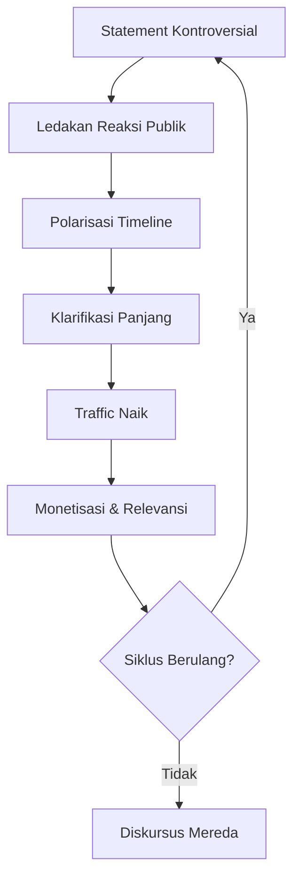
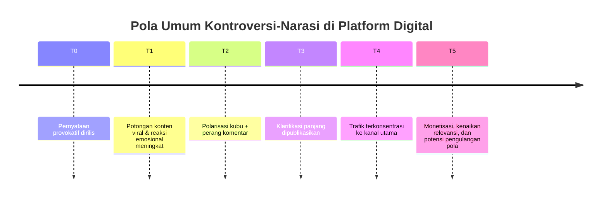
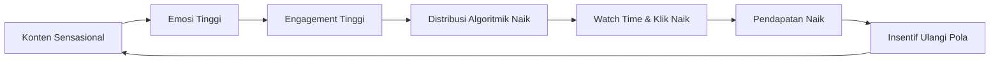
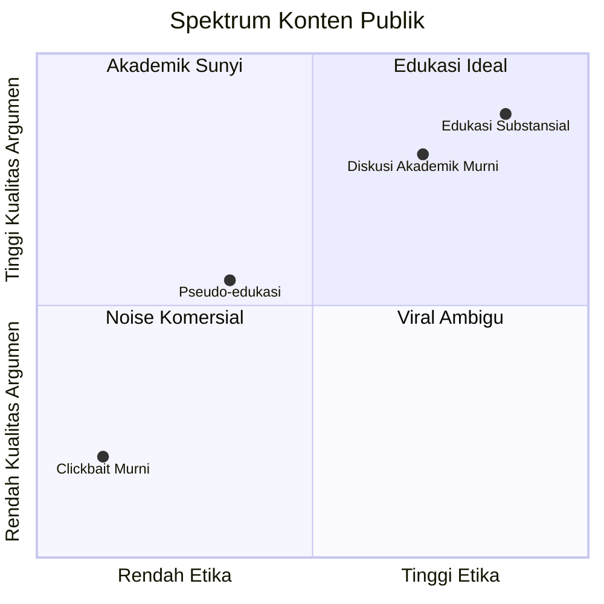
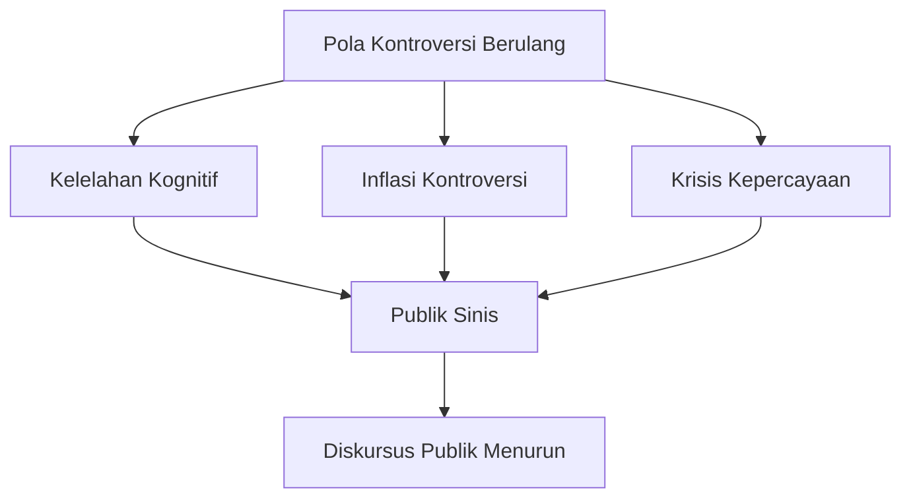
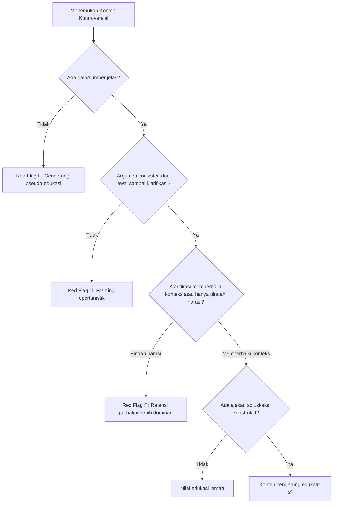

## Pendahuluan: Ketika Konten Edukatif dan Konten Provokatif Sulit Dibedakan 📱⚡

Di era digital, perdebatan tidak lagi berjalan seperti seminar akademik. Ia bergerak seperti arus deras: cepat, emosional, dan ditentukan oleh siapa yang paling piawai mengelola perhatian. Dalam konteks ini, kontroversi seputar pernyataan influencer tentang filsafat—mulai dari narasi “tidak berguna” hingga klarifikasi “filsafat adalah fondasi ilmu”—menjadi contoh penting untuk kita bedah.

Pertanyaan utamanya bukan sekadar: *siapa benar, siapa salah?*

Pertanyaan yang lebih penting justru:

- Apakah ini strategi edukasi? 🎓
- Atau strategi ekonomi perhatian? 💰
- Atau campuran keduanya, yang akhirnya melahirkan apa yang disebut **pseudo-edukasi**? 🎭

Esai ini mencoba membaca fenomena tersebut secara kritis namun proporsional melalui tiga lensa: **sosiologi**, **ekonomi digital**, dan **psikologi perilaku publik**.

---

## 1) Perspektif Sosiologi: Framing Bukan Sekadar Pilihan Kata, tapi Pilihan Realitas 🧠

### Kronologi Umum Pola Narasi di Media Sosial (Timeline) ⏱️

Dalam teori **framing** Robert Entman, aktor publik tidak hanya “menyampaikan fakta”, melainkan **memilih aspek realitas** tertentu untuk ditonjolkan agar publik melihat isu dari sudut tertentu.

Ketika satu narasi dilempar dengan diksi ekstrem—misalnya pelabelan bidang ilmu sebagai tidak relevan—yang terjadi bukan sekadar pemantik diskusi. Narasi itu sekaligus menjadi:

1. pemicu emosi kolektif,
2. pemecah kubu,
3. pengarah algoritma.

Dengan kata lain, framing yang sensasional sangat mungkin efektif secara metrik (engagement), tapi belum tentu sehat secara epistemik (kualitas pengetahuan publik).

<Callout type="important" title="Inti Framing di Media Sosial">
Di platform digital, framing yang paling menyala biasanya menang atensi terlebih dulu. Problemnya: yang menang atensi belum tentu menang kualitas argumen. 🔥
</Callout>

### Risiko Sosialnya

Dari sudut **Masyarakat Risiko** Ulrich Beck, masyarakat modern hidup dalam kecemasan dan ketidakpastian. Dalam situasi itu, publik cenderung menyukai jawaban cepat, tegas, dan hitam-putih—meskipun realitas sebenarnya kompleks.

Akibatnya, narasi anti-humaniora bisa menguat bukan karena argumennya lebih baik, tapi karena **format penyampaiannya lebih viral**.

---

## 2) Perspektif Ekonomi: Attention Economy sebagai Mesin Insentif Kontroversi 💸

Dalam teori **attention economy** (Simon; Davenport & Beck), perhatian publik adalah komoditas utama. Siapa yang menguasai perhatian, menguasai distribusi, dan pada akhirnya—menguasai monetisasi.

Model bisnis platform mendorong pola:

1. lempar pernyataan kontroversial,
2. biarkan reaksi meledak,
3. hadirkan klarifikasi panjang,
4. konversi traffic ke platform monetisasi.

Secara ekonomi, ini rasional. Secara etika, ini problematik.

### Mengapa Problematis?

Karena emosi publik diposisikan sebagai bahan bakar. Kemarahan, kebingungan, dan rasa penasaran diolah menjadi impresi, view, watch time, lalu pendapatan.

Ini menciptakan paradoks:

- semakin gaduh narasinya, semakin tinggi nilai ekonominya 📈
- semakin tenang dan nuansa, semakin sulit bersaing di algoritma 📉

<Callout type="warning" title="Dilema Besar Kreator Edukasi">
Jika insentif platform lebih menghargai kegaduhan daripada ketelitian, maka kreator edukasi punya godaan kuat untuk “membumbui” argumen agar tetap hidup di timeline. ⚠️
</Callout>

---

## 3) Pseudo-Edukasi: Ketika Citra Edukatif Bertemu Taktik Manipulatif 🎭

Istilah **pseudo-edukasi** relevan saat konten memakai kemasan intelektual, tetapi mekanisme distribusinya justru bertumpu pada teknik provokasi emosional berulang.

Ciri-cirinya antara lain:

- judul/statement pemantik yang ekstrem,
- pembingkaian biner,
- klarifikasi yang datang setelah ledakan,
- retorika “saya hanya memantik diskusi,”
- namun siklus ini diulang sebagai pola konten.

Di titik ini, publik berhak bertanya: apakah tujuan utamanya memang pendidikan, atau **retensi perhatian**?

Pertanyaan ini penting, karena kualitas diskursus publik ikut ditentukan oleh kejujuran motif para opinion leader.

---

## 4) Perspektif Psikologi: Perlu Hati-hati Membedakan Pola Digital vs Diagnosa Klinis 🧩

Banyak orang cepat memberi label psikologis pada figur publik saat melihat pola cari perhatian. Namun, dari sisi ilmiah, kita harus tegas: **diagnosis klinis tidak bisa dilakukan dari observasi konten semata**.

Benar bahwa strategi konten tertentu dapat menunjukkan:

- kebutuhan validasi,
- sensitivitas pada eksposur,
- perilaku eksploitatif terhadap emosi audiens.

Tapi itu **belum cukup** untuk menyimpulkan gangguan kepribadian. Penilaian klinis memerlukan evaluasi profesional, riwayat perilaku yang konsisten, dan konteks psikologis yang komprehensif.

<Callout type="tip" title="Sikap Intelektual yang Sehat">
Kritik strategi komunikasinya, kritik dampak sosialnya, kritik etika monetisasinya. Namun hindari diagnosis personal tanpa dasar klinis. Itu lebih adil dan lebih ilmiah. ✅
</Callout>

---

## 5) Kontradiksi Paling Menonjol: Memuji Filsafat, Tapi Memakai Taktik Anti-Filsafat 🤔

Filsafat menuntut ketelitian konsep, konsistensi argumen, dan kejujuran intelektual. Jika seseorang memuji filsafat sebagai fondasi ilmu, tetapi menggunakan pola komunikasi yang mengutamakan sensasi di atas ketelitian, maka muncul kontradiksi performatif.

Secara sederhana:

- isi pesannya tampak pro-kritis,
- tapi cara menyampaikannya justru memperkuat budaya anti-kritis.

Ini bukan hanya masalah individu, tetapi masalah ekosistem: platform memberi hadiah pada “yang membakar,” bukan “yang membangun.”

---

## 6) Apakah Provokasi Selalu Salah? Tidak. Tapi Ada Batas Etisnya ⚖️

Provokasi dalam ruang publik kadang perlu untuk membongkar apatisme. Banyak isu penting justru naik ke permukaan karena ada shock statement.

Namun provokasi menjadi berbahaya ketika:

1. disengaja untuk menyesatkan konteks,
2. tidak disertai tanggung jawab korektif yang sepadan,
3. dipakai berulang sebagai skema monetisasi emosi.

Di sinilah batas antara edukasi strategis dan pseudo-edukasi mulai terlihat jelas.

---

## 7) Dampak Jangka Panjang pada Publik: Kelelahan Kognitif dan Krisis Kepercayaan 🧨

Kalau pola ini dibiarkan, ada tiga dampak jangka panjang:

### A) Kelelahan Kognitif 😵
Publik lelah membedakan mana argumen sungguhan, mana framing komersial.

### B) Inflasi Kontroversi 📣
Ambang keterkejutan naik terus. Konten harus makin ekstrem agar tetap relevan.

### C) Krisis Kepercayaan 🧊
Ketika audiens merasa “dimainkan”, trust turun. Sekali trust runtuh, edukasi berkualitas pun ikut terdampak.

---

## 8) Apa yang Bisa Kita Lakukan sebagai Audiens dan Kreator? 🛠️

### Decision Tree: Ini Edukasi Substansial atau Pseudo-Edukasi? 🌳

### Untuk Audiens
- Jangan langsung bereaksi pada potongan 15 detik.
- Pisahkan pernyataan awal dan klarifikasi akhir.
- Tanyakan: *siapa diuntungkan dari format konflik ini?*

### Untuk Kreator
- Bangun argumen sebelum membangun sensasi.
- Jika sengaja memantik, pastikan framing tidak menyesatkan.
- Jadikan klarifikasi sebagai tanggung jawab, bukan sekadar strategi funnel.

### Untuk Ekosistem
- Dorong literasi framing & literasi algoritma di pendidikan publik.
- Beri ruang lebih untuk format diskusi panjang yang bernuansa.
- Evaluasi metrik keberhasilan konten edukasi: bukan hanya view, tapi dampak pemahaman.

---

## Kesimpulan: Edukasi Sejati Butuh Integritas, Bukan Sekadar Engagement 🌱

Fenomena ini menunjukkan satu pelajaran penting: di era di mana perhatian adalah mata uang, **integritas epistemik** menjadi komoditas paling langka.

Konten edukasi yang sehat bukan berarti harus steril dari provokasi. Tapi ia wajib menjaga:

- kejujuran konteks,
- konsistensi posisi,
- tanggung jawab sosial.

Tanpa itu, yang lahir bukan pencerahan publik, melainkan sirkus narasi yang menguntungkan segelintir pihak dan melelahkan semua orang.

Dan jika kita benar-benar percaya filsafat penting, maka cara kita berdebat pun harus mencerminkan filsafat itu sendiri: jernih, adil, dan bertanggung jawab. 📚✨

---

## Referensi

- Beck, U. (1992). *Risk Society: Towards a New Modernity*. Sage Publications.
- Davenport, T. H., & Beck, J. C. (2001). *The Attention Economy: Understanding the New Currency of Business*. Harvard Business Review Press.
- Entman, R. M. (1993). “Framing: Toward Clarification of a Fractured Paradigm.” *Journal of Communication*, 43(4), 51–58.
- Priyono, B. H. (2016). *Filsafat dan Krisis Humaniora*. Kompas Gramedia.
- American Psychiatric Association. (2013). *Diagnostic and Statistical Manual of Mental Disorders (DSM-5)*.
