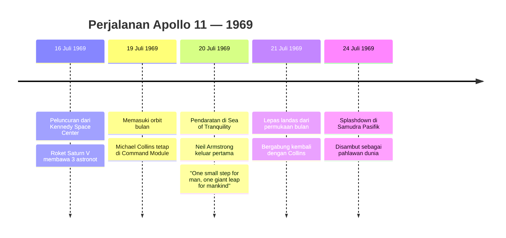
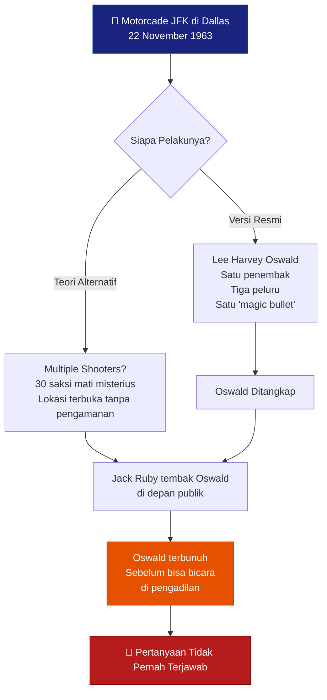
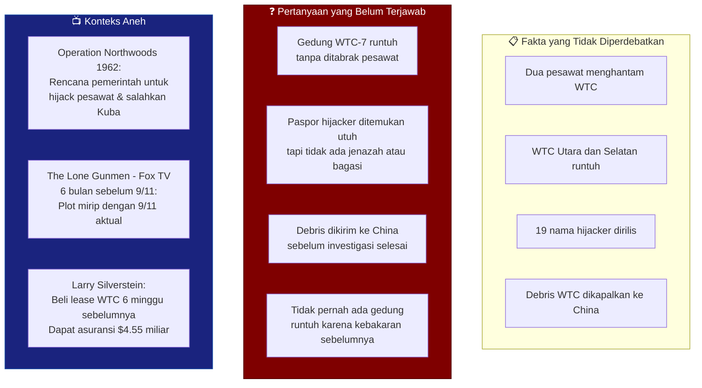
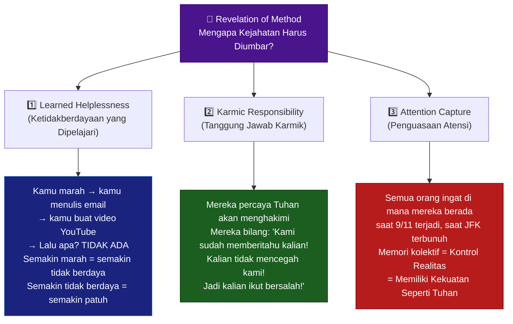
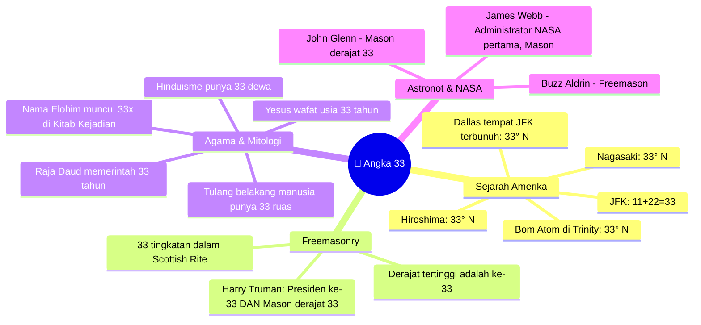
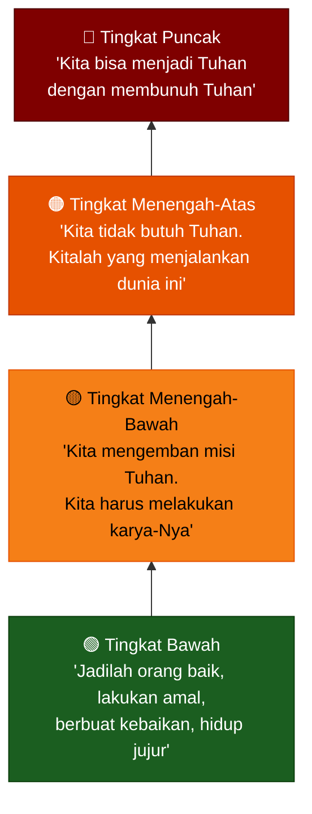
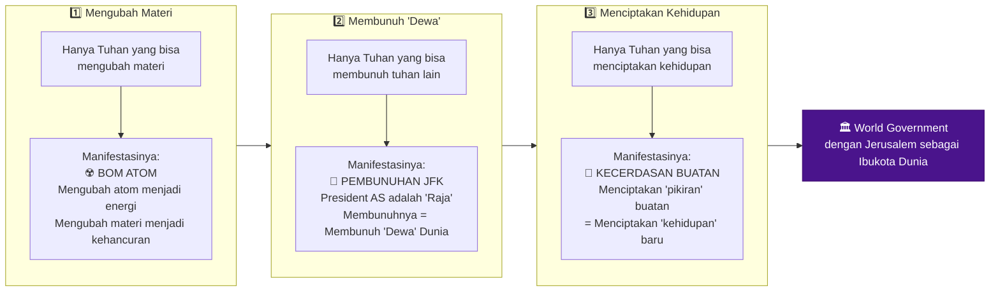
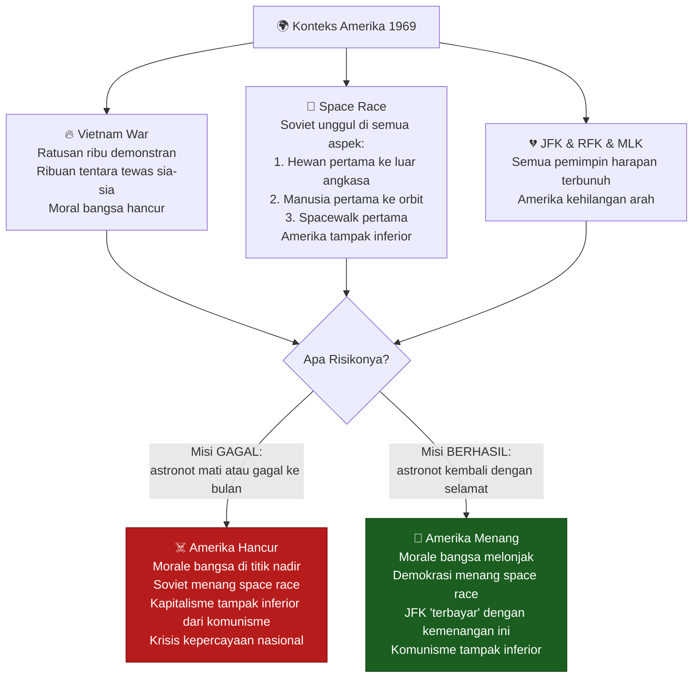
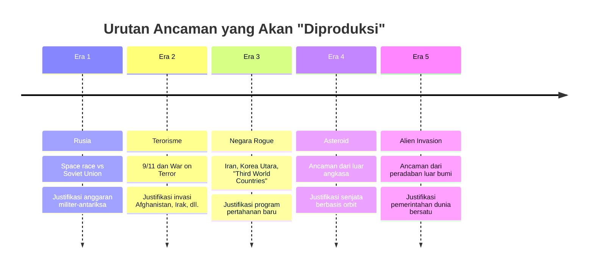
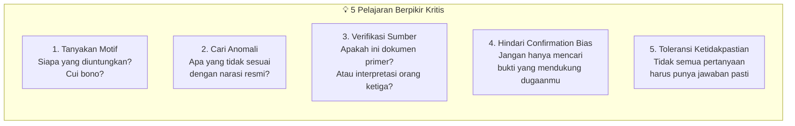

## Selamat Datang di "Sejarah Tersembunyi" 🕵️‍♂️🌑

*"Tiga peristiwa. Satu benang merah. Dan ribuan pertanyaan yang belum terjawab."*

Apa yang benar-benar terjadi pada **20 Juli 1969** ketika Neil Armstrong mengklaim menginjakkan kaki di bulan? 🌙

Apa yang sesungguhnya terjadi pada **22 November 1963** ketika John F. Kennedy terbunuh di Dallas? 🎯

Dan apa yang sebenarnya ada di balik **11 September 2001**, hari yang mengubah sejarah dunia selamanya? 🏙️💥

Dalam kuliah **Secret History #10: The Conspiracy of Evil** ini, kita tidak akan mencari jawaban tunggal yang pasti. Kita akan melakukan sesuatu yang lebih berharga: **membedah setiap peristiwa dengan alat berpikir yang tepat** — Game Theory, analisis logis, dan pemahaman tentang bagaimana kekuasaan benar-benar bekerja di dunia ini.

Bersiaplah untuk mempertanyakan segalanya. 🤔

<Callout type="warning" title="Catatan Penting Sebelum Membaca">
Artikel ini adalah rangkuman analitis dari materi kuliah akademis yang mengeksplorasi berbagai **kemungkinan dan teori** seputar peristiwa bersejarah. Ini bukan klaim kebenaran absolut. Tujuannya adalah mengembangkan **kemampuan berpikir kritis** — bukan mempromosikan teori konspirasi tertentu. Selalu verifikasi informasi dari sumber primer sebelum menarik kesimpulan.
</Callout>

---

## Bagian I: Pendaratan di Bulan 🌙🚀

### "Prestasi Terbesar dalam Sejarah Manusia"

**20 Juli 1969.** NASA mengirim tiga astronot ke luar angkasa — Buzz Aldrin, Michael Collins, dan Neil Armstrong. Armstrong menjadi manusia pertama yang berjalan di bulan, dan momen bersejarah itu disiarkan *live* ke seluruh dunia.

400.000 orang bekerja selama bertahun-tahun untuk NASA demi mewujudkan misi ini. Presiden Nixon bahkan mengadakan panggilan telepon langsung dengan para astronot dari Gedung Putih ke permukaan bulan — sebuah pencapaian teknologi komunikasi yang luar biasa.

### Pertanyaan-Pertanyaan yang Mengganggu 🤨

Namun di balik narasi kepahlawanan itu, ada sejumlah hal yang *membuat banyak orang mengernyitkan dahi*:

**1. Konferensi Pers yang Aneh 😶**

Setelah kembali dari bulan, para astronot mengadakan konferensi pers. Seorang wartawan bertanya: *"Apakah kalian bisa melihat bintang dari permukaan bulan?"*

Jawabannya mengejutkan:

> *"Kami tidak ingat melihat bintang apapun."* — Neil Armstrong & Buzz Aldrin

Bayangkan: kamu baru saja pulang dari **satu-satunya perjalanan manusia ke bulan dalam sejarah**, dan kamu **tidak ingat** apakah melihat bintang atau tidak? Ini seperti kamu baru naik gunung Everest dan ditanya "apakah cuacanya dingin?" — dan kamu bilang *"Hmm, saya tidak yakin."*

Sikap mereka di konferensi pers itu juga digambarkan aneh: gugup, tidak ekspresif, seolah ada beban berat yang mereka pikul. Jauh dari ekspresi yang diharapkan dari orang yang baru melakukan **pencapaian terbesar sepanjang sejarah manusia**. 😐

**2. Masalah Van Allen Belt ☢️**

Ada yang namanya **Van Allen Belt** — sabuk radiasi elektromagnetik yang mengelilingi bumi dan melindungi kita dari radiasi kosmik. Sabuk ini sendiri dipenuhi radiasi tinggi.

Beberapa ilmuwan berargumen: untuk pergi ke bulan, astronot harus **menembus sabuk Van Allen** yang penuh radiasi. Dan di luar sabuk itu, tidak ada perlindungan dari radiasi kosmik. Artinya mereka terancam dari dua arah: radiasi di dalam sabuk, dan radiasi kosmik di luar sabuk.

*Apakah teknologi pelindung 1969 cukup untuk mengatasi ini?* Pertanyaan yang masih diperdebatkan hingga hari ini. 🔬

**3. NASA "Kehilangan" Semua Data 📂❌**

Ironisnya, NASA mengklaim bahwa mereka **kehilangan** rekaman asli telemetri Apollo 11, sebagian besar data teknis, dan bahkan *blueprints* Saturn V yang digunakan untuk mengirim manusia ke bulan. Oops.

Saat ini, Amerika dan China sedang **bersusah payah** mencoba kembali ke bulan — padahal katanya sudah berhasil melakukannya 50+ tahun lalu dengan teknologi yang jauh lebih primitif. 🤷

<Callout type="question" title="Lima Kemungkinan yang Bisa Kamu Pilih">
Tidak ada yang bisa memaksamu percaya satu versi. Berikut **lima kemungkinan** yang logis:

1. **Pendaratan nyata, footage asli** — Percayai pemerintah. Data yang hilang hanyalah kelalaian administratif.
2. **Pendaratan nyata, footage dibuat ulang** — NASA berhasil ke bulan, tapi menemukan "sesuatu" di sana yang tidak bisa diceritakan ke publik. Footage resmi adalah rekonstruksi.
3. **Pendaratan nyata, footage dipalsukan** — Pergi ke bulan berhasil, tapi kualitas rekaman asli buruk. NASA membuat versi "cinematic" agar lebih impressive di TV.
4. **Pendaratan nyata, footage dipalsukan untuk tipu Soviet** — Biarkan Soviet menyangka footage itu asli agar mereka tidak bisa reverse-engineer teknologi AS.
5. **Pendaratan tidak pernah terjadi** — Amerika tidak pernah ke bulan.
</Callout>

---

## Bagian II: Pembunuhan JFK 🎯👔

### 22 November 1963: Hari Amerika Kehilangan Rajanya

**John Fitzgerald Kennedy** bukan sekadar presiden. Bagi banyak orang Amerika, ia adalah simbol harapan, keidealan, dan kejayaan Amerika yang sesungguhnya. Ketika ia dibunuh di Dallas, Texas pada 22 November 1963, seluruh Amerika seperti kehilangan arah.

Pemerintah membentuk **Warren Commission** — komisi investigasi yang dipimpin Lyndon B. Johnson — dan setelah penyelidikan berbulan-bulan menghasilkan laporan ribuan halaman, kesimpulannya: hanya **satu orang** yang bertanggung jawab: **Lee Harvey Oswald**, yang bertindak sendiri karena simpati komunisnya.

### Kejanggalan yang Sulit Diabaikan 🧐

**1. Pengamanan yang Aneh 🚨**

Lihat foto motorcade JFK: presiden Amerika duduk di mobil terbuka, *tanpa atap*, di jalan raya umum yang penuh orang. Penjaga keamanan? Ada — tapi mereka **di belakang mobil** JFK, bukan di sampingnya. Mobil-mobil pengawal lain di sisi jalan, sementara mobil JFK sendiri dibiarkan tanpa perlindungan jarak dekat.

Siapapun yang berdiri di pinggir jalan bisa langsung mencapai JFK. Ini sangat tidak sesuai standar pengamanan presiden Amerika. 🤦

**2. The "Magic Bullet" 🔮**

Warren Commission mengklaim Lee Harvey Oswald menembak **tiga kali** dari gedung Texas School Book Depository. Salah satu pelurunya adalah yang disebut "magic bullet" — karena peluru ini harus:
- Masuk ke tubuh JFK dari belakang
- Keluar dari leher JFK
- Masuk ke punggung Gubernur Connally yang duduk di depan JFK
- Menembus tubuh Connally, melukai pergelangan tangan dan pahanya

Semua itu dilakukan oleh **satu peluru** yang berjalan zig-zag. Secara fisika, ini sangat dipertanyakan. 🤯

**3. Oswald Ditembak Sebelum Bicara 🔇**

Dua hari setelah penangkapan, saat Oswald hendak dipindahkan, seorang pria bernama **Jack Ruby** — pemilik nightclub yang punya koneksi kuat dengan dunia kriminal Dallas — tiba-tiba menerobos kerumunan dan menembak Oswald point blank di depan kamera TV nasional.

Pertanyaannya: **bagaimana Ruby bisa masuk?** Tidak ada security yang menghentikannya. Dan Oswald yang diapit dua polisi bertubuh besar tidak bisa menghindar sama sekali.

Oswald mati. Dan bersama kematiannya, banyak pertanyaan ikut terkubur. 💀

**4. 30 Saksi Mati Misterius ⚰️**

Setidaknya **30 orang saksi** pembunuhan JFK meninggal dalam waktu singkat setelahnya — dengan cara-cara yang "kebetulan": kecelakaan, bunuh diri, penyakit mendadak. Probabilitas statistik ini hampir nol jika semuanya kebetulan. 📊

**5. RFK Dibunuh Juga — 1968 🔫**

Seolah belum cukup, **Robert F. Kennedy** — adik JFK yang sedang menuju nominasi presiden dari Partai Demokrat — juga dibunuh pada tahun 1968. Tersangka: **Sirhan Sirhan**, pria yang hingga hari ini mengklaim tidak bersalah.

Dua Kennedy. Dua pembunuhan. Dua "penembak tunggal" yang tidak terlihat seperti pembunuh. 🤨

---

## Bagian III: 9/11 — Hari yang Mengubah Dunia 🏙️💥

### 11 September 2001: Versi Resmi

Delapan belas teroris Al-Qaeda membajak empat pesawat. Dua menghantam World Trade Center (menara utara dan selatan). Satu menghantam Pentagon. Satu jatuh di Pennsylvania. Akibat kebakaran hebat, baja penyangga menara meleleh menggunakan teori "pancake collapse". Kedua menara runtuh. Lalu Amerika menyatakan perang melawan terorisme. 

### Anomali yang Memicu Pertanyaan 🔍

**1. WTC Gedung 7: Tidak Ada yang Memukulnya 🏢❓**

Dua menara utama WTC runtuh karena ditabrak pesawat — itu dapat dipahami. Tapi ada gedung ketiga yang juga runtuh pada hari yang sama: **WTC Building 7**, gedung 47 lantai yang terletak di seberang jalan.

Tidak ada pesawat yang menghantamnya. Hanya ada kebakaran kecil di beberapa lantai. Dan pada pukul 17:20 sore, gedung itu runtuh dalam waktu **6,5 detik** — hampir tepat seperti kecepatan **free-fall** (jatuh bebas tanpa hambatan).

Dalam seluruh sejarah arsitektur dan teknik sipil, **tidak pernah ada satu pun gedung pencakar langit yang runtuh hanya karena kebakaran** — sebelum atau sesudah 9/11.

**2. Paspor Bertahan, Jenazah Tidak 🛂**

Ledakan dan kebakaran di WTC disebut sangat dahsyat hingga hampir **tidak ada jenazah yang bisa diidentifikasi** dan tidak ada bagasi yang ditemukan.

Tapi... paspor **Mohammed Atta** (salah satu pemimpin hijacker) ditemukan utuh di antara puing-puing.

*Logikanya: ledakan yang menghancurkan tulang manusia dan menghanguskan koper baja bisa gagal merusak paspor kertas?* 🤔

**3. Puing Dikirim ke China Sebelum Investigasi 🚢**

Sebulan setelah 9/11, semua puing baja dan beton WTC **dikapalkan ke China**. Ini sangat tidak lazim dari sudut pandang investigasi kriminal — puing tersebut adalah *crime scene evidence* yang seharusnya diperiksa secara menyeluruh sebelum dipindahkan.

**4. Operation Northwoods (1962) 📄**

Dokumen pemerintah AS yang *declassified* mengungkap rencana bernama **Operation Northwoods** — sebuah proposal resmi yang diajukan kepada Presiden Kennedy pada 1962. Isinya: pemerintah AS akan **membajak pesawat sipil sendiri**, menembaknya jatuh, lalu menyalahkan Kuba — sebagai justifikasi untuk menyerang Kuba.

Kennedy menolak rencana ini. Tapi fakta bahwa **rencana seperti ini pernah diusulkan secara resmi** mengubah cara kita melihat kemungkinan-kemungkinan di 9/11. 📃

**5. The Lone Gunmen: Fiksi yang Terlalu Mirip Kenyataan 📺**

Enam bulan sebelum 9/11, Fox TV menayangkan **episode pilot** serial *The Lone Gunmen* — spin-off dari X-Files. Plot episodenya:

- Pemerintah secara rahasia **mengendalikan pesawat dari jarak jauh** (remote control)
- Pesawat tersebut diarahkan untuk **menabrak World Trade Center**
- Tujuannya: menyalahkan teroris untuk memulai perang di Timur Tengah

*Fiksi sains yang menjadi kenyataan 6 bulan kemudian? Atau sesuatu yang lain?* 🎬

**6. Larry Silverstein: Orang Paling "Beruntung" Sedunia 🍀💰**

**Larry Silverstein** membeli lease (hak sewa) World Trade Center hanya **enam minggu** sebelum 9/11 terjadi. Dia punya dua keanehan besar:

- *Kebodohan*: WTC punya masalah asbestos yang biaya removalnya **melebihi nilai gedung itu sendiri**. Kenapa beli properti yang akan membuatmu bangkrut?
- *Keberuntungan*: Dia juga memaksa perusahaan asuransi menaikkan nilai pertanggungan dari $1,5 miliar menjadi $3,5 miliar.

Setelah 9/11, Silverstein mengklaim bahwa karena **dua serangan** terjadi (bukan satu), dia berhak mendapat **dua kali lipat** nilai asuransi. Pengadilan akhirnya mengabulkan $4,55 miliar. 💸

Oh, dan pada hari 9/11, Silverstein absen dari kantornya di WTC karena... **janji dengan dokter kulit**. 😶

---

## Babak IV: Revelation of Method — Mengapa Mereka Membiarkan Kita Tahu? 🔓

### Paradoks Besar

Sekarang kita sampai pada pertanyaan paling menarik: **jika semua ini adalah konspirasi, kenapa mereka membiarkan kita membicarakannya?**

Kenapa video-video mencurigakan itu masih ada di YouTube? Kenapa dokumen Operation Northwoods di-declassify? Kenapa ada begitu banyak "bukti" yang bisa ditemukan siapapun?

Jawabannya ada dalam konsep yang disebut **"Revelation of Method"** — pengungkapan cara. 🗝️

### 1. Learned Helplessness — Ketidakberdayaan yang Terprogram 😶

Konsep dari psikologi perilaku: jika kamu berulang kali mencoba tapi gagal, akhirnya kamu **berhenti mencoba sama sekali** — bahkan saat sebenarnya kamu sudah bisa berhasil.

Dalam konteks ini: biarkan rakyat **tahu** bahwa ada konspirasi. Biarkan mereka marah. Biarkan mereka berdebat dan berteriak.

Lalu tunjukkan bahwa **tidak ada yang bisa mereka lakukan untuk mengubah apapun**.

Hasilnya? Semakin banyak orang yang tahu, semakin mereka merasa tidak berdaya. Dan orang yang merasa tidak berdaya adalah orang yang paling mudah diperintah. 🪤

### 2. Karmic Responsibility — Berbagi Dosa 👻

Ini konsep yang lebih metafisis. Banyak orang yang *berkuasa* — menurut narasi ini — sangat **percaya takhayul dan karma**. Mereka percaya suatu hari nanti mereka akan dihakimi atas perbuatan mereka.

Solusi mereka: **ungkapkan apa yang kamu lakukan, lalu biarkan rakyat tidak bereaksi**.

Logikanya: *"Kami sudah memberitahu kalian bahwa kami melakukan ini. Kalian melihatnya. Kalian mengetahuinya. Tapi kalian tidak melakukan apa-apa untuk menghentikan kami. Maka kalian adalah peserta yang diam — dan kalian ikut menanggung dosanya."*

Itu sebabnya Operation Northwoods *di-declassify*. Itu sebabnya ada acara TV yang plotnya mirip 9/11. Itu sebabnya bukti-bukti "sengaja" dibiarkan. 📺

<Callout type="important" title="Implikasi yang Menggelisahkan">
Jika logika karmic responsibility ini benar, maka **memilih untuk diam dan tidak peduli** bukan lagi posisi netral — melainkan bentuk persetujuan aktif. Ini pertanyaan yang sangat berat untuk dipikirkan.

Apakah ketidakpedulian kita terhadap ketidakadilan adalah bentuk kompromi moral yang kita lakukan setiap hari?
</Callout>

### 3. Attention Capture — Memiliki Kuasa Seperti Tuhan 🧠

Pertanyaan: di mana kamu saat 9/11 terjadi? Dengan siapa? Apa yang sedang kamu lakukan?

Hampir semua orang yang hidup di era itu bisa menjawab pertanyaan ini dengan detail — bahkan jika mereka berada di **Indonesia, Tunisia, atau Korea**. Bukan di Amerika.

Ini adalah **attention capture** — penguasaan atas memori dan persepsi kolektif manusia di seluruh dunia.

Jika kamu bisa mengontrol apa yang dipikirkan dan diingat oleh miliaran manusia — apakah perbedaan antara itu dan **kekuatan ilahi**? 🌐

---

## Bagian V: Numerologi dan 33 — Bahasa Rahasia Kaum Elit 🔢✡️

### Angka yang Terus Muncul

Salah satu pola paling aneh yang teridentifikasi oleh para peneliti konspirasi adalah **penggunaan angka 33** secara berulang di berbagai peristiwa besar.

### Paralel Geografis yang Mencengangkan 🗺️

Jika kamu menarik garis horizontal di **33 derajat lintang utara** pada peta dunia, kamu akan melewati:

| Lokasi | Signifikansi |
|--------|-------------|
| 🏛️ Mesopotamia (Tigris-Efrat) | Tempat peradaban manusia pertama lahir |
| 🕌 Baghdad | Pusat Kekhalifahan Islam era keemasan |
| 🕍 Damaskus | Salah satu kota tertua di dunia |
| ✡️ Jerusalem | Kota paling suci bagi Kristen, Yahudi, dan Islam |
| 📍 Dallas, Texas | Tempat JFK dibunuh |
| ☢️ Trinity Test Site, New Mexico | Tempat uji coba bom atom pertama |
| 💣 Hiroshima | Kota yang dibom atom |
| 💣 Nagasaki | Kota yang dibom atom |
| 🏺 Harappa | Peradaban Lembah Indus |

Apakah ini kebetulan? Atau apakah orang-orang yang merencanakan peristiwa besar ini memang secara sengaja memilih lokasi di **33 derajat lintang utara** sebagai bagian dari ritual simbolis? 🤷

### Harry Truman: Presiden ke-33, Mason Derajat ke-33 ☢️

**Harry S. Truman** adalah orang yang memerintahkan pengeboman atom Hiroshima dan Nagasaki. Ia adalah **Presiden Amerika ke-33** dan juga **Freemason derajat ke-33** — tingkat tertinggi dalam hierarki Freemasonry.

Yang membuat ini semakin menarik: pada saat perintah itu dikeluarkan, Jepang sudah hampir kalah. Amerika sedang **membakar Tokyo** dengan bom pembakar yang meluluhlantakkan seisi kota. Para analis militer sepakat Jepang akan menyerah dalam hitungan bulan tanpa perlu serangan nuklir.

Lalu kenapa bom atom tetap dijatuhkan? Dan kenapa tepat di dua kota yang berada di **33 derajat lintang utara**? 🤔

---

## Bagian VI: Secret Societies — Bagaimana Mereka Bekerja 🎭

### Struktur Berlapis Seperti Bawang

Secret societies tidak bekerja dengan satu hierarki komando yang jelas. Mereka bekerja dalam sistem **lapisan terkunci (compartmentalized)** — di mana setiap anggota hanya tahu apa yang perlu mereka ketahui sesuai tingkatan mereka.

Anggota di tingkat paling bawah **tidak tahu** apa yang terjadi di puncak. Bahkan mungkin mereka akan terkejut dan terguncang jika mengetahui "tujuan sebenarnya" dari organisasi yang mereka ikuti. Ini persis seperti:

- Di SD kamu diajarkan A
- Di SMA gurumu bilang: "Apa yang kamu pelajari di SD itu salah, ini yang benar"
- Di universitas dosenmu bilang: "Apa yang kamu pelajari di SMA itu salah, ini yang lebih benar"
- Di program doktoral: "Semua yang kamu pelajari sebelumnya tidak lengkap"

Semakin tinggi kamu naik, semakin "gelap" kebenaran yang kamu temukan. 🪜

### Dua Mekanisme Kontrol 🔒

**Mekanisme 1: Insentif (Wortel 🥕)**

Semakin tinggi naik = semakin banyak kekuasaan, uang, dan privilege. Orang-orang di level menengah tidak mau kehilangan posisi mereka. Mereka lebih memilih **percaya pada kebohongan yang menguntungkan mereka** daripada mengakui kebenaran yang akan membuat mereka kehilangan segalanya.

**Mekanisme 2: Blackmail (Tongkat 🪄)**

Untuk bisa naik ke tingkat teratas, kamu harus **melakukan kejahatan bersama** anggota lain. Foto-foto, rekaman, bukti kejahatan itu disimpan. Sekarang kamu tidak bisa membocorkan rahasia mereka — karena jika kamu melakukannya, **bukti kejahatanmu** juga akan terekspos.

Ini yang disebut **transgression** — ikatan melalui dosa bersama. Itulah mengapa ribuan orang bisa menjaga rahasia: mereka semua saling sandera. 🤫

### Mengapa Birokrasi adalah Surga Secret Societies? 🏛️

Ini adalah insight yang sangat cerdas dari kuliah ini: **secret societies menjadi paling kuat ketika masyarakat paling birokratis**.

Logikanya begini: birokrasi besar terdiri dari departemen-departemen yang **terisolasi satu sama lain** (silos). Tidak ada yang bisa berkomunikasi lintas departemen secara efisien. Tidak ada yang punya gambaran besar.

Tapi anggota secret society bisa **berkoordinasi lintas semua departemen** karena mereka saling kenal secara rahasia. Mereka bisa saling mempromosikan satu sama lain. Mereka bisa mengkoordinasikan kebijakan secara diam-diam.

Hasilnya: mereka yang **tidak terhubung** ke network ini akan selalu kalah bersaing dengan mereka yang terhubung — bukan karena perbedaan kemampuan, tapi karena **perbedaan akses informasi dan koordinasi**. 📡

---

## Bagian VII: Grand Plan — "Menjadi Tuhan" 🌍👑

### Tiga Tahap Menjadi Tuhan

Menurut narasi ini, ada **tiga tindakan** yang hanya bisa dilakukan oleh Tuhan — dan itulah tiga hal yang ingin dilakukan oleh secret societies untuk "membuktikan" bahwa mereka telah menggantikan Tuhan:

Jika ketiga hal ini berhasil dilakukan, maka — menurut logika mereka — mereka berhak **mendeklarasikan diri sebagai penguasa dunia** dengan pemerintahan global terpusat.

### Dunia Lama vs Dunia Baru 🌍🌎

Ada perbedaan filosofis mendasar antara dua sistem nilai:

**Dunia Lama (Old World) 🕌🕍⛪**
- Berbasis pada keyakinan kepada Tuhan
- "Patuhi Tuhan, ikuti hukum-Nya"
- Kota-kota suci: Yerusalem, Makkah, Roma, Baghdad, Damaskus
- Semua berada di **33 derajat lintang utara**

**Dunia Baru (New World) 🗽**
- Berbasis pada **Deisme** — keyakinan bahwa Tuhan menciptakan alam semesta, lalu pergi
- "Kita bebas untuk menjadi Tuhan kita sendiri"
- Manifest destiny: Amerika sebagai peradaban baru yang tidak terikat hukum lama
- Motto: "In God We Trust" — tapi Tuhan yang mana? 🤔

### Pax Islamica vs Pax Americana vs New World Order

Menarik bahwa tujuan akhir yang digambarkan dalam kuliah ini — **pemerintahan dunia dengan Yerusalem sebagai ibukota** — berbenturan langsung dengan:

- Proyek **Pax Islamica** yang ingin Iran bangun (kita bahas di Game Theory #9)
- Konsep **tatanan dunia multipolar** yang diinginkan Rusia dan China

Ini bukan kebetulan. Semua konflik besar di dunia saat ini bisa dilihat sebagai **pertarungan visi tatanan dunia** yang saling berlawanan. 🌐

---

## Bagian VIII: Game Theory untuk Memahami Moon Landing 🌙♟️

### Menggunakan Logika, Bukan Emosi

Alih-alih berdebat soal "apakah footage-nya asli atau palsu", kita bisa menggunakan **Game Theory** untuk menganalisis situasi dari sudut pandang strategis:

**Argumen Game Theory**: Pada 1969, Amerika dalam kondisi krisis sangat parah. Mengirim misi yang **bisa gagal** — dengan taruhan hancurnya morale bangsa dan kemenangan Soviet di mata dunia — adalah risiko **yang secara rasional tidak bisa diambil**.

Jika kamu adalah pemimpin Amerika pada saat itu, dan kamu punya pilihan antara:
- A) Kirim misi nyata dengan risiko kematian dan kegagalan publik yang memalukan
- B) Ciptakan narasi kemenangan yang tidak bisa dibantah Soviet

Dari sudut pandang pure Game Theory, **pilihan B secara strategis jauh lebih aman**.

<Callout type="note" title="Tapi Kenapa Soviet Tidak Protes?">
Ini adalah counterargument paling kuat: jika Amerika memalsukan moon landing, kenapa Soviet — yang paling punya kepentingan untuk membongkarnya — justru **tidak pernah secara resmi mengklaim itu palsu**?

Beberapa kemungkinan:
1. Soviet tidak tahu cara membuktikannya secara konklusif
2. Ada **perjanjian rahasia** antara AS dan Soviet (keduanya sama-sama ingin mempertahankan narasi "persaingan" untuk menjustifikasi anggaran militer/sains mereka)
3. Soviet punya rahasia mereka sendiri yang tidak mau dibongkar
4. Pendaratan itu memang nyata

Ini pertanyaan yang **tidak bisa dijawab dengan pasti** dari informasi yang ada. Dan itulah intinya.
</Callout>

---

## Bagian IX: Rencana Masa Depan — Dari Terorisme ke Invasi Alien? 👽

### Roadmap Manufaktur Ancaman

Menurut **Carol Rosin** — kolega Werner von Braun, ilmuwan Nazi yang dibawa AS setelah PD II untuk membangun program luar angkasa — von Braun sebelum meninggal mengungkapkan bahwa Amerika akan terus **menciptakan ancaman baru** untuk menjustifikasi pengeluaran senjata luar angkasa:

Jika skenario ini benar, maka setiap "ancaman" yang datang dalam sejarah modern adalah **produk yang sengaja dipasarkan** kepada publik untuk mengalihkan perhatian dan menjustifikasi konsentrasi kekuasaan yang semakin besar.

Apakah "invasi alien" sungguh-sungguh akan digunakan sebagai alasan untuk menciptakan **one world government**? Kita hanya bisa mengamati. 🛸

---

## Kesimpulan: Apa yang Harus Kita Lakukan dengan Semua Ini? 🤷‍♂️🧭

### Lima Pelajaran untuk Berpikir Lebih Jernih

Setelah menelusuri semua ini — pendaratan bulan, JFK, 9/11, numerologi 33, secret societies, revelation of method — apa yang seharusnya kita ambil sebagai pelajaran?

**1. Selalu Tanyakan: Siapa yang Diuntungkan? 💰**

*Cui bono?* — pertanyaan hukum Latin tertua. Sebelum menerima narasi apapun, tanya: siapa yang paling untung jika narasi ini dipercaya publik? Jika jawabannya adalah pihak yang berkuasa, itu layak diperiksa lebih lanjut.

**2. Ambil Posisi Tengah yang Bijak ⚖️**

Tidak sehat untuk 100% percaya pemerintah. Tapi juga tidak produktif untuk 100% tidak percaya apapun. **Skeptisisme sehat** artinya mempertanyakan, mencari bukti, tapi juga terbuka untuk mengubah pandangan jika bukti baru ditemukan.

**3. Bedakan Teori dan Fakta 📚**

Ada fakta yang tidak diperdebatkan (WTC-7 runtuh tanpa ditabrak pesawat — itu terjadi, terekam video). Ada teori tentang *mengapa* itu terjadi (controlled demolition, structural failure karena kebakaran, dll.). Jangan campur adukkan fakta dengan interpretasi.

**4. Waspada terhadap Confirmation Bias 🪞**

Kita semua cenderung mencari informasi yang **mendukung** apa yang sudah kita percaya. Tantang dirimu sendiri: seberapa keras kamu mencari bukti yang **membantah** kesimpulanmu sendiri?

**5. Ketidakpastian Adalah Hal yang Wajar 🌫️**

Tidak semua pertanyaan sejarah harus punya jawaban pasti. Kadang jawaban yang paling jujur adalah: *"Kita tidak tahu, dan mungkin tidak akan pernah tahu."* Dan itu okay.

<Callout type="tip" title="Yang Terpenting dari Semua Ini 🌟">
Tujuan sejati dari menganalisis peristiwa-peristiwa kontroversial ini bukan untuk memutuskan apakah kamu pro-pemerintah atau anti-pemerintah. Tujuannya adalah:

**Mengembangkan kemampuan untuk tidak mudah dimanipulasi** — oleh siapapun, termasuk oleh para pembuat teori konspirasi itu sendiri.

Di dunia yang semakin penuh informasi, kemampuan berpikir kritis bukan sekadar keunggulan — ini adalah **keharusan untuk bertahan sebagai manusia yang merdeka**.
</Callout>

---

## Pertanyaan untuk Direnungkan 🤔

1. **Apakah ada perbedaan moral** antara "menyembunyikan kebenaran" dan "membiarkan publik tidak mau tahu"?

2. **Jika revelation of method itu nyata** — bahwa kejahatan sengaja ditampilkan agar kita tahu tapi tidak bereaksi — apa tanggung jawab kita sebagai penonton?

3. **Apakah secret societies bisa eksis tanpa birokrasi?** Dan jika birokrasi adalah syaratnya, apakah cara untuk melawan mereka adalah dengan menciptakan sistem yang lebih transparan dan terdesentralisasi?

4. **Dalam era AI dan big data** — apakah "attention capture" menjadi lebih mudah atau lebih sulit? Apakah platform media sosial adalah bentuk baru dari mekanisme kontrol yang sama?

5. **Apakah pertanyaan-pertanyaan ini** sendiri adalah bagian dari "revelation of method" yang membuat kita sibuk berdebat sementara hal-hal yang lebih penting terjadi di balik layar?

---

> *"Kelas ini tidak dirancang untuk memberitahu kamu apa yang terjadi. Kelas ini dirancang untuk memberikanmu kemungkinan-kemungkinan yang berbeda dan alat-alat untuk memahami — atau mencari tahu sendiri — apa yang mungkin telah terjadi."*

<Callout type="cite" title="Sumber">
Artikel ini diadaptasi dari transkrip kuliah **Secret History #10: The Conspiracy of Evil** yang membahas teori konspirasi seputar moon landing, pembunuhan JFK, dan peristiwa 9/11 melalui pendekatan analitis dan game theory.

📎 https://www.youtube.com/watch?v=ihh1fdW4-cA
</Callout>
