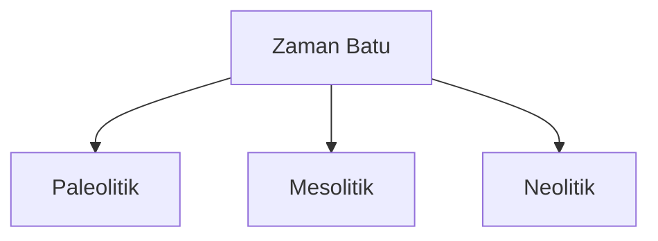

## Pengantar

Sejarah manusia merupakan cerita panjang tentang bagaimana spesies kita bertahan, berkembang, dan menciptakan peradaban. Dari jejak langkah pertama di Afrika hingga membangun kota-kota besar, perjalanan manusia penuh dengan inovasi, tantangan, dan pelajaran.

<Callout type="info" title="Tahapan Penting">
Sejarah manusia sering dibagi menjadi era-era kunci seperti prasejarah, zaman kuno, abad pertengahan, dan zaman modern.
</Callout>

## Prasejarah: Kehidupan Awal

Pada masa prasejarah, manusia hidup sebagai pemburu-pengumpul. Penemuan api, alat dari batu, dan perkembangan bahasa adalah tonggak penting yang memungkinkan manusia untuk bertahan.

Pada era Neolitik, revolusi pertanian mengubah cara manusia hidup. Mereka mulai bercocok tanam, menetap, dan membangun desa.

## Zaman Kuno: Peradaban Muncul

Revolusi agraris menjadi dasar bagi perkembangan peradaban-peradaban besar di Mesopotamia, Mesir, Lembah Sungai Indus, dan Tiongkok.

<Callout type="success" title="Penemuan Penting">
Tulisan paku dari Mesopotamia adalah salah satu sistem tulisan pertama di dunia, membuka jalan bagi dokumentasi sejarah.
</Callout>

## Abad Pertengahan dan Penemuan Baru

Zaman pertengahan adalah periode perkembangan budaya, filsafat, dan agama. Pada abad ke-15, Renaisans melahirkan kembali minat terhadap sains dan seni, membawa manusia ke era modern.

## Kesimpulan

Sejarah manusia mengajarkan kita tentang adaptasi, inovasi, dan ketahanan. Dengan memahami masa lalu, kita dapat membangun masa depan yang lebih baik. Apa hikmah yang bisa kita ambil dari perjalanan panjang ini?

<Callout type="question" title="Refleksi">
Bagaimana kita, sebagai individu dan masyarakat, bisa belajar dari sejarah untuk menciptakan dunia yang lebih baik?
</Callout>