## Pembuka: Klaim yang Bikin Orang Tua Marah 😤📚

*"Sekolah itu tidak penting. Dan sampai detik ini saya akan tetap mengatakan sekolah itu tidak penting."*

Kalimat itu sudah cukup untuk membuat guru-guru stres, orang tua murka, dan anak-anak mengangguk-angguk setuju.

Tapi tunggu — ada nuansa penting yang sering terlewat ketika kalimat itu dikutip setengah-setengah:

> *"Edukasi penting. Tapi sekolah tidak penting."*

Dua kata yang berbeda. Dua hal yang berbeda. Dan kebanyakan orang gagal membedakannya.

Inilah inti dari perdebatan yang dibahas dalam Podcast **Daddy Issues Episode 14: Sekolah Gak Penting Version 2.0** — sebuah diskusi yang jauh lebih kaya dan lebih bernuansa dari sekedar clickbait anti-pendidikan. Di sini kita akan membedah satu pertanyaan yang hampir tidak pernah ditanyakan kepada anak-anak sekolah: **mengapa sekolah ada, dan untuk apa sebenarnya ia diciptakan?**

<Callout type="abstract" title="Sumber Kajian">
Artikel ini merupakan ringkasan mendalam dari Eps 14: Sekolah Gak Penting Version 2.0 — Podcast Daddy Issues. Sumber audio tersedia di: [Eps 14 — Sekolah Gak Penting](https://www.youtube.com/watch?v=gcJvkkZHkAk). Kajian ini bersifat analitis dan kritis — bukan panduan untuk berhenti sekolah.
</Callout>

---

## Bagian I: Sebelum Ada Sekolah — Pendidikan Milik Siapa? 👑

Untuk memahami mengapa sistem sekolah modern dirancang seperti ini, kita harus mundur jauh — ke zaman sebelum ada gedung sekolah, papan tulis, dan lonceng istirahat.

Di era pra-modern, khususnya di Eropa, **pendidikan adalah hak eksklusif kaum bangsawan dan orang kaya**. Tidak ada sekolah publik. Tidak ada kelas campuran. Yang ada adalah sistem pendidikan privat (*private tutoring*) — guru-guru khusus yang datang ke rumah dan mengajar anak-anak bangsawan dalam kelompok kecil, 3 hingga 6 orang.

Pendidikan itu mencakup literatur, bahasa, filsafat, kenegaraan, seni, dan ilmu pengetahuan. Pendidikan itu dirancang untuk **menciptakan pemimpin** — orang-orang yang akan memerintah, mengelola kerajaan, menjalankan bisnis, dan mengambil keputusan besar.

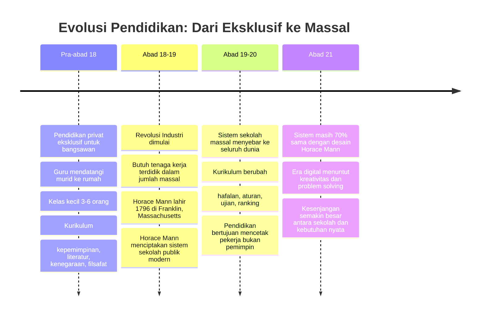

Lalu muncul satu pertanyaan yang sangat penting: **ketika para bangsawan itu memutuskan untuk "memberikan" pendidikan kepada rakyat biasa — apakah pendidikan yang mereka berikan sama dengan pendidikan yang mereka berikan untuk anak-anak mereka sendiri?**

Jawabannya: **tentu saja tidak.**

Bangsawan tidak bodoh. Mereka tidak mau memberikan pengetahuan tentang kepemimpinan, keuangan, dan kekuasaan kepada orang-orang yang nantinya akan menjadi pesaing mereka. Yang mereka berikan adalah pendidikan *minimal* — cukup untuk membaca, menulis, berhitung — supaya mereka bisa **bekerja** di pabrik-pabrik dan ladang-ladang milik para bangsawan dengan lebih efisien.

> *"Sekolah didesain agar kamu keluar dan bekerja sebagai karyawan. Bukan menjadi pemimpin."*

---

## Bagian II: Horace Mann — Orang yang Harus Disalahkan 🎩

Siapa sebenarnya Horace Mann? Dan mengapa dia layak disebut sebagai arsitek sistem pendidikan yang — setelah hampir 200 tahun — masih kita ikuti hingga hari ini?

**Horace Mann** lahir pada tahun 1796 di Franklin, Massachusetts, Amerika Serikat. Ia bukan seorang guru atau ilmuwan pendidikan — ia adalah seorang **politisi** (*politician*). Dan seperti semua politisi, ia memiliki agenda.

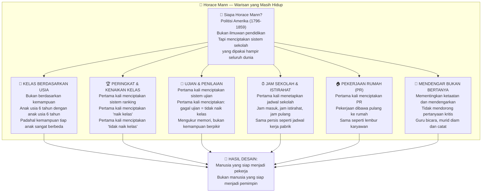

Perhatikan betapa setiap elemen sistem sekolah yang Horace Mann ciptakan memiliki **paralel langsung dengan dunia kerja pabrik**:

- **Kelas berdasarkan usia** → Jabatan berdasarkan senioritas
- **Jam sekolah ketat** → Jam kerja yang ketat
- **PR (Pekerjaan Rumah)** → Lembur yang dibawa ke rumah
- **Ranking dan kenaikan kelas** → Evaluasi kinerja dan promosi jabatan
- **Tidak boleh menyontek** → Tidak boleh berbagi informasi dengan kompetitor
- **Dengarkan guru, jangan bertanya** → Ikuti perintah atasan, jangan protes

Ini bukan kebetulan. Ini adalah **desain yang disengaja**.

Dan yang paling mengejutkan? Sistem ini diciptakan pada abad ke-18 hingga 19. Kita sekarang berada di abad ke-21. Tapi **70% dari core sistem pendidikan di seluruh dunia masih menggunakan framework Horace Mann**. Perubahan yang terjadi hanya di pinggiran — kurikulum ditambah, teknologi masuk — tapi strukturnya tetap sama.

<Callout type="warning" title="Fakta yang Tidak Nyaman">
Horace Mann merancang sistem sekolah di era Revolusi Industri, ketika yang dibutuhkan adalah **ribuan buruh pabrik** yang taat, bisa membaca instruksi, mengikuti prosedur, tidak banyak bertanya, dan datang tepat waktu. Sistem yang ia ciptakan sangat efektif untuk tujuan itu. Pertanyaannya: apakah tujuan itu masih relevan di abad ke-21?
</Callout>

---

## Bagian III: 6 Aturan Sekolah yang Berlawanan dengan Kehidupan Nyata 🔄

Ini adalah inti dari kritik yang paling tajam. Ada **6 aturan tidak tertulis** yang diajarkan sekolah kepada anak-anak setiap hari — dan keenam-enamnya bertentangan langsung dengan apa yang dibutuhkan untuk sukses di kehidupan nyata.

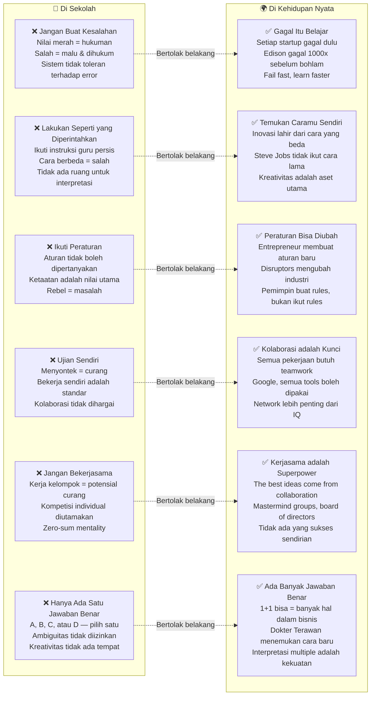

### Ketika Kamu Keluar dari Sekolah, Apa yang Terjadi?

Inilah dampak nyata dari 12-16 tahun dikondisikan oleh 6 aturan di atas:

**1. Kamu takut berbuat salah.** Karena selama bertahun-tahun, kesalahan = hukuman, nilai jelek, tidak naik kelas. Maka ketika dewasa, kamu enggan ambil risiko, enggan mencoba hal baru, dan selalu *playing safe*. Dalam dunia bisnis dan inovasi, ini adalah kematian.

**2. Kamu bekerja sendiri.** Karena selama sekolah, kerja sama = menyontek = curang. Kamu terbiasa mengandalkan diri sendiri. Kamu tidak tahu cara mendelegasikan, membangun tim, atau memanfaatkan jaringan. Padahal hampir semua kesuksesan besar dibangun oleh tim, bukan individu.

**3. Kamu egois.** Bukan dalam artian negatif, tapi dalam artian kamu tidak terlatih untuk berpikir dalam konteks kolaborasi. Segala sesuatu dilihat dari perspektif kompetisi individual — siapa yang nilainya lebih tinggi, siapa yang ranking-nya lebih baik.

**4. Kamu terpaku pada satu jawaban.** Dalam ujian, selalu ada satu jawaban yang benar. Tapi di kehidupan nyata, hampir tidak ada masalah yang hanya punya satu solusi. Dokter yang menemukan metode pengobatan baru, entrepreneur yang menciptakan model bisnis baru, arsitek yang merancang bangunan inovatif — mereka semua berhasil justru karena *tidak* mengikuti satu jawaban yang sudah ada.

> *"Ketika kamu keluar dari sekolah, kamu menjadi paralisa — karena kamu tertekan."*

**Paralisa** (*paralyzed* — terlumpuhkan) adalah kata yang sangat tepat. Kamu lumpuh bukan karena tidak mampu, tapi karena **dikondisikan untuk takut**.

---

## Bagian IV: Sekolah Tidak Mengajarkan Uang 💸

Salah satu keluhan yang paling konkret dan paling mudah diverifikasi adalah ini: **sekolah tidak mengajarkan keuangan**.

Kamu 12 tahun di sekolah. Kamu belajar integral, klorofil, struktur atom, Perang Diponegoro, tata bahasa. Semua hal yang baik — tapi semua hal yang kamu hampir tidak pernah gunakan secara langsung dalam kehidupan finansial sehari-hari.

Yang tidak pernah diajarkan:
- Cara membayar pajak dengan benar
- Cara memanfaatkan celah pajak yang legal (*tax optimization*)
- Cara berinvestasi
- Cara membaca laporan keuangan
- Cara mendirikan perusahaan
- Perbedaan aset dan liabilitas
- Cara membangun passive income
- Mengapa orang kaya lebih memilih utang daripada cash

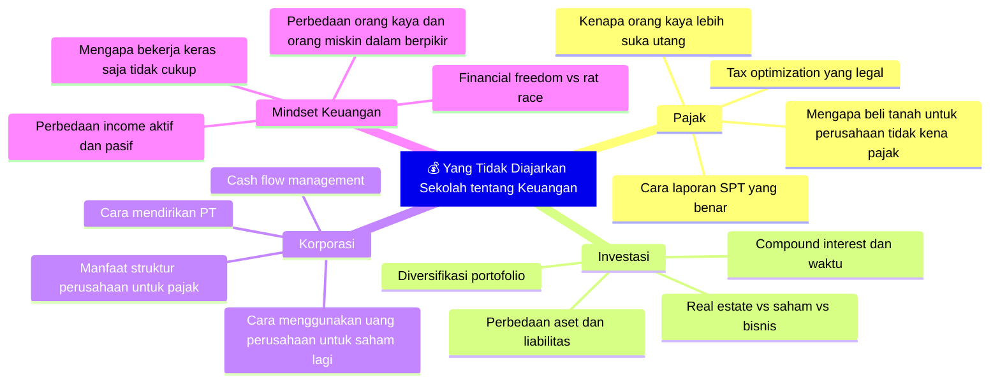

### Mengapa Orang Kaya Suka Utang?

Ada satu insight tentang keuangan yang sangat kontra-intuitif namun sangat penting: **orang kaya kebanyakan berutang — bukan karena tidak punya uang, tapi karena mereka tahu bahwa utang tidak kena pajak**.

Ketika kamu meminjam uang dari bank untuk bisnis, bunga yang kamu bayar bisa dikurangkan dari penghasilan kena pajak. Artinya, secara efektif pemerintah ikut "menanggung" sebagian biaya utangmu. Sementara kalau kamu menggunakan uang cash-mu sendiri, kamu sudah membayar pajak untuk uang itu, lalu menggunakannya tanpa keuntungan pajak apapun.

Contoh lain: jika sebuah perusahaan membeli tanah dan tanah itu digunakan untuk operasional bisnis, ada mekanisme perpajakan tertentu yang bisa meringankan beban. Jika perusahaan menyalurkan keuntungan untuk investasi saham di Indonesia, ada insentif pajak tersendiri.

Ini bukan *tips* ilegal. Ini adalah **literasi keuangan** (*financial literacy*) yang diajarkan di setiap negara maju kepada warganya yang ingin membangun kekayaan — dan yang nyaris tidak pernah muncul dalam kurikulum sekolah manapun.

> *"Mereka tidak mengajarkan ini di sekolah karena mereka tidak ingin kamu menjadi kaya. Mereka ingin kamu menjadi pekerja."*

---

## Bagian V: Masalah Sistem Les — Melesin Kelemahan, Bukan Kekuatan 🎨

Ada ironi besar dalam budaya les (*tutoring*) yang marak di Indonesia. Orang tua yang peduli dengan pendidikan anaknya berusaha keras meningkatkan nilai akademis anak mereka — dengan melesin mata pelajaran yang nilainya paling buruk.

Logikanya tampak masuk akal: nilainya jelek di matematika, les-kan matematika. Nilainya buruk di kimia, les-kan kimia. Tingkatkan kelemahan, tutup kekurangan.

Tapi tunggu — logika apa ini?

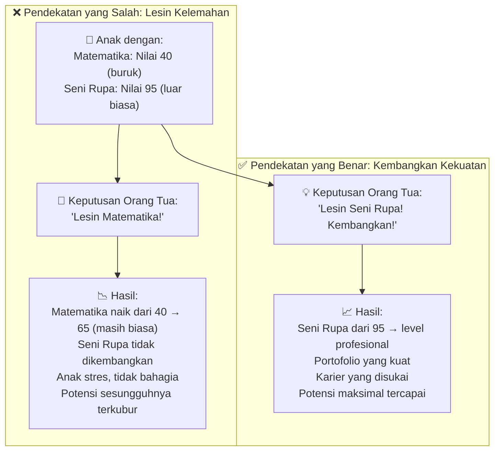

Perbandingan ini sangat sederhana namun sangat sering diabaikan. **Ketika kamu melihat anak memiliki nilai yang menonjol di satu bidang, itu adalah sinyal dari mana bakat dan passion mereka berasal.** Mengapa justru fokus pada kelemahan?

Konsep ini sebenarnya sudah lama dikenal dalam dunia psikologi positif (*positive psychology*) — bahwa orang mencapai performa terbaik mereka bukan dengan menutupi kelemahan, tapi dengan **memaksimalkan kekuatan (*strengths*)**. Seorang Lionel Messi tidak pernah berlatih bermain basket untuk menutupi kelemahannya — ia fokus total pada sepak bola, bidang di mana ia sudah menunjukkan bakat luar biasa sejak kecil.

> *"Kalau nilainya bagus di seni, kenapa yang di-les-kan matematika? Kamu mendukung apa yang anak tidak bisa, padahal harusnya kamu mendukung apa yang anak mampu."*

Ini juga berkaitan dengan insight yang lebih dalam tentang bagaimana sekolah mengabaikan **kecerdasan majemuk** (*multiple intelligences*) — teori Howard Gardner yang menyatakan bahwa kecerdasan manusia tidak hanya satu dimensi (IQ), tapi setidaknya ada 8 jenis kecerdasan berbeda: linguistik, logis-matematis, musikal, visual-spasial, kinestetik, interpersonal, intrapersonal, dan naturalis.

Sekolah tradisional hanya menghargai dua jenis kecerdasan: **linguistik dan logis-matematis**. Semua yang lain dianggap "bukan pelajaran utama".

---

## Bagian VI: PR adalah Bukti Guru Tidak Mengajar dengan Baik 📚

Ini adalah argumen yang terdengar mengejutkan tapi sulit dibantah:

> *"Pekerjaan Rumah (PR) adalah penjelasan bahwa guru tidak bisa mengajarkan dengan baik. Jika dia menerangkan dengan baik, dia tidak butuh PR."*

Pikirkan logikanya: **mengapa ada PR?** Karena materi yang tidak selesai diajarkan di sekolah dibawa pulang ke rumah. Karena guru membutuhkan bantuan orang tua untuk memperkuat pemahaman anak. Karena 6-8 jam di sekolah tidak cukup untuk "menuntaskan" kurikulum.

Tapi apakah ini bukan tanda bahwa ada yang salah dengan efisiensi pengajaran di sekolah?

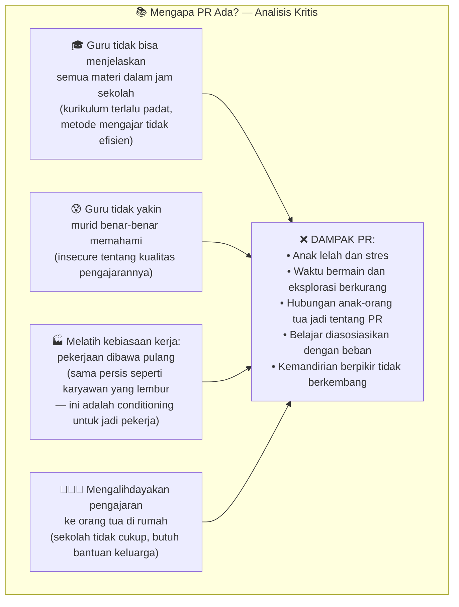

Bandingkan dengan konsep kerja modern: banyak perusahaan startup dan tech company terbaik di dunia menerapkan prinsip **"no overtime culture"** — kamu bekerja selama jam kerja, kamu menyelesaikan tugasmu, lalu kamu pulang dan hidupmu adalah milikmu. Hasilnya? Produktivitas justru meningkat karena orang tidak kelelahan.

PR adalah pelatihan untuk *overtime culture*. Dan kita mulai melatihnya sejak anak berusia 7 tahun.

---

## Bagian VII: Perbedaan Pendidikan vs Sekolah 🌱

Di sinilah letak nuansa yang paling penting dan paling sering terlewat dalam perdebatan ini.

**Sekolah** adalah sebuah *sistem* — sebuah institusi dengan struktur, kurikulum, ujian, ranking, dan kalender akademik. Ia adalah konteks.

**Pendidikan** adalah sesuatu yang jauh lebih luas — proses pembelajaran sepanjang hayat yang bisa terjadi di mana saja, kapan saja, dan dari siapa saja.

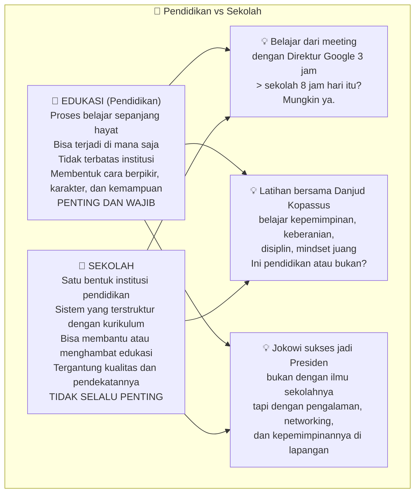

Jadi ketika dikatakan *"sekolah tidak penting"*, yang dimaksud bukan *"jangan sekolah"*. Yang dimaksud adalah: **jangan jadikan sekolah sebagai satu-satunya sumber pendidikan**. Jangan percaya bahwa nilai rapor adalah satu-satunya ukuran kecerdasan. Jangan izinkan sekolah membunuh rasa ingin tahu, kreativitas, dan semangat belajar anak.

Sekolah memiliki nilai penting yang nyata: **lingkungan sosial, disiplin dasar, dan beberapa pengetahuan fundamental**. Anak yang tumbuh di lingkungan sekolah internasional mendapatkan eksposur terhadap teman-teman dari berbagai latar belakang, membangun jaringan global sejak dini.

Tapi sekolah tidak bisa dan tidak seharusnya menjadi *satu-satunya* tempat anak belajar. Orang tua punya tanggung jawab untuk mengisi celah yang tidak bisa atau tidak mau diisi oleh sekolah.

<Callout type="info" title="Ketika Aska Belajar dari Meeting Direktur Google">
Ada ilustrasi yang sangat konkret: seorang anak yang bolos sekolah satu hari untuk ikut pertemuan bisnis dengan Direktur Google selama 3 jam. Pertanyaannya: mana yang lebih berharga — 8 jam sekolah hari itu, atau 3 jam observasi langsung terhadap bagaimana seorang pemimpin perusahaan teknologi terbesar di dunia berpikir, berbicara, dan mengambil keputusan? Ini bukan pembenaran untuk bolos. Ini adalah pertanyaan tentang *di mana pembelajaran yang paling bermakna terjadi*.
</Callout>

---

## Bagian VIII: Nasionalisme yang Hilang dari Sekolah Internasional 🇮🇩

Ada ironi menarik yang disinggung: sekolah internasional yang bagus secara akademis sering kali gagal mengajarkan satu hal yang fundamental — **rasa cinta dan kebanggaan terhadap bangsa sendiri**.

Anak yang bersekolah di sekolah internasional mungkin fasih berbahasa Inggris, mengenal sejarah Amerika dan Eropa, tapi tidak tahu kisah heroik Pangeran Diponegoro yang kursinya tercakar karena ia dikhianati Belanda — padahal Belanda selama ini tidak pernah bisa menangkapnya dengan cara militer biasa.

Tidak tahu kisah Si Pitung dari Betawi yang jasadnya harus dipotong-potong dan diseret kuda oleh Belanda karena mereka percaya ia kebal senjata — dan mereka ketakutan bahwa mitos itu akan menginspirasi perlawanan lebih besar.

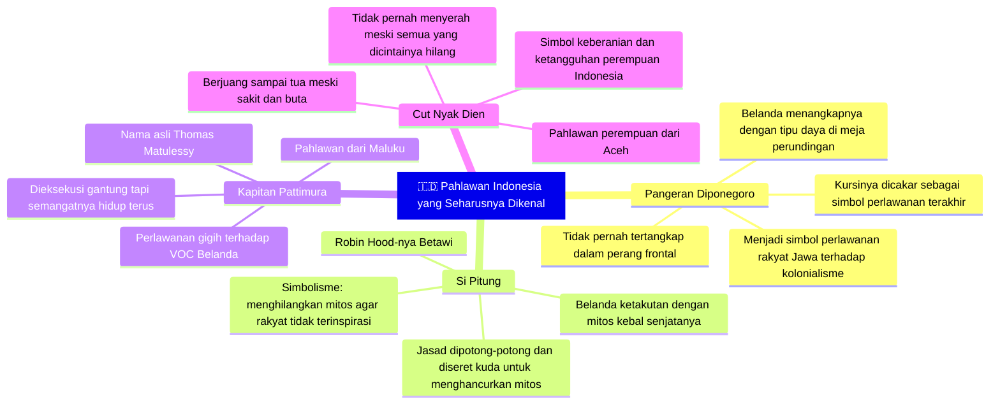

Bagaimana kita bisa mencintai bangsa ini jika kita tidak tahu siapa yang telah berjuang untuk merdeka? Bagaimana generasi selanjutnya bisa menghargai kemerdekaan jika mereka tidak diceritakan dengan cara yang hidup dan penuh semangat tentang harga yang dibayar untuk itu?

Ini adalah salah satu tanggung jawab yang tidak bisa diserahkan sepenuhnya kepada sekolah — terutama sekolah internasional yang kurikulumnya berorientasi global. **Orang tua yang mendaftarkan anaknya ke sekolah internasional punya tanggung jawab tambahan untuk mengajarkan sejarah dan identitas nasional di rumah.**

---

## Bagian IX: Apa yang Seharusnya Diajarkan Orang Tua — Terutama untuk Anak Laki-laki 💪

Bagian ini memasuki wilayah yang lebih personal: bukan sekadar kritik terhadap sistem, tapi **apa yang harus dilakukan**. Apa yang seharusnya orang tua ajarkan kepada anak-anaknya — terutama anak laki-laki — yang tidak akan pernah ada di dalam kurikulum sekolah manapun?

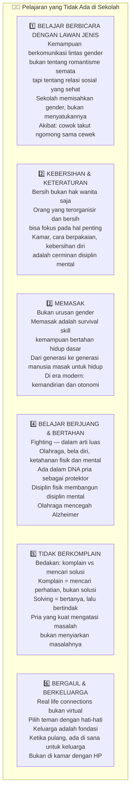

### 4️⃣ Tentang Berjuang: DNA yang Tidak Boleh Dihilangkan

Ada insight yang sangat menarik tentang mengapa pria perlu belajar berjuang — dalam arti harfiah maupun metaforis. Secara evolusi, selama ribuan tahun, pria berperan sebagai protektor (*pelindung*) sukunya. Bukan hanya secara fisik, tapi juga secara mental: menghadapi tantangan, tidak menyerah, melindungi yang lemah.

Ini bukan tentang toxic masculinity atau kekerasan — ini tentang **keberanian, ketahanan, dan tanggung jawab**. Sifat-sifat inilah yang membuat seorang pria bisa menjadi andalan bagi keluarganya, timnya, dan komunitasnya.

Menariknya, ada hubungan yang tidak intuitif antara pekerjaan/aktivitas fisik dengan **Alzheimer** (*kepikunan*). Salah satu faktor risiko tertinggi Alzheimer adalah ketidakaktifan — baik fisik maupun mental. Orang yang terus aktif bekerja dan berolahraga, otaknya tetap tajam lebih lama. Sebaliknya, pensiun dini dan hidup pasif adalah resep paling cepat untuk mengundang Alzheimer.

### 5️⃣ Seni Tidak Berkomplain: Hormon Kortisol dan Serotonin

Ini adalah insight berbasis neurosains (*ilmu saraf*) yang sangat menarik:

Ketika kamu **mengeluh** (*berkomplain*) kepada banyak orang — terutama di media sosial — yang terjadi secara fisiologis adalah: **kortisol** (*hormon stres*) milikmu turun karena kamu merasa sudah "melepaskan" beban itu. Kamu mendapat serotonin sementara dari rasa diperhatikan.

Tapi yang tidak kamu sadari: **kortisol orang yang mendengarkanmu naik**. Masalah yang tadinya bukan masalah mereka, sekarang jadi ikut dikepikir. Kamu mentransfer stresmu kepada orang lain.

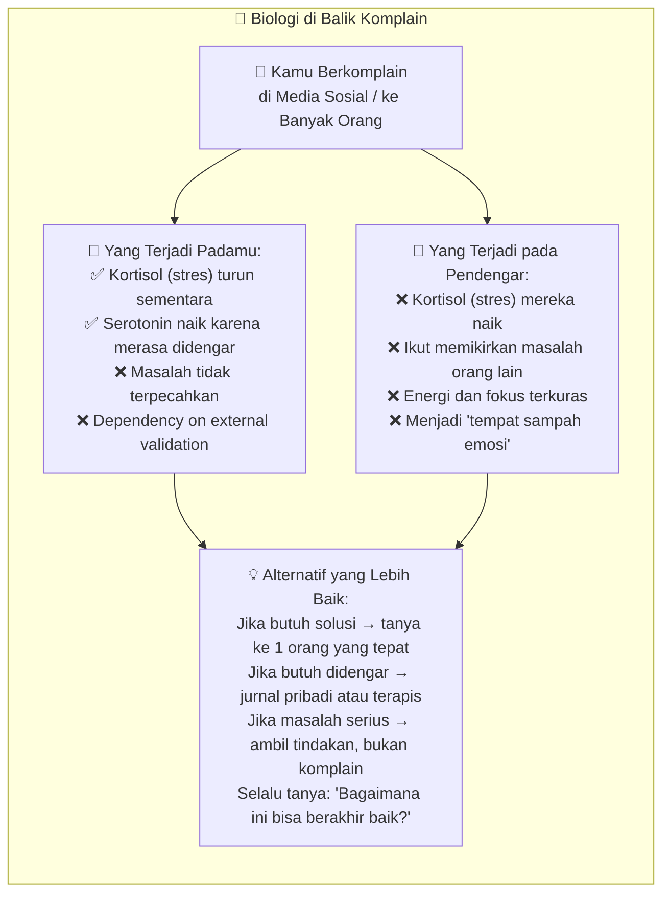

Ada perbedaan fundamental antara **berkomplain** dan **mencari penyelesaian**:

- **Berkomplain**: "Sekolahku PR-nya banyak, capek banget, nggak adil!" → mencari perhatian, tidak ada tindakan
- **Mencari solusi**: "PR-ku banyak. Aku pikir solusinya adalah mengerjakan ini dulu sambil mendengarkan podcast, terus sisanya besok pagi." → mencari jalan keluar

Yang pertama mengeringkan energi — baik energimu maupun energi orang di sekitarmu. Yang kedua membangun kapasitas problem-solving yang menjadi fondasi kesuksesan jangka panjang.

---

## Bagian X: Sistem Absensi adalah Training untuk Jadi Karyawan ⏰

Ada satu observasi yang sangat tajam tentang sistem absensi (*presensi*) di sekolah: **sistem absensi adalah latihan untuk menjadi karyawan**.

Di dunia kerja modern yang progresif, banyak perusahaan terbaik — terutama di industri teknologi — sudah beralih dari sistem absensi ketat ke sistem **berbasis hasil** (*result-based*). Yang dihargai bukan berapa jam kamu duduk di kantor, tapi **apa yang berhasil kamu selesaikan**.

Namun di sekolah, sistem absensi masih menjadi KPI (*Key Performance Indicator* — Indikator Kinerja Utama) utama. Datang = baik. Tidak datang = masalah. Tidak peduli apakah kamu belajar sesuatu atau tidak selama di sana.

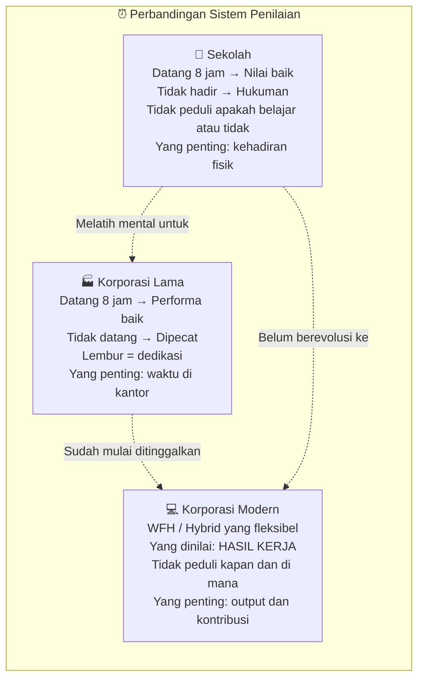

Paradoksnya: dunia kerja sendiri sudah mulai meninggalkan sistem yang diajarkan sekolah. Sementara sekolah belum berevolusi. Ini adalah *lag* (*ketinggalan*) yang sangat nyata antara pendidikan dan kebutuhan dunia nyata.

---

## Bagian XI: Melepaskan Anak — Filosofi Orang Tua yang Berani 🕊️

Ini adalah bagian yang paling personal dan paling emosional. Ada filosofi yang berani tentang bagaimana seharusnya orang tua mempersiapkan anak untuk hidup mandiri.

### Jika Kamu Tidak Kaya, Lepaskan Anakmu

Ini adalah pernyataan yang keras, tapi memiliki logika yang kuat:

> *"Jika Anda masih memikirkan minggu depan apa yang akan dimakan, biarkan anak Anda keluar dari rumah. Biarkan anak Anda belajar. Biarkan anak Anda mencapai cita-citanya. Jangan sudah miskin, masih mengatur-ngatur anak."*

Logikanya: jika kamu sendiri belum berhasil secara finansial, bagaimana kamu bisa mengajarkan anak tentang cara mencapai kesuksesan finansial? Orang yang belum pernah kaya tidak bisa mengajarkan cara menjadi kaya — itu bukan tentang informasi, tapi tentang **pengalaman hidup dan pola pikir yang terbentuk dari pengalaman itu**.

Yang bisa dilakukan orang tua dalam kondisi seperti ini adalah **melepaskan** — membiarkan anak mencari guru-guru kehidupan yang lebih berpengalaman, bertemu mentor yang sudah melewati jalan yang ingin ditempuh anak, belajar dari orang-orang yang sudah berhasil.

Ini bukan tentang melepaskan tanggung jawab — ini tentang **kerendahan hati yang berani**: mengakui bahwa ada hal-hal yang tidak bisa kamu ajarkan, dan yang terbaik yang bisa kamu berikan adalah kebebasan bagi anak untuk menemukan jalannya.

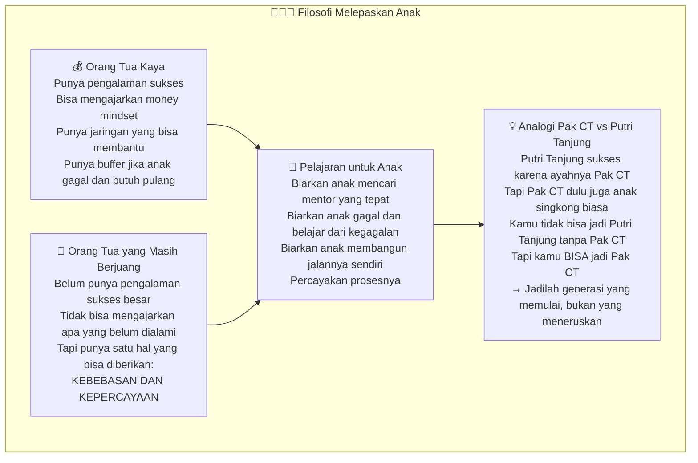

### Pesan tentang Kematian — Mengajarkan Kemandirian Sejak Dini

Ada satu hal yang tidak lazim tapi sangat penuh kasih sayang: **memberitahu anak bahwa orang tua tidak akan selalu ada**.

> *"Kamu harus tahu bahwa Saya tidak akan selalu ada di sana untuk Anda. Saya bisa mati besok. Saya bisa mati 20 tahun dari sekarang. Jadi kamu harus siap untuk hidup sendiri tanpa saya — tanpa bisa ngobrol sama saya, tanpa arahan dari saya."*

Ini bukan kalimat yang menakutkan anak. Ini adalah **hadiah kemandirian** (*the gift of independence*) — mempersiapkan anak untuk berdiri di atas kakinya sendiri, bukan bergantung selamanya pada orang tua.

Orang tua yang terlalu melindungi, terlalu mengatur, dan tidak pernah membiarkan anak menghadapi konsekuensi dari keputusannya sendiri — secara tidak sengaja sedang menciptakan anak yang tidak siap menghadapi dunia nyata.

---

## Bagian XII: Jadilah Pak CT, Bukan Putri Tanjung 👑

Ada analogi yang sangat cerdas dan sangat relevan untuk konteks Indonesia:

**Putri Tanjung** bisa sukses menjadi Komisaris dan pengusaha muda karena ayahnya adalah **Pak CT** (Chairul Tanjung) — salah satu konglomerat terbesar Indonesia. Sekolah di luar negeri yang bagus, jaringan yang luas, modal yang kuat — semua ada karena latar belakang keluarga.

Ini bukan kritik untuk Putri Tanjung. Ia dengan cerdas memanfaatkan kesempatan yang ada dan membuktikan dirinya kompeten. Tapi realitasnya adalah: mayoritas kita tidak lahir dari keluarga Pak CT.

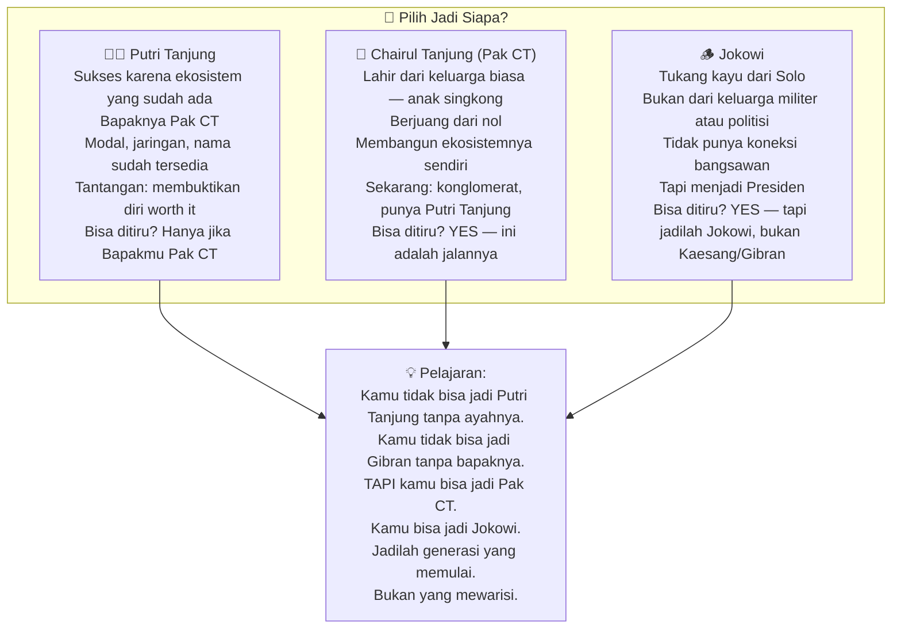

Ini adalah mindset yang sangat penting terutama bagi generasi muda yang seringkali terjebak dalam **comparison trap** (*jebakan perbandingan*) — membandingkan posisi mereka dengan posisi orang-orang yang memulai dari titik yang jauh berbeda.

Jangan bandingkan titik akhirmu dengan titik akhir orang yang memulai di titik 100, sementara kamu mulai dari titik 0. Yang harus dibandingkan adalah: seberapa jauh kamu sudah melangkah dari titik awalmu sendiri?

---

## Penutup: Sekolah Tidak Penting, tapi Pendidikan Sangat Penting 🌟

Mari kita kembali ke klaim awal: **sekolah tidak penting, tapi pendidikan sangat penting**.

Setelah perjalanan panjang ini, maknanya menjadi jauh lebih jelas:

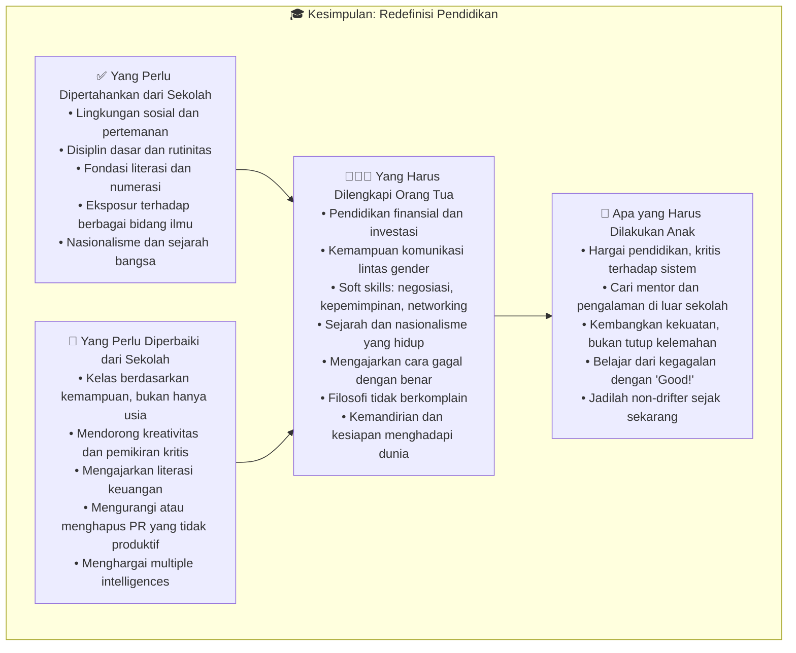

Sistem sekolah yang diciptakan Horace Mann pada abad ke-19 memang sudah tidak sepenuhnya relevan dengan tuntutan abad ke-21. Dunia yang membutuhkan kreativitas, kolaborasi, pemikiran kritis, dan adaptabilitas — tidak bisa dilayani oleh sistem yang dirancang untuk mencetak pekerja yang taat dan tidak banyak bertanya.

Tapi ini bukan alasan untuk meninggalkan pendidikan formal. Ini adalah panggilan untuk **mengambil tanggung jawab pendidikan secara lebih aktif** — sebagai orang tua, sebagai murid, sebagai masyarakat.

Yang paling penting adalah: **jangan biarkan sekolah menjadi satu-satunya guru dalam hidupmu**. Dunia penuh dengan guru-guru terbaik — dari buku, dari mentor, dari pengalaman langsung, dari kegagalan, dari perjalanan, dari percakapan dengan orang-orang yang lebih berhasil darimu.

Dan ingat: Jokowi adalah tukang kayu. Pak CT adalah anak singkong. Mereka tidak menunggu sistem yang sempurna. Mereka membangun diri mereka sendiri, dalam sistem yang ada, dengan segala keterbatasannya.

Kamu pun bisa.

---

*Artikel ini berkaitan erat dengan <WikiLink to="outwitting-the-devil-napoleon-hill-mengalahkan-iblis" label="Outwitting The Devil: Mengalahkan Iblis dalam Dirimu Sendiri" /> yang membahas bagaimana sistem sekolah adalah salah satu jalur Iblis untuk menciptakan 'drifter' — orang yang tidak bisa berpikir independen, serta <WikiLink to="ngaji-filsafat-379-socrates-mengenali-diri" label="Ngaji Filsafat 379: Socrates — Kenali Dirimu" /> yang mengeksplorasi mengapa mengenal dan mengembangkan diri sendiri adalah fondasi dari semua kebijaksanaan.*
